# Opinion Poll by Ipsos for Het Laatste Nieuws, Le Soir, RTL TVi and VTM, 2–10 September 2019

<a href="#voting-intentions">Voting Intentions</a> | <a href="#seats">Seats</a> | <a href="#coalitions">Coalitions</a> | <a href="#technical-information">Technical Information</a>

## Voting Intentions

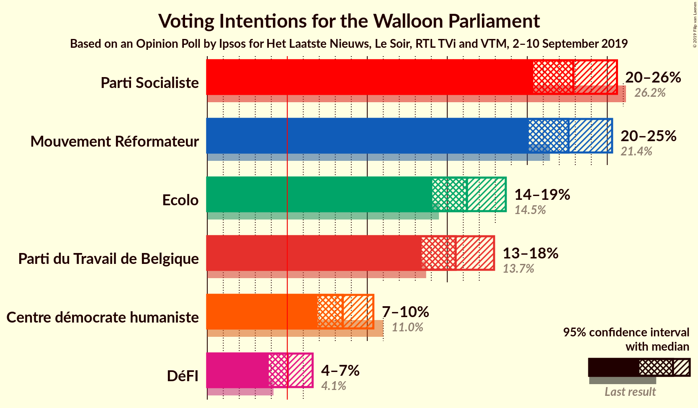

### Confidence Intervals

| Party | Last Result | Poll Result | 80% Confidence Interval | 90% Confidence Interval | 95% Confidence Interval | 99% Confidence Interval |
|:-----:|:-----------:|:-----------:|:-----------------------:|:-----------------------:|:-----------------------:|:-----------------------:|
| Parti Socialiste | 26.2% | 22.9% | 21.2–24.7% |20.8–25.2% |20.4–25.6% |19.6–26.5% |
| Mouvement Réformateur | 21.4% | 22.6% | 20.9–24.4% |20.5–24.9% |20.1–25.3% |19.3–26.2% |
| Ecolo | 14.5% | 16.2% | 14.8–17.8% |14.4–18.3% |14.1–18.7% |13.4–19.4% |
| Parti du Travail de Belgique | 13.7% | 15.5% | 14.1–17.1% |13.7–17.5% |13.4–17.9% |12.8–18.7% |
| Centre démocrate humaniste | 11.0% | 8.5% | 7.4–9.7% |7.1–10.1% |6.9–10.4% |6.4–11.0% |
| DéFI | 4.1% | 5.0% | 4.3–6.1% |4.0–6.3% |3.8–6.6% |3.5–7.1% |

*Note:* The poll result column reflects the actual value used in the calculations. Published results may vary slightly, and in addition be rounded to fewer digits.

## Seats

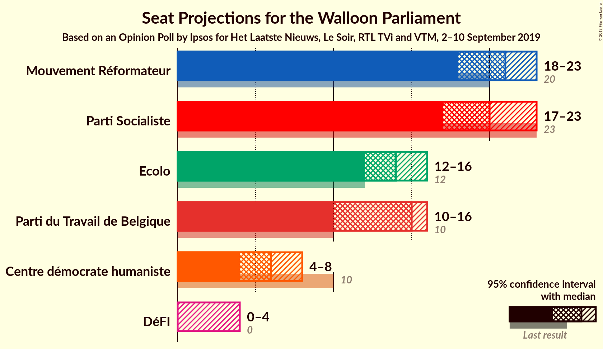

### Confidence Intervals

| Party | Last Result | Median | 80% Confidence Interval | 90% Confidence Interval | 95% Confidence Interval | 99% Confidence Interval |
|:-----:|:-----------:|:------:|:-----------------------:|:-----------------------:|:-----------------------:|:-----------------------:|
| <a href="#parti-socialiste">Parti Socialiste</a> | 23 | 20 | 19–22 |18–22 |17–23 |17–24 |
| <a href="#mouvement-réformateur">Mouvement Réformateur</a> | 20 | 21 | 19–21 |18–22 |18–23 |17–26 |
| <a href="#ecolo">Ecolo</a> | 12 | 14 | 13–15 |12–16 |12–16 |12–18 |
| <a href="#parti-du-travail-de-belgique">Parti du Travail de Belgique</a> | 10 | 15 | 10–15 |10–16 |10–16 |10–17 |
| <a href="#centre-démocrate-humaniste">Centre démocrate humaniste</a> | 10 | 6 | 5–7 |4–8 |4–8 |4–9 |
| <a href="#défi">DéFI</a> | 0 | 0 | 0–4 |0–4 |0–4 |0–5 |

### Parti Socialiste

*For a full overview of the results for this party, see the [Parti Socialiste](party-partisocialiste.html) page.*

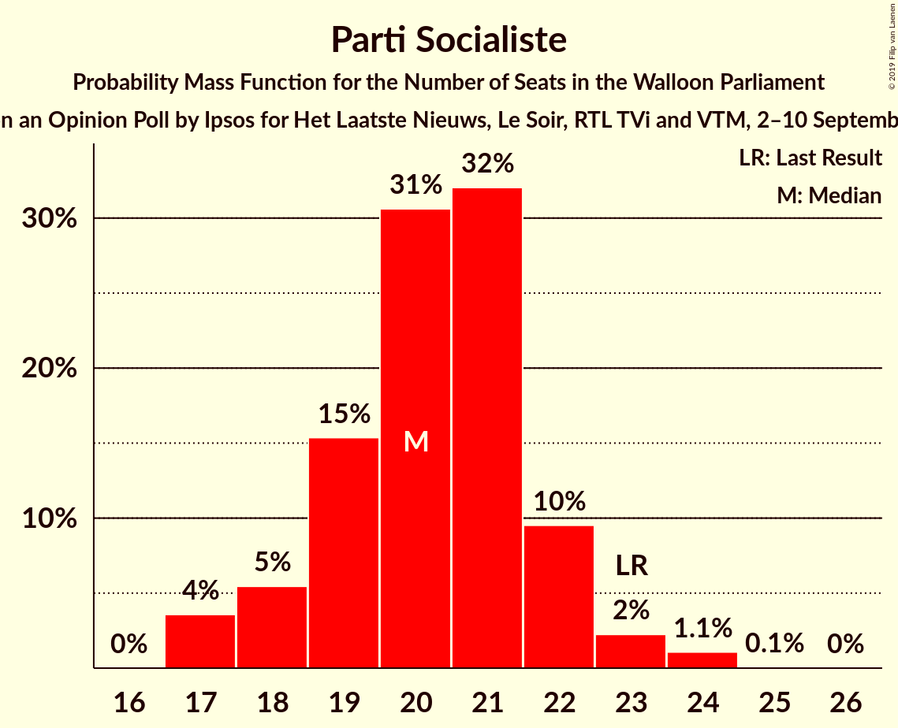

| Number of Seats | Probability | Accumulated | Special Marks |
|:---------------:|:-----------:|:-----------:|:-------------:|
| 17 | 4% | 100% |  |
| 18 | 5% | 96% |  |
| 19 | 15% | 91% |  |
| 20 | 31% | 76% | Median |
| 21 | 32% | 45% |  |
| 22 | 10% | 13% |  |
| 23 | 2% | 3% | Last Result |
| 24 | 1.1% | 1.2% |  |
| 25 | 0.1% | 0.1% |  |
| 26 | 0% | 0% |  |

### Mouvement Réformateur

*For a full overview of the results for this party, see the [Mouvement Réformateur](party-mouvementréformateur.html) page.*

| Number of Seats | Probability | Accumulated | Special Marks |
|:---------------:|:-----------:|:-----------:|:-------------:|
| 16 | 0.1% | 100% |  |
| 17 | 0.7% | 99.9% |  |
| 18 | 8% | 99.1% |  |
| 19 | 14% | 91% |  |
| 20 | 18% | 77% | Last Result |
| 21 | 50% | 59% | Median |
| 22 | 5% | 9% |  |
| 23 | 2% | 4% |  |
| 24 | 1.0% | 2% |  |
| 25 | 0.7% | 1.4% |  |
| 26 | 0.6% | 0.6% |  |
| 27 | 0% | 0% |  |

### Ecolo

*For a full overview of the results for this party, see the [Ecolo](party-ecolo.html) page.*

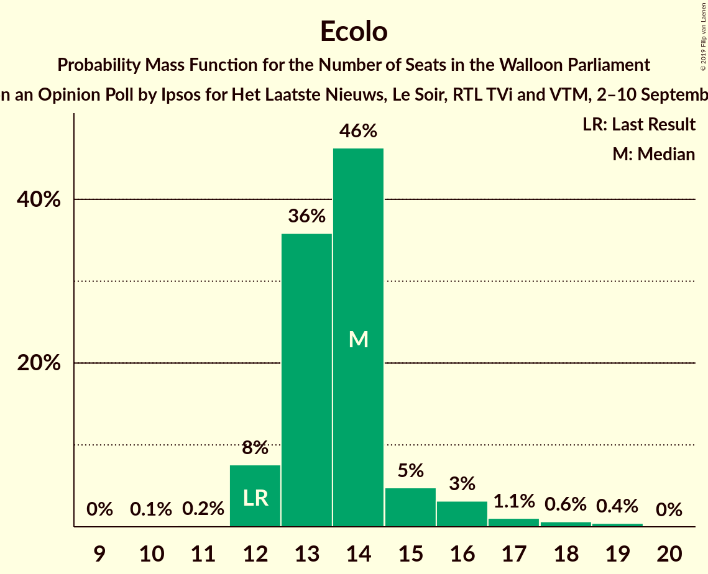

| Number of Seats | Probability | Accumulated | Special Marks |
|:---------------:|:-----------:|:-----------:|:-------------:|
| 10 | 0.1% | 100% |  |
| 11 | 0.2% | 99.9% |  |
| 12 | 8% | 99.8% | Last Result |
| 13 | 36% | 92% |  |
| 14 | 46% | 56% | Median |
| 15 | 5% | 10% |  |
| 16 | 3% | 5% |  |
| 17 | 1.1% | 2% |  |
| 18 | 0.6% | 1.1% |  |
| 19 | 0.4% | 0.4% |  |
| 20 | 0% | 0% |  |

### Parti du Travail de Belgique

*For a full overview of the results for this party, see the [Parti du Travail de Belgique](party-partidutravaildebelgique.html) page.*

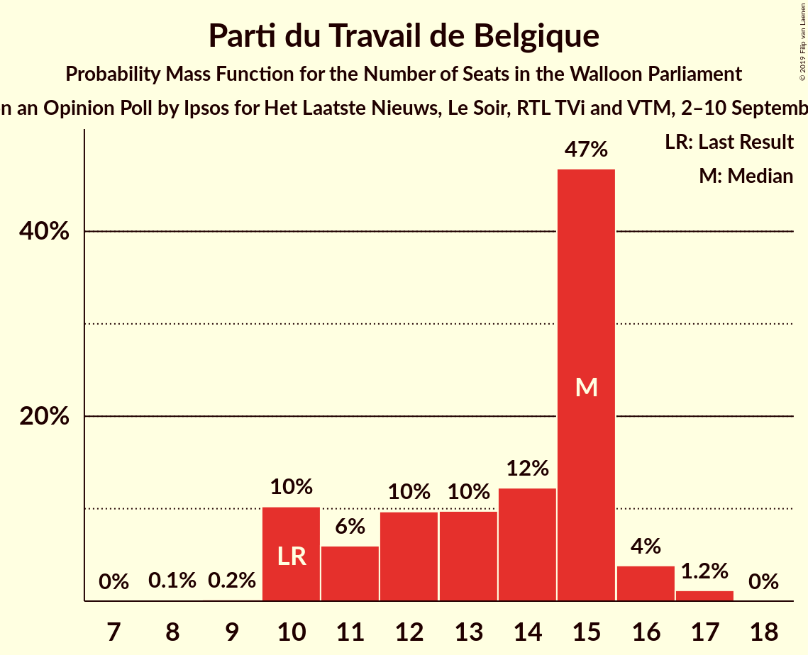

| Number of Seats | Probability | Accumulated | Special Marks |
|:---------------:|:-----------:|:-----------:|:-------------:|
| 8 | 0.1% | 100% |  |
| 9 | 0.2% | 99.9% |  |
| 10 | 10% | 99.7% | Last Result |
| 11 | 6% | 89% |  |
| 12 | 10% | 83% |  |
| 13 | 10% | 74% |  |
| 14 | 12% | 64% |  |
| 15 | 47% | 52% | Median |
| 16 | 4% | 5% |  |
| 17 | 1.2% | 1.2% |  |
| 18 | 0% | 0% |  |

### Centre démocrate humaniste

*For a full overview of the results for this party, see the [Centre démocrate humaniste](party-centredémocratehumaniste.html) page.*

| Number of Seats | Probability | Accumulated | Special Marks |
|:---------------:|:-----------:|:-----------:|:-------------:|
| 2 | 0.1% | 100% |  |
| 3 | 0.2% | 99.9% |  |
| 4 | 8% | 99.7% |  |
| 5 | 22% | 91% |  |
| 6 | 52% | 69% | Median |
| 7 | 9% | 17% |  |
| 8 | 8% | 9% |  |
| 9 | 0.7% | 1.2% |  |
| 10 | 0.5% | 0.5% | Last Result |
| 11 | 0% | 0% |  |

### DéFI

*For a full overview of the results for this party, see the [DéFI](party-défi.html) page.*

| Number of Seats | Probability | Accumulated | Special Marks |
|:---------------:|:-----------:|:-----------:|:-------------:|
| 0 | 65% | 100% | Last Result, Median |
| 1 | 6% | 35% |  |
| 2 | 3% | 28% |  |
| 3 | 10% | 26% |  |
| 4 | 14% | 16% |  |
| 5 | 2% | 2% |  |
| 6 | 0.1% | 0.1% |  |
| 7 | 0% | 0% |  |

## Coalitions

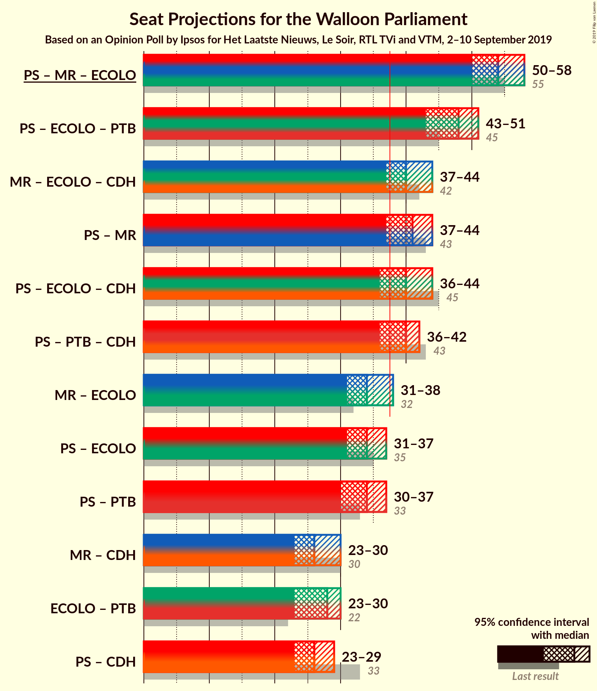

### Confidence Intervals

| Coalition | Last Result | Median | Majority? | 80% Confidence Interval | 90% Confidence Interval | 95% Confidence Interval | 99% Confidence Interval |
|:---------:|:-----------:|:------:|:---------:|:-----------------------:|:-----------------------:|:-----------------------:|:-----------------------:|
| Parti Socialiste – Mouvement Réformateur – Ecolo | 55 | 54 | 100% | 52–57 | 51–57 | 50–58 | 50–60 |
| Parti Socialiste – Ecolo – Parti du Travail de Belgique | 45 | 48 | 100% | 45–50 | 44–50 | 43–51 | 42–52 |
| Mouvement Réformateur – Ecolo – Centre démocrate humaniste | 42 | 40 | 93% | 38–42 | 37–43 | 37–44 | 36–45 |
| Parti Socialiste – Mouvement Réformateur | 43 | 41 | 96% | 38–43 | 38–43 | 37–44 | 36–46 |
| Parti Socialiste – Ecolo – Centre démocrate humaniste | 45 | 40 | 92% | 38–42 | 37–43 | 36–44 | 36–45 |
| Parti Socialiste – Parti du Travail de Belgique – Centre démocrate humaniste | 43 | 40 | 86% | 37–42 | 36–42 | 36–42 | 35–43 |
| Mouvement Réformateur – Ecolo | 32 | 34 | 3% | 32–36 | 32–37 | 31–38 | 30–40 |
| Parti Socialiste – Ecolo | 35 | 34 | 2% | 32–36 | 31–36 | 31–37 | 30–39 |
| Parti Socialiste – Parti du Travail de Belgique | 33 | 34 | 0.9% | 31–36 | 30–37 | 30–37 | 28–38 |
| Mouvement Réformateur – Centre démocrate humaniste | 30 | 26 | 0% | 24–28 | 24–29 | 23–30 | 22–31 |
| Ecolo – Parti du Travail de Belgique | 22 | 28 | 0% | 24–29 | 24–30 | 23–30 | 22–31 |
| Parti Socialiste – Centre démocrate humaniste | 33 | 26 | 0% | 24–28 | 24–29 | 23–29 | 22–31 |

### Parti Socialiste – Mouvement Réformateur – Ecolo

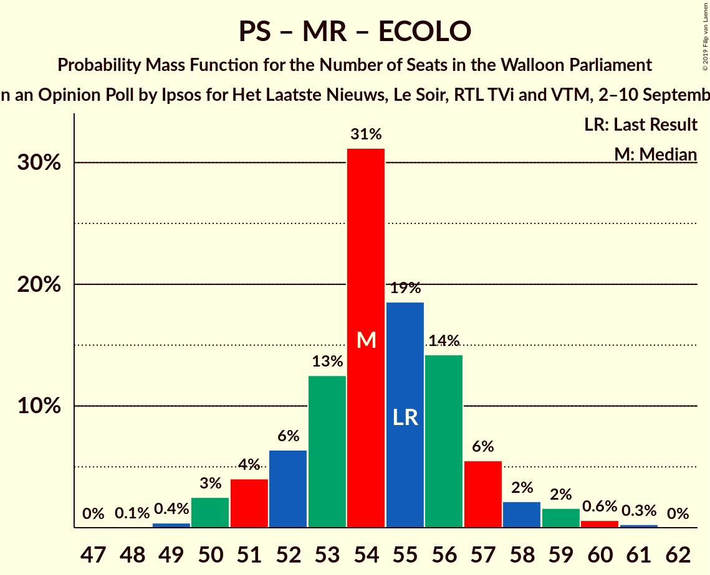

| Number of Seats | Probability | Accumulated | Special Marks |
|:---------------:|:-----------:|:-----------:|:-------------:|
| 48 | 0.1% | 100% |  |
| 49 | 0.4% | 99.9% |  |
| 50 | 3% | 99.5% |  |
| 51 | 4% | 97% |  |
| 52 | 6% | 93% |  |
| 53 | 13% | 87% |  |
| 54 | 31% | 74% |  |
| 55 | 19% | 43% | Last Result, Median |
| 56 | 14% | 24% |  |
| 57 | 6% | 10% |  |
| 58 | 2% | 5% |  |
| 59 | 2% | 2% |  |
| 60 | 0.6% | 0.9% |  |
| 61 | 0.3% | 0.3% |  |
| 62 | 0% | 0% |  |

### Parti Socialiste – Ecolo – Parti du Travail de Belgique

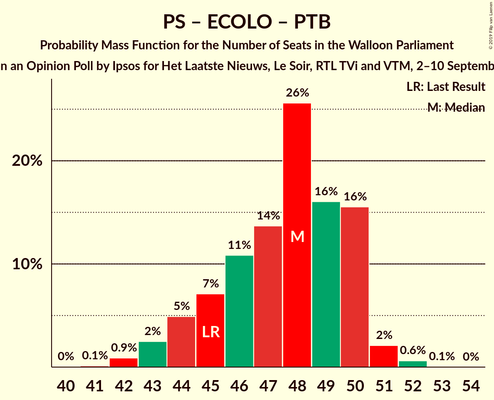

| Number of Seats | Probability | Accumulated | Special Marks |
|:---------------:|:-----------:|:-----------:|:-------------:|
| 41 | 0.1% | 100% |  |
| 42 | 0.9% | 99.9% |  |
| 43 | 2% | 99.0% |  |
| 44 | 5% | 96% |  |
| 45 | 7% | 92% | Last Result |
| 46 | 11% | 84% |  |
| 47 | 14% | 74% |  |
| 48 | 26% | 60% |  |
| 49 | 16% | 34% | Median |
| 50 | 16% | 18% |  |
| 51 | 2% | 3% |  |
| 52 | 0.6% | 0.7% |  |
| 53 | 0.1% | 0.1% |  |
| 54 | 0% | 0% |  |

### Mouvement Réformateur – Ecolo – Centre démocrate humaniste

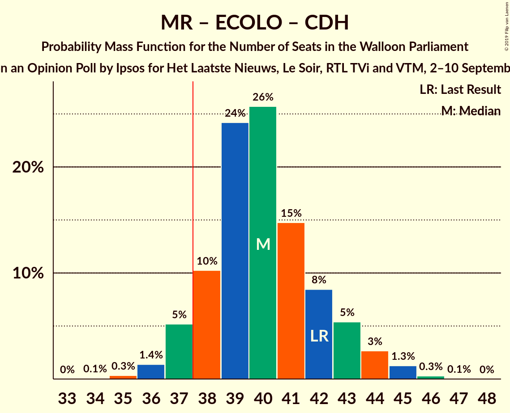

| Number of Seats | Probability | Accumulated | Special Marks |
|:---------------:|:-----------:|:-----------:|:-------------:|
| 34 | 0.1% | 100% |  |
| 35 | 0.3% | 99.9% |  |
| 36 | 1.4% | 99.6% |  |
| 37 | 5% | 98% |  |
| 38 | 10% | 93% | Majority |
| 39 | 24% | 83% |  |
| 40 | 26% | 59% |  |
| 41 | 15% | 33% | Median |
| 42 | 8% | 18% | Last Result |
| 43 | 5% | 10% |  |
| 44 | 3% | 4% |  |
| 45 | 1.3% | 2% |  |
| 46 | 0.3% | 0.4% |  |
| 47 | 0.1% | 0.1% |  |
| 48 | 0% | 0% |  |

### Parti Socialiste – Mouvement Réformateur

| Number of Seats | Probability | Accumulated | Special Marks |
|:---------------:|:-----------:|:-----------:|:-------------:|
| 35 | 0.3% | 100% |  |
| 36 | 0.8% | 99.7% |  |
| 37 | 3% | 98.9% |  |
| 38 | 7% | 96% | Majority |
| 39 | 10% | 89% |  |
| 40 | 19% | 79% |  |
| 41 | 33% | 60% | Median |
| 42 | 17% | 28% |  |
| 43 | 7% | 11% | Last Result |
| 44 | 2% | 4% |  |
| 45 | 0.9% | 2% |  |
| 46 | 0.8% | 1.1% |  |
| 47 | 0.3% | 0.3% |  |
| 48 | 0% | 0% |  |

### Parti Socialiste – Ecolo – Centre démocrate humaniste

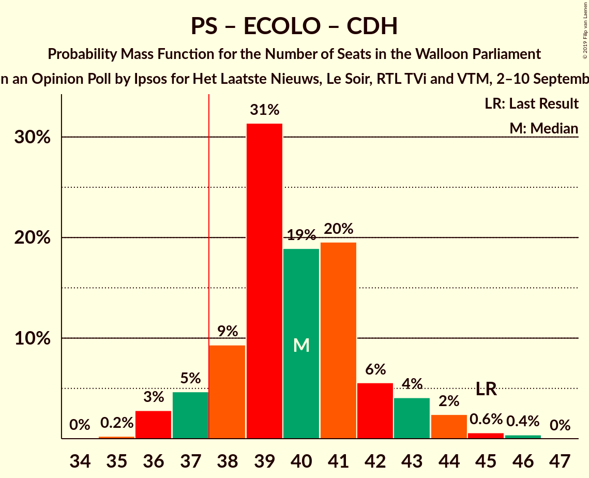

| Number of Seats | Probability | Accumulated | Special Marks |
|:---------------:|:-----------:|:-----------:|:-------------:|
| 35 | 0.2% | 100% |  |
| 36 | 3% | 99.7% |  |
| 37 | 5% | 97% |  |
| 38 | 9% | 92% | Majority |
| 39 | 31% | 83% |  |
| 40 | 19% | 52% | Median |
| 41 | 20% | 33% |  |
| 42 | 6% | 13% |  |
| 43 | 4% | 7% |  |
| 44 | 2% | 3% |  |
| 45 | 0.6% | 1.0% | Last Result |
| 46 | 0.4% | 0.4% |  |
| 47 | 0% | 0% |  |

### Parti Socialiste – Parti du Travail de Belgique – Centre démocrate humaniste

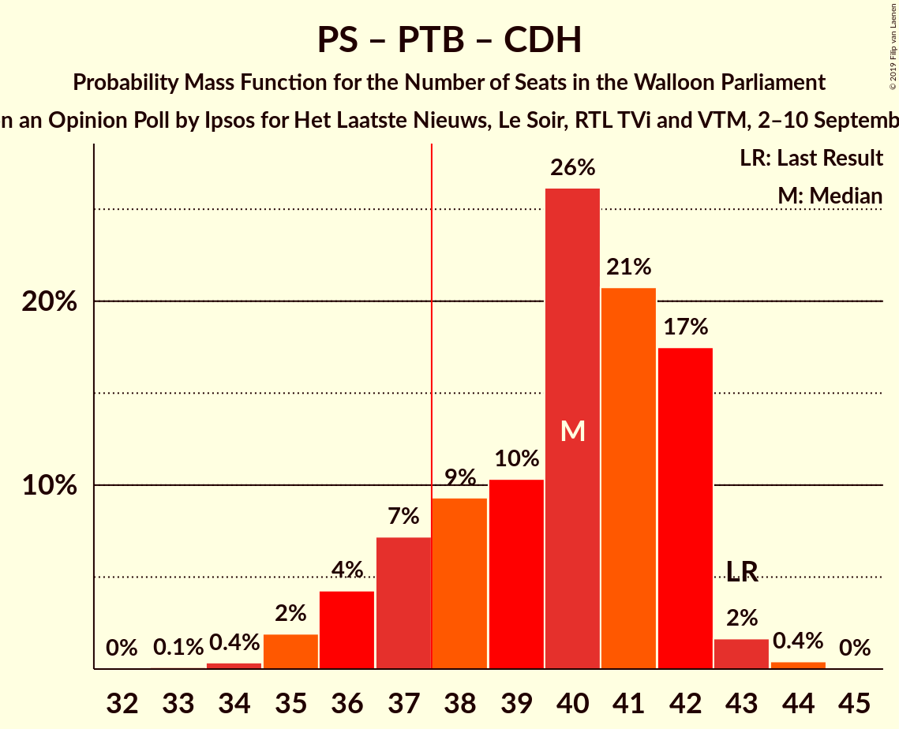

| Number of Seats | Probability | Accumulated | Special Marks |
|:---------------:|:-----------:|:-----------:|:-------------:|
| 33 | 0.1% | 100% |  |
| 34 | 0.4% | 99.9% |  |
| 35 | 2% | 99.5% |  |
| 36 | 4% | 98% |  |
| 37 | 7% | 93% |  |
| 38 | 9% | 86% | Majority |
| 39 | 10% | 77% |  |
| 40 | 26% | 67% |  |
| 41 | 21% | 40% | Median |
| 42 | 17% | 20% |  |
| 43 | 2% | 2% | Last Result |
| 44 | 0.4% | 0.5% |  |
| 45 | 0% | 0% |  |

### Mouvement Réformateur – Ecolo

| Number of Seats | Probability | Accumulated | Special Marks |
|:---------------:|:-----------:|:-----------:|:-------------:|
| 29 | 0.2% | 100% |  |
| 30 | 0.8% | 99.8% |  |
| 31 | 4% | 99.0% |  |
| 32 | 7% | 95% | Last Result |
| 33 | 24% | 89% |  |
| 34 | 25% | 65% |  |
| 35 | 28% | 39% | Median |
| 36 | 5% | 12% |  |
| 37 | 3% | 7% |  |
| 38 | 2% | 3% | Majority |
| 39 | 1.0% | 2% |  |
| 40 | 0.6% | 0.6% |  |
| 41 | 0% | 0% |  |

### Parti Socialiste – Ecolo

| Number of Seats | Probability | Accumulated | Special Marks |
|:---------------:|:-----------:|:-----------:|:-------------:|
| 29 | 0.1% | 100% |  |
| 30 | 2% | 99.9% |  |
| 31 | 3% | 98% |  |
| 32 | 12% | 95% |  |
| 33 | 24% | 83% |  |
| 34 | 20% | 59% | Median |
| 35 | 26% | 38% | Last Result |
| 36 | 7% | 12% |  |
| 37 | 3% | 5% |  |
| 38 | 1.5% | 2% | Majority |
| 39 | 0.3% | 0.6% |  |
| 40 | 0.3% | 0.3% |  |
| 41 | 0% | 0% |  |

### Parti Socialiste – Parti du Travail de Belgique

| Number of Seats | Probability | Accumulated | Special Marks |
|:---------------:|:-----------:|:-----------:|:-------------:|
| 27 | 0.1% | 100% |  |
| 28 | 0.5% | 99.9% |  |
| 29 | 1.3% | 99.4% |  |
| 30 | 4% | 98% |  |
| 31 | 8% | 94% |  |
| 32 | 10% | 86% |  |
| 33 | 12% | 76% | Last Result |
| 34 | 16% | 64% |  |
| 35 | 23% | 47% | Median |
| 36 | 19% | 24% |  |
| 37 | 4% | 5% |  |
| 38 | 0.8% | 0.9% | Majority |
| 39 | 0% | 0% |  |

### Mouvement Réformateur – Centre démocrate humaniste

| Number of Seats | Probability | Accumulated | Special Marks |
|:---------------:|:-----------:|:-----------:|:-------------:|
| 21 | 0.1% | 100% |  |
| 22 | 0.7% | 99.9% |  |
| 23 | 2% | 99.2% |  |
| 24 | 8% | 97% |  |
| 25 | 22% | 89% |  |
| 26 | 20% | 67% |  |
| 27 | 28% | 47% | Median |
| 28 | 9% | 19% |  |
| 29 | 6% | 10% |  |
| 30 | 2% | 3% | Last Result |
| 31 | 0.7% | 1.2% |  |
| 32 | 0.4% | 0.5% |  |
| 33 | 0.1% | 0.1% |  |
| 34 | 0% | 0% |  |

### Ecolo – Parti du Travail de Belgique

| Number of Seats | Probability | Accumulated | Special Marks |
|:---------------:|:-----------:|:-----------:|:-------------:|
| 22 | 0.7% | 100% | Last Result |
| 23 | 4% | 99.3% |  |
| 24 | 6% | 95% |  |
| 25 | 8% | 90% |  |
| 26 | 9% | 82% |  |
| 27 | 16% | 73% |  |
| 28 | 28% | 57% |  |
| 29 | 22% | 29% | Median |
| 30 | 5% | 7% |  |
| 31 | 1.3% | 2% |  |
| 32 | 0.4% | 0.5% |  |
| 33 | 0.1% | 0.1% |  |
| 34 | 0% | 0% |  |

### Parti Socialiste – Centre démocrate humaniste

| Number of Seats | Probability | Accumulated | Special Marks |
|:---------------:|:-----------:|:-----------:|:-------------:|
| 21 | 0.1% | 100% |  |
| 22 | 1.0% | 99.9% |  |
| 23 | 3% | 98.9% |  |
| 24 | 7% | 96% |  |
| 25 | 21% | 88% |  |
| 26 | 27% | 67% | Median |
| 27 | 27% | 41% |  |
| 28 | 6% | 13% |  |
| 29 | 4% | 7% |  |
| 30 | 2% | 2% |  |
| 31 | 0.8% | 0.9% |  |
| 32 | 0.1% | 0.2% |  |
| 33 | 0% | 0% | Last Result |

## Technical Information

### Opinion Poll

+ **Polling firm:** Ipsos
+ **Commissioner(s):** Het Laatste Nieuws, Le Soir, RTL TVi and VTM
+ **Fieldwork period:** 2–10 September 2019

### Calculations

+ **Sample size:** 992
+ **Simulations done:** 1,048,576
+ **Error estimate:** 1.22%

