# Opinion Poll by Ipsos for Het Laatste Nieuws, Le Soir, RTL TVi and VTM, 4–9 March 2020

<a href="#voting-intentions">Voting Intentions</a> | <a href="#seats">Seats</a> | <a href="#coalitions">Coalitions</a> | <a href="#technical-information">Technical Information</a>

## Voting Intentions

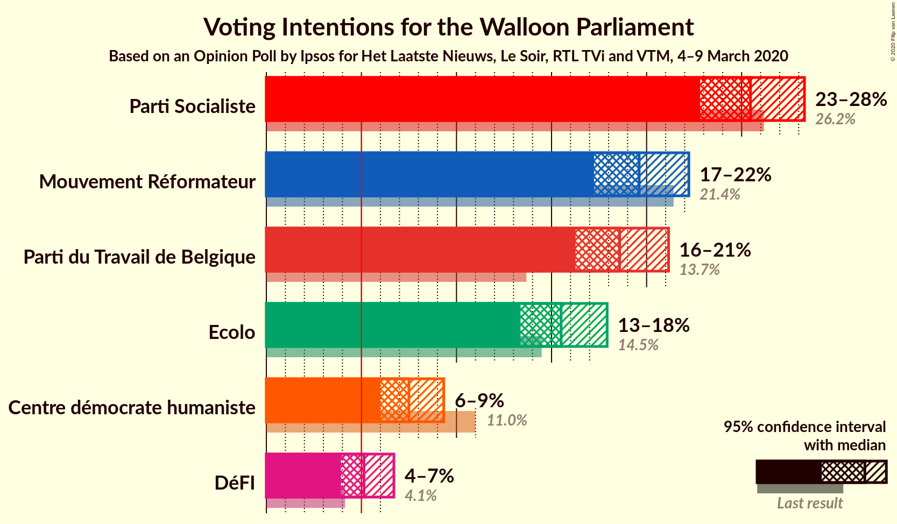

### Confidence Intervals

| Party | Last Result | Poll Result | 80% Confidence Interval | 90% Confidence Interval | 95% Confidence Interval | 99% Confidence Interval |
|:-----:|:-----------:|:-----------:|:-----------------------:|:-----------------------:|:-----------------------:|:-----------------------:|
| Parti Socialiste | 26.2% | 25.5% | 23.7–27.3% |23.2–27.8% |22.8–28.3% |22.0–29.2% |
| Mouvement Réformateur | 21.4% | 19.6% | 18.0–21.3% |17.6–21.8% |17.2–22.2% |16.5–23.1% |
| Parti du Travail de Belgique | 13.7% | 18.6% | 17.1–20.3% |16.6–20.7% |16.3–21.2% |15.6–22.0% |
| Ecolo | 14.5% | 15.5% | 14.1–17.1% |13.7–17.5% |13.4–17.9% |12.7–18.7% |
| Centre démocrate humaniste | 11.0% | 7.5% | 6.5–8.7% |6.2–9.0% |6.0–9.3% |5.6–9.9% |
| DéFI | 4.1% | 5.1% | 4.3–6.2% |4.1–6.4% |3.9–6.7% |3.6–7.2% |

*Note:* The poll result column reflects the actual value used in the calculations. Published results may vary slightly, and in addition be rounded to fewer digits.

## Seats

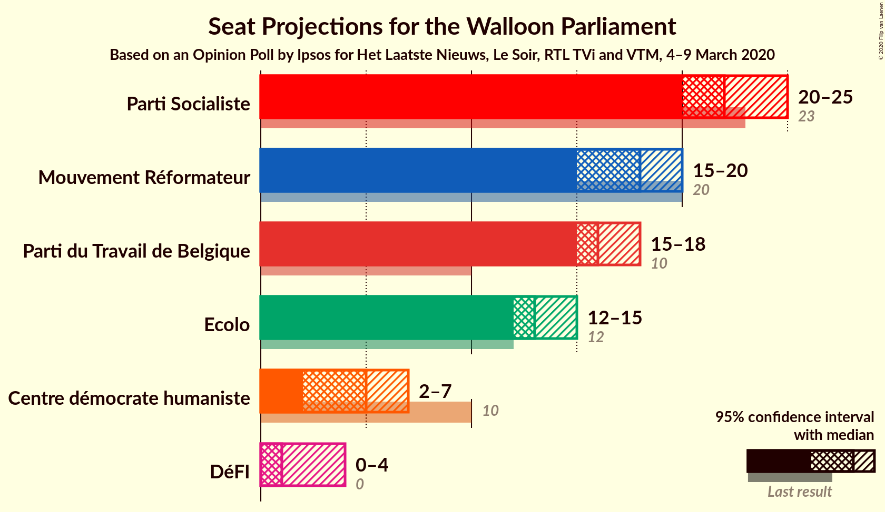

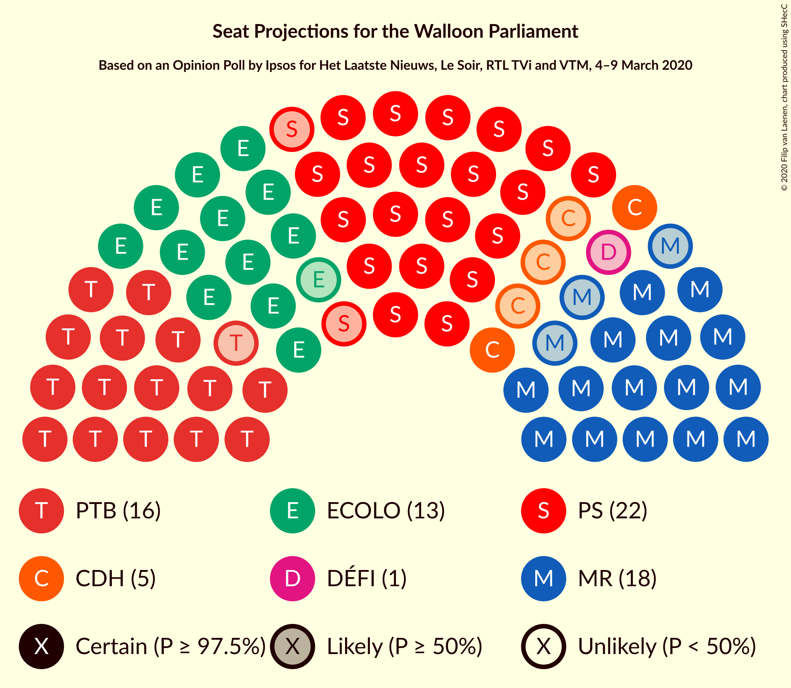

### Confidence Intervals

| Party | Last Result | Median | 80% Confidence Interval | 90% Confidence Interval | 95% Confidence Interval | 99% Confidence Interval |
|:-----:|:-----------:|:------:|:-----------------------:|:-----------------------:|:-----------------------:|:-----------------------:|
| <a href="#parti-socialiste">Parti Socialiste</a> | 23 | 22 | 20–24 |20–24 |20–25 |19–27 |
| <a href="#mouvement-réformateur">Mouvement Réformateur</a> | 20 | 18 | 15–19 |15–20 |15–20 |14–21 |
| <a href="#parti-du-travail-de-belgique">Parti du Travail de Belgique</a> | 10 | 16 | 15–17 |15–18 |15–18 |14–20 |
| <a href="#ecolo">Ecolo</a> | 12 | 13 | 12–14 |12–15 |12–15 |11–16 |
| <a href="#centre-démocrate-humaniste">Centre démocrate humaniste</a> | 10 | 5 | 4–6 |3–6 |2–7 |2–7 |
| <a href="#défi">DéFI</a> | 0 | 1 | 0–4 |0–4 |0–4 |0–5 |

### Parti Socialiste

*For a full overview of the results for this party, see the [Parti Socialiste](party-partisocialiste.html) page.*

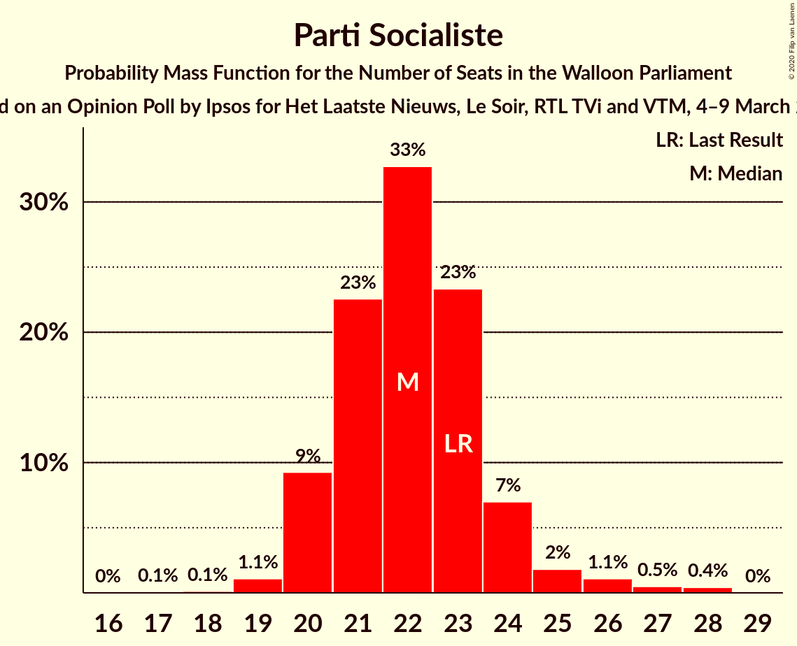

| Number of Seats | Probability | Accumulated | Special Marks |
|:---------------:|:-----------:|:-----------:|:-------------:|
| 17 | 0.1% | 100% |  |
| 18 | 0.1% | 99.9% |  |
| 19 | 1.1% | 99.8% |  |
| 20 | 9% | 98.7% |  |
| 21 | 23% | 89% |  |
| 22 | 33% | 67% | Median |
| 23 | 23% | 34% | Last Result |
| 24 | 7% | 11% |  |
| 25 | 2% | 4% |  |
| 26 | 1.1% | 2% |  |
| 27 | 0.5% | 0.9% |  |
| 28 | 0.4% | 0.4% |  |
| 29 | 0% | 0% |  |

### Mouvement Réformateur

*For a full overview of the results for this party, see the [Mouvement Réformateur](party-mouvementréformateur.html) page.*

| Number of Seats | Probability | Accumulated | Special Marks |
|:---------------:|:-----------:|:-----------:|:-------------:|
| 14 | 2% | 100% |  |
| 15 | 9% | 98% |  |
| 16 | 11% | 89% |  |
| 17 | 16% | 79% |  |
| 18 | 27% | 62% | Median |
| 19 | 28% | 35% |  |
| 20 | 6% | 7% | Last Result |
| 21 | 2% | 2% |  |
| 22 | 0% | 0% |  |

### Parti du Travail de Belgique

*For a full overview of the results for this party, see the [Parti du Travail de Belgique](party-partidutravaildebelgique.html) page.*

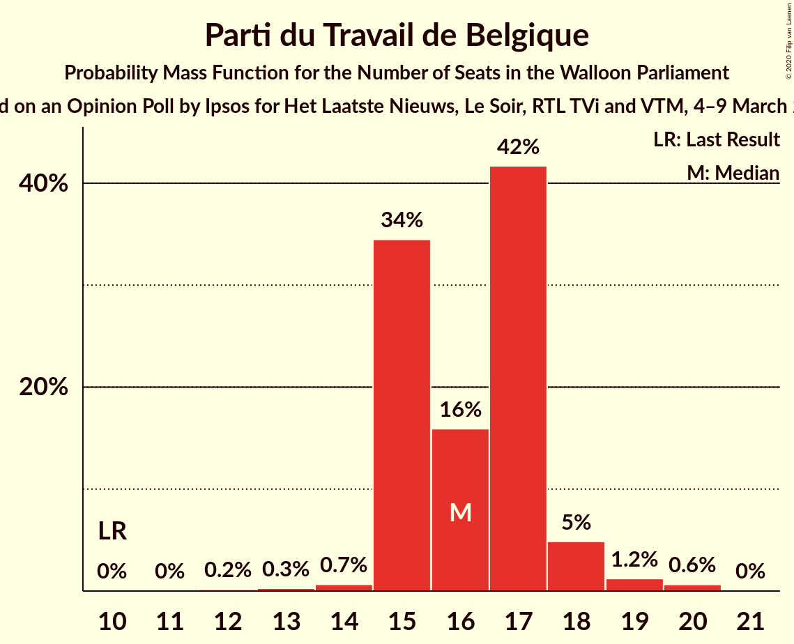

| Number of Seats | Probability | Accumulated | Special Marks |
|:---------------:|:-----------:|:-----------:|:-------------:|
| 10 | 0% | 100% | Last Result |
| 11 | 0% | 100% |  |
| 12 | 0.2% | 99.9% |  |
| 13 | 0.3% | 99.8% |  |
| 14 | 0.7% | 99.5% |  |
| 15 | 34% | 98.9% |  |
| 16 | 16% | 64% | Median |
| 17 | 42% | 48% |  |
| 18 | 5% | 7% |  |
| 19 | 1.2% | 2% |  |
| 20 | 0.6% | 0.7% |  |
| 21 | 0% | 0% |  |

### Ecolo

*For a full overview of the results for this party, see the [Ecolo](party-ecolo.html) page.*

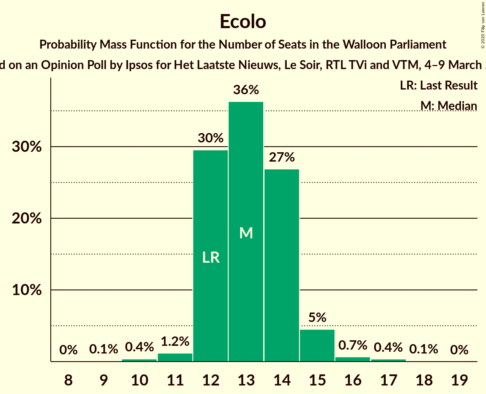

| Number of Seats | Probability | Accumulated | Special Marks |
|:---------------:|:-----------:|:-----------:|:-------------:|
| 9 | 0.1% | 100% |  |
| 10 | 0.4% | 99.9% |  |
| 11 | 1.2% | 99.5% |  |
| 12 | 30% | 98% | Last Result |
| 13 | 36% | 69% | Median |
| 14 | 27% | 33% |  |
| 15 | 5% | 6% |  |
| 16 | 0.7% | 1.1% |  |
| 17 | 0.4% | 0.5% |  |
| 18 | 0.1% | 0.1% |  |
| 19 | 0% | 0% |  |

### Centre démocrate humaniste

*For a full overview of the results for this party, see the [Centre démocrate humaniste](party-centredémocratehumaniste.html) page.*

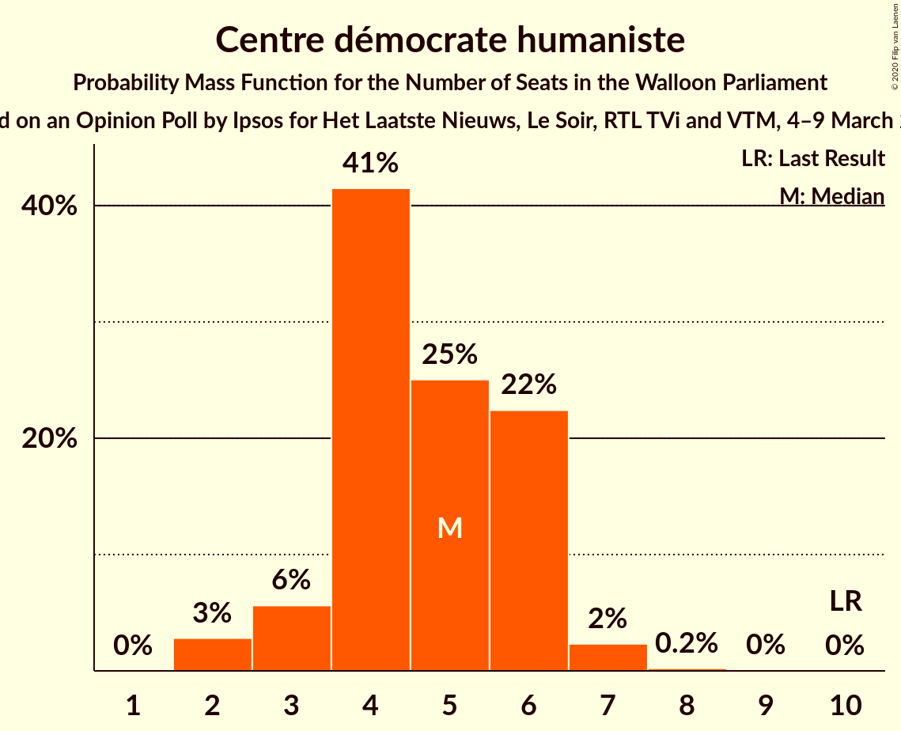

| Number of Seats | Probability | Accumulated | Special Marks |
|:---------------:|:-----------:|:-----------:|:-------------:|
| 2 | 3% | 100% |  |
| 3 | 6% | 97% |  |
| 4 | 41% | 92% |  |
| 5 | 25% | 50% | Median |
| 6 | 22% | 25% |  |
| 7 | 2% | 3% |  |
| 8 | 0.2% | 0.3% |  |
| 9 | 0% | 0.1% |  |
| 10 | 0% | 0% | Last Result |

### DéFI

*For a full overview of the results for this party, see the [DéFI](party-défi.html) page.*

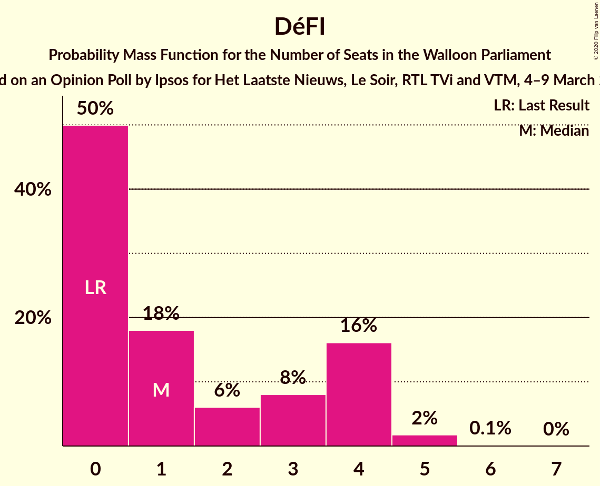

| Number of Seats | Probability | Accumulated | Special Marks |
|:---------------:|:-----------:|:-----------:|:-------------:|
| 0 | 50% | 100% | Last Result |
| 1 | 18% | 50% | Median |
| 2 | 6% | 32% |  |
| 3 | 8% | 26% |  |
| 4 | 16% | 18% |  |
| 5 | 2% | 2% |  |
| 6 | 0.1% | 0.1% |  |
| 7 | 0% | 0% |  |

## Coalitions

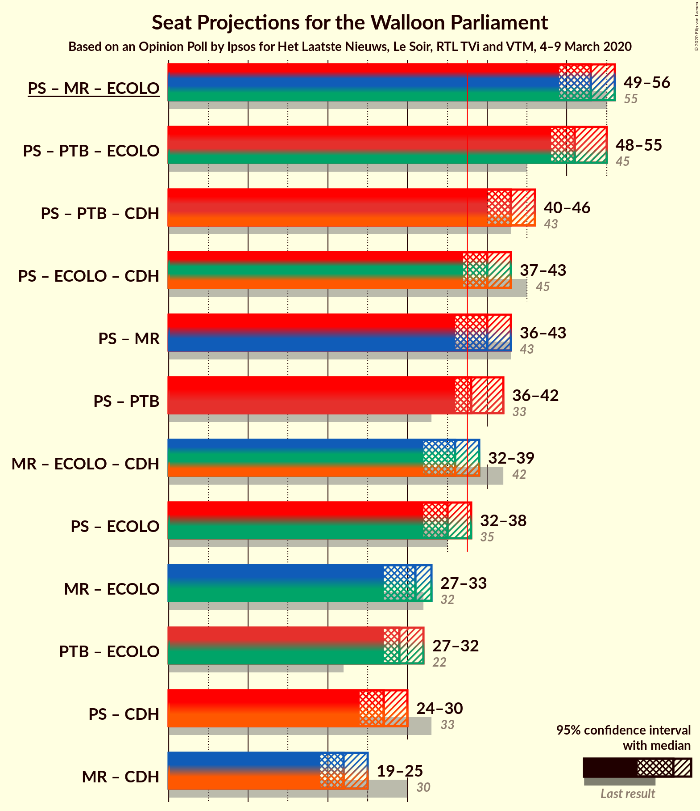

### Confidence Intervals

| Coalition | Last Result | Median | Majority? | 80% Confidence Interval | 90% Confidence Interval | 95% Confidence Interval | 99% Confidence Interval |
|:---------:|:-----------:|:------:|:---------:|:-----------------------:|:-----------------------:|:-----------------------:|:-----------------------:|
| Parti Socialiste – Mouvement Réformateur – Ecolo | 55 | 53 | 100% | 50–55 | 50–56 | 49–56 | 48–57 |
| Parti Socialiste – Parti du Travail de Belgique – Ecolo | 45 | 51 | 100% | 50–53 | 49–54 | 48–55 | 47–57 |
| Parti Socialiste – Parti du Travail de Belgique – Centre démocrate humaniste | 43 | 43 | 100% | 41–45 | 41–46 | 40–46 | 39–48 |
| Parti Socialiste – Ecolo – Centre démocrate humaniste | 45 | 40 | 94% | 38–42 | 37–43 | 37–43 | 36–45 |
| Parti Socialiste – Mouvement Réformateur | 43 | 40 | 88% | 37–42 | 37–43 | 36–43 | 35–44 |
| Parti Socialiste – Parti du Travail de Belgique | 33 | 38 | 71% | 36–40 | 36–41 | 36–42 | 34–44 |
| Mouvement Réformateur – Ecolo – Centre démocrate humaniste | 42 | 36 | 12% | 33–38 | 32–38 | 32–39 | 31–39 |
| Parti Socialiste – Ecolo | 35 | 35 | 7% | 33–37 | 33–38 | 32–38 | 31–40 |
| Mouvement Réformateur – Ecolo | 32 | 31 | 0% | 28–33 | 28–33 | 27–33 | 26–34 |
| Parti du Travail de Belgique – Ecolo | 22 | 29 | 0% | 28–31 | 27–32 | 27–32 | 26–33 |
| Parti Socialiste – Centre démocrate humaniste | 33 | 27 | 0% | 25–29 | 24–29 | 24–30 | 23–32 |
| Mouvement Réformateur – Centre démocrate humaniste | 30 | 22 | 0% | 20–25 | 19–25 | 19–25 | 18–26 |

### Parti Socialiste – Mouvement Réformateur – Ecolo

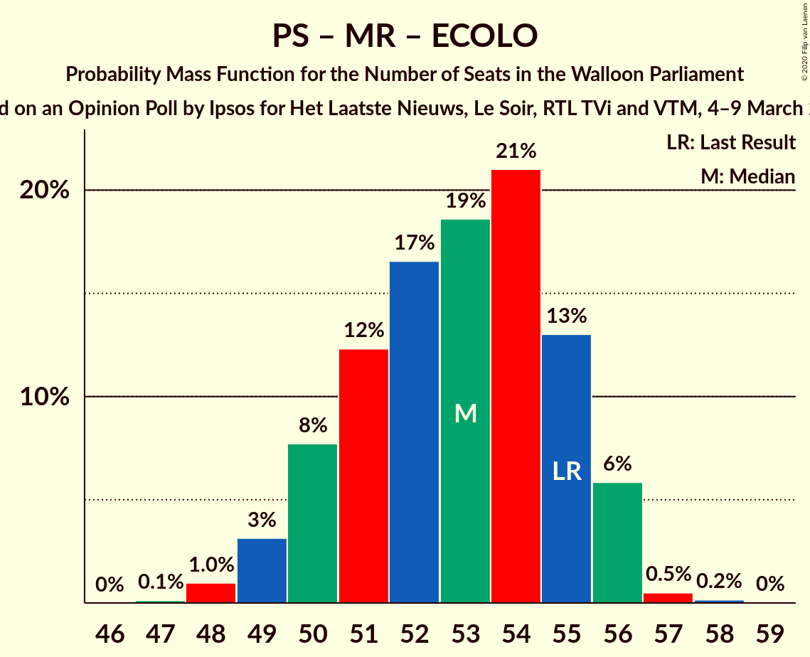

| Number of Seats | Probability | Accumulated | Special Marks |
|:---------------:|:-----------:|:-----------:|:-------------:|
| 47 | 0.1% | 100% |  |
| 48 | 1.0% | 99.9% |  |
| 49 | 3% | 98.9% |  |
| 50 | 8% | 96% |  |
| 51 | 12% | 88% |  |
| 52 | 17% | 76% |  |
| 53 | 19% | 59% | Median |
| 54 | 21% | 41% |  |
| 55 | 13% | 20% | Last Result |
| 56 | 6% | 7% |  |
| 57 | 0.5% | 0.7% |  |
| 58 | 0.2% | 0.2% |  |
| 59 | 0% | 0% |  |

### Parti Socialiste – Parti du Travail de Belgique – Ecolo

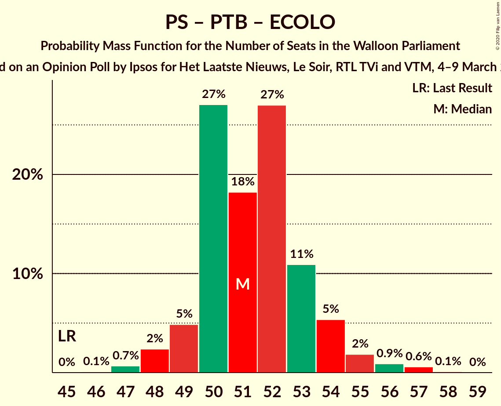

| Number of Seats | Probability | Accumulated | Special Marks |
|:---------------:|:-----------:|:-----------:|:-------------:|
| 45 | 0% | 100% | Last Result |
| 46 | 0.1% | 100% |  |
| 47 | 0.7% | 99.9% |  |
| 48 | 2% | 99.2% |  |
| 49 | 5% | 97% |  |
| 50 | 27% | 92% |  |
| 51 | 18% | 65% | Median |
| 52 | 27% | 47% |  |
| 53 | 11% | 20% |  |
| 54 | 5% | 9% |  |
| 55 | 2% | 3% |  |
| 56 | 0.9% | 2% |  |
| 57 | 0.6% | 0.7% |  |
| 58 | 0.1% | 0.1% |  |
| 59 | 0% | 0% |  |

### Parti Socialiste – Parti du Travail de Belgique – Centre démocrate humaniste

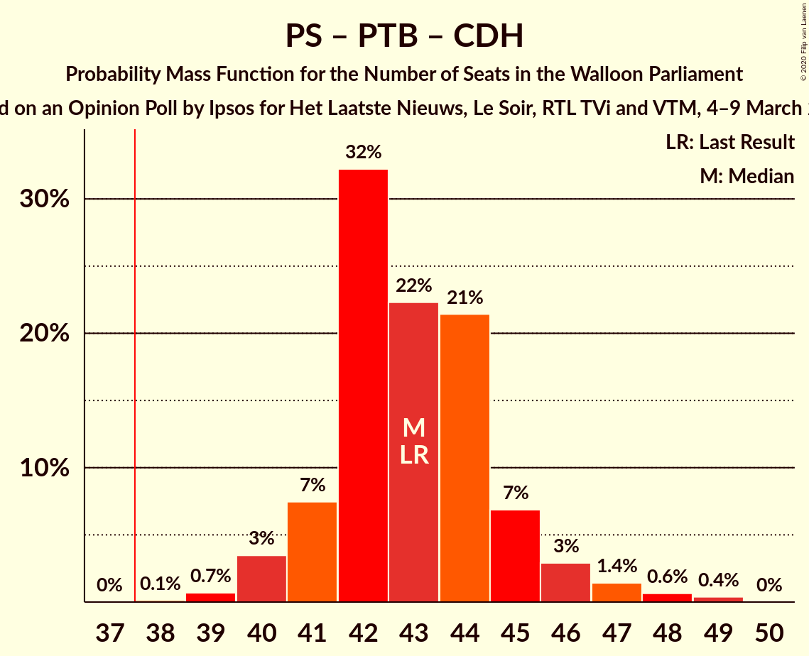

| Number of Seats | Probability | Accumulated | Special Marks |
|:---------------:|:-----------:|:-----------:|:-------------:|
| 38 | 0.1% | 100% | Majority |
| 39 | 0.7% | 99.8% |  |
| 40 | 3% | 99.2% |  |
| 41 | 7% | 96% |  |
| 42 | 32% | 88% |  |
| 43 | 22% | 56% | Last Result, Median |
| 44 | 21% | 34% |  |
| 45 | 7% | 12% |  |
| 46 | 3% | 5% |  |
| 47 | 1.4% | 2% |  |
| 48 | 0.6% | 1.0% |  |
| 49 | 0.4% | 0.4% |  |
| 50 | 0% | 0% |  |

### Parti Socialiste – Ecolo – Centre démocrate humaniste

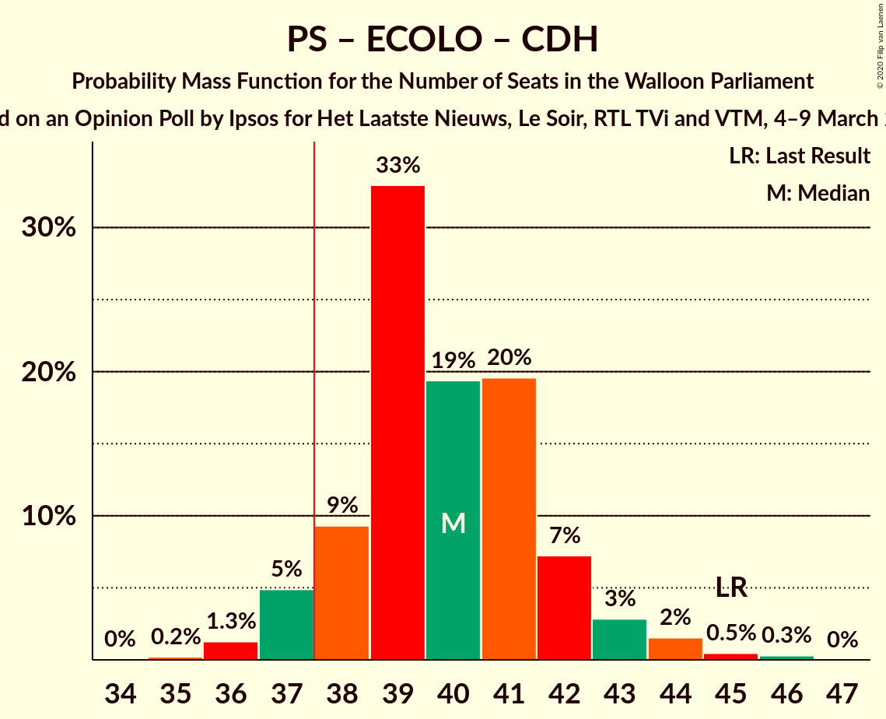

| Number of Seats | Probability | Accumulated | Special Marks |
|:---------------:|:-----------:|:-----------:|:-------------:|
| 35 | 0.2% | 100% |  |
| 36 | 1.3% | 99.7% |  |
| 37 | 5% | 98% |  |
| 38 | 9% | 94% | Majority |
| 39 | 33% | 84% |  |
| 40 | 19% | 51% | Median |
| 41 | 20% | 32% |  |
| 42 | 7% | 12% |  |
| 43 | 3% | 5% |  |
| 44 | 2% | 2% |  |
| 45 | 0.5% | 0.8% | Last Result |
| 46 | 0.3% | 0.3% |  |
| 47 | 0% | 0% |  |

### Parti Socialiste – Mouvement Réformateur

| Number of Seats | Probability | Accumulated | Special Marks |
|:---------------:|:-----------:|:-----------:|:-------------:|
| 35 | 0.9% | 100% |  |
| 36 | 2% | 99.1% |  |
| 37 | 8% | 97% |  |
| 38 | 13% | 88% | Majority |
| 39 | 18% | 76% |  |
| 40 | 18% | 57% | Median |
| 41 | 23% | 39% |  |
| 42 | 11% | 16% |  |
| 43 | 4% | 5% | Last Result |
| 44 | 1.0% | 1.1% |  |
| 45 | 0.1% | 0.1% |  |
| 46 | 0% | 0% |  |

### Parti Socialiste – Parti du Travail de Belgique

| Number of Seats | Probability | Accumulated | Special Marks |
|:---------------:|:-----------:|:-----------:|:-------------:|
| 33 | 0.1% | 100% | Last Result |
| 34 | 0.5% | 99.9% |  |
| 35 | 2% | 99.4% |  |
| 36 | 8% | 98% |  |
| 37 | 19% | 90% |  |
| 38 | 33% | 71% | Median, Majority |
| 39 | 17% | 37% |  |
| 40 | 12% | 20% |  |
| 41 | 5% | 8% |  |
| 42 | 1.3% | 3% |  |
| 43 | 0.9% | 1.4% |  |
| 44 | 0.3% | 0.5% |  |
| 45 | 0.2% | 0.2% |  |
| 46 | 0% | 0% |  |

### Mouvement Réformateur – Ecolo – Centre démocrate humaniste

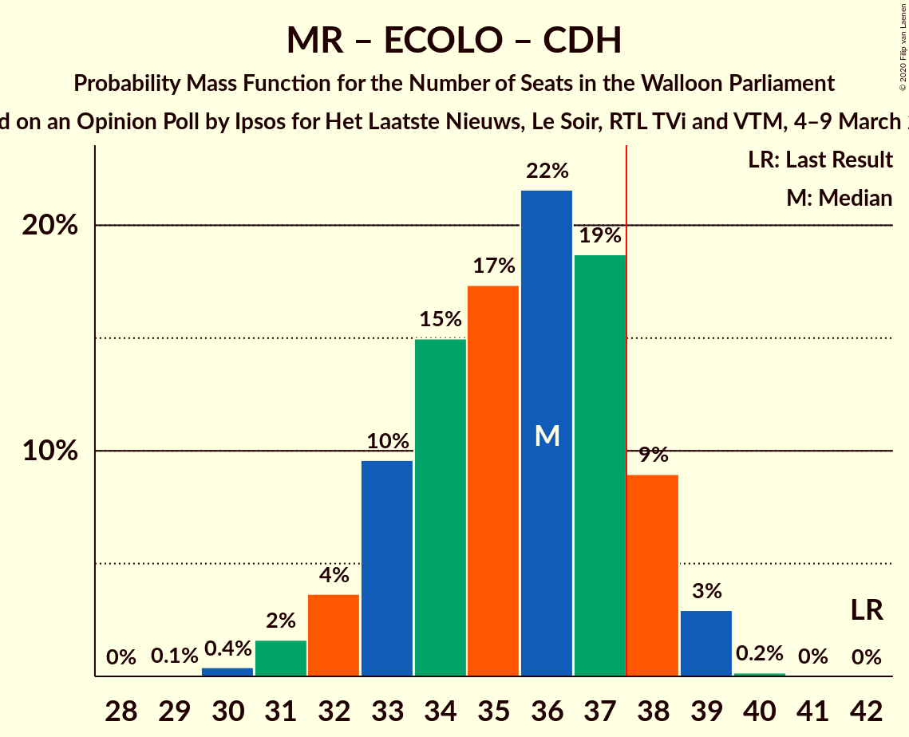

| Number of Seats | Probability | Accumulated | Special Marks |
|:---------------:|:-----------:|:-----------:|:-------------:|
| 29 | 0.1% | 100% |  |
| 30 | 0.4% | 99.9% |  |
| 31 | 2% | 99.5% |  |
| 32 | 4% | 98% |  |
| 33 | 10% | 94% |  |
| 34 | 15% | 85% |  |
| 35 | 17% | 70% |  |
| 36 | 22% | 52% | Median |
| 37 | 19% | 31% |  |
| 38 | 9% | 12% | Majority |
| 39 | 3% | 3% |  |
| 40 | 0.2% | 0.2% |  |
| 41 | 0% | 0% |  |
| 42 | 0% | 0% | Last Result |

### Parti Socialiste – Ecolo

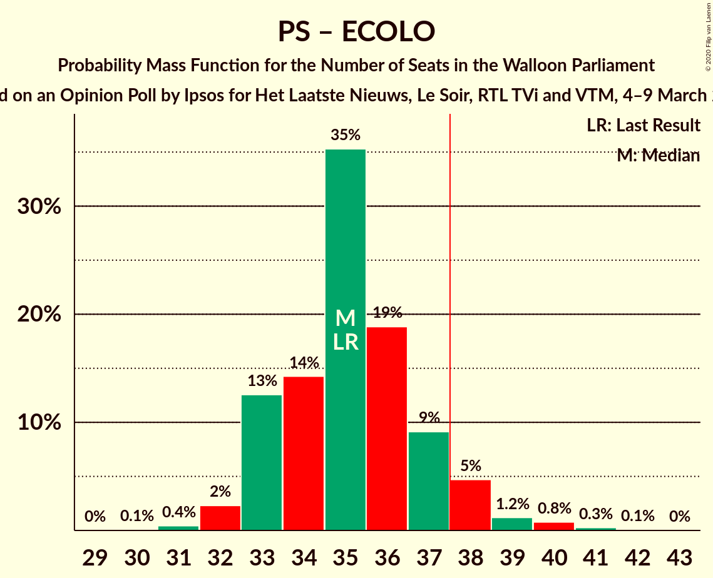

| Number of Seats | Probability | Accumulated | Special Marks |
|:---------------:|:-----------:|:-----------:|:-------------:|
| 30 | 0.1% | 100% |  |
| 31 | 0.4% | 99.9% |  |
| 32 | 2% | 99.5% |  |
| 33 | 13% | 97% |  |
| 34 | 14% | 85% |  |
| 35 | 35% | 70% | Last Result, Median |
| 36 | 19% | 35% |  |
| 37 | 9% | 16% |  |
| 38 | 5% | 7% | Majority |
| 39 | 1.2% | 2% |  |
| 40 | 0.8% | 1.1% |  |
| 41 | 0.3% | 0.4% |  |
| 42 | 0.1% | 0.1% |  |
| 43 | 0% | 0% |  |

### Mouvement Réformateur – Ecolo

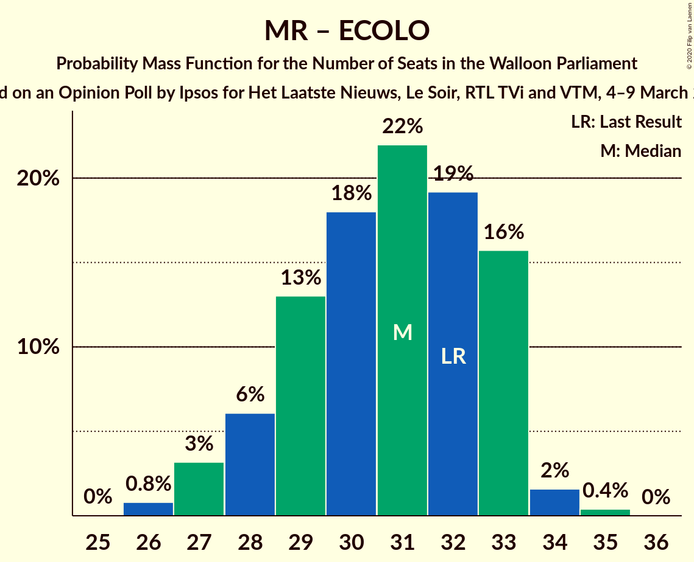

| Number of Seats | Probability | Accumulated | Special Marks |
|:---------------:|:-----------:|:-----------:|:-------------:|
| 26 | 0.8% | 100% |  |
| 27 | 3% | 99.2% |  |
| 28 | 6% | 96% |  |
| 29 | 13% | 90% |  |
| 30 | 18% | 77% |  |
| 31 | 22% | 59% | Median |
| 32 | 19% | 37% | Last Result |
| 33 | 16% | 18% |  |
| 34 | 2% | 2% |  |
| 35 | 0.4% | 0.4% |  |
| 36 | 0% | 0% |  |

### Parti du Travail de Belgique – Ecolo

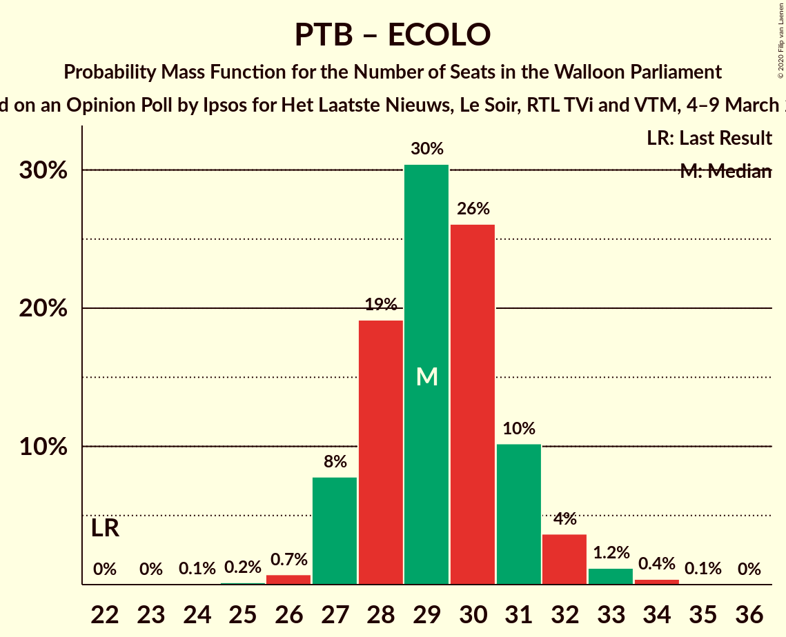

| Number of Seats | Probability | Accumulated | Special Marks |
|:---------------:|:-----------:|:-----------:|:-------------:|
| 22 | 0% | 100% | Last Result |
| 23 | 0% | 100% |  |
| 24 | 0.1% | 100% |  |
| 25 | 0.2% | 99.9% |  |
| 26 | 0.7% | 99.8% |  |
| 27 | 8% | 99.0% |  |
| 28 | 19% | 91% |  |
| 29 | 30% | 72% | Median |
| 30 | 26% | 42% |  |
| 31 | 10% | 16% |  |
| 32 | 4% | 5% |  |
| 33 | 1.2% | 2% |  |
| 34 | 0.4% | 0.5% |  |
| 35 | 0.1% | 0.1% |  |
| 36 | 0% | 0% |  |

### Parti Socialiste – Centre démocrate humaniste

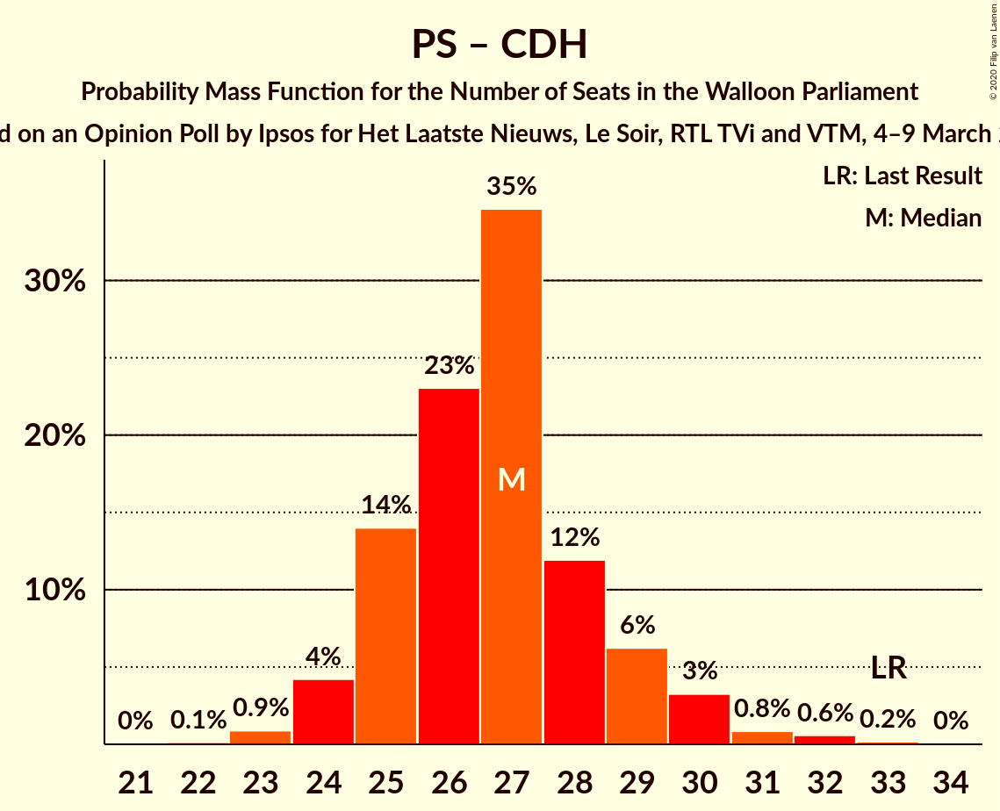

| Number of Seats | Probability | Accumulated | Special Marks |
|:---------------:|:-----------:|:-----------:|:-------------:|
| 22 | 0.1% | 100% |  |
| 23 | 0.9% | 99.8% |  |
| 24 | 4% | 99.0% |  |
| 25 | 14% | 95% |  |
| 26 | 23% | 81% |  |
| 27 | 35% | 58% | Median |
| 28 | 12% | 23% |  |
| 29 | 6% | 11% |  |
| 30 | 3% | 5% |  |
| 31 | 0.8% | 2% |  |
| 32 | 0.6% | 0.8% |  |
| 33 | 0.2% | 0.2% | Last Result |
| 34 | 0% | 0% |  |

### Mouvement Réformateur – Centre démocrate humaniste

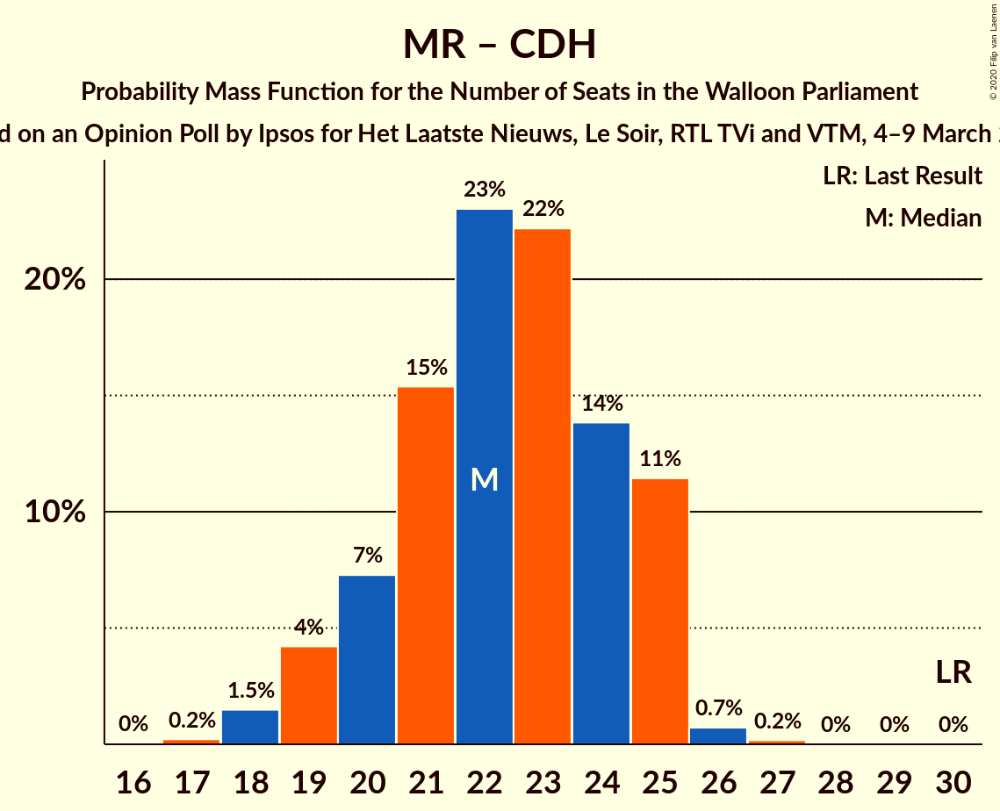

| Number of Seats | Probability | Accumulated | Special Marks |
|:---------------:|:-----------:|:-----------:|:-------------:|
| 17 | 0.2% | 100% |  |
| 18 | 1.5% | 99.7% |  |
| 19 | 4% | 98% |  |
| 20 | 7% | 94% |  |
| 21 | 15% | 87% |  |
| 22 | 23% | 71% |  |
| 23 | 22% | 48% | Median |
| 24 | 14% | 26% |  |
| 25 | 11% | 12% |  |
| 26 | 0.7% | 0.9% |  |
| 27 | 0.2% | 0.2% |  |
| 28 | 0% | 0% |  |
| 29 | 0% | 0% |  |
| 30 | 0% | 0% | Last Result |

## Technical Information

### Opinion Poll

+ **Polling firm:** Ipsos
+ **Commissioner(s):** Het Laatste Nieuws, Le Soir, RTL TVi and VTM
+ **Fieldwork period:** 4–9 March 2020

### Calculations

+ **Sample size:** 974
+ **Simulations done:** 1,048,576
+ **Error estimate:** 1.14%

