# Opinion Poll by Ipsos for Het Laatste Nieuws, Le Soir, RTL TVi and VTM, 4–9 March 2021

<a href="#voting-intentions">Voting Intentions</a> | <a href="#seats">Seats</a> | <a href="#coalitions">Coalitions</a> | <a href="#technical-information">Technical Information</a>

## Voting Intentions

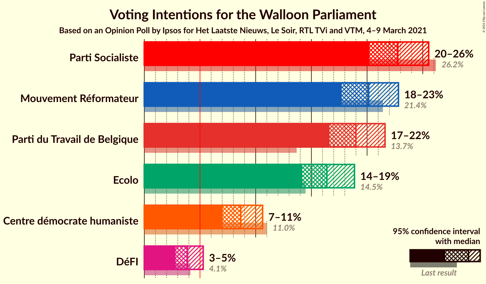

### Confidence Intervals

| Party | Last Result | Poll Result | 80% Confidence Interval | 90% Confidence Interval | 95% Confidence Interval | 99% Confidence Interval |
|:-----:|:-----------:|:-----------:|:-----------------------:|:-----------------------:|:-----------------------:|:-----------------------:|
| Parti Socialiste | 26.2% | 22.8% | 21.1–24.6% |20.6–25.1% |20.2–25.5% |19.4–26.4% |
| Mouvement Réformateur | 21.4% | 20.1% | 18.5–21.9% |18.1–22.4% |17.7–22.8% |17.0–23.7% |
| Parti du Travail de Belgique | 13.7% | 19.0% | 17.5–20.7% |17.0–21.2% |16.6–21.6% |15.9–22.5% |
| Ecolo | 14.5% | 16.4% | 14.9–18.0% |14.5–18.5% |14.2–18.9% |13.5–19.7% |
| Centre démocrate humaniste | 11.0% | 8.7% | 7.6–9.9% |7.3–10.3% |7.0–10.6% |6.6–11.3% |
| DéFI | 4.1% | 3.9% | 3.2–4.8% |3.0–5.0% |2.8–5.3% |2.5–5.8% |

*Note:* The poll result column reflects the actual value used in the calculations. Published results may vary slightly, and in addition be rounded to fewer digits.

## Seats

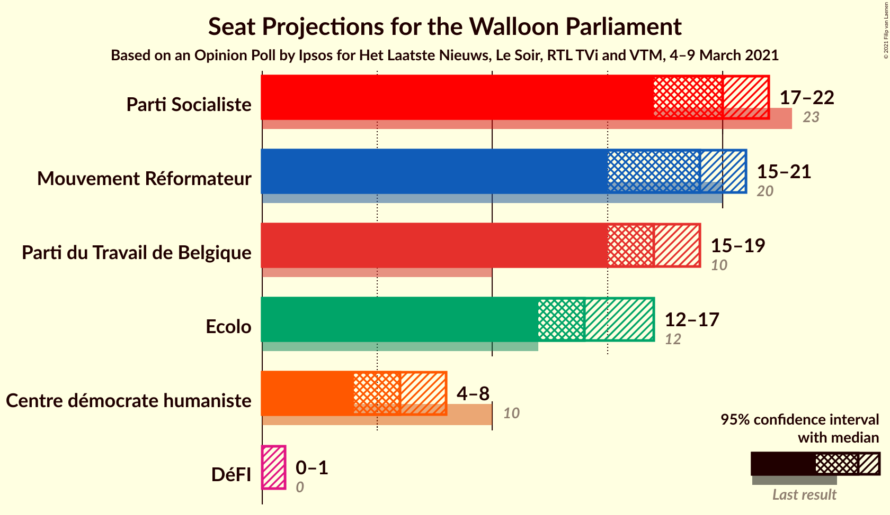

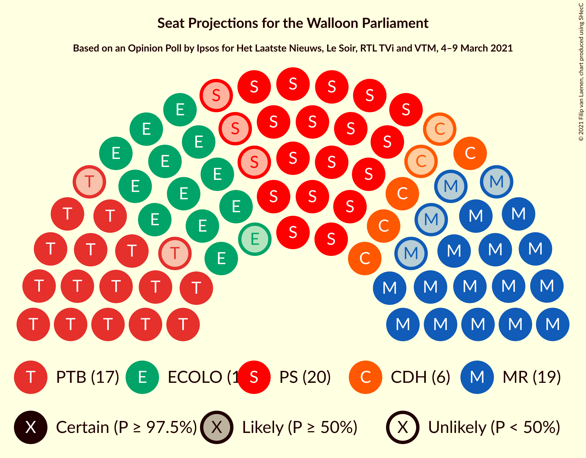

### Confidence Intervals

| Party | Last Result | Median | 80% Confidence Interval | 90% Confidence Interval | 95% Confidence Interval | 99% Confidence Interval |
|:-----:|:-----------:|:------:|:-----------------------:|:-----------------------:|:-----------------------:|:-----------------------:|
| <a href="#parti-socialiste">Parti Socialiste</a> | 23 | 20 | 18–21 |17–22 |17–22 |17–23 |
| <a href="#mouvement-réformateur">Mouvement Réformateur</a> | 20 | 19 | 17–20 |16–20 |15–21 |14–21 |
| <a href="#parti-du-travail-de-belgique">Parti du Travail de Belgique</a> | 10 | 17 | 15–18 |15–18 |15–19 |15–20 |
| <a href="#ecolo">Ecolo</a> | 12 | 14 | 13–15 |12–16 |12–17 |12–18 |
| <a href="#centre-démocrate-humaniste">Centre démocrate humaniste</a> | 10 | 6 | 5–7 |4–8 |4–8 |4–9 |
| <a href="#défi">DéFI</a> | 0 | 0 | 0 |0 |0–1 |0–4 |

### Parti Socialiste

*For a full overview of the results for this party, see the [Parti Socialiste](party-partisocialiste.html) page.*

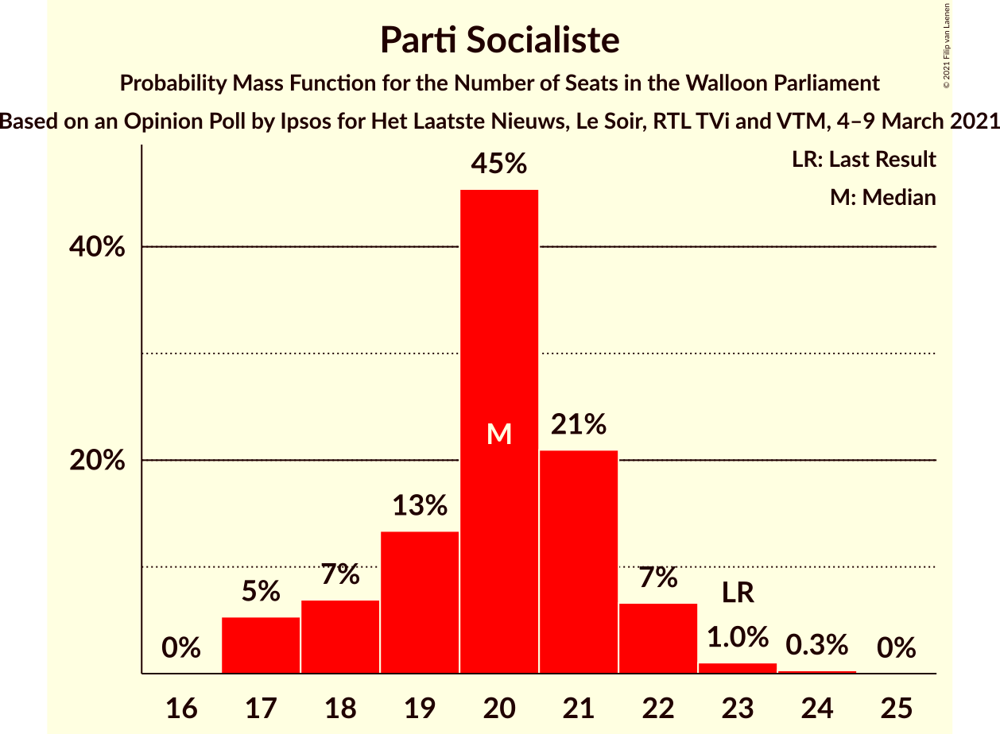

| Number of Seats | Probability | Accumulated | Special Marks |
|:---------------:|:-----------:|:-----------:|:-------------:|
| 17 | 5% | 100% |  |
| 18 | 7% | 95% |  |
| 19 | 13% | 88% |  |
| 20 | 45% | 74% | Median |
| 21 | 21% | 29% |  |
| 22 | 7% | 8% |  |
| 23 | 1.0% | 1.4% | Last Result |
| 24 | 0.3% | 0.3% |  |
| 25 | 0% | 0% |  |

### Mouvement Réformateur

*For a full overview of the results for this party, see the [Mouvement Réformateur](party-mouvementréformateur.html) page.*

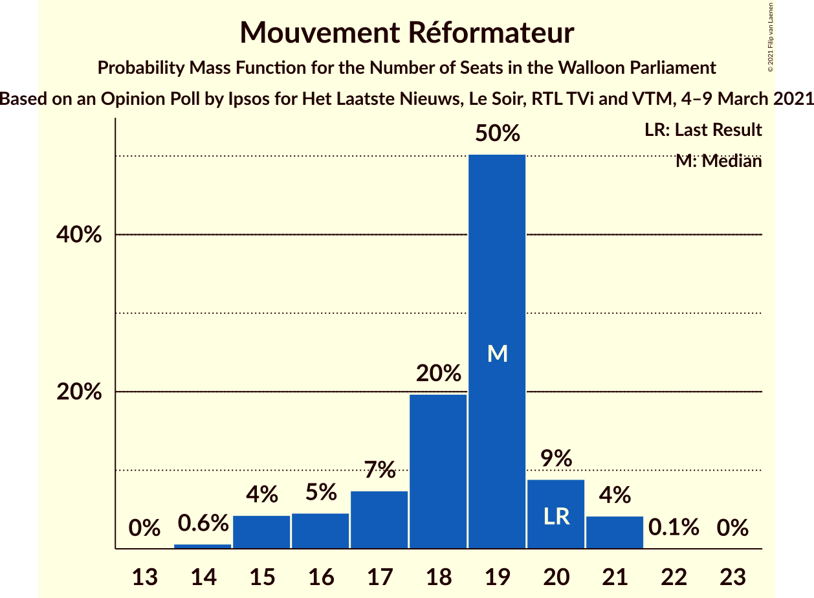

| Number of Seats | Probability | Accumulated | Special Marks |
|:---------------:|:-----------:|:-----------:|:-------------:|
| 14 | 0.6% | 100% |  |
| 15 | 4% | 99.4% |  |
| 16 | 5% | 95% |  |
| 17 | 7% | 91% |  |
| 18 | 20% | 83% |  |
| 19 | 50% | 63% | Median |
| 20 | 9% | 13% | Last Result |
| 21 | 4% | 4% |  |
| 22 | 0.1% | 0.1% |  |
| 23 | 0% | 0% |  |

### Parti du Travail de Belgique

*For a full overview of the results for this party, see the [Parti du Travail de Belgique](party-partidutravaildebelgique.html) page.*

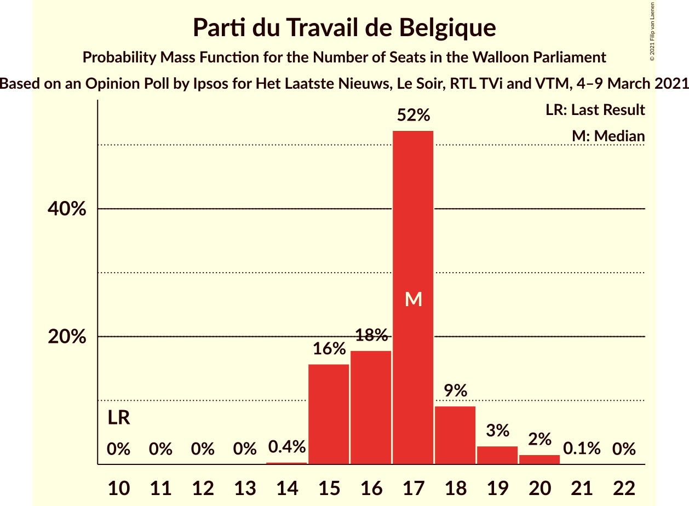

| Number of Seats | Probability | Accumulated | Special Marks |
|:---------------:|:-----------:|:-----------:|:-------------:|
| 10 | 0% | 100% | Last Result |
| 11 | 0% | 100% |  |
| 12 | 0% | 100% |  |
| 13 | 0% | 100% |  |
| 14 | 0.4% | 99.9% |  |
| 15 | 16% | 99.6% |  |
| 16 | 18% | 84% |  |
| 17 | 52% | 66% | Median |
| 18 | 9% | 14% |  |
| 19 | 3% | 5% |  |
| 20 | 2% | 2% |  |
| 21 | 0.1% | 0.1% |  |
| 22 | 0% | 0% |  |

### Ecolo

*For a full overview of the results for this party, see the [Ecolo](party-ecolo.html) page.*

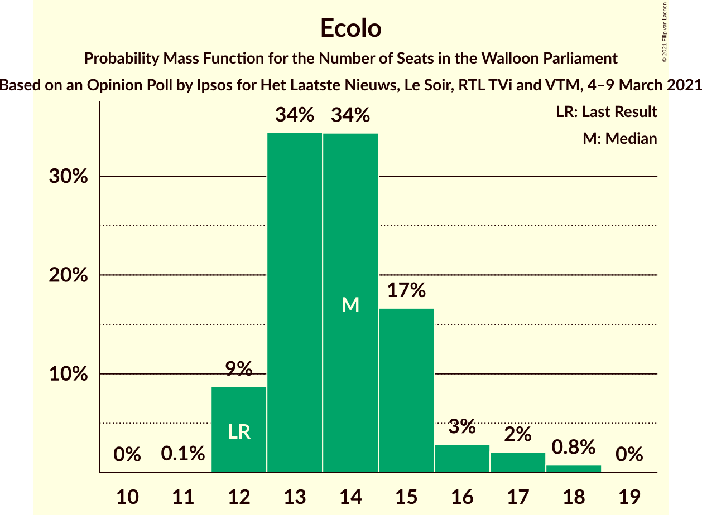

| Number of Seats | Probability | Accumulated | Special Marks |
|:---------------:|:-----------:|:-----------:|:-------------:|
| 11 | 0.1% | 100% |  |
| 12 | 9% | 99.8% | Last Result |
| 13 | 34% | 91% |  |
| 14 | 34% | 57% | Median |
| 15 | 17% | 22% |  |
| 16 | 3% | 6% |  |
| 17 | 2% | 3% |  |
| 18 | 0.8% | 0.8% |  |
| 19 | 0% | 0% |  |

### Centre démocrate humaniste

*For a full overview of the results for this party, see the [Centre démocrate humaniste](party-centredémocratehumaniste.html) page.*

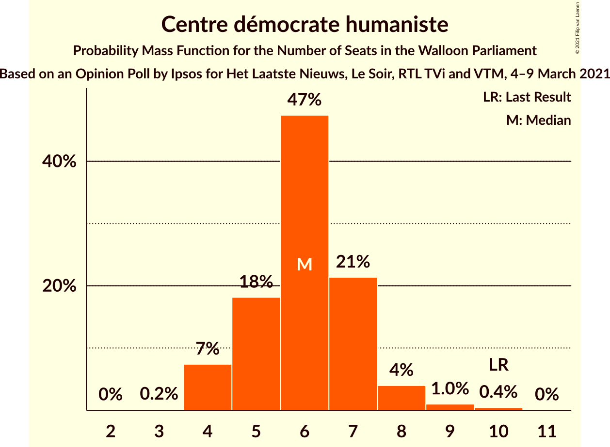

| Number of Seats | Probability | Accumulated | Special Marks |
|:---------------:|:-----------:|:-----------:|:-------------:|
| 3 | 0.2% | 100% |  |
| 4 | 7% | 99.8% |  |
| 5 | 18% | 92% |  |
| 6 | 47% | 74% | Median |
| 7 | 21% | 27% |  |
| 8 | 4% | 5% |  |
| 9 | 1.0% | 1.5% |  |
| 10 | 0.4% | 0.5% | Last Result |
| 11 | 0% | 0% |  |

### DéFI

*For a full overview of the results for this party, see the [DéFI](party-défi.html) page.*

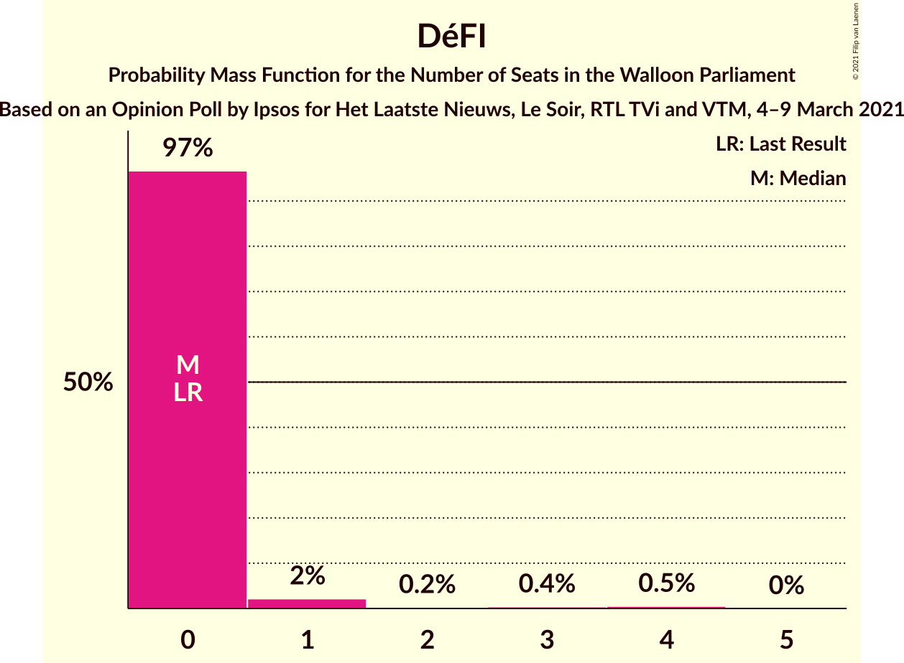

| Number of Seats | Probability | Accumulated | Special Marks |
|:---------------:|:-----------:|:-----------:|:-------------:|
| 0 | 97% | 100% | Last Result, Median |
| 1 | 2% | 3% |  |
| 2 | 0.2% | 1.2% |  |
| 3 | 0.4% | 0.9% |  |
| 4 | 0.5% | 0.5% |  |
| 5 | 0% | 0% |  |

## Coalitions

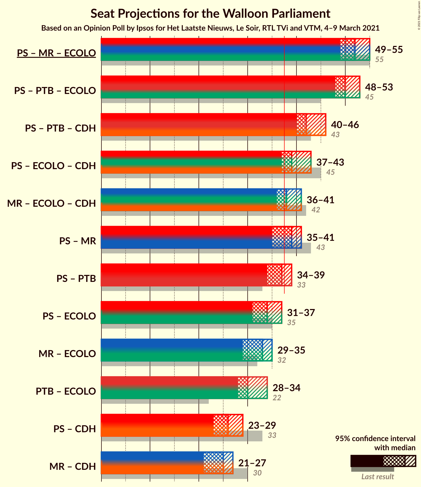

### Confidence Intervals

| Coalition | Last Result | Median | Majority? | 80% Confidence Interval | 90% Confidence Interval | 95% Confidence Interval | 99% Confidence Interval |
|:---------:|:-----------:|:------:|:---------:|:-----------------------:|:-----------------------:|:-----------------------:|:-----------------------:|
| Parti Socialiste – Mouvement Réformateur – Ecolo | 55 | 52 | 100% | 50–54 | 50–54 | 49–55 | 48–55 |
| Parti Socialiste – Parti du Travail de Belgique – Ecolo | 45 | 50 | 100% | 49–52 | 48–53 | 48–53 | 47–55 |
| Parti Socialiste – Parti du Travail de Belgique – Centre démocrate humaniste | 43 | 42 | 100% | 41–44 | 41–45 | 40–46 | 39–47 |
| Parti Socialiste – Ecolo – Centre démocrate humaniste | 45 | 39 | 95% | 38–42 | 37–43 | 37–43 | 36–44 |
| Mouvement Réformateur – Ecolo – Centre démocrate humaniste | 42 | 38 | 75% | 37–40 | 36–40 | 36–41 | 34–42 |
| Parti Socialiste – Mouvement Réformateur | 43 | 39 | 75% | 36–40 | 35–41 | 35–41 | 34–42 |
| Parti Socialiste – Parti du Travail de Belgique | 33 | 37 | 23% | 35–38 | 35–39 | 34–39 | 33–40 |
| Parti Socialiste – Ecolo | 35 | 34 | 0.9% | 32–36 | 31–36 | 31–37 | 30–38 |
| Mouvement Réformateur – Ecolo | 32 | 33 | 0% | 31–33 | 30–34 | 29–35 | 28–36 |
| Parti du Travail de Belgique – Ecolo | 22 | 30 | 0% | 29–32 | 28–33 | 28–34 | 27–35 |
| Parti Socialiste – Centre démocrate humaniste | 33 | 26 | 0% | 24–28 | 24–28 | 23–29 | 22–30 |
| Mouvement Réformateur – Centre démocrate humaniste | 30 | 25 | 0% | 23–26 | 22–27 | 21–27 | 20–28 |

### Parti Socialiste – Mouvement Réformateur – Ecolo

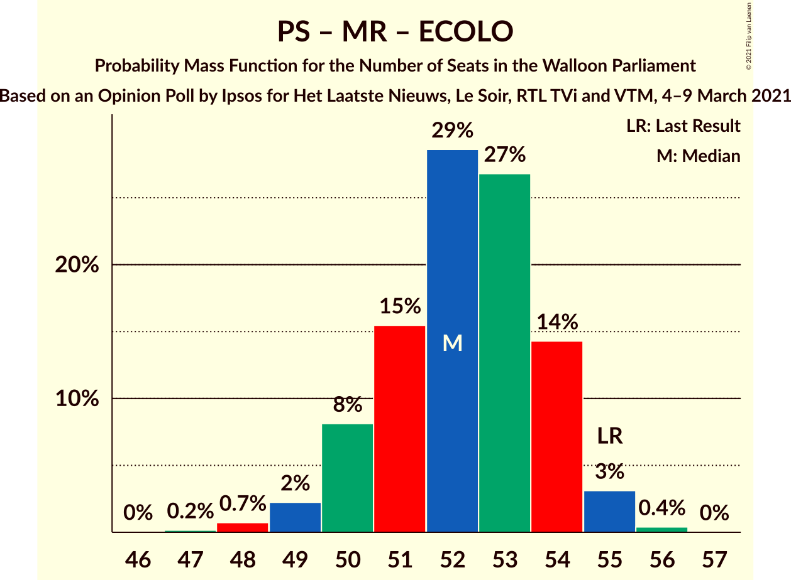

| Number of Seats | Probability | Accumulated | Special Marks |
|:---------------:|:-----------:|:-----------:|:-------------:|
| 47 | 0.2% | 100% |  |
| 48 | 0.7% | 99.8% |  |
| 49 | 2% | 99.1% |  |
| 50 | 8% | 97% |  |
| 51 | 15% | 89% |  |
| 52 | 29% | 73% |  |
| 53 | 27% | 45% | Median |
| 54 | 14% | 18% |  |
| 55 | 3% | 4% | Last Result |
| 56 | 0.4% | 0.4% |  |
| 57 | 0% | 0% |  |

### Parti Socialiste – Parti du Travail de Belgique – Ecolo

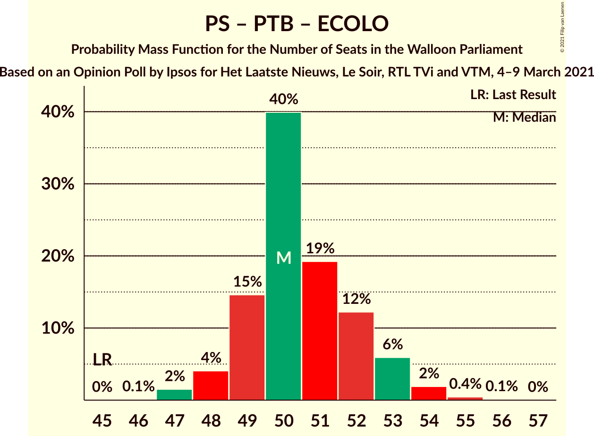

| Number of Seats | Probability | Accumulated | Special Marks |
|:---------------:|:-----------:|:-----------:|:-------------:|
| 45 | 0% | 100% | Last Result |
| 46 | 0.1% | 100% |  |
| 47 | 2% | 99.9% |  |
| 48 | 4% | 98% |  |
| 49 | 15% | 94% |  |
| 50 | 40% | 80% |  |
| 51 | 19% | 40% | Median |
| 52 | 12% | 21% |  |
| 53 | 6% | 8% |  |
| 54 | 2% | 2% |  |
| 55 | 0.4% | 0.6% |  |
| 56 | 0.1% | 0.1% |  |
| 57 | 0% | 0% |  |

### Parti Socialiste – Parti du Travail de Belgique – Centre démocrate humaniste

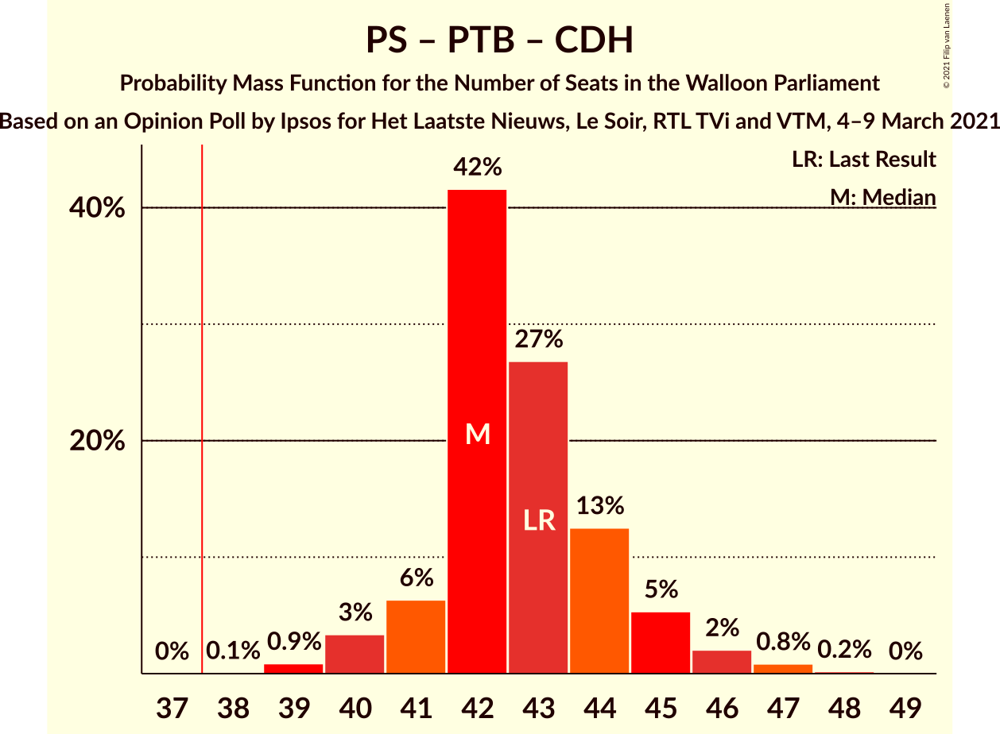

| Number of Seats | Probability | Accumulated | Special Marks |
|:---------------:|:-----------:|:-----------:|:-------------:|
| 38 | 0.1% | 100% | Majority |
| 39 | 0.9% | 99.9% |  |
| 40 | 3% | 99.0% |  |
| 41 | 6% | 96% |  |
| 42 | 42% | 89% |  |
| 43 | 27% | 48% | Last Result, Median |
| 44 | 13% | 21% |  |
| 45 | 5% | 8% |  |
| 46 | 2% | 3% |  |
| 47 | 0.8% | 1.0% |  |
| 48 | 0.2% | 0.2% |  |
| 49 | 0% | 0% |  |

### Parti Socialiste – Ecolo – Centre démocrate humaniste

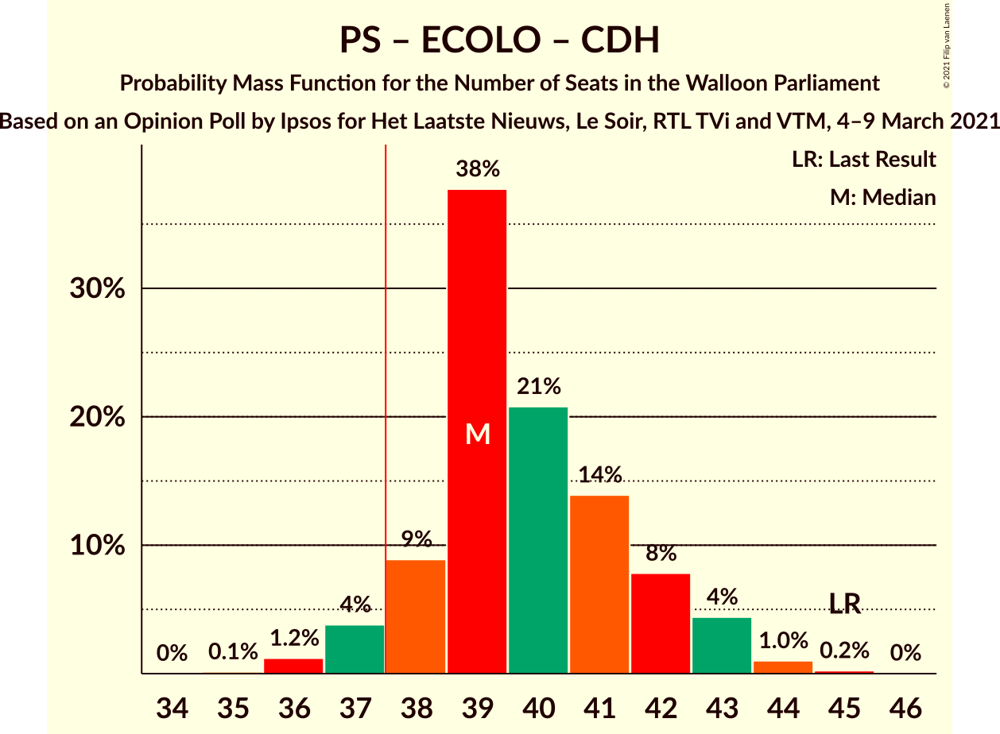

| Number of Seats | Probability | Accumulated | Special Marks |
|:---------------:|:-----------:|:-----------:|:-------------:|
| 35 | 0.1% | 100% |  |
| 36 | 1.2% | 99.8% |  |
| 37 | 4% | 98.6% |  |
| 38 | 9% | 95% | Majority |
| 39 | 38% | 86% |  |
| 40 | 21% | 48% | Median |
| 41 | 14% | 27% |  |
| 42 | 8% | 14% |  |
| 43 | 4% | 6% |  |
| 44 | 1.0% | 1.3% |  |
| 45 | 0.2% | 0.3% | Last Result |
| 46 | 0% | 0% |  |

### Mouvement Réformateur – Ecolo – Centre démocrate humaniste

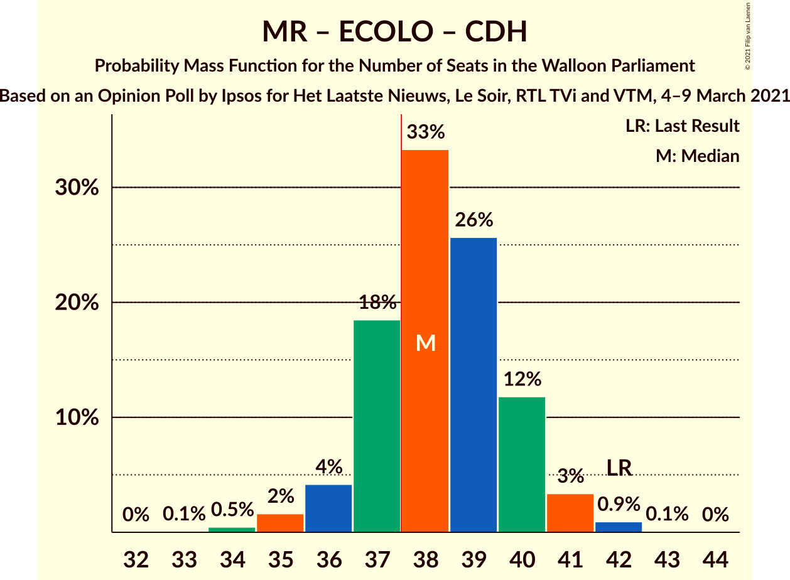

| Number of Seats | Probability | Accumulated | Special Marks |
|:---------------:|:-----------:|:-----------:|:-------------:|
| 33 | 0.1% | 100% |  |
| 34 | 0.5% | 99.9% |  |
| 35 | 2% | 99.4% |  |
| 36 | 4% | 98% |  |
| 37 | 18% | 94% |  |
| 38 | 33% | 75% | Majority |
| 39 | 26% | 42% | Median |
| 40 | 12% | 16% |  |
| 41 | 3% | 4% |  |
| 42 | 0.9% | 1.0% | Last Result |
| 43 | 0.1% | 0.1% |  |
| 44 | 0% | 0% |  |

### Parti Socialiste – Mouvement Réformateur

| Number of Seats | Probability | Accumulated | Special Marks |
|:---------------:|:-----------:|:-----------:|:-------------:|
| 32 | 0.1% | 100% |  |
| 33 | 0.1% | 99.9% |  |
| 34 | 0.7% | 99.8% |  |
| 35 | 4% | 99.1% |  |
| 36 | 7% | 95% |  |
| 37 | 12% | 88% |  |
| 38 | 20% | 75% | Majority |
| 39 | 33% | 55% | Median |
| 40 | 12% | 22% |  |
| 41 | 9% | 10% |  |
| 42 | 0.8% | 0.9% |  |
| 43 | 0.1% | 0.1% | Last Result |
| 44 | 0% | 0% |  |

### Parti Socialiste – Parti du Travail de Belgique

| Number of Seats | Probability | Accumulated | Special Marks |
|:---------------:|:-----------:|:-----------:|:-------------:|
| 32 | 0.1% | 100% |  |
| 33 | 1.0% | 99.9% | Last Result |
| 34 | 4% | 98.9% |  |
| 35 | 12% | 95% |  |
| 36 | 26% | 83% |  |
| 37 | 33% | 57% | Median |
| 38 | 18% | 23% | Majority |
| 39 | 4% | 5% |  |
| 40 | 1.3% | 2% |  |
| 41 | 0.3% | 0.4% |  |
| 42 | 0.1% | 0.1% |  |
| 43 | 0% | 0% |  |

### Parti Socialiste – Ecolo

| Number of Seats | Probability | Accumulated | Special Marks |
|:---------------:|:-----------:|:-----------:|:-------------:|
| 29 | 0.1% | 100% |  |
| 30 | 1.3% | 99.9% |  |
| 31 | 4% | 98.6% |  |
| 32 | 12% | 94% |  |
| 33 | 28% | 82% |  |
| 34 | 22% | 54% | Median |
| 35 | 20% | 31% | Last Result |
| 36 | 8% | 11% |  |
| 37 | 2% | 3% |  |
| 38 | 0.7% | 0.9% | Majority |
| 39 | 0.2% | 0.2% |  |
| 40 | 0% | 0% |  |

### Mouvement Réformateur – Ecolo

| Number of Seats | Probability | Accumulated | Special Marks |
|:---------------:|:-----------:|:-----------:|:-------------:|
| 27 | 0.2% | 100% |  |
| 28 | 1.0% | 99.8% |  |
| 29 | 2% | 98.8% |  |
| 30 | 6% | 96% |  |
| 31 | 13% | 91% |  |
| 32 | 27% | 78% | Last Result |
| 33 | 41% | 51% | Median |
| 34 | 6% | 10% |  |
| 35 | 3% | 4% |  |
| 36 | 0.7% | 0.8% |  |
| 37 | 0.1% | 0.1% |  |
| 38 | 0% | 0% | Majority |

### Parti du Travail de Belgique – Ecolo

| Number of Seats | Probability | Accumulated | Special Marks |
|:---------------:|:-----------:|:-----------:|:-------------:|
| 22 | 0% | 100% | Last Result |
| 23 | 0% | 100% |  |
| 24 | 0% | 100% |  |
| 25 | 0% | 100% |  |
| 26 | 0% | 100% |  |
| 27 | 0.5% | 99.9% |  |
| 28 | 6% | 99.5% |  |
| 29 | 13% | 94% |  |
| 30 | 39% | 80% |  |
| 31 | 21% | 42% | Median |
| 32 | 12% | 21% |  |
| 33 | 5% | 9% |  |
| 34 | 3% | 3% |  |
| 35 | 0.5% | 0.7% |  |
| 36 | 0.1% | 0.1% |  |
| 37 | 0% | 0% |  |

### Parti Socialiste – Centre démocrate humaniste

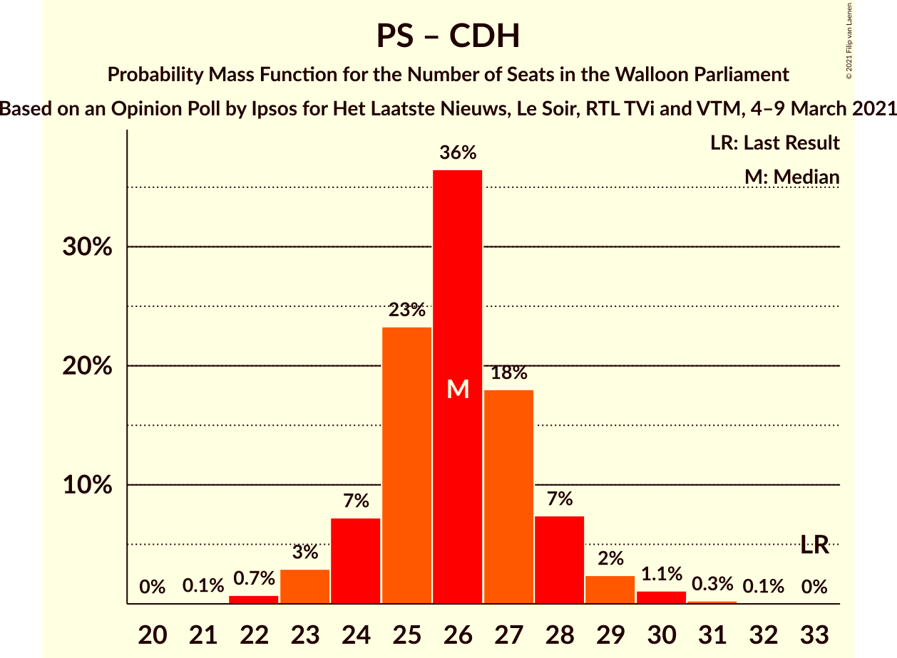

| Number of Seats | Probability | Accumulated | Special Marks |
|:---------------:|:-----------:|:-----------:|:-------------:|
| 21 | 0.1% | 100% |  |
| 22 | 0.7% | 99.9% |  |
| 23 | 3% | 99.2% |  |
| 24 | 7% | 96% |  |
| 25 | 23% | 89% |  |
| 26 | 36% | 66% | Median |
| 27 | 18% | 29% |  |
| 28 | 7% | 11% |  |
| 29 | 2% | 4% |  |
| 30 | 1.1% | 1.4% |  |
| 31 | 0.3% | 0.3% |  |
| 32 | 0.1% | 0.1% |  |
| 33 | 0% | 0% | Last Result |

### Mouvement Réformateur – Centre démocrate humaniste

| Number of Seats | Probability | Accumulated | Special Marks |
|:---------------:|:-----------:|:-----------:|:-------------:|
| 19 | 0.1% | 100% |  |
| 20 | 0.5% | 99.9% |  |
| 21 | 2% | 99.4% |  |
| 22 | 7% | 97% |  |
| 23 | 12% | 91% |  |
| 24 | 20% | 78% |  |
| 25 | 39% | 58% | Median |
| 26 | 14% | 19% |  |
| 27 | 4% | 5% |  |
| 28 | 1.2% | 1.3% |  |
| 29 | 0.1% | 0.1% |  |
| 30 | 0% | 0% | Last Result |

## Technical Information

### Opinion Poll

+ **Polling firm:** Ipsos
+ **Commissioner(s):** Het Laatste Nieuws, Le Soir, RTL TVi and VTM
+ **Fieldwork period:** 4–9 March 2021

### Calculations

+ **Sample size:** 958
+ **Simulations done:** 1,048,576
+ **Error estimate:** 1.05%

