# Opinion Poll by Ipsos for Het Laatste Nieuws, Le Soir, RTL TVi and VTM, 7–14 September 2021

<a href="#voting-intentions">Voting Intentions</a> | <a href="#seats">Seats</a> | <a href="#coalitions">Coalitions</a> | <a href="#technical-information">Technical Information</a>

## Voting Intentions

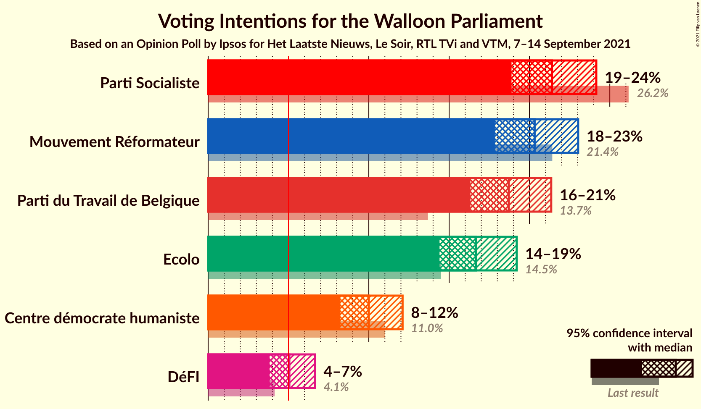

### Confidence Intervals

| Party | Last Result | Poll Result | 80% Confidence Interval | 90% Confidence Interval | 95% Confidence Interval | 99% Confidence Interval |
|:-----:|:-----------:|:-----------:|:-----------------------:|:-----------------------:|:-----------------------:|:-----------------------:|
| Parti Socialiste | 26.2% | 21.4% | 19.7–23.2% |19.3–23.7% |18.9–24.2% |18.1–25.0% |
| Mouvement Réformateur | 21.4% | 20.3% | 18.7–22.1% |18.2–22.6% |17.8–23.0% |17.1–23.9% |
| Parti du Travail de Belgique | 13.7% | 18.7% | 17.1–20.4% |16.7–20.9% |16.3–21.4% |15.6–22.2% |
| Ecolo | 14.5% | 16.7% | 15.2–18.3% |14.8–18.8% |14.4–19.2% |13.7–20.0% |
| Centre démocrate humaniste | 11.0% | 10.0% | 8.8–11.4% |8.5–11.8% |8.2–12.1% |7.7–12.8% |
| DéFI | 4.1% | 5.1% | 4.2–6.1% |4.0–6.4% |3.8–6.7% |3.5–7.2% |

*Note:* The poll result column reflects the actual value used in the calculations. Published results may vary slightly, and in addition be rounded to fewer digits.

## Seats

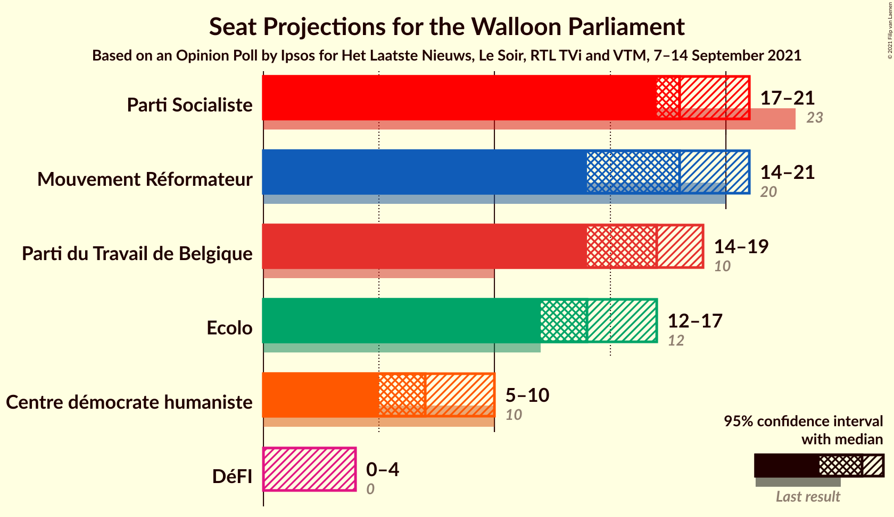

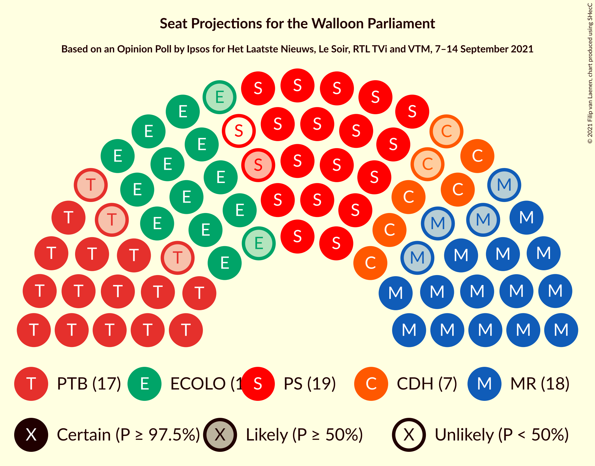

### Confidence Intervals

| Party | Last Result | Median | 80% Confidence Interval | 90% Confidence Interval | 95% Confidence Interval | 99% Confidence Interval |
|:-----:|:-----------:|:------:|:-----------------------:|:-----------------------:|:-----------------------:|:-----------------------:|
| <a href="#parti-socialiste">Parti Socialiste</a> | 23 | 18 | 17–20 |17–21 |17–21 |16–22 |
| <a href="#mouvement-réformateur">Mouvement Réformateur</a> | 20 | 18 | 16–20 |15–21 |14–21 |14–21 |
| <a href="#parti-du-travail-de-belgique">Parti du Travail de Belgique</a> | 10 | 17 | 15–18 |15–18 |14–19 |13–20 |
| <a href="#ecolo">Ecolo</a> | 12 | 14 | 13–15 |12–16 |12–17 |12–18 |
| <a href="#centre-démocrate-humaniste">Centre démocrate humaniste</a> | 10 | 7 | 6–9 |6–10 |5–10 |5–11 |
| <a href="#défi">DéFI</a> | 0 | 0 | 0–4 |0–4 |0–4 |0–5 |

### Parti Socialiste

*For a full overview of the results for this party, see the [Parti Socialiste](party-partisocialiste.html) page.*

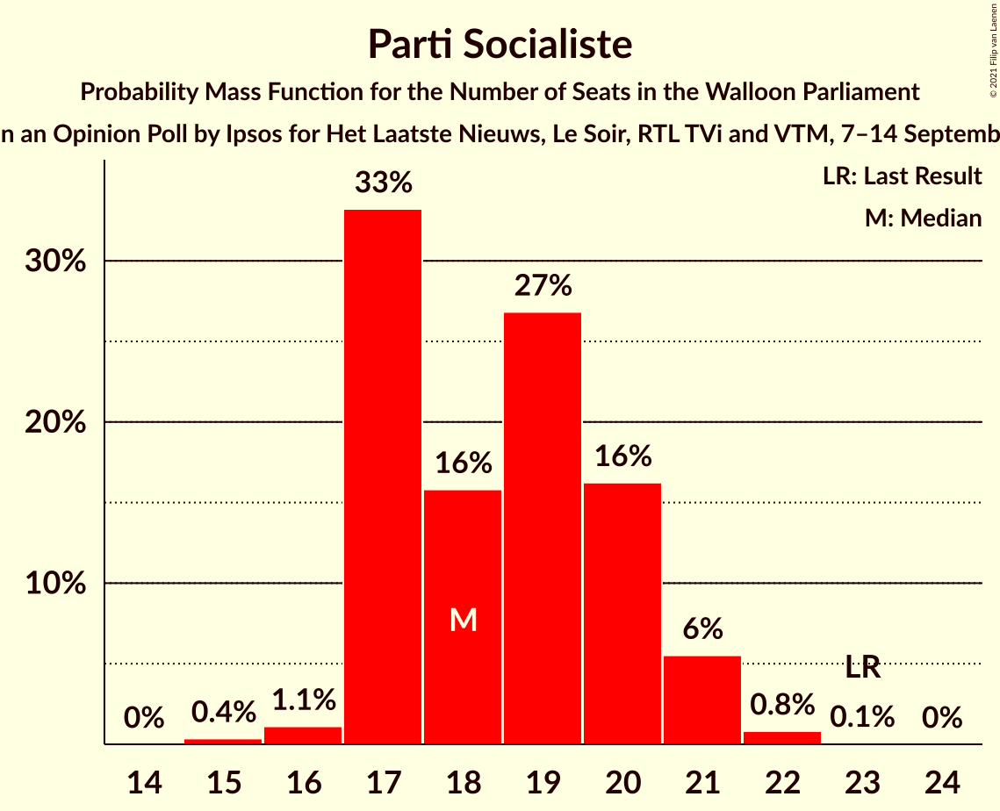

| Number of Seats | Probability | Accumulated | Special Marks |
|:---------------:|:-----------:|:-----------:|:-------------:|
| 15 | 0.4% | 100% |  |
| 16 | 1.1% | 99.6% |  |
| 17 | 33% | 98.5% |  |
| 18 | 16% | 65% | Median |
| 19 | 27% | 49% |  |
| 20 | 16% | 23% |  |
| 21 | 6% | 6% |  |
| 22 | 0.8% | 0.9% |  |
| 23 | 0.1% | 0.1% | Last Result |
| 24 | 0% | 0% |  |

### Mouvement Réformateur

*For a full overview of the results for this party, see the [Mouvement Réformateur](party-mouvementréformateur.html) page.*

| Number of Seats | Probability | Accumulated | Special Marks |
|:---------------:|:-----------:|:-----------:|:-------------:|
| 14 | 3% | 100% |  |
| 15 | 6% | 97% |  |
| 16 | 3% | 91% |  |
| 17 | 12% | 88% |  |
| 18 | 40% | 76% | Median |
| 19 | 25% | 36% |  |
| 20 | 4% | 11% | Last Result |
| 21 | 6% | 7% |  |
| 22 | 0.1% | 0.1% |  |
| 23 | 0% | 0% |  |

### Parti du Travail de Belgique

*For a full overview of the results for this party, see the [Parti du Travail de Belgique](party-partidutravaildebelgique.html) page.*

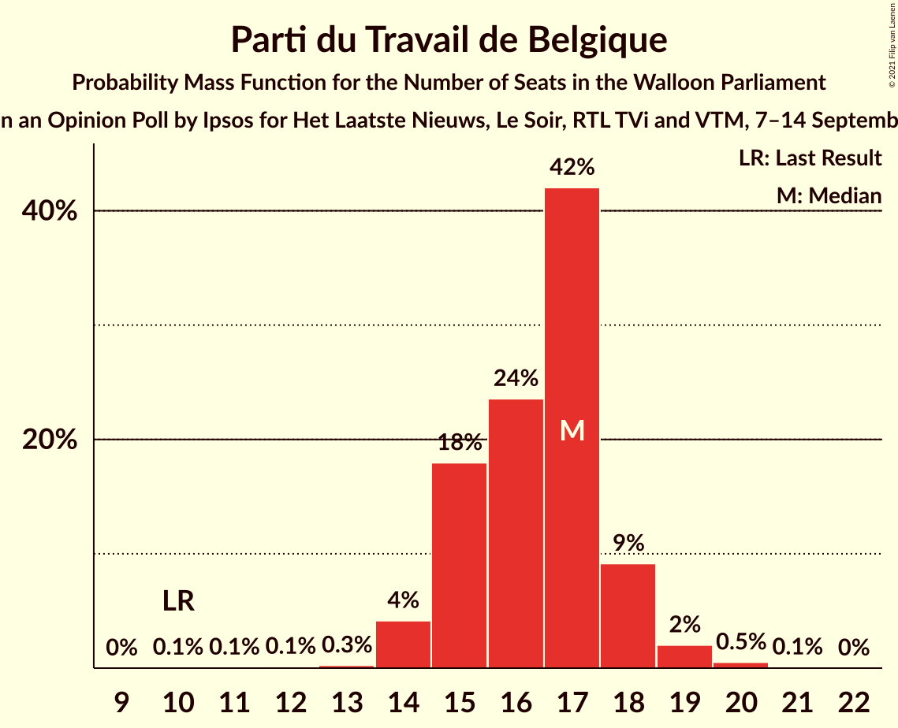

| Number of Seats | Probability | Accumulated | Special Marks |
|:---------------:|:-----------:|:-----------:|:-------------:|
| 10 | 0.1% | 100% | Last Result |
| 11 | 0.1% | 99.9% |  |
| 12 | 0.1% | 99.9% |  |
| 13 | 0.3% | 99.7% |  |
| 14 | 4% | 99.5% |  |
| 15 | 18% | 95% |  |
| 16 | 24% | 77% |  |
| 17 | 42% | 54% | Median |
| 18 | 9% | 12% |  |
| 19 | 2% | 3% |  |
| 20 | 0.5% | 0.6% |  |
| 21 | 0.1% | 0.1% |  |
| 22 | 0% | 0% |  |

### Ecolo

*For a full overview of the results for this party, see the [Ecolo](party-ecolo.html) page.*

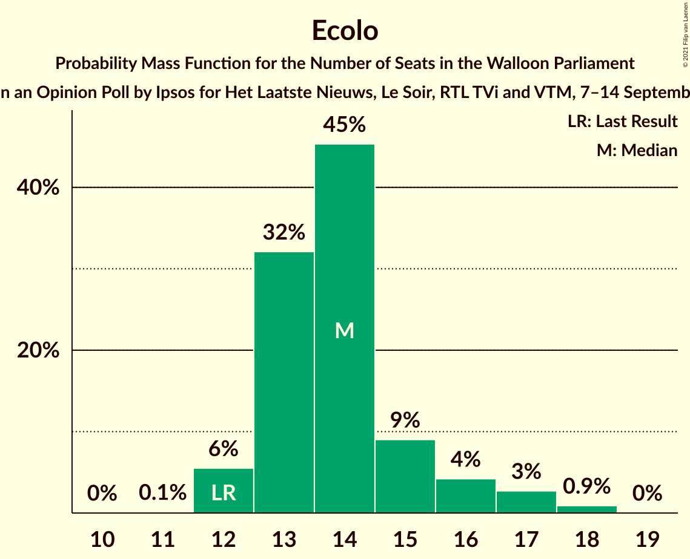

| Number of Seats | Probability | Accumulated | Special Marks |
|:---------------:|:-----------:|:-----------:|:-------------:|
| 11 | 0.1% | 100% |  |
| 12 | 6% | 99.8% | Last Result |
| 13 | 32% | 94% |  |
| 14 | 45% | 62% | Median |
| 15 | 9% | 17% |  |
| 16 | 4% | 8% |  |
| 17 | 3% | 4% |  |
| 18 | 0.9% | 0.9% |  |
| 19 | 0% | 0% |  |

### Centre démocrate humaniste

*For a full overview of the results for this party, see the [Centre démocrate humaniste](party-centredémocratehumaniste.html) page.*

| Number of Seats | Probability | Accumulated | Special Marks |
|:---------------:|:-----------:|:-----------:|:-------------:|
| 4 | 0.3% | 100% |  |
| 5 | 3% | 99.7% |  |
| 6 | 23% | 97% |  |
| 7 | 48% | 74% | Median |
| 8 | 12% | 26% |  |
| 9 | 6% | 14% |  |
| 10 | 5% | 8% | Last Result |
| 11 | 2% | 2% |  |
| 12 | 0% | 0% |  |

### DéFI

*For a full overview of the results for this party, see the [DéFI](party-défi.html) page.*

| Number of Seats | Probability | Accumulated | Special Marks |
|:---------------:|:-----------:|:-----------:|:-------------:|
| 0 | 64% | 100% | Last Result, Median |
| 1 | 9% | 36% |  |
| 2 | 2% | 27% |  |
| 3 | 9% | 24% |  |
| 4 | 14% | 16% |  |
| 5 | 2% | 2% |  |
| 6 | 0.1% | 0.1% |  |
| 7 | 0% | 0% |  |

## Coalitions

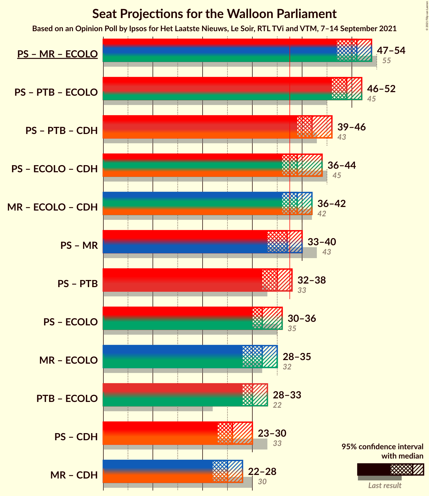

### Confidence Intervals

| Coalition | Last Result | Median | Majority? | 80% Confidence Interval | 90% Confidence Interval | 95% Confidence Interval | 99% Confidence Interval |
|:---------:|:-----------:|:------:|:---------:|:-----------------------:|:-----------------------:|:-----------------------:|:-----------------------:|
| Parti Socialiste – Mouvement Réformateur – Ecolo | 55 | 51 | 100% | 48–53 | 47–53 | 47–54 | 45–54 |
| Parti Socialiste – Parti du Travail de Belgique – Ecolo | 45 | 49 | 100% | 47–51 | 46–51 | 46–52 | 44–53 |
| Parti Socialiste – Parti du Travail de Belgique – Centre démocrate humaniste | 43 | 42 | 99.8% | 40–44 | 39–45 | 39–46 | 38–47 |
| Parti Socialiste – Ecolo – Centre démocrate humaniste | 45 | 39 | 85% | 37–42 | 36–43 | 36–44 | 35–44 |
| Mouvement Réformateur – Ecolo – Centre démocrate humaniste | 42 | 39 | 83% | 37–41 | 36–42 | 36–42 | 35–43 |
| Parti Socialiste – Mouvement Réformateur | 43 | 37 | 31% | 34–39 | 34–39 | 33–40 | 32–41 |
| Parti Socialiste – Parti du Travail de Belgique | 33 | 35 | 4% | 33–37 | 33–37 | 32–38 | 31–38 |
| Parti Socialiste – Ecolo | 35 | 32 | 0.1% | 30–34 | 30–35 | 30–36 | 29–36 |
| Mouvement Réformateur – Ecolo | 32 | 32 | 0% | 30–34 | 29–35 | 28–35 | 27–36 |
| Parti du Travail de Belgique – Ecolo | 22 | 30 | 0% | 28–32 | 28–33 | 28–33 | 27–35 |
| Parti Socialiste – Centre démocrate humaniste | 33 | 26 | 0% | 24–28 | 23–29 | 23–30 | 22–30 |
| Mouvement Réformateur – Centre démocrate humaniste | 30 | 25 | 0% | 23–28 | 22–28 | 22–28 | 21–29 |

### Parti Socialiste – Mouvement Réformateur – Ecolo

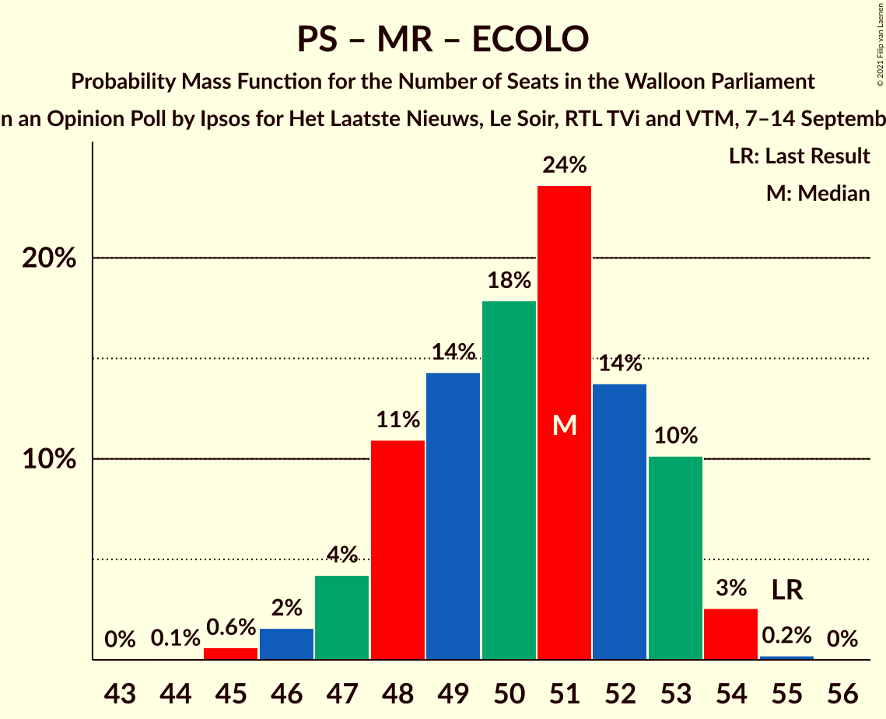

| Number of Seats | Probability | Accumulated | Special Marks |
|:---------------:|:-----------:|:-----------:|:-------------:|
| 44 | 0.1% | 100% |  |
| 45 | 0.6% | 99.9% |  |
| 46 | 2% | 99.3% |  |
| 47 | 4% | 98% |  |
| 48 | 11% | 93% |  |
| 49 | 14% | 83% |  |
| 50 | 18% | 68% | Median |
| 51 | 24% | 50% |  |
| 52 | 14% | 27% |  |
| 53 | 10% | 13% |  |
| 54 | 3% | 3% |  |
| 55 | 0.2% | 0.3% | Last Result |
| 56 | 0% | 0% |  |

### Parti Socialiste – Parti du Travail de Belgique – Ecolo

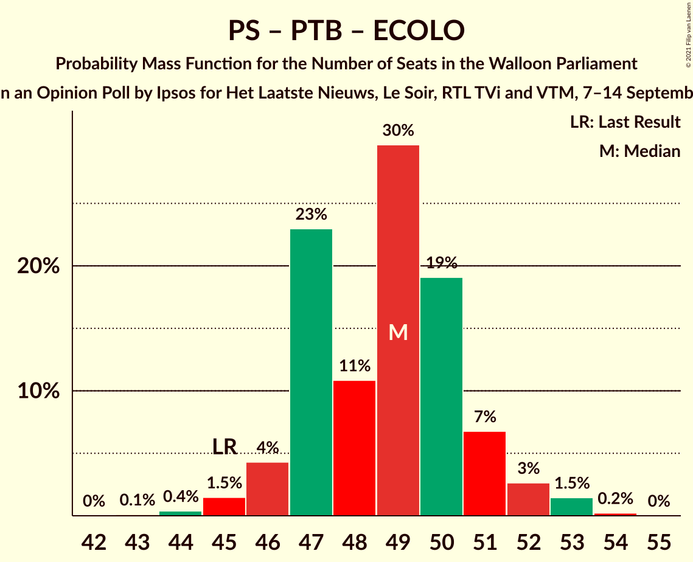

| Number of Seats | Probability | Accumulated | Special Marks |
|:---------------:|:-----------:|:-----------:|:-------------:|
| 43 | 0.1% | 100% |  |
| 44 | 0.4% | 99.9% |  |
| 45 | 1.5% | 99.5% | Last Result |
| 46 | 4% | 98% |  |
| 47 | 23% | 94% |  |
| 48 | 11% | 71% |  |
| 49 | 30% | 60% | Median |
| 50 | 19% | 30% |  |
| 51 | 7% | 11% |  |
| 52 | 3% | 4% |  |
| 53 | 1.5% | 2% |  |
| 54 | 0.2% | 0.2% |  |
| 55 | 0% | 0% |  |

### Parti Socialiste – Parti du Travail de Belgique – Centre démocrate humaniste

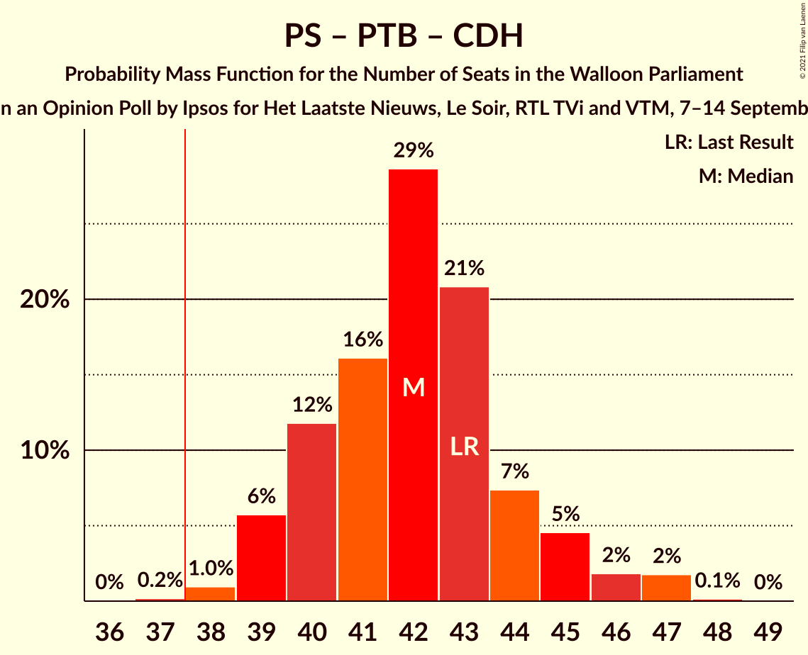

| Number of Seats | Probability | Accumulated | Special Marks |
|:---------------:|:-----------:|:-----------:|:-------------:|
| 37 | 0.2% | 100% |  |
| 38 | 1.0% | 99.8% | Majority |
| 39 | 6% | 98.8% |  |
| 40 | 12% | 93% |  |
| 41 | 16% | 81% |  |
| 42 | 29% | 65% | Median |
| 43 | 21% | 37% | Last Result |
| 44 | 7% | 16% |  |
| 45 | 5% | 8% |  |
| 46 | 2% | 4% |  |
| 47 | 2% | 2% |  |
| 48 | 0.1% | 0.2% |  |
| 49 | 0% | 0% |  |

### Parti Socialiste – Ecolo – Centre démocrate humaniste

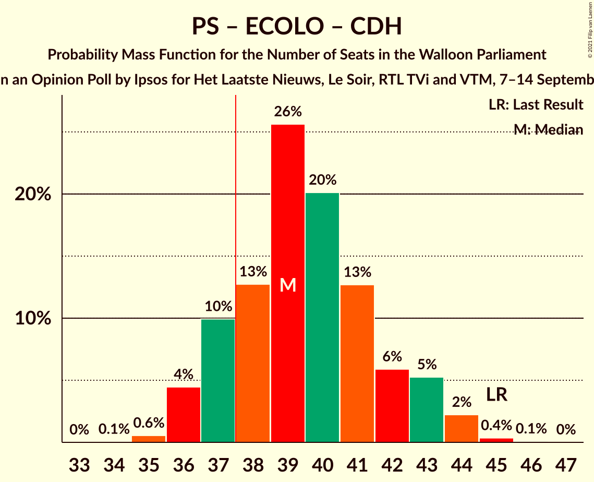

| Number of Seats | Probability | Accumulated | Special Marks |
|:---------------:|:-----------:|:-----------:|:-------------:|
| 34 | 0.1% | 100% |  |
| 35 | 0.6% | 99.9% |  |
| 36 | 4% | 99.4% |  |
| 37 | 10% | 95% |  |
| 38 | 13% | 85% | Majority |
| 39 | 26% | 72% | Median |
| 40 | 20% | 47% |  |
| 41 | 13% | 27% |  |
| 42 | 6% | 14% |  |
| 43 | 5% | 8% |  |
| 44 | 2% | 3% |  |
| 45 | 0.4% | 0.4% | Last Result |
| 46 | 0.1% | 0.1% |  |
| 47 | 0% | 0% |  |

### Mouvement Réformateur – Ecolo – Centre démocrate humaniste

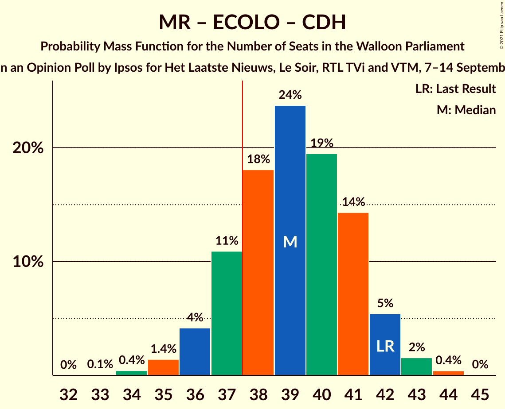

| Number of Seats | Probability | Accumulated | Special Marks |
|:---------------:|:-----------:|:-----------:|:-------------:|
| 33 | 0.1% | 100% |  |
| 34 | 0.4% | 99.9% |  |
| 35 | 1.4% | 99.5% |  |
| 36 | 4% | 98% |  |
| 37 | 11% | 94% |  |
| 38 | 18% | 83% | Majority |
| 39 | 24% | 65% | Median |
| 40 | 19% | 41% |  |
| 41 | 14% | 22% |  |
| 42 | 5% | 7% | Last Result |
| 43 | 2% | 2% |  |
| 44 | 0.4% | 0.5% |  |
| 45 | 0% | 0% |  |

### Parti Socialiste – Mouvement Réformateur

| Number of Seats | Probability | Accumulated | Special Marks |
|:---------------:|:-----------:|:-----------:|:-------------:|
| 31 | 0.4% | 100% |  |
| 32 | 2% | 99.5% |  |
| 33 | 2% | 98% |  |
| 34 | 7% | 95% |  |
| 35 | 20% | 88% |  |
| 36 | 17% | 68% | Median |
| 37 | 20% | 51% |  |
| 38 | 19% | 31% | Majority |
| 39 | 8% | 12% |  |
| 40 | 3% | 4% |  |
| 41 | 0.7% | 0.7% |  |
| 42 | 0.1% | 0.1% |  |
| 43 | 0% | 0% | Last Result |

### Parti Socialiste – Parti du Travail de Belgique

| Number of Seats | Probability | Accumulated | Special Marks |
|:---------------:|:-----------:|:-----------:|:-------------:|
| 29 | 0.1% | 100% |  |
| 30 | 0.2% | 99.9% |  |
| 31 | 1.1% | 99.7% |  |
| 32 | 4% | 98.7% |  |
| 33 | 13% | 95% | Last Result |
| 34 | 24% | 83% |  |
| 35 | 25% | 58% | Median |
| 36 | 21% | 33% |  |
| 37 | 8% | 12% |  |
| 38 | 4% | 4% | Majority |
| 39 | 0.2% | 0.3% |  |
| 40 | 0.1% | 0.1% |  |
| 41 | 0% | 0% |  |

### Parti Socialiste – Ecolo

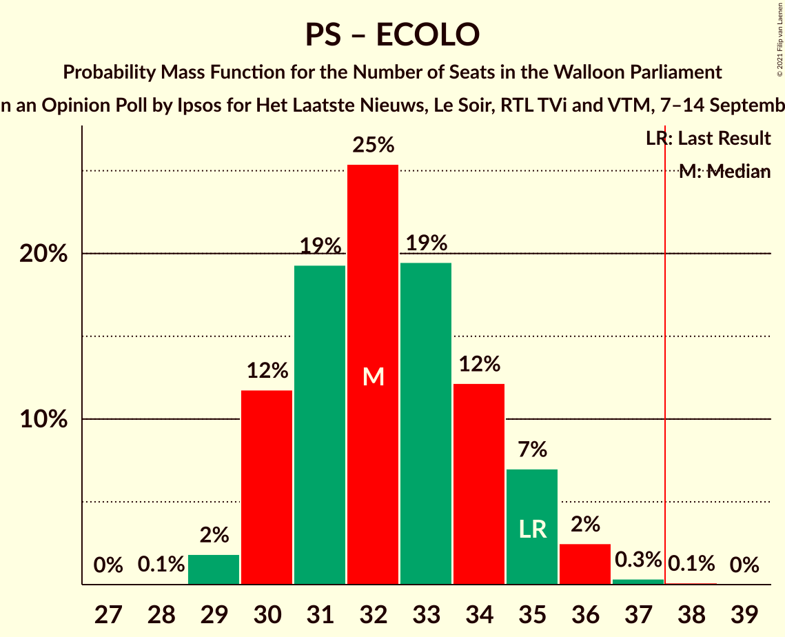

| Number of Seats | Probability | Accumulated | Special Marks |
|:---------------:|:-----------:|:-----------:|:-------------:|
| 28 | 0.1% | 100% |  |
| 29 | 2% | 99.9% |  |
| 30 | 12% | 98% |  |
| 31 | 19% | 86% |  |
| 32 | 25% | 67% | Median |
| 33 | 19% | 42% |  |
| 34 | 12% | 22% |  |
| 35 | 7% | 10% | Last Result |
| 36 | 2% | 3% |  |
| 37 | 0.3% | 0.5% |  |
| 38 | 0.1% | 0.1% | Majority |
| 39 | 0% | 0% |  |

### Mouvement Réformateur – Ecolo

| Number of Seats | Probability | Accumulated | Special Marks |
|:---------------:|:-----------:|:-----------:|:-------------:|
| 26 | 0.1% | 100% |  |
| 27 | 0.6% | 99.9% |  |
| 28 | 3% | 99.3% |  |
| 29 | 5% | 96% |  |
| 30 | 9% | 91% |  |
| 31 | 18% | 82% |  |
| 32 | 28% | 64% | Last Result, Median |
| 33 | 22% | 37% |  |
| 34 | 9% | 15% |  |
| 35 | 5% | 6% |  |
| 36 | 1.1% | 1.2% |  |
| 37 | 0.1% | 0.1% |  |
| 38 | 0% | 0% | Majority |

### Parti du Travail de Belgique – Ecolo

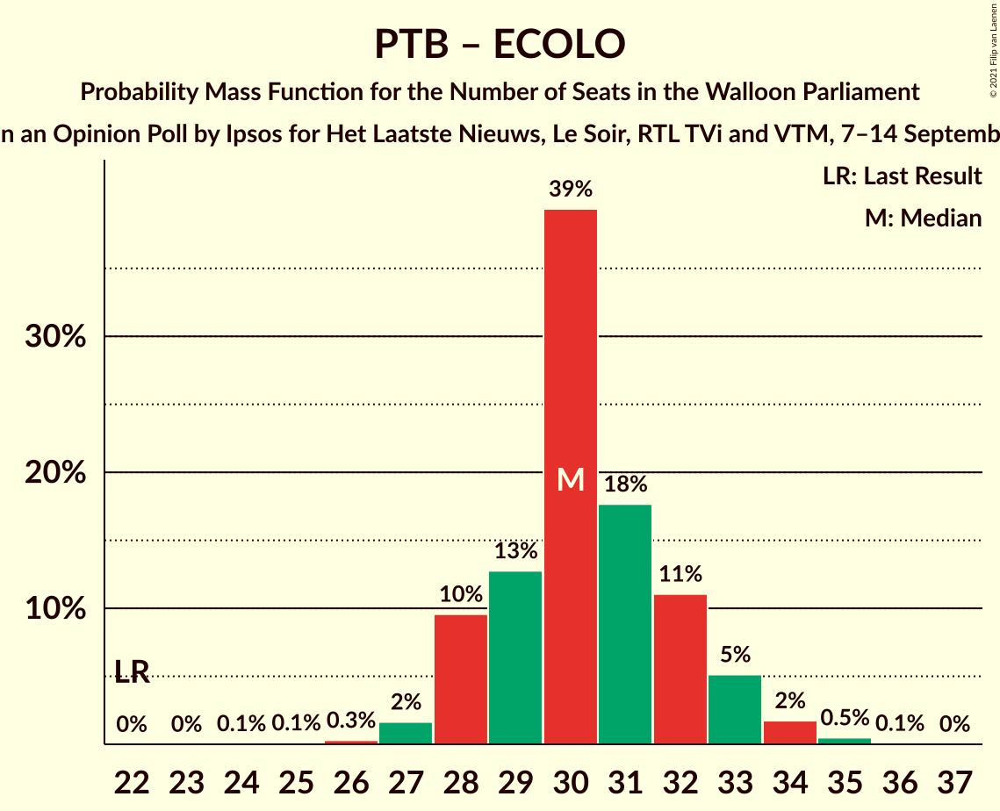

| Number of Seats | Probability | Accumulated | Special Marks |
|:---------------:|:-----------:|:-----------:|:-------------:|
| 22 | 0% | 100% | Last Result |
| 23 | 0% | 100% |  |
| 24 | 0.1% | 100% |  |
| 25 | 0.1% | 99.9% |  |
| 26 | 0.3% | 99.8% |  |
| 27 | 2% | 99.5% |  |
| 28 | 10% | 98% |  |
| 29 | 13% | 88% |  |
| 30 | 39% | 76% |  |
| 31 | 18% | 36% | Median |
| 32 | 11% | 19% |  |
| 33 | 5% | 7% |  |
| 34 | 2% | 2% |  |
| 35 | 0.5% | 0.6% |  |
| 36 | 0.1% | 0.1% |  |
| 37 | 0% | 0% |  |

### Parti Socialiste – Centre démocrate humaniste

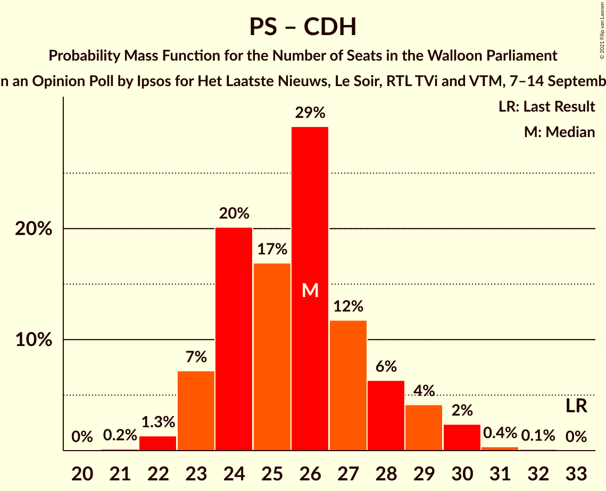

| Number of Seats | Probability | Accumulated | Special Marks |
|:---------------:|:-----------:|:-----------:|:-------------:|
| 21 | 0.2% | 100% |  |
| 22 | 1.3% | 99.8% |  |
| 23 | 7% | 98.5% |  |
| 24 | 20% | 91% |  |
| 25 | 17% | 71% | Median |
| 26 | 29% | 54% |  |
| 27 | 12% | 25% |  |
| 28 | 6% | 13% |  |
| 29 | 4% | 7% |  |
| 30 | 2% | 3% |  |
| 31 | 0.4% | 0.5% |  |
| 32 | 0.1% | 0.1% |  |
| 33 | 0% | 0% | Last Result |

### Mouvement Réformateur – Centre démocrate humaniste

| Number of Seats | Probability | Accumulated | Special Marks |
|:---------------:|:-----------:|:-----------:|:-------------:|
| 20 | 0% | 100% |  |
| 21 | 0.9% | 99.9% |  |
| 22 | 5% | 99.0% |  |
| 23 | 5% | 94% |  |
| 24 | 20% | 90% |  |
| 25 | 27% | 70% | Median |
| 26 | 24% | 43% |  |
| 27 | 8% | 18% |  |
| 28 | 8% | 10% |  |
| 29 | 2% | 2% |  |
| 30 | 0.3% | 0.4% | Last Result |
| 31 | 0.1% | 0.1% |  |
| 32 | 0% | 0% |  |

## Technical Information

### Opinion Poll

+ **Polling firm:** Ipsos
+ **Commissioner(s):** Het Laatste Nieuws, Le Soir, RTL TVi and VTM
+ **Fieldwork period:** 7–14 September 2021

### Calculations

+ **Sample size:** 930
+ **Simulations done:** 1,048,576
+ **Error estimate:** 1.66%

