# Opinion Poll by Ipsos for Het Laatste Nieuws, Le Soir, RTL TVi and VTM, 25 March 2022

<a href="#voting-intentions">Voting Intentions</a> | <a href="#seats">Seats</a> | <a href="#coalitions">Coalitions</a> | <a href="#technical-information">Technical Information</a>

## Voting Intentions

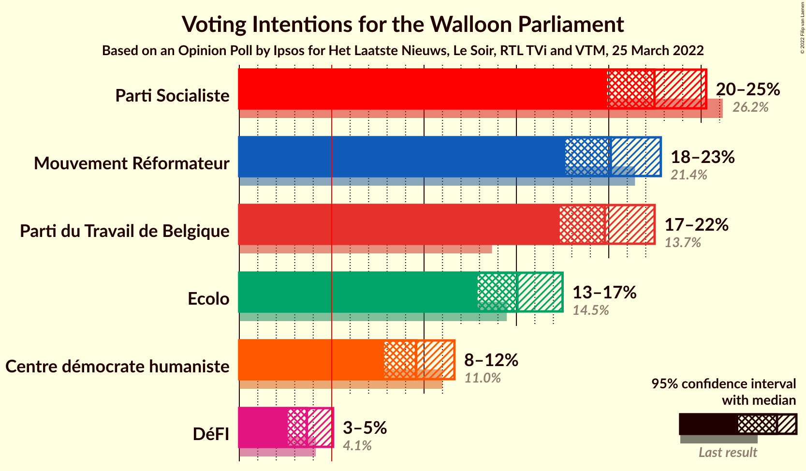

### Confidence Intervals

| Party | Last Result | Poll Result | 80% Confidence Interval | 90% Confidence Interval | 95% Confidence Interval | 99% Confidence Interval |
|:-----:|:-----------:|:-----------:|:-----------------------:|:-----------------------:|:-----------------------:|:-----------------------:|
| Parti Socialiste | 26.2% | 22.5% | 20.8–24.3% |20.3–24.8% |19.9–25.3% |19.1–26.2% |
| Mouvement Réformateur | 21.4% | 20.1% | 18.5–21.9% |18.0–22.4% |17.6–22.8% |16.9–23.7% |
| Parti du Travail de Belgique | 13.7% | 19.8% | 18.2–21.6% |17.7–22.0% |17.3–22.5% |16.6–23.3% |
| Ecolo | 14.5% | 15.1% | 13.6–16.7% |13.2–17.1% |12.9–17.5% |12.2–18.3% |
| Centre démocrate humaniste | 11.0% | 9.6% | 8.4–10.9% |8.1–11.3% |7.8–11.6% |7.3–12.3% |
| DéFI | 4.1% | 3.7% | 3.0–4.6% |2.8–4.8% |2.6–5.1% |2.3–5.5% |

*Note:* The poll result column reflects the actual value used in the calculations. Published results may vary slightly, and in addition be rounded to fewer digits.

## Seats

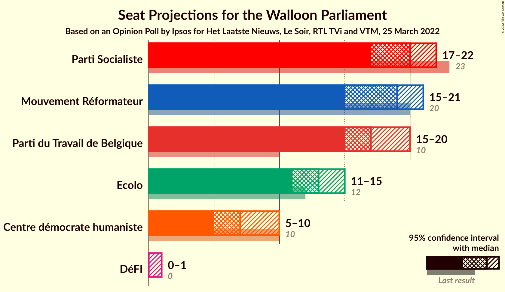

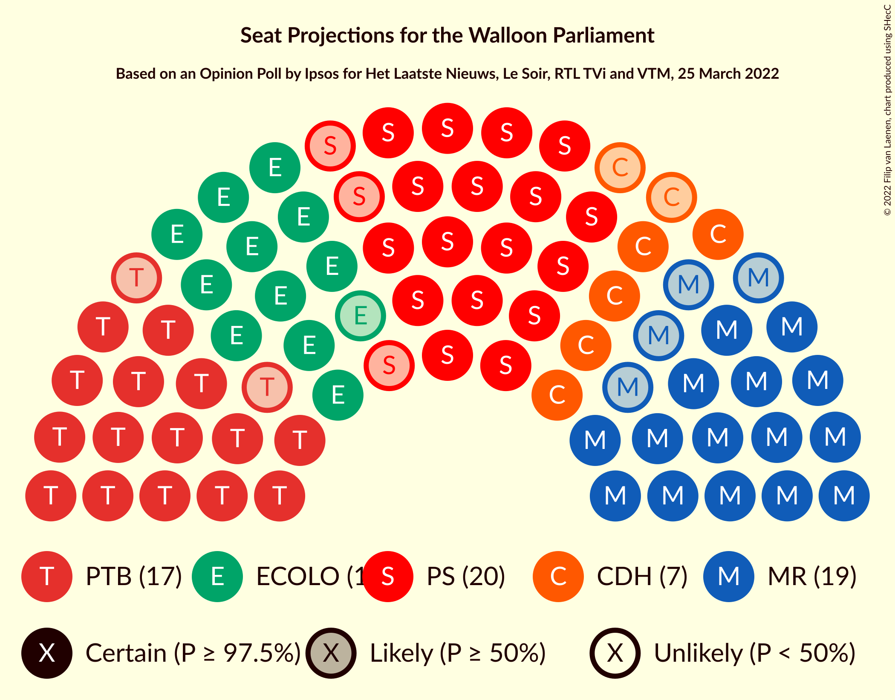

### Confidence Intervals

| Party | Last Result | Median | 80% Confidence Interval | 90% Confidence Interval | 95% Confidence Interval | 99% Confidence Interval |
|:-----:|:-----------:|:------:|:-----------------------:|:-----------------------:|:-----------------------:|:-----------------------:|
| <a href="#parti-socialiste">Parti Socialiste</a> | 23 | 20 | 18–21 |17–21 |17–22 |17–23 |
| <a href="#mouvement-réformateur">Mouvement Réformateur</a> | 20 | 19 | 17–20 |16–21 |15–21 |14–21 |
| <a href="#parti-du-travail-de-belgique">Parti du Travail de Belgique</a> | 10 | 17 | 16–18 |15–19 |15–20 |15–21 |
| <a href="#ecolo">Ecolo</a> | 12 | 13 | 12–14 |12–15 |11–15 |10–15 |
| <a href="#centre-démocrate-humaniste">Centre démocrate humaniste</a> | 10 | 7 | 6–8 |5–9 |5–10 |4–11 |
| <a href="#défi">DéFI</a> | 0 | 0 | 0 |0 |0–1 |0–2 |

### Parti Socialiste

*For a full overview of the results for this party, see the [Parti Socialiste](party-partisocialiste.html) page.*

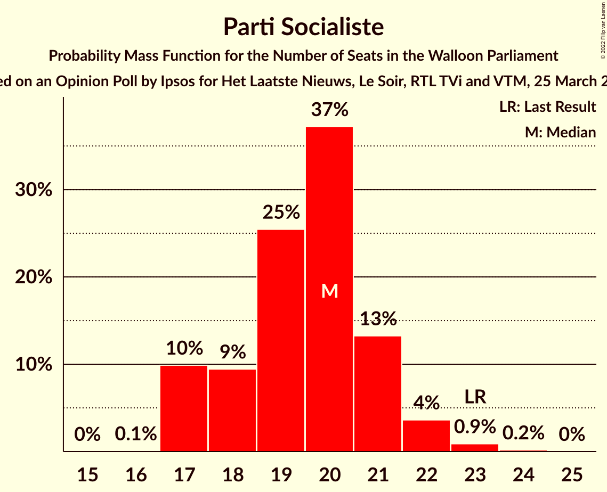

| Number of Seats | Probability | Accumulated | Special Marks |
|:---------------:|:-----------:|:-----------:|:-------------:|
| 16 | 0.1% | 100% |  |
| 17 | 10% | 99.9% |  |
| 18 | 9% | 90% |  |
| 19 | 25% | 81% |  |
| 20 | 37% | 55% | Median |
| 21 | 13% | 18% |  |
| 22 | 4% | 5% |  |
| 23 | 0.9% | 1.1% | Last Result |
| 24 | 0.2% | 0.2% |  |
| 25 | 0% | 0% |  |

### Mouvement Réformateur

*For a full overview of the results for this party, see the [Mouvement Réformateur](party-mouvementréformateur.html) page.*

| Number of Seats | Probability | Accumulated | Special Marks |
|:---------------:|:-----------:|:-----------:|:-------------:|
| 14 | 2% | 100% |  |
| 15 | 1.2% | 98% |  |
| 16 | 5% | 96% |  |
| 17 | 12% | 92% |  |
| 18 | 27% | 80% |  |
| 19 | 38% | 53% | Median |
| 20 | 9% | 15% | Last Result |
| 21 | 6% | 6% |  |
| 22 | 0% | 0% |  |

### Parti du Travail de Belgique

*For a full overview of the results for this party, see the [Parti du Travail de Belgique](party-partidutravaildebelgique.html) page.*

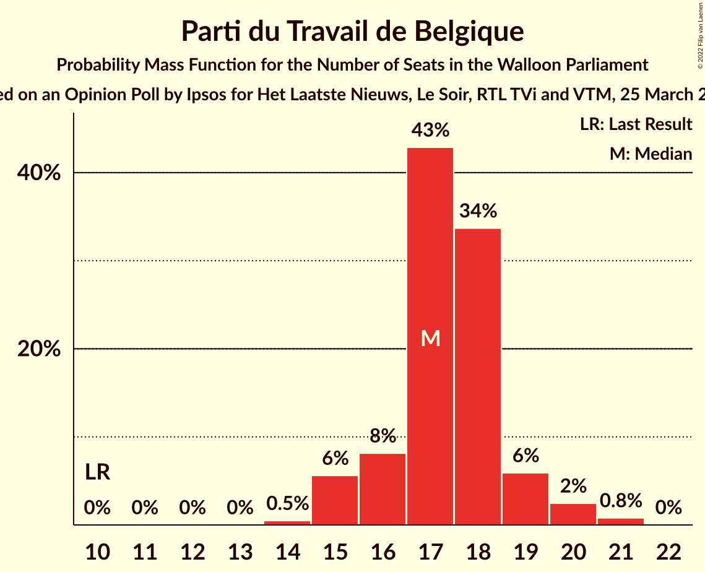

| Number of Seats | Probability | Accumulated | Special Marks |
|:---------------:|:-----------:|:-----------:|:-------------:|
| 10 | 0% | 100% | Last Result |
| 11 | 0% | 100% |  |
| 12 | 0% | 100% |  |
| 13 | 0% | 100% |  |
| 14 | 0.5% | 100% |  |
| 15 | 6% | 99.5% |  |
| 16 | 8% | 94% |  |
| 17 | 43% | 86% | Median |
| 18 | 34% | 43% |  |
| 19 | 6% | 9% |  |
| 20 | 2% | 3% |  |
| 21 | 0.8% | 0.8% |  |
| 22 | 0% | 0% |  |

### Ecolo

*For a full overview of the results for this party, see the [Ecolo](party-ecolo.html) page.*

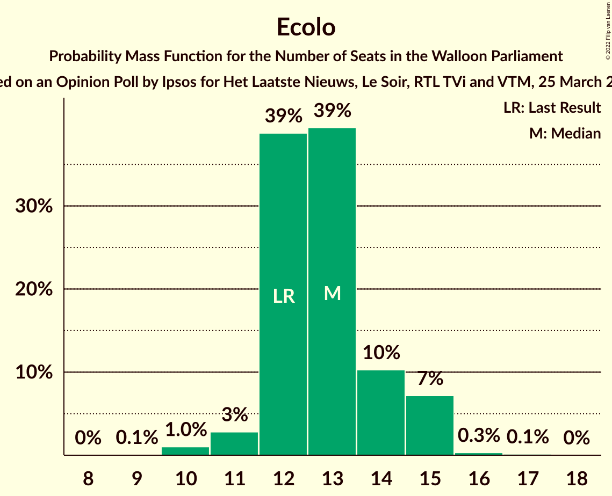

| Number of Seats | Probability | Accumulated | Special Marks |
|:---------------:|:-----------:|:-----------:|:-------------:|
| 9 | 0.1% | 100% |  |
| 10 | 1.0% | 99.9% |  |
| 11 | 3% | 98.9% |  |
| 12 | 39% | 96% | Last Result |
| 13 | 39% | 57% | Median |
| 14 | 10% | 18% |  |
| 15 | 7% | 8% |  |
| 16 | 0.3% | 0.5% |  |
| 17 | 0.1% | 0.2% |  |
| 18 | 0% | 0% |  |

### Centre démocrate humaniste

*For a full overview of the results for this party, see the [Centre démocrate humaniste](party-centredémocratehumaniste.html) page.*

| Number of Seats | Probability | Accumulated | Special Marks |
|:---------------:|:-----------:|:-----------:|:-------------:|
| 4 | 0.6% | 100% |  |
| 5 | 5% | 99.4% |  |
| 6 | 34% | 94% |  |
| 7 | 35% | 60% | Median |
| 8 | 17% | 26% |  |
| 9 | 5% | 9% |  |
| 10 | 3% | 4% | Last Result |
| 11 | 1.2% | 1.2% |  |
| 12 | 0% | 0% |  |

### DéFI

*For a full overview of the results for this party, see the [DéFI](party-défi.html) page.*

| Number of Seats | Probability | Accumulated | Special Marks |
|:---------------:|:-----------:|:-----------:|:-------------:|
| 0 | 97% | 100% | Last Result, Median |
| 1 | 2% | 3% |  |
| 2 | 0.2% | 0.5% |  |
| 3 | 0.1% | 0.4% |  |
| 4 | 0.2% | 0.2% |  |
| 5 | 0% | 0% |  |

## Coalitions

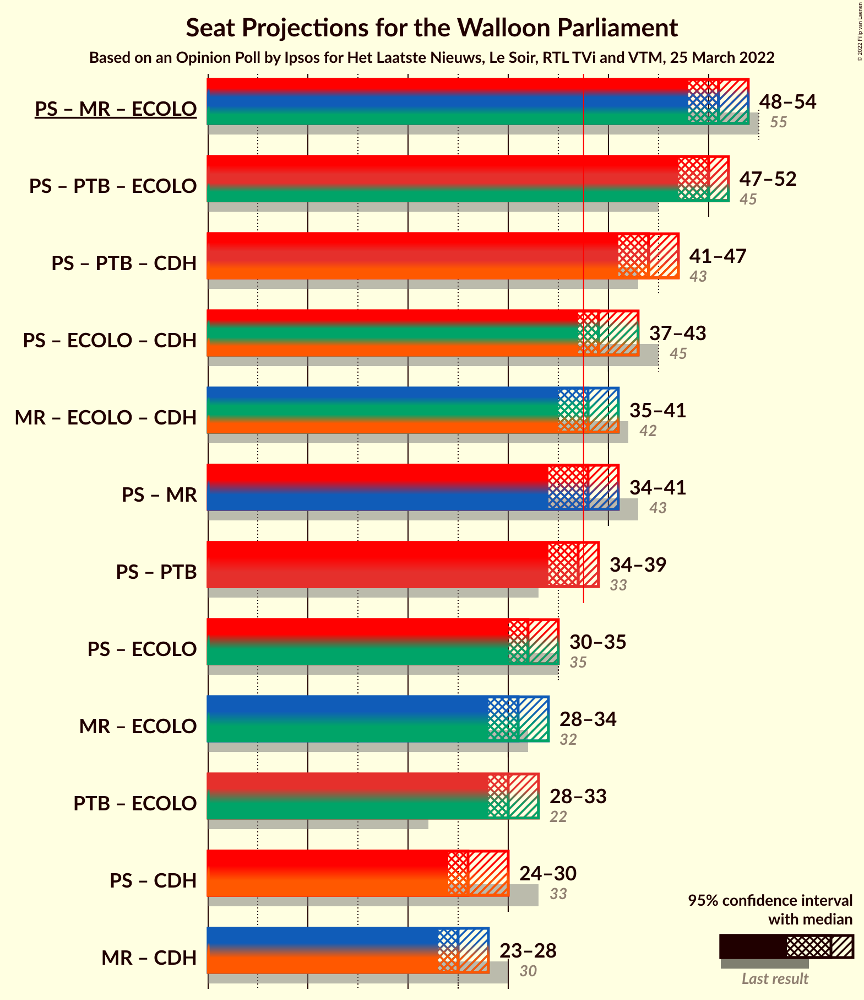

### Confidence Intervals

| Coalition | Last Result | Median | Majority? | 80% Confidence Interval | 90% Confidence Interval | 95% Confidence Interval | 99% Confidence Interval |
|:---------:|:-----------:|:------:|:---------:|:-----------------------:|:-----------------------:|:-----------------------:|:-----------------------:|
| Parti Socialiste – Mouvement Réformateur – Ecolo | 55 | 51 | 100% | 49–53 | 48–53 | 48–54 | 45–54 |
| Parti Socialiste – Parti du Travail de Belgique – Ecolo | 45 | 50 | 100% | 48–51 | 47–51 | 47–52 | 46–53 |
| Parti Socialiste – Parti du Travail de Belgique – Centre démocrate humaniste | 43 | 44 | 100% | 42–46 | 42–46 | 41–47 | 40–49 |
| Parti Socialiste – Ecolo – Centre démocrate humaniste | 45 | 39 | 89% | 37–41 | 37–42 | 37–43 | 35–44 |
| Mouvement Réformateur – Ecolo – Centre démocrate humaniste | 42 | 38 | 66% | 37–40 | 36–40 | 35–41 | 34–42 |
| Parti Socialiste – Mouvement Réformateur | 43 | 38 | 61% | 36–40 | 35–40 | 34–41 | 33–41 |
| Parti Socialiste – Parti du Travail de Belgique | 33 | 37 | 33% | 35–38 | 35–39 | 34–39 | 33–40 |
| Parti Socialiste – Ecolo | 35 | 32 | 0% | 31–34 | 30–35 | 30–35 | 29–36 |
| Mouvement Réformateur – Ecolo | 32 | 31 | 0% | 29–33 | 29–33 | 28–34 | 26–35 |
| Parti du Travail de Belgique – Ecolo | 22 | 30 | 0% | 29–32 | 28–32 | 28–33 | 27–34 |
| Parti Socialiste – Centre démocrate humaniste | 33 | 26 | 0% | 25–29 | 24–29 | 24–30 | 23–31 |
| Mouvement Réformateur – Centre démocrate humaniste | 30 | 25 | 0% | 24–27 | 24–28 | 23–28 | 22–29 |

### Parti Socialiste – Mouvement Réformateur – Ecolo

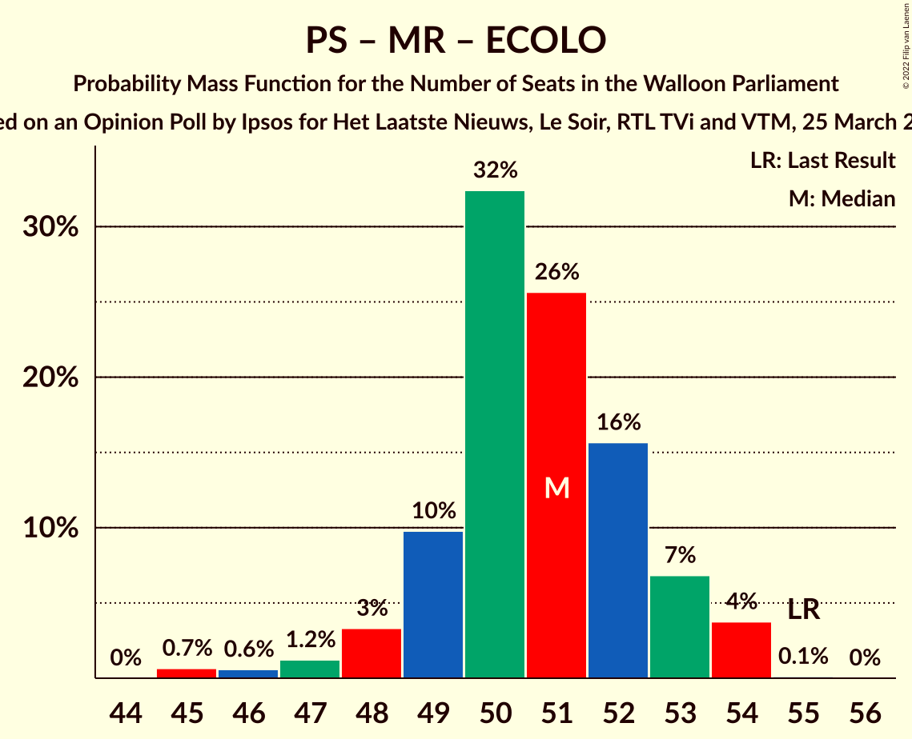

| Number of Seats | Probability | Accumulated | Special Marks |
|:---------------:|:-----------:|:-----------:|:-------------:|
| 45 | 0.7% | 100% |  |
| 46 | 0.6% | 99.3% |  |
| 47 | 1.2% | 98.7% |  |
| 48 | 3% | 98% |  |
| 49 | 10% | 94% |  |
| 50 | 32% | 84% |  |
| 51 | 26% | 52% |  |
| 52 | 16% | 26% | Median |
| 53 | 7% | 11% |  |
| 54 | 4% | 4% |  |
| 55 | 0.1% | 0.1% | Last Result |
| 56 | 0% | 0% |  |

### Parti Socialiste – Parti du Travail de Belgique – Ecolo

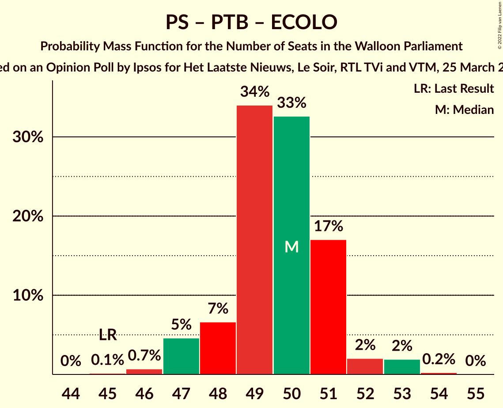

| Number of Seats | Probability | Accumulated | Special Marks |
|:---------------:|:-----------:|:-----------:|:-------------:|
| 45 | 0.1% | 100% | Last Result |
| 46 | 0.7% | 99.8% |  |
| 47 | 5% | 99.1% |  |
| 48 | 7% | 95% |  |
| 49 | 34% | 88% |  |
| 50 | 33% | 54% | Median |
| 51 | 17% | 21% |  |
| 52 | 2% | 4% |  |
| 53 | 2% | 2% |  |
| 54 | 0.2% | 0.3% |  |
| 55 | 0% | 0% |  |

### Parti Socialiste – Parti du Travail de Belgique – Centre démocrate humaniste

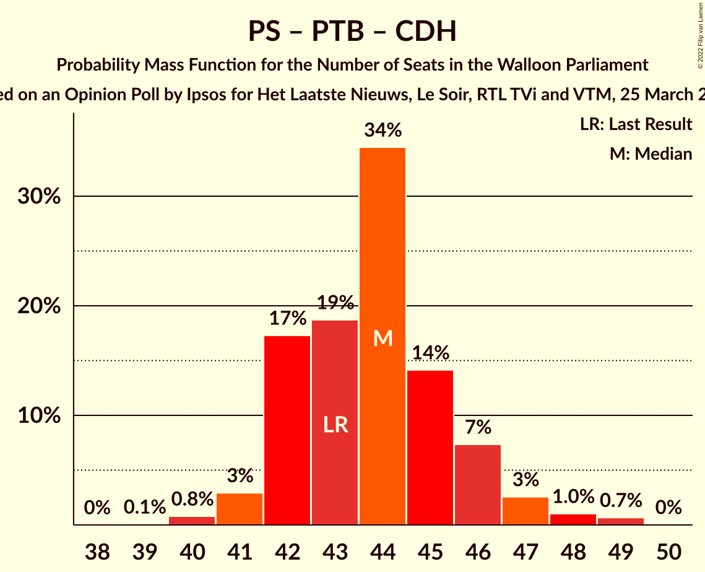

| Number of Seats | Probability | Accumulated | Special Marks |
|:---------------:|:-----------:|:-----------:|:-------------:|
| 39 | 0.1% | 100% |  |
| 40 | 0.8% | 99.9% |  |
| 41 | 3% | 99.1% |  |
| 42 | 17% | 96% |  |
| 43 | 19% | 79% | Last Result |
| 44 | 34% | 60% | Median |
| 45 | 14% | 26% |  |
| 46 | 7% | 12% |  |
| 47 | 3% | 4% |  |
| 48 | 1.0% | 2% |  |
| 49 | 0.7% | 0.7% |  |
| 50 | 0% | 0% |  |

### Parti Socialiste – Ecolo – Centre démocrate humaniste

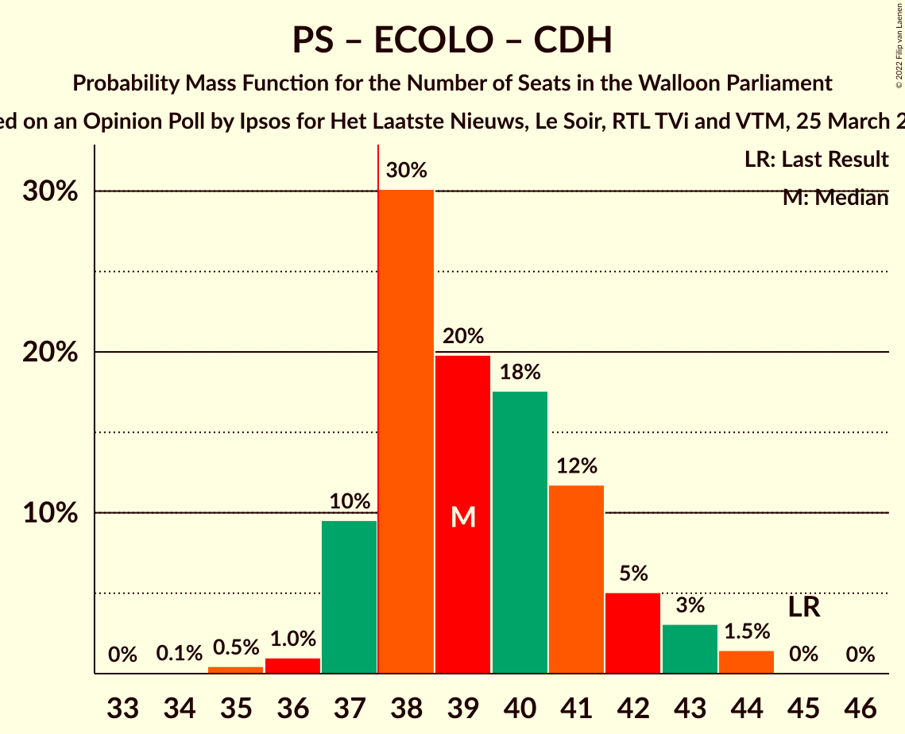

| Number of Seats | Probability | Accumulated | Special Marks |
|:---------------:|:-----------:|:-----------:|:-------------:|
| 34 | 0.1% | 100% |  |
| 35 | 0.5% | 99.9% |  |
| 36 | 1.0% | 99.4% |  |
| 37 | 10% | 98% |  |
| 38 | 30% | 89% | Majority |
| 39 | 20% | 59% |  |
| 40 | 18% | 39% | Median |
| 41 | 12% | 21% |  |
| 42 | 5% | 10% |  |
| 43 | 3% | 5% |  |
| 44 | 1.5% | 2% |  |
| 45 | 0% | 0.1% | Last Result |
| 46 | 0% | 0% |  |

### Mouvement Réformateur – Ecolo – Centre démocrate humaniste

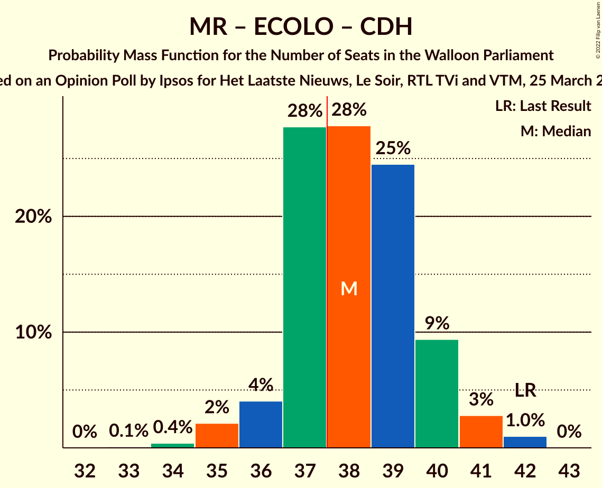

| Number of Seats | Probability | Accumulated | Special Marks |
|:---------------:|:-----------:|:-----------:|:-------------:|
| 33 | 0.1% | 100% |  |
| 34 | 0.4% | 99.9% |  |
| 35 | 2% | 99.5% |  |
| 36 | 4% | 97% |  |
| 37 | 28% | 93% |  |
| 38 | 28% | 66% | Majority |
| 39 | 25% | 38% | Median |
| 40 | 9% | 13% |  |
| 41 | 3% | 4% |  |
| 42 | 1.0% | 1.0% | Last Result |
| 43 | 0% | 0% |  |

### Parti Socialiste – Mouvement Réformateur

| Number of Seats | Probability | Accumulated | Special Marks |
|:---------------:|:-----------:|:-----------:|:-------------:|
| 32 | 0.4% | 100% |  |
| 33 | 0.9% | 99.6% |  |
| 34 | 1.3% | 98.7% |  |
| 35 | 3% | 97% |  |
| 36 | 10% | 95% |  |
| 37 | 24% | 85% |  |
| 38 | 27% | 61% | Majority |
| 39 | 19% | 34% | Median |
| 40 | 10% | 14% |  |
| 41 | 4% | 5% |  |
| 42 | 0.3% | 0.3% |  |
| 43 | 0% | 0% | Last Result |

### Parti Socialiste – Parti du Travail de Belgique

| Number of Seats | Probability | Accumulated | Special Marks |
|:---------------:|:-----------:|:-----------:|:-------------:|
| 33 | 1.0% | 100% | Last Result |
| 34 | 3% | 98.9% |  |
| 35 | 10% | 96% |  |
| 36 | 25% | 86% |  |
| 37 | 29% | 62% | Median |
| 38 | 27% | 33% | Majority |
| 39 | 4% | 6% |  |
| 40 | 2% | 2% |  |
| 41 | 0.3% | 0.4% |  |
| 42 | 0.1% | 0.1% |  |
| 43 | 0% | 0% |  |

### Parti Socialiste – Ecolo

| Number of Seats | Probability | Accumulated | Special Marks |
|:---------------:|:-----------:|:-----------:|:-------------:|
| 28 | 0.1% | 100% |  |
| 29 | 1.0% | 99.8% |  |
| 30 | 9% | 98.9% |  |
| 31 | 21% | 90% |  |
| 32 | 29% | 69% |  |
| 33 | 22% | 41% | Median |
| 34 | 10% | 18% |  |
| 35 | 8% | 9% | Last Result |
| 36 | 1.2% | 1.4% |  |
| 37 | 0.1% | 0.2% |  |
| 38 | 0% | 0% | Majority |

### Mouvement Réformateur – Ecolo

| Number of Seats | Probability | Accumulated | Special Marks |
|:---------------:|:-----------:|:-----------:|:-------------:|
| 26 | 0.7% | 100% |  |
| 27 | 1.1% | 99.3% |  |
| 28 | 3% | 98% |  |
| 29 | 8% | 95% |  |
| 30 | 14% | 88% |  |
| 31 | 35% | 73% |  |
| 32 | 18% | 39% | Last Result, Median |
| 33 | 17% | 21% |  |
| 34 | 3% | 4% |  |
| 35 | 0.7% | 0.8% |  |
| 36 | 0% | 0% |  |

### Parti du Travail de Belgique – Ecolo

| Number of Seats | Probability | Accumulated | Special Marks |
|:---------------:|:-----------:|:-----------:|:-------------:|
| 22 | 0% | 100% | Last Result |
| 23 | 0% | 100% |  |
| 24 | 0% | 100% |  |
| 25 | 0% | 100% |  |
| 26 | 0.2% | 99.9% |  |
| 27 | 2% | 99.8% |  |
| 28 | 6% | 98% |  |
| 29 | 14% | 92% |  |
| 30 | 50% | 78% | Median |
| 31 | 15% | 28% |  |
| 32 | 9% | 13% |  |
| 33 | 2% | 3% |  |
| 34 | 0.8% | 1.1% |  |
| 35 | 0.2% | 0.2% |  |
| 36 | 0.1% | 0.1% |  |
| 37 | 0% | 0% |  |

### Parti Socialiste – Centre démocrate humaniste

| Number of Seats | Probability | Accumulated | Special Marks |
|:---------------:|:-----------:|:-----------:|:-------------:|
| 22 | 0.4% | 100% |  |
| 23 | 2% | 99.6% |  |
| 24 | 7% | 98% |  |
| 25 | 15% | 91% |  |
| 26 | 32% | 75% |  |
| 27 | 24% | 43% | Median |
| 28 | 9% | 19% |  |
| 29 | 6% | 10% |  |
| 30 | 3% | 5% |  |
| 31 | 1.0% | 1.4% |  |
| 32 | 0.4% | 0.4% |  |
| 33 | 0% | 0% | Last Result |

### Mouvement Réformateur – Centre démocrate humaniste

| Number of Seats | Probability | Accumulated | Special Marks |
|:---------------:|:-----------:|:-----------:|:-------------:|
| 21 | 0.3% | 100% |  |
| 22 | 2% | 99.6% |  |
| 23 | 2% | 98% |  |
| 24 | 18% | 95% |  |
| 25 | 32% | 77% |  |
| 26 | 34% | 45% | Median |
| 27 | 7% | 12% |  |
| 28 | 4% | 5% |  |
| 29 | 0.7% | 0.8% |  |
| 30 | 0.1% | 0.1% | Last Result |
| 31 | 0% | 0% |  |

## Technical Information

### Opinion Poll

+ **Polling firm:** Ipsos
+ **Commissioner(s):** Het Laatste Nieuws, Le Soir, RTL TVi and VTM
+ **Fieldwork period:** 25 March 2022

### Calculations

+ **Sample size:** 930
+ **Simulations done:** 65,536
+ **Error estimate:** 1.33%

