# Opinion Poll by Ipsos for Het Laatste Nieuws, Le Soir, RTL TVi and VTM, 6–14 June 2022

<a href="#voting-intentions">Voting Intentions</a> | <a href="#seats">Seats</a> | <a href="#coalitions">Coalitions</a> | <a href="#technical-information">Technical Information</a>

## Voting Intentions

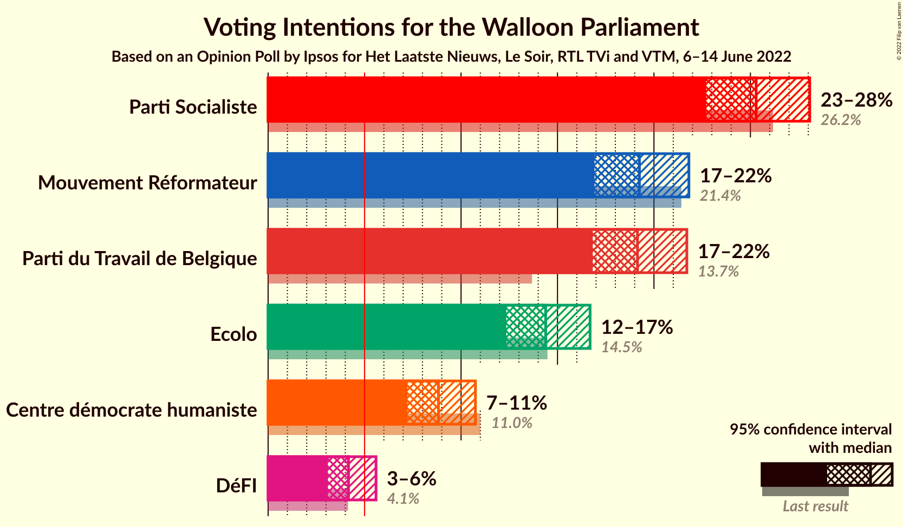

### Confidence Intervals

| Party | Last Result | Poll Result | 80% Confidence Interval | 90% Confidence Interval | 95% Confidence Interval | 99% Confidence Interval |
|:-----:|:-----------:|:-----------:|:-----------------------:|:-----------------------:|:-----------------------:|:-----------------------:|
| Parti Socialiste | 26.2% | 25.3% | 23.6–27.1% |23.1–27.6% |22.7–28.1% |21.9–29.0% |
| Mouvement Réformateur | 21.4% | 19.2% | 17.7–20.9% |17.3–21.4% |16.9–21.8% |16.2–22.6% |
| Parti du Travail de Belgique | 13.7% | 19.1% | 17.6–20.8% |17.2–21.3% |16.8–21.7% |16.1–22.5% |
| Ecolo | 14.5% | 14.4% | 13.0–15.9% |12.7–16.3% |12.3–16.7% |11.7–17.4% |
| Centre démocrate humaniste | 11.0% | 8.8% | 7.8–10.1% |7.5–10.4% |7.2–10.7% |6.8–11.4% |
| DéFI | 4.1% | 4.2% | 3.5–5.1% |3.3–5.4% |3.1–5.6% |2.8–6.1% |

*Note:* The poll result column reflects the actual value used in the calculations. Published results may vary slightly, and in addition be rounded to fewer digits.

## Seats

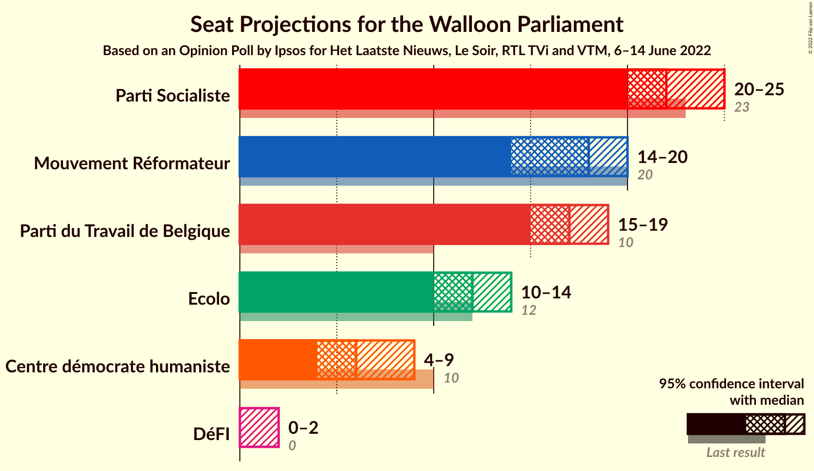

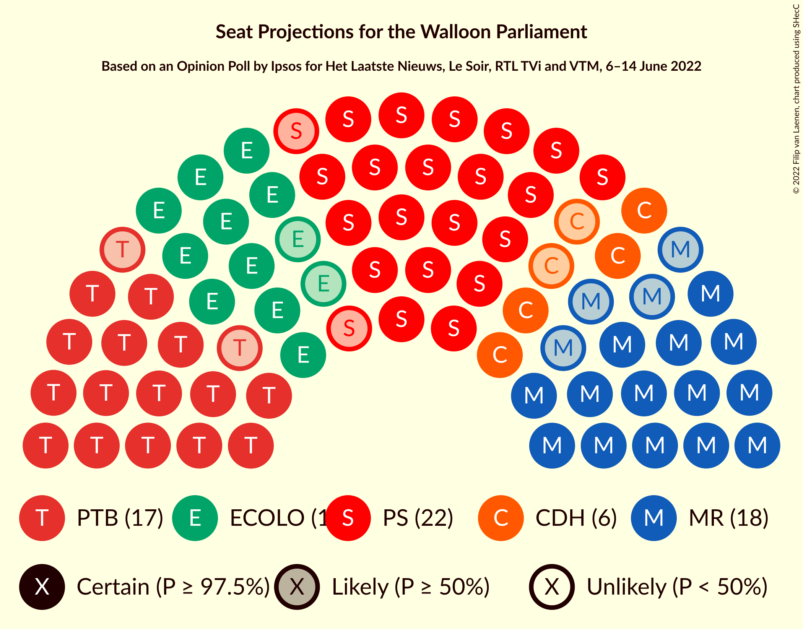

### Confidence Intervals

| Party | Last Result | Median | 80% Confidence Interval | 90% Confidence Interval | 95% Confidence Interval | 99% Confidence Interval |
|:-----:|:-----------:|:------:|:-----------------------:|:-----------------------:|:-----------------------:|:-----------------------:|
| <a href="#parti-socialiste">Parti Socialiste</a> | 23 | 22 | 20–24 |20–24 |20–25 |19–27 |
| <a href="#mouvement-réformateur">Mouvement Réformateur</a> | 20 | 18 | 15–19 |15–19 |14–20 |14–21 |
| <a href="#parti-du-travail-de-belgique">Parti du Travail de Belgique</a> | 10 | 17 | 15–18 |15–18 |15–19 |15–20 |
| <a href="#ecolo">Ecolo</a> | 12 | 12 | 12–13 |11–14 |10–14 |10–15 |
| <a href="#centre-démocrate-humaniste">Centre démocrate humaniste</a> | 10 | 6 | 5–8 |4–8 |4–9 |4–10 |
| <a href="#défi">DéFI</a> | 0 | 0 | 0–1 |0–1 |0–2 |0–4 |

### Parti Socialiste

*For a full overview of the results for this party, see the [Parti Socialiste](party-partisocialiste.html) page.*

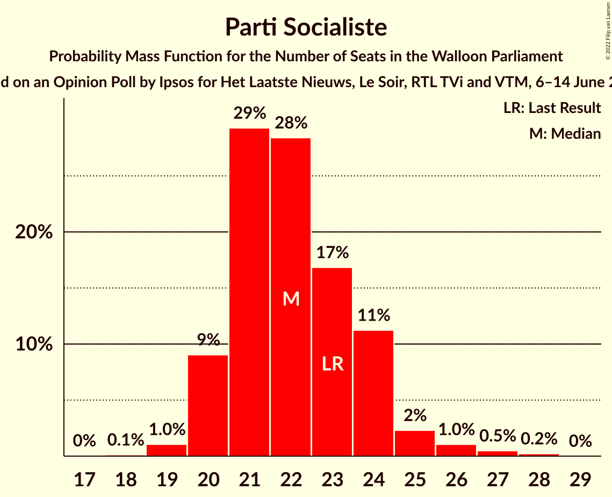

| Number of Seats | Probability | Accumulated | Special Marks |
|:---------------:|:-----------:|:-----------:|:-------------:|
| 18 | 0.1% | 100% |  |
| 19 | 1.0% | 99.9% |  |
| 20 | 9% | 98.8% |  |
| 21 | 29% | 90% |  |
| 22 | 28% | 60% | Median |
| 23 | 17% | 32% | Last Result |
| 24 | 11% | 15% |  |
| 25 | 2% | 4% |  |
| 26 | 1.0% | 2% |  |
| 27 | 0.5% | 0.7% |  |
| 28 | 0.2% | 0.2% |  |
| 29 | 0% | 0% |  |

### Mouvement Réformateur

*For a full overview of the results for this party, see the [Mouvement Réformateur](party-mouvementréformateur.html) page.*

| Number of Seats | Probability | Accumulated | Special Marks |
|:---------------:|:-----------:|:-----------:|:-------------:|
| 13 | 0.1% | 100% |  |
| 14 | 5% | 99.9% |  |
| 15 | 11% | 95% |  |
| 16 | 12% | 84% |  |
| 17 | 14% | 72% |  |
| 18 | 14% | 58% | Median |
| 19 | 41% | 44% |  |
| 20 | 3% | 3% | Last Result |
| 21 | 0.6% | 0.6% |  |
| 22 | 0% | 0% |  |

### Parti du Travail de Belgique

*For a full overview of the results for this party, see the [Parti du Travail de Belgique](party-partidutravaildebelgique.html) page.*

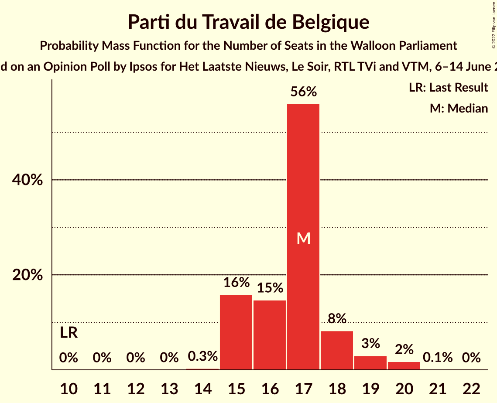

| Number of Seats | Probability | Accumulated | Special Marks |
|:---------------:|:-----------:|:-----------:|:-------------:|
| 10 | 0% | 100% | Last Result |
| 11 | 0% | 100% |  |
| 12 | 0% | 100% |  |
| 13 | 0% | 100% |  |
| 14 | 0.3% | 99.9% |  |
| 15 | 16% | 99.6% |  |
| 16 | 15% | 84% |  |
| 17 | 56% | 69% | Median |
| 18 | 8% | 13% |  |
| 19 | 3% | 5% |  |
| 20 | 2% | 2% |  |
| 21 | 0.1% | 0.1% |  |
| 22 | 0% | 0% |  |

### Ecolo

*For a full overview of the results for this party, see the [Ecolo](party-ecolo.html) page.*

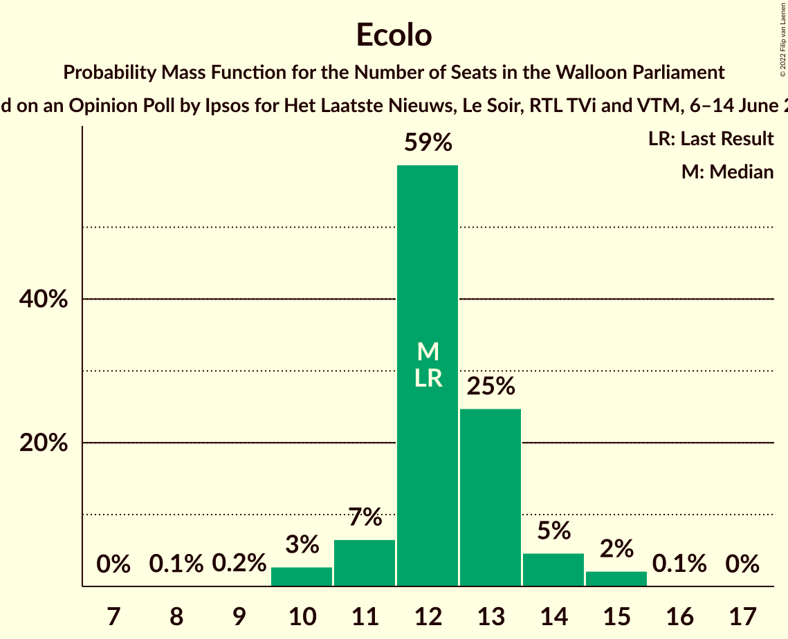

| Number of Seats | Probability | Accumulated | Special Marks |
|:---------------:|:-----------:|:-----------:|:-------------:|
| 8 | 0.1% | 100% |  |
| 9 | 0.2% | 99.9% |  |
| 10 | 3% | 99.7% |  |
| 11 | 7% | 97% |  |
| 12 | 59% | 90% | Last Result, Median |
| 13 | 25% | 32% |  |
| 14 | 5% | 7% |  |
| 15 | 2% | 2% |  |
| 16 | 0.1% | 0.1% |  |
| 17 | 0% | 0% |  |

### Centre démocrate humaniste

*For a full overview of the results for this party, see the [Centre démocrate humaniste](party-centredémocratehumaniste.html) page.*

| Number of Seats | Probability | Accumulated | Special Marks |
|:---------------:|:-----------:|:-----------:|:-------------:|
| 3 | 0.1% | 100% |  |
| 4 | 6% | 99.9% |  |
| 5 | 14% | 94% |  |
| 6 | 48% | 80% | Median |
| 7 | 21% | 32% |  |
| 8 | 8% | 11% |  |
| 9 | 3% | 3% |  |
| 10 | 0.7% | 0.8% | Last Result |
| 11 | 0.1% | 0.1% |  |
| 12 | 0% | 0% |  |

### DéFI

*For a full overview of the results for this party, see the [DéFI](party-défi.html) page.*

| Number of Seats | Probability | Accumulated | Special Marks |
|:---------------:|:-----------:|:-----------:|:-------------:|
| 0 | 89% | 100% | Last Result, Median |
| 1 | 8% | 11% |  |
| 2 | 0.8% | 3% |  |
| 3 | 1.0% | 2% |  |
| 4 | 1.3% | 1.3% |  |
| 5 | 0% | 0% |  |

## Coalitions

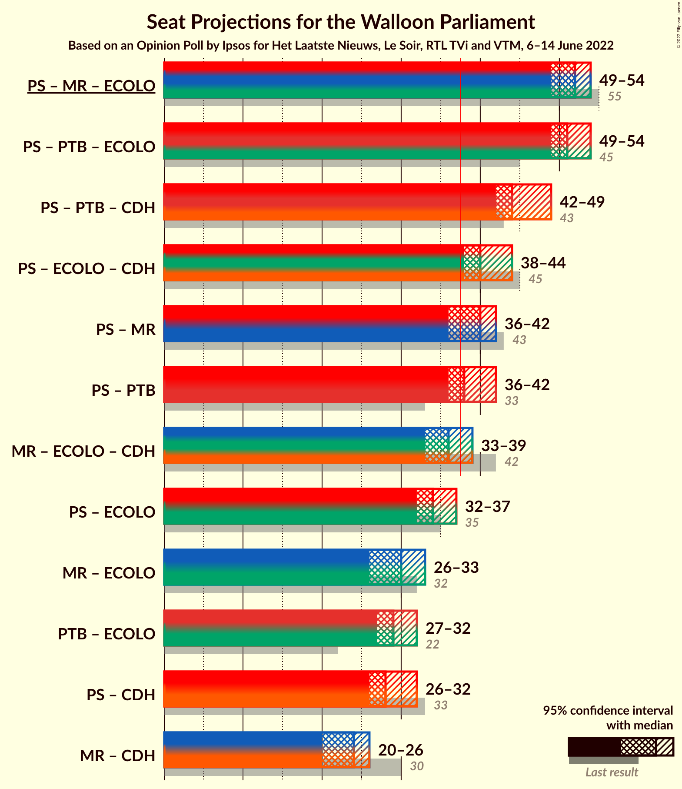

### Confidence Intervals

| Coalition | Last Result | Median | Majority? | 80% Confidence Interval | 90% Confidence Interval | 95% Confidence Interval | 99% Confidence Interval |
|:---------:|:-----------:|:------:|:---------:|:-----------------------:|:-----------------------:|:-----------------------:|:-----------------------:|
| Parti Socialiste – Mouvement Réformateur – Ecolo | 55 | 52 | 100% | 50–54 | 49–54 | 49–54 | 48–55 |
| Parti Socialiste – Parti du Travail de Belgique – Ecolo | 45 | 51 | 100% | 50–53 | 49–54 | 49–54 | 48–56 |
| Parti Socialiste – Parti du Travail de Belgique – Centre démocrate humaniste | 43 | 44 | 100% | 43–48 | 43–48 | 42–49 | 42–49 |
| Parti Socialiste – Ecolo – Centre démocrate humaniste | 45 | 40 | 98% | 39–43 | 38–44 | 38–44 | 37–46 |
| Parti Socialiste – Mouvement Réformateur | 43 | 40 | 88% | 37–41 | 37–42 | 36–42 | 35–43 |
| Parti Socialiste – Parti du Travail de Belgique | 33 | 38 | 86% | 37–41 | 37–41 | 36–42 | 36–43 |
| Mouvement Réformateur – Ecolo – Centre démocrate humaniste | 42 | 36 | 13% | 34–38 | 33–38 | 33–39 | 31–39 |
| Parti Socialiste – Ecolo | 35 | 34 | 2% | 33–36 | 32–37 | 32–37 | 31–39 |
| Mouvement Réformateur – Ecolo | 32 | 30 | 0% | 27–32 | 27–32 | 26–33 | 26–33 |
| Parti du Travail de Belgique – Ecolo | 22 | 29 | 0% | 27–30 | 27–31 | 27–32 | 26–33 |
| Parti Socialiste – Centre démocrate humaniste | 33 | 28 | 0% | 26–31 | 26–31 | 26–32 | 25–33 |
| Mouvement Réformateur – Centre démocrate humaniste | 30 | 24 | 0% | 22–25 | 21–26 | 20–26 | 19–27 |

### Parti Socialiste – Mouvement Réformateur – Ecolo

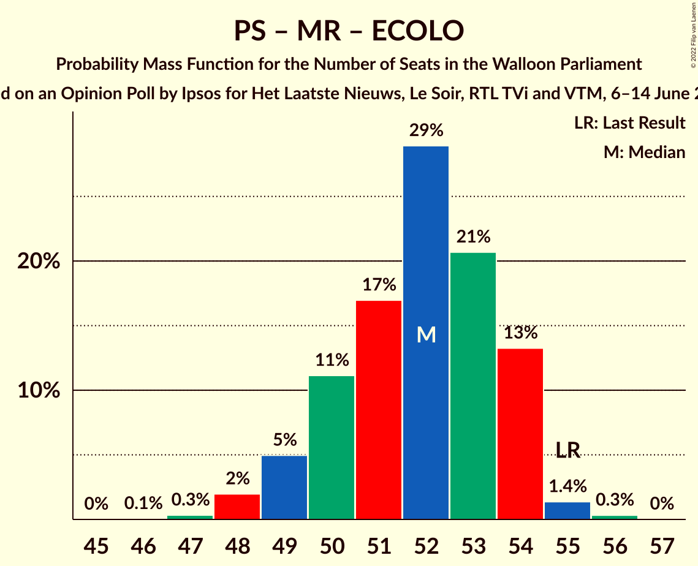

| Number of Seats | Probability | Accumulated | Special Marks |
|:---------------:|:-----------:|:-----------:|:-------------:|
| 46 | 0.1% | 100% |  |
| 47 | 0.3% | 99.9% |  |
| 48 | 2% | 99.6% |  |
| 49 | 5% | 98% |  |
| 50 | 11% | 93% |  |
| 51 | 17% | 82% |  |
| 52 | 29% | 65% | Median |
| 53 | 21% | 36% |  |
| 54 | 13% | 15% |  |
| 55 | 1.4% | 2% | Last Result |
| 56 | 0.3% | 0.3% |  |
| 57 | 0% | 0% |  |

### Parti Socialiste – Parti du Travail de Belgique – Ecolo

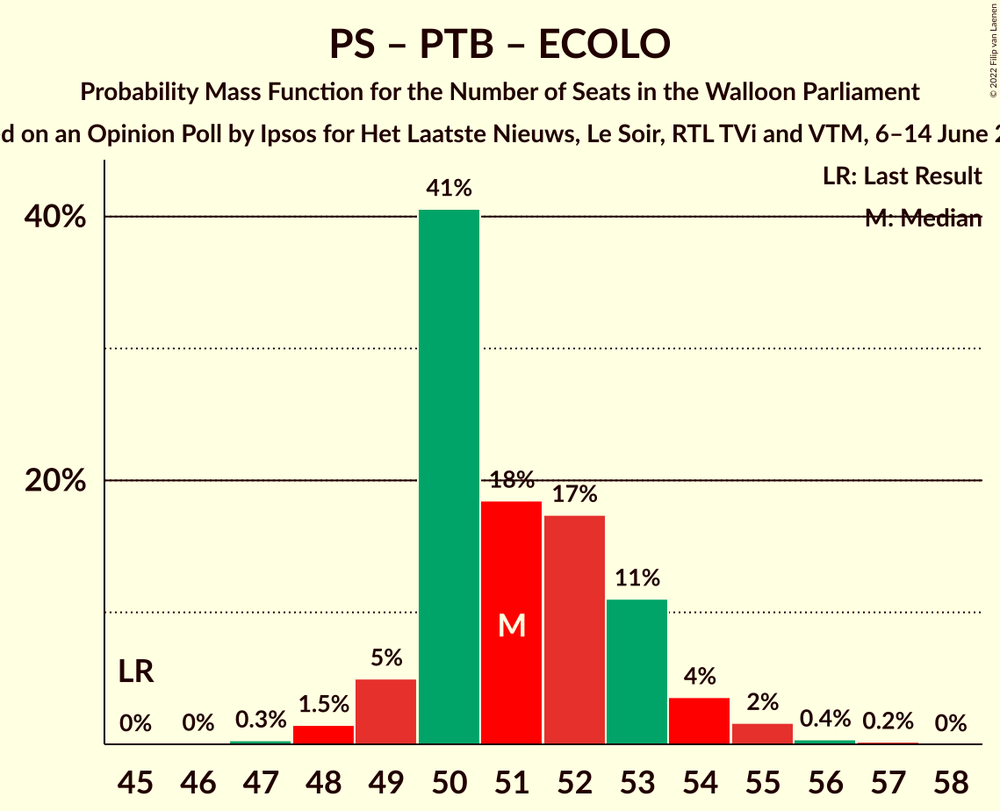

| Number of Seats | Probability | Accumulated | Special Marks |
|:---------------:|:-----------:|:-----------:|:-------------:|
| 45 | 0% | 100% | Last Result |
| 46 | 0% | 100% |  |
| 47 | 0.3% | 99.9% |  |
| 48 | 1.5% | 99.6% |  |
| 49 | 5% | 98% |  |
| 50 | 41% | 93% |  |
| 51 | 18% | 53% | Median |
| 52 | 17% | 34% |  |
| 53 | 11% | 17% |  |
| 54 | 4% | 6% |  |
| 55 | 2% | 2% |  |
| 56 | 0.4% | 0.6% |  |
| 57 | 0.2% | 0.2% |  |
| 58 | 0% | 0% |  |

### Parti Socialiste – Parti du Travail de Belgique – Centre démocrate humaniste

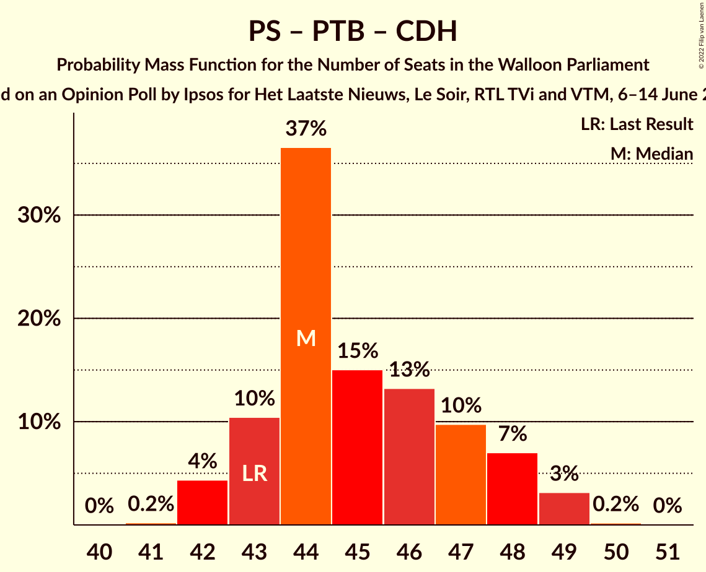

| Number of Seats | Probability | Accumulated | Special Marks |
|:---------------:|:-----------:|:-----------:|:-------------:|
| 41 | 0.2% | 100% |  |
| 42 | 4% | 99.7% |  |
| 43 | 10% | 95% | Last Result |
| 44 | 37% | 85% |  |
| 45 | 15% | 48% | Median |
| 46 | 13% | 33% |  |
| 47 | 10% | 20% |  |
| 48 | 7% | 10% |  |
| 49 | 3% | 3% |  |
| 50 | 0.2% | 0.2% |  |
| 51 | 0% | 0% |  |

### Parti Socialiste – Ecolo – Centre démocrate humaniste

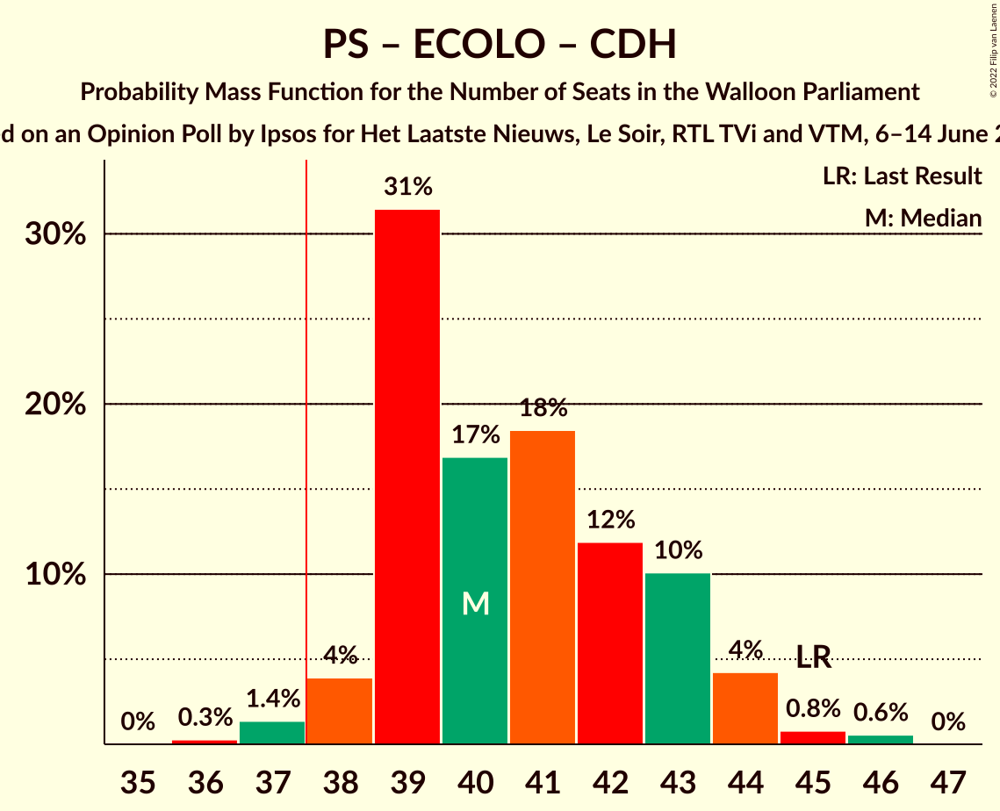

| Number of Seats | Probability | Accumulated | Special Marks |
|:---------------:|:-----------:|:-----------:|:-------------:|
| 36 | 0.3% | 100% |  |
| 37 | 1.4% | 99.7% |  |
| 38 | 4% | 98% | Majority |
| 39 | 31% | 94% |  |
| 40 | 17% | 63% | Median |
| 41 | 18% | 46% |  |
| 42 | 12% | 28% |  |
| 43 | 10% | 16% |  |
| 44 | 4% | 6% |  |
| 45 | 0.8% | 1.4% | Last Result |
| 46 | 0.6% | 0.6% |  |
| 47 | 0% | 0% |  |

### Parti Socialiste – Mouvement Réformateur

| Number of Seats | Probability | Accumulated | Special Marks |
|:---------------:|:-----------:|:-----------:|:-------------:|
| 34 | 0.1% | 100% |  |
| 35 | 0.8% | 99.9% |  |
| 36 | 3% | 99.1% |  |
| 37 | 8% | 96% |  |
| 38 | 12% | 88% | Majority |
| 39 | 18% | 76% |  |
| 40 | 25% | 58% | Median |
| 41 | 24% | 33% |  |
| 42 | 8% | 9% |  |
| 43 | 1.2% | 1.4% | Last Result |
| 44 | 0.2% | 0.2% |  |
| 45 | 0% | 0% |  |

### Parti Socialiste – Parti du Travail de Belgique

| Number of Seats | Probability | Accumulated | Special Marks |
|:---------------:|:-----------:|:-----------:|:-------------:|
| 33 | 0% | 100% | Last Result |
| 34 | 0.1% | 100% |  |
| 35 | 0.4% | 99.9% |  |
| 36 | 3% | 99.5% |  |
| 37 | 11% | 96% |  |
| 38 | 39% | 86% | Majority |
| 39 | 20% | 46% | Median |
| 40 | 13% | 26% |  |
| 41 | 9% | 14% |  |
| 42 | 3% | 5% |  |
| 43 | 1.5% | 2% |  |
| 44 | 0.3% | 0.4% |  |
| 45 | 0.1% | 0.1% |  |
| 46 | 0% | 0% |  |

### Mouvement Réformateur – Ecolo – Centre démocrate humaniste

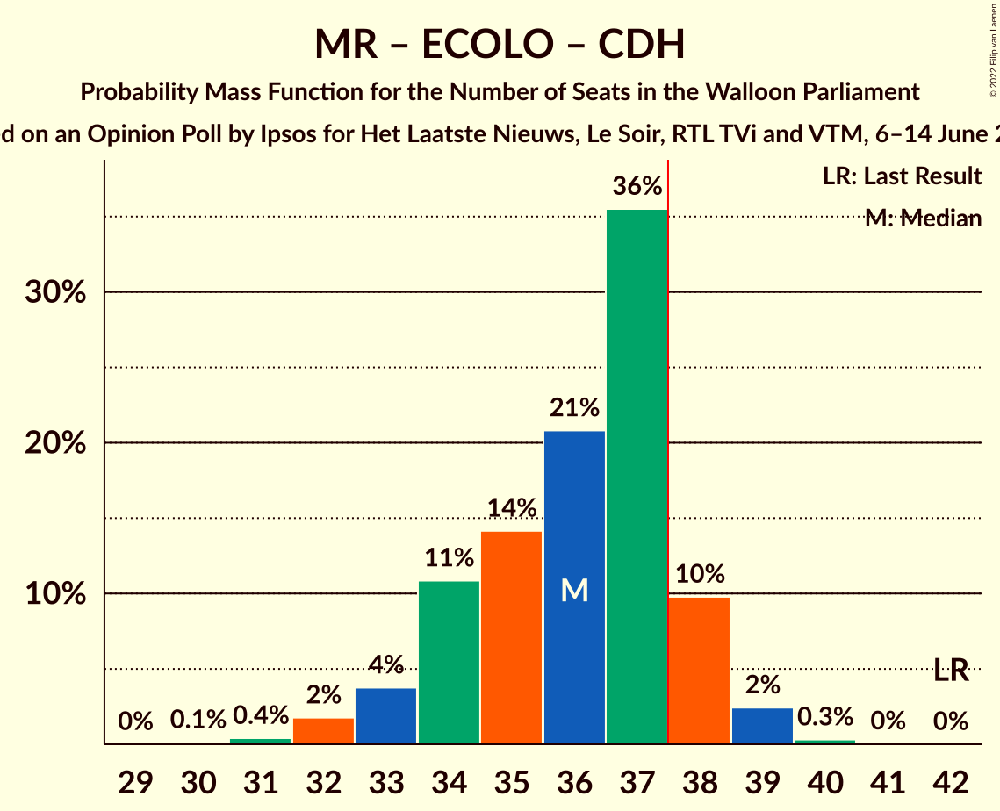

| Number of Seats | Probability | Accumulated | Special Marks |
|:---------------:|:-----------:|:-----------:|:-------------:|
| 30 | 0.1% | 100% |  |
| 31 | 0.4% | 99.9% |  |
| 32 | 2% | 99.4% |  |
| 33 | 4% | 98% |  |
| 34 | 11% | 94% |  |
| 35 | 14% | 83% |  |
| 36 | 21% | 69% | Median |
| 37 | 36% | 48% |  |
| 38 | 10% | 13% | Majority |
| 39 | 2% | 3% |  |
| 40 | 0.3% | 0.4% |  |
| 41 | 0% | 0.1% |  |
| 42 | 0% | 0% | Last Result |

### Parti Socialiste – Ecolo

| Number of Seats | Probability | Accumulated | Special Marks |
|:---------------:|:-----------:|:-----------:|:-------------:|
| 30 | 0.4% | 100% |  |
| 31 | 0.9% | 99.6% |  |
| 32 | 6% | 98.7% |  |
| 33 | 29% | 93% |  |
| 34 | 21% | 65% | Median |
| 35 | 23% | 44% | Last Result |
| 36 | 15% | 21% |  |
| 37 | 4% | 6% |  |
| 38 | 2% | 2% | Majority |
| 39 | 0.6% | 0.9% |  |
| 40 | 0.3% | 0.3% |  |
| 41 | 0% | 0% |  |

### Mouvement Réformateur – Ecolo

| Number of Seats | Probability | Accumulated | Special Marks |
|:---------------:|:-----------:|:-----------:|:-------------:|
| 24 | 0.1% | 100% |  |
| 25 | 0.2% | 99.9% |  |
| 26 | 4% | 99.7% |  |
| 27 | 9% | 96% |  |
| 28 | 10% | 88% |  |
| 29 | 16% | 77% |  |
| 30 | 15% | 62% | Median |
| 31 | 34% | 47% |  |
| 32 | 9% | 13% | Last Result |
| 33 | 4% | 4% |  |
| 34 | 0.1% | 0.1% |  |
| 35 | 0% | 0% |  |

### Parti du Travail de Belgique – Ecolo

| Number of Seats | Probability | Accumulated | Special Marks |
|:---------------:|:-----------:|:-----------:|:-------------:|
| 22 | 0% | 100% | Last Result |
| 23 | 0% | 100% |  |
| 24 | 0.1% | 100% |  |
| 25 | 0.3% | 99.9% |  |
| 26 | 0.9% | 99.6% |  |
| 27 | 10% | 98.7% |  |
| 28 | 21% | 89% |  |
| 29 | 37% | 69% | Median |
| 30 | 23% | 31% |  |
| 31 | 6% | 9% |  |
| 32 | 2% | 3% |  |
| 33 | 0.6% | 0.8% |  |
| 34 | 0.2% | 0.2% |  |
| 35 | 0% | 0% |  |

### Parti Socialiste – Centre démocrate humaniste

| Number of Seats | Probability | Accumulated | Special Marks |
|:---------------:|:-----------:|:-----------:|:-------------:|
| 24 | 0.2% | 100% |  |
| 25 | 2% | 99.7% |  |
| 26 | 9% | 98% |  |
| 27 | 30% | 89% |  |
| 28 | 19% | 59% | Median |
| 29 | 17% | 40% |  |
| 30 | 10% | 23% |  |
| 31 | 9% | 12% |  |
| 32 | 3% | 4% |  |
| 33 | 0.5% | 0.8% | Last Result |
| 34 | 0.3% | 0.3% |  |
| 35 | 0% | 0% |  |

### Mouvement Réformateur – Centre démocrate humaniste

| Number of Seats | Probability | Accumulated | Special Marks |
|:---------------:|:-----------:|:-----------:|:-------------:|
| 18 | 0.2% | 100% |  |
| 19 | 0.5% | 99.8% |  |
| 20 | 2% | 99.3% |  |
| 21 | 5% | 97% |  |
| 22 | 14% | 93% |  |
| 23 | 17% | 79% |  |
| 24 | 19% | 61% | Median |
| 25 | 37% | 43% |  |
| 26 | 4% | 5% |  |
| 27 | 1.0% | 1.2% |  |
| 28 | 0.1% | 0.2% |  |
| 29 | 0% | 0% |  |
| 30 | 0% | 0% | Last Result |

## Technical Information

### Opinion Poll

+ **Polling firm:** Ipsos
+ **Commissioner(s):** Het Laatste Nieuws, Le Soir, RTL TVi and VTM
+ **Fieldwork period:** 6–14 June 2022

### Calculations

+ **Sample size:** 1008
+ **Simulations done:** 1,048,576
+ **Error estimate:** 0.49%

