# Opinion Poll by Ipsos for Het Laatste Nieuws, Le Soir, RTL TVi and VTM, 18–25 September 2023

<a href="#voting-intentions">Voting Intentions</a> | <a href="#seats">Seats</a> | <a href="#coalitions">Coalitions</a> | <a href="#technical-information">Technical Information</a>

## Voting Intentions

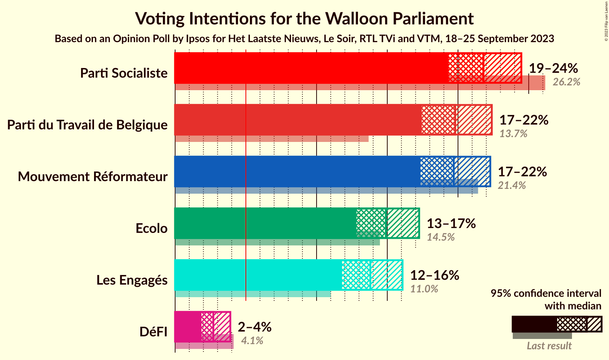

### Confidence Intervals

| Party | Last Result | Poll Result | 80% Confidence Interval | 90% Confidence Interval | 95% Confidence Interval | 99% Confidence Interval |
|:-----:|:-----------:|:-----------:|:-----------------------:|:-----------------------:|:-----------------------:|:-----------------------:|
| Parti Socialiste | 26.2% | 21.8% | 20.2–23.5% |19.7–24.0% |19.3–24.5% |18.6–25.3% |
| Parti du Travail de Belgique | 13.7% | 19.8% | 18.2–21.5% |17.8–22.0% |17.4–22.4% |16.7–23.2% |
| Mouvement Réformateur | 21.4% | 19.7% | 18.2–21.4% |17.7–21.9% |17.3–22.3% |16.6–23.1% |
| Ecolo | 14.5% | 14.9% | 13.5–16.4% |13.2–16.9% |12.8–17.3% |12.2–18.0% |
| Les Engagés | 11.0% | 13.8% | 12.5–15.3% |12.1–15.7% |11.8–16.1% |11.2–16.8% |
| DéFI | 4.1% | 2.7% | 2.1–3.5% |2.0–3.7% |1.9–3.9% |1.6–4.3% |

*Note:* The poll result column reflects the actual value used in the calculations. Published results may vary slightly, and in addition be rounded to fewer digits.

## Seats

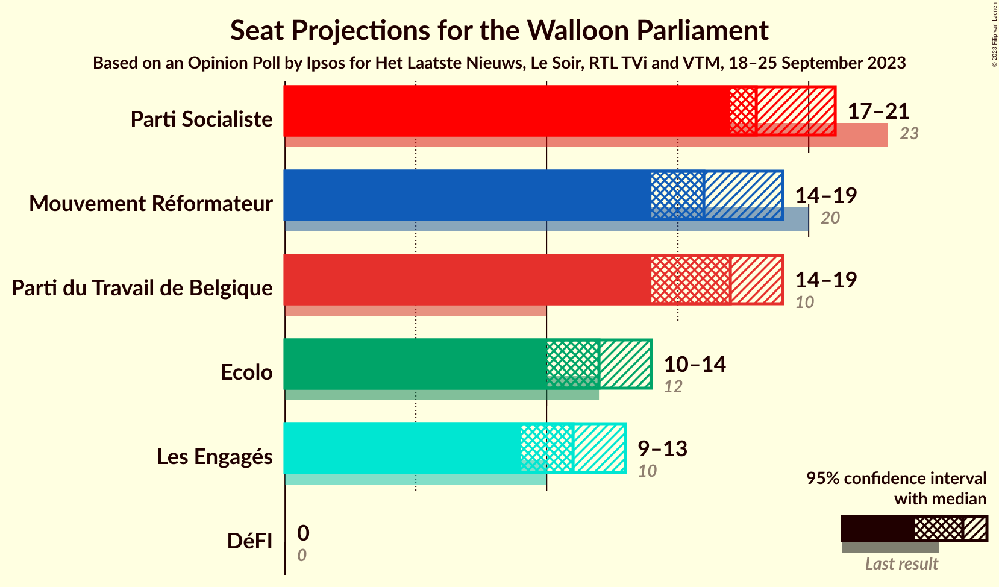

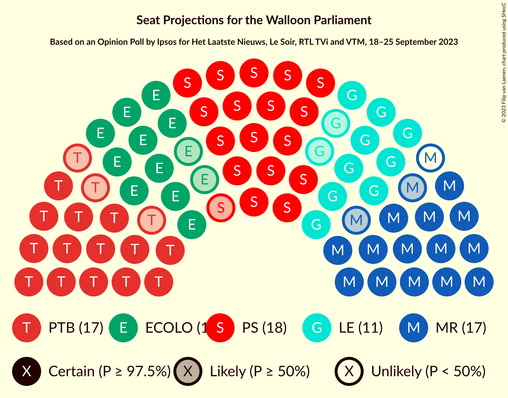

### Confidence Intervals

| Party | Last Result | Median | 80% Confidence Interval | 90% Confidence Interval | 95% Confidence Interval | 99% Confidence Interval |
|:-----:|:-----------:|:------:|:-----------------------:|:-----------------------:|:-----------------------:|:-----------------------:|
| <a href="#parti-socialiste">Parti Socialiste</a> | 23 | 18 | 17–20 |17–21 |17–21 |16–21 |
| <a href="#parti-du-travail-de-belgique">Parti du Travail de Belgique</a> | 10 | 17 | 15–18 |15–19 |14–19 |14–20 |
| <a href="#mouvement-réformateur">Mouvement Réformateur</a> | 20 | 16 | 14–18 |14–18 |14–19 |14–20 |
| <a href="#ecolo">Ecolo</a> | 12 | 12 | 12–13 |11–14 |10–14 |9–14 |
| <a href="#les-engagés">Les Engagés</a> | 10 | 11 | 10–13 |10–13 |9–13 |8–14 |
| <a href="#défi">DéFI</a> | 0 | 0 | 0 |0 |0 |0 |

### Parti Socialiste

*For a full overview of the results for this party, see the [Parti Socialiste](party-partisocialiste.html) page.*

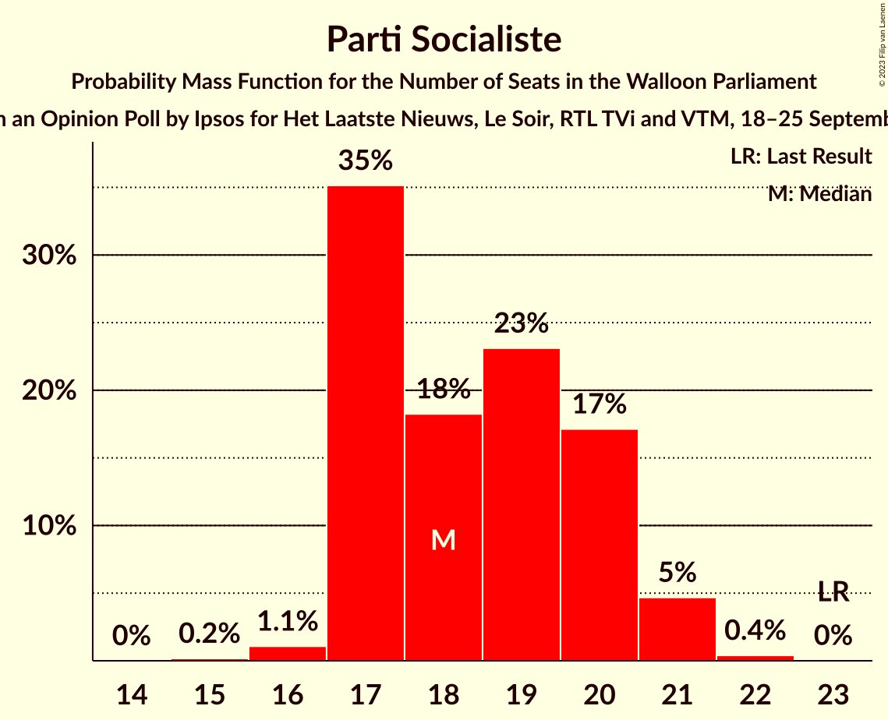

| Number of Seats | Probability | Accumulated | Special Marks |
|:---------------:|:-----------:|:-----------:|:-------------:|
| 15 | 0.2% | 100% |  |
| 16 | 1.1% | 99.8% |  |
| 17 | 35% | 98.7% |  |
| 18 | 18% | 64% | Median |
| 19 | 23% | 45% |  |
| 20 | 17% | 22% |  |
| 21 | 5% | 5% |  |
| 22 | 0.4% | 0.4% |  |
| 23 | 0% | 0% | Last Result |

### Parti du Travail de Belgique

*For a full overview of the results for this party, see the [Parti du Travail de Belgique](party-partidutravaildebelgique.html) page.*

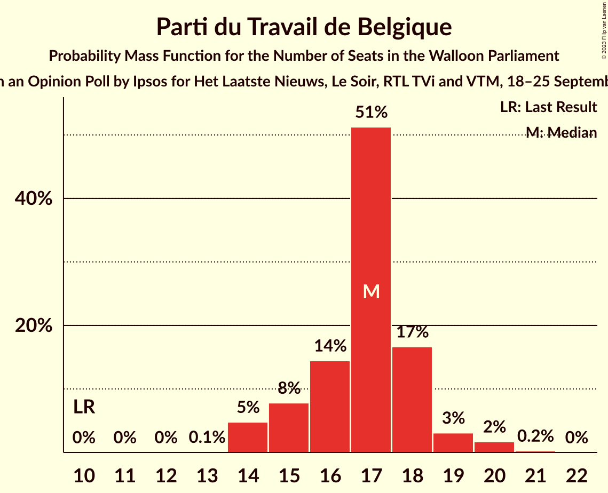

| Number of Seats | Probability | Accumulated | Special Marks |
|:---------------:|:-----------:|:-----------:|:-------------:|
| 10 | 0% | 100% | Last Result |
| 11 | 0% | 100% |  |
| 12 | 0% | 100% |  |
| 13 | 0.1% | 100% |  |
| 14 | 5% | 99.9% |  |
| 15 | 8% | 95% |  |
| 16 | 14% | 87% |  |
| 17 | 51% | 73% | Median |
| 18 | 17% | 22% |  |
| 19 | 3% | 5% |  |
| 20 | 2% | 2% |  |
| 21 | 0.2% | 0.2% |  |
| 22 | 0% | 0% |  |

### Mouvement Réformateur

*For a full overview of the results for this party, see the [Mouvement Réformateur](party-mouvementréformateur.html) page.*

| Number of Seats | Probability | Accumulated | Special Marks |
|:---------------:|:-----------:|:-----------:|:-------------:|
| 14 | 18% | 100% |  |
| 15 | 14% | 82% |  |
| 16 | 20% | 69% | Median |
| 17 | 36% | 49% |  |
| 18 | 9% | 13% |  |
| 19 | 2% | 3% |  |
| 20 | 0.9% | 1.2% | Last Result |
| 21 | 0.3% | 0.3% |  |
| 22 | 0% | 0% |  |

### Ecolo

*For a full overview of the results for this party, see the [Ecolo](party-ecolo.html) page.*

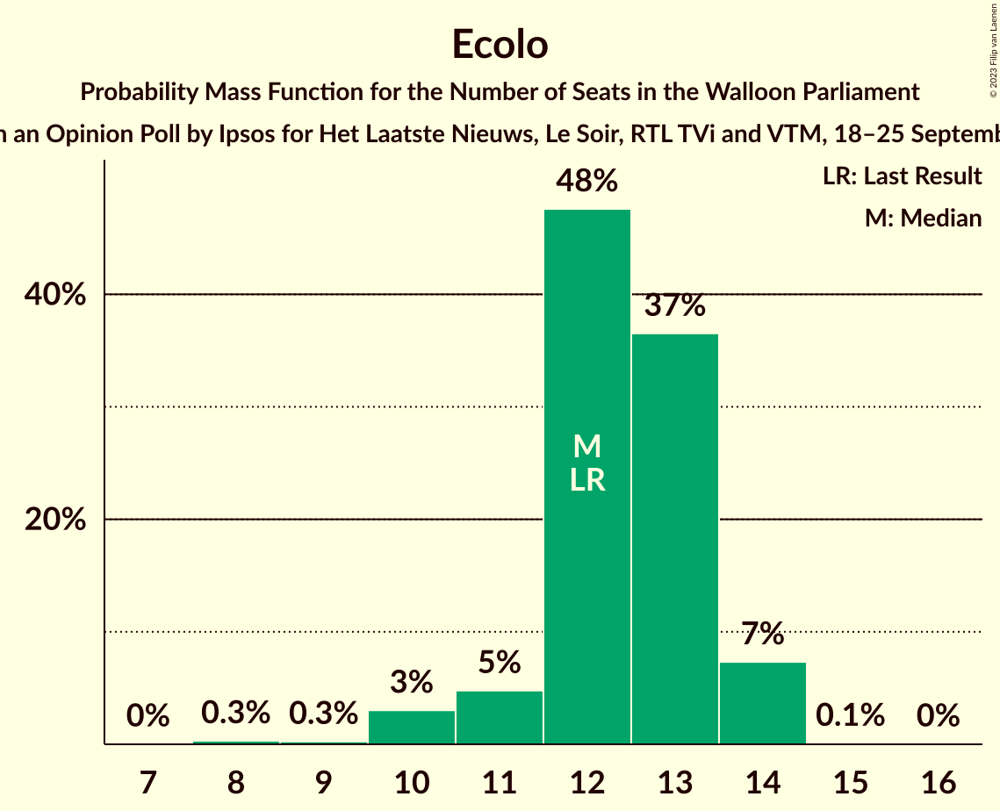

| Number of Seats | Probability | Accumulated | Special Marks |
|:---------------:|:-----------:|:-----------:|:-------------:|
| 8 | 0.3% | 100% |  |
| 9 | 0.3% | 99.6% |  |
| 10 | 3% | 99.4% |  |
| 11 | 5% | 96% |  |
| 12 | 48% | 92% | Last Result, Median |
| 13 | 37% | 44% |  |
| 14 | 7% | 7% |  |
| 15 | 0.1% | 0.1% |  |
| 16 | 0% | 0% |  |

### Les Engagés

*For a full overview of the results for this party, see the [Les Engagés](party-lesengagés.html) page.*

| Number of Seats | Probability | Accumulated | Special Marks |
|:---------------:|:-----------:|:-----------:|:-------------:|
| 7 | 0.2% | 100% |  |
| 8 | 0.7% | 99.8% |  |
| 9 | 2% | 99.1% |  |
| 10 | 8% | 97% | Last Result |
| 11 | 60% | 88% | Median |
| 12 | 18% | 29% |  |
| 13 | 10% | 11% |  |
| 14 | 0.9% | 1.0% |  |
| 15 | 0.1% | 0.1% |  |
| 16 | 0% | 0% |  |

### DéFI

*For a full overview of the results for this party, see the [DéFI](party-défi.html) page.*

| Number of Seats | Probability | Accumulated | Special Marks |
|:---------------:|:-----------:|:-----------:|:-------------:|
| 0 | 100% | 100% | Last Result, Median |

## Coalitions

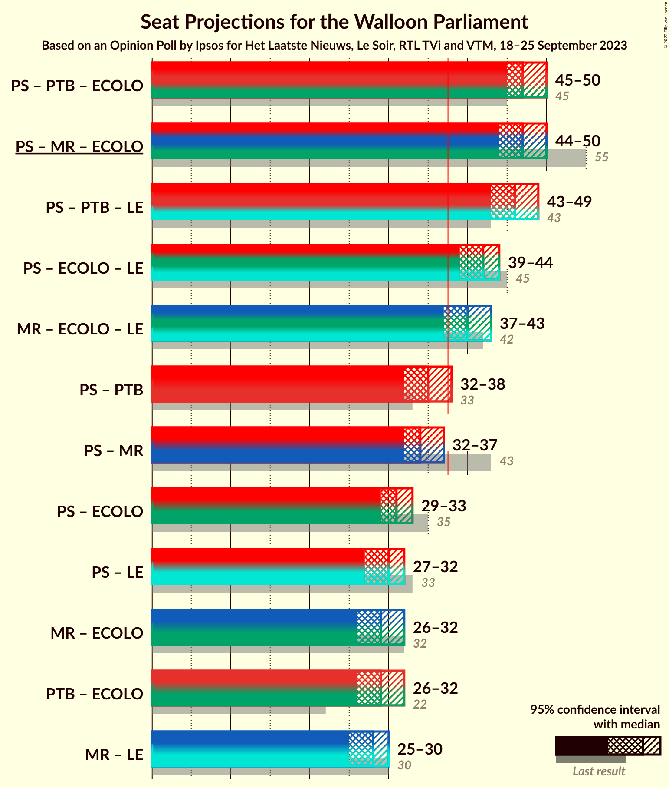

### Confidence Intervals

| Coalition | Last Result | Median | Majority? | 80% Confidence Interval | 90% Confidence Interval | 95% Confidence Interval | 99% Confidence Interval |
|:---------:|:-----------:|:------:|:---------:|:-----------------------:|:-----------------------:|:-----------------------:|:-----------------------:|
| Parti Socialiste – Parti du Travail de Belgique – Ecolo | 45 | 47 | 100% | 46–50 | 46–50 | 45–50 | 44–51 |
| Parti Socialiste – Mouvement Réformateur – Ecolo | 55 | 47 | 100% | 45–49 | 45–49 | 44–50 | 43–51 |
| Parti Socialiste – Parti du Travail de Belgique – Les Engagés | 43 | 46 | 100% | 45–48 | 44–49 | 43–49 | 43–50 |
| Parti Socialiste – Ecolo – Les Engagés | 45 | 42 | 99.7% | 40–44 | 40–44 | 39–44 | 38–45 |
| Mouvement Réformateur – Ecolo – Les Engagés | 42 | 40 | 93% | 38–41 | 37–42 | 37–43 | 36–44 |
| Parti Socialiste – Parti du Travail de Belgique | 33 | 35 | 7% | 34–37 | 33–38 | 32–38 | 31–39 |
| Parti Socialiste – Mouvement Réformateur | 43 | 34 | 2% | 33–37 | 32–37 | 32–37 | 31–39 |
| Parti Socialiste – Ecolo | 35 | 31 | 0% | 29–33 | 29–33 | 29–33 | 27–34 |
| Parti Socialiste – Les Engagés | 33 | 30 | 0% | 28–31 | 28–32 | 27–32 | 26–33 |
| Mouvement Réformateur – Ecolo | 32 | 29 | 0% | 27–30 | 26–31 | 26–32 | 25–32 |
| Parti du Travail de Belgique – Ecolo | 22 | 29 | 0% | 27–31 | 27–31 | 26–32 | 25–33 |
| Mouvement Réformateur – Les Engagés | 30 | 28 | 0% | 25–29 | 25–29 | 25–30 | 24–31 |

### Parti Socialiste – Parti du Travail de Belgique – Ecolo

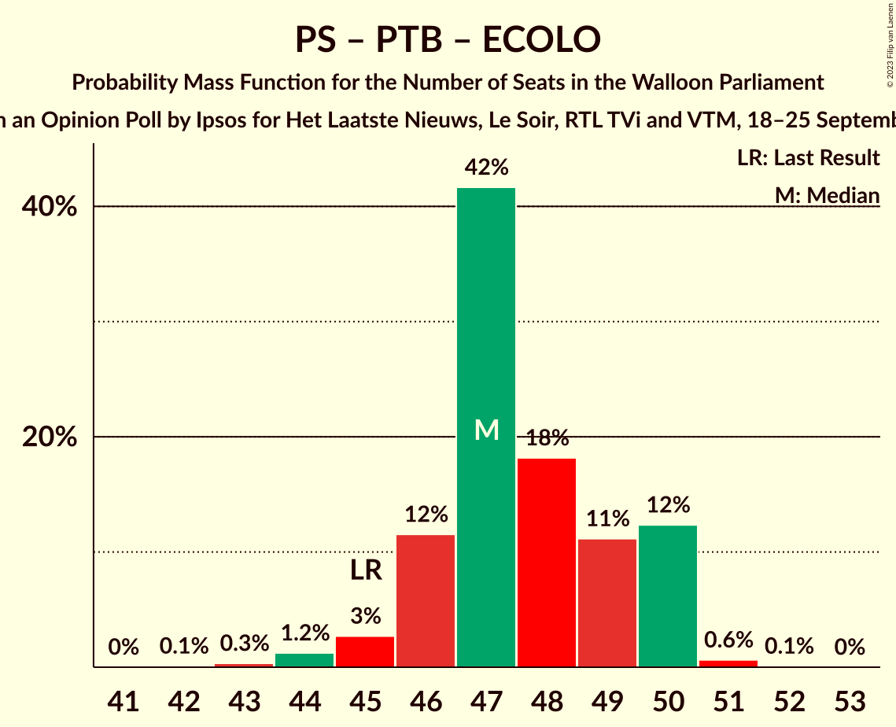

| Number of Seats | Probability | Accumulated | Special Marks |
|:---------------:|:-----------:|:-----------:|:-------------:|
| 42 | 0.1% | 100% |  |
| 43 | 0.3% | 99.9% |  |
| 44 | 1.2% | 99.5% |  |
| 45 | 3% | 98% | Last Result |
| 46 | 12% | 96% |  |
| 47 | 42% | 84% | Median |
| 48 | 18% | 42% |  |
| 49 | 11% | 24% |  |
| 50 | 12% | 13% |  |
| 51 | 0.6% | 0.7% |  |
| 52 | 0.1% | 0.1% |  |
| 53 | 0% | 0% |  |

### Parti Socialiste – Mouvement Réformateur – Ecolo

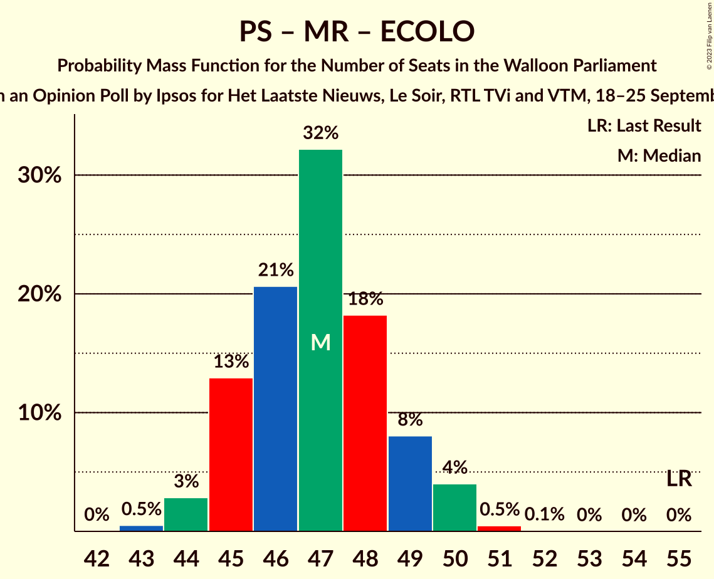

| Number of Seats | Probability | Accumulated | Special Marks |
|:---------------:|:-----------:|:-----------:|:-------------:|
| 43 | 0.5% | 100% |  |
| 44 | 3% | 99.4% |  |
| 45 | 13% | 97% |  |
| 46 | 21% | 84% | Median |
| 47 | 32% | 63% |  |
| 48 | 18% | 31% |  |
| 49 | 8% | 13% |  |
| 50 | 4% | 5% |  |
| 51 | 0.5% | 0.6% |  |
| 52 | 0.1% | 0.1% |  |
| 53 | 0% | 0% |  |
| 54 | 0% | 0% |  |
| 55 | 0% | 0% | Last Result |

### Parti Socialiste – Parti du Travail de Belgique – Les Engagés

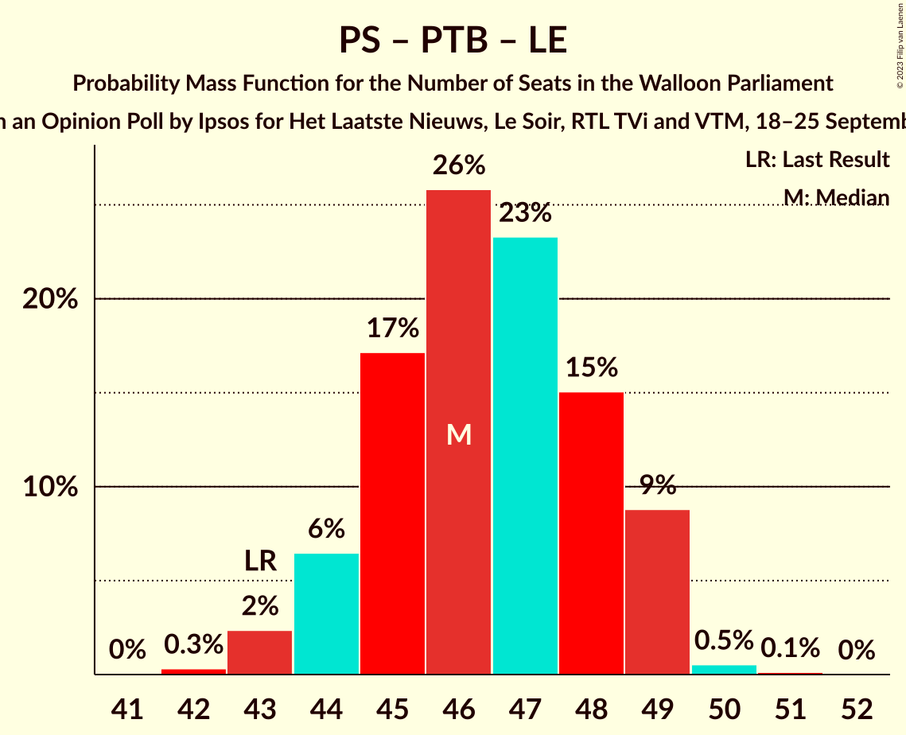

| Number of Seats | Probability | Accumulated | Special Marks |
|:---------------:|:-----------:|:-----------:|:-------------:|
| 42 | 0.3% | 100% |  |
| 43 | 2% | 99.6% | Last Result |
| 44 | 6% | 97% |  |
| 45 | 17% | 91% |  |
| 46 | 26% | 74% | Median |
| 47 | 23% | 48% |  |
| 48 | 15% | 25% |  |
| 49 | 9% | 9% |  |
| 50 | 0.5% | 0.7% |  |
| 51 | 0.1% | 0.1% |  |
| 52 | 0% | 0% |  |

### Parti Socialiste – Ecolo – Les Engagés

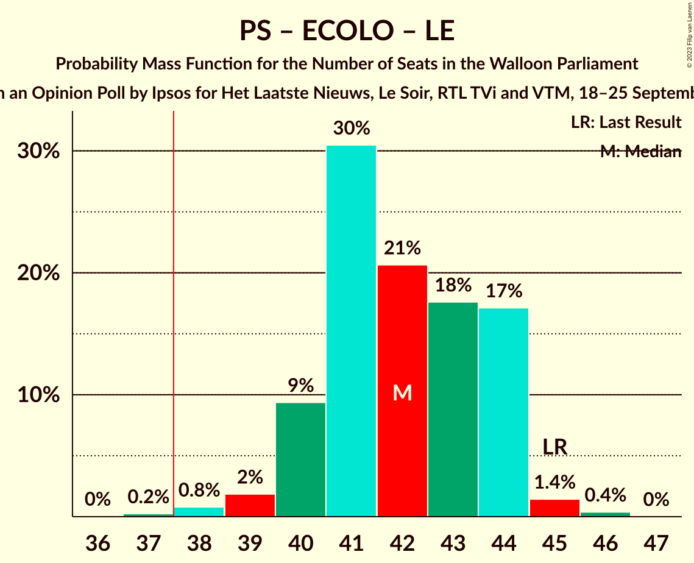

| Number of Seats | Probability | Accumulated | Special Marks |
|:---------------:|:-----------:|:-----------:|:-------------:|
| 37 | 0.2% | 100% |  |
| 38 | 0.8% | 99.7% | Majority |
| 39 | 2% | 98.9% |  |
| 40 | 9% | 97% |  |
| 41 | 30% | 88% | Median |
| 42 | 21% | 57% |  |
| 43 | 18% | 37% |  |
| 44 | 17% | 19% |  |
| 45 | 1.4% | 2% | Last Result |
| 46 | 0.4% | 0.4% |  |
| 47 | 0% | 0% |  |

### Mouvement Réformateur – Ecolo – Les Engagés

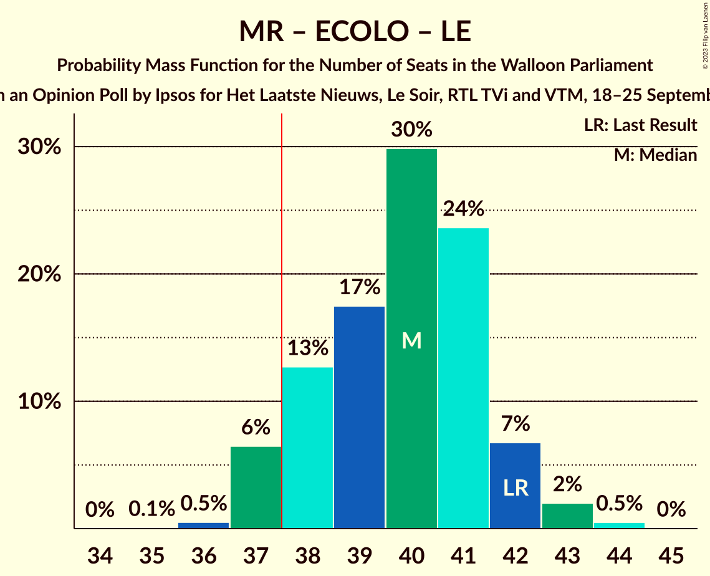

| Number of Seats | Probability | Accumulated | Special Marks |
|:---------------:|:-----------:|:-----------:|:-------------:|
| 35 | 0.1% | 100% |  |
| 36 | 0.5% | 99.9% |  |
| 37 | 6% | 99.4% |  |
| 38 | 13% | 93% | Majority |
| 39 | 17% | 80% | Median |
| 40 | 30% | 63% |  |
| 41 | 24% | 33% |  |
| 42 | 7% | 9% | Last Result |
| 43 | 2% | 3% |  |
| 44 | 0.5% | 0.5% |  |
| 45 | 0% | 0% |  |

### Parti Socialiste – Parti du Travail de Belgique

| Number of Seats | Probability | Accumulated | Special Marks |
|:---------------:|:-----------:|:-----------:|:-------------:|
| 31 | 0.5% | 100% |  |
| 32 | 2% | 99.5% |  |
| 33 | 7% | 97% | Last Result |
| 34 | 24% | 91% |  |
| 35 | 30% | 67% | Median |
| 36 | 17% | 37% |  |
| 37 | 13% | 20% |  |
| 38 | 6% | 7% | Majority |
| 39 | 0.5% | 0.6% |  |
| 40 | 0.1% | 0.1% |  |
| 41 | 0% | 0% |  |

### Parti Socialiste – Mouvement Réformateur

| Number of Seats | Probability | Accumulated | Special Marks |
|:---------------:|:-----------:|:-----------:|:-------------:|
| 31 | 2% | 100% |  |
| 32 | 5% | 98% |  |
| 33 | 16% | 92% |  |
| 34 | 30% | 76% | Median |
| 35 | 20% | 46% |  |
| 36 | 16% | 26% |  |
| 37 | 8% | 10% |  |
| 38 | 2% | 2% | Majority |
| 39 | 0.5% | 0.7% |  |
| 40 | 0.1% | 0.2% |  |
| 41 | 0% | 0% |  |
| 42 | 0% | 0% |  |
| 43 | 0% | 0% | Last Result |

### Parti Socialiste – Ecolo

| Number of Seats | Probability | Accumulated | Special Marks |
|:---------------:|:-----------:|:-----------:|:-------------:|
| 25 | 0.1% | 100% |  |
| 26 | 0.1% | 99.9% |  |
| 27 | 0.5% | 99.7% |  |
| 28 | 1.5% | 99.2% |  |
| 29 | 14% | 98% |  |
| 30 | 33% | 84% | Median |
| 31 | 22% | 50% |  |
| 32 | 15% | 28% |  |
| 33 | 12% | 13% |  |
| 34 | 1.2% | 2% |  |
| 35 | 0.3% | 0.3% | Last Result |
| 36 | 0% | 0% |  |

### Parti Socialiste – Les Engagés

| Number of Seats | Probability | Accumulated | Special Marks |
|:---------------:|:-----------:|:-----------:|:-------------:|
| 25 | 0.2% | 100% |  |
| 26 | 0.9% | 99.7% |  |
| 27 | 3% | 98.8% |  |
| 28 | 23% | 96% |  |
| 29 | 21% | 73% | Median |
| 30 | 22% | 52% |  |
| 31 | 22% | 31% |  |
| 32 | 7% | 8% |  |
| 33 | 0.7% | 0.9% | Last Result |
| 34 | 0.1% | 0.2% |  |
| 35 | 0% | 0% |  |

### Mouvement Réformateur – Ecolo

| Number of Seats | Probability | Accumulated | Special Marks |
|:---------------:|:-----------:|:-----------:|:-------------:|
| 24 | 0.1% | 100% |  |
| 25 | 0.5% | 99.9% |  |
| 26 | 9% | 99.3% |  |
| 27 | 15% | 91% |  |
| 28 | 23% | 75% | Median |
| 29 | 26% | 52% |  |
| 30 | 17% | 26% |  |
| 31 | 6% | 9% |  |
| 32 | 2% | 3% | Last Result |
| 33 | 0.3% | 0.4% |  |
| 34 | 0% | 0% |  |

### Parti du Travail de Belgique – Ecolo

| Number of Seats | Probability | Accumulated | Special Marks |
|:---------------:|:-----------:|:-----------:|:-------------:|
| 22 | 0% | 100% | Last Result |
| 23 | 0% | 100% |  |
| 24 | 0.1% | 100% |  |
| 25 | 0.7% | 99.8% |  |
| 26 | 2% | 99.1% |  |
| 27 | 8% | 97% |  |
| 28 | 15% | 89% |  |
| 29 | 26% | 74% | Median |
| 30 | 38% | 48% |  |
| 31 | 7% | 10% |  |
| 32 | 2% | 3% |  |
| 33 | 1.0% | 1.1% |  |
| 34 | 0.1% | 0.1% |  |
| 35 | 0% | 0% |  |

### Mouvement Réformateur – Les Engagés

| Number of Seats | Probability | Accumulated | Special Marks |
|:---------------:|:-----------:|:-----------:|:-------------:|
| 23 | 0.1% | 100% |  |
| 24 | 0.6% | 99.9% |  |
| 25 | 12% | 99.3% |  |
| 26 | 11% | 87% |  |
| 27 | 18% | 76% | Median |
| 28 | 42% | 58% |  |
| 29 | 12% | 16% |  |
| 30 | 3% | 4% | Last Result |
| 31 | 1.2% | 2% |  |
| 32 | 0.3% | 0.5% |  |
| 33 | 0.1% | 0.1% |  |
| 34 | 0% | 0% |  |

## Technical Information

### Opinion Poll

+ **Polling firm:** Ipsos
+ **Commissioner(s):** Het Laatste Nieuws, Le Soir, RTL TVi and VTM
+ **Fieldwork period:** 18–25 September 2023

### Calculations

+ **Sample size:** 1000
+ **Simulations done:** 1,048,576
+ **Error estimate:** 0.38%

