# Opinion Poll by Kantar for La Libre Belgique and RTBf, 10 September–9 October 2023

<a href="#voting-intentions">Voting Intentions</a> | <a href="#seats">Seats</a> | <a href="#coalitions">Coalitions</a> | <a href="#technical-information">Technical Information</a>

## Voting Intentions

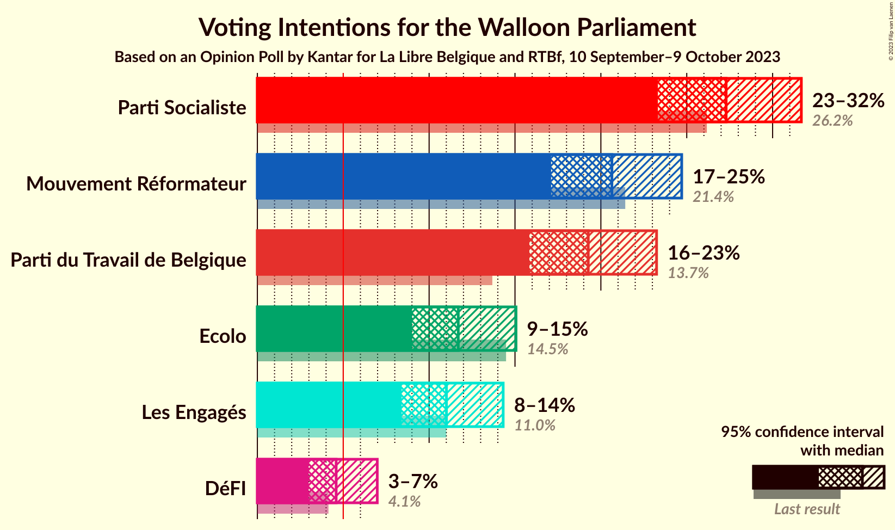

### Confidence Intervals

| Party | Last Result | Poll Result | 80% Confidence Interval | 90% Confidence Interval | 95% Confidence Interval | 99% Confidence Interval |
|:-----:|:-----------:|:-----------:|:-----------------------:|:-----------------------:|:-----------------------:|:-----------------------:|
| Parti Socialiste | 26.2% | 27.3% | 24.7–30.2% |23.9–31.0% |23.3–31.7% |22.1–33.1% |
| Mouvement Réformateur | 21.4% | 20.6% | 18.3–23.3% |17.7–24.0% |17.1–24.7% |16.0–26.0% |
| Parti du Travail de Belgique | 13.7% | 19.3% | 17.0–21.9% |16.4–22.6% |15.8–23.2% |14.8–24.5% |
| Ecolo | 14.5% | 11.7% | 9.9–13.9% |9.4–14.5% |9.0–15.1% |8.2–16.2% |
| Les Engagés | 11.0% | 11.0% | 9.3–13.2% |8.8–13.8% |8.4–14.3% |7.7–15.4% |
| DéFI | 4.1% | 4.6% | 3.5–6.1% |3.2–6.6% |3.0–7.0% |2.5–7.8% |

*Note:* The poll result column reflects the actual value used in the calculations. Published results may vary slightly, and in addition be rounded to fewer digits.

## Seats

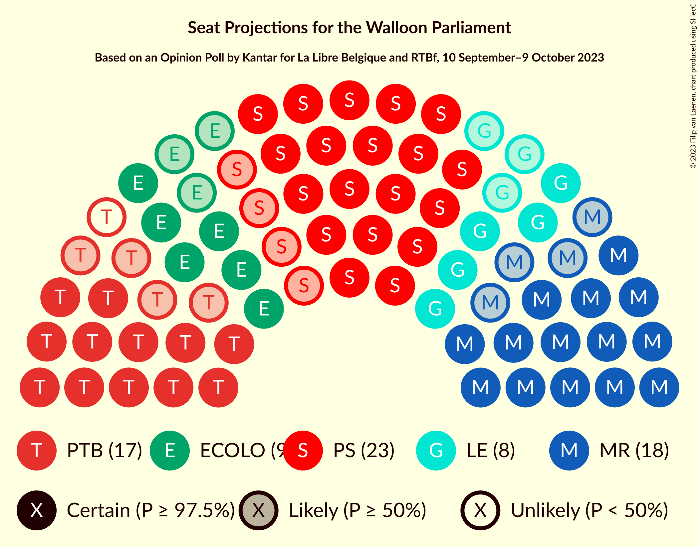

### Confidence Intervals

| Party | Last Result | Median | 80% Confidence Interval | 90% Confidence Interval | 95% Confidence Interval | 99% Confidence Interval |
|:-----:|:-----------:|:------:|:-----------------------:|:-----------------------:|:-----------------------:|:-----------------------:|
| <a href="#parti-socialiste">Parti Socialiste</a> | 23 | 23 | 21–26 |20–28 |19–28 |18–29 |
| <a href="#mouvement-réformateur">Mouvement Réformateur</a> | 20 | 18 | 14–20 |14–21 |14–21 |13–22 |
| <a href="#parti-du-travail-de-belgique">Parti du Travail de Belgique</a> | 10 | 16 | 14–18 |14–19 |12–20 |10–21 |
| <a href="#ecolo">Ecolo</a> | 12 | 9 | 6–12 |6–12 |6–12 |6–13 |
| <a href="#les-engagés">Les Engagés</a> | 10 | 8 | 6–11 |6–11 |5–11 |4–12 |
| <a href="#défi">DéFI</a> | 0 | 0 | 0–4 |0–4 |0–4 |0–5 |

### Parti Socialiste

*For a full overview of the results for this party, see the [Parti Socialiste](party-partisocialiste.html) page.*

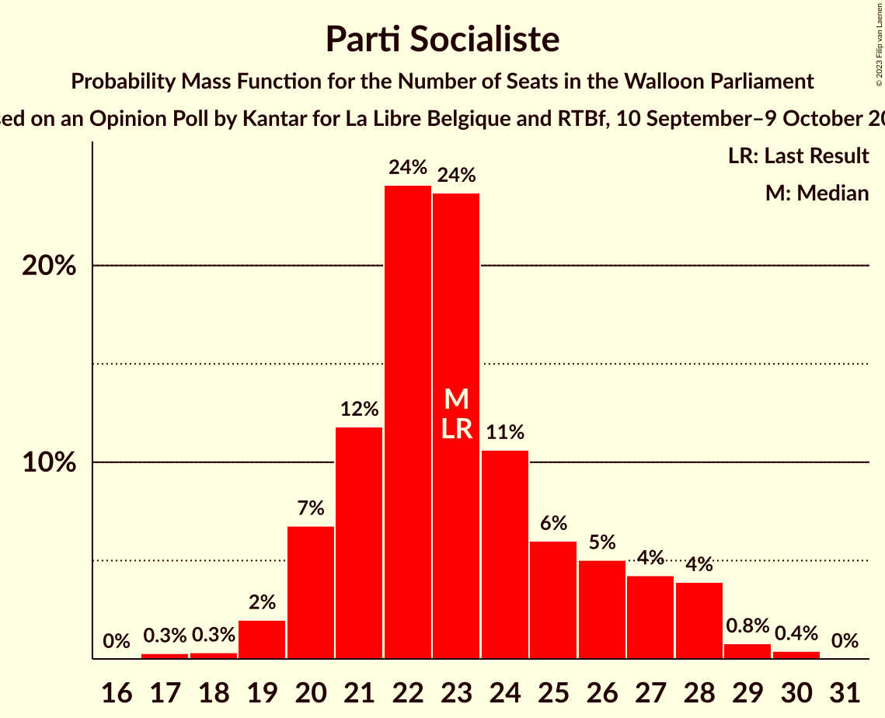

| Number of Seats | Probability | Accumulated | Special Marks |
|:---------------:|:-----------:|:-----------:|:-------------:|
| 17 | 0.3% | 100% |  |
| 18 | 0.3% | 99.7% |  |
| 19 | 2% | 99.4% |  |
| 20 | 7% | 97% |  |
| 21 | 12% | 91% |  |
| 22 | 24% | 79% |  |
| 23 | 24% | 55% | Last Result, Median |
| 24 | 11% | 31% |  |
| 25 | 6% | 20% |  |
| 26 | 5% | 14% |  |
| 27 | 4% | 9% |  |
| 28 | 4% | 5% |  |
| 29 | 0.8% | 1.2% |  |
| 30 | 0.4% | 0.4% |  |
| 31 | 0% | 0% |  |

### Mouvement Réformateur

*For a full overview of the results for this party, see the [Mouvement Réformateur](party-mouvementréformateur.html) page.*

| Number of Seats | Probability | Accumulated | Special Marks |
|:---------------:|:-----------:|:-----------:|:-------------:|
| 11 | 0% | 100% |  |
| 12 | 0.2% | 99.9% |  |
| 13 | 0.5% | 99.7% |  |
| 14 | 11% | 99.3% |  |
| 15 | 8% | 89% |  |
| 16 | 10% | 81% |  |
| 17 | 10% | 71% |  |
| 18 | 15% | 61% | Median |
| 19 | 27% | 47% |  |
| 20 | 12% | 20% | Last Result |
| 21 | 7% | 8% |  |
| 22 | 0.7% | 1.1% |  |
| 23 | 0.2% | 0.4% |  |
| 24 | 0.1% | 0.2% |  |
| 25 | 0.1% | 0.1% |  |
| 26 | 0% | 0% |  |

### Parti du Travail de Belgique

*For a full overview of the results for this party, see the [Parti du Travail de Belgique](party-partidutravaildebelgique.html) page.*

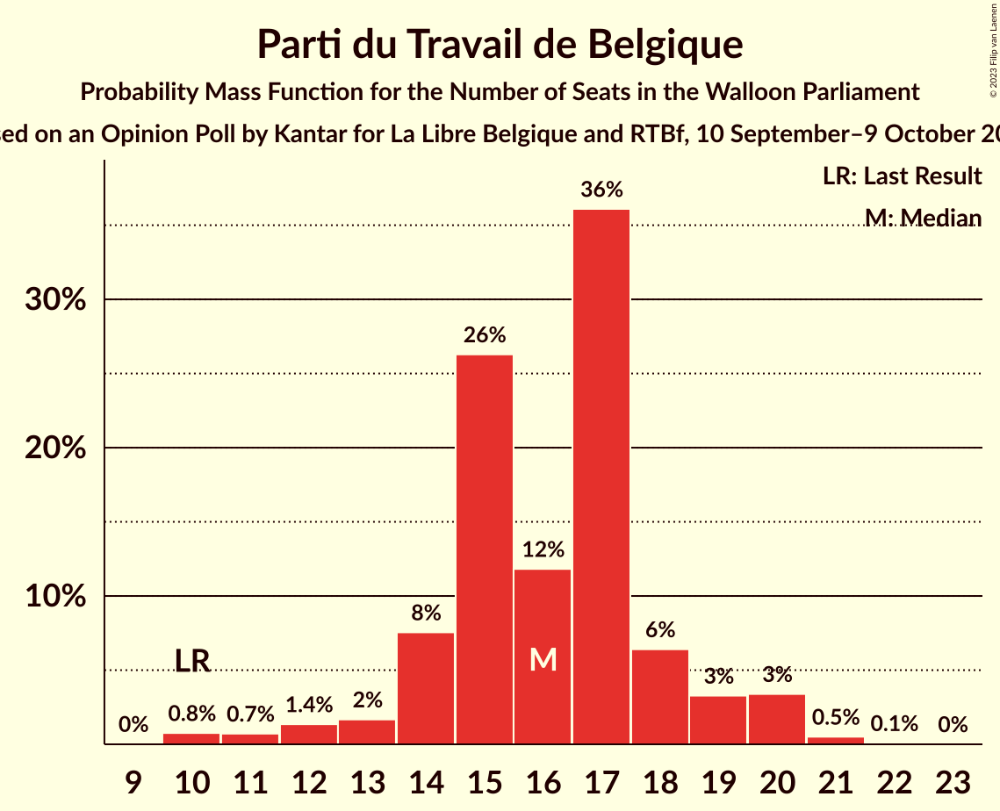

| Number of Seats | Probability | Accumulated | Special Marks |
|:---------------:|:-----------:|:-----------:|:-------------:|
| 10 | 0.8% | 100% | Last Result |
| 11 | 0.7% | 99.2% |  |
| 12 | 1.4% | 98% |  |
| 13 | 2% | 97% |  |
| 14 | 8% | 95% |  |
| 15 | 26% | 88% |  |
| 16 | 12% | 62% | Median |
| 17 | 36% | 50% |  |
| 18 | 6% | 14% |  |
| 19 | 3% | 7% |  |
| 20 | 3% | 4% |  |
| 21 | 0.5% | 0.6% |  |
| 22 | 0.1% | 0.1% |  |
| 23 | 0% | 0% |  |

### Ecolo

*For a full overview of the results for this party, see the [Ecolo](party-ecolo.html) page.*

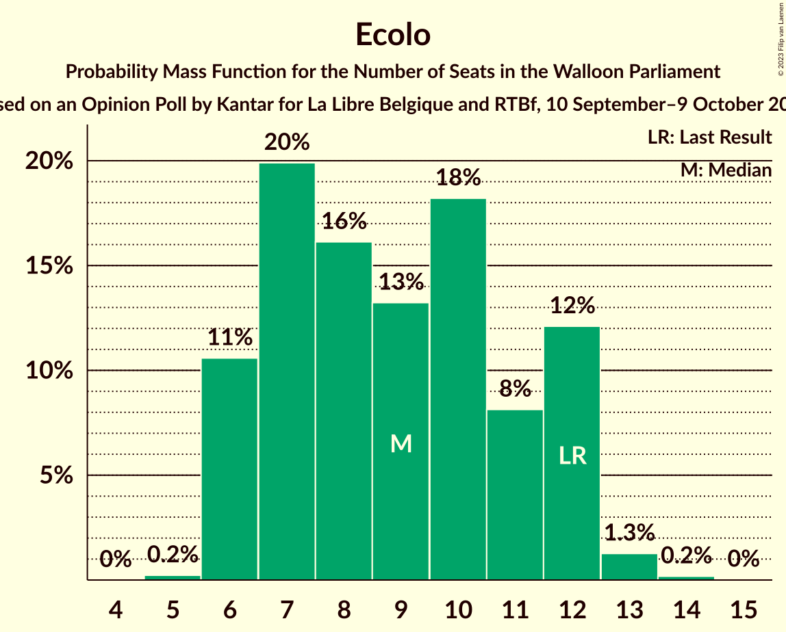

| Number of Seats | Probability | Accumulated | Special Marks |
|:---------------:|:-----------:|:-----------:|:-------------:|
| 5 | 0.2% | 100% |  |
| 6 | 11% | 99.8% |  |
| 7 | 20% | 89% |  |
| 8 | 16% | 69% |  |
| 9 | 13% | 53% | Median |
| 10 | 18% | 40% |  |
| 11 | 8% | 22% |  |
| 12 | 12% | 14% | Last Result |
| 13 | 1.3% | 1.5% |  |
| 14 | 0.2% | 0.2% |  |
| 15 | 0% | 0% |  |

### Les Engagés

*For a full overview of the results for this party, see the [Les Engagés](party-lesengagés.html) page.*

| Number of Seats | Probability | Accumulated | Special Marks |
|:---------------:|:-----------:|:-----------:|:-------------:|
| 4 | 1.0% | 100% |  |
| 5 | 2% | 99.0% |  |
| 6 | 12% | 97% |  |
| 7 | 23% | 86% |  |
| 8 | 14% | 62% | Median |
| 9 | 16% | 48% |  |
| 10 | 14% | 32% | Last Result |
| 11 | 17% | 18% |  |
| 12 | 1.4% | 2% |  |
| 13 | 0.3% | 0.4% |  |
| 14 | 0.1% | 0.1% |  |
| 15 | 0% | 0% |  |

### DéFI

*For a full overview of the results for this party, see the [DéFI](party-défi.html) page.*

| Number of Seats | Probability | Accumulated | Special Marks |
|:---------------:|:-----------:|:-----------:|:-------------:|
| 0 | 74% | 100% | Last Result, Median |
| 1 | 8% | 26% |  |
| 2 | 3% | 18% |  |
| 3 | 5% | 15% |  |
| 4 | 8% | 10% |  |
| 5 | 2% | 2% |  |
| 6 | 0.4% | 0.4% |  |
| 7 | 0% | 0% |  |

## Coalitions

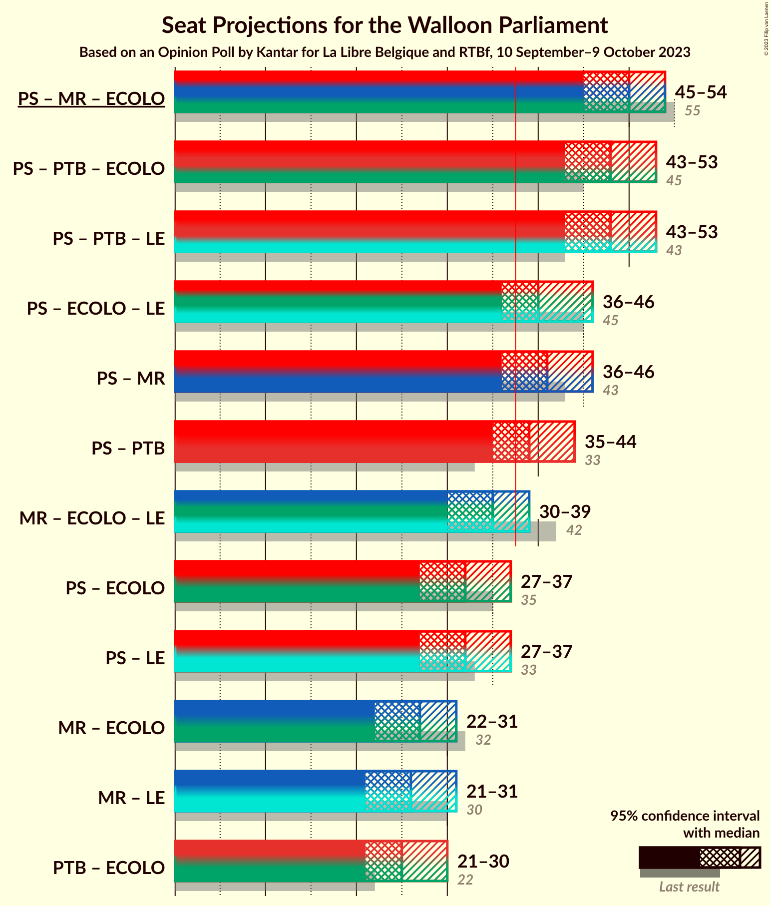

### Confidence Intervals

| Coalition | Last Result | Median | Majority? | 80% Confidence Interval | 90% Confidence Interval | 95% Confidence Interval | 99% Confidence Interval |
|:---------:|:-----------:|:------:|:---------:|:-----------------------:|:-----------------------:|:-----------------------:|:-----------------------:|
| Parti Socialiste – Mouvement Réformateur – Ecolo | 55 | 50 | 100% | 46–53 | 45–54 | 45–54 | 43–56 |
| Parti Socialiste – Parti du Travail de Belgique – Ecolo | 45 | 48 | 100% | 45–51 | 44–52 | 43–53 | 42–55 |
| Parti Socialiste – Parti du Travail de Belgique – Les Engagés | 43 | 48 | 100% | 44–51 | 43–52 | 43–53 | 41–54 |
| Parti Socialiste – Ecolo – Les Engagés | 45 | 40 | 89% | 37–44 | 36–45 | 36–46 | 34–47 |
| Parti Socialiste – Mouvement Réformateur | 43 | 41 | 88% | 37–44 | 36–45 | 36–46 | 34–48 |
| Parti Socialiste – Parti du Travail de Belgique | 33 | 39 | 79% | 36–42 | 36–44 | 35–44 | 33–45 |
| Mouvement Réformateur – Ecolo – Les Engagés | 42 | 35 | 13% | 32–38 | 31–39 | 30–39 | 28–41 |
| Parti Socialiste – Ecolo | 35 | 32 | 2% | 29–35 | 28–36 | 27–37 | 26–39 |
| Parti Socialiste – Les Engagés | 33 | 32 | 1.5% | 28–35 | 27–36 | 27–37 | 26–39 |
| Mouvement Réformateur – Ecolo | 32 | 27 | 0% | 23–30 | 22–31 | 22–31 | 20–33 |
| Mouvement Réformateur – Les Engagés | 30 | 26 | 0% | 23–30 | 22–30 | 21–31 | 20–32 |
| Parti du Travail de Belgique – Ecolo | 22 | 25 | 0% | 22–28 | 21–29 | 21–30 | 19–31 |

### Parti Socialiste – Mouvement Réformateur – Ecolo

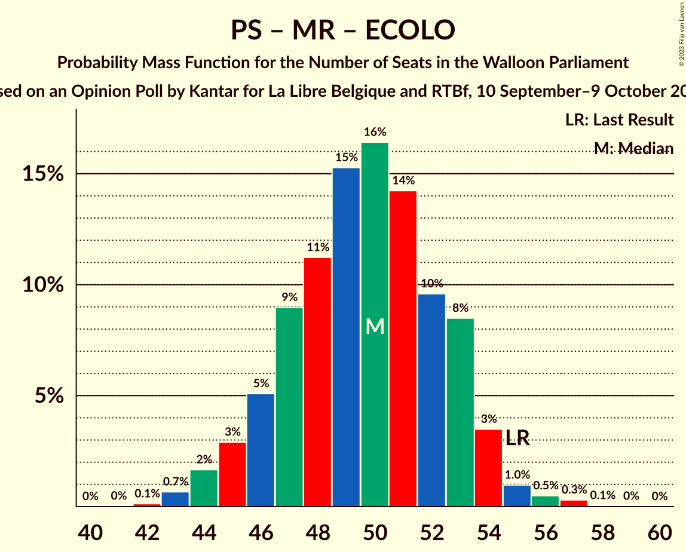

| Number of Seats | Probability | Accumulated | Special Marks |
|:---------------:|:-----------:|:-----------:|:-------------:|
| 42 | 0.1% | 100% |  |
| 43 | 0.7% | 99.8% |  |
| 44 | 2% | 99.2% |  |
| 45 | 3% | 98% |  |
| 46 | 5% | 95% |  |
| 47 | 9% | 90% |  |
| 48 | 11% | 81% |  |
| 49 | 15% | 69% |  |
| 50 | 16% | 54% | Median |
| 51 | 14% | 38% |  |
| 52 | 10% | 23% |  |
| 53 | 8% | 14% |  |
| 54 | 3% | 5% |  |
| 55 | 1.0% | 2% | Last Result |
| 56 | 0.5% | 0.9% |  |
| 57 | 0.3% | 0.4% |  |
| 58 | 0.1% | 0.1% |  |
| 59 | 0% | 0% |  |

### Parti Socialiste – Parti du Travail de Belgique – Ecolo

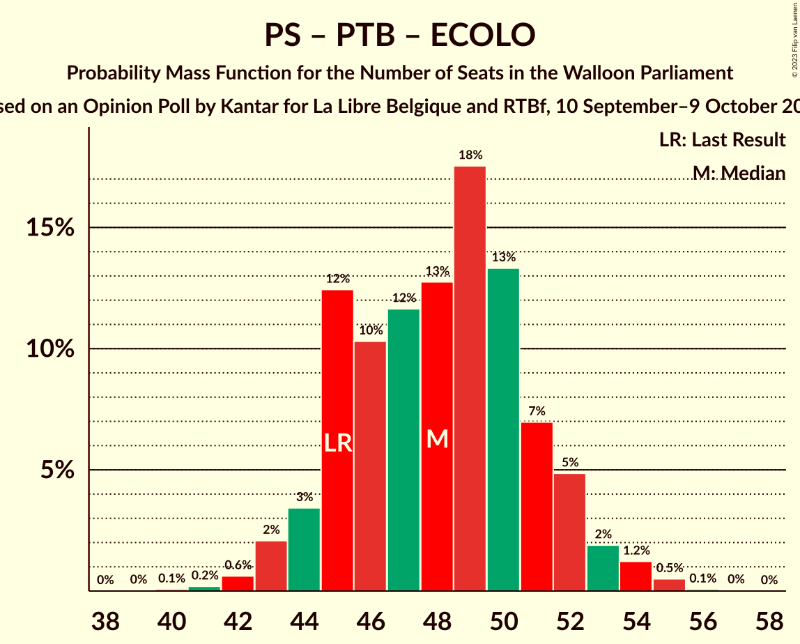

| Number of Seats | Probability | Accumulated | Special Marks |
|:---------------:|:-----------:|:-----------:|:-------------:|
| 40 | 0.1% | 100% |  |
| 41 | 0.2% | 99.9% |  |
| 42 | 0.6% | 99.7% |  |
| 43 | 2% | 99.1% |  |
| 44 | 3% | 97% |  |
| 45 | 12% | 94% | Last Result |
| 46 | 10% | 81% |  |
| 47 | 12% | 71% |  |
| 48 | 13% | 59% | Median |
| 49 | 18% | 46% |  |
| 50 | 13% | 29% |  |
| 51 | 7% | 16% |  |
| 52 | 5% | 9% |  |
| 53 | 2% | 4% |  |
| 54 | 1.2% | 2% |  |
| 55 | 0.5% | 0.6% |  |
| 56 | 0.1% | 0.1% |  |
| 57 | 0% | 0% |  |

### Parti Socialiste – Parti du Travail de Belgique – Les Engagés

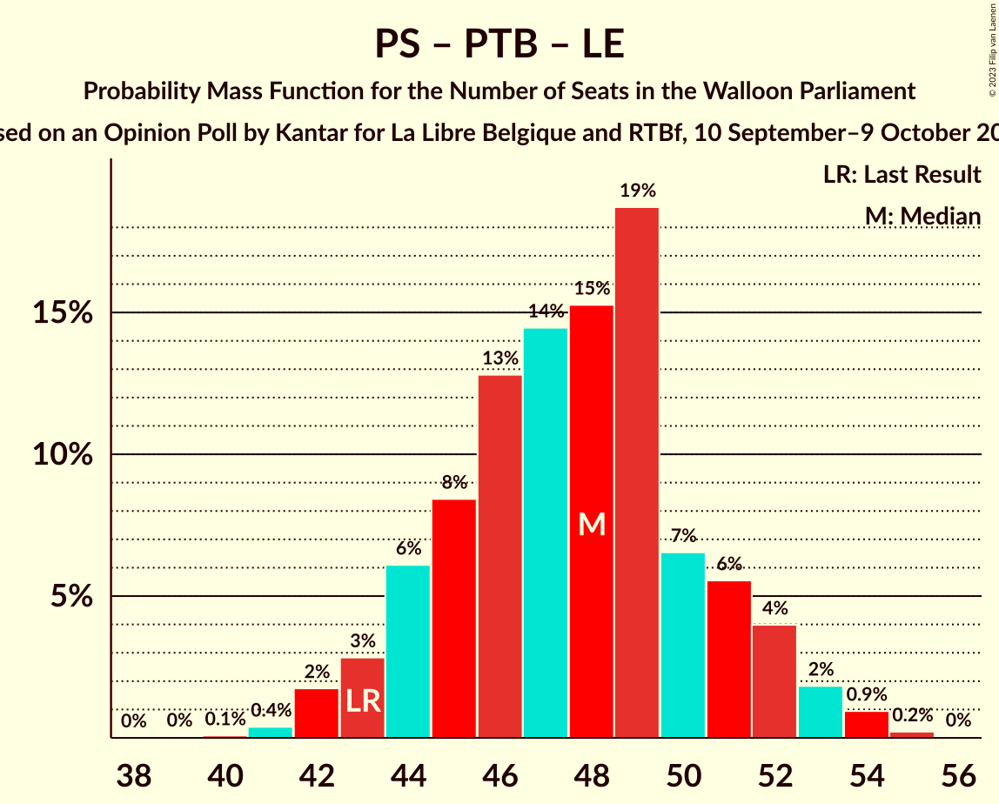

| Number of Seats | Probability | Accumulated | Special Marks |
|:---------------:|:-----------:|:-----------:|:-------------:|
| 40 | 0.1% | 100% |  |
| 41 | 0.4% | 99.9% |  |
| 42 | 2% | 99.5% |  |
| 43 | 3% | 98% | Last Result |
| 44 | 6% | 95% |  |
| 45 | 8% | 89% |  |
| 46 | 13% | 80% |  |
| 47 | 14% | 68% | Median |
| 48 | 15% | 53% |  |
| 49 | 19% | 38% |  |
| 50 | 7% | 19% |  |
| 51 | 6% | 13% |  |
| 52 | 4% | 7% |  |
| 53 | 2% | 3% |  |
| 54 | 0.9% | 1.2% |  |
| 55 | 0.2% | 0.3% |  |
| 56 | 0% | 0% |  |

### Parti Socialiste – Ecolo – Les Engagés

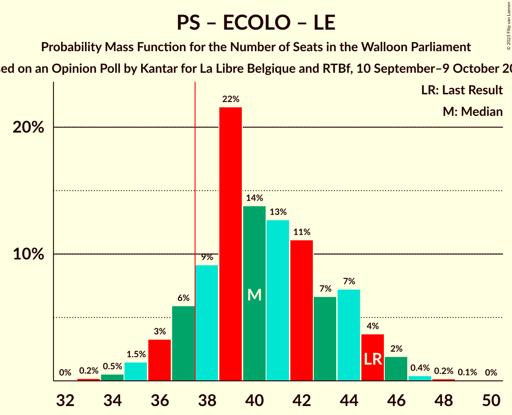

| Number of Seats | Probability | Accumulated | Special Marks |
|:---------------:|:-----------:|:-----------:|:-------------:|
| 33 | 0.2% | 100% |  |
| 34 | 0.5% | 99.8% |  |
| 35 | 1.5% | 99.2% |  |
| 36 | 3% | 98% |  |
| 37 | 6% | 94% |  |
| 38 | 9% | 89% | Majority |
| 39 | 22% | 79% |  |
| 40 | 14% | 58% | Median |
| 41 | 13% | 44% |  |
| 42 | 11% | 31% |  |
| 43 | 7% | 20% |  |
| 44 | 7% | 14% |  |
| 45 | 4% | 6% | Last Result |
| 46 | 2% | 3% |  |
| 47 | 0.4% | 0.7% |  |
| 48 | 0.2% | 0.3% |  |
| 49 | 0.1% | 0.1% |  |
| 50 | 0% | 0% |  |

### Parti Socialiste – Mouvement Réformateur

| Number of Seats | Probability | Accumulated | Special Marks |
|:---------------:|:-----------:|:-----------:|:-------------:|
| 33 | 0.1% | 100% |  |
| 34 | 0.5% | 99.8% |  |
| 35 | 1.3% | 99.3% |  |
| 36 | 4% | 98% |  |
| 37 | 6% | 94% |  |
| 38 | 8% | 88% | Majority |
| 39 | 9% | 80% |  |
| 40 | 13% | 72% |  |
| 41 | 19% | 59% | Median |
| 42 | 15% | 40% |  |
| 43 | 13% | 25% | Last Result |
| 44 | 6% | 12% |  |
| 45 | 3% | 6% |  |
| 46 | 2% | 4% |  |
| 47 | 1.0% | 2% |  |
| 48 | 0.4% | 0.6% |  |
| 49 | 0.1% | 0.2% |  |
| 50 | 0% | 0% |  |

### Parti Socialiste – Parti du Travail de Belgique

| Number of Seats | Probability | Accumulated | Special Marks |
|:---------------:|:-----------:|:-----------:|:-------------:|
| 31 | 0.1% | 100% |  |
| 32 | 0.2% | 99.9% |  |
| 33 | 0.6% | 99.7% | Last Result |
| 34 | 1.3% | 99.1% |  |
| 35 | 2% | 98% |  |
| 36 | 6% | 96% |  |
| 37 | 10% | 89% |  |
| 38 | 21% | 79% | Majority |
| 39 | 18% | 58% | Median |
| 40 | 14% | 40% |  |
| 41 | 9% | 25% |  |
| 42 | 7% | 16% |  |
| 43 | 5% | 10% |  |
| 44 | 3% | 5% |  |
| 45 | 2% | 2% |  |
| 46 | 0.2% | 0.3% |  |
| 47 | 0.1% | 0.1% |  |
| 48 | 0% | 0% |  |

### Mouvement Réformateur – Ecolo – Les Engagés

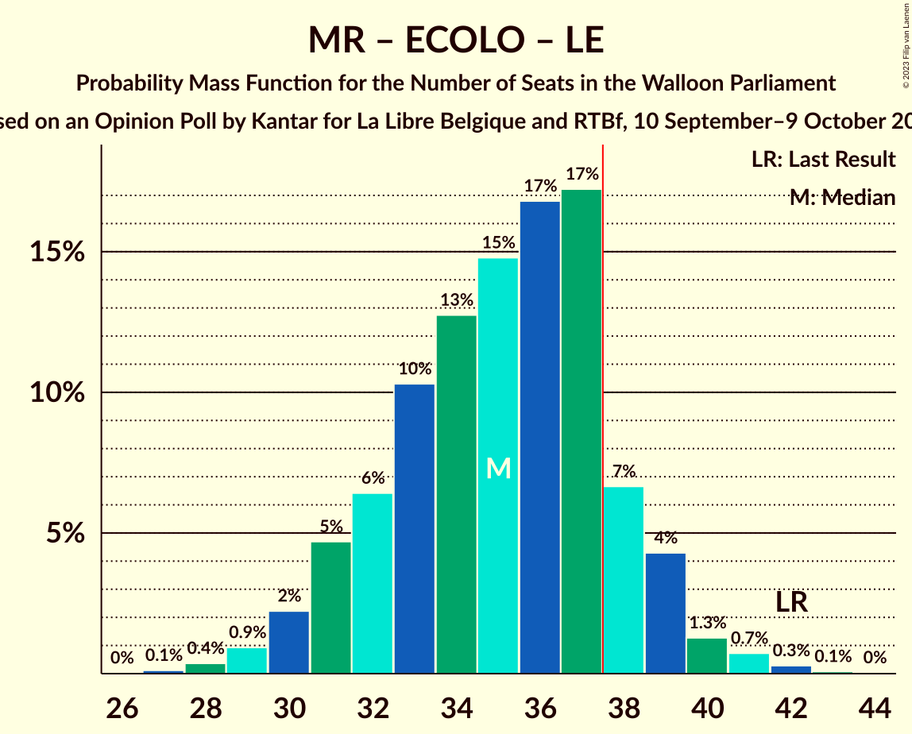

| Number of Seats | Probability | Accumulated | Special Marks |
|:---------------:|:-----------:|:-----------:|:-------------:|
| 27 | 0.1% | 100% |  |
| 28 | 0.4% | 99.9% |  |
| 29 | 0.9% | 99.5% |  |
| 30 | 2% | 98.6% |  |
| 31 | 5% | 96% |  |
| 32 | 6% | 92% |  |
| 33 | 10% | 85% |  |
| 34 | 13% | 75% |  |
| 35 | 15% | 62% | Median |
| 36 | 17% | 47% |  |
| 37 | 17% | 31% |  |
| 38 | 7% | 13% | Majority |
| 39 | 4% | 7% |  |
| 40 | 1.3% | 2% |  |
| 41 | 0.7% | 1.1% |  |
| 42 | 0.3% | 0.4% | Last Result |
| 43 | 0.1% | 0.1% |  |
| 44 | 0% | 0% |  |

### Parti Socialiste – Ecolo

| Number of Seats | Probability | Accumulated | Special Marks |
|:---------------:|:-----------:|:-----------:|:-------------:|
| 24 | 0.1% | 100% |  |
| 25 | 0.2% | 99.9% |  |
| 26 | 0.8% | 99.7% |  |
| 27 | 2% | 99.0% |  |
| 28 | 7% | 97% |  |
| 29 | 9% | 90% |  |
| 30 | 12% | 82% |  |
| 31 | 13% | 70% |  |
| 32 | 17% | 57% | Median |
| 33 | 13% | 39% |  |
| 34 | 11% | 27% |  |
| 35 | 8% | 15% | Last Result |
| 36 | 3% | 7% |  |
| 37 | 2% | 4% |  |
| 38 | 1.3% | 2% | Majority |
| 39 | 0.6% | 0.9% |  |
| 40 | 0.2% | 0.3% |  |
| 41 | 0% | 0.1% |  |
| 42 | 0% | 0% |  |

### Parti Socialiste – Les Engagés

| Number of Seats | Probability | Accumulated | Special Marks |
|:---------------:|:-----------:|:-----------:|:-------------:|
| 24 | 0.1% | 100% |  |
| 25 | 0.3% | 99.9% |  |
| 26 | 2% | 99.5% |  |
| 27 | 4% | 98% |  |
| 28 | 5% | 94% |  |
| 29 | 10% | 88% |  |
| 30 | 13% | 79% |  |
| 31 | 15% | 65% | Median |
| 32 | 18% | 50% |  |
| 33 | 11% | 32% | Last Result |
| 34 | 10% | 21% |  |
| 35 | 5% | 10% |  |
| 36 | 3% | 6% |  |
| 37 | 1.4% | 3% |  |
| 38 | 0.8% | 1.5% | Majority |
| 39 | 0.6% | 0.7% |  |
| 40 | 0.1% | 0.1% |  |
| 41 | 0% | 0% |  |

### Mouvement Réformateur – Ecolo

| Number of Seats | Probability | Accumulated | Special Marks |
|:---------------:|:-----------:|:-----------:|:-------------:|
| 19 | 0.1% | 100% |  |
| 20 | 0.5% | 99.9% |  |
| 21 | 1.4% | 99.5% |  |
| 22 | 4% | 98% |  |
| 23 | 5% | 94% |  |
| 24 | 8% | 89% |  |
| 25 | 9% | 81% |  |
| 26 | 19% | 72% |  |
| 27 | 16% | 52% | Median |
| 28 | 13% | 36% |  |
| 29 | 12% | 24% |  |
| 30 | 6% | 12% |  |
| 31 | 4% | 6% |  |
| 32 | 1.2% | 2% | Last Result |
| 33 | 0.8% | 0.9% |  |
| 34 | 0.1% | 0.1% |  |
| 35 | 0% | 0% |  |

### Mouvement Réformateur – Les Engagés

| Number of Seats | Probability | Accumulated | Special Marks |
|:---------------:|:-----------:|:-----------:|:-------------:|
| 18 | 0.1% | 100% |  |
| 19 | 0.1% | 99.9% |  |
| 20 | 0.8% | 99.8% |  |
| 21 | 2% | 99.0% |  |
| 22 | 3% | 97% |  |
| 23 | 7% | 93% |  |
| 24 | 9% | 86% |  |
| 25 | 16% | 77% |  |
| 26 | 19% | 61% | Median |
| 27 | 12% | 43% |  |
| 28 | 11% | 30% |  |
| 29 | 8% | 20% |  |
| 30 | 9% | 12% | Last Result |
| 31 | 2% | 3% |  |
| 32 | 0.9% | 1.1% |  |
| 33 | 0.1% | 0.2% |  |
| 34 | 0% | 0% |  |

### Parti du Travail de Belgique – Ecolo

| Number of Seats | Probability | Accumulated | Special Marks |
|:---------------:|:-----------:|:-----------:|:-------------:|
| 17 | 0.1% | 100% |  |
| 18 | 0.2% | 99.8% |  |
| 19 | 0.4% | 99.6% |  |
| 20 | 0.9% | 99.3% |  |
| 21 | 3% | 98% |  |
| 22 | 10% | 95% | Last Result |
| 23 | 14% | 85% |  |
| 24 | 15% | 71% |  |
| 25 | 14% | 56% | Median |
| 26 | 11% | 42% |  |
| 27 | 14% | 31% |  |
| 28 | 8% | 16% |  |
| 29 | 5% | 8% |  |
| 30 | 3% | 3% |  |
| 31 | 0.4% | 0.6% |  |
| 32 | 0.1% | 0.2% |  |
| 33 | 0% | 0% |  |

## Technical Information

### Opinion Poll

+ **Polling firm:** Kantar
+ **Commissioner(s):** La Libre Belgique and RTBf
+ **Fieldwork period:** 10 September–9 October 2023

### Calculations

+ **Sample size:** 436
+ **Simulations done:** 1,048,576
+ **Error estimate:** 0.90%

