# Opinion Poll by Ipsos for Het Laatste Nieuws, Le Soir, RTL TVi and VTM, 4–11 December 2023

<a href="#voting-intentions">Voting Intentions</a> | <a href="#seats">Seats</a> | <a href="#coalitions">Coalitions</a> | <a href="#technical-information">Technical Information</a>

## Voting Intentions

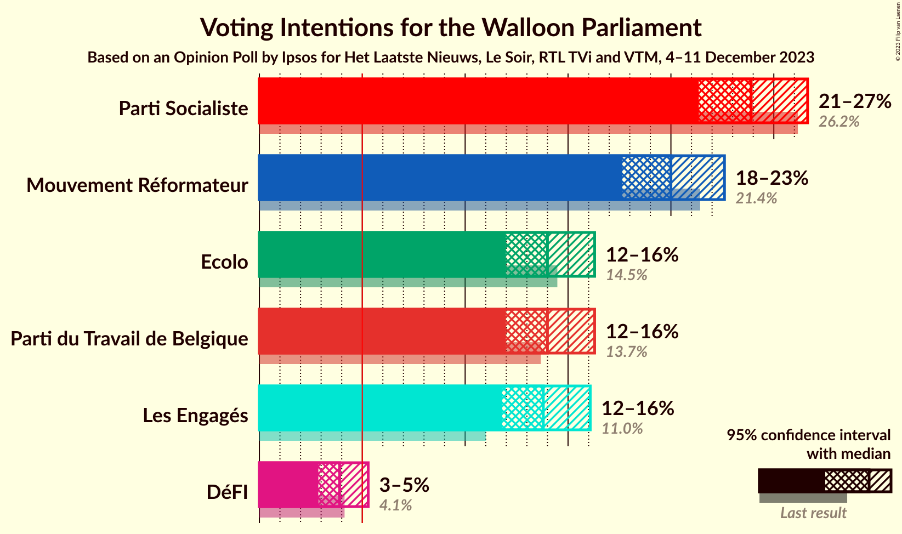

### Confidence Intervals

| Party | Last Result | Poll Result | 80% Confidence Interval | 90% Confidence Interval | 95% Confidence Interval | 99% Confidence Interval |
|:-----:|:-----------:|:-----------:|:-----------------------:|:-----------------------:|:-----------------------:|:-----------------------:|
| Parti Socialiste | 26.2% | 23.9% | 22.2–25.7% |21.8–26.2% |21.4–26.6% |20.6–27.5% |
| Mouvement Réformateur | 21.4% | 20.0% | 18.4–21.7% |18.0–22.2% |17.6–22.6% |16.9–23.4% |
| Parti du Travail de Belgique | 13.7% | 14.0% | 12.7–15.5% |12.3–15.9% |12.0–16.3% |11.4–17.0% |
| Ecolo | 14.5% | 14.0% | 12.7–15.5% |12.3–15.9% |12.0–16.3% |11.4–17.0% |
| Les Engagés | 11.0% | 13.8% | 12.5–15.3% |12.1–15.7% |11.8–16.1% |11.2–16.8% |
| DéFI | 4.1% | 3.9% | 3.2–4.8% |3.0–5.1% |2.9–5.3% |2.6–5.8% |

*Note:* The poll result column reflects the actual value used in the calculations. Published results may vary slightly, and in addition be rounded to fewer digits.

## Seats

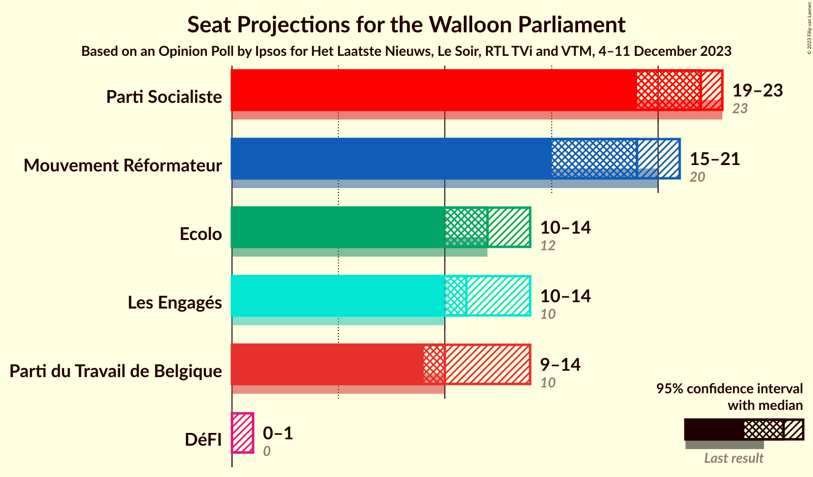

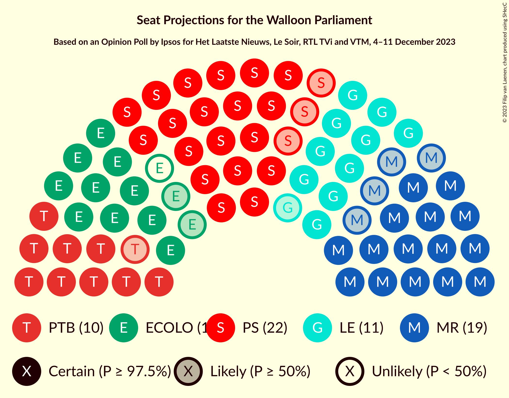

### Confidence Intervals

| Party | Last Result | Median | 80% Confidence Interval | 90% Confidence Interval | 95% Confidence Interval | 99% Confidence Interval |
|:-----:|:-----------:|:------:|:-----------------------:|:-----------------------:|:-----------------------:|:-----------------------:|
| <a href="#parti-socialiste">Parti Socialiste</a> | 23 | 22 | 19–23 |19–23 |19–23 |18–24 |
| <a href="#mouvement-réformateur">Mouvement Réformateur</a> | 20 | 19 | 17–21 |16–21 |15–21 |14–21 |
| <a href="#parti-du-travail-de-belgique">Parti du Travail de Belgique</a> | 10 | 10 | 10–14 |10–14 |9–14 |8–15 |
| <a href="#ecolo">Ecolo</a> | 12 | 12 | 11–13 |10–14 |10–14 |9–15 |
| <a href="#les-engagés">Les Engagés</a> | 10 | 11 | 11–13 |11–14 |10–14 |10–15 |
| <a href="#défi">DéFI</a> | 0 | 0 | 0 |0 |0–1 |0–3 |

### Parti Socialiste

*For a full overview of the results for this party, see the [Parti Socialiste](party-partisocialiste.html) page.*

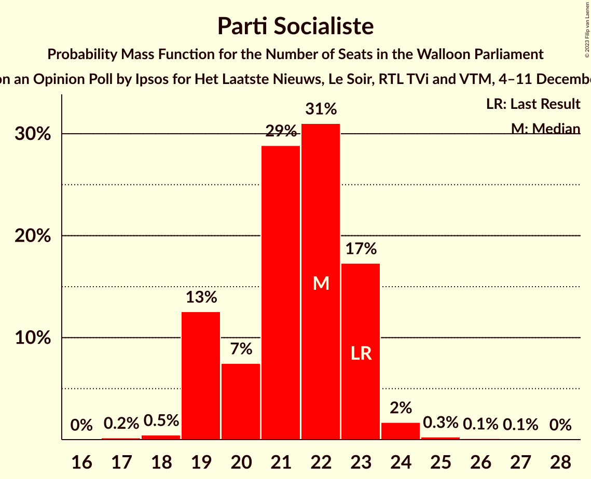

| Number of Seats | Probability | Accumulated | Special Marks |
|:---------------:|:-----------:|:-----------:|:-------------:|
| 17 | 0.2% | 100% |  |
| 18 | 0.5% | 99.8% |  |
| 19 | 13% | 99.4% |  |
| 20 | 7% | 87% |  |
| 21 | 29% | 79% |  |
| 22 | 31% | 50% | Median |
| 23 | 17% | 19% | Last Result |
| 24 | 2% | 2% |  |
| 25 | 0.3% | 0.5% |  |
| 26 | 0.1% | 0.2% |  |
| 27 | 0.1% | 0.1% |  |
| 28 | 0% | 0% |  |

### Mouvement Réformateur

*For a full overview of the results for this party, see the [Mouvement Réformateur](party-mouvementréformateur.html) page.*

| Number of Seats | Probability | Accumulated | Special Marks |
|:---------------:|:-----------:|:-----------:|:-------------:|
| 14 | 1.1% | 100% |  |
| 15 | 2% | 98.9% |  |
| 16 | 5% | 97% |  |
| 17 | 18% | 92% |  |
| 18 | 22% | 74% |  |
| 19 | 29% | 52% | Median |
| 20 | 13% | 23% | Last Result |
| 21 | 10% | 10% |  |
| 22 | 0% | 0.1% |  |
| 23 | 0% | 0% |  |

### Parti du Travail de Belgique

*For a full overview of the results for this party, see the [Parti du Travail de Belgique](party-partidutravaildebelgique.html) page.*

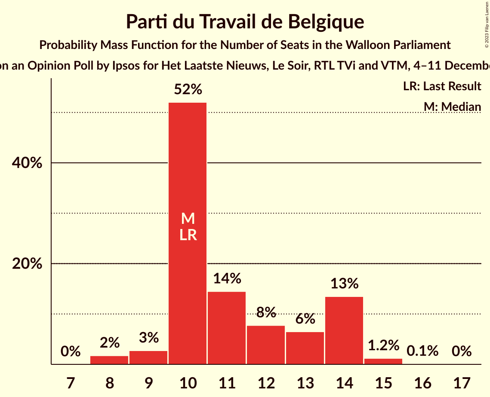

| Number of Seats | Probability | Accumulated | Special Marks |
|:---------------:|:-----------:|:-----------:|:-------------:|
| 8 | 2% | 100% |  |
| 9 | 3% | 98% |  |
| 10 | 52% | 96% | Last Result, Median |
| 11 | 14% | 44% |  |
| 12 | 8% | 29% |  |
| 13 | 6% | 21% |  |
| 14 | 13% | 15% |  |
| 15 | 1.2% | 1.3% |  |
| 16 | 0.1% | 0.1% |  |
| 17 | 0% | 0% |  |

### Ecolo

*For a full overview of the results for this party, see the [Ecolo](party-ecolo.html) page.*

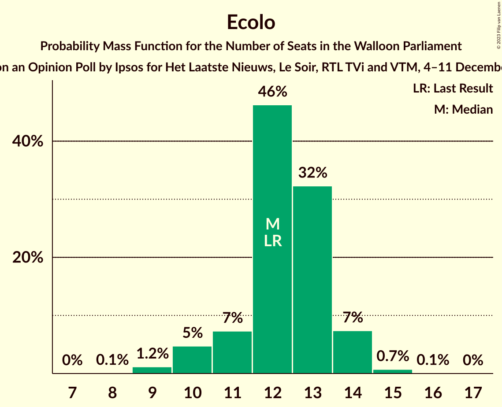

| Number of Seats | Probability | Accumulated | Special Marks |
|:---------------:|:-----------:|:-----------:|:-------------:|
| 8 | 0.1% | 100% |  |
| 9 | 1.2% | 99.9% |  |
| 10 | 5% | 98.7% |  |
| 11 | 7% | 94% |  |
| 12 | 46% | 87% | Last Result, Median |
| 13 | 32% | 40% |  |
| 14 | 7% | 8% |  |
| 15 | 0.7% | 0.8% |  |
| 16 | 0.1% | 0.1% |  |
| 17 | 0% | 0% |  |

### Les Engagés

*For a full overview of the results for this party, see the [Les Engagés](party-lesengagés.html) page.*

| Number of Seats | Probability | Accumulated | Special Marks |
|:---------------:|:-----------:|:-----------:|:-------------:|
| 8 | 0% | 100% |  |
| 9 | 0.2% | 99.9% |  |
| 10 | 3% | 99.8% | Last Result |
| 11 | 56% | 97% | Median |
| 12 | 14% | 42% |  |
| 13 | 21% | 28% |  |
| 14 | 6% | 7% |  |
| 15 | 1.1% | 1.2% |  |
| 16 | 0% | 0% |  |

### DéFI

*For a full overview of the results for this party, see the [DéFI](party-défi.html) page.*

| Number of Seats | Probability | Accumulated | Special Marks |
|:---------------:|:-----------:|:-----------:|:-------------:|
| 0 | 96% | 100% | Last Result, Median |
| 1 | 2% | 4% |  |
| 2 | 0.4% | 2% |  |
| 3 | 1.0% | 1.4% |  |
| 4 | 0.4% | 0.4% |  |
| 5 | 0% | 0% |  |

## Coalitions

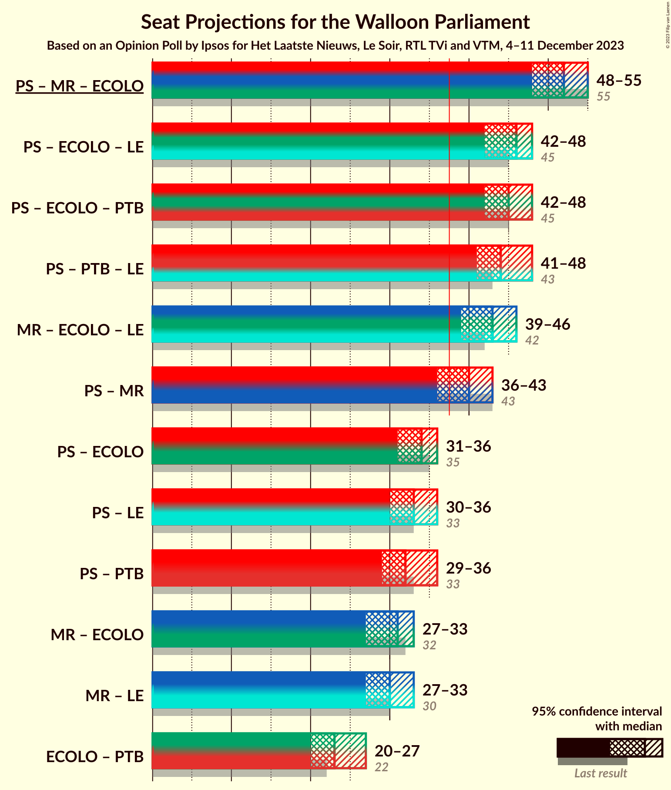

### Confidence Intervals

| Coalition | Last Result | Median | Majority? | 80% Confidence Interval | 90% Confidence Interval | 95% Confidence Interval | 99% Confidence Interval |
|:---------:|:-----------:|:------:|:---------:|:-----------------------:|:-----------------------:|:-----------------------:|:-----------------------:|
| Parti Socialiste – Mouvement Réformateur – Ecolo | 55 | 52 | 100% | 50–54 | 49–54 | 48–55 | 47–56 |
| Parti Socialiste – Ecolo – Les Engagés | 45 | 46 | 100% | 44–47 | 43–48 | 42–48 | 41–50 |
| Parti Socialiste – Ecolo – Parti du Travail de Belgique | 45 | 45 | 100% | 42–47 | 42–47 | 42–48 | 41–49 |
| Parti Socialiste – Parti du Travail de Belgique – Les Engagés | 43 | 44 | 100% | 42–46 | 42–47 | 41–48 | 41–49 |
| Mouvement Réformateur – Ecolo – Les Engagés | 42 | 43 | 99.7% | 40–45 | 40–46 | 39–46 | 38–46 |
| Parti Socialiste – Mouvement Réformateur | 43 | 40 | 89% | 37–42 | 37–42 | 36–43 | 35–43 |
| Parti Socialiste – Ecolo | 35 | 34 | 0.4% | 32–35 | 31–35 | 31–36 | 29–37 |
| Parti Socialiste – Les Engagés | 33 | 33 | 0.4% | 32–35 | 31–35 | 30–36 | 30–37 |
| Parti Socialiste – Parti du Travail de Belgique | 33 | 32 | 0.3% | 30–35 | 29–35 | 29–36 | 29–37 |
| Mouvement Réformateur – Ecolo | 32 | 31 | 0% | 29–33 | 28–33 | 27–33 | 26–34 |
| Mouvement Réformateur – Les Engagés | 30 | 30 | 0% | 28–32 | 28–33 | 27–33 | 26–34 |
| Ecolo – Parti du Travail de Belgique | 22 | 23 | 0% | 22–26 | 21–27 | 20–27 | 20–28 |

### Parti Socialiste – Mouvement Réformateur – Ecolo

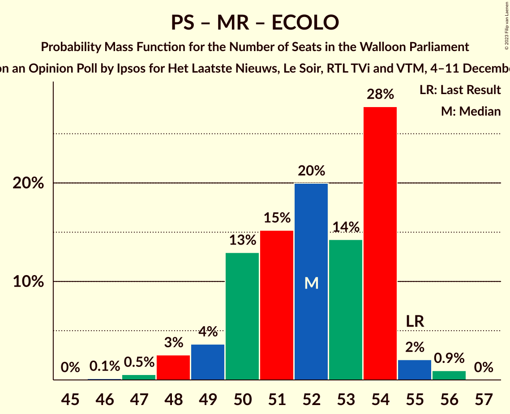

| Number of Seats | Probability | Accumulated | Special Marks |
|:---------------:|:-----------:|:-----------:|:-------------:|
| 46 | 0.1% | 100% |  |
| 47 | 0.5% | 99.8% |  |
| 48 | 3% | 99.3% |  |
| 49 | 4% | 97% |  |
| 50 | 13% | 93% |  |
| 51 | 15% | 80% |  |
| 52 | 20% | 65% |  |
| 53 | 14% | 45% | Median |
| 54 | 28% | 31% |  |
| 55 | 2% | 3% | Last Result |
| 56 | 0.9% | 1.0% |  |
| 57 | 0% | 0% |  |

### Parti Socialiste – Ecolo – Les Engagés

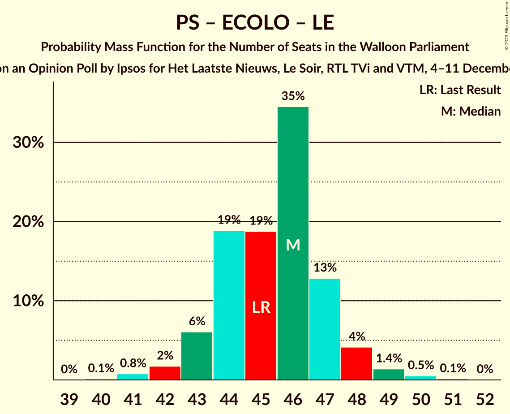

| Number of Seats | Probability | Accumulated | Special Marks |
|:---------------:|:-----------:|:-----------:|:-------------:|
| 40 | 0.1% | 100% |  |
| 41 | 0.8% | 99.8% |  |
| 42 | 2% | 99.1% |  |
| 43 | 6% | 97% |  |
| 44 | 19% | 91% |  |
| 45 | 19% | 72% | Last Result, Median |
| 46 | 35% | 54% |  |
| 47 | 13% | 19% |  |
| 48 | 4% | 6% |  |
| 49 | 1.4% | 2% |  |
| 50 | 0.5% | 0.7% |  |
| 51 | 0.1% | 0.2% |  |
| 52 | 0% | 0% |  |

### Parti Socialiste – Ecolo – Parti du Travail de Belgique

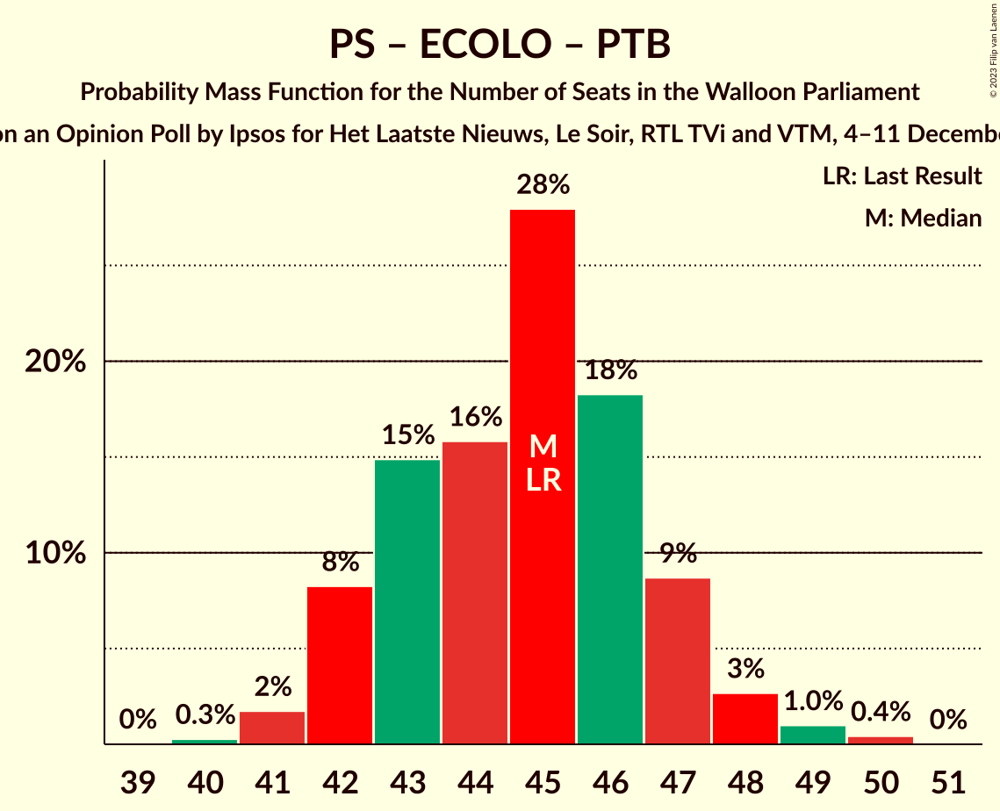

| Number of Seats | Probability | Accumulated | Special Marks |
|:---------------:|:-----------:|:-----------:|:-------------:|
| 40 | 0.3% | 100% |  |
| 41 | 2% | 99.7% |  |
| 42 | 8% | 98% |  |
| 43 | 15% | 90% |  |
| 44 | 16% | 75% | Median |
| 45 | 28% | 59% | Last Result |
| 46 | 18% | 31% |  |
| 47 | 9% | 13% |  |
| 48 | 3% | 4% |  |
| 49 | 1.0% | 1.4% |  |
| 50 | 0.4% | 0.4% |  |
| 51 | 0% | 0% |  |

### Parti Socialiste – Parti du Travail de Belgique – Les Engagés

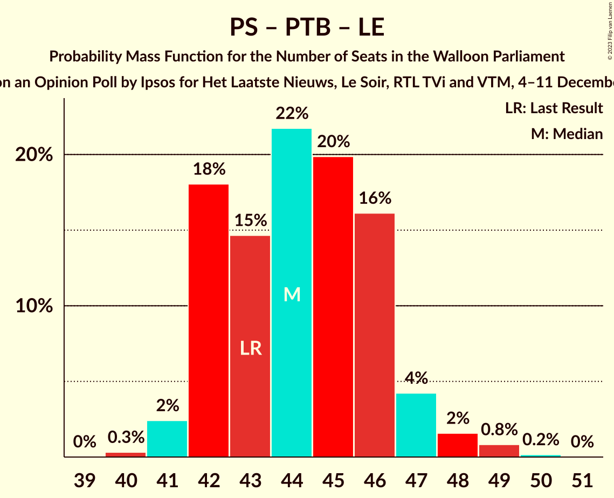

| Number of Seats | Probability | Accumulated | Special Marks |
|:---------------:|:-----------:|:-----------:|:-------------:|
| 40 | 0.3% | 100% |  |
| 41 | 2% | 99.7% |  |
| 42 | 18% | 97% |  |
| 43 | 15% | 79% | Last Result, Median |
| 44 | 22% | 65% |  |
| 45 | 20% | 43% |  |
| 46 | 16% | 23% |  |
| 47 | 4% | 7% |  |
| 48 | 2% | 3% |  |
| 49 | 0.8% | 1.0% |  |
| 50 | 0.2% | 0.2% |  |
| 51 | 0% | 0% |  |

### Mouvement Réformateur – Ecolo – Les Engagés

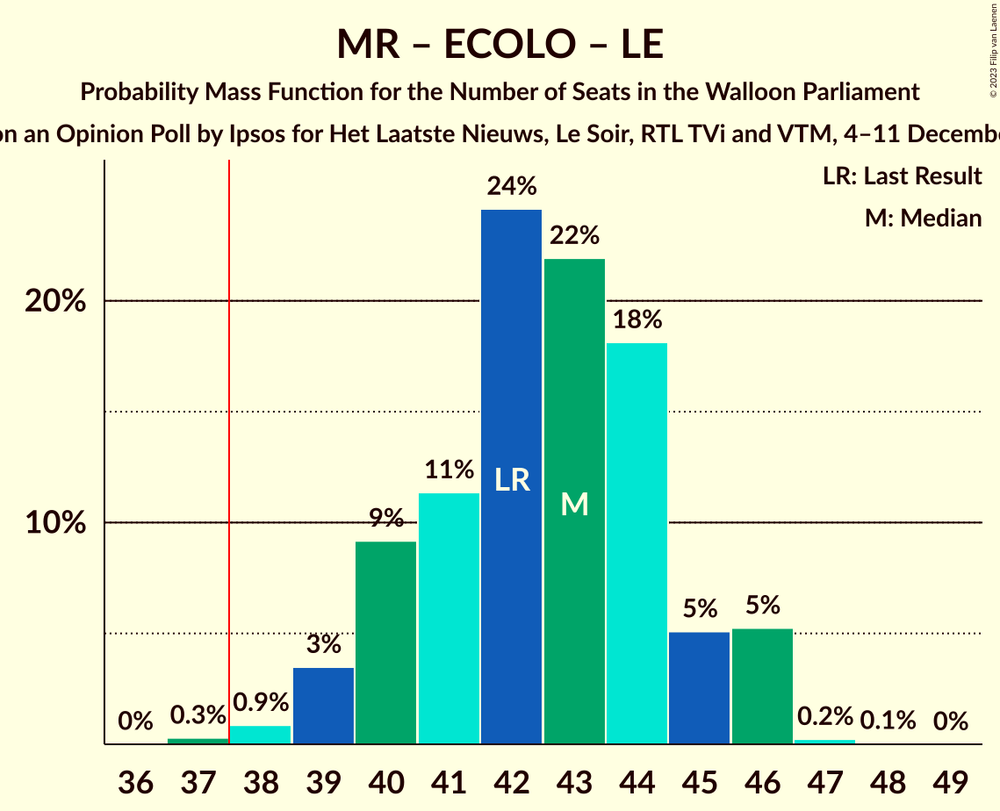

| Number of Seats | Probability | Accumulated | Special Marks |
|:---------------:|:-----------:|:-----------:|:-------------:|
| 37 | 0.3% | 100% |  |
| 38 | 0.9% | 99.7% | Majority |
| 39 | 3% | 98.8% |  |
| 40 | 9% | 95% |  |
| 41 | 11% | 86% |  |
| 42 | 24% | 75% | Last Result, Median |
| 43 | 22% | 51% |  |
| 44 | 18% | 29% |  |
| 45 | 5% | 11% |  |
| 46 | 5% | 6% |  |
| 47 | 0.2% | 0.3% |  |
| 48 | 0.1% | 0.1% |  |
| 49 | 0% | 0% |  |

### Parti Socialiste – Mouvement Réformateur

| Number of Seats | Probability | Accumulated | Special Marks |
|:---------------:|:-----------:|:-----------:|:-------------:|
| 33 | 0.1% | 100% |  |
| 34 | 0.2% | 99.9% |  |
| 35 | 0.5% | 99.8% |  |
| 36 | 3% | 99.3% |  |
| 37 | 7% | 96% |  |
| 38 | 12% | 89% | Majority |
| 39 | 18% | 77% |  |
| 40 | 19% | 60% |  |
| 41 | 22% | 41% | Median |
| 42 | 15% | 19% |  |
| 43 | 3% | 4% | Last Result |
| 44 | 0.4% | 0.4% |  |
| 45 | 0% | 0% |  |

### Parti Socialiste – Ecolo

| Number of Seats | Probability | Accumulated | Special Marks |
|:---------------:|:-----------:|:-----------:|:-------------:|
| 28 | 0.2% | 100% |  |
| 29 | 0.3% | 99.8% |  |
| 30 | 1.4% | 99.5% |  |
| 31 | 5% | 98% |  |
| 32 | 15% | 93% |  |
| 33 | 22% | 78% |  |
| 34 | 20% | 56% | Median |
| 35 | 31% | 36% | Last Result |
| 36 | 3% | 5% |  |
| 37 | 1.1% | 1.4% |  |
| 38 | 0.3% | 0.4% | Majority |
| 39 | 0% | 0.1% |  |
| 40 | 0% | 0% |  |

### Parti Socialiste – Les Engagés

| Number of Seats | Probability | Accumulated | Special Marks |
|:---------------:|:-----------:|:-----------:|:-------------:|
| 28 | 0.1% | 100% |  |
| 29 | 0.4% | 99.9% |  |
| 30 | 3% | 99.6% |  |
| 31 | 5% | 96% |  |
| 32 | 30% | 91% |  |
| 33 | 19% | 61% | Last Result, Median |
| 34 | 24% | 42% |  |
| 35 | 14% | 18% |  |
| 36 | 3% | 4% |  |
| 37 | 0.8% | 1.2% |  |
| 38 | 0.3% | 0.4% | Majority |
| 39 | 0.1% | 0.1% |  |
| 40 | 0% | 0% |  |

### Parti Socialiste – Parti du Travail de Belgique

| Number of Seats | Probability | Accumulated | Special Marks |
|:---------------:|:-----------:|:-----------:|:-------------:|
| 27 | 0.1% | 100% |  |
| 28 | 0.3% | 99.9% |  |
| 29 | 5% | 99.7% |  |
| 30 | 5% | 94% |  |
| 31 | 19% | 89% |  |
| 32 | 23% | 70% | Median |
| 33 | 23% | 47% | Last Result |
| 34 | 11% | 24% |  |
| 35 | 9% | 13% |  |
| 36 | 3% | 4% |  |
| 37 | 0.8% | 1.0% |  |
| 38 | 0.3% | 0.3% | Majority |
| 39 | 0% | 0% |  |

### Mouvement Réformateur – Ecolo

| Number of Seats | Probability | Accumulated | Special Marks |
|:---------------:|:-----------:|:-----------:|:-------------:|
| 25 | 0.2% | 100% |  |
| 26 | 0.9% | 99.8% |  |
| 27 | 2% | 98.9% |  |
| 28 | 4% | 97% |  |
| 29 | 17% | 93% |  |
| 30 | 20% | 76% |  |
| 31 | 21% | 55% | Median |
| 32 | 14% | 34% | Last Result |
| 33 | 17% | 20% |  |
| 34 | 2% | 2% |  |
| 35 | 0.2% | 0.2% |  |
| 36 | 0% | 0% |  |

### Mouvement Réformateur – Les Engagés

| Number of Seats | Probability | Accumulated | Special Marks |
|:---------------:|:-----------:|:-----------:|:-------------:|
| 25 | 0.4% | 100% |  |
| 26 | 1.1% | 99.6% |  |
| 27 | 3% | 98% |  |
| 28 | 9% | 96% |  |
| 29 | 20% | 87% |  |
| 30 | 28% | 67% | Last Result, Median |
| 31 | 15% | 39% |  |
| 32 | 14% | 24% |  |
| 33 | 8% | 10% |  |
| 34 | 2% | 2% |  |
| 35 | 0.2% | 0.2% |  |
| 36 | 0% | 0% |  |

### Ecolo – Parti du Travail de Belgique

| Number of Seats | Probability | Accumulated | Special Marks |
|:---------------:|:-----------:|:-----------:|:-------------:|
| 19 | 0.4% | 100% |  |
| 20 | 3% | 99.6% |  |
| 21 | 6% | 97% |  |
| 22 | 28% | 91% | Last Result, Median |
| 23 | 25% | 64% |  |
| 24 | 15% | 39% |  |
| 25 | 10% | 23% |  |
| 26 | 8% | 14% |  |
| 27 | 4% | 5% |  |
| 28 | 0.7% | 0.8% |  |
| 29 | 0.1% | 0.1% |  |
| 30 | 0% | 0% |  |

## Technical Information

### Opinion Poll

+ **Polling firm:** Ipsos
+ **Commissioner(s):** Het Laatste Nieuws, Le Soir, RTL TVi and VTM
+ **Fieldwork period:** 4–11 December 2023

### Calculations

+ **Sample size:** 1000
+ **Simulations done:** 1,048,576
+ **Error estimate:** 0.79%

