# Opinion Poll by Kantar for Knack and Le Vif, 22 January–8 February 2024

<a href="#voting-intentions">Voting Intentions</a> | <a href="#seats">Seats</a> | <a href="#coalitions">Coalitions</a> | <a href="#technical-information">Technical Information</a>

## Voting Intentions

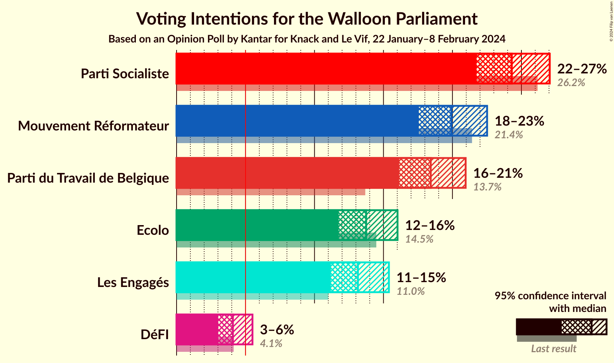

### Confidence Intervals

| Party | Last Result | Poll Result | 80% Confidence Interval | 90% Confidence Interval | 95% Confidence Interval | 99% Confidence Interval |
|:-----:|:-----------:|:-----------:|:-----------------------:|:-----------------------:|:-----------------------:|:-----------------------:|
| Parti Socialiste | 26.2% | 24.3% | 22.6–26.1% |22.1–26.6% |21.7–27.1% |21.0–27.9% |
| Mouvement Réformateur | 21.4% | 19.9% | 18.4–21.6% |17.9–22.1% |17.6–22.5% |16.8–23.3% |
| Parti du Travail de Belgique | 13.7% | 18.4% | 16.9–20.1% |16.5–20.5% |16.1–21.0% |15.5–21.8% |
| Ecolo | 14.5% | 13.7% | 12.4–15.2% |12.1–15.7% |11.8–16.0% |11.1–16.8% |
| Les Engagés | 11.0% | 13.1% | 11.9–14.6% |11.5–15.0% |11.2–15.4% |10.6–16.1% |
| DéFI | 4.1% | 4.1% | 3.4–5.0% |3.2–5.3% |3.0–5.5% |2.7–6.0% |

*Note:* The poll result column reflects the actual value used in the calculations. Published results may vary slightly, and in addition be rounded to fewer digits.

## Seats

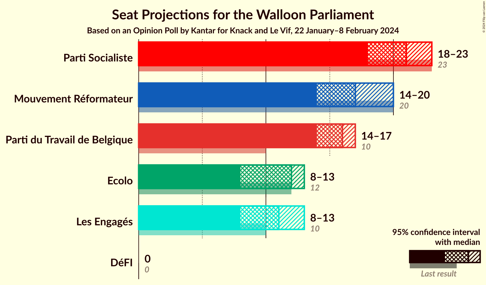

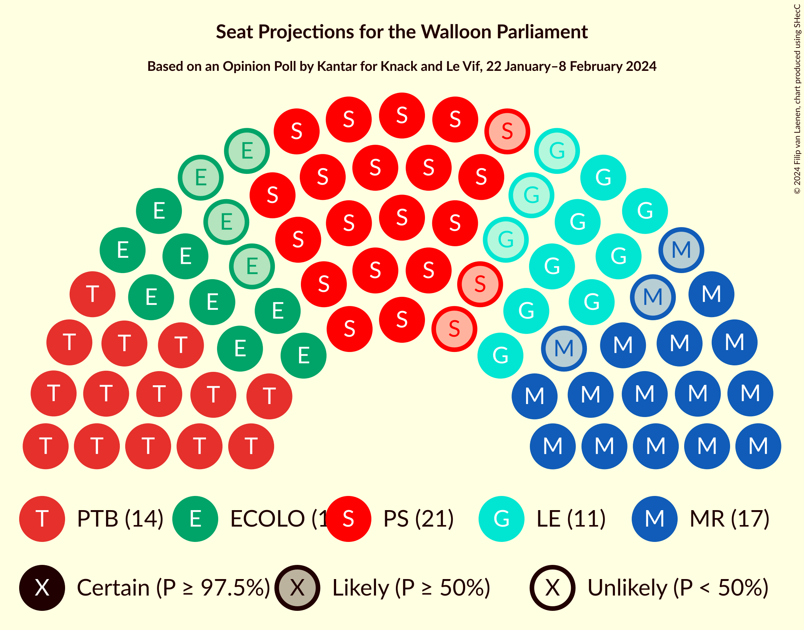

### Confidence Intervals

| Party | Last Result | Median | 80% Confidence Interval | 90% Confidence Interval | 95% Confidence Interval | 99% Confidence Interval |
|:-----:|:-----------:|:------:|:-----------------------:|:-----------------------:|:-----------------------:|:-----------------------:|
| <a href="#parti-socialiste">Parti Socialiste</a> | 23 | 21 | 19–22 |19–22 |18–23 |17–23 |
| <a href="#mouvement-réformateur">Mouvement Réformateur</a> | 20 | 17 | 14–18 |14–19 |14–20 |14–21 |
| <a href="#parti-du-travail-de-belgique">Parti du Travail de Belgique</a> | 10 | 16 | 14–17 |14–17 |14–17 |12–18 |
| <a href="#ecolo">Ecolo</a> | 12 | 12 | 10–13 |9–13 |8–13 |7–14 |
| <a href="#les-engagés">Les Engagés</a> | 10 | 11 | 10–11 |9–12 |8–13 |7–13 |
| <a href="#défi">DéFI</a> | 0 | 0 | 0 |0 |0 |0–3 |

### Parti Socialiste

*For a full overview of the results for this party, see the [Parti Socialiste](party-partisocialiste.html) page.*

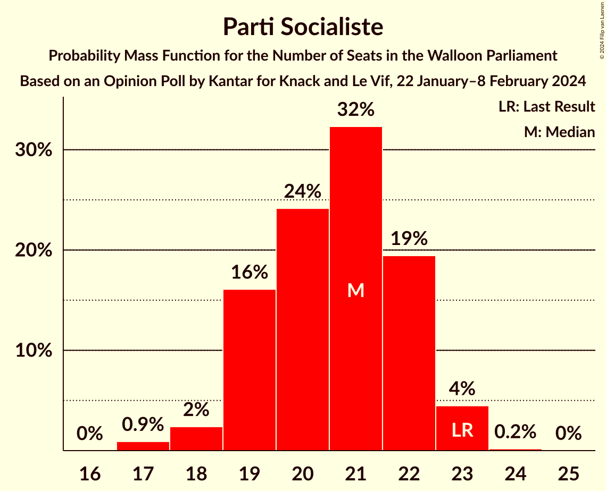

| Number of Seats | Probability | Accumulated | Special Marks |
|:---------------:|:-----------:|:-----------:|:-------------:|
| 17 | 0.9% | 100% |  |
| 18 | 2% | 99.1% |  |
| 19 | 16% | 97% |  |
| 20 | 24% | 81% |  |
| 21 | 32% | 56% | Median |
| 22 | 19% | 24% |  |
| 23 | 4% | 5% | Last Result |
| 24 | 0.2% | 0.2% |  |
| 25 | 0% | 0% |  |

### Mouvement Réformateur

*For a full overview of the results for this party, see the [Mouvement Réformateur](party-mouvementréformateur.html) page.*

| Number of Seats | Probability | Accumulated | Special Marks |
|:---------------:|:-----------:|:-----------:|:-------------:|
| 14 | 12% | 100% |  |
| 15 | 15% | 88% |  |
| 16 | 20% | 73% |  |
| 17 | 25% | 53% | Median |
| 18 | 19% | 28% |  |
| 19 | 5% | 9% |  |
| 20 | 3% | 4% | Last Result |
| 21 | 0.8% | 0.8% |  |
| 22 | 0% | 0% |  |

### Parti du Travail de Belgique

*For a full overview of the results for this party, see the [Parti du Travail de Belgique](party-partidutravaildebelgique.html) page.*

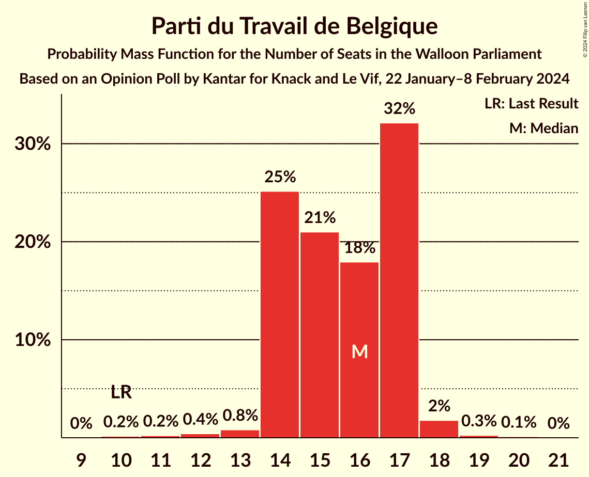

| Number of Seats | Probability | Accumulated | Special Marks |
|:---------------:|:-----------:|:-----------:|:-------------:|
| 10 | 0.2% | 100% | Last Result |
| 11 | 0.2% | 99.8% |  |
| 12 | 0.4% | 99.6% |  |
| 13 | 0.8% | 99.2% |  |
| 14 | 25% | 98% |  |
| 15 | 21% | 73% |  |
| 16 | 18% | 52% | Median |
| 17 | 32% | 34% |  |
| 18 | 2% | 2% |  |
| 19 | 0.3% | 0.4% |  |
| 20 | 0.1% | 0.1% |  |
| 21 | 0% | 0% |  |

### Ecolo

*For a full overview of the results for this party, see the [Ecolo](party-ecolo.html) page.*

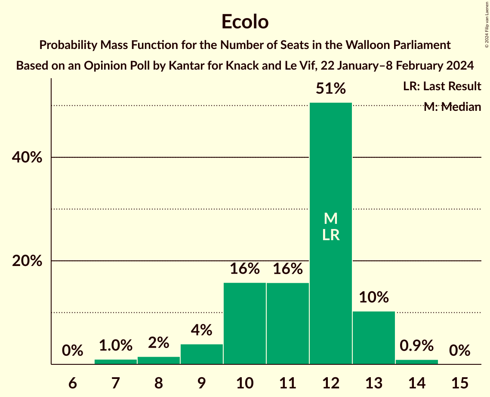

| Number of Seats | Probability | Accumulated | Special Marks |
|:---------------:|:-----------:|:-----------:|:-------------:|
| 7 | 1.0% | 100% |  |
| 8 | 2% | 99.0% |  |
| 9 | 4% | 97% |  |
| 10 | 16% | 94% |  |
| 11 | 16% | 78% |  |
| 12 | 51% | 62% | Last Result, Median |
| 13 | 10% | 11% |  |
| 14 | 0.9% | 0.9% |  |
| 15 | 0% | 0% |  |

### Les Engagés

*For a full overview of the results for this party, see the [Les Engagés](party-lesengagés.html) page.*

| Number of Seats | Probability | Accumulated | Special Marks |
|:---------------:|:-----------:|:-----------:|:-------------:|
| 6 | 0.1% | 100% |  |
| 7 | 1.0% | 99.9% |  |
| 8 | 3% | 98.9% |  |
| 9 | 5% | 96% |  |
| 10 | 15% | 91% | Last Result |
| 11 | 68% | 77% | Median |
| 12 | 6% | 9% |  |
| 13 | 3% | 3% |  |
| 14 | 0.2% | 0.3% |  |
| 15 | 0% | 0% |  |

### DéFI

*For a full overview of the results for this party, see the [DéFI](party-défi.html) page.*

| Number of Seats | Probability | Accumulated | Special Marks |
|:---------------:|:-----------:|:-----------:|:-------------:|
| 0 | 98% | 100% | Last Result, Median |
| 1 | 0.6% | 2% |  |
| 2 | 0.6% | 1.3% |  |
| 3 | 0.4% | 0.8% |  |
| 4 | 0.4% | 0.4% |  |
| 5 | 0% | 0% |  |

## Coalitions

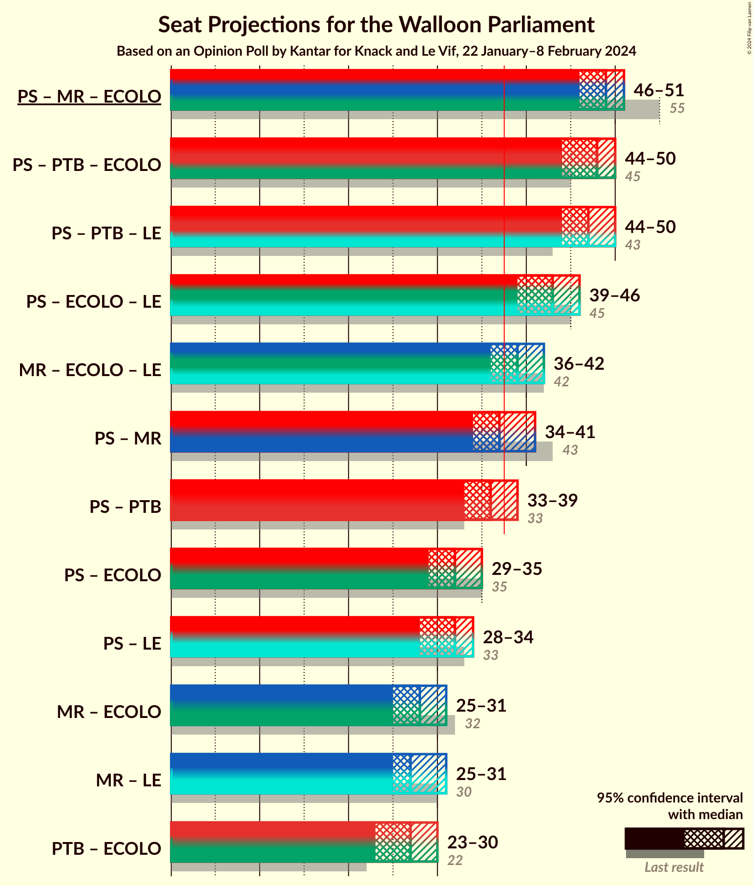

### Confidence Intervals

| Coalition | Last Result | Median | Majority? | 80% Confidence Interval | 90% Confidence Interval | 95% Confidence Interval | 99% Confidence Interval |
|:---------:|:-----------:|:------:|:---------:|:-----------------------:|:-----------------------:|:-----------------------:|:-----------------------:|
| Parti Socialiste – Mouvement Réformateur – Ecolo | 55 | 49 | 100% | 47–50 | 46–51 | 46–51 | 45–53 |
| Parti Socialiste – Parti du Travail de Belgique – Ecolo | 45 | 48 | 100% | 46–50 | 45–50 | 44–50 | 43–51 |
| Parti Socialiste – Parti du Travail de Belgique – Les Engagés | 43 | 47 | 100% | 45–49 | 44–49 | 44–50 | 43–51 |
| Parti Socialiste – Ecolo – Les Engagés | 45 | 43 | 99.8% | 41–44 | 40–45 | 39–46 | 38–46 |
| Mouvement Réformateur – Ecolo – Les Engagés | 42 | 39 | 76% | 37–41 | 36–41 | 36–42 | 35–43 |
| Parti Socialiste – Mouvement Réformateur | 43 | 37 | 38% | 35–40 | 35–40 | 34–41 | 33–42 |
| Parti Socialiste – Parti du Travail de Belgique | 33 | 36 | 23% | 34–38 | 34–38 | 33–39 | 32–40 |
| Parti Socialiste – Ecolo | 35 | 32 | 0% | 30–34 | 30–34 | 29–35 | 28–35 |
| Parti Socialiste – Les Engagés | 33 | 32 | 0% | 30–33 | 29–34 | 28–34 | 27–35 |
| Mouvement Réformateur – Ecolo | 32 | 28 | 0% | 26–30 | 26–31 | 25–31 | 24–32 |
| Mouvement Réformateur – Les Engagés | 30 | 27 | 0% | 25–29 | 25–30 | 25–31 | 24–32 |
| Parti du Travail de Belgique – Ecolo | 22 | 27 | 0% | 25–29 | 24–29 | 23–30 | 23–30 |

### Parti Socialiste – Mouvement Réformateur – Ecolo

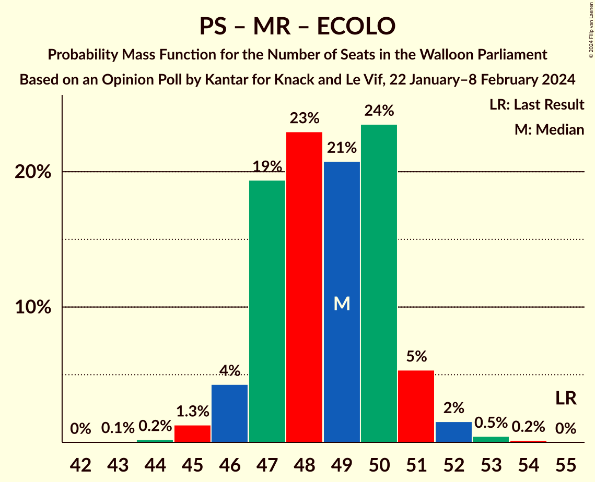

| Number of Seats | Probability | Accumulated | Special Marks |
|:---------------:|:-----------:|:-----------:|:-------------:|
| 43 | 0.1% | 100% |  |
| 44 | 0.2% | 99.9% |  |
| 45 | 1.3% | 99.7% |  |
| 46 | 4% | 98% |  |
| 47 | 19% | 94% |  |
| 48 | 23% | 75% |  |
| 49 | 21% | 52% |  |
| 50 | 24% | 31% | Median |
| 51 | 5% | 8% |  |
| 52 | 2% | 2% |  |
| 53 | 0.5% | 0.6% |  |
| 54 | 0.2% | 0.2% |  |
| 55 | 0% | 0% | Last Result |

### Parti Socialiste – Parti du Travail de Belgique – Ecolo

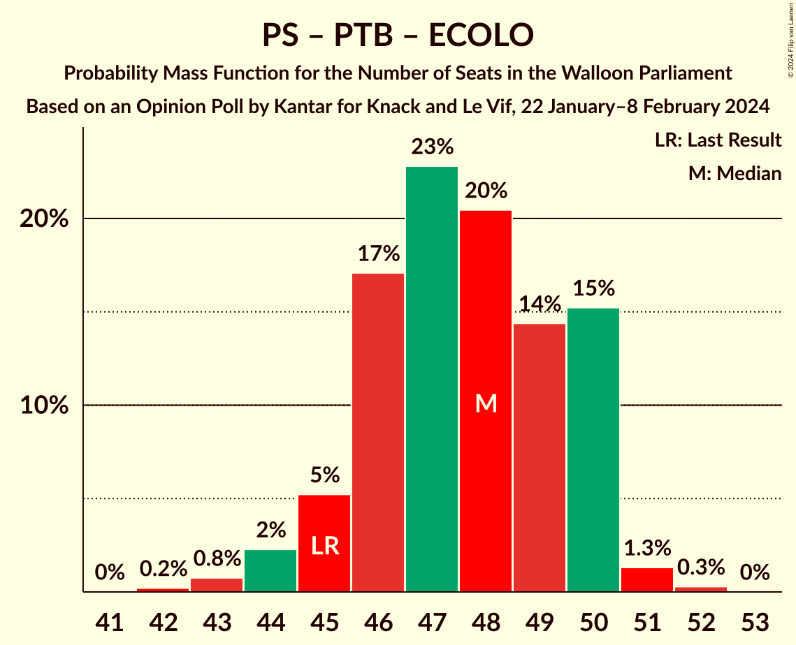

| Number of Seats | Probability | Accumulated | Special Marks |
|:---------------:|:-----------:|:-----------:|:-------------:|
| 42 | 0.2% | 100% |  |
| 43 | 0.8% | 99.8% |  |
| 44 | 2% | 99.0% |  |
| 45 | 5% | 97% | Last Result |
| 46 | 17% | 92% |  |
| 47 | 23% | 74% |  |
| 48 | 20% | 52% |  |
| 49 | 14% | 31% | Median |
| 50 | 15% | 17% |  |
| 51 | 1.3% | 2% |  |
| 52 | 0.3% | 0.3% |  |
| 53 | 0% | 0% |  |

### Parti Socialiste – Parti du Travail de Belgique – Les Engagés

| Number of Seats | Probability | Accumulated | Special Marks |
|:---------------:|:-----------:|:-----------:|:-------------:|
| 42 | 0.5% | 100% |  |
| 43 | 1.2% | 99.5% | Last Result |
| 44 | 4% | 98% |  |
| 45 | 10% | 94% |  |
| 46 | 23% | 84% |  |
| 47 | 24% | 61% |  |
| 48 | 19% | 37% | Median |
| 49 | 15% | 18% |  |
| 50 | 3% | 3% |  |
| 51 | 0.5% | 0.6% |  |
| 52 | 0.1% | 0.1% |  |
| 53 | 0% | 0% |  |

### Parti Socialiste – Ecolo – Les Engagés

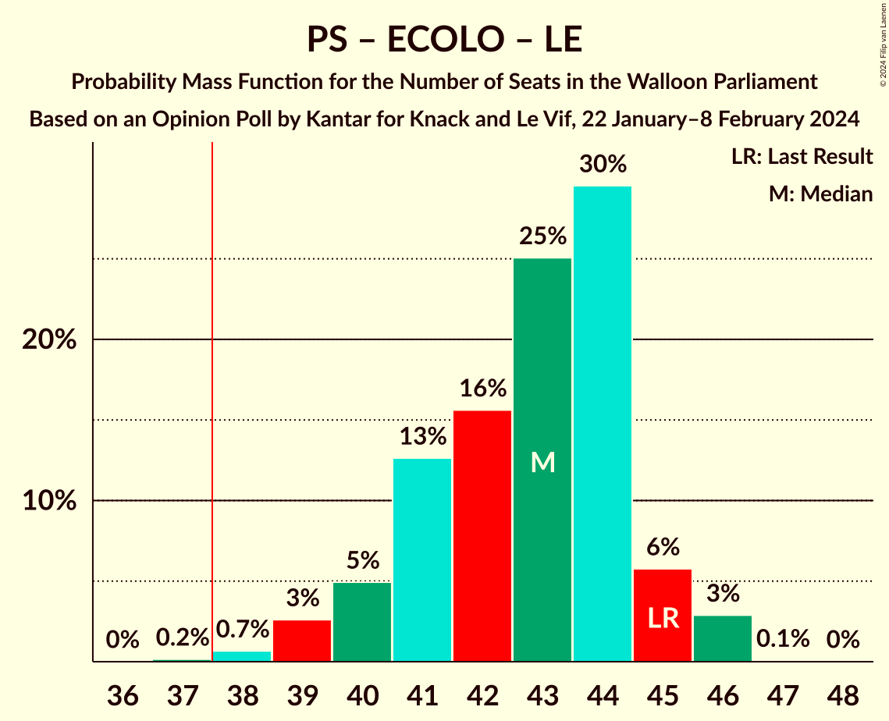

| Number of Seats | Probability | Accumulated | Special Marks |
|:---------------:|:-----------:|:-----------:|:-------------:|
| 37 | 0.2% | 100% |  |
| 38 | 0.7% | 99.8% | Majority |
| 39 | 3% | 99.2% |  |
| 40 | 5% | 97% |  |
| 41 | 13% | 92% |  |
| 42 | 16% | 79% |  |
| 43 | 25% | 63% |  |
| 44 | 30% | 38% | Median |
| 45 | 6% | 9% | Last Result |
| 46 | 3% | 3% |  |
| 47 | 0.1% | 0.1% |  |
| 48 | 0% | 0% |  |

### Mouvement Réformateur – Ecolo – Les Engagés

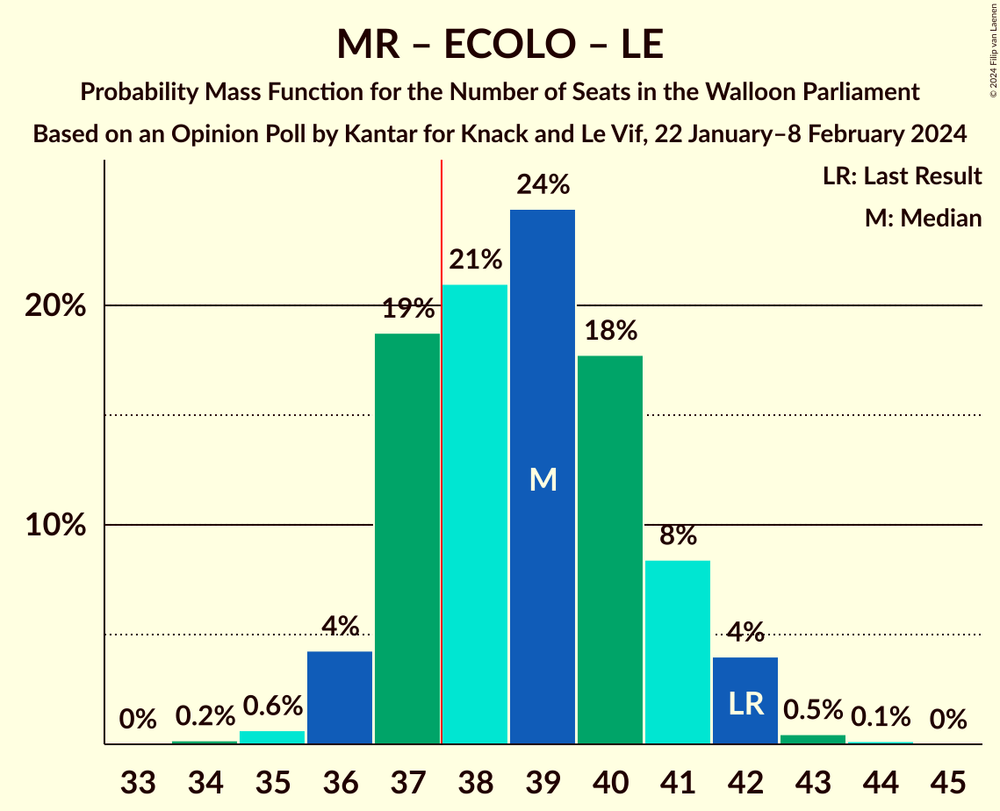

| Number of Seats | Probability | Accumulated | Special Marks |
|:---------------:|:-----------:|:-----------:|:-------------:|
| 34 | 0.2% | 100% |  |
| 35 | 0.6% | 99.8% |  |
| 36 | 4% | 99.2% |  |
| 37 | 19% | 95% |  |
| 38 | 21% | 76% | Majority |
| 39 | 24% | 55% |  |
| 40 | 18% | 31% | Median |
| 41 | 8% | 13% |  |
| 42 | 4% | 5% | Last Result |
| 43 | 0.5% | 0.6% |  |
| 44 | 0.1% | 0.2% |  |
| 45 | 0% | 0% |  |

### Parti Socialiste – Mouvement Réformateur

| Number of Seats | Probability | Accumulated | Special Marks |
|:---------------:|:-----------:|:-----------:|:-------------:|
| 32 | 0.1% | 100% |  |
| 33 | 0.8% | 99.9% |  |
| 34 | 3% | 99.1% |  |
| 35 | 9% | 96% |  |
| 36 | 26% | 87% |  |
| 37 | 23% | 61% |  |
| 38 | 17% | 38% | Median, Majority |
| 39 | 11% | 22% |  |
| 40 | 7% | 11% |  |
| 41 | 3% | 4% |  |
| 42 | 0.6% | 0.7% |  |
| 43 | 0.1% | 0.1% | Last Result |
| 44 | 0% | 0% |  |

### Parti Socialiste – Parti du Travail de Belgique

| Number of Seats | Probability | Accumulated | Special Marks |
|:---------------:|:-----------:|:-----------:|:-------------:|
| 31 | 0.2% | 100% |  |
| 32 | 0.5% | 99.8% |  |
| 33 | 4% | 99.3% | Last Result |
| 34 | 9% | 95% |  |
| 35 | 18% | 86% |  |
| 36 | 25% | 69% |  |
| 37 | 21% | 44% | Median |
| 38 | 18% | 23% | Majority |
| 39 | 4% | 4% |  |
| 40 | 0.5% | 0.5% |  |
| 41 | 0.1% | 0.1% |  |
| 42 | 0% | 0% |  |

### Parti Socialiste – Ecolo

| Number of Seats | Probability | Accumulated | Special Marks |
|:---------------:|:-----------:|:-----------:|:-------------:|
| 26 | 0.1% | 100% |  |
| 27 | 0.3% | 99.9% |  |
| 28 | 2% | 99.6% |  |
| 29 | 3% | 98% |  |
| 30 | 10% | 95% |  |
| 31 | 17% | 85% |  |
| 32 | 26% | 67% |  |
| 33 | 28% | 41% | Median |
| 34 | 9% | 13% |  |
| 35 | 4% | 5% | Last Result |
| 36 | 0.1% | 0.1% |  |
| 37 | 0% | 0% |  |

### Parti Socialiste – Les Engagés

| Number of Seats | Probability | Accumulated | Special Marks |
|:---------------:|:-----------:|:-----------:|:-------------:|
| 26 | 0.2% | 100% |  |
| 27 | 0.7% | 99.7% |  |
| 28 | 3% | 99.0% |  |
| 29 | 6% | 96% |  |
| 30 | 14% | 91% |  |
| 31 | 24% | 76% |  |
| 32 | 35% | 52% | Median |
| 33 | 12% | 17% | Last Result |
| 34 | 4% | 5% |  |
| 35 | 0.7% | 0.8% |  |
| 36 | 0.1% | 0.1% |  |
| 37 | 0% | 0% |  |

### Mouvement Réformateur – Ecolo

| Number of Seats | Probability | Accumulated | Special Marks |
|:---------------:|:-----------:|:-----------:|:-------------:|
| 23 | 0.1% | 100% |  |
| 24 | 0.6% | 99.8% |  |
| 25 | 3% | 99.2% |  |
| 26 | 15% | 96% |  |
| 27 | 19% | 81% |  |
| 28 | 24% | 62% |  |
| 29 | 23% | 38% | Median |
| 30 | 10% | 15% |  |
| 31 | 4% | 5% |  |
| 32 | 1.0% | 1.4% | Last Result |
| 33 | 0.4% | 0.4% |  |
| 34 | 0% | 0% |  |

### Mouvement Réformateur – Les Engagés

| Number of Seats | Probability | Accumulated | Special Marks |
|:---------------:|:-----------:|:-----------:|:-------------:|
| 23 | 0.3% | 100% |  |
| 24 | 1.5% | 99.7% |  |
| 25 | 16% | 98% |  |
| 26 | 15% | 83% |  |
| 27 | 21% | 68% |  |
| 28 | 23% | 48% | Median |
| 29 | 17% | 25% |  |
| 30 | 5% | 8% | Last Result |
| 31 | 2% | 3% |  |
| 32 | 0.6% | 0.8% |  |
| 33 | 0.2% | 0.2% |  |
| 34 | 0% | 0% |  |

### Parti du Travail de Belgique – Ecolo

| Number of Seats | Probability | Accumulated | Special Marks |
|:---------------:|:-----------:|:-----------:|:-------------:|
| 22 | 0.4% | 100% | Last Result |
| 23 | 3% | 99.6% |  |
| 24 | 5% | 97% |  |
| 25 | 9% | 91% |  |
| 26 | 17% | 82% |  |
| 27 | 24% | 66% |  |
| 28 | 22% | 42% | Median |
| 29 | 16% | 20% |  |
| 30 | 4% | 4% |  |
| 31 | 0.2% | 0.2% |  |
| 32 | 0% | 0% |  |

## Technical Information

### Opinion Poll

+ **Polling firm:** Kantar
+ **Commissioner(s):** Knack and Le Vif
+ **Fieldwork period:** 22 January–8 February 2024

### Calculations

+ **Sample size:** 1004
+ **Simulations done:** 2,097,152
+ **Error estimate:** 0.37%

