# Opinion Poll by Ipsos for Het Laatste Nieuws, Le Soir, RTL TVi and VTM, 14–20 May 2024

<a href="#voting-intentions">Voting Intentions</a> | <a href="#seats">Seats</a> | <a href="#coalitions">Coalitions</a> | <a href="#technical-information">Technical Information</a>

## Voting Intentions

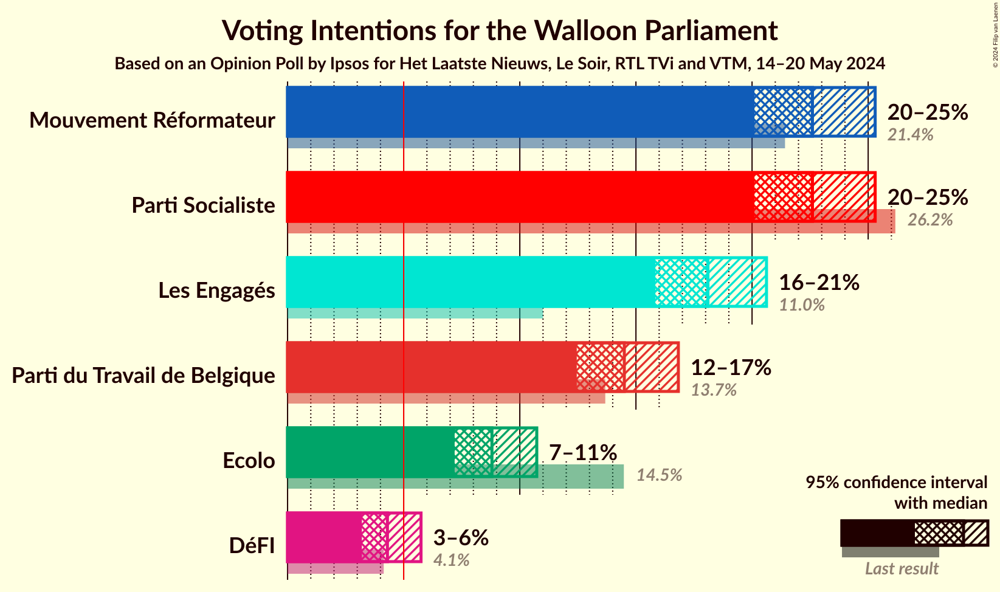

### Confidence Intervals

| Party | Last Result | Poll Result | 80% Confidence Interval | 90% Confidence Interval | 95% Confidence Interval | 99% Confidence Interval |
|:-----:|:-----------:|:-----------:|:-----------------------:|:-----------------------:|:-----------------------:|:-----------------------:|
| Parti Socialiste | 26.2% | 22.6% | 21.0–24.4% |20.5–24.9% |20.1–25.3% |19.3–26.2% |
| Mouvement Réformateur | 21.4% | 22.6% | 21.0–24.4% |20.5–24.9% |20.1–25.3% |19.3–26.2% |
| Les Engagés | 11.0% | 18.1% | 16.6–19.7% |16.2–20.2% |15.8–20.6% |15.2–21.4% |
| Parti du Travail de Belgique | 13.7% | 14.5% | 13.2–16.0% |12.8–16.4% |12.5–16.8% |11.8–17.6% |
| Ecolo | 14.5% | 8.8% | 7.7–10.1% |7.4–10.4% |7.2–10.7% |6.7–11.4% |
| DéFI | 4.1% | 4.3% | 3.6–5.2% |3.4–5.5% |3.2–5.7% |2.9–6.2% |

*Note:* The poll result column reflects the actual value used in the calculations. Published results may vary slightly, and in addition be rounded to fewer digits.

## Seats

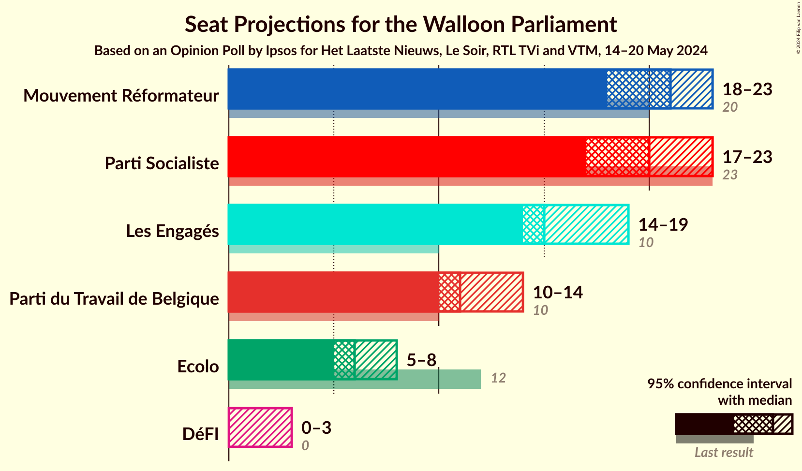

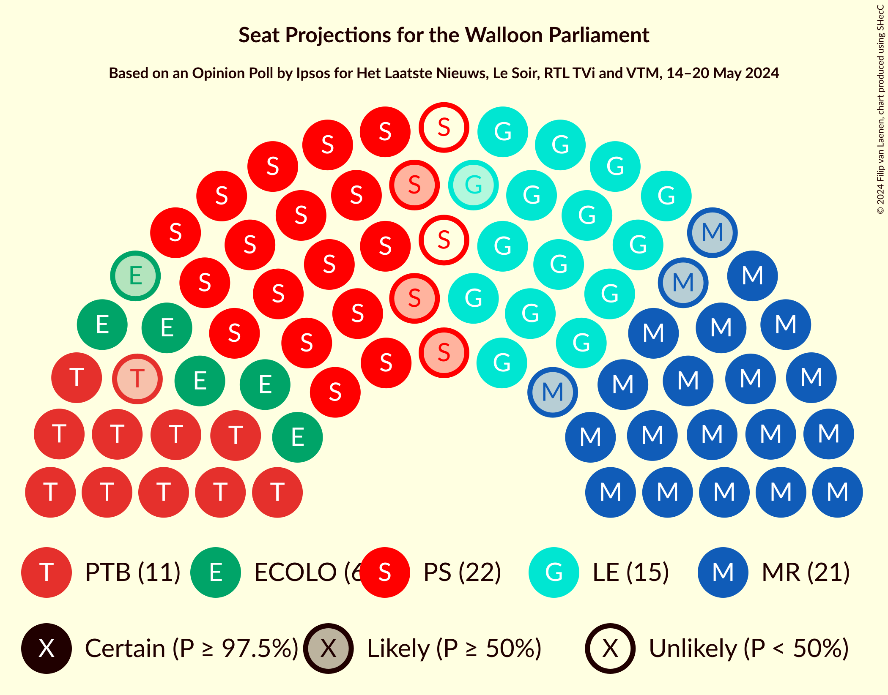

### Confidence Intervals

| Party | Last Result | Median | 80% Confidence Interval | 90% Confidence Interval | 95% Confidence Interval | 99% Confidence Interval |
|:-----:|:-----------:|:------:|:-----------------------:|:-----------------------:|:-----------------------:|:-----------------------:|
| <a href="#parti-socialiste">Parti Socialiste</a> | 23 | 20 | 19–22 |18–22 |17–23 |17–23 |
| <a href="#mouvement-réformateur">Mouvement Réformateur</a> | 20 | 21 | 19–22 |19–23 |18–23 |17–25 |
| <a href="#les-engagés">Les Engagés</a> | 10 | 15 | 15–18 |15–18 |14–19 |13–19 |
| <a href="#parti-du-travail-de-belgique">Parti du Travail de Belgique</a> | 10 | 11 | 10–14 |10–14 |10–14 |8–15 |
| <a href="#ecolo">Ecolo</a> | 12 | 6 | 6–7 |6–7 |5–8 |5–9 |
| <a href="#défi">DéFI</a> | 0 | 0 | 0–1 |0–2 |0–3 |0–4 |

### Parti Socialiste

*For a full overview of the results for this party, see the [Parti Socialiste](party-partisocialiste.html) page.*

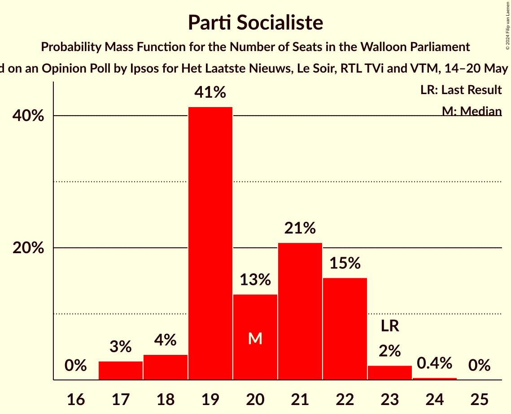

| Number of Seats | Probability | Accumulated | Special Marks |
|:---------------:|:-----------:|:-----------:|:-------------:|
| 17 | 3% | 100% |  |
| 18 | 4% | 97% |  |
| 19 | 41% | 93% |  |
| 20 | 13% | 52% | Median |
| 21 | 21% | 39% |  |
| 22 | 15% | 18% |  |
| 23 | 2% | 3% | Last Result |
| 24 | 0.4% | 0.4% |  |
| 25 | 0% | 0% |  |

### Mouvement Réformateur

*For a full overview of the results for this party, see the [Mouvement Réformateur](party-mouvementréformateur.html) page.*

| Number of Seats | Probability | Accumulated | Special Marks |
|:---------------:|:-----------:|:-----------:|:-------------:|
| 16 | 0.1% | 100% |  |
| 17 | 0.5% | 99.9% |  |
| 18 | 2% | 99.4% |  |
| 19 | 8% | 97% |  |
| 20 | 21% | 89% | Last Result |
| 21 | 52% | 68% | Median |
| 22 | 9% | 15% |  |
| 23 | 4% | 6% |  |
| 24 | 1.1% | 2% |  |
| 25 | 1.0% | 1.0% |  |
| 26 | 0% | 0% |  |

### Les Engagés

*For a full overview of the results for this party, see the [Les Engagés](party-lesengagés.html) page.*

| Number of Seats | Probability | Accumulated | Special Marks |
|:---------------:|:-----------:|:-----------:|:-------------:|
| 10 | 0% | 100% | Last Result |
| 11 | 0.1% | 100% |  |
| 12 | 0.1% | 99.9% |  |
| 13 | 0.6% | 99.8% |  |
| 14 | 3% | 99.2% |  |
| 15 | 49% | 97% | Median |
| 16 | 24% | 47% |  |
| 17 | 10% | 23% |  |
| 18 | 8% | 12% |  |
| 19 | 4% | 4% |  |
| 20 | 0.4% | 0.4% |  |
| 21 | 0% | 0% |  |

### Parti du Travail de Belgique

*For a full overview of the results for this party, see the [Parti du Travail de Belgique](party-partidutravaildebelgique.html) page.*

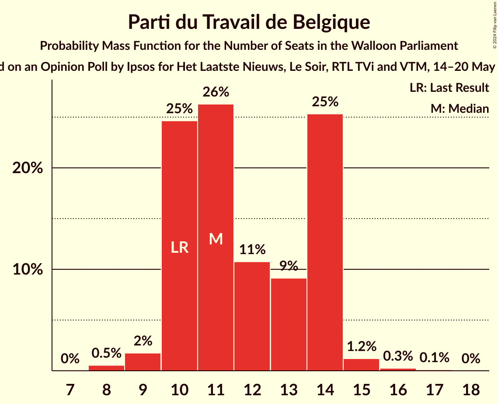

| Number of Seats | Probability | Accumulated | Special Marks |
|:---------------:|:-----------:|:-----------:|:-------------:|
| 8 | 0.5% | 100% |  |
| 9 | 2% | 99.5% |  |
| 10 | 25% | 98% | Last Result |
| 11 | 26% | 73% | Median |
| 12 | 11% | 47% |  |
| 13 | 9% | 36% |  |
| 14 | 25% | 27% |  |
| 15 | 1.2% | 2% |  |
| 16 | 0.3% | 0.4% |  |
| 17 | 0.1% | 0.1% |  |
| 18 | 0% | 0% |  |

### Ecolo

*For a full overview of the results for this party, see the [Ecolo](party-ecolo.html) page.*

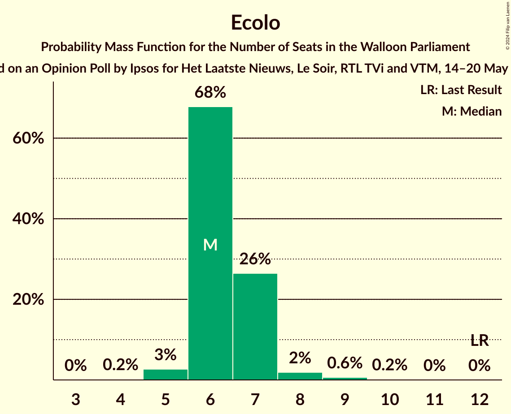

| Number of Seats | Probability | Accumulated | Special Marks |
|:---------------:|:-----------:|:-----------:|:-------------:|
| 3 | 0% | 100% |  |
| 4 | 0.2% | 99.9% |  |
| 5 | 3% | 99.7% |  |
| 6 | 68% | 97% | Median |
| 7 | 26% | 29% |  |
| 8 | 2% | 3% |  |
| 9 | 0.6% | 0.8% |  |
| 10 | 0.2% | 0.2% |  |
| 11 | 0% | 0% |  |
| 12 | 0% | 0% | Last Result |

### DéFI

*For a full overview of the results for this party, see the [DéFI](party-défi.html) page.*

| Number of Seats | Probability | Accumulated | Special Marks |
|:---------------:|:-----------:|:-----------:|:-------------:|
| 0 | 87% | 100% | Last Result, Median |
| 1 | 6% | 13% |  |
| 2 | 2% | 6% |  |
| 3 | 4% | 5% |  |
| 4 | 1.3% | 1.4% |  |
| 5 | 0.1% | 0.1% |  |
| 6 | 0% | 0% |  |

## Coalitions

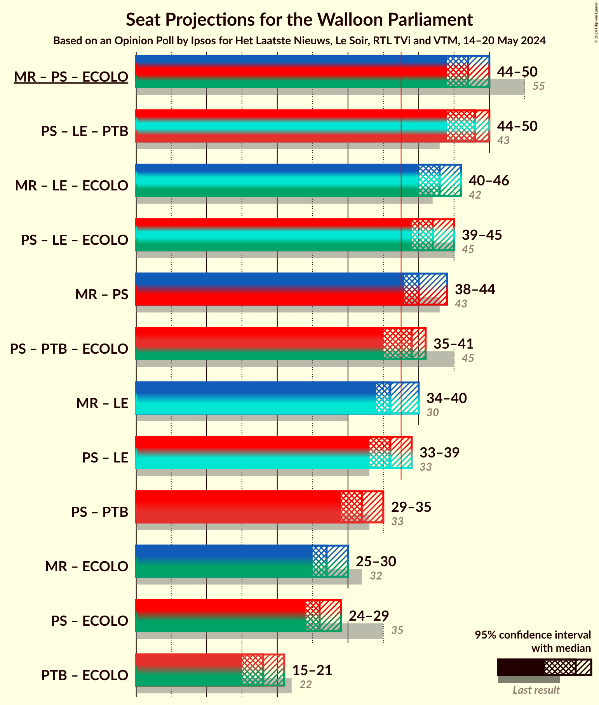

### Confidence Intervals

| Coalition | Last Result | Median | Majority? | 80% Confidence Interval | 90% Confidence Interval | 95% Confidence Interval | 99% Confidence Interval |
|:---------:|:-----------:|:------:|:---------:|:-----------------------:|:-----------------------:|:-----------------------:|:-----------------------:|
| Mouvement Réformateur – Parti Socialiste – Ecolo | 55 | 47 | 100% | 45–49 | 45–50 | 44–50 | 43–51 |
| Parti Socialiste – Les Engagés – Parti du Travail de Belgique | 43 | 48 | 100% | 46–49 | 45–50 | 44–50 | 43–51 |
| Mouvement Réformateur – Les Engagés – Ecolo | 42 | 43 | 100% | 41–45 | 41–46 | 40–46 | 39–47 |
| Parti Socialiste – Les Engagés – Ecolo | 45 | 42 | 99.9% | 40–44 | 40–45 | 39–45 | 38–46 |
| Mouvement Réformateur – Parti Socialiste | 43 | 40 | 98.7% | 39–43 | 38–44 | 38–44 | 37–44 |
| Parti Socialiste – Parti du Travail de Belgique – Ecolo | 45 | 39 | 70% | 36–40 | 35–41 | 35–41 | 34–42 |
| Mouvement Réformateur – Les Engagés | 30 | 36 | 25% | 35–39 | 34–40 | 34–40 | 33–41 |
| Parti Socialiste – Les Engagés | 33 | 36 | 14% | 34–38 | 33–38 | 33–39 | 32–40 |
| Parti Socialiste – Parti du Travail de Belgique | 33 | 32 | 0% | 29–34 | 29–34 | 29–35 | 27–36 |
| Mouvement Réformateur – Ecolo | 32 | 27 | 0% | 26–28 | 25–29 | 25–30 | 23–31 |
| Parti Socialiste – Ecolo | 35 | 26 | 0% | 25–28 | 24–28 | 24–29 | 23–30 |
| Parti du Travail de Belgique – Ecolo | 22 | 18 | 0% | 16–20 | 16–21 | 15–21 | 15–22 |

### Mouvement Réformateur – Parti Socialiste – Ecolo

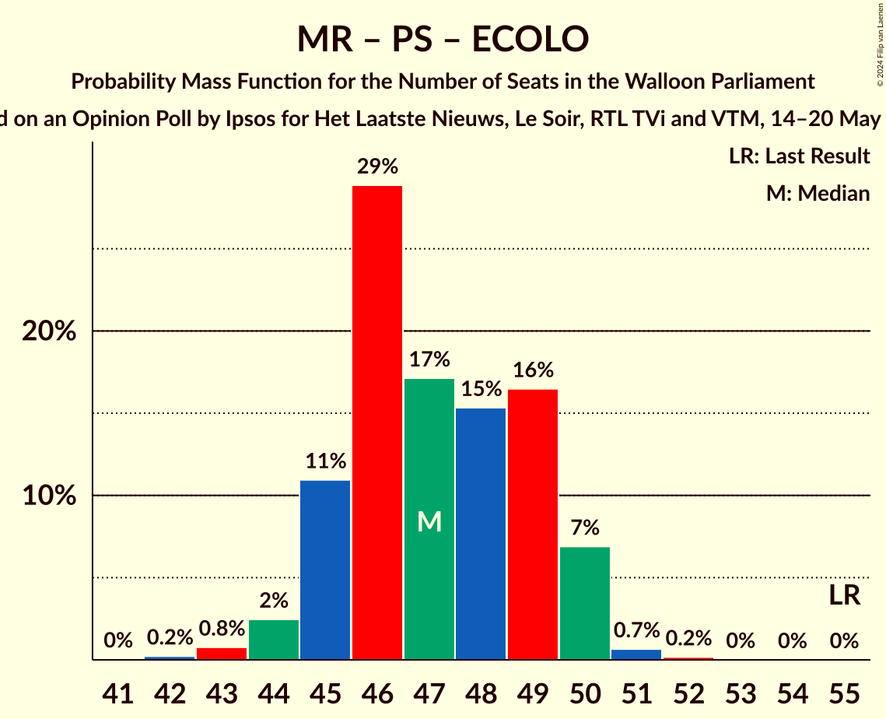

| Number of Seats | Probability | Accumulated | Special Marks |
|:---------------:|:-----------:|:-----------:|:-------------:|
| 41 | 0% | 100% |  |
| 42 | 0.2% | 99.9% |  |
| 43 | 0.8% | 99.7% |  |
| 44 | 2% | 99.0% |  |
| 45 | 11% | 96% |  |
| 46 | 29% | 86% |  |
| 47 | 17% | 57% | Median |
| 48 | 15% | 40% |  |
| 49 | 16% | 24% |  |
| 50 | 7% | 8% |  |
| 51 | 0.7% | 0.8% |  |
| 52 | 0.2% | 0.2% |  |
| 53 | 0% | 0% |  |
| 54 | 0% | 0% |  |
| 55 | 0% | 0% | Last Result |

### Parti Socialiste – Les Engagés – Parti du Travail de Belgique

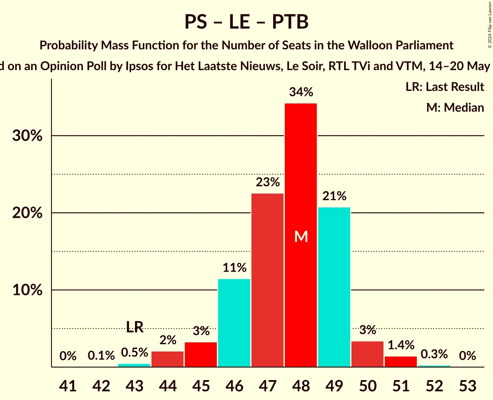

| Number of Seats | Probability | Accumulated | Special Marks |
|:---------------:|:-----------:|:-----------:|:-------------:|
| 42 | 0.1% | 100% |  |
| 43 | 0.5% | 99.9% | Last Result |
| 44 | 2% | 99.4% |  |
| 45 | 3% | 97% |  |
| 46 | 11% | 94% | Median |
| 47 | 23% | 83% |  |
| 48 | 34% | 60% |  |
| 49 | 21% | 26% |  |
| 50 | 3% | 5% |  |
| 51 | 1.4% | 2% |  |
| 52 | 0.3% | 0.3% |  |
| 53 | 0% | 0% |  |

### Mouvement Réformateur – Les Engagés – Ecolo

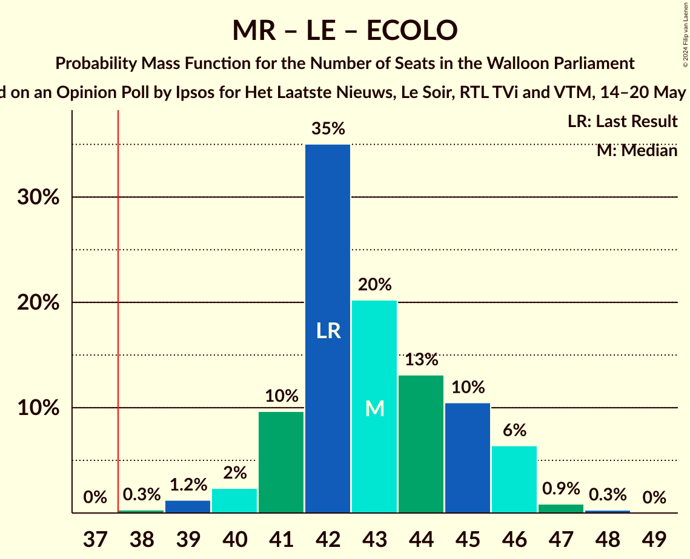

| Number of Seats | Probability | Accumulated | Special Marks |
|:---------------:|:-----------:|:-----------:|:-------------:|
| 38 | 0.3% | 100% | Majority |
| 39 | 1.2% | 99.6% |  |
| 40 | 2% | 98% |  |
| 41 | 10% | 96% |  |
| 42 | 35% | 86% | Last Result, Median |
| 43 | 20% | 51% |  |
| 44 | 13% | 31% |  |
| 45 | 10% | 18% |  |
| 46 | 6% | 8% |  |
| 47 | 0.9% | 1.1% |  |
| 48 | 0.3% | 0.3% |  |
| 49 | 0% | 0% |  |

### Parti Socialiste – Les Engagés – Ecolo

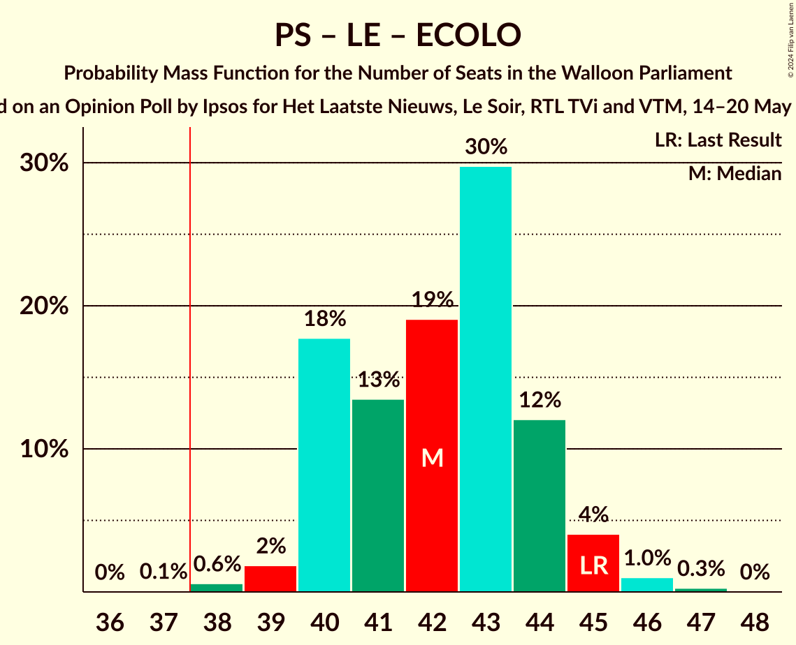

| Number of Seats | Probability | Accumulated | Special Marks |
|:---------------:|:-----------:|:-----------:|:-------------:|
| 37 | 0.1% | 100% |  |
| 38 | 0.6% | 99.9% | Majority |
| 39 | 2% | 99.3% |  |
| 40 | 18% | 97% |  |
| 41 | 13% | 80% | Median |
| 42 | 19% | 66% |  |
| 43 | 30% | 47% |  |
| 44 | 12% | 17% |  |
| 45 | 4% | 5% | Last Result |
| 46 | 1.0% | 1.3% |  |
| 47 | 0.3% | 0.3% |  |
| 48 | 0% | 0% |  |

### Mouvement Réformateur – Parti Socialiste

| Number of Seats | Probability | Accumulated | Special Marks |
|:---------------:|:-----------:|:-----------:|:-------------:|
| 35 | 0.1% | 100% |  |
| 36 | 0.3% | 99.9% |  |
| 37 | 0.9% | 99.6% |  |
| 38 | 5% | 98.7% | Majority |
| 39 | 11% | 93% |  |
| 40 | 33% | 82% |  |
| 41 | 17% | 50% | Median |
| 42 | 16% | 33% |  |
| 43 | 12% | 17% | Last Result |
| 44 | 5% | 6% |  |
| 45 | 0.4% | 0.5% |  |
| 46 | 0.1% | 0.1% |  |
| 47 | 0% | 0% |  |

### Parti Socialiste – Parti du Travail de Belgique – Ecolo

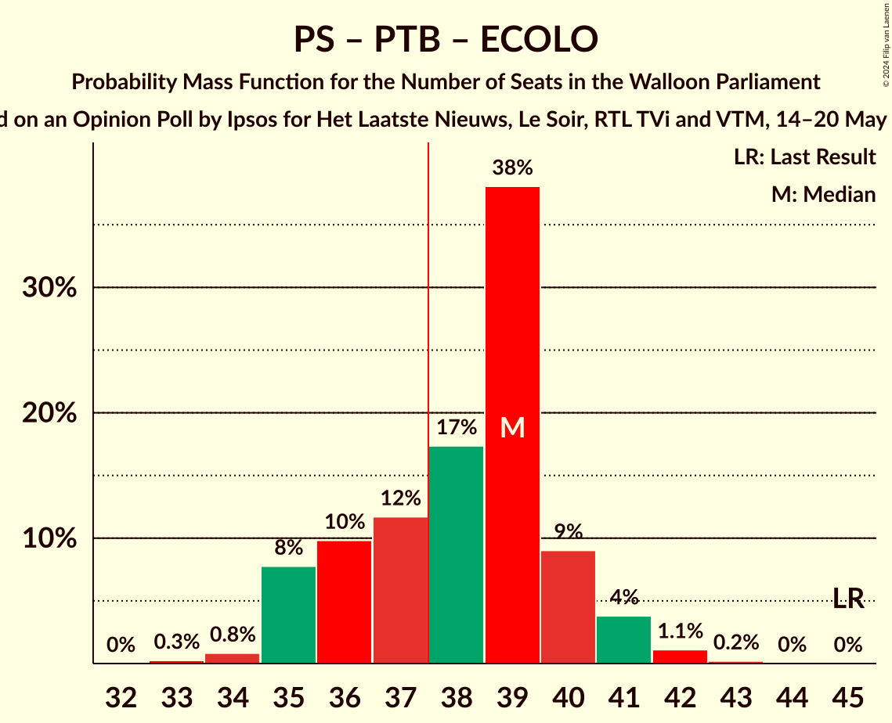

| Number of Seats | Probability | Accumulated | Special Marks |
|:---------------:|:-----------:|:-----------:|:-------------:|
| 33 | 0.3% | 100% |  |
| 34 | 0.8% | 99.7% |  |
| 35 | 8% | 98.9% |  |
| 36 | 10% | 91% |  |
| 37 | 12% | 81% | Median |
| 38 | 17% | 70% | Majority |
| 39 | 38% | 52% |  |
| 40 | 9% | 14% |  |
| 41 | 4% | 5% |  |
| 42 | 1.1% | 1.3% |  |
| 43 | 0.2% | 0.2% |  |
| 44 | 0% | 0% |  |
| 45 | 0% | 0% | Last Result |

### Mouvement Réformateur – Les Engagés

| Number of Seats | Probability | Accumulated | Special Marks |
|:---------------:|:-----------:|:-----------:|:-------------:|
| 30 | 0% | 100% | Last Result |
| 31 | 0% | 100% |  |
| 32 | 0.4% | 99.9% |  |
| 33 | 2% | 99.6% |  |
| 34 | 5% | 98% |  |
| 35 | 10% | 93% |  |
| 36 | 43% | 83% | Median |
| 37 | 16% | 41% |  |
| 38 | 10% | 25% | Majority |
| 39 | 8% | 14% |  |
| 40 | 5% | 6% |  |
| 41 | 0.4% | 0.5% |  |
| 42 | 0.1% | 0.1% |  |
| 43 | 0% | 0% |  |

### Parti Socialiste – Les Engagés

| Number of Seats | Probability | Accumulated | Special Marks |
|:---------------:|:-----------:|:-----------:|:-------------:|
| 31 | 0.1% | 100% |  |
| 32 | 1.0% | 99.9% |  |
| 33 | 4% | 98.9% | Last Result |
| 34 | 18% | 95% |  |
| 35 | 16% | 77% | Median |
| 36 | 28% | 62% |  |
| 37 | 20% | 34% |  |
| 38 | 11% | 14% | Majority |
| 39 | 3% | 3% |  |
| 40 | 0.5% | 0.7% |  |
| 41 | 0.2% | 0.2% |  |
| 42 | 0% | 0% |  |

### Parti Socialiste – Parti du Travail de Belgique

| Number of Seats | Probability | Accumulated | Special Marks |
|:---------------:|:-----------:|:-----------:|:-------------:|
| 27 | 0.5% | 100% |  |
| 28 | 1.3% | 99.4% |  |
| 29 | 9% | 98% |  |
| 30 | 12% | 89% |  |
| 31 | 15% | 77% | Median |
| 32 | 20% | 62% |  |
| 33 | 31% | 43% | Last Result |
| 34 | 8% | 11% |  |
| 35 | 2% | 3% |  |
| 36 | 0.8% | 1.0% |  |
| 37 | 0.2% | 0.2% |  |
| 38 | 0% | 0% | Majority |

### Mouvement Réformateur – Ecolo

| Number of Seats | Probability | Accumulated | Special Marks |
|:---------------:|:-----------:|:-----------:|:-------------:|
| 22 | 0.1% | 100% |  |
| 23 | 0.5% | 99.9% |  |
| 24 | 2% | 99.4% |  |
| 25 | 4% | 98% |  |
| 26 | 23% | 94% |  |
| 27 | 38% | 70% | Median |
| 28 | 22% | 32% |  |
| 29 | 7% | 10% |  |
| 30 | 2% | 3% |  |
| 31 | 1.1% | 1.3% |  |
| 32 | 0.2% | 0.3% | Last Result |
| 33 | 0% | 0% |  |

### Parti Socialiste – Ecolo

| Number of Seats | Probability | Accumulated | Special Marks |
|:---------------:|:-----------:|:-----------:|:-------------:|
| 22 | 0% | 100% |  |
| 23 | 2% | 99.9% |  |
| 24 | 4% | 98% |  |
| 25 | 34% | 95% |  |
| 26 | 17% | 61% | Median |
| 27 | 16% | 44% |  |
| 28 | 24% | 28% |  |
| 29 | 3% | 4% |  |
| 30 | 1.1% | 1.3% |  |
| 31 | 0.2% | 0.3% |  |
| 32 | 0% | 0% |  |
| 33 | 0% | 0% |  |
| 34 | 0% | 0% |  |
| 35 | 0% | 0% | Last Result |

### Parti du Travail de Belgique – Ecolo

| Number of Seats | Probability | Accumulated | Special Marks |
|:---------------:|:-----------:|:-----------:|:-------------:|
| 14 | 0.3% | 100% |  |
| 15 | 2% | 99.7% |  |
| 16 | 17% | 97% |  |
| 17 | 22% | 80% | Median |
| 18 | 19% | 58% |  |
| 19 | 10% | 39% |  |
| 20 | 23% | 29% |  |
| 21 | 5% | 6% |  |
| 22 | 0.8% | 1.1% | Last Result |
| 23 | 0.2% | 0.3% |  |
| 24 | 0% | 0% |  |

## Technical Information

### Opinion Poll

+ **Polling firm:** Ipsos
+ **Commissioner(s):** Het Laatste Nieuws, Le Soir, RTL TVi and VTM
+ **Fieldwork period:** 14–20 May 2024

### Calculations

+ **Sample size:** 1000
+ **Simulations done:** 2,097,152
+ **Error estimate:** 0.58%

