# Opinion Poll by Cluster17 for RTL TVi, 28–31 May 2024

<a href="#voting-intentions">Voting Intentions</a> | <a href="#seats">Seats</a> | <a href="#coalitions">Coalitions</a> | <a href="#technical-information">Technical Information</a>

## Voting Intentions

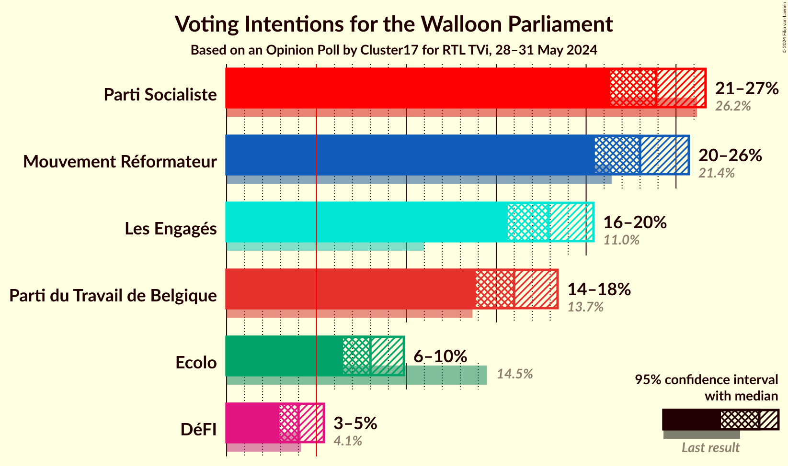

### Confidence Intervals

| Party | Last Result | Poll Result | 80% Confidence Interval | 90% Confidence Interval | 95% Confidence Interval | 99% Confidence Interval |
|:-----:|:-----------:|:-----------:|:-----------------------:|:-----------------------:|:-----------------------:|:-----------------------:|
| Parti Socialiste | 26.2% | 23.9% | 22.2–25.7% |21.8–26.2% |21.4–26.6% |20.6–27.5% |
| Mouvement Réformateur | 21.4% | 23.0% | 21.4–24.8% |20.9–25.3% |20.5–25.7% |19.7–26.6% |
| Les Engagés | 11.0% | 17.9% | 16.4–19.5% |16.0–20.0% |15.6–20.4% |15.0–21.2% |
| Parti du Travail de Belgique | 13.7% | 16.0% | 14.6–17.6% |14.2–18.0% |13.9–18.4% |13.2–19.2% |
| Ecolo | 14.5% | 8.0% | 7.0–9.2% |6.7–9.6% |6.5–9.9% |6.0–10.5% |
| DéFI | 4.1% | 4.0% | 3.3–4.9% |3.1–5.2% |2.9–5.4% |2.7–5.9% |

*Note:* The poll result column reflects the actual value used in the calculations. Published results may vary slightly, and in addition be rounded to fewer digits.

## Seats

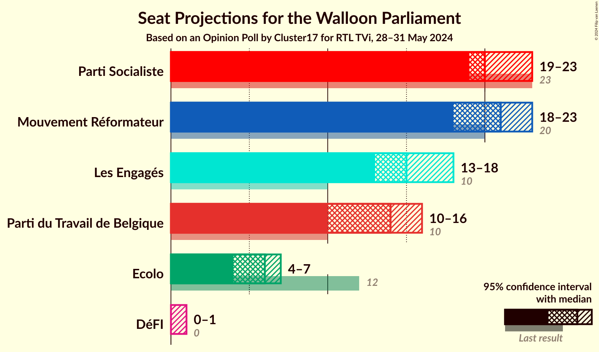

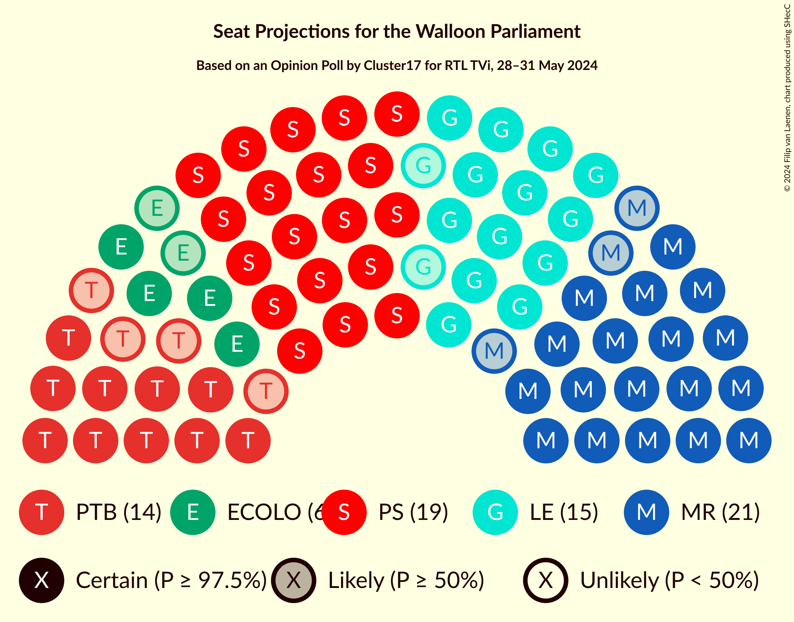

### Confidence Intervals

| Party | Last Result | Median | 80% Confidence Interval | 90% Confidence Interval | 95% Confidence Interval | 99% Confidence Interval |
|:-----:|:-----------:|:------:|:-----------------------:|:-----------------------:|:-----------------------:|:-----------------------:|
| <a href="#parti-socialiste">Parti Socialiste</a> | 23 | 20 | 19–22 |19–23 |19–23 |17–24 |
| <a href="#mouvement-réformateur">Mouvement Réformateur</a> | 20 | 21 | 19–21 |18–22 |18–23 |17–24 |
| <a href="#les-engagés">Les Engagés</a> | 10 | 15 | 14–16 |14–17 |13–18 |11–19 |
| <a href="#parti-du-travail-de-belgique">Parti du Travail de Belgique</a> | 10 | 14 | 11–15 |10–15 |10–16 |10–17 |
| <a href="#ecolo">Ecolo</a> | 12 | 6 | 5–6 |4–6 |4–7 |2–7 |
| <a href="#défi">DéFI</a> | 0 | 0 | 0 |0 |0–1 |0–3 |

### Parti Socialiste

*For a full overview of the results for this party, see the [Parti Socialiste](party-partisocialiste.html) page.*

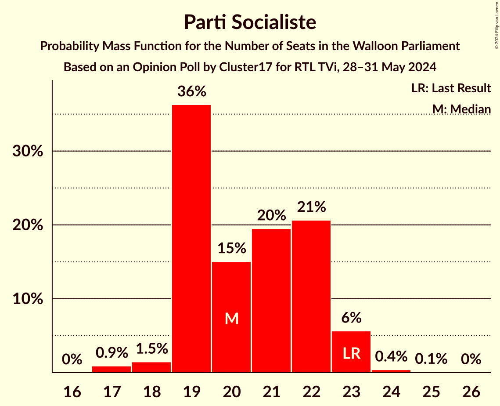

| Number of Seats | Probability | Accumulated | Special Marks |
|:---------------:|:-----------:|:-----------:|:-------------:|
| 17 | 0.9% | 100% |  |
| 18 | 1.5% | 99.1% |  |
| 19 | 36% | 98% |  |
| 20 | 15% | 61% | Median |
| 21 | 20% | 46% |  |
| 22 | 21% | 27% |  |
| 23 | 6% | 6% | Last Result |
| 24 | 0.4% | 0.5% |  |
| 25 | 0.1% | 0.1% |  |
| 26 | 0% | 0% |  |

### Mouvement Réformateur

*For a full overview of the results for this party, see the [Mouvement Réformateur](party-mouvementréformateur.html) page.*

| Number of Seats | Probability | Accumulated | Special Marks |
|:---------------:|:-----------:|:-----------:|:-------------:|
| 16 | 0.1% | 100% |  |
| 17 | 0.6% | 99.9% |  |
| 18 | 5% | 99.2% |  |
| 19 | 8% | 94% |  |
| 20 | 27% | 86% | Last Result |
| 21 | 52% | 60% | Median |
| 22 | 5% | 7% |  |
| 23 | 2% | 3% |  |
| 24 | 0.4% | 0.7% |  |
| 25 | 0.3% | 0.3% |  |
| 26 | 0% | 0% |  |

### Les Engagés

*For a full overview of the results for this party, see the [Les Engagés](party-lesengagés.html) page.*

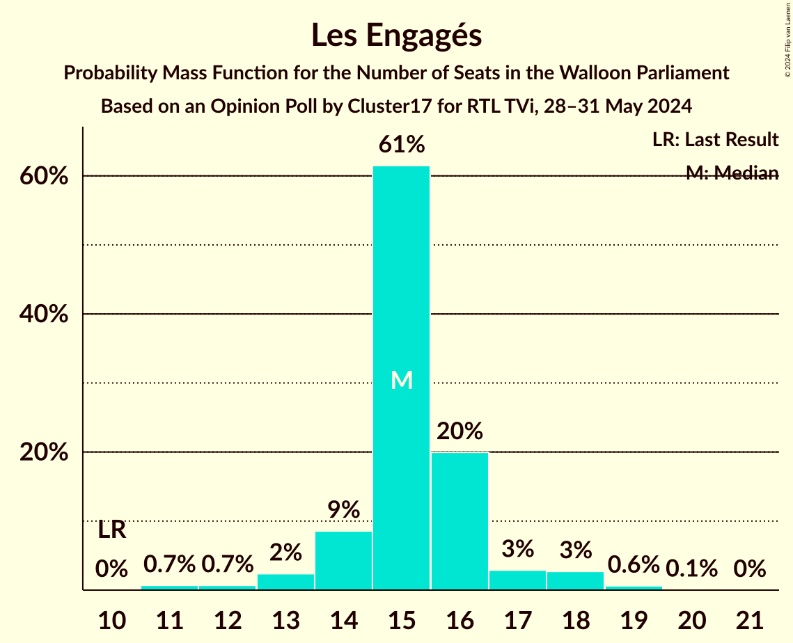

| Number of Seats | Probability | Accumulated | Special Marks |
|:---------------:|:-----------:|:-----------:|:-------------:|
| 10 | 0% | 100% | Last Result |
| 11 | 0.7% | 100% |  |
| 12 | 0.7% | 99.3% |  |
| 13 | 2% | 98.6% |  |
| 14 | 9% | 96% |  |
| 15 | 61% | 88% | Median |
| 16 | 20% | 26% |  |
| 17 | 3% | 6% |  |
| 18 | 3% | 3% |  |
| 19 | 0.6% | 0.7% |  |
| 20 | 0.1% | 0.1% |  |
| 21 | 0% | 0% |  |

### Parti du Travail de Belgique

*For a full overview of the results for this party, see the [Parti du Travail de Belgique](party-partidutravaildebelgique.html) page.*

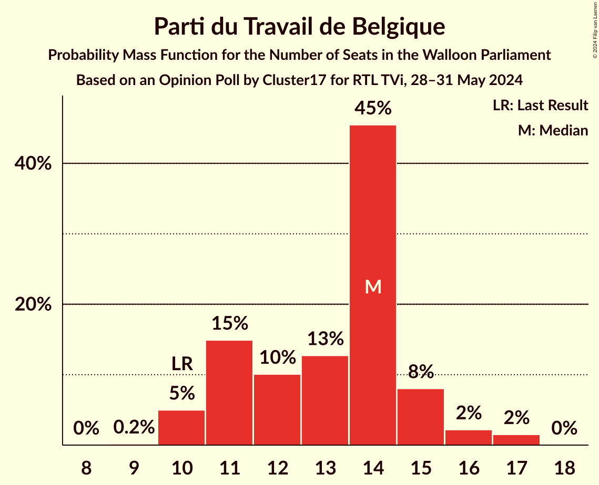

| Number of Seats | Probability | Accumulated | Special Marks |
|:---------------:|:-----------:|:-----------:|:-------------:|
| 9 | 0.2% | 100% |  |
| 10 | 5% | 99.8% | Last Result |
| 11 | 15% | 95% |  |
| 12 | 10% | 80% |  |
| 13 | 13% | 70% |  |
| 14 | 45% | 57% | Median |
| 15 | 8% | 12% |  |
| 16 | 2% | 4% |  |
| 17 | 2% | 2% |  |
| 18 | 0% | 0% |  |

### Ecolo

*For a full overview of the results for this party, see the [Ecolo](party-ecolo.html) page.*

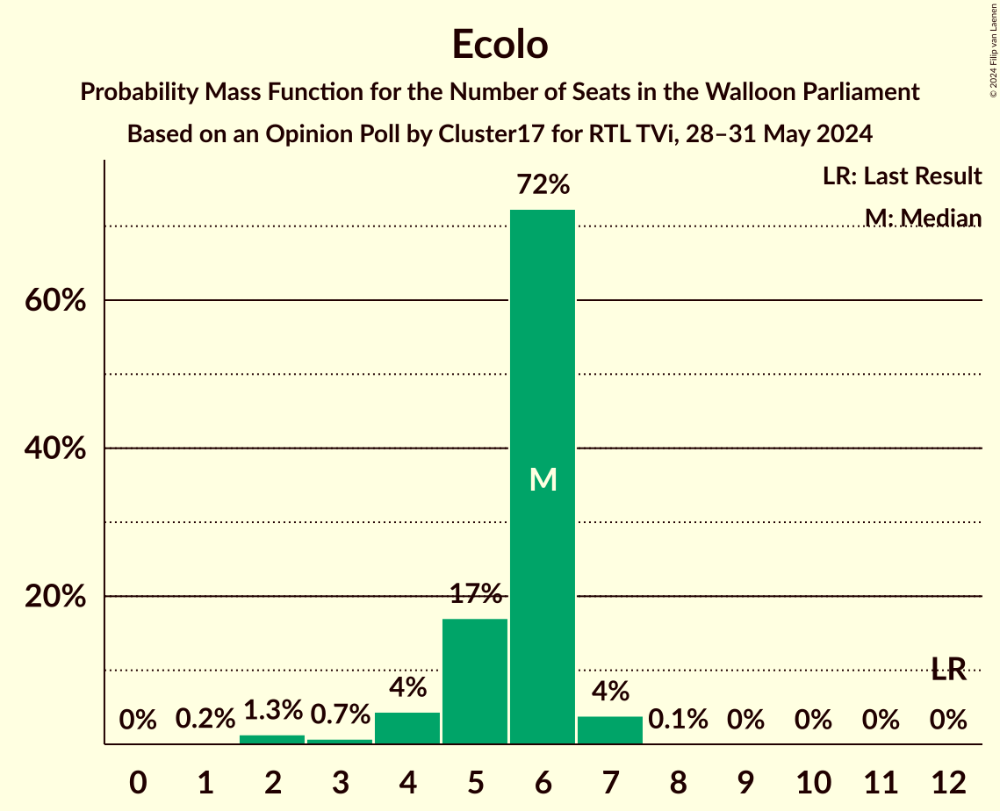

| Number of Seats | Probability | Accumulated | Special Marks |
|:---------------:|:-----------:|:-----------:|:-------------:|
| 1 | 0.2% | 100% |  |
| 2 | 1.3% | 99.8% |  |
| 3 | 0.7% | 98% |  |
| 4 | 4% | 98% |  |
| 5 | 17% | 93% |  |
| 6 | 72% | 76% | Median |
| 7 | 4% | 4% |  |
| 8 | 0.1% | 0.1% |  |
| 9 | 0% | 0% |  |
| 10 | 0% | 0% |  |
| 11 | 0% | 0% |  |
| 12 | 0% | 0% | Last Result |

### DéFI

*For a full overview of the results for this party, see the [DéFI](party-défi.html) page.*

| Number of Seats | Probability | Accumulated | Special Marks |
|:---------------:|:-----------:|:-----------:|:-------------:|
| 0 | 97% | 100% | Last Result, Median |
| 1 | 1.2% | 3% |  |
| 2 | 0.6% | 2% |  |
| 3 | 0.8% | 1.0% |  |
| 4 | 0.1% | 0.1% |  |
| 5 | 0% | 0% |  |

## Coalitions

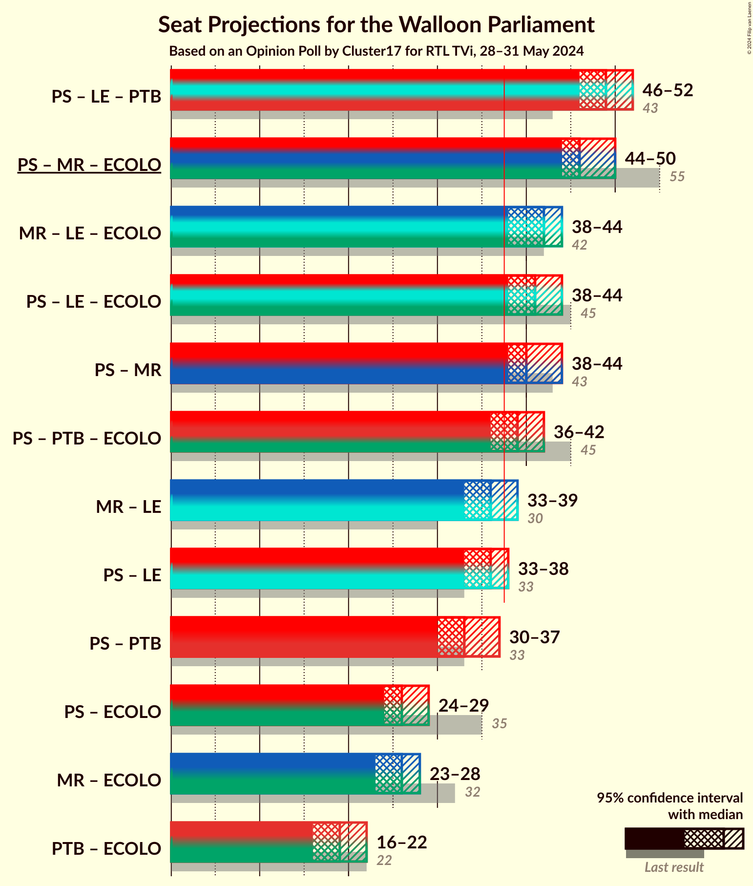

### Confidence Intervals

| Coalition | Last Result | Median | Majority? | 80% Confidence Interval | 90% Confidence Interval | 95% Confidence Interval | 99% Confidence Interval |
|:---------:|:-----------:|:------:|:---------:|:-----------------------:|:-----------------------:|:-----------------------:|:-----------------------:|
| Parti Socialiste – Les Engagés – Parti du Travail de Belgique | 43 | 49 | 100% | 48–50 | 47–51 | 46–52 | 45–52 |
| Parti Socialiste – Mouvement Réformateur – Ecolo | 55 | 46 | 100% | 45–49 | 45–49 | 44–50 | 43–50 |
| Mouvement Réformateur – Les Engagés – Ecolo | 42 | 42 | 99.0% | 39–43 | 39–44 | 38–44 | 37–46 |
| Parti Socialiste – Les Engagés – Ecolo | 45 | 41 | 99.3% | 40–43 | 39–44 | 38–44 | 37–45 |
| Parti Socialiste – Mouvement Réformateur | 43 | 40 | 99.2% | 39–43 | 39–43 | 38–44 | 37–45 |
| Parti Socialiste – Parti du Travail de Belgique – Ecolo | 45 | 39 | 92% | 38–41 | 37–42 | 36–42 | 35–43 |
| Mouvement Réformateur – Les Engagés | 30 | 36 | 7% | 34–37 | 33–38 | 33–39 | 32–40 |
| Parti Socialiste – Les Engagés | 33 | 36 | 12% | 34–38 | 33–38 | 33–38 | 32–39 |
| Parti Socialiste – Parti du Travail de Belgique | 33 | 33 | 0.9% | 32–36 | 31–36 | 30–37 | 29–38 |
| Parti Socialiste – Ecolo | 35 | 26 | 0% | 25–28 | 24–28 | 24–29 | 23–30 |
| Mouvement Réformateur – Ecolo | 32 | 26 | 0% | 24–27 | 24–28 | 23–28 | 22–29 |
| Parti du Travail de Belgique – Ecolo | 22 | 19 | 0% | 17–21 | 16–21 | 16–22 | 15–23 |

### Parti Socialiste – Les Engagés – Parti du Travail de Belgique

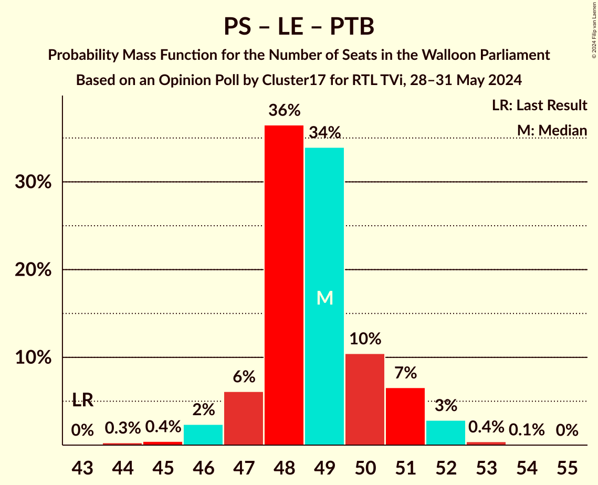

| Number of Seats | Probability | Accumulated | Special Marks |
|:---------------:|:-----------:|:-----------:|:-------------:|
| 43 | 0% | 100% | Last Result |
| 44 | 0.3% | 100% |  |
| 45 | 0.4% | 99.7% |  |
| 46 | 2% | 99.3% |  |
| 47 | 6% | 97% |  |
| 48 | 36% | 91% |  |
| 49 | 34% | 54% | Median |
| 50 | 10% | 20% |  |
| 51 | 7% | 10% |  |
| 52 | 3% | 3% |  |
| 53 | 0.4% | 0.5% |  |
| 54 | 0.1% | 0.1% |  |
| 55 | 0% | 0% |  |

### Parti Socialiste – Mouvement Réformateur – Ecolo

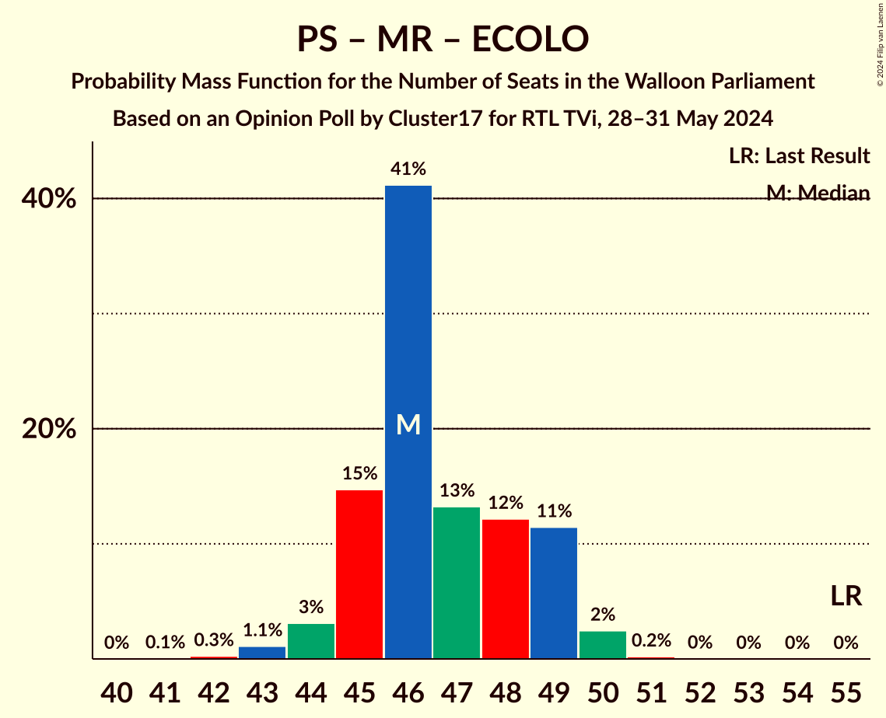

| Number of Seats | Probability | Accumulated | Special Marks |
|:---------------:|:-----------:|:-----------:|:-------------:|
| 41 | 0.1% | 100% |  |
| 42 | 0.3% | 99.9% |  |
| 43 | 1.1% | 99.7% |  |
| 44 | 3% | 98.6% |  |
| 45 | 15% | 95% |  |
| 46 | 41% | 81% |  |
| 47 | 13% | 40% | Median |
| 48 | 12% | 26% |  |
| 49 | 11% | 14% |  |
| 50 | 2% | 3% |  |
| 51 | 0.2% | 0.3% |  |
| 52 | 0% | 0.1% |  |
| 53 | 0% | 0% |  |
| 54 | 0% | 0% |  |
| 55 | 0% | 0% | Last Result |

### Mouvement Réformateur – Les Engagés – Ecolo

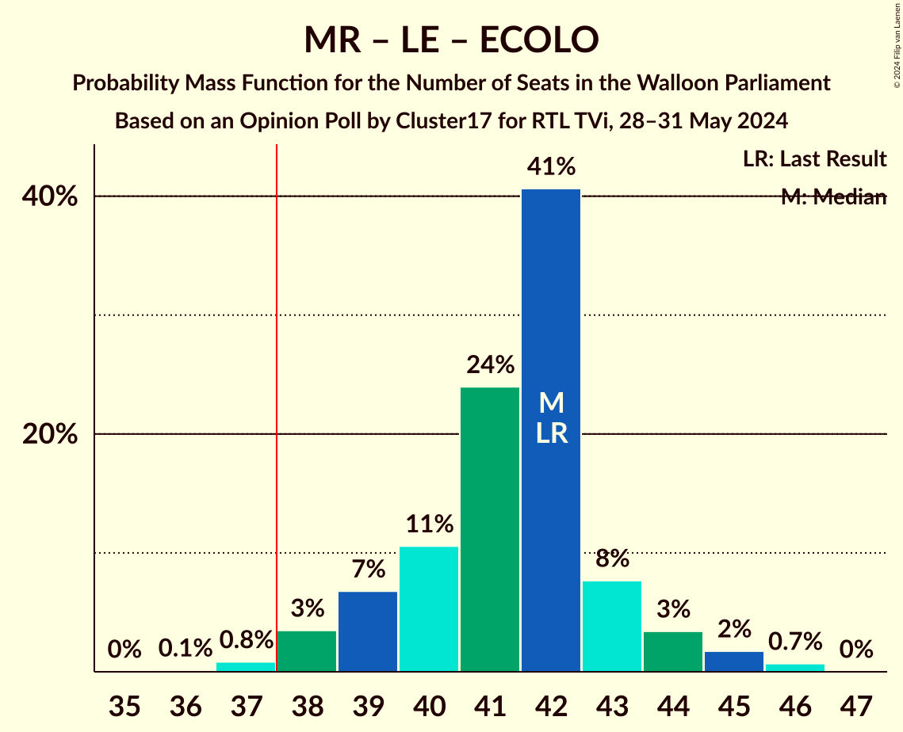

| Number of Seats | Probability | Accumulated | Special Marks |
|:---------------:|:-----------:|:-----------:|:-------------:|
| 36 | 0.1% | 100% |  |
| 37 | 0.8% | 99.8% |  |
| 38 | 3% | 99.0% | Majority |
| 39 | 7% | 96% |  |
| 40 | 11% | 89% |  |
| 41 | 24% | 78% |  |
| 42 | 41% | 54% | Last Result, Median |
| 43 | 8% | 14% |  |
| 44 | 3% | 6% |  |
| 45 | 2% | 2% |  |
| 46 | 0.7% | 0.7% |  |
| 47 | 0% | 0% |  |

### Parti Socialiste – Les Engagés – Ecolo

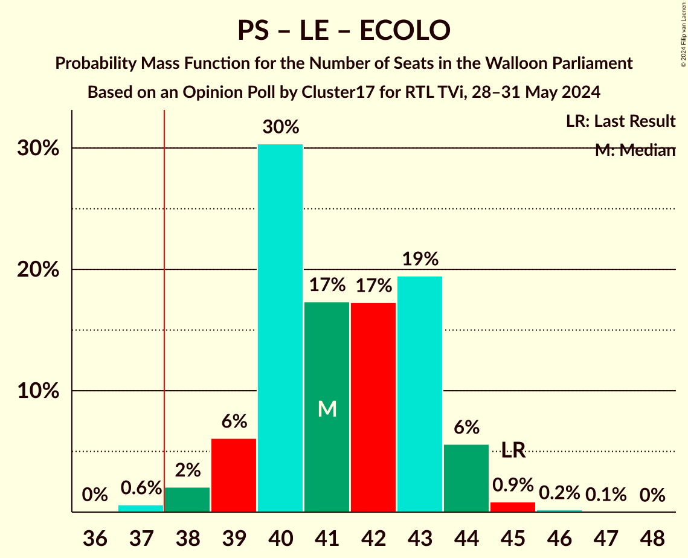

| Number of Seats | Probability | Accumulated | Special Marks |
|:---------------:|:-----------:|:-----------:|:-------------:|
| 36 | 0% | 100% |  |
| 37 | 0.6% | 99.9% |  |
| 38 | 2% | 99.3% | Majority |
| 39 | 6% | 97% |  |
| 40 | 30% | 91% |  |
| 41 | 17% | 61% | Median |
| 42 | 17% | 43% |  |
| 43 | 19% | 26% |  |
| 44 | 6% | 7% |  |
| 45 | 0.9% | 1.1% | Last Result |
| 46 | 0.2% | 0.3% |  |
| 47 | 0.1% | 0.1% |  |
| 48 | 0% | 0% |  |

### Parti Socialiste – Mouvement Réformateur

| Number of Seats | Probability | Accumulated | Special Marks |
|:---------------:|:-----------:|:-----------:|:-------------:|
| 36 | 0.1% | 100% |  |
| 37 | 0.6% | 99.8% |  |
| 38 | 3% | 99.2% | Majority |
| 39 | 9% | 96% |  |
| 40 | 38% | 87% |  |
| 41 | 16% | 49% | Median |
| 42 | 15% | 33% |  |
| 43 | 14% | 18% | Last Result |
| 44 | 4% | 4% |  |
| 45 | 0.5% | 0.7% |  |
| 46 | 0.1% | 0.1% |  |
| 47 | 0% | 0% |  |

### Parti Socialiste – Parti du Travail de Belgique – Ecolo

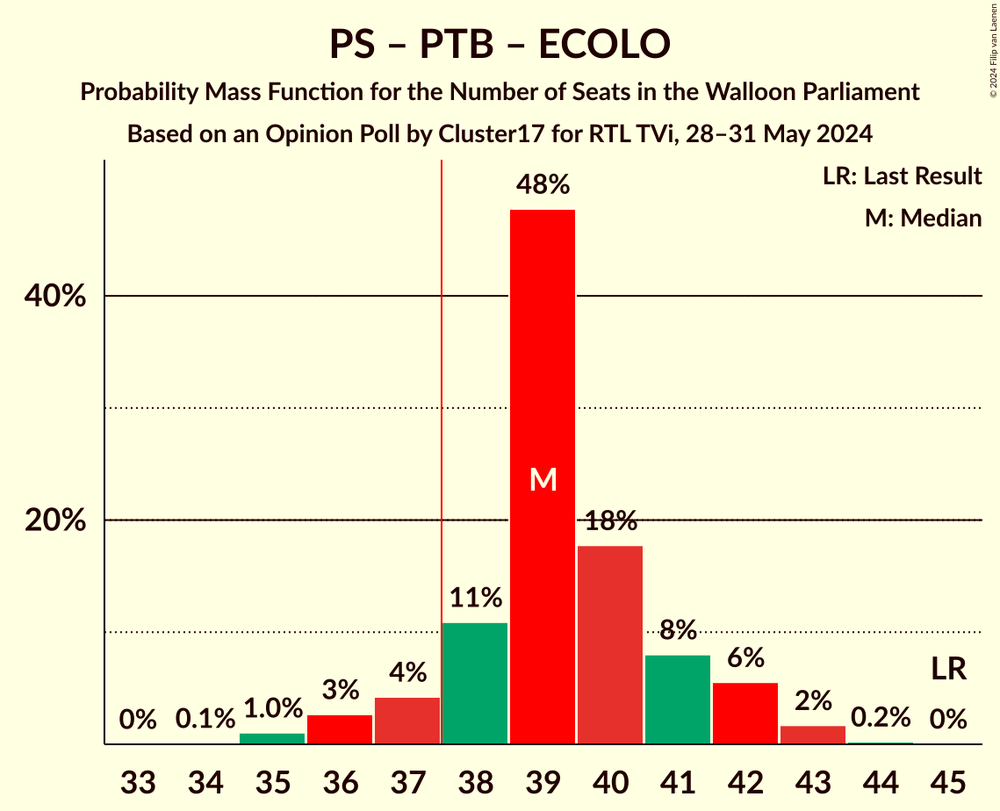

| Number of Seats | Probability | Accumulated | Special Marks |
|:---------------:|:-----------:|:-----------:|:-------------:|
| 34 | 0.1% | 100% |  |
| 35 | 1.0% | 99.9% |  |
| 36 | 3% | 98.8% |  |
| 37 | 4% | 96% |  |
| 38 | 11% | 92% | Majority |
| 39 | 48% | 81% |  |
| 40 | 18% | 33% | Median |
| 41 | 8% | 16% |  |
| 42 | 6% | 8% |  |
| 43 | 2% | 2% |  |
| 44 | 0.2% | 0.3% |  |
| 45 | 0% | 0% | Last Result |

### Mouvement Réformateur – Les Engagés

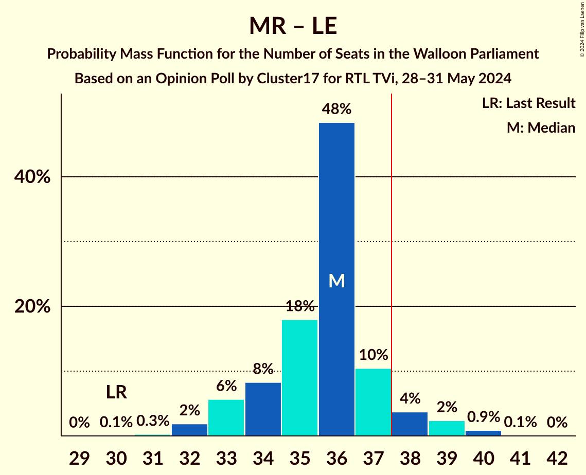

| Number of Seats | Probability | Accumulated | Special Marks |
|:---------------:|:-----------:|:-----------:|:-------------:|
| 30 | 0.1% | 100% | Last Result |
| 31 | 0.3% | 99.9% |  |
| 32 | 2% | 99.7% |  |
| 33 | 6% | 98% |  |
| 34 | 8% | 92% |  |
| 35 | 18% | 84% |  |
| 36 | 48% | 66% | Median |
| 37 | 10% | 17% |  |
| 38 | 4% | 7% | Majority |
| 39 | 2% | 3% |  |
| 40 | 0.9% | 1.0% |  |
| 41 | 0.1% | 0.1% |  |
| 42 | 0% | 0% |  |

### Parti Socialiste – Les Engagés

| Number of Seats | Probability | Accumulated | Special Marks |
|:---------------:|:-----------:|:-----------:|:-------------:|
| 31 | 0.2% | 100% |  |
| 32 | 2% | 99.7% |  |
| 33 | 5% | 98% | Last Result |
| 34 | 23% | 93% |  |
| 35 | 20% | 71% | Median |
| 36 | 21% | 51% |  |
| 37 | 18% | 30% |  |
| 38 | 10% | 12% | Majority |
| 39 | 1.4% | 2% |  |
| 40 | 0.3% | 0.5% |  |
| 41 | 0.1% | 0.1% |  |
| 42 | 0% | 0% |  |

### Parti Socialiste – Parti du Travail de Belgique

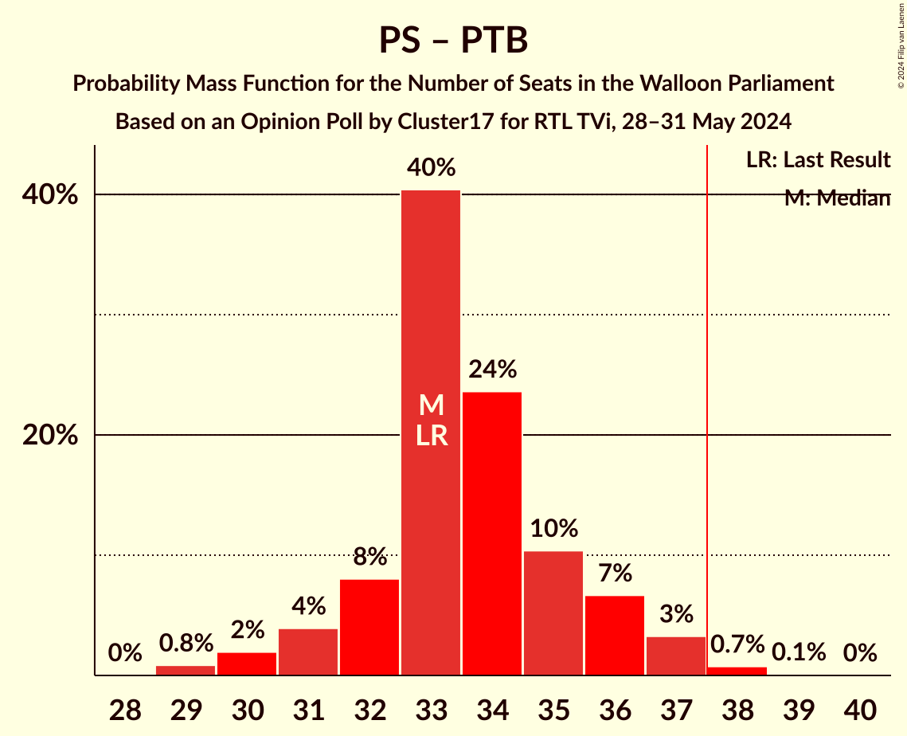

| Number of Seats | Probability | Accumulated | Special Marks |
|:---------------:|:-----------:|:-----------:|:-------------:|
| 29 | 0.8% | 100% |  |
| 30 | 2% | 99.1% |  |
| 31 | 4% | 97% |  |
| 32 | 8% | 93% |  |
| 33 | 40% | 85% | Last Result |
| 34 | 24% | 45% | Median |
| 35 | 10% | 21% |  |
| 36 | 7% | 11% |  |
| 37 | 3% | 4% |  |
| 38 | 0.7% | 0.9% | Majority |
| 39 | 0.1% | 0.1% |  |
| 40 | 0% | 0% |  |

### Parti Socialiste – Ecolo

| Number of Seats | Probability | Accumulated | Special Marks |
|:---------------:|:-----------:|:-----------:|:-------------:|
| 21 | 0.1% | 100% |  |
| 22 | 0.4% | 99.9% |  |
| 23 | 1.4% | 99.5% |  |
| 24 | 6% | 98% |  |
| 25 | 39% | 92% |  |
| 26 | 14% | 53% | Median |
| 27 | 16% | 39% |  |
| 28 | 20% | 23% |  |
| 29 | 3% | 3% |  |
| 30 | 0.4% | 0.5% |  |
| 31 | 0.1% | 0.1% |  |
| 32 | 0% | 0% |  |
| 33 | 0% | 0% |  |
| 34 | 0% | 0% |  |
| 35 | 0% | 0% | Last Result |

### Mouvement Réformateur – Ecolo

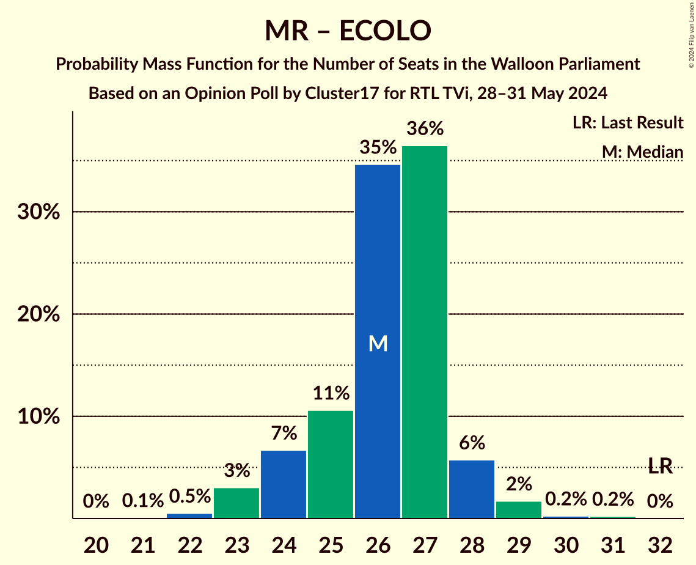

| Number of Seats | Probability | Accumulated | Special Marks |
|:---------------:|:-----------:|:-----------:|:-------------:|
| 21 | 0.1% | 100% |  |
| 22 | 0.5% | 99.9% |  |
| 23 | 3% | 99.4% |  |
| 24 | 7% | 96% |  |
| 25 | 11% | 90% |  |
| 26 | 35% | 79% |  |
| 27 | 36% | 44% | Median |
| 28 | 6% | 8% |  |
| 29 | 2% | 2% |  |
| 30 | 0.2% | 0.5% |  |
| 31 | 0.2% | 0.2% |  |
| 32 | 0% | 0% | Last Result |

### Parti du Travail de Belgique – Ecolo

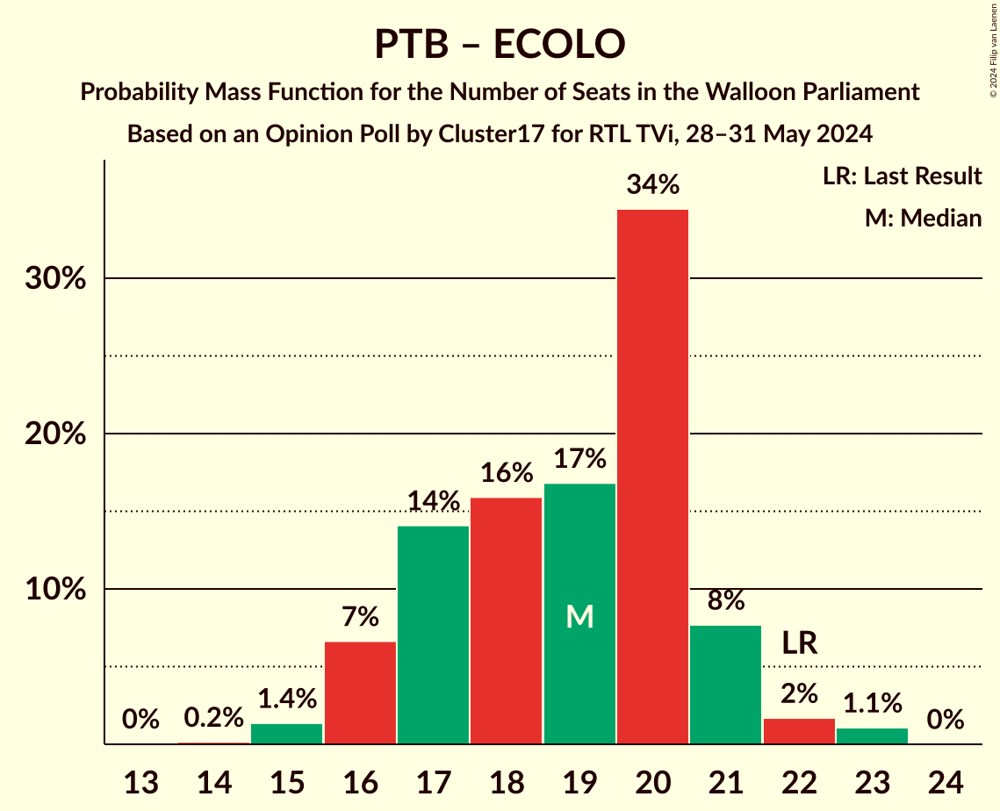

| Number of Seats | Probability | Accumulated | Special Marks |
|:---------------:|:-----------:|:-----------:|:-------------:|
| 13 | 0% | 100% |  |
| 14 | 0.2% | 99.9% |  |
| 15 | 1.4% | 99.8% |  |
| 16 | 7% | 98% |  |
| 17 | 14% | 92% |  |
| 18 | 16% | 78% |  |
| 19 | 17% | 62% |  |
| 20 | 34% | 45% | Median |
| 21 | 8% | 10% |  |
| 22 | 2% | 3% | Last Result |
| 23 | 1.1% | 1.1% |  |
| 24 | 0% | 0% |  |

## Technical Information

### Opinion Poll

+ **Polling firm:** Cluster17
+ **Commissioner(s):** RTL TVi
+ **Fieldwork period:** 28–31 May 2024

### Calculations

+ **Sample size:** 1000
+ **Simulations done:** 2,097,152
+ **Error estimate:** 0.82%

