# Opinion Poll by Bpact and Universiteit Antwerpen & ULB for De Standaard, RTBF and VRT, 3–24 March 2025

<a href="#voting-intentions">Voting Intentions</a> | <a href="#seats">Seats</a> | <a href="#coalitions">Coalitions</a> | <a href="#technical-information">Technical Information</a>

## Voting Intentions

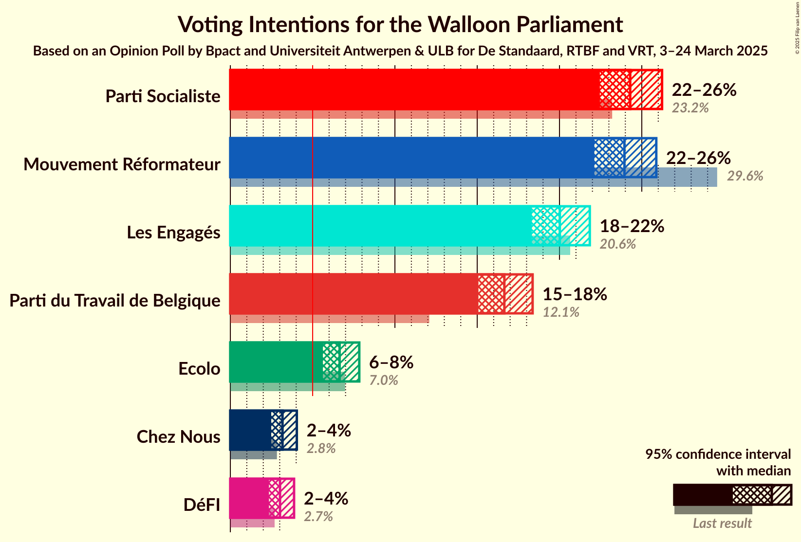

### Confidence Intervals

| Party | Last Result | Poll Result | 80% Confidence Interval | 90% Confidence Interval | 95% Confidence Interval | 99% Confidence Interval |
|:-----:|:-----------:|:-----------:|:-----------------------:|:-----------------------:|:-----------------------:|:-----------------------:|
| Parti Socialiste | 23.2% | 24.3% | 23.1–25.6% |22.7–25.9% |22.5–26.2% |21.9–26.9% |
| Mouvement Réformateur | 29.6% | 23.9% | 22.7–25.2% |22.4–25.6% |22.1–25.9% |21.6–26.5% |
| Les Engagés | 20.6% | 20.0% | 18.9–21.2% |18.6–21.6% |18.3–21.8% |17.8–22.4% |
| Parti du Travail de Belgique | 12.1% | 16.6% | 15.6–17.8% |15.3–18.1% |15.1–18.4% |14.6–18.9% |
| Ecolo | 7.0% | 6.6% | 6.0–7.4% |5.8–7.6% |5.6–7.8% |5.3–8.2% |
| Chez Nous | 2.8% | 3.2% | 2.7–3.7% |2.6–3.9% |2.5–4.0% |2.3–4.3% |
| DéFI | 2.7% | 3.0% | 2.6–3.6% |2.5–3.7% |2.3–3.9% |2.1–4.2% |

*Note:* The poll result column reflects the actual value used in the calculations. Published results may vary slightly, and in addition be rounded to fewer digits.

## Seats

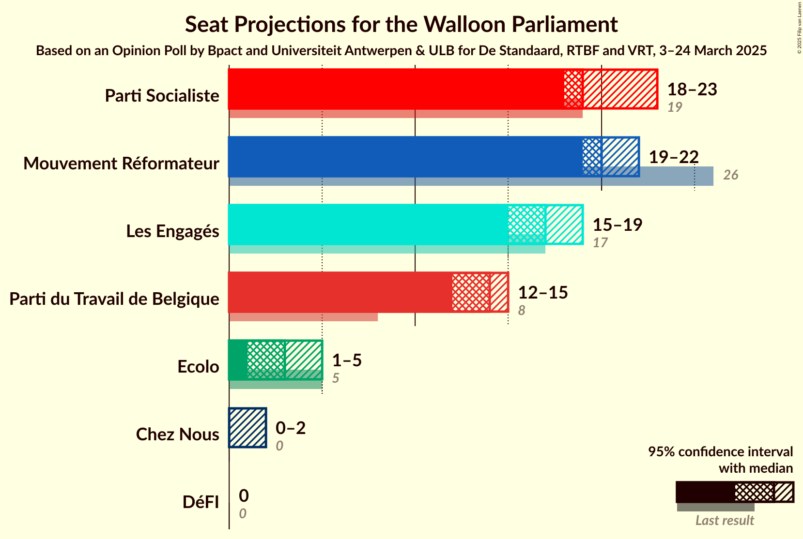

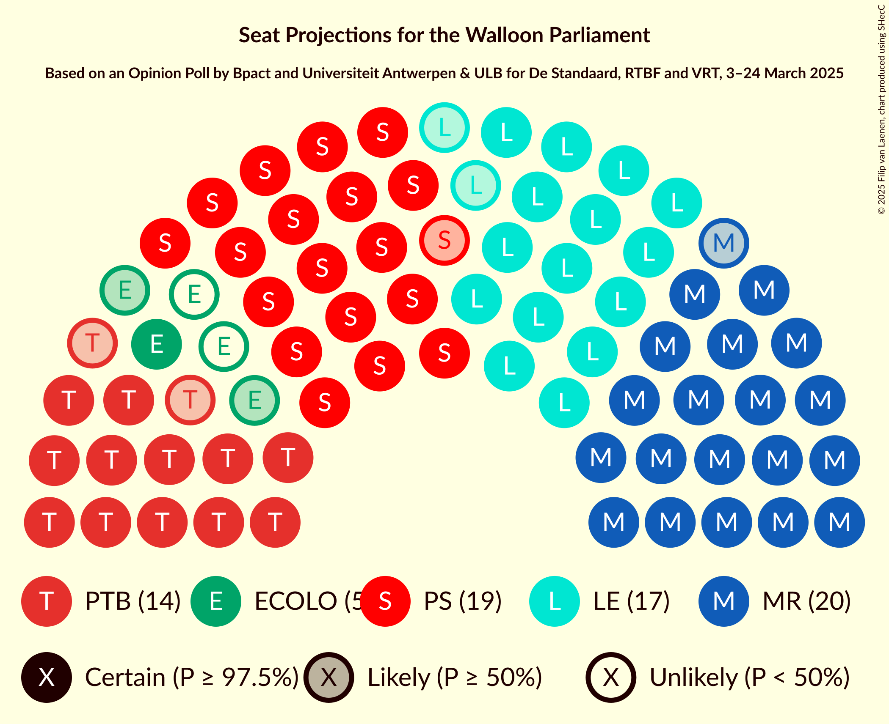

### Confidence Intervals

| Party | Last Result | Median | 80% Confidence Interval | 90% Confidence Interval | 95% Confidence Interval | 99% Confidence Interval |
|:-----:|:-----------:|:------:|:-----------------------:|:-----------------------:|:-----------------------:|:-----------------------:|
| <a href="#parti-socialiste">Parti Socialiste</a> | 19 | 19 | 19–22 |18–23 |18–23 |18–23 |
| <a href="#mouvement-réformateur">Mouvement Réformateur</a> | 26 | 20 | 19–21 |19–22 |19–22 |18–24 |
| <a href="#les-engagés">Les Engagés</a> | 17 | 17 | 15–19 |15–19 |15–19 |15–20 |
| <a href="#parti-du-travail-de-belgique">Parti du Travail de Belgique</a> | 8 | 14 | 13–14 |12–15 |12–15 |11–15 |
| <a href="#ecolo">Ecolo</a> | 5 | 3 | 2–5 |1–5 |1–5 |1–5 |
| <a href="#chez-nous">Chez Nous</a> | 0 | 0 | 0–2 |0–2 |0–2 |0–3 |
| <a href="#défi">DéFI</a> | 0 | 0 | 0 |0 |0 |0 |

### Parti Socialiste

*For a full overview of the results for this party, see the [Parti Socialiste](party-partisocialiste.html) page.*

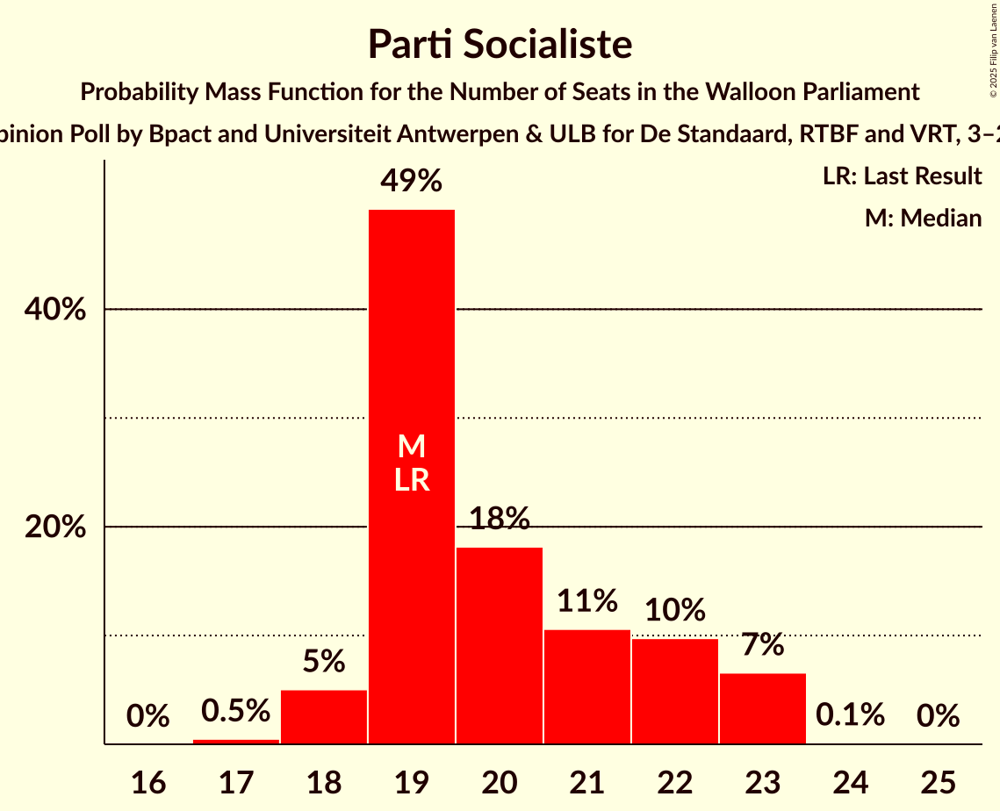

| Number of Seats | Probability | Accumulated | Special Marks |
|:---------------:|:-----------:|:-----------:|:-------------:|
| 17 | 0.5% | 100% |  |
| 18 | 5% | 99.5% |  |
| 19 | 49% | 94% | Last Result, Median |
| 20 | 18% | 45% |  |
| 21 | 11% | 27% |  |
| 22 | 10% | 16% |  |
| 23 | 7% | 7% |  |
| 24 | 0.1% | 0.1% |  |
| 25 | 0% | 0% |  |

### Mouvement Réformateur

*For a full overview of the results for this party, see the [Mouvement Réformateur](party-mouvementréformateur.html) page.*

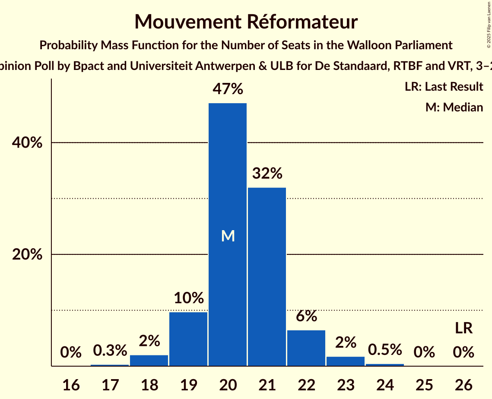

| Number of Seats | Probability | Accumulated | Special Marks |
|:---------------:|:-----------:|:-----------:|:-------------:|
| 17 | 0.3% | 100% |  |
| 18 | 2% | 99.7% |  |
| 19 | 10% | 98% |  |
| 20 | 46% | 88% | Median |
| 21 | 33% | 42% |  |
| 22 | 7% | 9% |  |
| 23 | 2% | 2% |  |
| 24 | 0.5% | 0.6% |  |
| 25 | 0% | 0% |  |
| 26 | 0% | 0% | Last Result |

### Les Engagés

*For a full overview of the results for this party, see the [Les Engagés](party-lesengagés.html) page.*

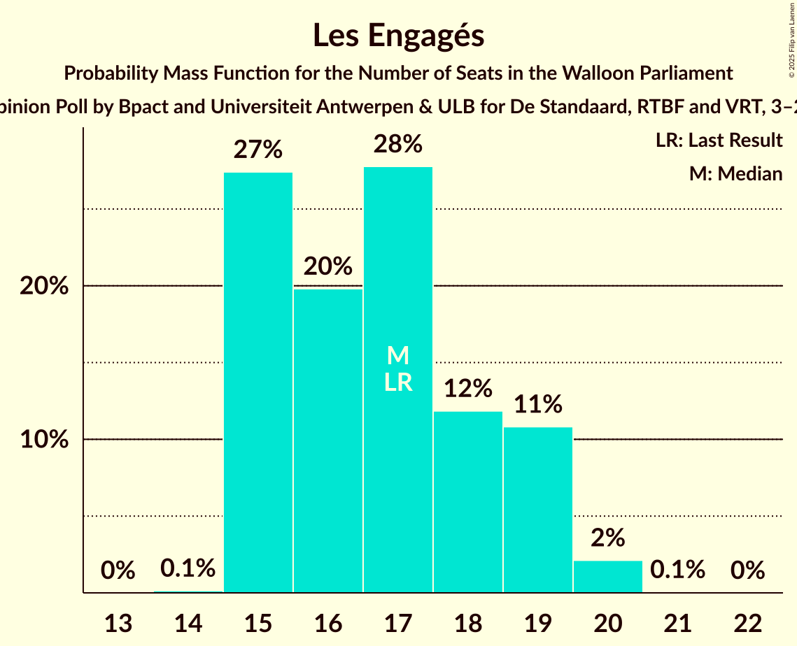

| Number of Seats | Probability | Accumulated | Special Marks |
|:---------------:|:-----------:|:-----------:|:-------------:|
| 14 | 0.1% | 100% |  |
| 15 | 27% | 99.9% |  |
| 16 | 18% | 73% |  |
| 17 | 30% | 55% | Last Result, Median |
| 18 | 12% | 25% |  |
| 19 | 11% | 13% |  |
| 20 | 2% | 2% |  |
| 21 | 0% | 0% |  |

### Parti du Travail de Belgique

*For a full overview of the results for this party, see the [Parti du Travail de Belgique](party-partidutravaildebelgique.html) page.*

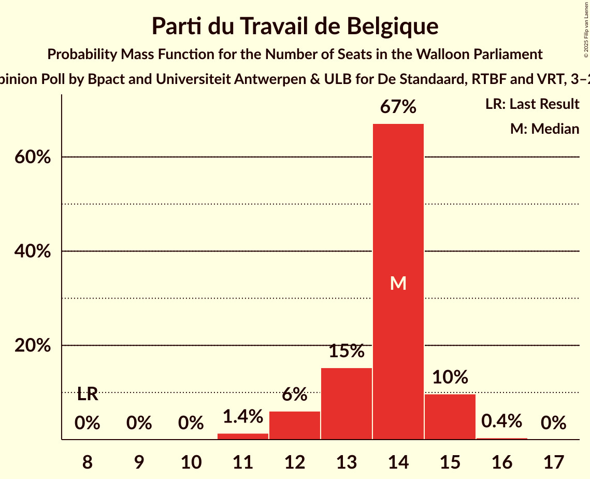

| Number of Seats | Probability | Accumulated | Special Marks |
|:---------------:|:-----------:|:-----------:|:-------------:|
| 8 | 0% | 100% | Last Result |
| 9 | 0% | 100% |  |
| 10 | 0% | 100% |  |
| 11 | 1.5% | 100% |  |
| 12 | 6% | 98.5% |  |
| 13 | 15% | 93% |  |
| 14 | 68% | 78% | Median |
| 15 | 9% | 9% |  |
| 16 | 0.4% | 0.4% |  |
| 17 | 0% | 0% |  |

### Ecolo

*For a full overview of the results for this party, see the [Ecolo](party-ecolo.html) page.*

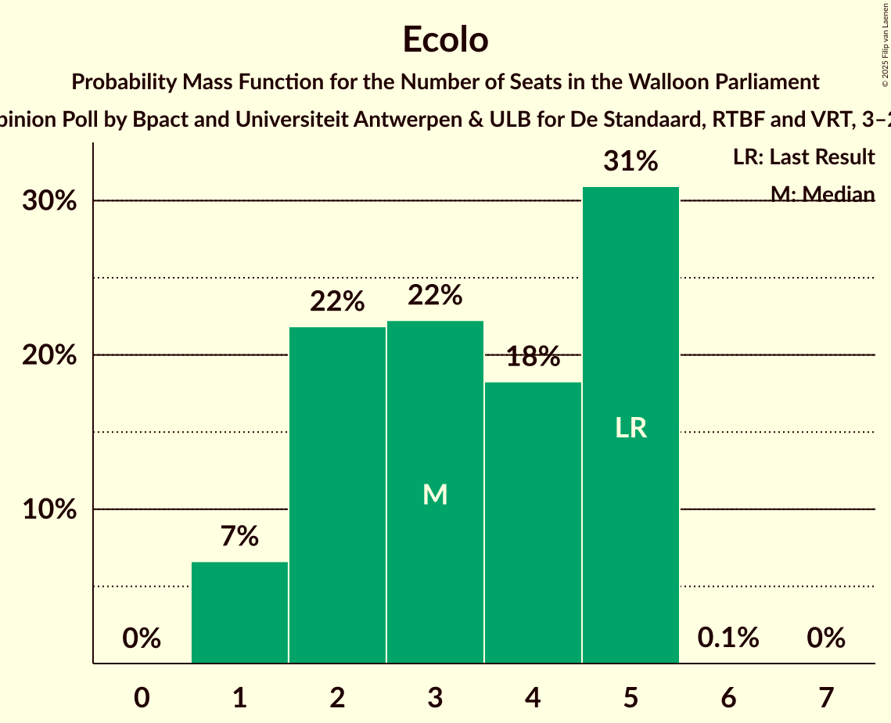

| Number of Seats | Probability | Accumulated | Special Marks |
|:---------------:|:-----------:|:-----------:|:-------------:|
| 1 | 7% | 100% |  |
| 2 | 22% | 93% |  |
| 3 | 22% | 72% | Median |
| 4 | 19% | 50% |  |
| 5 | 31% | 31% | Last Result |
| 6 | 0.1% | 0.1% |  |
| 7 | 0% | 0% |  |

### Chez Nous

*For a full overview of the results for this party, see the [Chez Nous](party-cheznous.html) page.*

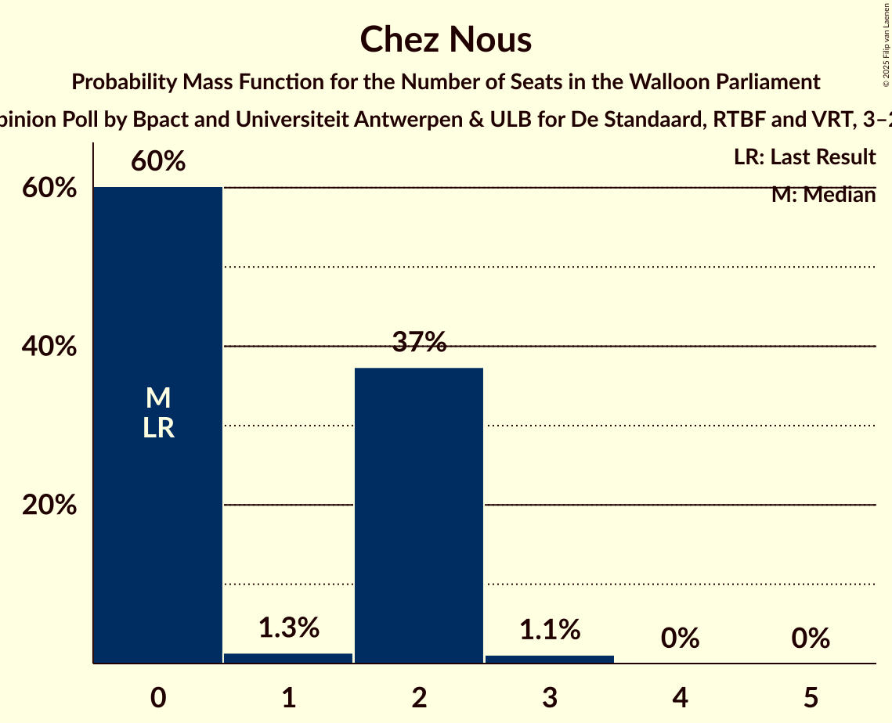

| Number of Seats | Probability | Accumulated | Special Marks |
|:---------------:|:-----------:|:-----------:|:-------------:|
| 0 | 60% | 100% | Last Result, Median |
| 1 | 1.3% | 40% |  |
| 2 | 37% | 38% |  |
| 3 | 1.1% | 1.1% |  |
| 4 | 0% | 0% |  |

### DéFI

*For a full overview of the results for this party, see the [DéFI](party-défi.html) page.*

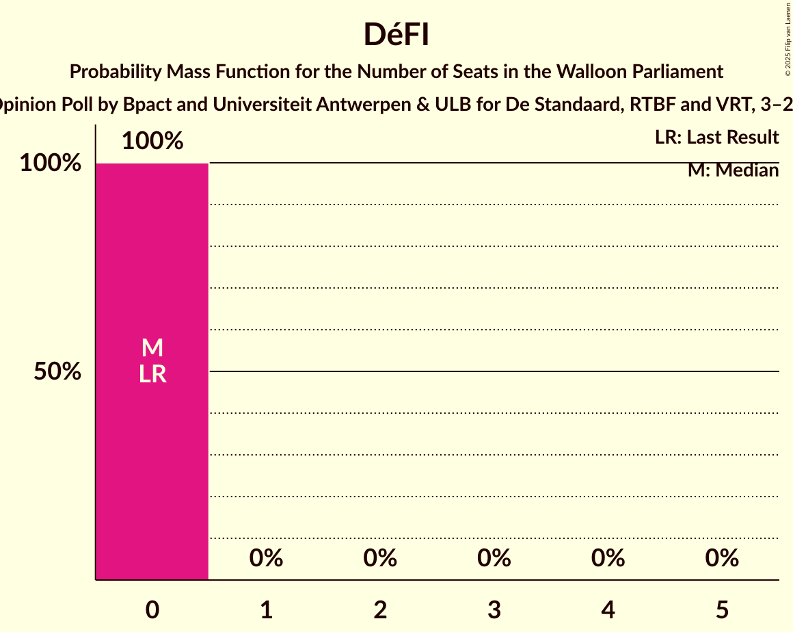

| Number of Seats | Probability | Accumulated | Special Marks |
|:---------------:|:-----------:|:-----------:|:-------------:|
| 0 | 100% | 100% | Last Result, Median |

## Coalitions

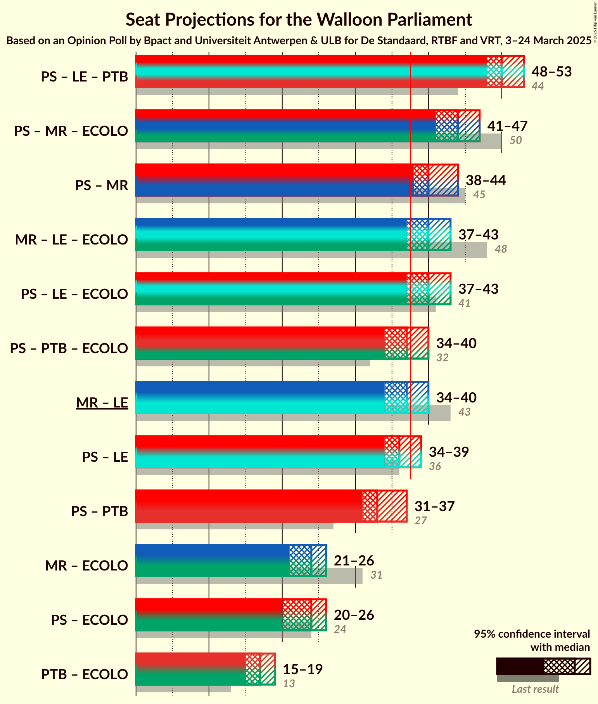

### Confidence Intervals

| Coalition | Last Result | Median | Majority? | 80% Confidence Interval | 90% Confidence Interval | 95% Confidence Interval | 99% Confidence Interval |
|:---------:|:-----------:|:------:|:---------:|:-----------------------:|:-----------------------:|:-----------------------:|:-----------------------:|
| Parti Socialiste – Les Engagés – Parti du Travail de Belgique | 44 | 50 | 100% | 48–52 | 48–53 | 48–53 | 46–54 |
| Parti Socialiste – Mouvement Réformateur – Ecolo | 50 | 44 | 100% | 42–46 | 41–46 | 41–47 | 40–47 |
| Parti Socialiste – Mouvement Réformateur | 45 | 40 | 98% | 39–43 | 38–43 | 38–44 | 37–45 |
| Mouvement Réformateur – Les Engagés – Ecolo | 48 | 41 | 97% | 38–42 | 38–42 | 37–43 | 36–44 |
| Parti Socialiste – Les Engagés – Ecolo | 41 | 40 | 97% | 38–42 | 38–42 | 37–43 | 37–43 |
| Parti Socialiste – Parti du Travail de Belgique – Ecolo | 32 | 37 | 45% | 35–39 | 34–40 | 34–40 | 33–41 |
| Mouvement Réformateur – Les Engagés | 43 | 37 | 34% | 35–39 | 35–40 | 34–40 | 34–41 |
| Parti Socialiste – Les Engagés | 36 | 36 | 29% | 35–38 | 35–39 | 34–39 | 33–40 |
| Parti Socialiste – Parti du Travail de Belgique | 27 | 33 | 0.5% | 32–36 | 31–37 | 31–37 | 30–37 |
| Mouvement Réformateur – Ecolo | 31 | 24 | 0% | 22–25 | 22–26 | 21–26 | 21–27 |
| Parti Socialiste – Ecolo | 24 | 24 | 0% | 21–25 | 21–26 | 20–26 | 20–27 |
| Parti du Travail de Belgique – Ecolo | 13 | 17 | 0% | 15–19 | 15–19 | 15–19 | 14–20 |

### Parti Socialiste – Les Engagés – Parti du Travail de Belgique

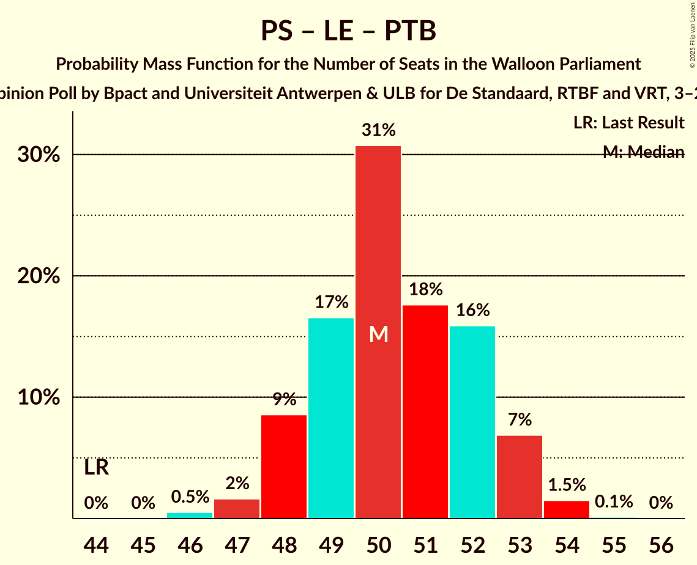

| Number of Seats | Probability | Accumulated | Special Marks |
|:---------------:|:-----------:|:-----------:|:-------------:|
| 44 | 0% | 100% | Last Result |
| 45 | 0% | 100% |  |
| 46 | 0.5% | 100% |  |
| 47 | 2% | 99.5% |  |
| 48 | 9% | 98% |  |
| 49 | 17% | 89% |  |
| 50 | 31% | 73% | Median |
| 51 | 18% | 42% |  |
| 52 | 16% | 24% |  |
| 53 | 7% | 8% |  |
| 54 | 1.5% | 2% |  |
| 55 | 0.1% | 0.1% |  |
| 56 | 0% | 0% |  |

### Parti Socialiste – Mouvement Réformateur – Ecolo

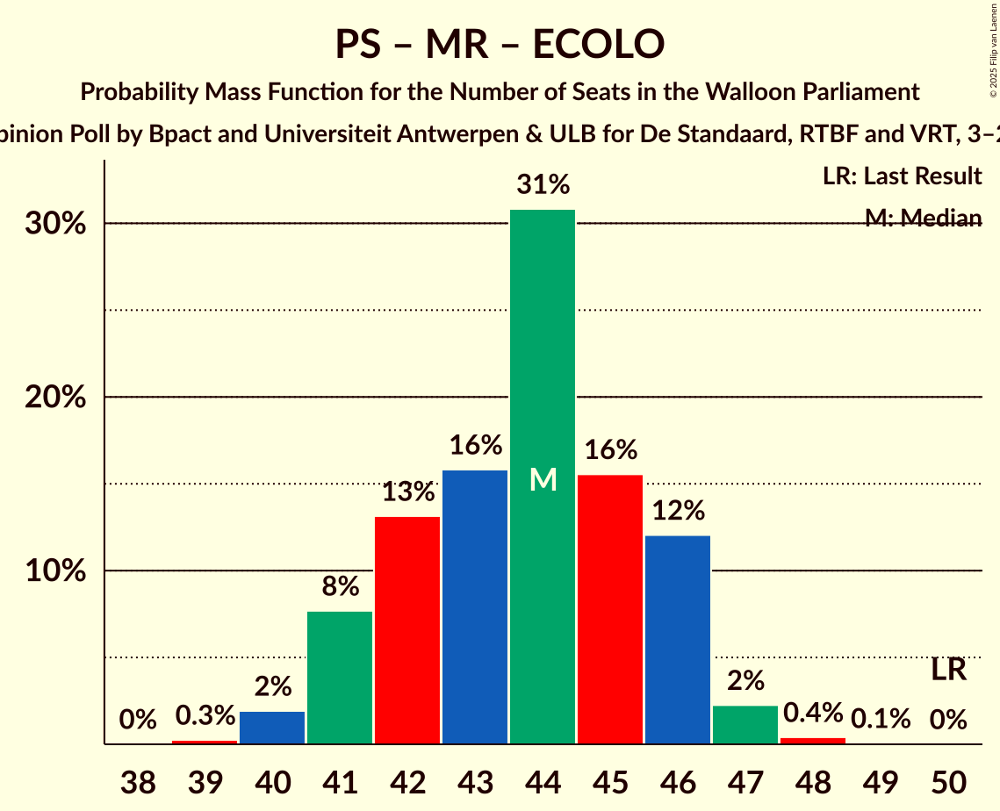

| Number of Seats | Probability | Accumulated | Special Marks |
|:---------------:|:-----------:|:-----------:|:-------------:|
| 39 | 0.3% | 100% |  |
| 40 | 2% | 99.7% |  |
| 41 | 8% | 98% |  |
| 42 | 13% | 90% | Median |
| 43 | 16% | 77% |  |
| 44 | 31% | 61% |  |
| 45 | 16% | 30% |  |
| 46 | 12% | 15% |  |
| 47 | 2% | 3% |  |
| 48 | 0.4% | 0.5% |  |
| 49 | 0.1% | 0.1% |  |
| 50 | 0% | 0% | Last Result |

### Parti Socialiste – Mouvement Réformateur

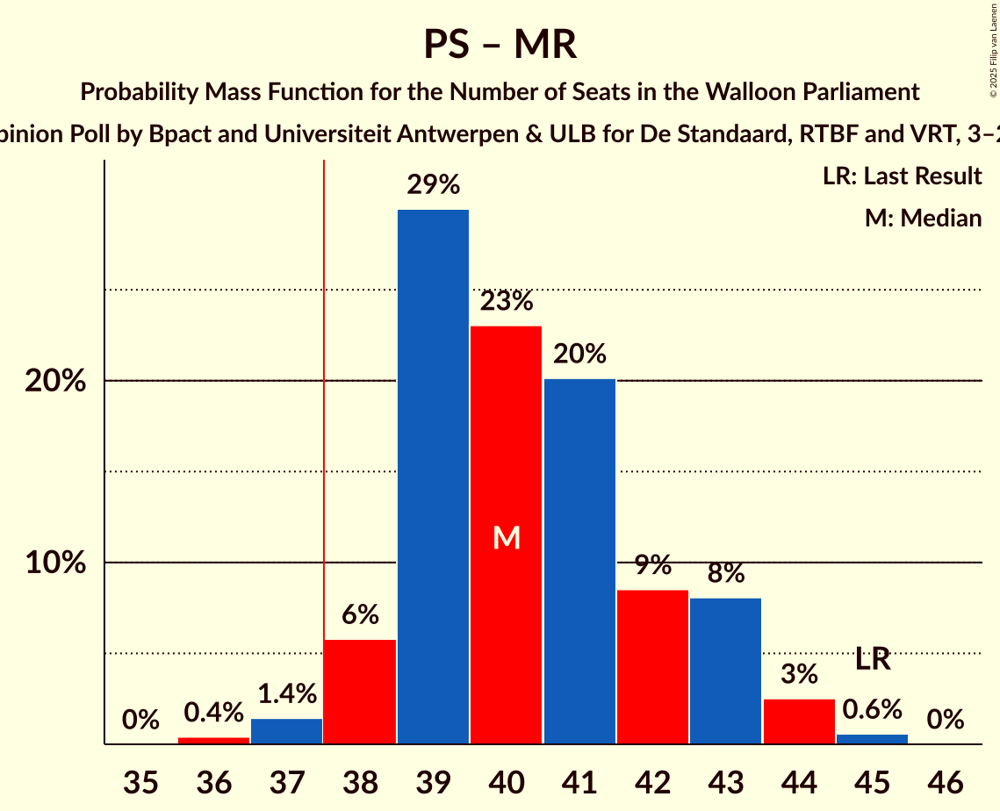

| Number of Seats | Probability | Accumulated | Special Marks |
|:---------------:|:-----------:|:-----------:|:-------------:|
| 36 | 0.4% | 100% |  |
| 37 | 2% | 99.6% |  |
| 38 | 5% | 98% | Majority |
| 39 | 27% | 93% | Median |
| 40 | 26% | 65% |  |
| 41 | 20% | 39% |  |
| 42 | 8% | 19% |  |
| 43 | 8% | 11% |  |
| 44 | 3% | 3% |  |
| 45 | 0.6% | 0.6% | Last Result |
| 46 | 0% | 0% |  |

### Mouvement Réformateur – Les Engagés – Ecolo

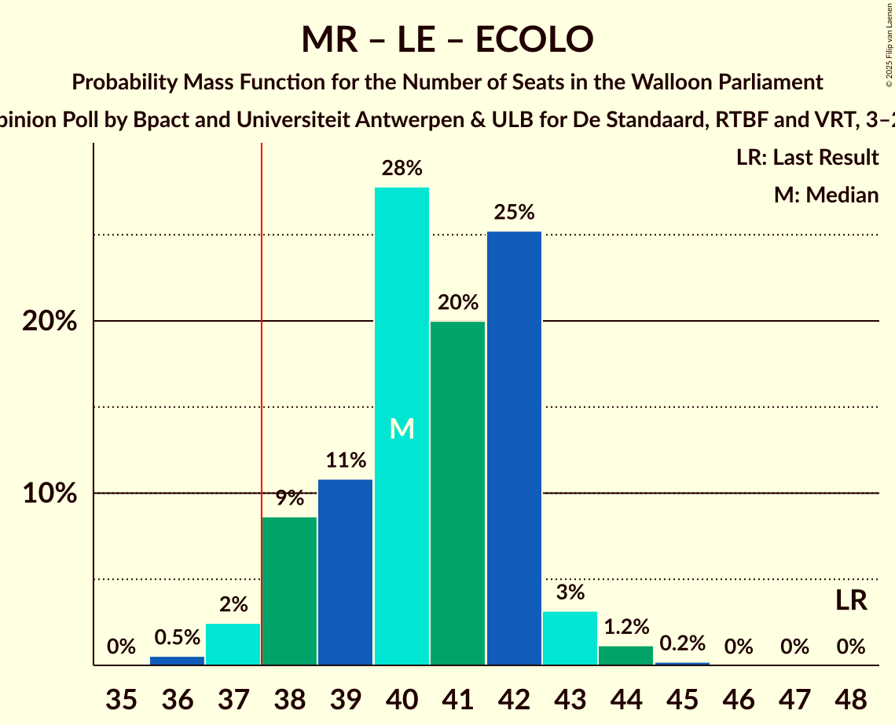

| Number of Seats | Probability | Accumulated | Special Marks |
|:---------------:|:-----------:|:-----------:|:-------------:|
| 36 | 0.7% | 100% |  |
| 37 | 2% | 99.3% |  |
| 38 | 8% | 97% | Majority |
| 39 | 11% | 89% |  |
| 40 | 27% | 78% | Median |
| 41 | 20% | 51% |  |
| 42 | 27% | 32% |  |
| 43 | 3% | 4% |  |
| 44 | 1.0% | 1.2% |  |
| 45 | 0.2% | 0.2% |  |
| 46 | 0% | 0% |  |
| 47 | 0% | 0% |  |
| 48 | 0% | 0% | Last Result |

### Parti Socialiste – Les Engagés – Ecolo

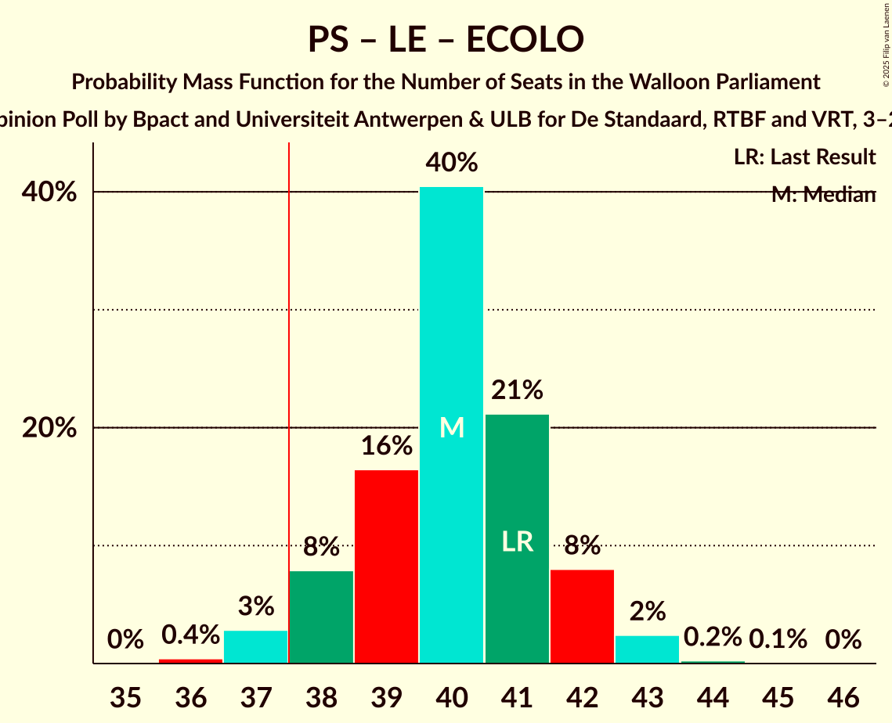

| Number of Seats | Probability | Accumulated | Special Marks |
|:---------------:|:-----------:|:-----------:|:-------------:|
| 36 | 0.4% | 100% |  |
| 37 | 3% | 99.5% |  |
| 38 | 8% | 97% | Majority |
| 39 | 16% | 89% | Median |
| 40 | 40% | 72% |  |
| 41 | 21% | 32% | Last Result |
| 42 | 8% | 11% |  |
| 43 | 2% | 3% |  |
| 44 | 0.2% | 0.3% |  |
| 45 | 0.1% | 0.1% |  |
| 46 | 0% | 0% |  |

### Parti Socialiste – Parti du Travail de Belgique – Ecolo

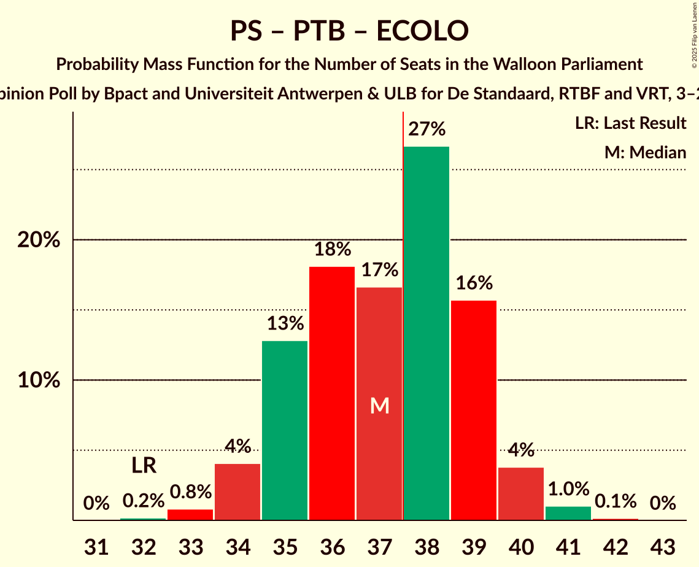

| Number of Seats | Probability | Accumulated | Special Marks |
|:---------------:|:-----------:|:-----------:|:-------------:|
| 32 | 0.2% | 100% | Last Result |
| 33 | 0.9% | 99.8% |  |
| 34 | 4% | 98.9% |  |
| 35 | 12% | 95% |  |
| 36 | 18% | 83% | Median |
| 37 | 20% | 65% |  |
| 38 | 25% | 45% | Majority |
| 39 | 15% | 21% |  |
| 40 | 4% | 5% |  |
| 41 | 0.8% | 1.0% |  |
| 42 | 0.2% | 0.2% |  |
| 43 | 0% | 0% |  |

### Mouvement Réformateur – Les Engagés

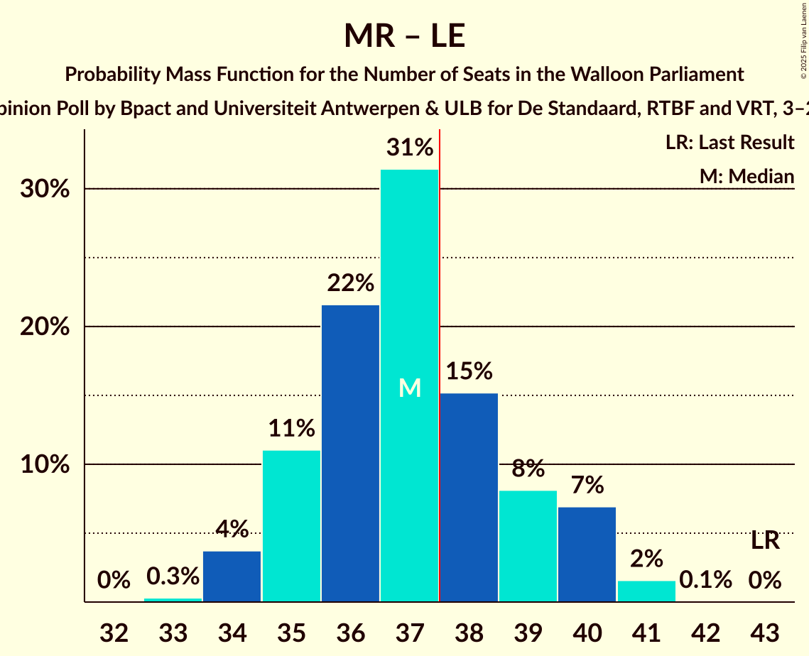

| Number of Seats | Probability | Accumulated | Special Marks |
|:---------------:|:-----------:|:-----------:|:-------------:|
| 33 | 0.3% | 100% |  |
| 34 | 4% | 99.7% |  |
| 35 | 10% | 96% |  |
| 36 | 21% | 85% |  |
| 37 | 31% | 65% | Median |
| 38 | 17% | 34% | Majority |
| 39 | 8% | 17% |  |
| 40 | 7% | 9% |  |
| 41 | 2% | 2% |  |
| 42 | 0.1% | 0.1% |  |
| 43 | 0% | 0% | Last Result |

### Parti Socialiste – Les Engagés

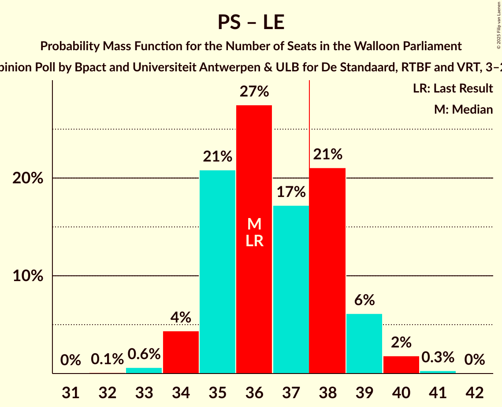

| Number of Seats | Probability | Accumulated | Special Marks |
|:---------------:|:-----------:|:-----------:|:-------------:|
| 32 | 0.1% | 100% |  |
| 33 | 0.5% | 99.9% |  |
| 34 | 4% | 99.4% |  |
| 35 | 20% | 95% |  |
| 36 | 28% | 75% | Last Result, Median |
| 37 | 19% | 48% |  |
| 38 | 20% | 29% | Majority |
| 39 | 6% | 9% |  |
| 40 | 2% | 2% |  |
| 41 | 0.3% | 0.3% |  |
| 42 | 0% | 0% |  |

### Parti Socialiste – Parti du Travail de Belgique

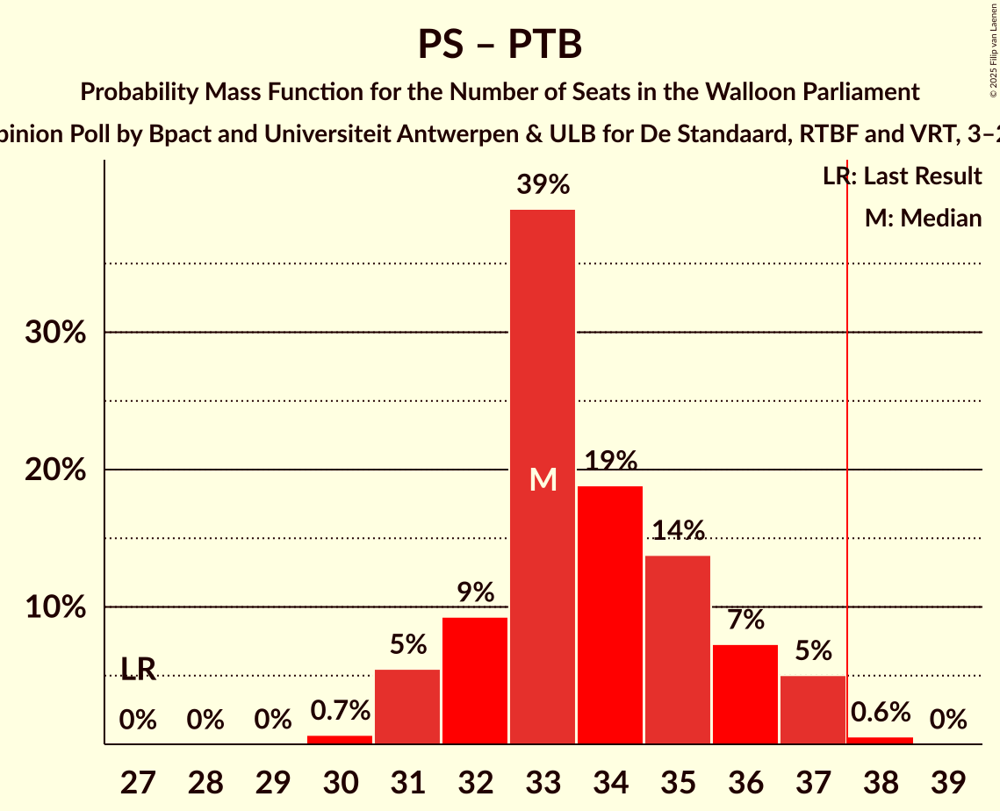

| Number of Seats | Probability | Accumulated | Special Marks |
|:---------------:|:-----------:|:-----------:|:-------------:|
| 27 | 0% | 100% | Last Result |
| 28 | 0% | 100% |  |
| 29 | 0% | 100% |  |
| 30 | 0.7% | 100% |  |
| 31 | 5% | 99.2% |  |
| 32 | 10% | 95% |  |
| 33 | 40% | 85% | Median |
| 34 | 18% | 44% |  |
| 35 | 13% | 26% |  |
| 36 | 7% | 13% |  |
| 37 | 5% | 6% |  |
| 38 | 0.5% | 0.5% | Majority |
| 39 | 0% | 0% |  |

### Mouvement Réformateur – Ecolo

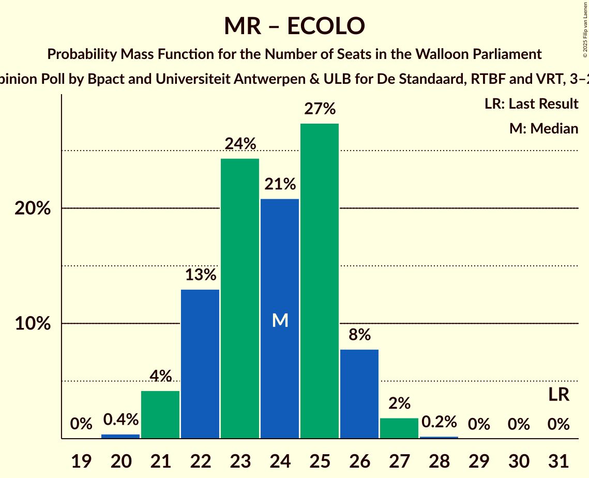

| Number of Seats | Probability | Accumulated | Special Marks |
|:---------------:|:-----------:|:-----------:|:-------------:|
| 20 | 0.4% | 100% |  |
| 21 | 4% | 99.5% |  |
| 22 | 13% | 95% |  |
| 23 | 24% | 82% | Median |
| 24 | 21% | 58% |  |
| 25 | 27% | 37% |  |
| 26 | 8% | 10% |  |
| 27 | 2% | 2% |  |
| 28 | 0.2% | 0.2% |  |
| 29 | 0% | 0% |  |
| 30 | 0% | 0% |  |
| 31 | 0% | 0% | Last Result |

### Parti Socialiste – Ecolo

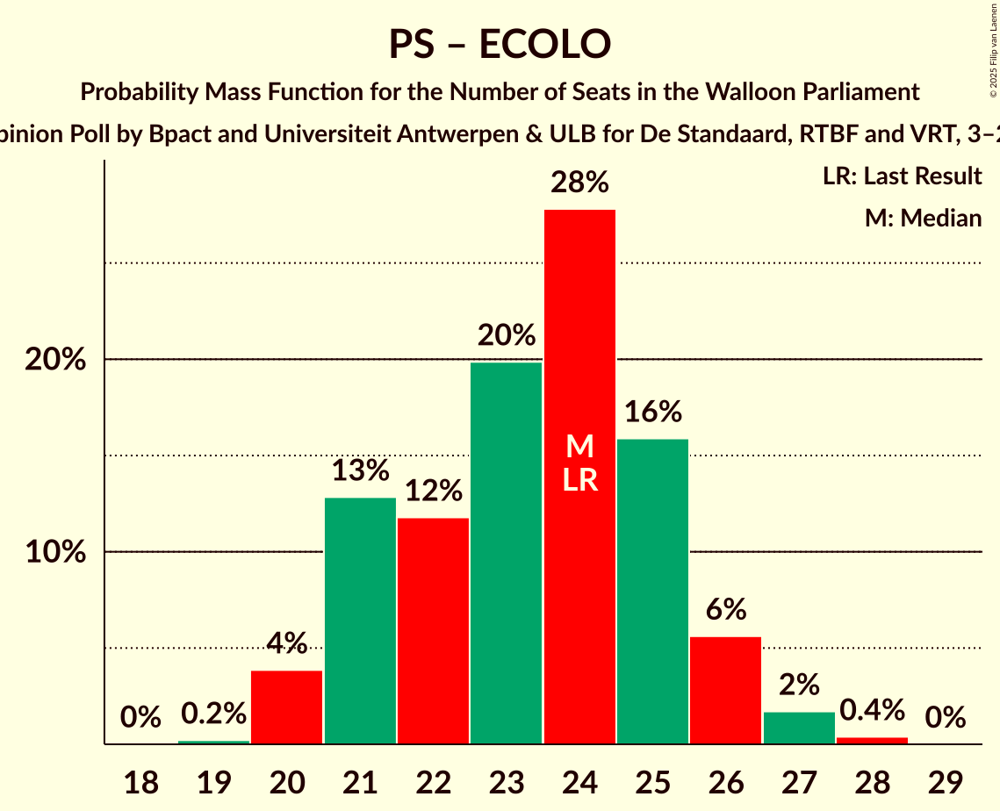

| Number of Seats | Probability | Accumulated | Special Marks |
|:---------------:|:-----------:|:-----------:|:-------------:|
| 19 | 0.2% | 100% |  |
| 20 | 4% | 99.8% |  |
| 21 | 11% | 96% |  |
| 22 | 13% | 84% | Median |
| 23 | 22% | 72% |  |
| 24 | 26% | 50% | Last Result |
| 25 | 16% | 24% |  |
| 26 | 5% | 7% |  |
| 27 | 2% | 2% |  |
| 28 | 0.4% | 0.4% |  |
| 29 | 0% | 0% |  |

### Parti du Travail de Belgique – Ecolo

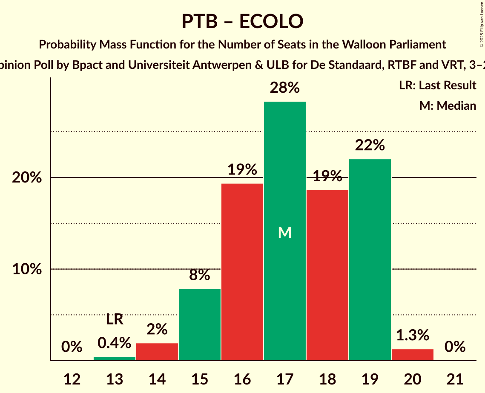

| Number of Seats | Probability | Accumulated | Special Marks |
|:---------------:|:-----------:|:-----------:|:-------------:|
| 13 | 0.4% | 100% | Last Result |
| 14 | 2% | 99.5% |  |
| 15 | 8% | 98% |  |
| 16 | 19% | 90% |  |
| 17 | 28% | 70% | Median |
| 18 | 19% | 42% |  |
| 19 | 22% | 23% |  |
| 20 | 1.3% | 1.3% |  |
| 21 | 0% | 0% |  |

## Technical Information

### Opinion Poll

+ **Polling firm:** Bpact and Universiteit Antwerpen & ULB
+ **Commissioner(s):** De Standaard, RTBF and VRT
+ **Fieldwork period:** 3–24 March 2025

### Calculations

+ **Sample size:** 1988
+ **Simulations done:** 2,097,152
+ **Error estimate:** 1.01%

