# Opinion Poll by Ipsos for Het Laatste Nieuws, Le Soir, RTL TVi and VTM, 27 May–3 June 2025

<a href="#voting-intentions">Voting Intentions</a> | <a href="#seats">Seats</a> | <a href="#coalitions">Coalitions</a> | <a href="#technical-information">Technical Information</a>

## Voting Intentions

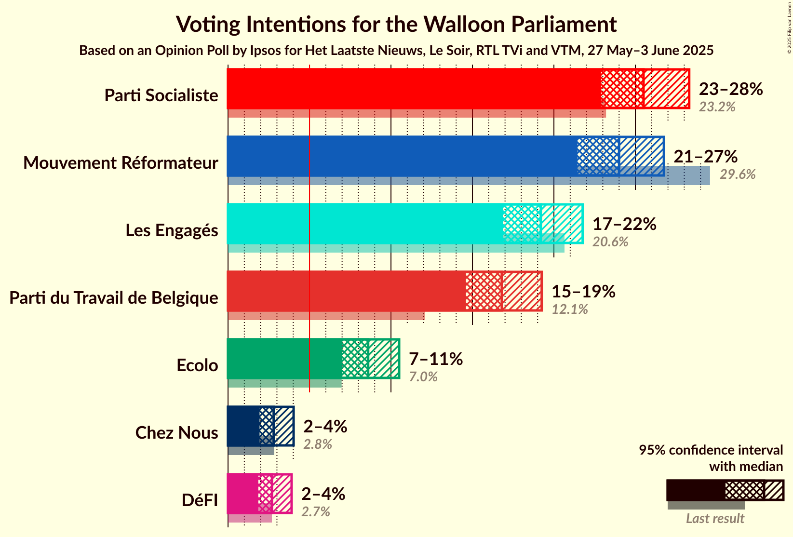

### Confidence Intervals

| Party | Last Result | Poll Result | 80% Confidence Interval | 90% Confidence Interval | 95% Confidence Interval | 99% Confidence Interval |
|:-----:|:-----------:|:-----------:|:-----------------------:|:-----------------------:|:-----------------------:|:-----------------------:|
| Parti Socialiste | 23.2% | 25.5% | 23.8–27.3% |23.3–27.8% |22.9–28.3% |22.1–29.2% |
| Mouvement Réformateur | 29.6% | 24.0% | 22.3–25.8% |21.9–26.3% |21.4–26.7% |20.7–27.6% |
| Les Engagés | 20.6% | 19.2% | 17.7–20.9% |17.2–21.4% |16.9–21.8% |16.2–22.6% |
| Parti du Travail de Belgique | 12.1% | 16.8% | 15.4–18.4% |15.0–18.9% |14.6–19.3% |13.9–20.0% |
| Ecolo | 7.0% | 8.6% | 7.6–9.8% |7.3–10.2% |7.0–10.5% |6.5–11.1% |
| Chez Nous | 2.8% | 2.8% | 2.2–3.6% |2.1–3.8% |1.9–4.0% |1.7–4.4% |
| DéFI | 2.7% | 2.7% | 2.1–3.5% |2.0–3.7% |1.9–3.9% |1.6–4.3% |

*Note:* The poll result column reflects the actual value used in the calculations. Published results may vary slightly, and in addition be rounded to fewer digits.

## Seats

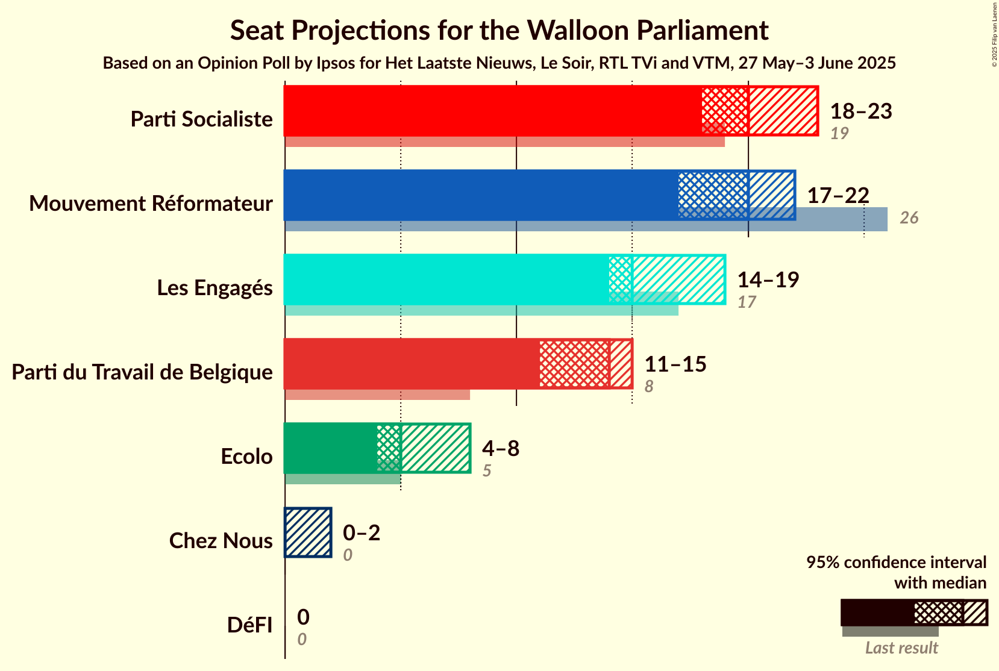

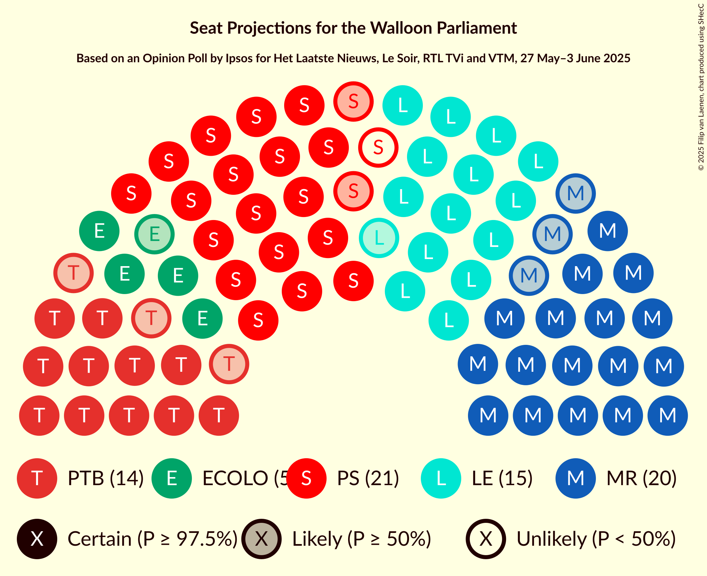

### Confidence Intervals

| Party | Last Result | Median | 80% Confidence Interval | 90% Confidence Interval | 95% Confidence Interval | 99% Confidence Interval |
|:-----:|:-----------:|:------:|:-----------------------:|:-----------------------:|:-----------------------:|:-----------------------:|
| <a href="#parti-socialiste">Parti Socialiste</a> | 19 | 20 | 19–23 |18–23 |18–23 |17–24 |
| <a href="#mouvement-réformateur">Mouvement Réformateur</a> | 26 | 20 | 18–21 |18–22 |17–22 |17–23 |
| <a href="#les-engagés">Les Engagés</a> | 17 | 15 | 15–17 |14–18 |14–19 |13–19 |
| <a href="#parti-du-travail-de-belgique">Parti du Travail de Belgique</a> | 8 | 14 | 12–14 |11–15 |11–15 |11–16 |
| <a href="#ecolo">Ecolo</a> | 5 | 5 | 5–7 |5–7 |4–8 |2–8 |
| <a href="#chez-nous">Chez Nous</a> | 0 | 0 | 0–2 |0–2 |0–2 |0–3 |
| <a href="#défi">DéFI</a> | 0 | 0 | 0 |0 |0 |0 |

### Parti Socialiste

*For a full overview of the results for this party, see the [Parti Socialiste](party-partisocialiste.html) page.*

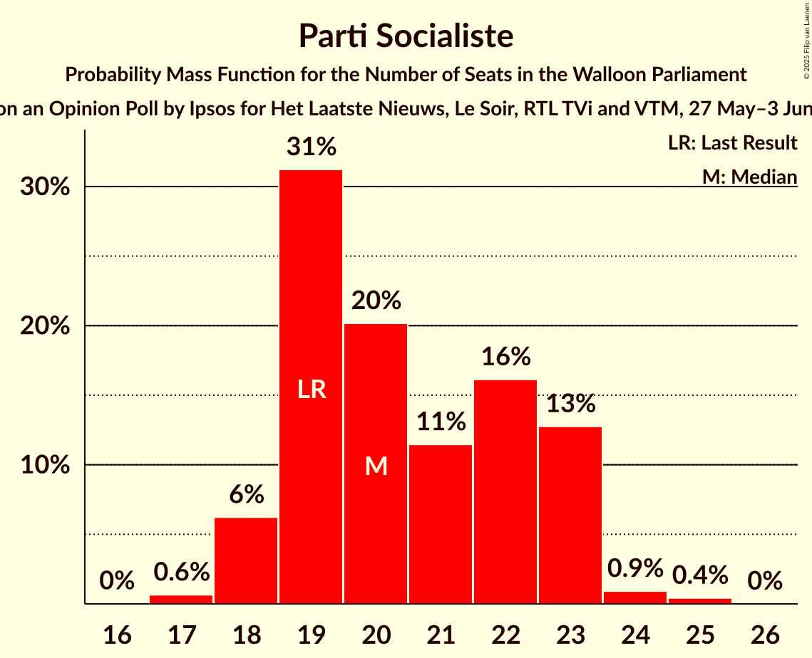

| Number of Seats | Probability | Accumulated | Special Marks |
|:---------------:|:-----------:|:-----------:|:-------------:|
| 17 | 0.6% | 100% |  |
| 18 | 6% | 99.3% |  |
| 19 | 31% | 93% | Last Result |
| 20 | 20% | 62% | Median |
| 21 | 11% | 42% |  |
| 22 | 16% | 30% |  |
| 23 | 13% | 14% |  |
| 24 | 0.9% | 1.3% |  |
| 25 | 0.4% | 0.4% |  |
| 26 | 0% | 0% |  |

### Mouvement Réformateur

*For a full overview of the results for this party, see the [Mouvement Réformateur](party-mouvementréformateur.html) page.*

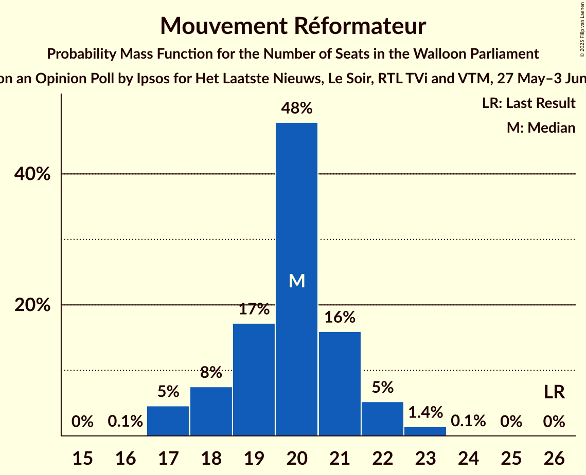

| Number of Seats | Probability | Accumulated | Special Marks |
|:---------------:|:-----------:|:-----------:|:-------------:|
| 16 | 0.1% | 100% |  |
| 17 | 5% | 99.9% |  |
| 18 | 8% | 95% |  |
| 19 | 17% | 88% |  |
| 20 | 48% | 71% | Median |
| 21 | 16% | 23% |  |
| 22 | 5% | 7% |  |
| 23 | 1.4% | 2% |  |
| 24 | 0.1% | 0.1% |  |
| 25 | 0% | 0% |  |
| 26 | 0% | 0% | Last Result |

### Les Engagés

*For a full overview of the results for this party, see the [Les Engagés](party-lesengagés.html) page.*

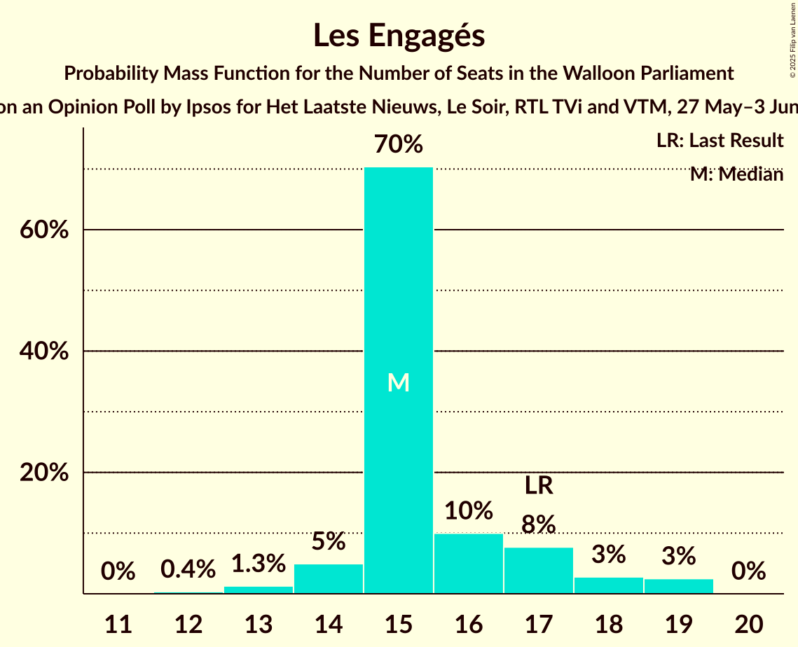

| Number of Seats | Probability | Accumulated | Special Marks |
|:---------------:|:-----------:|:-----------:|:-------------:|
| 12 | 0.4% | 100% |  |
| 13 | 1.3% | 99.6% |  |
| 14 | 5% | 98% |  |
| 15 | 70% | 93% | Median |
| 16 | 10% | 23% |  |
| 17 | 8% | 13% | Last Result |
| 18 | 3% | 5% |  |
| 19 | 3% | 3% |  |
| 20 | 0% | 0% |  |

### Parti du Travail de Belgique

*For a full overview of the results for this party, see the [Parti du Travail de Belgique](party-partidutravaildebelgique.html) page.*

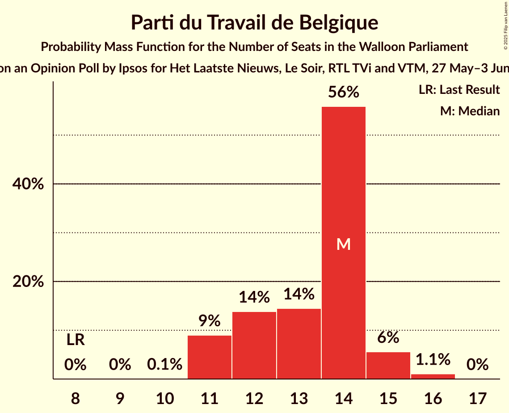

| Number of Seats | Probability | Accumulated | Special Marks |
|:---------------:|:-----------:|:-----------:|:-------------:|
| 8 | 0% | 100% | Last Result |
| 9 | 0% | 100% |  |
| 10 | 0.1% | 100% |  |
| 11 | 9% | 99.9% |  |
| 12 | 14% | 91% |  |
| 13 | 14% | 77% |  |
| 14 | 56% | 63% | Median |
| 15 | 6% | 7% |  |
| 16 | 1.1% | 1.1% |  |
| 17 | 0% | 0% |  |

### Ecolo

*For a full overview of the results for this party, see the [Ecolo](party-ecolo.html) page.*

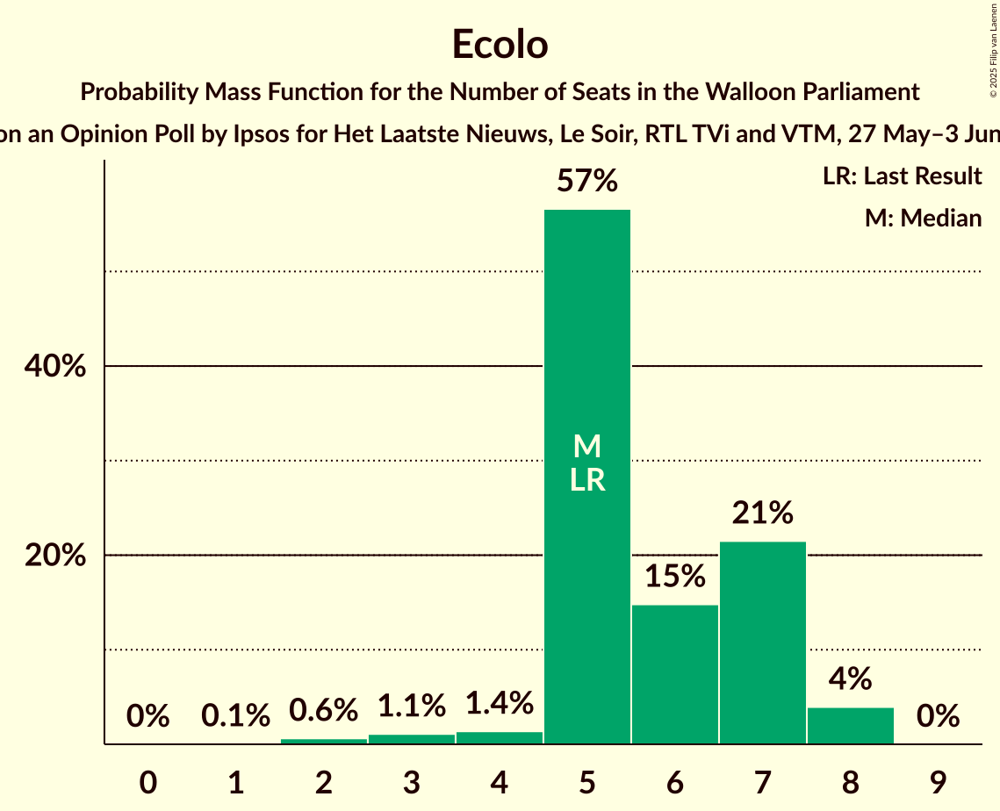

| Number of Seats | Probability | Accumulated | Special Marks |
|:---------------:|:-----------:|:-----------:|:-------------:|
| 1 | 0.1% | 100% |  |
| 2 | 0.6% | 99.9% |  |
| 3 | 1.1% | 99.3% |  |
| 4 | 1.4% | 98% |  |
| 5 | 57% | 97% | Last Result, Median |
| 6 | 15% | 40% |  |
| 7 | 21% | 25% |  |
| 8 | 4% | 4% |  |
| 9 | 0% | 0% |  |

### Chez Nous

*For a full overview of the results for this party, see the [Chez Nous](party-cheznous.html) page.*

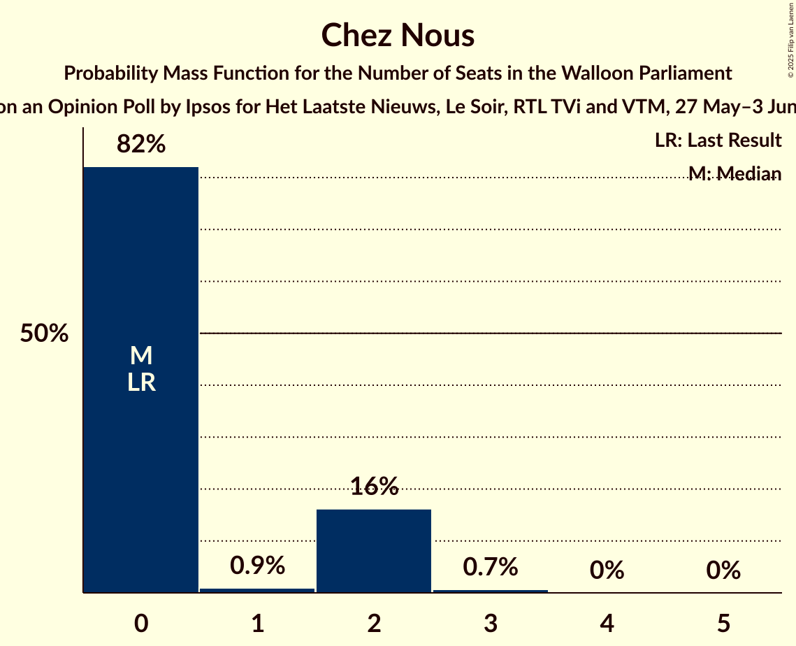

| Number of Seats | Probability | Accumulated | Special Marks |
|:---------------:|:-----------:|:-----------:|:-------------:|
| 0 | 82% | 100% | Last Result, Median |
| 1 | 0.9% | 18% |  |
| 2 | 16% | 17% |  |
| 3 | 0.7% | 0.7% |  |
| 4 | 0% | 0% |  |

### DéFI

*For a full overview of the results for this party, see the [DéFI](party-défi.html) page.*

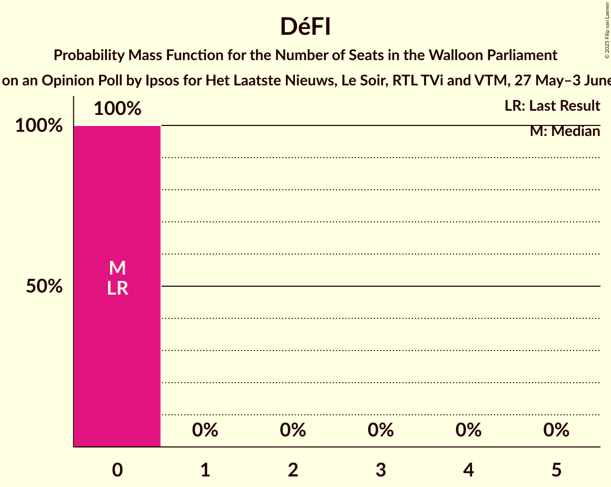

| Number of Seats | Probability | Accumulated | Special Marks |
|:---------------:|:-----------:|:-----------:|:-------------:|
| 0 | 100% | 100% | Last Result, Median |

## Coalitions

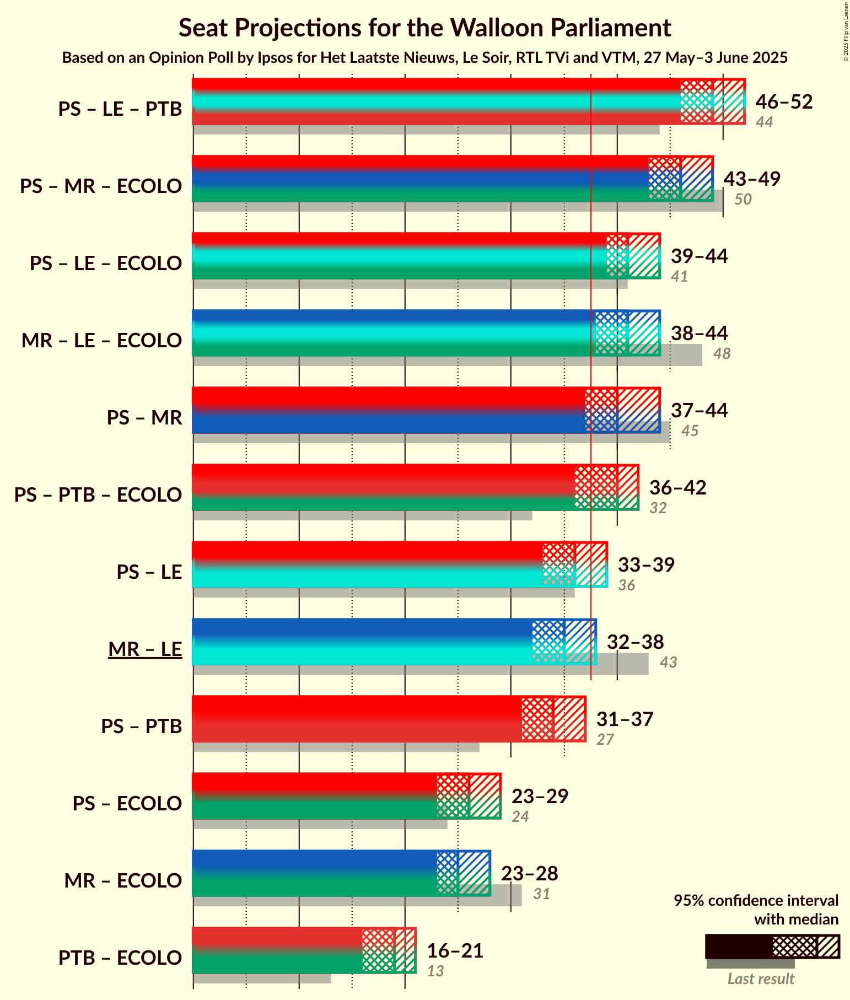

### Confidence Intervals

| Coalition | Last Result | Median | Majority? | 80% Confidence Interval | 90% Confidence Interval | 95% Confidence Interval | 99% Confidence Interval |
|:---------:|:-----------:|:------:|:---------:|:-----------------------:|:-----------------------:|:-----------------------:|:-----------------------:|
| Parti Socialiste – Les Engagés – Parti du Travail de Belgique | 44 | 49 | 100% | 47–51 | 47–52 | 46–52 | 46–53 |
| Parti Socialiste – Mouvement Réformateur – Ecolo | 50 | 46 | 100% | 44–48 | 44–49 | 43–49 | 42–49 |
| Parti Socialiste – Les Engagés – Ecolo | 41 | 41 | 99.6% | 40–43 | 39–44 | 39–44 | 38–45 |
| Mouvement Réformateur – Les Engagés – Ecolo | 48 | 41 | 98% | 39–43 | 38–43 | 38–44 | 37–45 |
| Parti Socialiste – Mouvement Réformateur | 45 | 40 | 96% | 39–42 | 38–43 | 37–44 | 36–44 |
| Parti Socialiste – Parti du Travail de Belgique – Ecolo | 32 | 40 | 91% | 38–41 | 37–42 | 36–42 | 35–43 |
| Parti Socialiste – Les Engagés | 36 | 36 | 17% | 34–38 | 33–38 | 33–39 | 32–40 |
| Mouvement Réformateur – Les Engagés | 43 | 35 | 5% | 33–37 | 33–37 | 32–38 | 32–39 |
| Parti Socialiste – Parti du Travail de Belgique | 27 | 34 | 0.9% | 32–36 | 31–37 | 31–37 | 30–38 |
| Parti Socialiste – Ecolo | 24 | 26 | 0% | 24–28 | 24–29 | 23–29 | 22–30 |
| Mouvement Réformateur – Ecolo | 31 | 25 | 0% | 23–27 | 23–28 | 23–28 | 22–29 |
| Parti du Travail de Belgique – Ecolo | 13 | 19 | 0% | 17–21 | 16–21 | 16–21 | 16–22 |

### Parti Socialiste – Les Engagés – Parti du Travail de Belgique

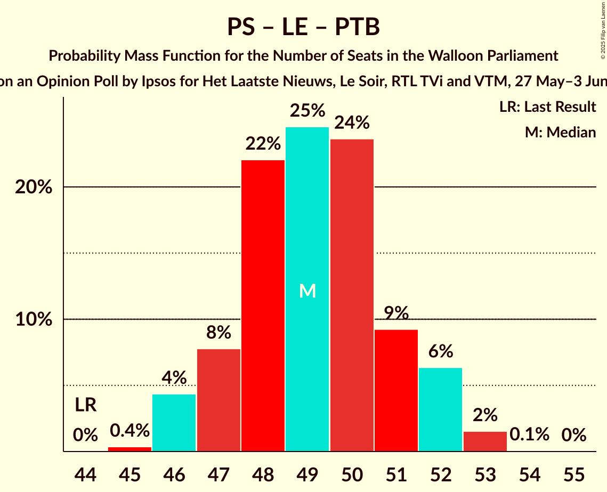

| Number of Seats | Probability | Accumulated | Special Marks |
|:---------------:|:-----------:|:-----------:|:-------------:|
| 44 | 0% | 100% | Last Result |
| 45 | 0.4% | 100% |  |
| 46 | 4% | 99.6% |  |
| 47 | 8% | 95% |  |
| 48 | 22% | 87% |  |
| 49 | 25% | 65% | Median |
| 50 | 24% | 41% |  |
| 51 | 9% | 17% |  |
| 52 | 6% | 8% |  |
| 53 | 2% | 2% |  |
| 54 | 0.1% | 0.1% |  |
| 55 | 0% | 0% |  |

### Parti Socialiste – Mouvement Réformateur – Ecolo

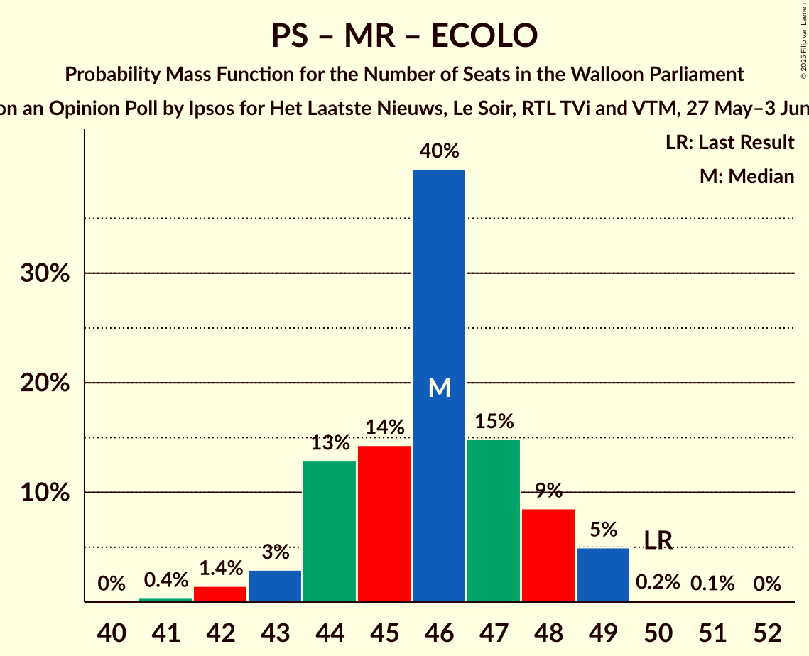

| Number of Seats | Probability | Accumulated | Special Marks |
|:---------------:|:-----------:|:-----------:|:-------------:|
| 41 | 0.4% | 100% |  |
| 42 | 1.4% | 99.6% |  |
| 43 | 3% | 98% |  |
| 44 | 13% | 95% |  |
| 45 | 14% | 82% | Median |
| 46 | 40% | 68% |  |
| 47 | 15% | 29% |  |
| 48 | 9% | 14% |  |
| 49 | 5% | 5% |  |
| 50 | 0.2% | 0.2% | Last Result |
| 51 | 0.1% | 0.1% |  |
| 52 | 0% | 0% |  |

### Parti Socialiste – Les Engagés – Ecolo

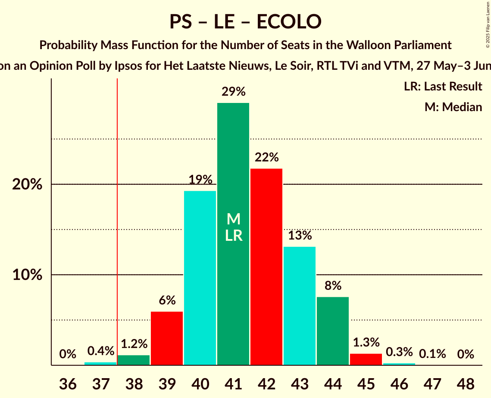

| Number of Seats | Probability | Accumulated | Special Marks |
|:---------------:|:-----------:|:-----------:|:-------------:|
| 37 | 0.4% | 100% |  |
| 38 | 1.2% | 99.6% | Majority |
| 39 | 6% | 98% |  |
| 40 | 19% | 92% | Median |
| 41 | 29% | 73% | Last Result |
| 42 | 22% | 44% |  |
| 43 | 13% | 22% |  |
| 44 | 8% | 9% |  |
| 45 | 1.3% | 2% |  |
| 46 | 0.3% | 0.3% |  |
| 47 | 0.1% | 0.1% |  |
| 48 | 0% | 0% |  |

### Mouvement Réformateur – Les Engagés – Ecolo

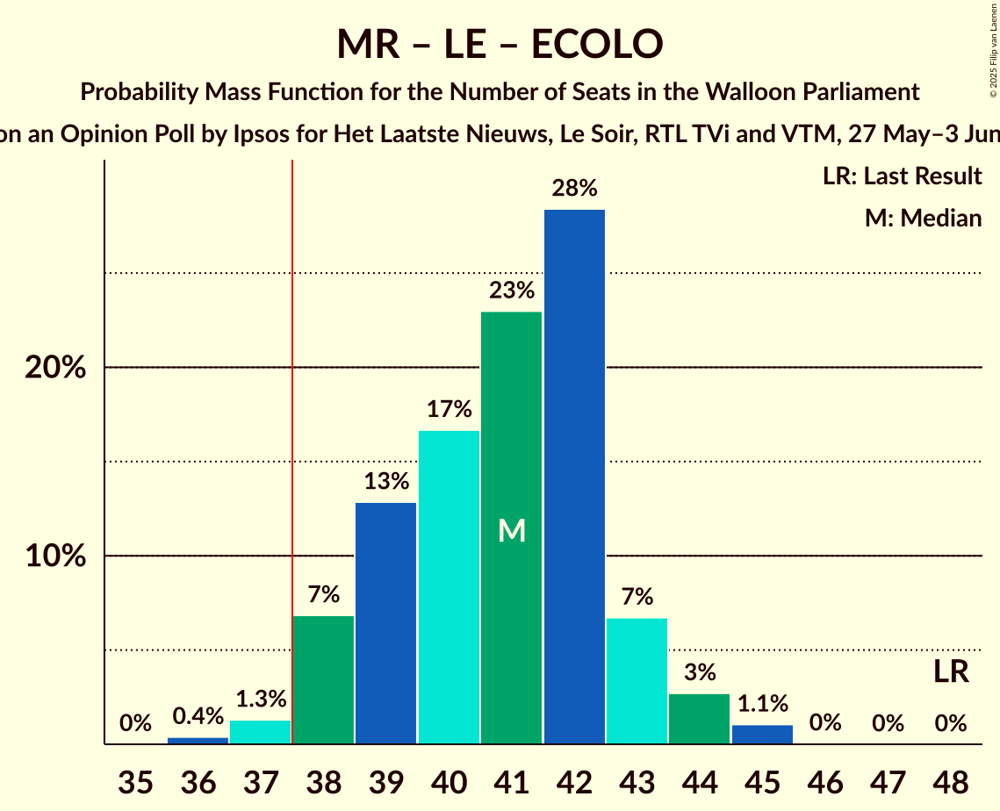

| Number of Seats | Probability | Accumulated | Special Marks |
|:---------------:|:-----------:|:-----------:|:-------------:|
| 36 | 0.4% | 100% |  |
| 37 | 1.3% | 99.6% |  |
| 38 | 7% | 98% | Majority |
| 39 | 13% | 91% |  |
| 40 | 17% | 79% | Median |
| 41 | 23% | 62% |  |
| 42 | 28% | 39% |  |
| 43 | 7% | 11% |  |
| 44 | 3% | 4% |  |
| 45 | 1.1% | 1.1% |  |
| 46 | 0% | 0% |  |
| 47 | 0% | 0% |  |
| 48 | 0% | 0% | Last Result |

### Parti Socialiste – Mouvement Réformateur

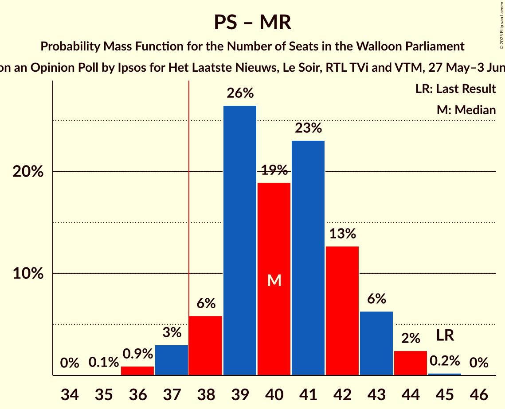

| Number of Seats | Probability | Accumulated | Special Marks |
|:---------------:|:-----------:|:-----------:|:-------------:|
| 35 | 0.1% | 100% |  |
| 36 | 0.9% | 99.9% |  |
| 37 | 3% | 99.0% |  |
| 38 | 6% | 96% | Majority |
| 39 | 26% | 90% |  |
| 40 | 19% | 64% | Median |
| 41 | 23% | 45% |  |
| 42 | 13% | 22% |  |
| 43 | 6% | 9% |  |
| 44 | 2% | 3% |  |
| 45 | 0.2% | 0.3% | Last Result |
| 46 | 0% | 0% |  |

### Parti Socialiste – Parti du Travail de Belgique – Ecolo

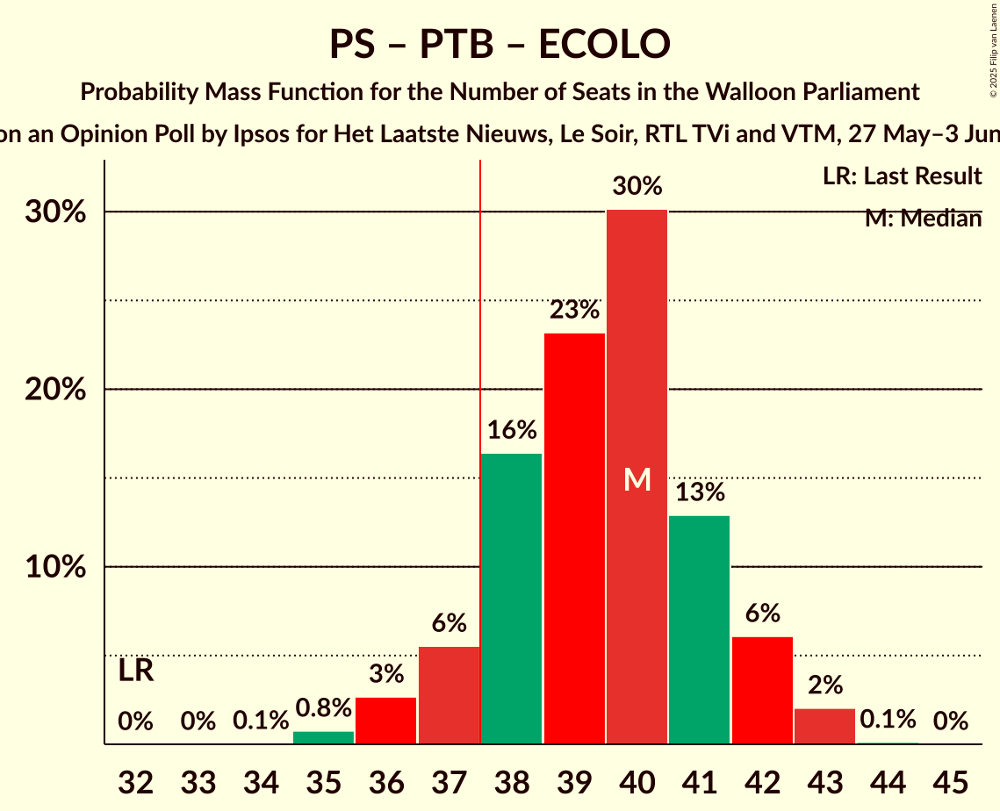

| Number of Seats | Probability | Accumulated | Special Marks |
|:---------------:|:-----------:|:-----------:|:-------------:|
| 32 | 0% | 100% | Last Result |
| 33 | 0% | 100% |  |
| 34 | 0.1% | 100% |  |
| 35 | 0.8% | 99.9% |  |
| 36 | 3% | 99.2% |  |
| 37 | 6% | 96% |  |
| 38 | 16% | 91% | Majority |
| 39 | 23% | 75% | Median |
| 40 | 30% | 51% |  |
| 41 | 13% | 21% |  |
| 42 | 6% | 8% |  |
| 43 | 2% | 2% |  |
| 44 | 0.1% | 0.1% |  |
| 45 | 0% | 0% |  |

### Parti Socialiste – Les Engagés

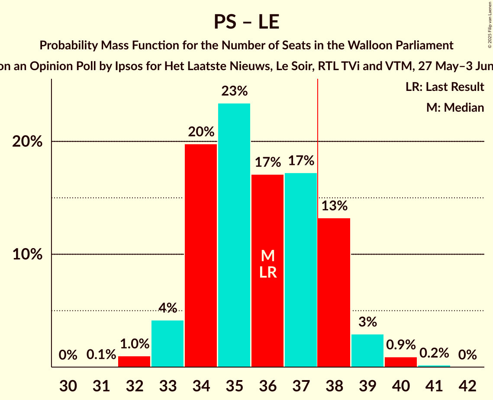

| Number of Seats | Probability | Accumulated | Special Marks |
|:---------------:|:-----------:|:-----------:|:-------------:|
| 31 | 0.1% | 100% |  |
| 32 | 1.0% | 99.9% |  |
| 33 | 4% | 99.0% |  |
| 34 | 20% | 95% |  |
| 35 | 23% | 75% | Median |
| 36 | 17% | 52% | Last Result |
| 37 | 17% | 35% |  |
| 38 | 13% | 17% | Majority |
| 39 | 3% | 4% |  |
| 40 | 0.9% | 1.1% |  |
| 41 | 0.2% | 0.2% |  |
| 42 | 0% | 0% |  |

### Mouvement Réformateur – Les Engagés

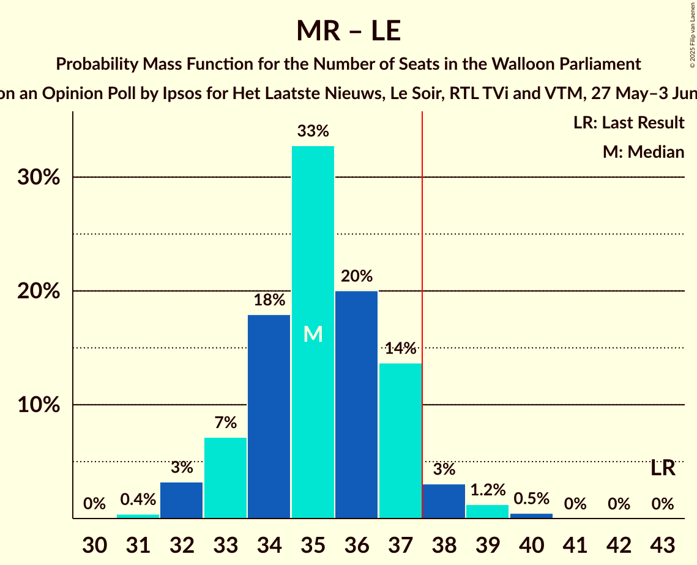

| Number of Seats | Probability | Accumulated | Special Marks |
|:---------------:|:-----------:|:-----------:|:-------------:|
| 31 | 0.4% | 100% |  |
| 32 | 3% | 99.6% |  |
| 33 | 7% | 96% |  |
| 34 | 18% | 89% |  |
| 35 | 33% | 71% | Median |
| 36 | 20% | 38% |  |
| 37 | 14% | 18% |  |
| 38 | 3% | 5% | Majority |
| 39 | 1.2% | 2% |  |
| 40 | 0.5% | 0.5% |  |
| 41 | 0% | 0% |  |
| 42 | 0% | 0% |  |
| 43 | 0% | 0% | Last Result |

### Parti Socialiste – Parti du Travail de Belgique

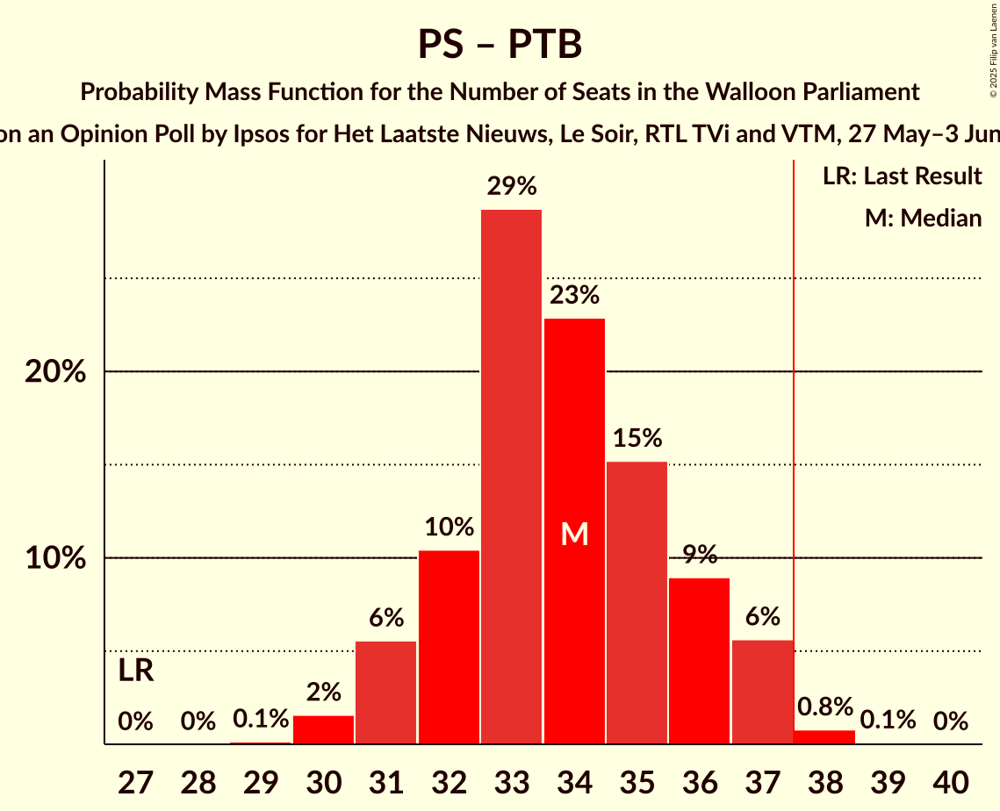

| Number of Seats | Probability | Accumulated | Special Marks |
|:---------------:|:-----------:|:-----------:|:-------------:|
| 27 | 0% | 100% | Last Result |
| 28 | 0% | 100% |  |
| 29 | 0.1% | 100% |  |
| 30 | 2% | 99.8% |  |
| 31 | 6% | 98% |  |
| 32 | 10% | 93% |  |
| 33 | 29% | 82% |  |
| 34 | 23% | 54% | Median |
| 35 | 15% | 31% |  |
| 36 | 9% | 15% |  |
| 37 | 6% | 7% |  |
| 38 | 0.8% | 0.9% | Majority |
| 39 | 0.1% | 0.1% |  |
| 40 | 0% | 0% |  |

### Parti Socialiste – Ecolo

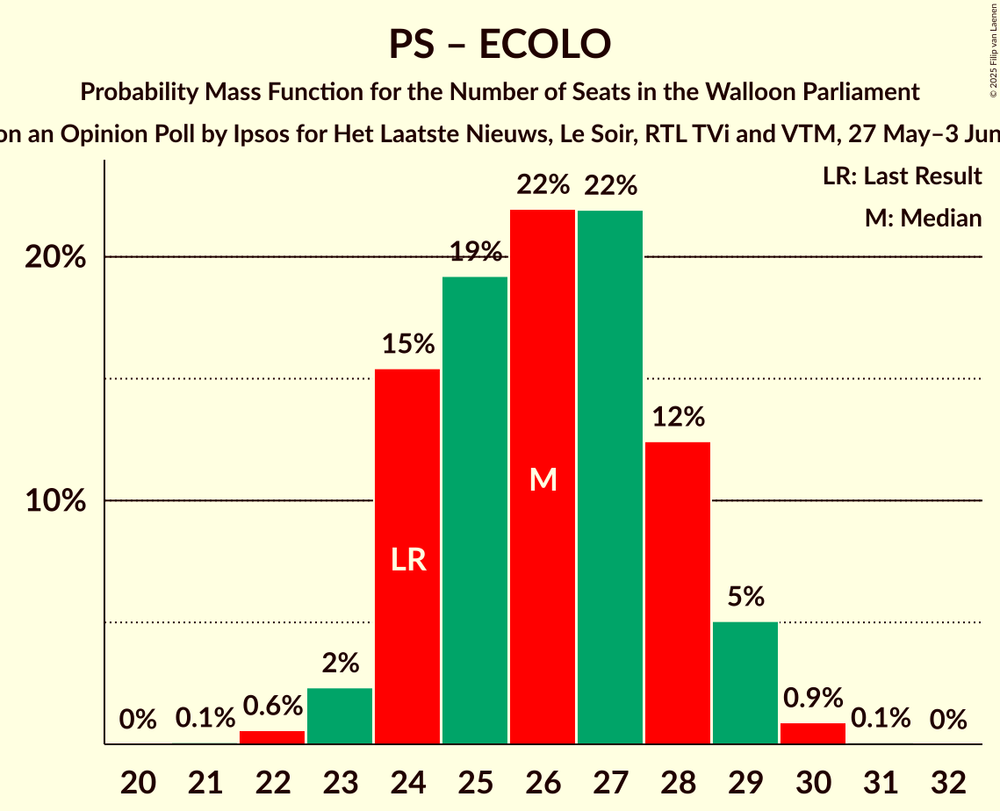

| Number of Seats | Probability | Accumulated | Special Marks |
|:---------------:|:-----------:|:-----------:|:-------------:|
| 21 | 0.1% | 100% |  |
| 22 | 0.6% | 99.9% |  |
| 23 | 2% | 99.3% |  |
| 24 | 15% | 97% | Last Result |
| 25 | 19% | 82% | Median |
| 26 | 22% | 62% |  |
| 27 | 22% | 40% |  |
| 28 | 12% | 18% |  |
| 29 | 5% | 6% |  |
| 30 | 0.9% | 1.0% |  |
| 31 | 0.1% | 0.1% |  |
| 32 | 0% | 0% |  |

### Mouvement Réformateur – Ecolo

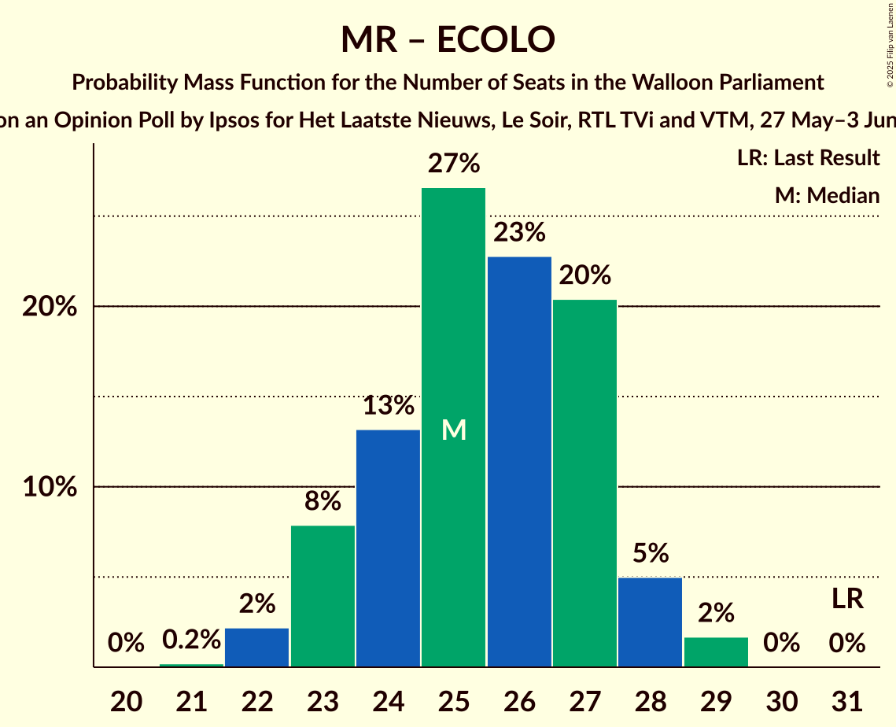

| Number of Seats | Probability | Accumulated | Special Marks |
|:---------------:|:-----------:|:-----------:|:-------------:|
| 21 | 0.2% | 100% |  |
| 22 | 2% | 99.8% |  |
| 23 | 8% | 98% |  |
| 24 | 13% | 90% |  |
| 25 | 27% | 76% | Median |
| 26 | 23% | 50% |  |
| 27 | 20% | 27% |  |
| 28 | 5% | 7% |  |
| 29 | 2% | 2% |  |
| 30 | 0% | 0% |  |
| 31 | 0% | 0% | Last Result |

### Parti du Travail de Belgique – Ecolo

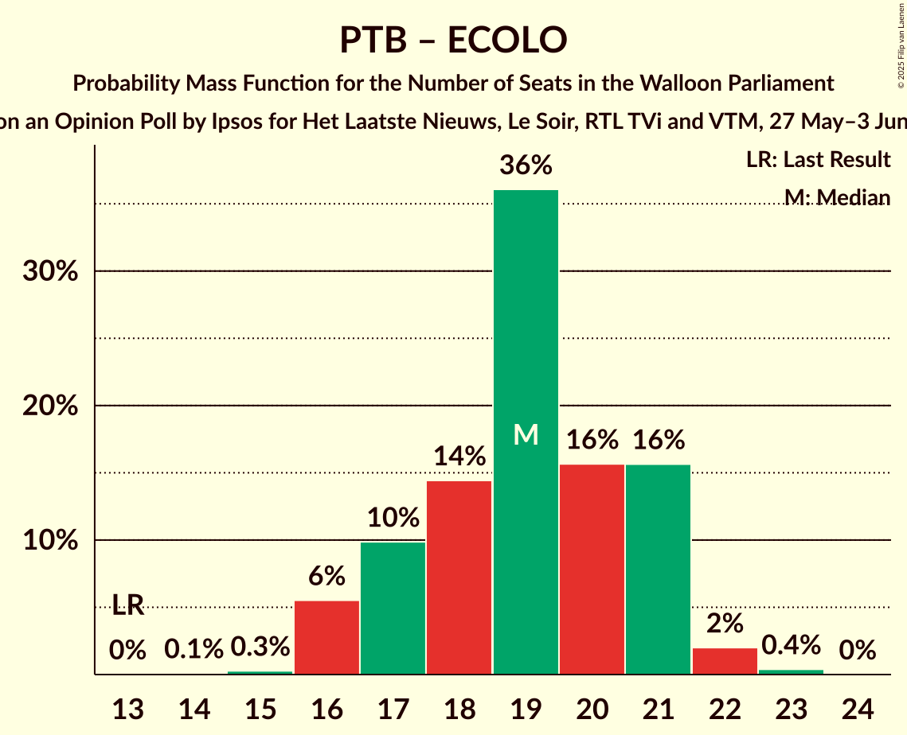

| Number of Seats | Probability | Accumulated | Special Marks |
|:---------------:|:-----------:|:-----------:|:-------------:|
| 13 | 0% | 100% | Last Result |
| 14 | 0.1% | 100% |  |
| 15 | 0.3% | 99.9% |  |
| 16 | 6% | 99.6% |  |
| 17 | 10% | 94% |  |
| 18 | 14% | 84% |  |
| 19 | 36% | 70% | Median |
| 20 | 16% | 34% |  |
| 21 | 16% | 18% |  |
| 22 | 2% | 2% |  |
| 23 | 0.4% | 0.4% |  |
| 24 | 0% | 0% |  |

## Technical Information

### Opinion Poll

+ **Polling firm:** Ipsos
+ **Commissioner(s):** Het Laatste Nieuws, Le Soir, RTL TVi and VTM
+ **Fieldwork period:** 27 May–3 June 2025

### Calculations

+ **Sample size:** 1000
+ **Simulations done:** 2,097,152
+ **Error estimate:** 0.47%

