# Opinion Poll by Ipsos for Het Laatste Nieuws, Le Soir, RTL TVi and VTM, 16–23 September 2025

<a href="#voting-intentions">Voting Intentions</a> | <a href="#seats">Seats</a> | <a href="#coalitions">Coalitions</a> | <a href="#technical-information">Technical Information</a>

## Voting Intentions

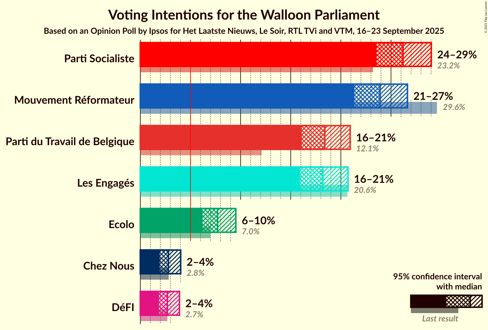

### Confidence Intervals

| Party | Last Result | Poll Result | 80% Confidence Interval | 90% Confidence Interval | 95% Confidence Interval | 99% Confidence Interval |
|:-----:|:-----------:|:-----------:|:-----------------------:|:-----------------------:|:-----------------------:|:-----------------------:|
| Parti Socialiste | 23.2% | 26.2% | 24.5–28.0% |24.0–28.6% |23.6–29.0% |22.8–29.9% |
| Mouvement Réformateur | 29.6% | 23.9% | 22.2–25.7% |21.8–26.2% |21.4–26.6% |20.6–27.5% |
| Parti du Travail de Belgique | 12.1% | 18.4% | 16.9–20.1% |16.5–20.5% |16.1–20.9% |15.4–21.7% |
| Les Engagés | 20.6% | 18.2% | 16.7–19.8% |16.3–20.3% |15.9–20.7% |15.2–21.5% |
| Ecolo | 7.0% | 7.7% | 6.7–8.9% |6.4–9.2% |6.2–9.5% |5.8–10.1% |
| Chez Nous | 2.8% | 2.8% | 2.2–3.6% |2.1–3.8% |1.9–4.0% |1.7–4.4% |
| DéFI | 2.7% | 2.7% | 2.1–3.5% |2.0–3.7% |1.9–3.9% |1.6–4.3% |

*Note:* The poll result column reflects the actual value used in the calculations. Published results may vary slightly, and in addition be rounded to fewer digits.

## Seats

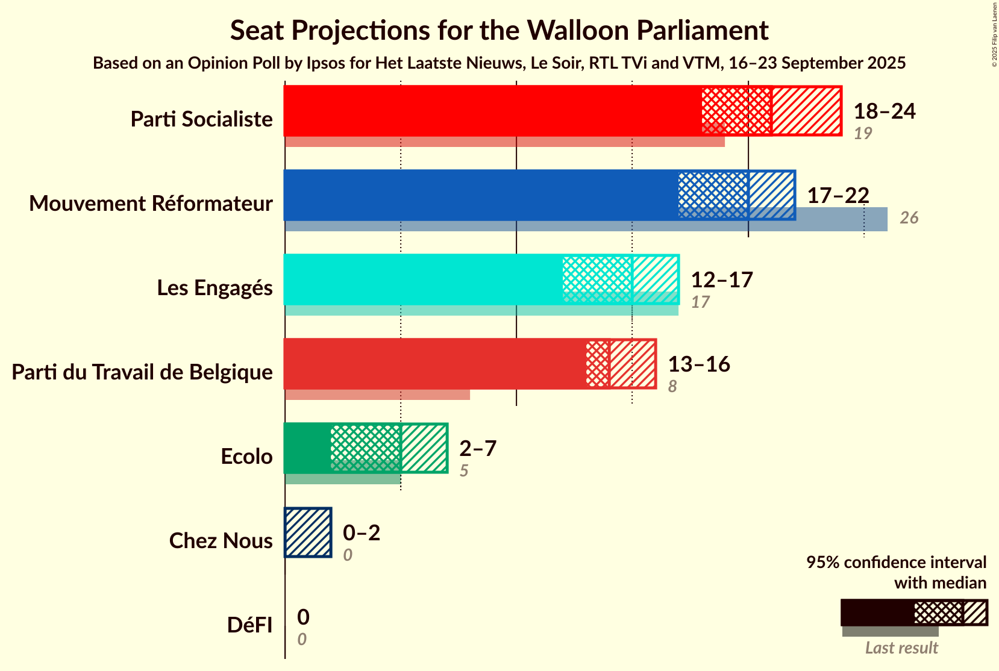

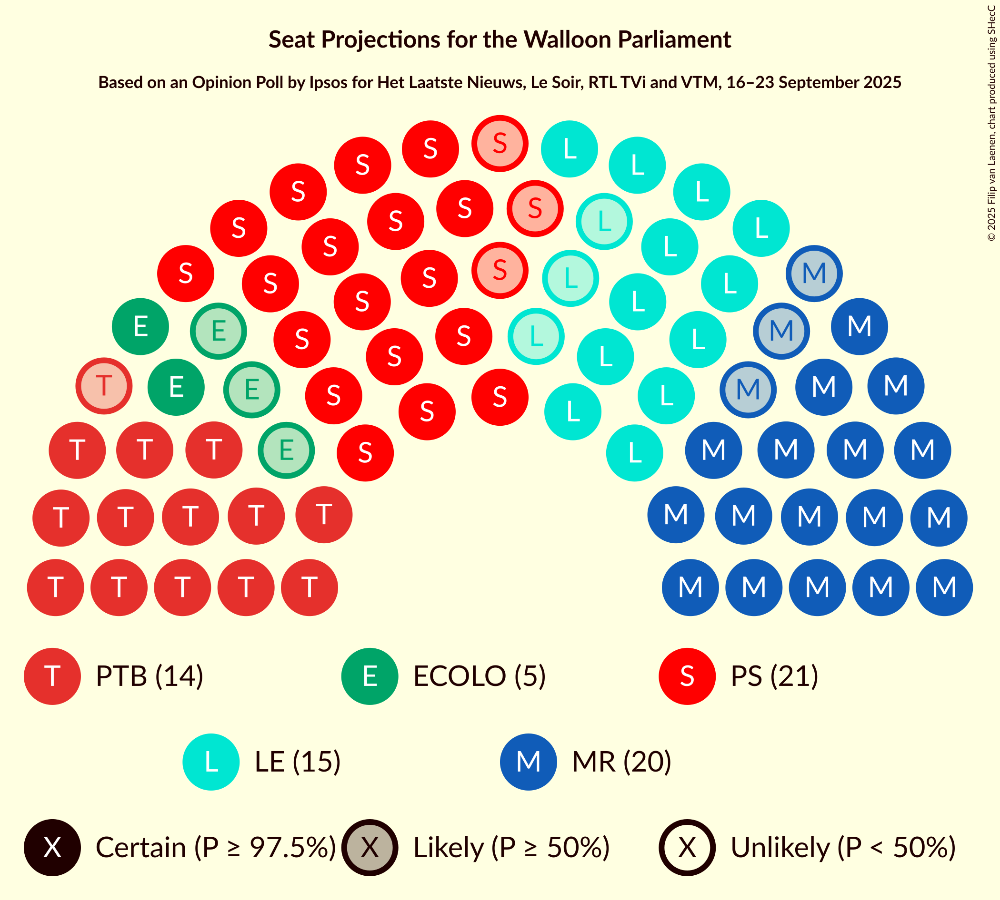

### Confidence Intervals

| Party | Last Result | Median | 80% Confidence Interval | 90% Confidence Interval | 95% Confidence Interval | 99% Confidence Interval |
|:-----:|:-----------:|:------:|:-----------------------:|:-----------------------:|:-----------------------:|:-----------------------:|
| <a href="#parti-socialiste">Parti Socialiste</a> | 19 | 21 | 19–23 |19–23 |18–24 |18–25 |
| <a href="#mouvement-réformateur">Mouvement Réformateur</a> | 26 | 20 | 18–21 |17–22 |17–22 |17–23 |
| <a href="#parti-du-travail-de-belgique">Parti du Travail de Belgique</a> | 8 | 14 | 14–16 |13–16 |13–16 |11–17 |
| <a href="#les-engagés">Les Engagés</a> | 17 | 15 | 13–15 |13–16 |12–17 |12–18 |
| <a href="#ecolo">Ecolo</a> | 5 | 5 | 3–5 |2–6 |2–7 |1–7 |
| <a href="#chez-nous">Chez Nous</a> | 0 | 0 | 0–2 |0–2 |0–2 |0–3 |
| <a href="#défi">DéFI</a> | 0 | 0 | 0 |0 |0 |0 |

### Parti Socialiste

*For a full overview of the results for this party, see the [Parti Socialiste](party-partisocialiste.html) page.*

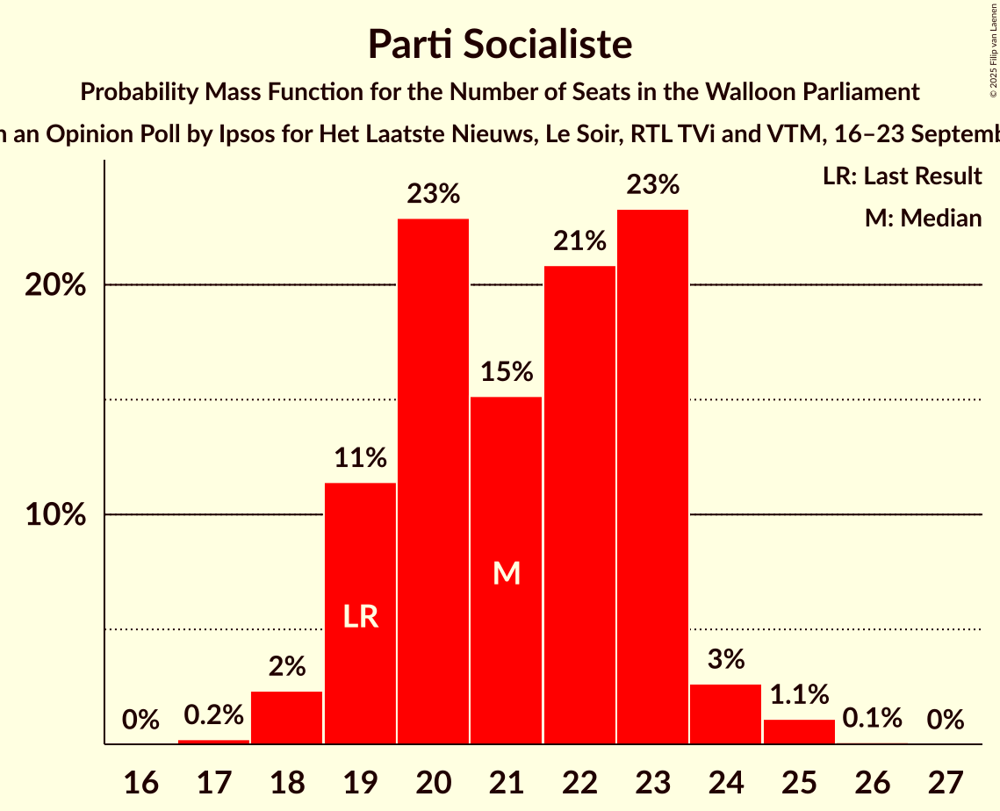

| Number of Seats | Probability | Accumulated | Special Marks |
|:---------------:|:-----------:|:-----------:|:-------------:|
| 17 | 0.2% | 100% |  |
| 18 | 2% | 99.8% |  |
| 19 | 11% | 97% | Last Result |
| 20 | 23% | 86% |  |
| 21 | 15% | 63% | Median |
| 22 | 21% | 48% |  |
| 23 | 23% | 27% |  |
| 24 | 3% | 4% |  |
| 25 | 1.1% | 1.2% |  |
| 26 | 0.1% | 0.1% |  |
| 27 | 0% | 0% |  |

### Mouvement Réformateur

*For a full overview of the results for this party, see the [Mouvement Réformateur](party-mouvementréformateur.html) page.*

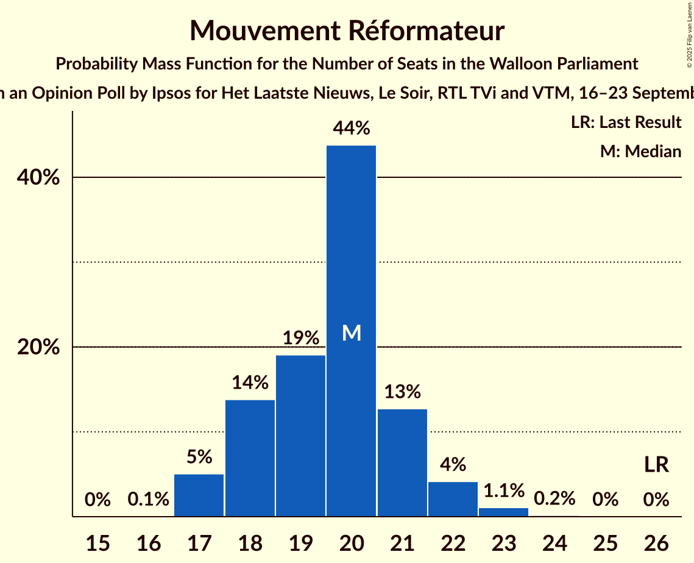

| Number of Seats | Probability | Accumulated | Special Marks |
|:---------------:|:-----------:|:-----------:|:-------------:|
| 16 | 0.1% | 100% |  |
| 17 | 5% | 99.9% |  |
| 18 | 14% | 95% |  |
| 19 | 19% | 81% |  |
| 20 | 44% | 62% | Median |
| 21 | 13% | 18% |  |
| 22 | 4% | 5% |  |
| 23 | 1.1% | 1.3% |  |
| 24 | 0.2% | 0.2% |  |
| 25 | 0% | 0% |  |
| 26 | 0% | 0% | Last Result |

### Parti du Travail de Belgique

*For a full overview of the results for this party, see the [Parti du Travail de Belgique](party-partidutravaildebelgique.html) page.*

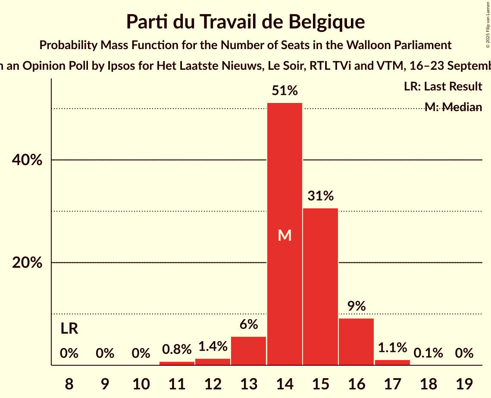

| Number of Seats | Probability | Accumulated | Special Marks |
|:---------------:|:-----------:|:-----------:|:-------------:|
| 8 | 0% | 100% | Last Result |
| 9 | 0% | 100% |  |
| 10 | 0% | 100% |  |
| 11 | 0.8% | 100% |  |
| 12 | 1.4% | 99.2% |  |
| 13 | 6% | 98% |  |
| 14 | 51% | 92% | Median |
| 15 | 31% | 41% |  |
| 16 | 9% | 10% |  |
| 17 | 1.1% | 1.2% |  |
| 18 | 0.1% | 0.1% |  |
| 19 | 0% | 0% |  |

### Les Engagés

*For a full overview of the results for this party, see the [Les Engagés](party-lesengagés.html) page.*

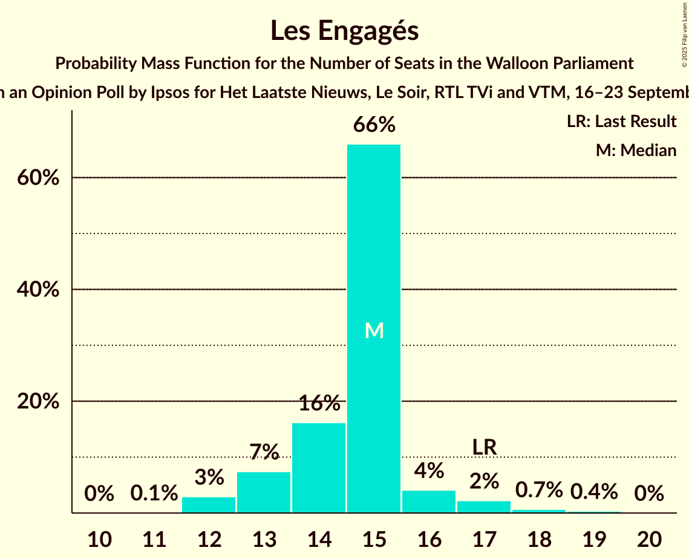

| Number of Seats | Probability | Accumulated | Special Marks |
|:---------------:|:-----------:|:-----------:|:-------------:|
| 11 | 0.1% | 100% |  |
| 12 | 3% | 99.9% |  |
| 13 | 7% | 97% |  |
| 14 | 16% | 90% |  |
| 15 | 66% | 73% | Median |
| 16 | 4% | 7% |  |
| 17 | 2% | 3% | Last Result |
| 18 | 0.7% | 1.0% |  |
| 19 | 0.4% | 0.4% |  |
| 20 | 0% | 0% |  |

### Ecolo

*For a full overview of the results for this party, see the [Ecolo](party-ecolo.html) page.*

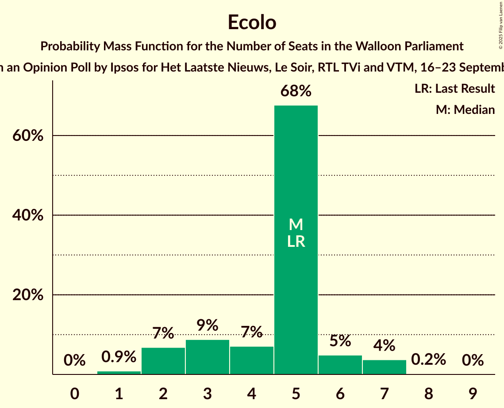

| Number of Seats | Probability | Accumulated | Special Marks |
|:---------------:|:-----------:|:-----------:|:-------------:|
| 1 | 0.9% | 100% |  |
| 2 | 7% | 99.1% |  |
| 3 | 9% | 92% |  |
| 4 | 7% | 84% |  |
| 5 | 68% | 76% | Last Result, Median |
| 6 | 5% | 9% |  |
| 7 | 4% | 4% |  |
| 8 | 0.2% | 0.2% |  |
| 9 | 0% | 0% |  |

### Chez Nous

*For a full overview of the results for this party, see the [Chez Nous](party-cheznous.html) page.*

| Number of Seats | Probability | Accumulated | Special Marks |
|:---------------:|:-----------:|:-----------:|:-------------:|
| 0 | 84% | 100% | Last Result, Median |
| 1 | 0.4% | 16% |  |
| 2 | 15% | 16% |  |
| 3 | 0.5% | 0.6% |  |
| 4 | 0% | 0% |  |

### DéFI

*For a full overview of the results for this party, see the [DéFI](party-défi.html) page.*

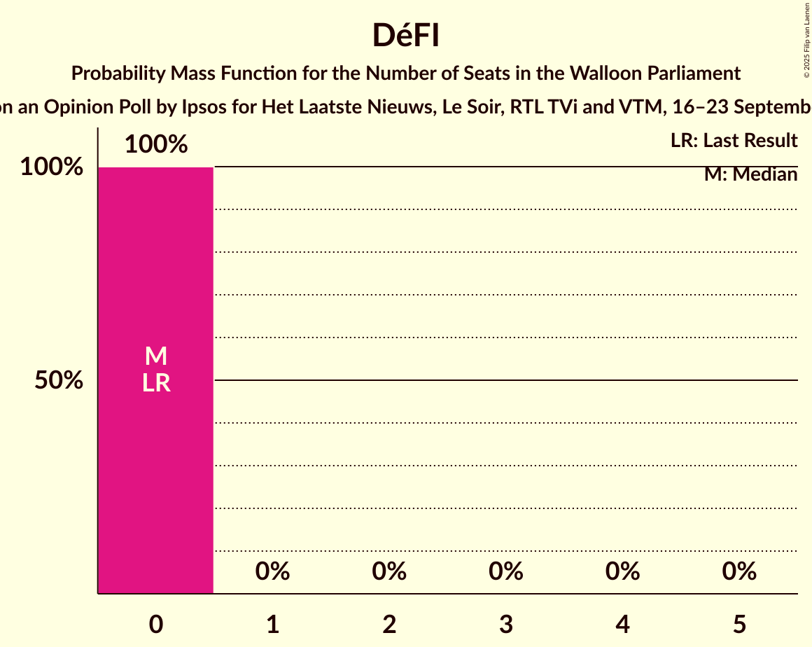

| Number of Seats | Probability | Accumulated | Special Marks |
|:---------------:|:-----------:|:-----------:|:-------------:|
| 0 | 100% | 100% | Last Result, Median |

## Coalitions

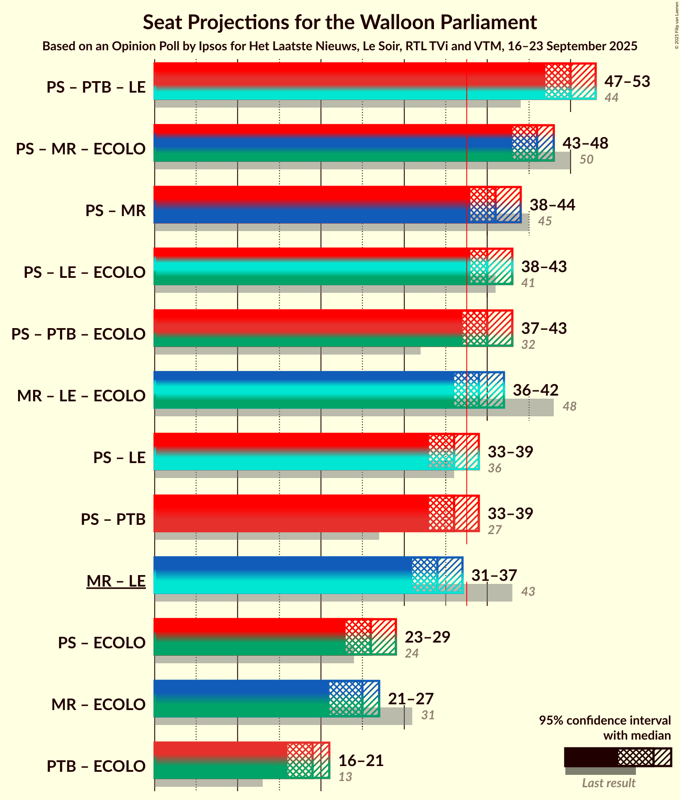

### Confidence Intervals

| Coalition | Last Result | Median | Majority? | 80% Confidence Interval | 90% Confidence Interval | 95% Confidence Interval | 99% Confidence Interval |
|:---------:|:-----------:|:------:|:---------:|:-----------------------:|:-----------------------:|:-----------------------:|:-----------------------:|
| Parti Socialiste – Parti du Travail de Belgique – Les Engagés | 44 | 50 | 100% | 48–53 | 48–53 | 47–53 | 46–54 |
| Parti Socialiste – Mouvement Réformateur – Ecolo | 50 | 46 | 100% | 44–47 | 43–48 | 43–48 | 42–49 |
| Parti Socialiste – Mouvement Réformateur | 45 | 41 | 98.5% | 39–43 | 39–43 | 38–44 | 37–45 |
| Parti Socialiste – Les Engagés – Ecolo | 41 | 40 | 98% | 39–43 | 38–43 | 38–43 | 37–44 |
| Parti Socialiste – Parti du Travail de Belgique – Ecolo | 32 | 40 | 97% | 38–42 | 38–43 | 37–43 | 36–44 |
| Mouvement Réformateur – Les Engagés – Ecolo | 48 | 39 | 82% | 37–41 | 36–42 | 36–42 | 35–43 |
| Parti Socialiste – Les Engagés | 36 | 36 | 21% | 34–38 | 33–38 | 33–39 | 32–40 |
| Parti Socialiste – Parti du Travail de Belgique | 27 | 36 | 14% | 34–38 | 33–38 | 33–39 | 32–39 |
| Mouvement Réformateur – Les Engagés | 43 | 34 | 1.3% | 33–36 | 32–37 | 31–37 | 31–38 |
| Parti Socialiste – Ecolo | 24 | 26 | 0% | 24–28 | 23–28 | 23–29 | 22–30 |
| Mouvement Réformateur – Ecolo | 31 | 25 | 0% | 22–26 | 22–27 | 21–27 | 21–28 |
| Parti du Travail de Belgique – Ecolo | 13 | 19 | 0% | 17–21 | 17–21 | 16–21 | 15–23 |

### Parti Socialiste – Parti du Travail de Belgique – Les Engagés

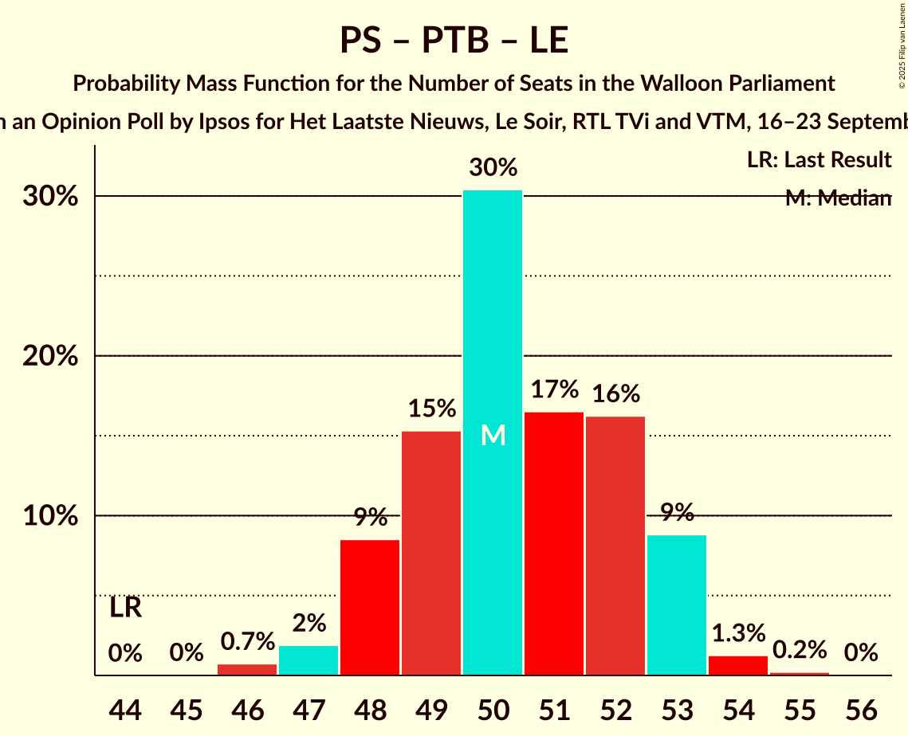

| Number of Seats | Probability | Accumulated | Special Marks |
|:---------------:|:-----------:|:-----------:|:-------------:|
| 44 | 0% | 100% | Last Result |
| 45 | 0% | 100% |  |
| 46 | 0.7% | 99.9% |  |
| 47 | 2% | 99.2% |  |
| 48 | 9% | 97% |  |
| 49 | 15% | 89% |  |
| 50 | 30% | 73% | Median |
| 51 | 17% | 43% |  |
| 52 | 16% | 27% |  |
| 53 | 9% | 10% |  |
| 54 | 1.3% | 2% |  |
| 55 | 0.2% | 0.3% |  |
| 56 | 0% | 0% |  |

### Parti Socialiste – Mouvement Réformateur – Ecolo

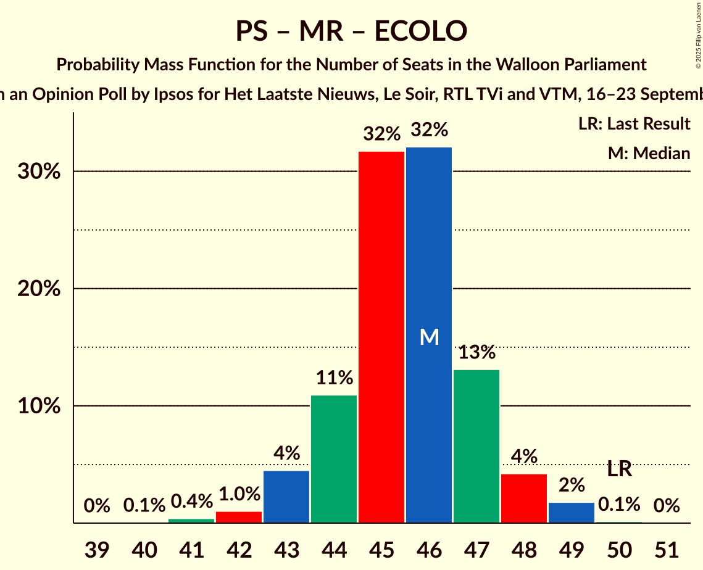

| Number of Seats | Probability | Accumulated | Special Marks |
|:---------------:|:-----------:|:-----------:|:-------------:|
| 40 | 0.1% | 100% |  |
| 41 | 0.4% | 99.9% |  |
| 42 | 1.0% | 99.5% |  |
| 43 | 4% | 98.5% |  |
| 44 | 11% | 94% |  |
| 45 | 32% | 83% |  |
| 46 | 32% | 51% | Median |
| 47 | 13% | 19% |  |
| 48 | 4% | 6% |  |
| 49 | 2% | 2% |  |
| 50 | 0.1% | 0.2% | Last Result |
| 51 | 0% | 0% |  |

### Parti Socialiste – Mouvement Réformateur

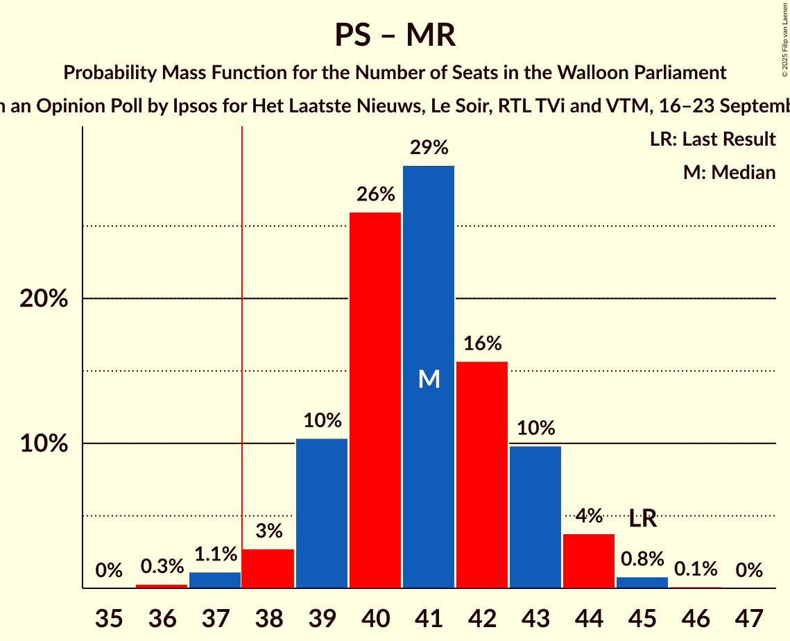

| Number of Seats | Probability | Accumulated | Special Marks |
|:---------------:|:-----------:|:-----------:|:-------------:|
| 36 | 0.3% | 100% |  |
| 37 | 1.1% | 99.7% |  |
| 38 | 3% | 98.5% | Majority |
| 39 | 10% | 96% |  |
| 40 | 26% | 85% |  |
| 41 | 29% | 59% | Median |
| 42 | 16% | 30% |  |
| 43 | 10% | 15% |  |
| 44 | 4% | 5% |  |
| 45 | 0.8% | 0.9% | Last Result |
| 46 | 0.1% | 0.1% |  |
| 47 | 0% | 0% |  |

### Parti Socialiste – Les Engagés – Ecolo

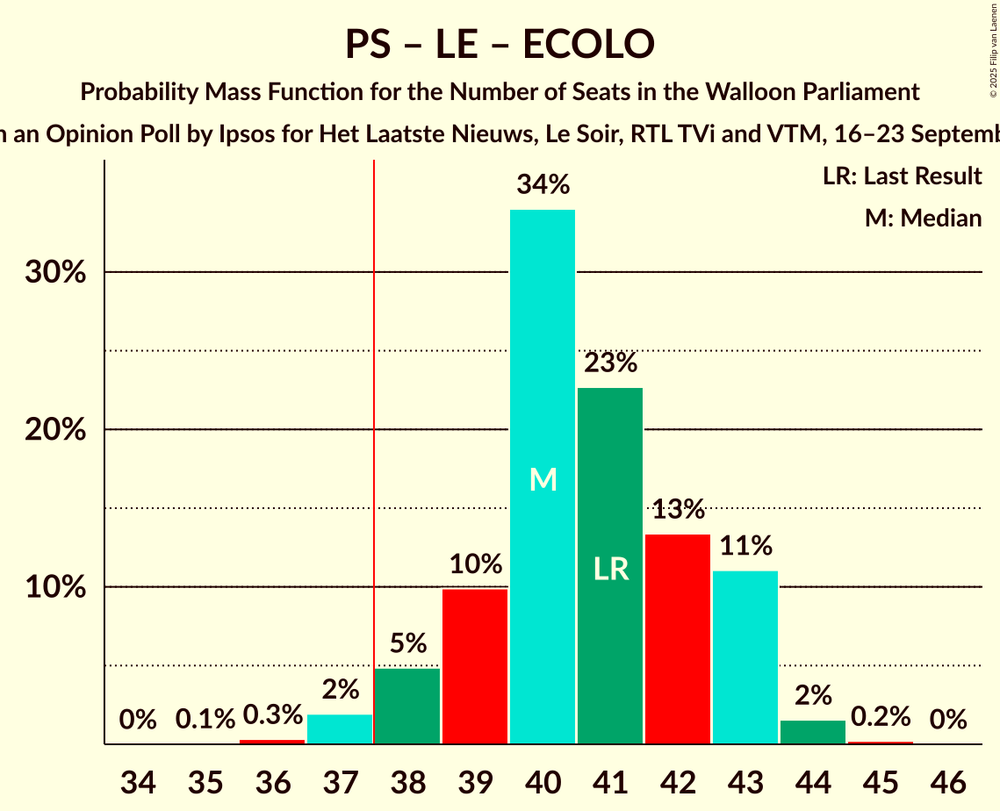

| Number of Seats | Probability | Accumulated | Special Marks |
|:---------------:|:-----------:|:-----------:|:-------------:|
| 35 | 0.1% | 100% |  |
| 36 | 0.3% | 99.9% |  |
| 37 | 2% | 99.6% |  |
| 38 | 5% | 98% | Majority |
| 39 | 10% | 93% |  |
| 40 | 34% | 83% |  |
| 41 | 23% | 49% | Last Result, Median |
| 42 | 13% | 26% |  |
| 43 | 11% | 13% |  |
| 44 | 2% | 2% |  |
| 45 | 0.2% | 0.2% |  |
| 46 | 0% | 0% |  |

### Parti Socialiste – Parti du Travail de Belgique – Ecolo

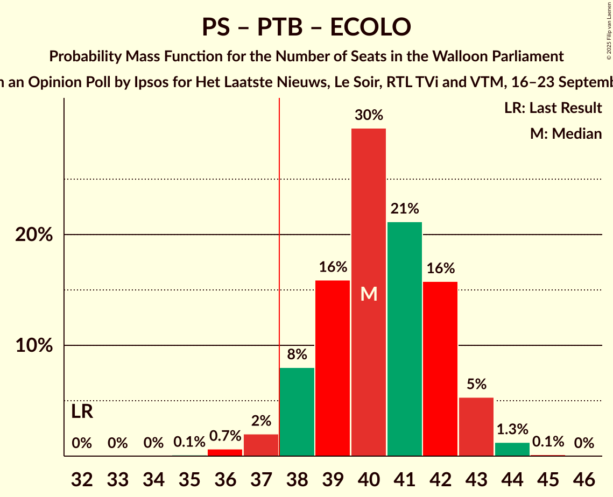

| Number of Seats | Probability | Accumulated | Special Marks |
|:---------------:|:-----------:|:-----------:|:-------------:|
| 32 | 0% | 100% | Last Result |
| 33 | 0% | 100% |  |
| 34 | 0% | 100% |  |
| 35 | 0.1% | 100% |  |
| 36 | 0.7% | 99.9% |  |
| 37 | 2% | 99.2% |  |
| 38 | 8% | 97% | Majority |
| 39 | 16% | 89% |  |
| 40 | 30% | 73% | Median |
| 41 | 21% | 44% |  |
| 42 | 16% | 22% |  |
| 43 | 5% | 7% |  |
| 44 | 1.3% | 1.4% |  |
| 45 | 0.1% | 0.1% |  |
| 46 | 0% | 0% |  |

### Mouvement Réformateur – Les Engagés – Ecolo

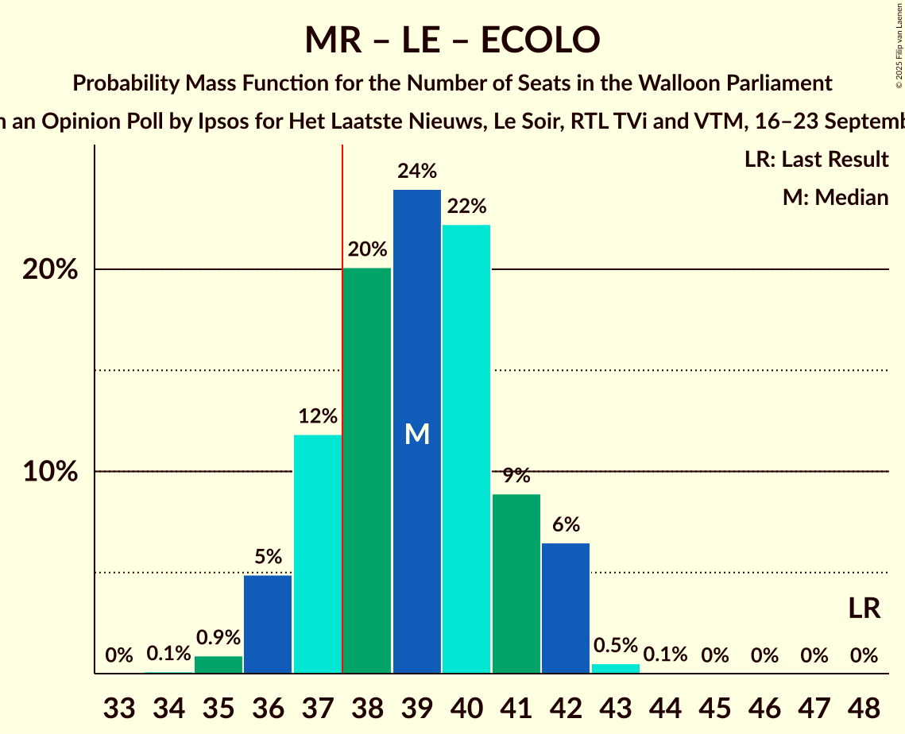

| Number of Seats | Probability | Accumulated | Special Marks |
|:---------------:|:-----------:|:-----------:|:-------------:|
| 34 | 0.1% | 100% |  |
| 35 | 0.9% | 99.9% |  |
| 36 | 5% | 99.0% |  |
| 37 | 12% | 94% |  |
| 38 | 20% | 82% | Majority |
| 39 | 24% | 62% |  |
| 40 | 22% | 38% | Median |
| 41 | 9% | 16% |  |
| 42 | 6% | 7% |  |
| 43 | 0.5% | 0.6% |  |
| 44 | 0.1% | 0.1% |  |
| 45 | 0% | 0% |  |
| 46 | 0% | 0% |  |
| 47 | 0% | 0% |  |
| 48 | 0% | 0% | Last Result |

### Parti Socialiste – Les Engagés

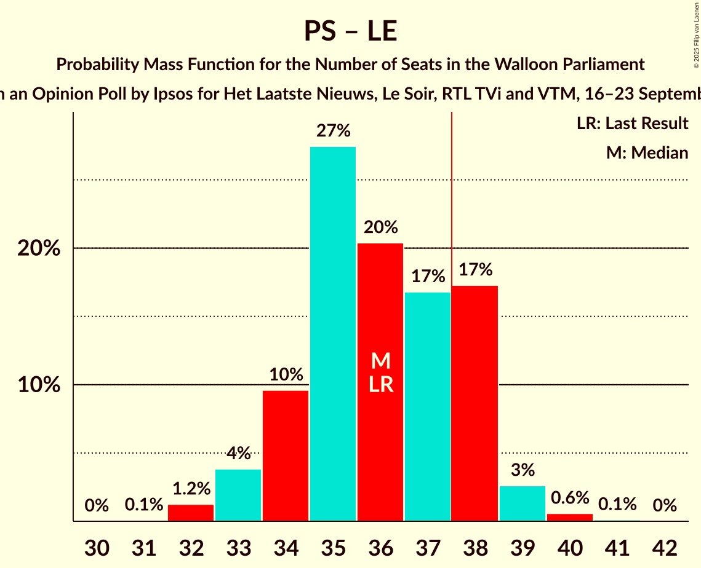

| Number of Seats | Probability | Accumulated | Special Marks |
|:---------------:|:-----------:|:-----------:|:-------------:|
| 31 | 0.1% | 100% |  |
| 32 | 1.2% | 99.9% |  |
| 33 | 4% | 98.7% |  |
| 34 | 10% | 95% |  |
| 35 | 27% | 85% |  |
| 36 | 20% | 58% | Last Result, Median |
| 37 | 17% | 37% |  |
| 38 | 17% | 21% | Majority |
| 39 | 3% | 3% |  |
| 40 | 0.6% | 0.7% |  |
| 41 | 0.1% | 0.1% |  |
| 42 | 0% | 0% |  |

### Parti Socialiste – Parti du Travail de Belgique

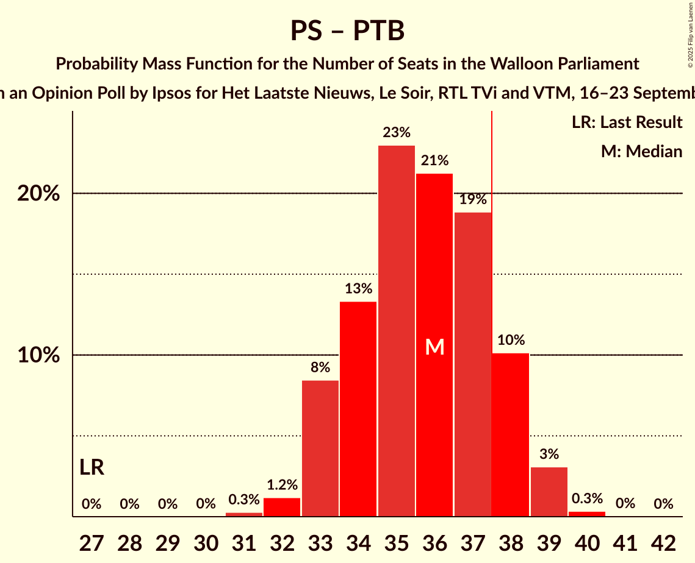

| Number of Seats | Probability | Accumulated | Special Marks |
|:---------------:|:-----------:|:-----------:|:-------------:|
| 27 | 0% | 100% | Last Result |
| 28 | 0% | 100% |  |
| 29 | 0% | 100% |  |
| 30 | 0% | 100% |  |
| 31 | 0.3% | 100% |  |
| 32 | 1.2% | 99.7% |  |
| 33 | 8% | 98.5% |  |
| 34 | 13% | 90% |  |
| 35 | 23% | 77% | Median |
| 36 | 21% | 54% |  |
| 37 | 19% | 32% |  |
| 38 | 10% | 14% | Majority |
| 39 | 3% | 3% |  |
| 40 | 0.3% | 0.4% |  |
| 41 | 0% | 0.1% |  |
| 42 | 0% | 0% |  |

### Mouvement Réformateur – Les Engagés

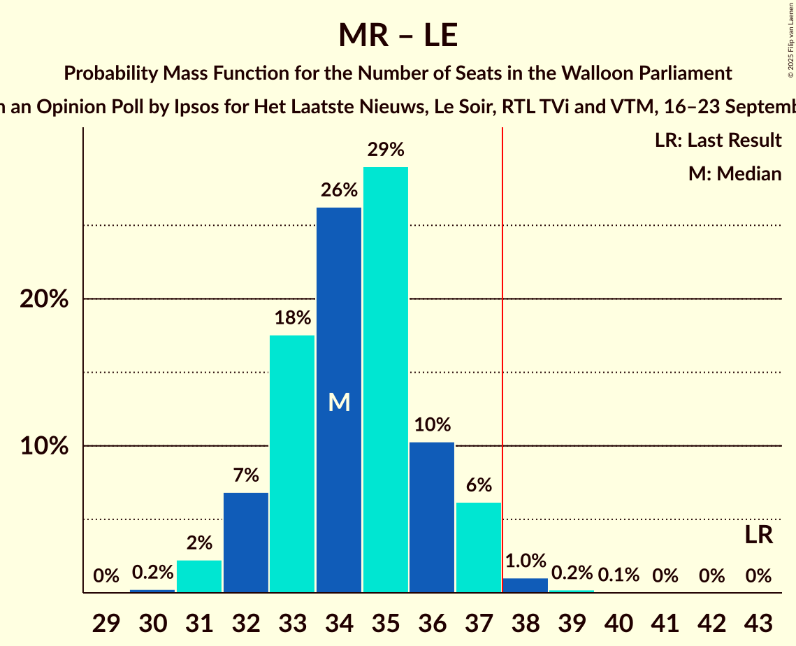

| Number of Seats | Probability | Accumulated | Special Marks |
|:---------------:|:-----------:|:-----------:|:-------------:|
| 30 | 0.2% | 100% |  |
| 31 | 2% | 99.7% |  |
| 32 | 7% | 97% |  |
| 33 | 18% | 91% |  |
| 34 | 26% | 73% |  |
| 35 | 29% | 47% | Median |
| 36 | 10% | 18% |  |
| 37 | 6% | 8% |  |
| 38 | 1.0% | 1.3% | Majority |
| 39 | 0.2% | 0.3% |  |
| 40 | 0.1% | 0.1% |  |
| 41 | 0% | 0% |  |
| 42 | 0% | 0% |  |
| 43 | 0% | 0% | Last Result |

### Parti Socialiste – Ecolo

| Number of Seats | Probability | Accumulated | Special Marks |
|:---------------:|:-----------:|:-----------:|:-------------:|
| 20 | 0.1% | 100% |  |
| 21 | 0.4% | 99.9% |  |
| 22 | 1.3% | 99.5% |  |
| 23 | 4% | 98% |  |
| 24 | 10% | 95% | Last Result |
| 25 | 29% | 84% |  |
| 26 | 18% | 56% | Median |
| 27 | 19% | 37% |  |
| 28 | 15% | 18% |  |
| 29 | 2% | 3% |  |
| 30 | 0.7% | 0.7% |  |
| 31 | 0% | 0% |  |

### Mouvement Réformateur – Ecolo

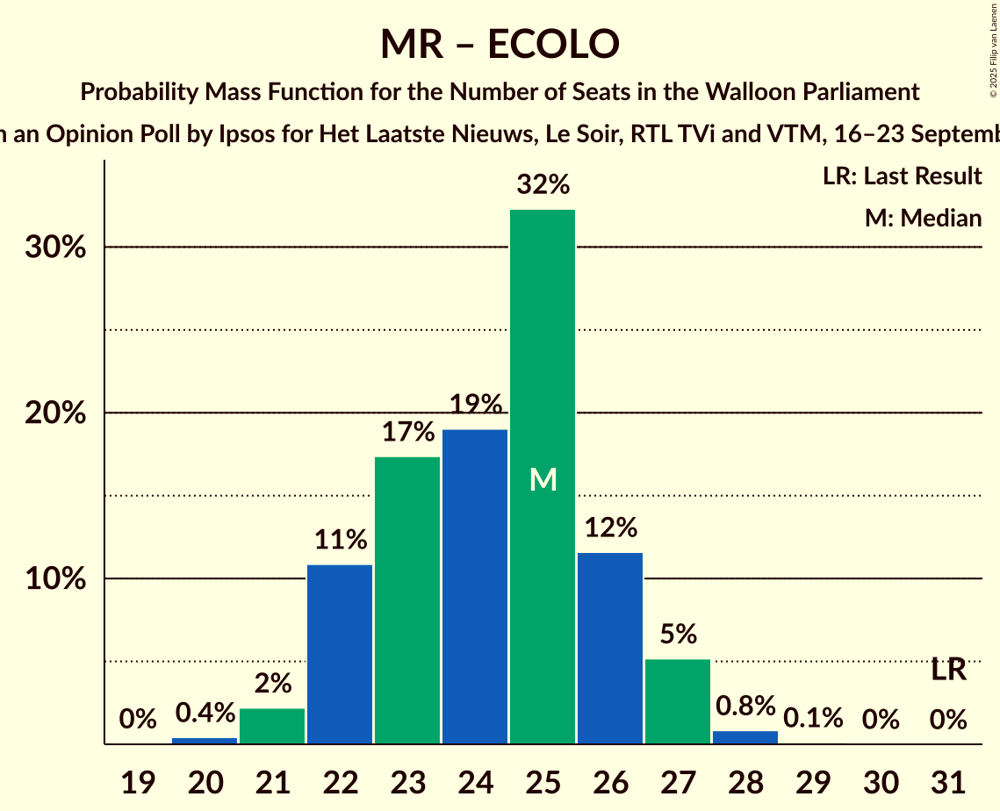

| Number of Seats | Probability | Accumulated | Special Marks |
|:---------------:|:-----------:|:-----------:|:-------------:|
| 19 | 0% | 100% |  |
| 20 | 0.4% | 99.9% |  |
| 21 | 2% | 99.5% |  |
| 22 | 11% | 97% |  |
| 23 | 17% | 86% |  |
| 24 | 19% | 69% |  |
| 25 | 32% | 50% | Median |
| 26 | 12% | 18% |  |
| 27 | 5% | 6% |  |
| 28 | 0.8% | 1.0% |  |
| 29 | 0.1% | 0.1% |  |
| 30 | 0% | 0% |  |
| 31 | 0% | 0% | Last Result |

### Parti du Travail de Belgique – Ecolo

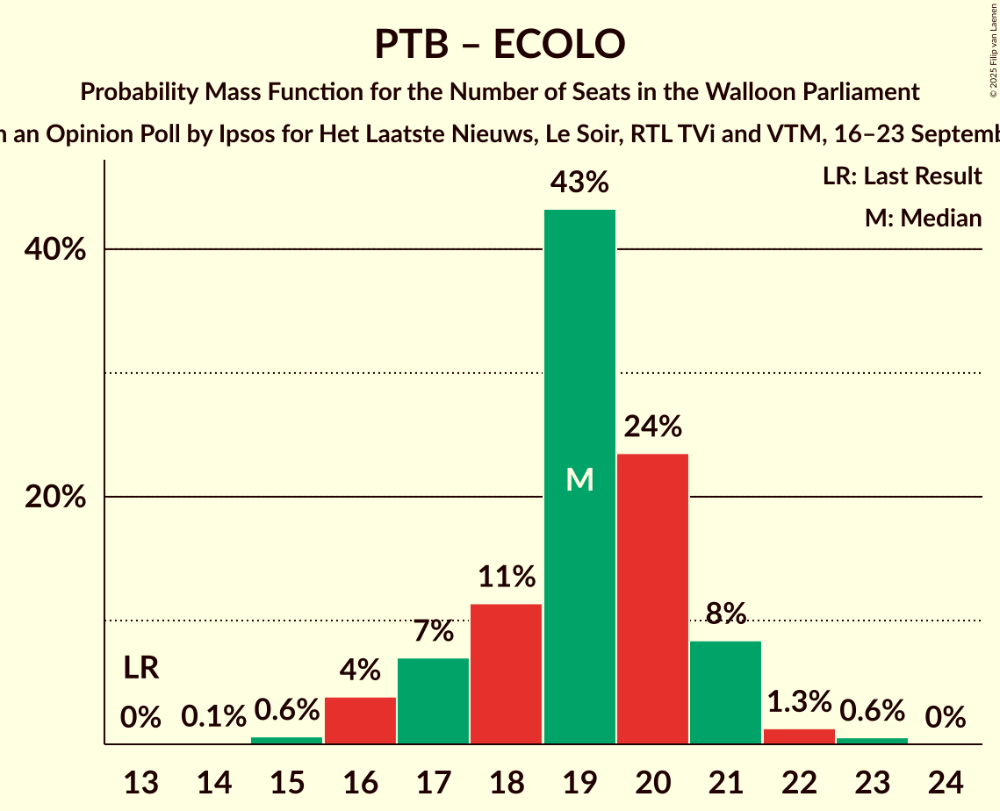

| Number of Seats | Probability | Accumulated | Special Marks |
|:---------------:|:-----------:|:-----------:|:-------------:|
| 13 | 0% | 100% | Last Result |
| 14 | 0.1% | 100% |  |
| 15 | 0.6% | 99.9% |  |
| 16 | 4% | 99.3% |  |
| 17 | 7% | 95% |  |
| 18 | 11% | 88% |  |
| 19 | 43% | 77% | Median |
| 20 | 24% | 34% |  |
| 21 | 8% | 10% |  |
| 22 | 1.3% | 2% |  |
| 23 | 0.6% | 0.6% |  |
| 24 | 0% | 0% |  |

## Technical Information

### Opinion Poll

+ **Polling firm:** Ipsos
+ **Commissioner(s):** Het Laatste Nieuws, Le Soir, RTL TVi and VTM
+ **Fieldwork period:** 16–23 September 2025

### Calculations

+ **Sample size:** 1000
+ **Simulations done:** 2,097,152
+ **Error estimate:** 1.11%

