# Opinion Poll by Ipsos for Het Laatste Nieuws, Le Soir, RTL TVi and VTM, 1–9 December 2025

<a href="#voting-intentions">Voting Intentions</a> | <a href="#seats">Seats</a> | <a href="#coalitions">Coalitions</a> | <a href="#technical-information">Technical Information</a>

## Voting Intentions

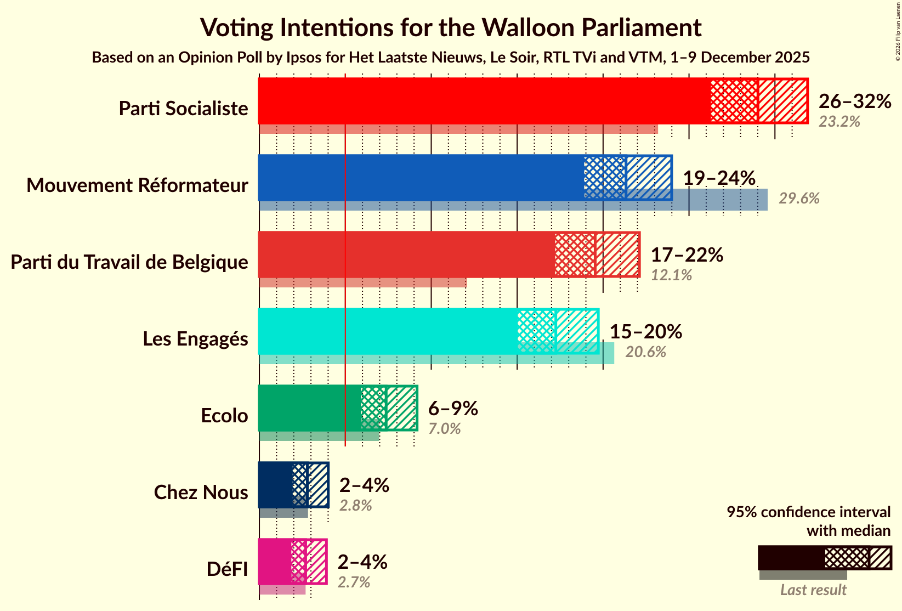

### Confidence Intervals

| Party | Last Result | Poll Result | 80% Confidence Interval | 90% Confidence Interval | 95% Confidence Interval | 99% Confidence Interval |
|:-----:|:-----------:|:-----------:|:-----------------------:|:-----------------------:|:-----------------------:|:-----------------------:|
| Parti Socialiste | 23.2% | 29.0% | 27.2–30.9% |26.7–31.4% |26.3–31.9% |25.4–32.8% |
| Mouvement Réformateur | 29.6% | 21.3% | 19.7–23.1% |19.3–23.6% |18.9–24.0% |18.2–24.8% |
| Parti du Travail de Belgique | 12.1% | 19.5% | 18.0–21.2% |17.6–21.7% |17.2–22.1% |16.5–22.9% |
| Les Engagés | 20.6% | 17.2% | 15.8–18.9% |15.4–19.3% |15.0–19.7% |14.4–20.5% |
| Ecolo | 7.0% | 7.4% | 6.4–8.6% |6.1–8.9% |5.9–9.2% |5.5–9.8% |
| Chez Nous | 2.8% | 2.8% | 2.2–3.6% |2.1–3.8% |1.9–4.0% |1.7–4.4% |
| DéFI | 2.7% | 2.7% | 2.1–3.5% |2.0–3.7% |1.9–3.9% |1.6–4.3% |

*Note:* The poll result column reflects the actual value used in the calculations. Published results may vary slightly, and in addition be rounded to fewer digits.

## Seats

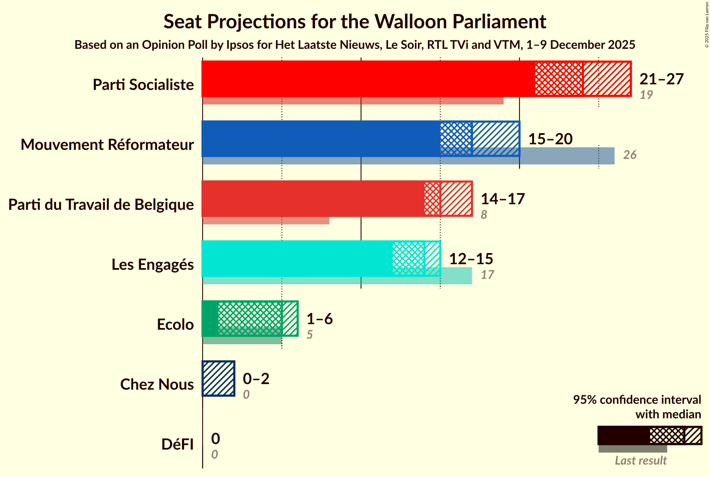

### Confidence Intervals

| Party | Last Result | Median | 80% Confidence Interval | 90% Confidence Interval | 95% Confidence Interval | 99% Confidence Interval |
|:-----:|:-----------:|:------:|:-----------------------:|:-----------------------:|:-----------------------:|:-----------------------:|
| <a href="#parti-socialiste">Parti Socialiste</a> | 19 | 24 | 23–26 |22–26 |21–27 |20–27 |
| <a href="#mouvement-réformateur">Mouvement Réformateur</a> | 26 | 17 | 16–19 |15–20 |15–20 |14–20 |
| <a href="#parti-du-travail-de-belgique">Parti du Travail de Belgique</a> | 8 | 15 | 14–16 |14–17 |14–17 |13–18 |
| <a href="#les-engagés">Les Engagés</a> | 17 | 14 | 13–15 |12–15 |12–15 |11–16 |
| <a href="#ecolo">Ecolo</a> | 5 | 5 | 2–5 |2–5 |1–6 |1–6 |
| <a href="#chez-nous">Chez Nous</a> | 0 | 0 | 0–2 |0–2 |0–2 |0–2 |
| <a href="#défi">DéFI</a> | 0 | 0 | 0 |0 |0 |0 |

### Parti Socialiste

*For a full overview of the results for this party, see the [Parti Socialiste](party-partisocialiste.html) page.*

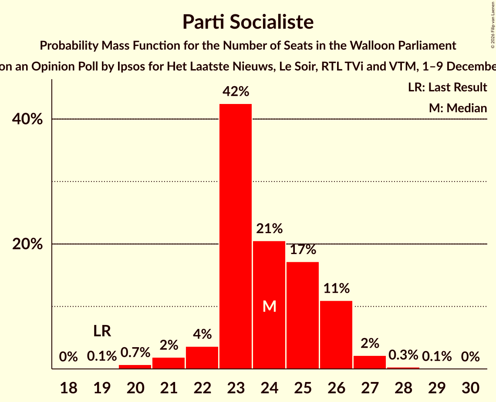

| Number of Seats | Probability | Accumulated | Special Marks |
|:---------------:|:-----------:|:-----------:|:-------------:|
| 19 | 0.1% | 100% | Last Result |
| 20 | 0.7% | 99.9% |  |
| 21 | 2% | 99.2% |  |
| 22 | 4% | 97% |  |
| 23 | 42% | 94% |  |
| 24 | 21% | 51% | Median |
| 25 | 17% | 31% |  |
| 26 | 11% | 13% |  |
| 27 | 2% | 3% |  |
| 28 | 0.3% | 0.4% |  |
| 29 | 0.1% | 0.1% |  |
| 30 | 0% | 0% |  |

### Mouvement Réformateur

*For a full overview of the results for this party, see the [Mouvement Réformateur](party-mouvementréformateur.html) page.*

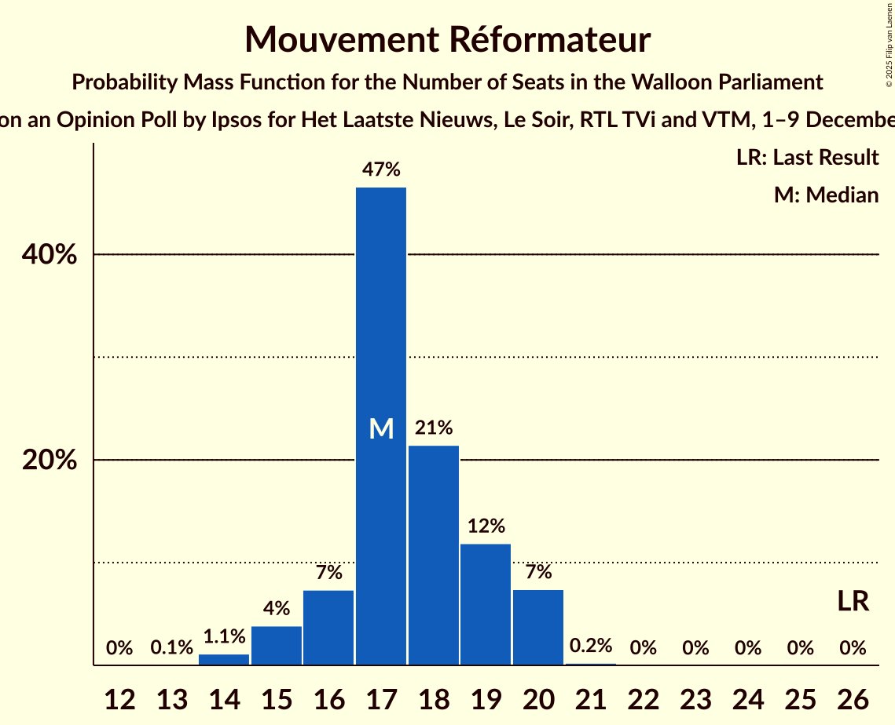

| Number of Seats | Probability | Accumulated | Special Marks |
|:---------------:|:-----------:|:-----------:|:-------------:|
| 13 | 0.1% | 100% |  |
| 14 | 1.1% | 99.9% |  |
| 15 | 4% | 98.8% |  |
| 16 | 7% | 95% |  |
| 17 | 47% | 88% | Median |
| 18 | 21% | 41% |  |
| 19 | 12% | 20% |  |
| 20 | 7% | 8% |  |
| 21 | 0.2% | 0.3% |  |
| 22 | 0% | 0% |  |
| 23 | 0% | 0% |  |
| 24 | 0% | 0% |  |
| 25 | 0% | 0% |  |
| 26 | 0% | 0% | Last Result |

### Parti du Travail de Belgique

*For a full overview of the results for this party, see the [Parti du Travail de Belgique](party-partidutravaildebelgique.html) page.*

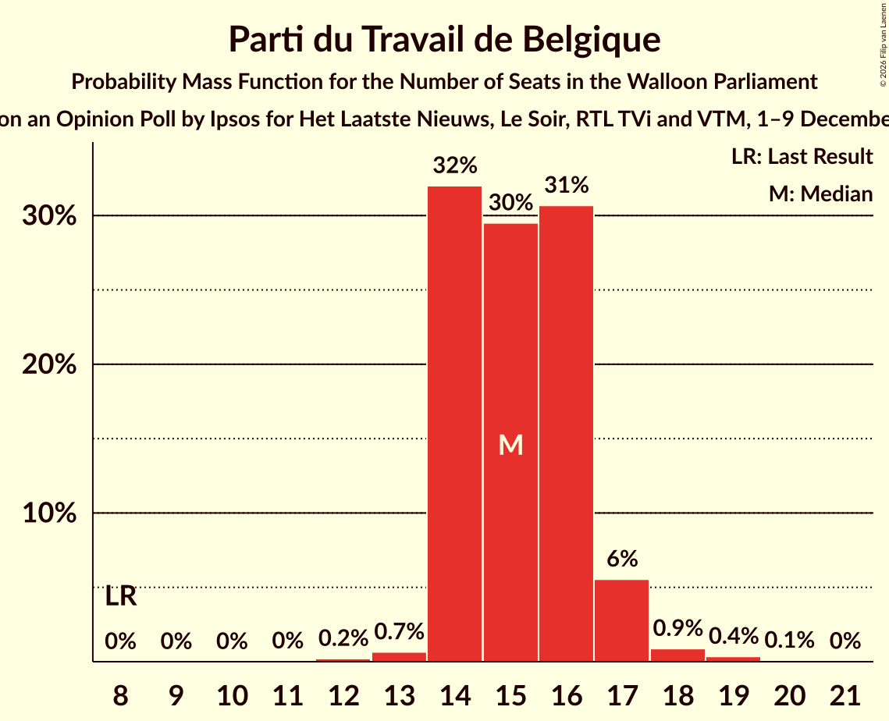

| Number of Seats | Probability | Accumulated | Special Marks |
|:---------------:|:-----------:|:-----------:|:-------------:|
| 8 | 0% | 100% | Last Result |
| 9 | 0% | 100% |  |
| 10 | 0% | 100% |  |
| 11 | 0% | 100% |  |
| 12 | 0.2% | 100% |  |
| 13 | 0.7% | 99.7% |  |
| 14 | 32% | 99.1% |  |
| 15 | 30% | 67% | Median |
| 16 | 31% | 38% |  |
| 17 | 6% | 7% |  |
| 18 | 0.9% | 1.3% |  |
| 19 | 0.4% | 0.5% |  |
| 20 | 0.1% | 0.1% |  |
| 21 | 0% | 0% |  |

### Les Engagés

*For a full overview of the results for this party, see the [Les Engagés](party-lesengagés.html) page.*

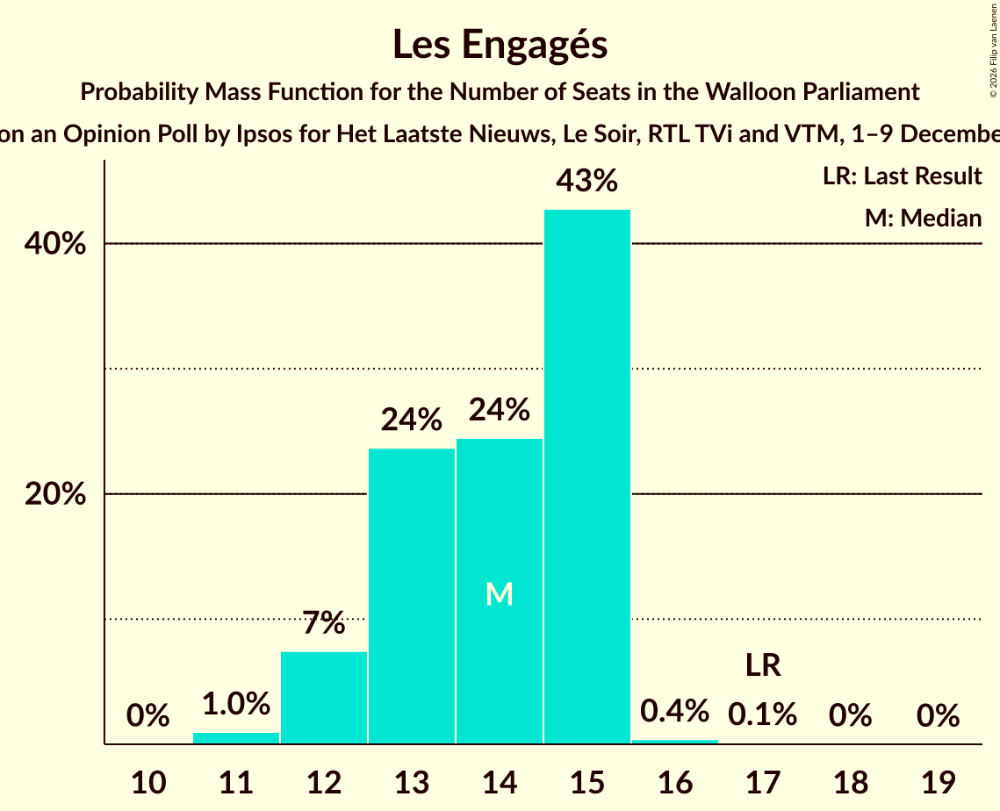

| Number of Seats | Probability | Accumulated | Special Marks |
|:---------------:|:-----------:|:-----------:|:-------------:|
| 11 | 1.0% | 100% |  |
| 12 | 7% | 99.0% |  |
| 13 | 24% | 92% |  |
| 14 | 24% | 68% | Median |
| 15 | 43% | 43% |  |
| 16 | 0.4% | 0.6% |  |
| 17 | 0.1% | 0.2% | Last Result |
| 18 | 0% | 0.1% |  |
| 19 | 0% | 0% |  |

### Ecolo

*For a full overview of the results for this party, see the [Ecolo](party-ecolo.html) page.*

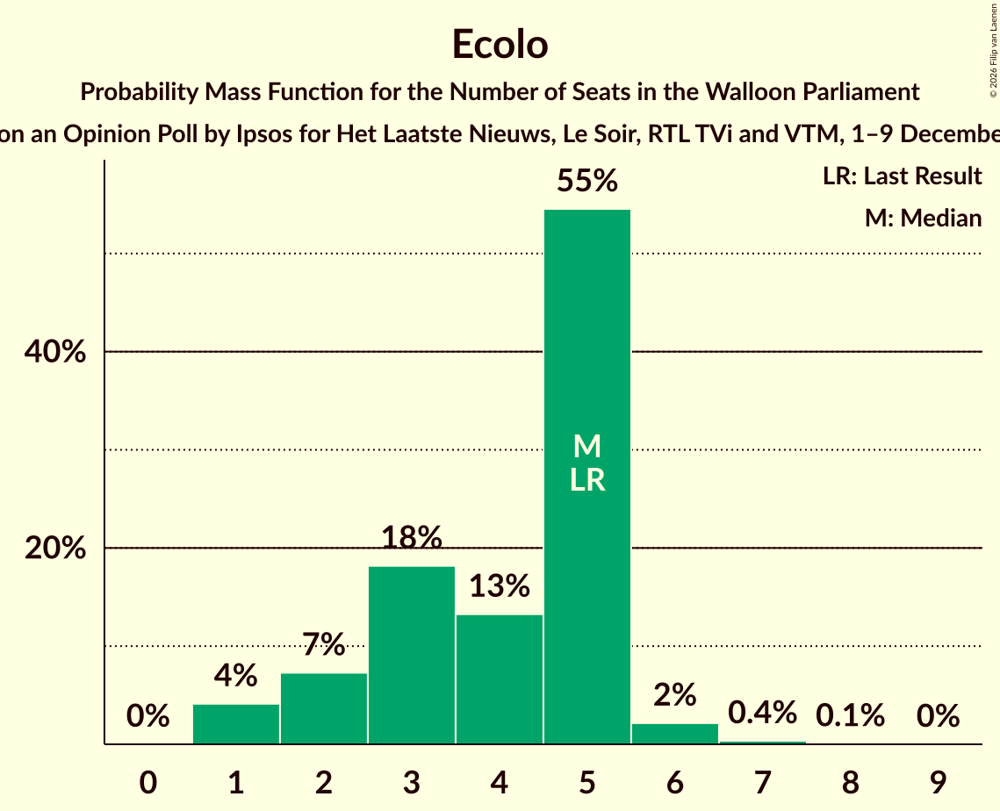

| Number of Seats | Probability | Accumulated | Special Marks |
|:---------------:|:-----------:|:-----------:|:-------------:|
| 1 | 4% | 100% |  |
| 2 | 7% | 96% |  |
| 3 | 18% | 89% |  |
| 4 | 13% | 70% |  |
| 5 | 55% | 57% | Last Result, Median |
| 6 | 2% | 3% |  |
| 7 | 0.4% | 0.4% |  |
| 8 | 0.1% | 0.1% |  |
| 9 | 0% | 0% |  |

### Chez Nous

*For a full overview of the results for this party, see the [Chez Nous](party-cheznous.html) page.*

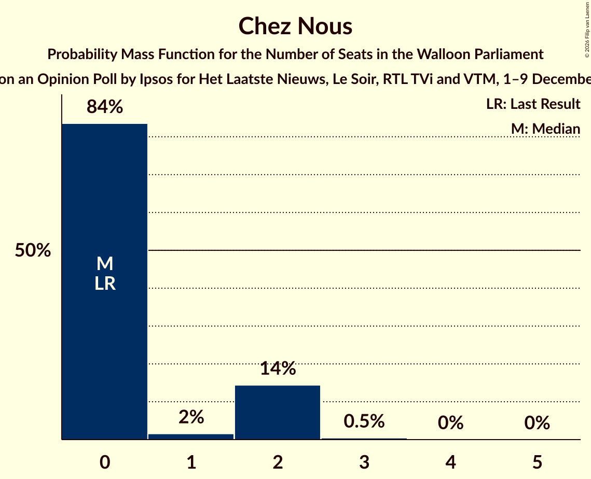

| Number of Seats | Probability | Accumulated | Special Marks |
|:---------------:|:-----------:|:-----------:|:-------------:|
| 0 | 84% | 100% | Last Result, Median |
| 1 | 2% | 16% |  |
| 2 | 14% | 15% |  |
| 3 | 0.5% | 0.5% |  |
| 4 | 0% | 0% |  |

### DéFI

*For a full overview of the results for this party, see the [DéFI](party-défi.html) page.*

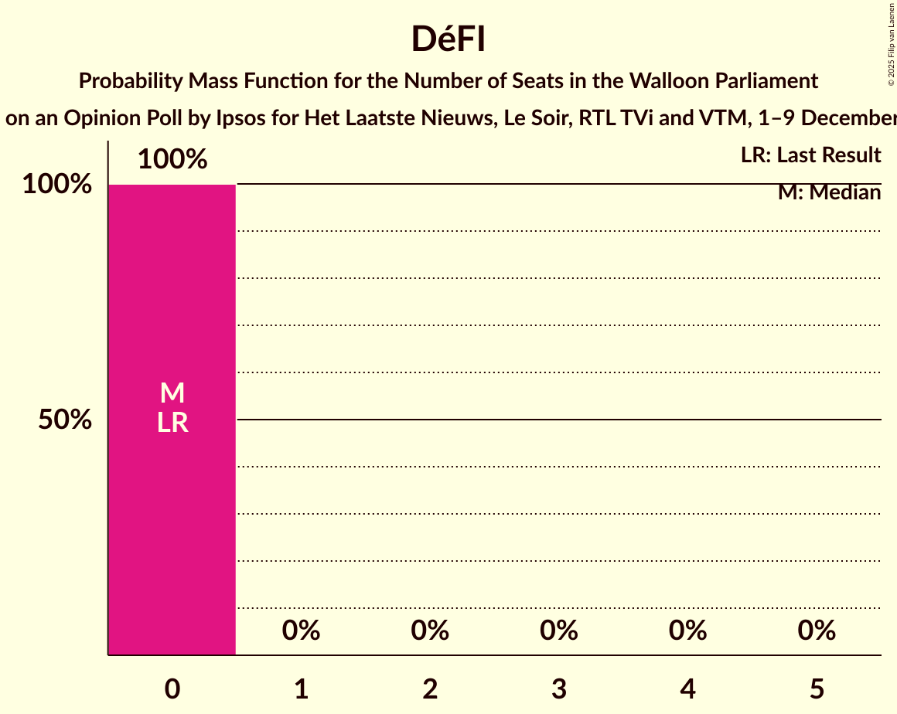

| Number of Seats | Probability | Accumulated | Special Marks |
|:---------------:|:-----------:|:-----------:|:-------------:|
| 0 | 100% | 100% | Last Result, Median |

## Coalitions

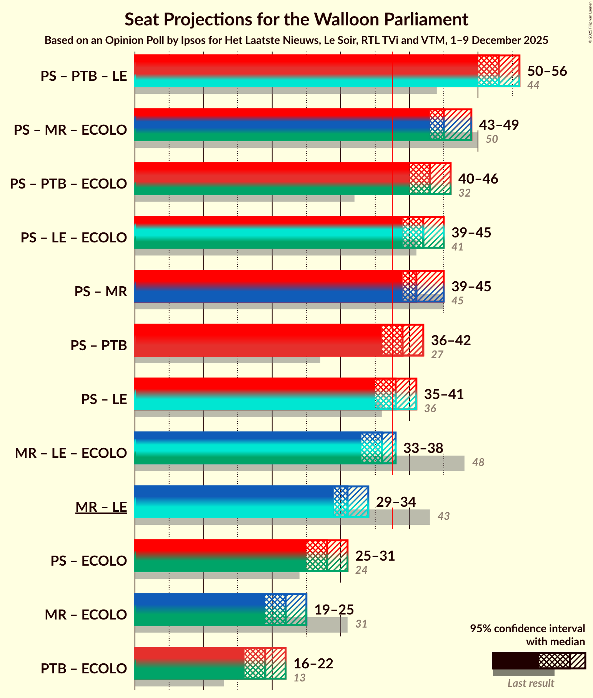

### Confidence Intervals

| Coalition | Last Result | Median | Majority? | 80% Confidence Interval | 90% Confidence Interval | 95% Confidence Interval | 99% Confidence Interval |
|:---------:|:-----------:|:------:|:---------:|:-----------------------:|:-----------------------:|:-----------------------:|:-----------------------:|
| Parti Socialiste – Parti du Travail de Belgique – Les Engagés | 44 | 53 | 100% | 51–55 | 50–56 | 50–56 | 49–57 |
| Parti Socialiste – Mouvement Réformateur – Ecolo | 50 | 45 | 100% | 44–47 | 44–48 | 43–49 | 42–49 |
| Parti Socialiste – Parti du Travail de Belgique – Ecolo | 32 | 43 | 100% | 41–45 | 41–45 | 40–46 | 39–47 |
| Parti Socialiste – Les Engagés – Ecolo | 41 | 42 | 99.9% | 40–44 | 40–44 | 39–45 | 38–46 |
| Parti Socialiste – Mouvement Réformateur | 45 | 41 | 99.7% | 40–43 | 39–44 | 39–45 | 38–46 |
| Parti Socialiste – Parti du Travail de Belgique | 27 | 39 | 85% | 37–41 | 37–42 | 36–42 | 35–43 |
| Parti Socialiste – Les Engagés | 36 | 38 | 64% | 36–40 | 35–40 | 35–41 | 34–42 |
| Mouvement Réformateur – Les Engagés – Ecolo | 48 | 36 | 9% | 34–37 | 33–38 | 33–38 | 32–39 |
| Mouvement Réformateur – Les Engagés | 43 | 31 | 0% | 30–33 | 29–34 | 29–34 | 28–35 |
| Parti Socialiste – Ecolo | 24 | 28 | 0% | 26–30 | 25–31 | 25–31 | 24–32 |
| Mouvement Réformateur – Ecolo | 31 | 22 | 0% | 20–24 | 19–24 | 19–25 | 18–25 |
| Parti du Travail de Belgique – Ecolo | 13 | 19 | 0% | 17–21 | 17–21 | 16–22 | 15–23 |

### Parti Socialiste – Parti du Travail de Belgique – Les Engagés

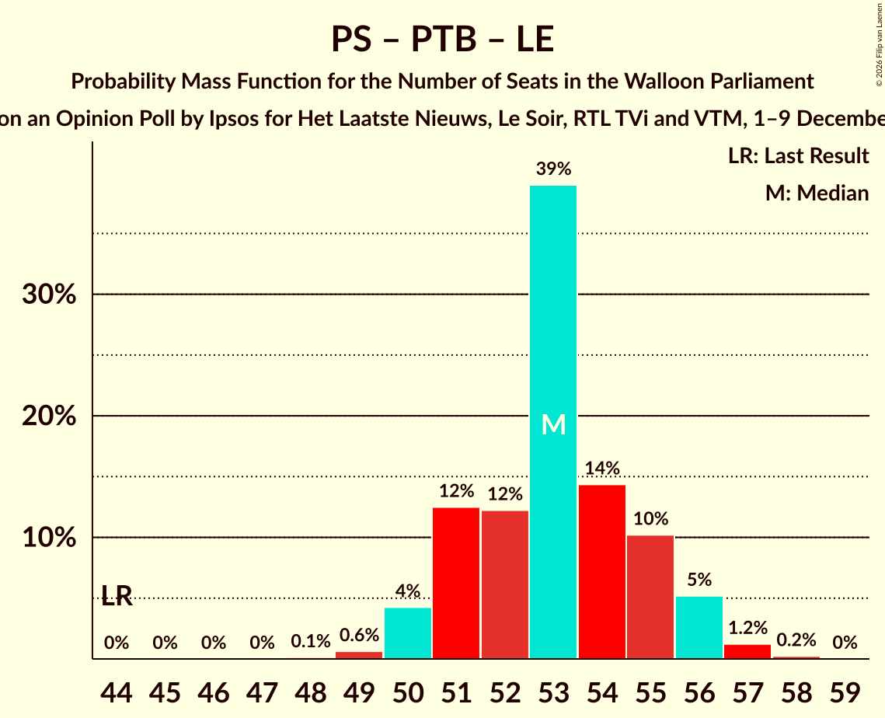

| Number of Seats | Probability | Accumulated | Special Marks |
|:---------------:|:-----------:|:-----------:|:-------------:|
| 44 | 0% | 100% | Last Result |
| 45 | 0% | 100% |  |
| 46 | 0% | 100% |  |
| 47 | 0% | 100% |  |
| 48 | 0.1% | 100% |  |
| 49 | 0.6% | 99.9% |  |
| 50 | 4% | 99.2% |  |
| 51 | 12% | 95% |  |
| 52 | 12% | 82% |  |
| 53 | 39% | 70% | Median |
| 54 | 14% | 31% |  |
| 55 | 10% | 17% |  |
| 56 | 5% | 7% |  |
| 57 | 1.2% | 1.5% |  |
| 58 | 0.2% | 0.3% |  |
| 59 | 0% | 0% |  |

### Parti Socialiste – Mouvement Réformateur – Ecolo

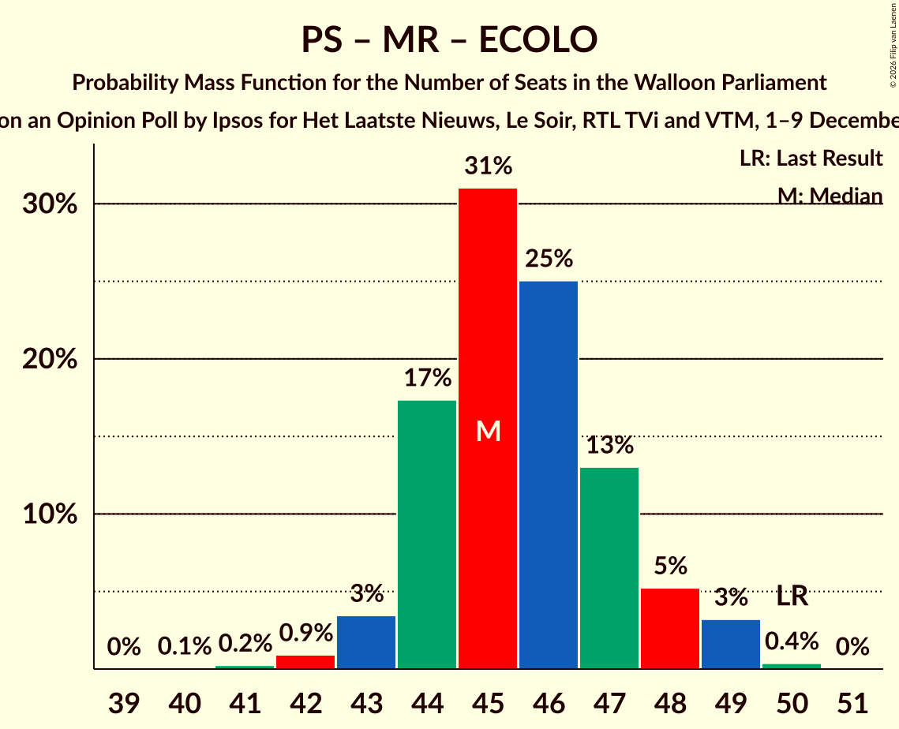

| Number of Seats | Probability | Accumulated | Special Marks |
|:---------------:|:-----------:|:-----------:|:-------------:|
| 40 | 0.1% | 100% |  |
| 41 | 0.2% | 99.9% |  |
| 42 | 0.9% | 99.7% |  |
| 43 | 3% | 98.8% |  |
| 44 | 17% | 95% |  |
| 45 | 31% | 78% |  |
| 46 | 25% | 47% | Median |
| 47 | 13% | 22% |  |
| 48 | 5% | 9% |  |
| 49 | 3% | 4% |  |
| 50 | 0.4% | 0.4% | Last Result |
| 51 | 0% | 0% |  |

### Parti Socialiste – Parti du Travail de Belgique – Ecolo

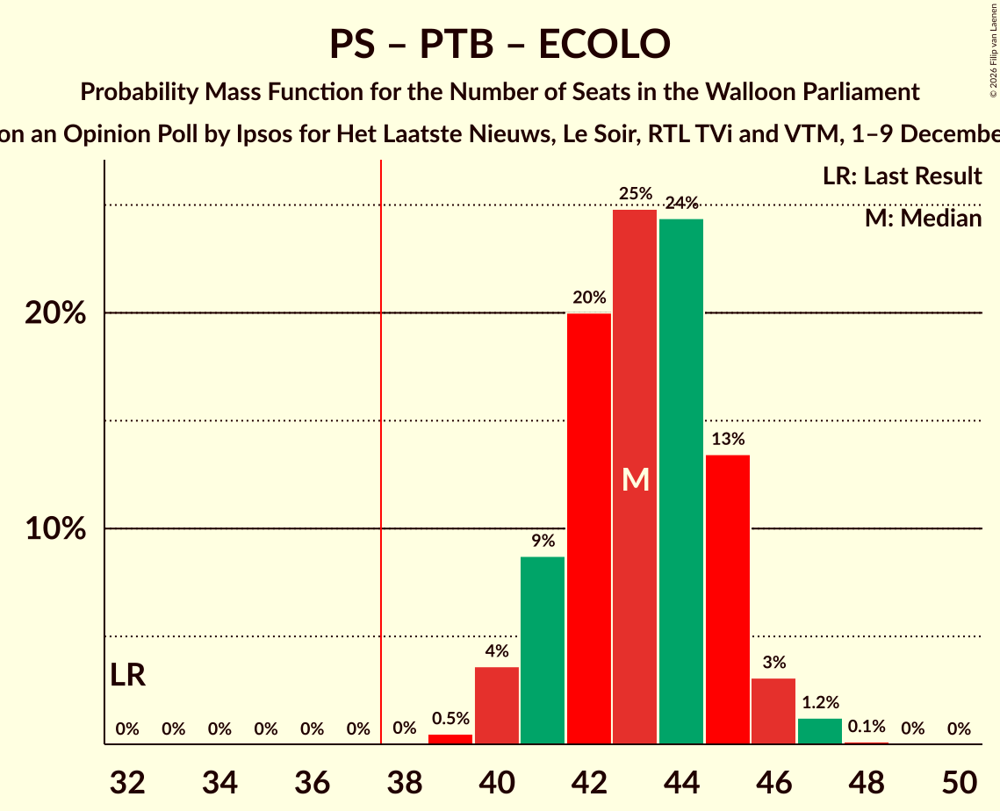

| Number of Seats | Probability | Accumulated | Special Marks |
|:---------------:|:-----------:|:-----------:|:-------------:|
| 32 | 0% | 100% | Last Result |
| 33 | 0% | 100% |  |
| 34 | 0% | 100% |  |
| 35 | 0% | 100% |  |
| 36 | 0% | 100% |  |
| 37 | 0% | 100% |  |
| 38 | 0% | 100% | Majority |
| 39 | 0.5% | 99.9% |  |
| 40 | 4% | 99.5% |  |
| 41 | 9% | 96% |  |
| 42 | 20% | 87% |  |
| 43 | 25% | 67% |  |
| 44 | 24% | 42% | Median |
| 45 | 13% | 18% |  |
| 46 | 3% | 4% |  |
| 47 | 1.2% | 1.4% |  |
| 48 | 0.1% | 0.2% |  |
| 49 | 0% | 0% |  |

### Parti Socialiste – Les Engagés – Ecolo

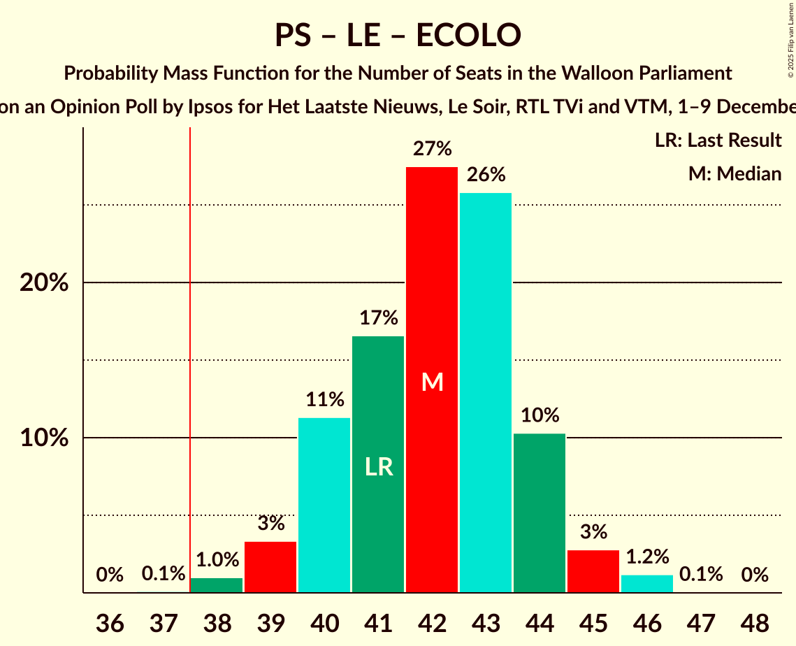

| Number of Seats | Probability | Accumulated | Special Marks |
|:---------------:|:-----------:|:-----------:|:-------------:|
| 37 | 0.1% | 100% |  |
| 38 | 1.0% | 99.9% | Majority |
| 39 | 3% | 98.9% |  |
| 40 | 11% | 96% |  |
| 41 | 17% | 84% | Last Result |
| 42 | 27% | 68% |  |
| 43 | 26% | 40% | Median |
| 44 | 10% | 14% |  |
| 45 | 3% | 4% |  |
| 46 | 1.2% | 1.3% |  |
| 47 | 0.1% | 0.1% |  |
| 48 | 0% | 0% |  |

### Parti Socialiste – Mouvement Réformateur

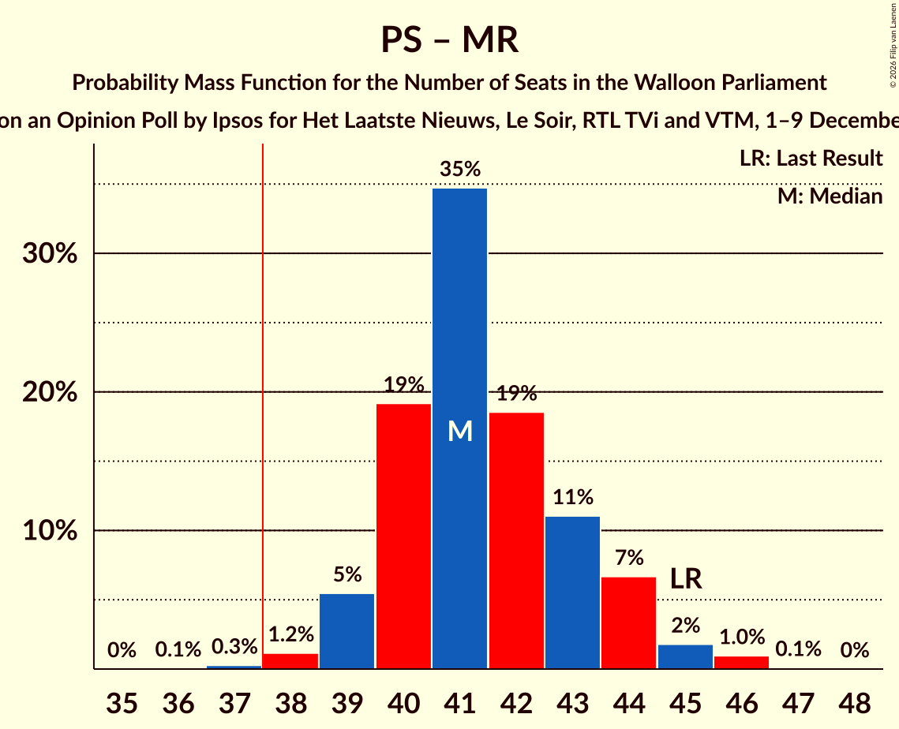

| Number of Seats | Probability | Accumulated | Special Marks |
|:---------------:|:-----------:|:-----------:|:-------------:|
| 36 | 0.1% | 100% |  |
| 37 | 0.3% | 99.9% |  |
| 38 | 1.2% | 99.7% | Majority |
| 39 | 5% | 98.5% |  |
| 40 | 19% | 93% |  |
| 41 | 35% | 74% | Median |
| 42 | 19% | 39% |  |
| 43 | 11% | 21% |  |
| 44 | 7% | 10% |  |
| 45 | 2% | 3% | Last Result |
| 46 | 1.0% | 1.1% |  |
| 47 | 0.1% | 0.1% |  |
| 48 | 0% | 0% |  |

### Parti Socialiste – Parti du Travail de Belgique

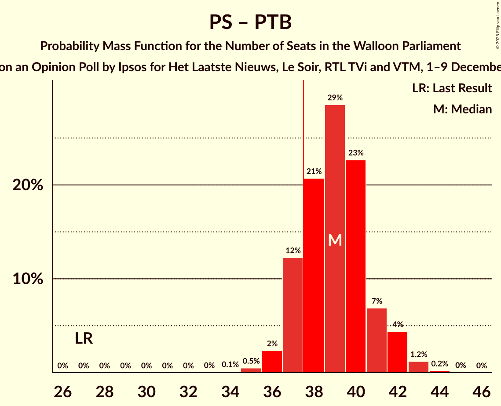

| Number of Seats | Probability | Accumulated | Special Marks |
|:---------------:|:-----------:|:-----------:|:-------------:|
| 27 | 0% | 100% | Last Result |
| 28 | 0% | 100% |  |
| 29 | 0% | 100% |  |
| 30 | 0% | 100% |  |
| 31 | 0% | 100% |  |
| 32 | 0% | 100% |  |
| 33 | 0% | 100% |  |
| 34 | 0.1% | 100% |  |
| 35 | 0.5% | 99.8% |  |
| 36 | 2% | 99.3% |  |
| 37 | 12% | 97% |  |
| 38 | 21% | 85% | Majority |
| 39 | 29% | 64% | Median |
| 40 | 23% | 35% |  |
| 41 | 7% | 13% |  |
| 42 | 4% | 6% |  |
| 43 | 1.2% | 1.5% |  |
| 44 | 0.2% | 0.3% |  |
| 45 | 0% | 0% |  |

### Parti Socialiste – Les Engagés

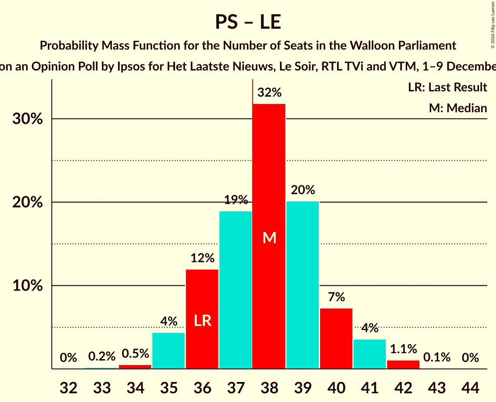

| Number of Seats | Probability | Accumulated | Special Marks |
|:---------------:|:-----------:|:-----------:|:-------------:|
| 33 | 0.2% | 100% |  |
| 34 | 0.5% | 99.8% |  |
| 35 | 4% | 99.3% |  |
| 36 | 12% | 95% | Last Result |
| 37 | 19% | 83% |  |
| 38 | 32% | 64% | Median, Majority |
| 39 | 20% | 32% |  |
| 40 | 7% | 12% |  |
| 41 | 4% | 5% |  |
| 42 | 1.1% | 1.1% |  |
| 43 | 0.1% | 0.1% |  |
| 44 | 0% | 0% |  |

### Mouvement Réformateur – Les Engagés – Ecolo

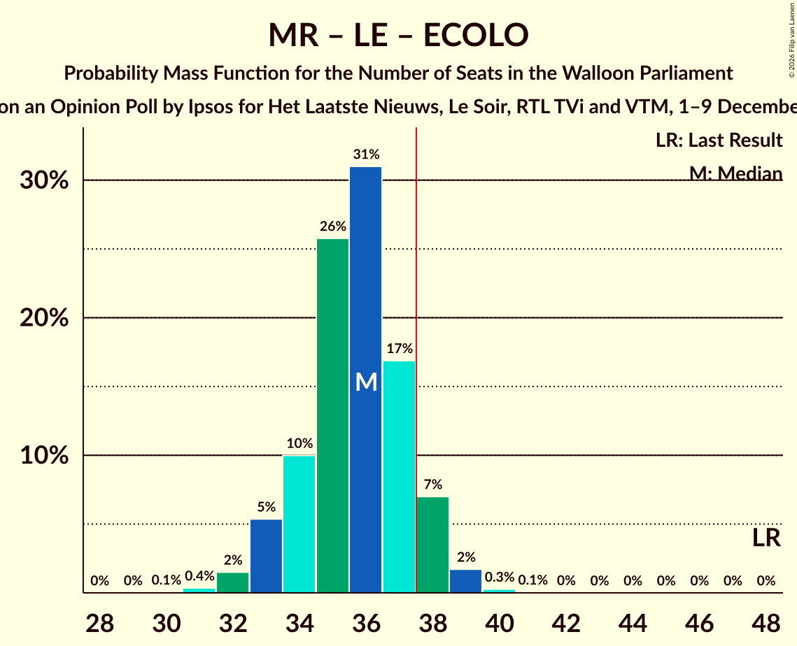

| Number of Seats | Probability | Accumulated | Special Marks |
|:---------------:|:-----------:|:-----------:|:-------------:|
| 30 | 0.1% | 100% |  |
| 31 | 0.4% | 99.9% |  |
| 32 | 2% | 99.6% |  |
| 33 | 5% | 98% |  |
| 34 | 10% | 93% |  |
| 35 | 26% | 83% |  |
| 36 | 31% | 57% | Median |
| 37 | 17% | 26% |  |
| 38 | 7% | 9% | Majority |
| 39 | 2% | 2% |  |
| 40 | 0.3% | 0.3% |  |
| 41 | 0.1% | 0.1% |  |
| 42 | 0% | 0% |  |
| 43 | 0% | 0% |  |
| 44 | 0% | 0% |  |
| 45 | 0% | 0% |  |
| 46 | 0% | 0% |  |
| 47 | 0% | 0% |  |
| 48 | 0% | 0% | Last Result |

### Mouvement Réformateur – Les Engagés

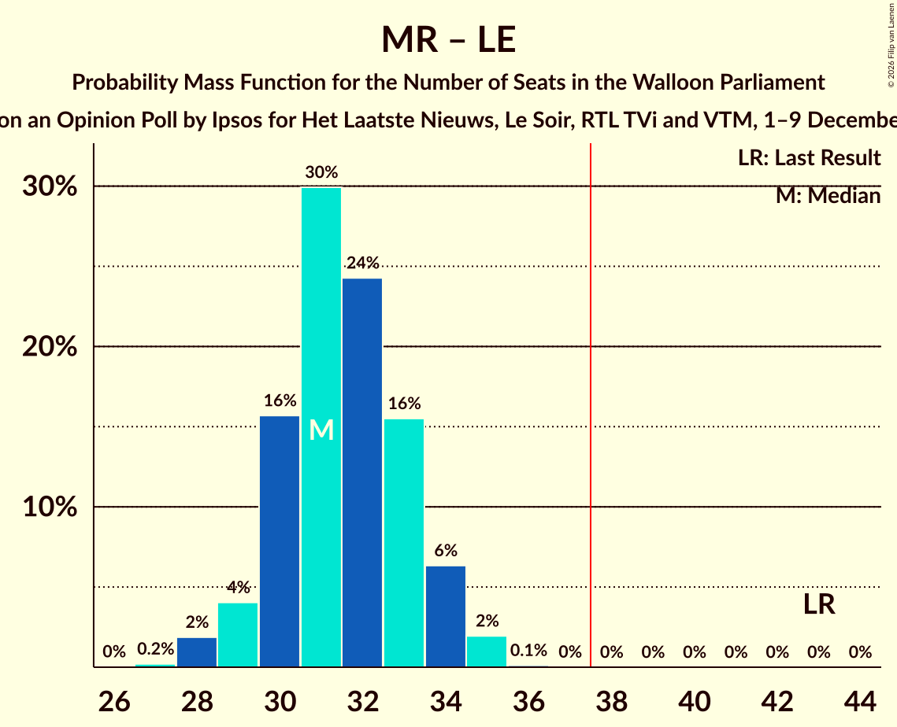

| Number of Seats | Probability | Accumulated | Special Marks |
|:---------------:|:-----------:|:-----------:|:-------------:|
| 27 | 0.2% | 100% |  |
| 28 | 2% | 99.8% |  |
| 29 | 4% | 98% |  |
| 30 | 16% | 94% |  |
| 31 | 30% | 78% | Median |
| 32 | 24% | 48% |  |
| 33 | 16% | 24% |  |
| 34 | 6% | 8% |  |
| 35 | 2% | 2% |  |
| 36 | 0.1% | 0.1% |  |
| 37 | 0% | 0% |  |
| 38 | 0% | 0% | Majority |
| 39 | 0% | 0% |  |
| 40 | 0% | 0% |  |
| 41 | 0% | 0% |  |
| 42 | 0% | 0% |  |
| 43 | 0% | 0% | Last Result |

### Parti Socialiste – Ecolo

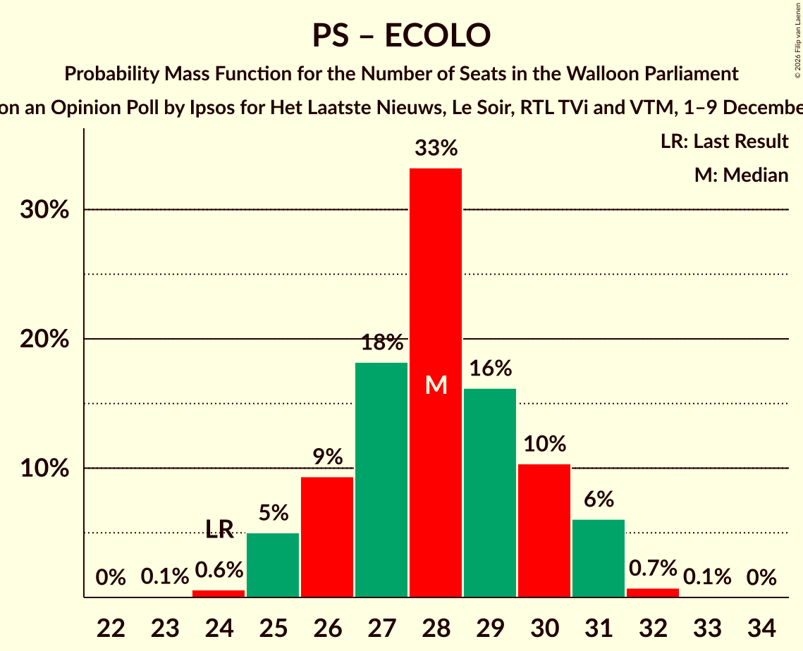

| Number of Seats | Probability | Accumulated | Special Marks |
|:---------------:|:-----------:|:-----------:|:-------------:|
| 23 | 0.1% | 100% |  |
| 24 | 0.6% | 99.9% | Last Result |
| 25 | 5% | 99.3% |  |
| 26 | 9% | 94% |  |
| 27 | 18% | 85% |  |
| 28 | 33% | 67% |  |
| 29 | 16% | 33% | Median |
| 30 | 10% | 17% |  |
| 31 | 6% | 7% |  |
| 32 | 0.7% | 0.8% |  |
| 33 | 0.1% | 0.1% |  |
| 34 | 0% | 0% |  |

### Mouvement Réformateur – Ecolo

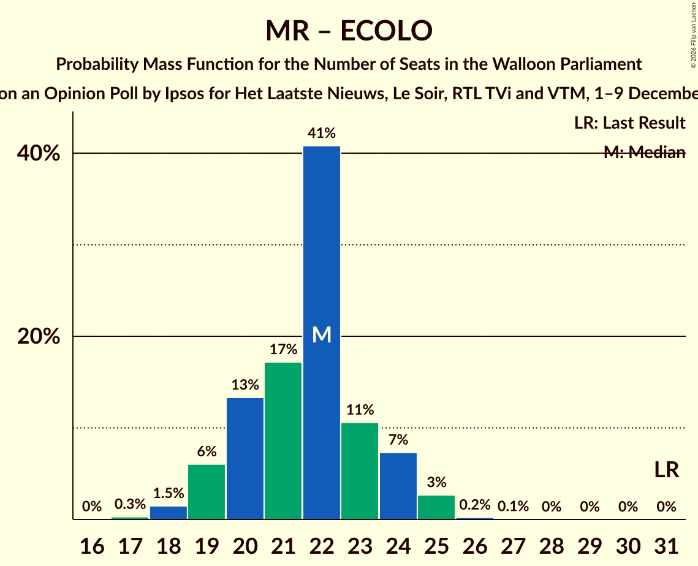

| Number of Seats | Probability | Accumulated | Special Marks |
|:---------------:|:-----------:|:-----------:|:-------------:|
| 17 | 0.3% | 100% |  |
| 18 | 1.5% | 99.7% |  |
| 19 | 6% | 98% |  |
| 20 | 13% | 92% |  |
| 21 | 17% | 79% |  |
| 22 | 41% | 62% | Median |
| 23 | 11% | 21% |  |
| 24 | 7% | 10% |  |
| 25 | 3% | 3% |  |
| 26 | 0.2% | 0.3% |  |
| 27 | 0.1% | 0.1% |  |
| 28 | 0% | 0% |  |
| 29 | 0% | 0% |  |
| 30 | 0% | 0% |  |
| 31 | 0% | 0% | Last Result |

### Parti du Travail de Belgique – Ecolo

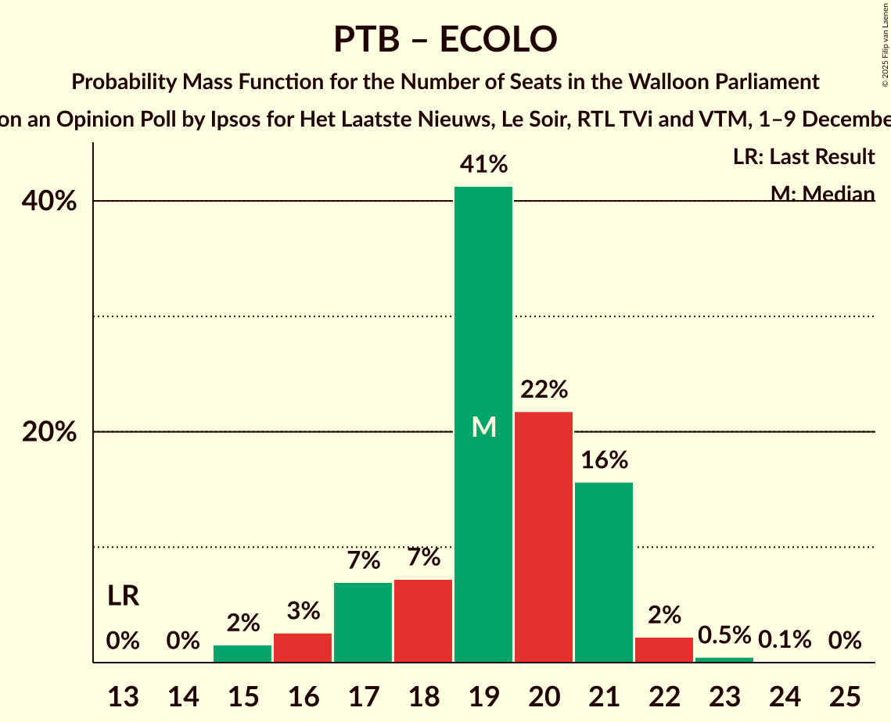

| Number of Seats | Probability | Accumulated | Special Marks |
|:---------------:|:-----------:|:-----------:|:-------------:|
| 13 | 0% | 100% | Last Result |
| 14 | 0% | 100% |  |
| 15 | 2% | 100% |  |
| 16 | 3% | 98% |  |
| 17 | 7% | 96% |  |
| 18 | 7% | 89% |  |
| 19 | 41% | 82% |  |
| 20 | 22% | 40% | Median |
| 21 | 16% | 19% |  |
| 22 | 2% | 3% |  |
| 23 | 0.5% | 0.6% |  |
| 24 | 0.1% | 0.2% |  |
| 25 | 0% | 0% |  |

## Technical Information

### Opinion Poll

+ **Polling firm:** Ipsos
+ **Commissioner(s):** Het Laatste Nieuws, Le Soir, RTL TVi and VTM
+ **Fieldwork period:** 1–9 December 2025

### Calculations

+ **Sample size:** 1003
+ **Simulations done:** 2,097,152
+ **Error estimate:** 0.93%

