# Opinion Poll by Bpact and Universiteit Antwerpen & ULB for De Standaard, RTBF and VRT, 9 March–5 April 2026

<a href="#voting-intentions">Voting Intentions</a> | <a href="#seats">Seats</a> | <a href="#coalitions">Coalitions</a> | <a href="#technical-information">Technical Information</a>

## Voting Intentions

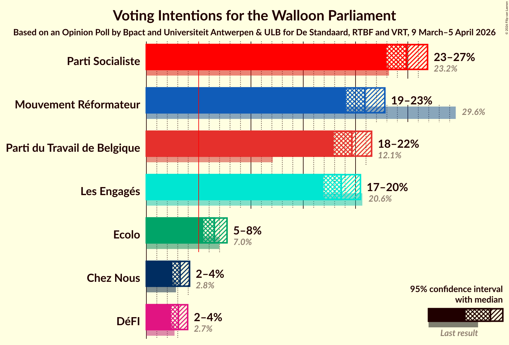

### Confidence Intervals

| Party | Last Result | Poll Result | 80% Confidence Interval | 90% Confidence Interval | 95% Confidence Interval | 99% Confidence Interval |
|:-----:|:-----------:|:-----------:|:-----------------------:|:-----------------------:|:-----------------------:|:-----------------------:|
| Parti Socialiste | 23.2% | 24.9% | 23.6–26.2% |23.3–26.6% |23.0–26.9% |22.4–27.5% |
| Mouvement Réformateur | 29.6% | 20.9% | 19.7–22.1% |19.4–22.5% |19.1–22.8% |18.5–23.4% |
| Parti du Travail de Belgique | 12.1% | 19.7% | 18.5–20.9% |18.2–21.2% |17.9–21.5% |17.4–22.1% |
| Les Engagés | 20.6% | 18.6% | 17.5–19.8% |17.2–20.2% |16.9–20.5% |16.4–21.1% |
| Ecolo | 7.0% | 6.5% | 5.8–7.3% |5.6–7.5% |5.5–7.7% |5.2–8.1% |
| Chez Nous | 2.8% | 3.2% | 2.7–3.8% |2.6–4.0% |2.5–4.1% |2.3–4.4% |
| DéFI | 2.7% | 3.1% | 2.6–3.6% |2.5–3.8% |2.4–3.9% |2.2–4.3% |

*Note:* The poll result column reflects the actual value used in the calculations. Published results may vary slightly, and in addition be rounded to fewer digits.

## Seats

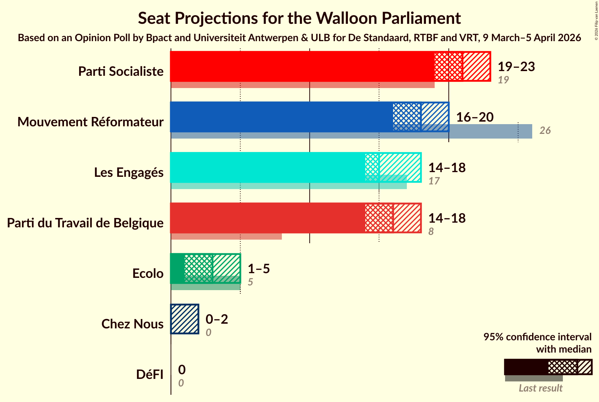

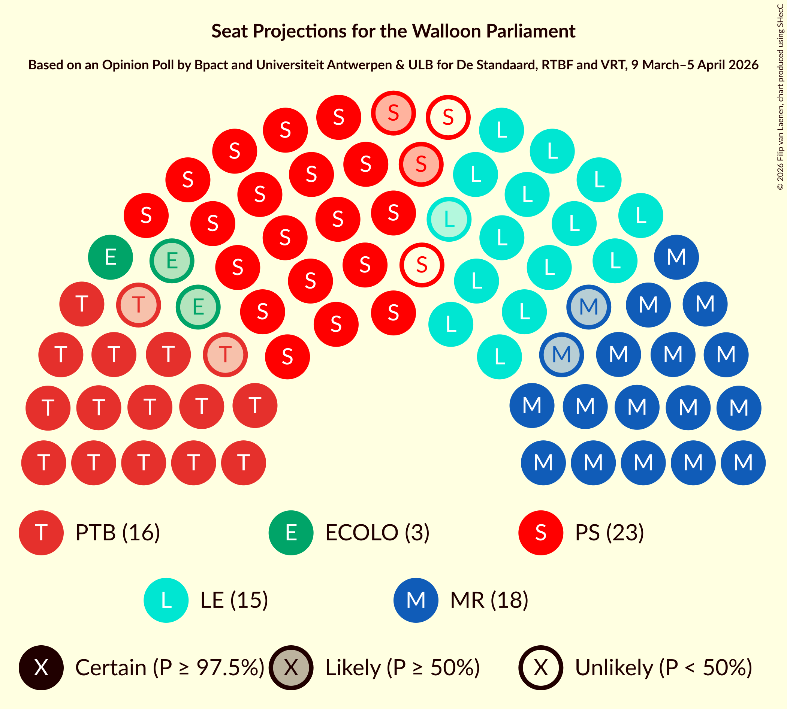

### Confidence Intervals

| Party | Last Result | Median | 80% Confidence Interval | 90% Confidence Interval | 95% Confidence Interval | 99% Confidence Interval |
|:-----:|:-----------:|:------:|:-----------------------:|:-----------------------:|:-----------------------:|:-----------------------:|
| <a href="#parti-socialiste">Parti Socialiste</a> | 19 | 21 | 19–23 |19–23 |19–23 |18–24 |
| <a href="#mouvement-réformateur">Mouvement Réformateur</a> | 26 | 18 | 17–19 |17–20 |16–20 |16–20 |
| <a href="#parti-du-travail-de-belgique">Parti du Travail de Belgique</a> | 8 | 16 | 15–17 |15–17 |14–18 |14–19 |
| <a href="#les-engagés">Les Engagés</a> | 17 | 15 | 15–17 |15–18 |14–18 |14–19 |
| <a href="#ecolo">Ecolo</a> | 5 | 3 | 2–5 |2–5 |1–5 |1–5 |
| <a href="#chez-nous">Chez Nous</a> | 0 | 0 | 0–2 |0–2 |0–2 |0–3 |
| <a href="#défi">DéFI</a> | 0 | 0 | 0 |0 |0 |0 |

### Parti Socialiste

*For a full overview of the results for this party, see the [Parti Socialiste](party-partisocialiste.html) page.*

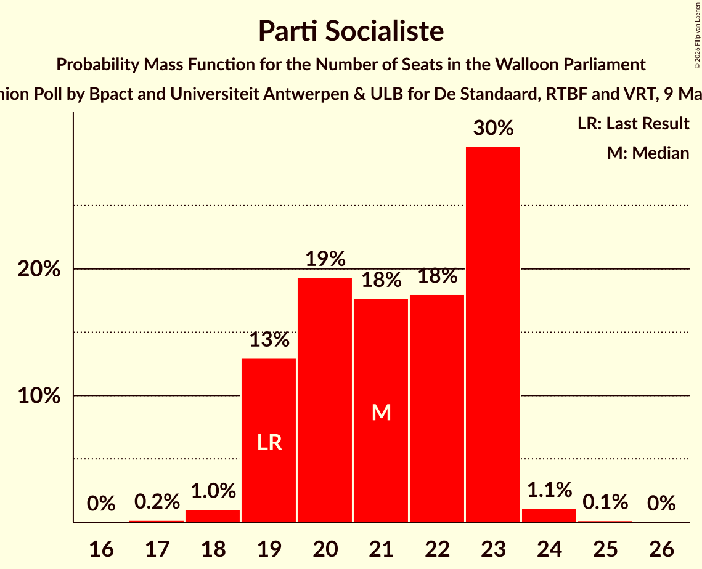

| Number of Seats | Probability | Accumulated | Special Marks |
|:---------------:|:-----------:|:-----------:|:-------------:|
| 17 | 0.2% | 100% |  |
| 18 | 1.0% | 99.8% |  |
| 19 | 13% | 98.8% | Last Result |
| 20 | 19% | 86% |  |
| 21 | 18% | 67% | Median |
| 22 | 18% | 49% |  |
| 23 | 30% | 31% |  |
| 24 | 1.1% | 1.2% |  |
| 25 | 0.1% | 0.1% |  |
| 26 | 0% | 0% |  |

### Mouvement Réformateur

*For a full overview of the results for this party, see the [Mouvement Réformateur](party-mouvementréformateur.html) page.*

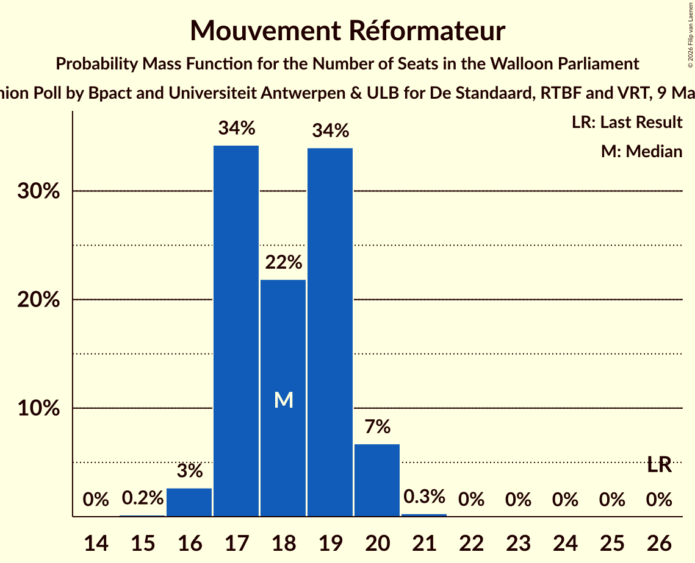

| Number of Seats | Probability | Accumulated | Special Marks |
|:---------------:|:-----------:|:-----------:|:-------------:|
| 15 | 0.2% | 100% |  |
| 16 | 3% | 99.8% |  |
| 17 | 34% | 97% |  |
| 18 | 22% | 63% | Median |
| 19 | 34% | 41% |  |
| 20 | 7% | 7% |  |
| 21 | 0.3% | 0.3% |  |
| 22 | 0% | 0% |  |
| 23 | 0% | 0% |  |
| 24 | 0% | 0% |  |
| 25 | 0% | 0% |  |
| 26 | 0% | 0% | Last Result |

### Parti du Travail de Belgique

*For a full overview of the results for this party, see the [Parti du Travail de Belgique](party-partidutravaildebelgique.html) page.*

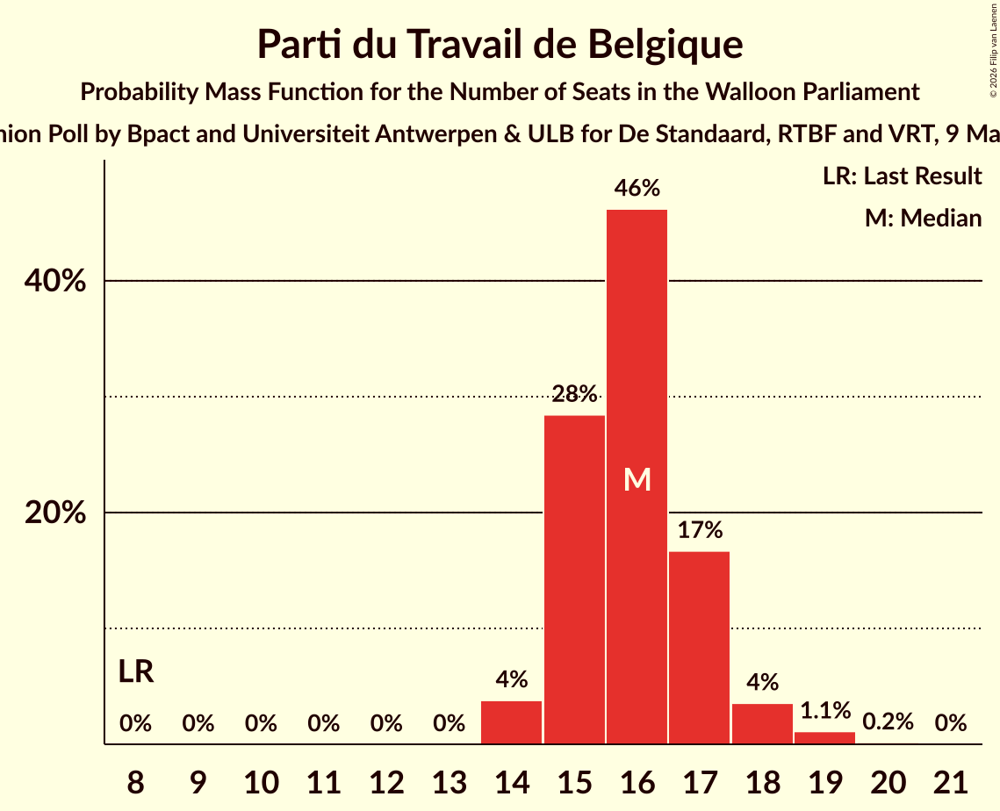

| Number of Seats | Probability | Accumulated | Special Marks |
|:---------------:|:-----------:|:-----------:|:-------------:|
| 8 | 0% | 100% | Last Result |
| 9 | 0% | 100% |  |
| 10 | 0% | 100% |  |
| 11 | 0% | 100% |  |
| 12 | 0% | 100% |  |
| 13 | 0% | 100% |  |
| 14 | 4% | 100% |  |
| 15 | 28% | 96% |  |
| 16 | 46% | 68% | Median |
| 17 | 17% | 22% |  |
| 18 | 4% | 5% |  |
| 19 | 1.1% | 1.3% |  |
| 20 | 0.2% | 0.2% |  |
| 21 | 0% | 0% |  |

### Les Engagés

*For a full overview of the results for this party, see the [Les Engagés](party-lesengagés.html) page.*

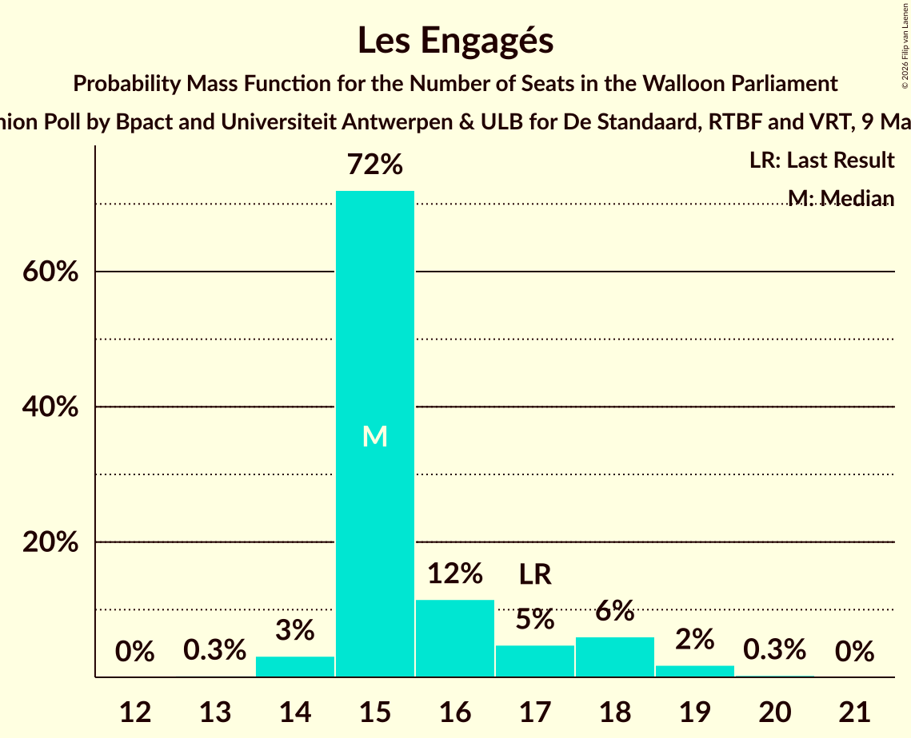

| Number of Seats | Probability | Accumulated | Special Marks |
|:---------------:|:-----------:|:-----------:|:-------------:|
| 13 | 0.3% | 100% |  |
| 14 | 3% | 99.7% |  |
| 15 | 72% | 97% | Median |
| 16 | 12% | 25% |  |
| 17 | 5% | 13% | Last Result |
| 18 | 6% | 8% |  |
| 19 | 2% | 2% |  |
| 20 | 0.3% | 0.3% |  |
| 21 | 0% | 0% |  |

### Ecolo

*For a full overview of the results for this party, see the [Ecolo](party-ecolo.html) page.*

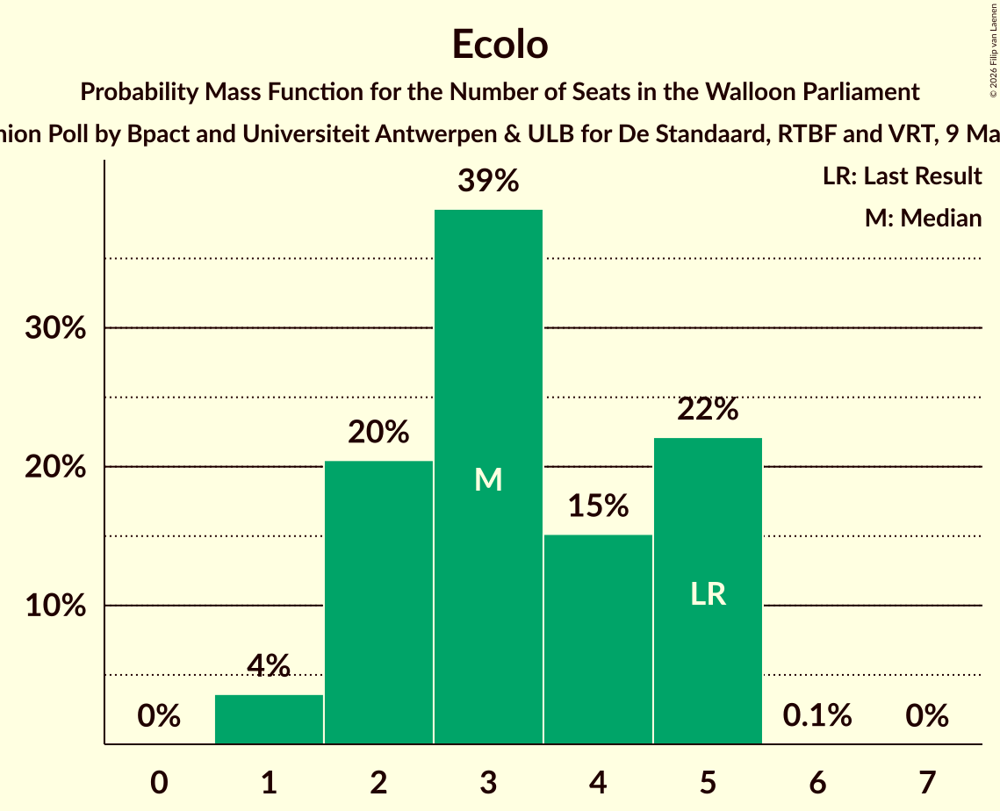

| Number of Seats | Probability | Accumulated | Special Marks |
|:---------------:|:-----------:|:-----------:|:-------------:|
| 1 | 4% | 100% |  |
| 2 | 20% | 96% |  |
| 3 | 39% | 76% | Median |
| 4 | 15% | 37% |  |
| 5 | 22% | 22% | Last Result |
| 6 | 0.1% | 0.1% |  |
| 7 | 0% | 0% |  |

### Chez Nous

*For a full overview of the results for this party, see the [Chez Nous](party-cheznous.html) page.*

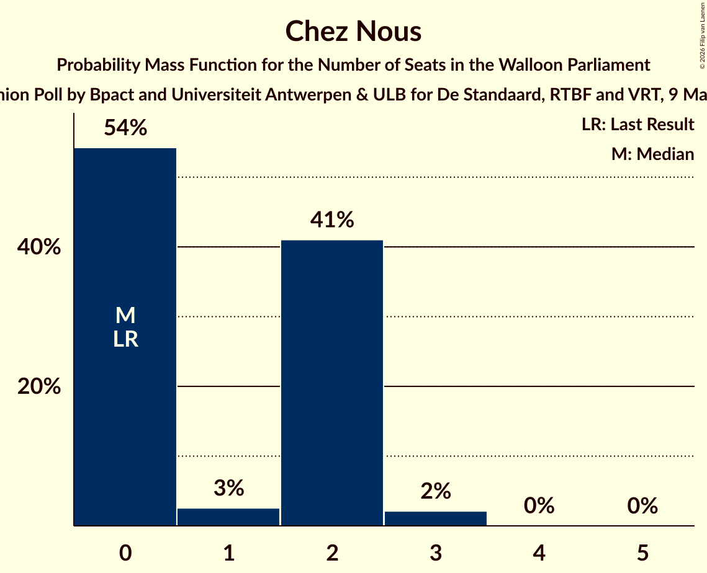

| Number of Seats | Probability | Accumulated | Special Marks |
|:---------------:|:-----------:|:-----------:|:-------------:|
| 0 | 54% | 100% | Last Result, Median |
| 1 | 3% | 46% |  |
| 2 | 41% | 43% |  |
| 3 | 2% | 2% |  |
| 4 | 0% | 0% |  |

### DéFI

*For a full overview of the results for this party, see the [DéFI](party-défi.html) page.*

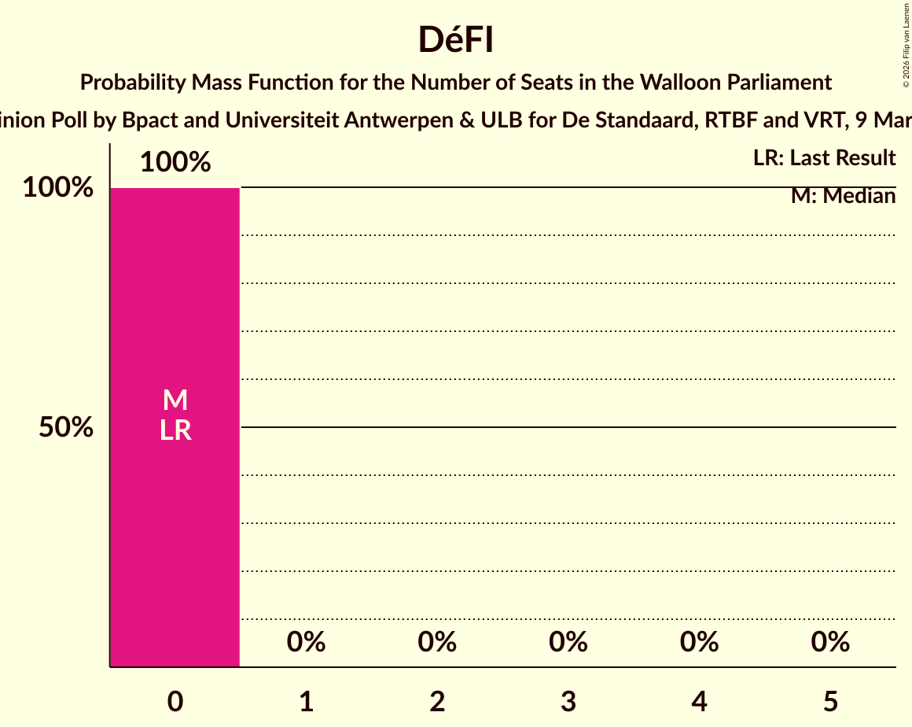

| Number of Seats | Probability | Accumulated | Special Marks |
|:---------------:|:-----------:|:-----------:|:-------------:|
| 0 | 100% | 100% | Last Result, Median |

## Coalitions

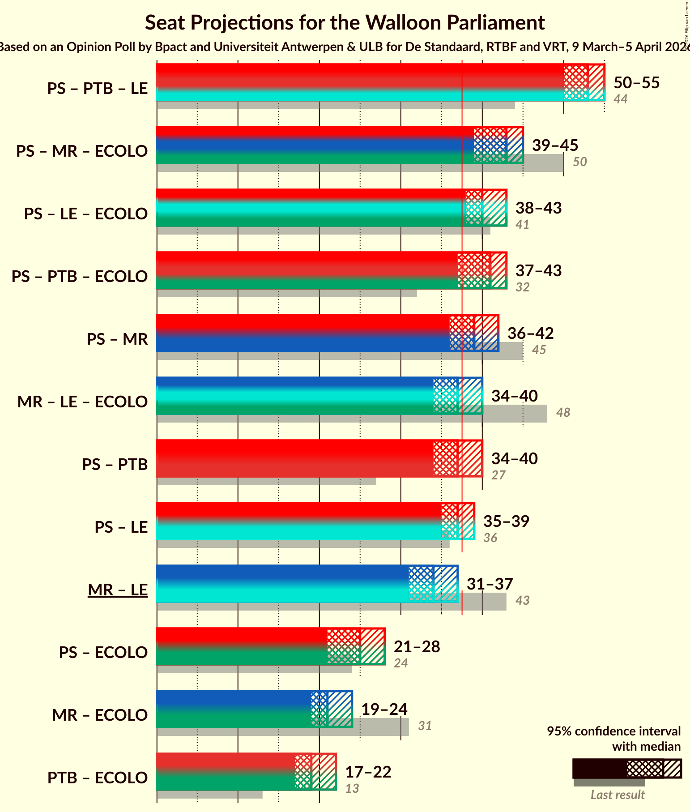

### Confidence Intervals

| Coalition | Last Result | Median | Majority? | 80% Confidence Interval | 90% Confidence Interval | 95% Confidence Interval | 99% Confidence Interval |
|:---------:|:-----------:|:------:|:---------:|:-----------------------:|:-----------------------:|:-----------------------:|:-----------------------:|
| Parti Socialiste – Parti du Travail de Belgique – Les Engagés | 44 | 53 | 100% | 51–55 | 50–55 | 50–55 | 49–57 |
| Parti Socialiste – Mouvement Réformateur – Ecolo | 50 | 43 | 99.9% | 41–44 | 40–45 | 39–45 | 38–46 |
| Parti Socialiste – Les Engagés – Ecolo | 41 | 40 | 98% | 38–42 | 38–42 | 38–43 | 37–43 |
| Parti Socialiste – Parti du Travail de Belgique – Ecolo | 32 | 41 | 97% | 39–43 | 38–43 | 37–43 | 36–44 |
| Parti Socialiste – Mouvement Réformateur | 45 | 39 | 90% | 38–41 | 36–42 | 36–42 | 35–43 |
| Mouvement Réformateur – Les Engagés – Ecolo | 48 | 37 | 31% | 35–39 | 35–40 | 34–40 | 33–41 |
| Parti Socialiste – Parti du Travail de Belgique | 27 | 37 | 48% | 35–39 | 35–40 | 34–40 | 33–41 |
| Parti Socialiste – Les Engagés | 36 | 37 | 35% | 35–38 | 35–39 | 35–39 | 34–40 |
| Mouvement Réformateur – Les Engagés | 43 | 34 | 1.0% | 32–35 | 32–36 | 31–37 | 31–38 |
| Parti Socialiste – Ecolo | 24 | 25 | 0% | 23–26 | 22–27 | 21–28 | 20–28 |
| Mouvement Réformateur – Ecolo | 31 | 21 | 0% | 20–23 | 19–24 | 19–24 | 18–25 |
| Parti du Travail de Belgique – Ecolo | 13 | 19 | 0% | 18–21 | 17–21 | 17–22 | 16–22 |

### Parti Socialiste – Parti du Travail de Belgique – Les Engagés

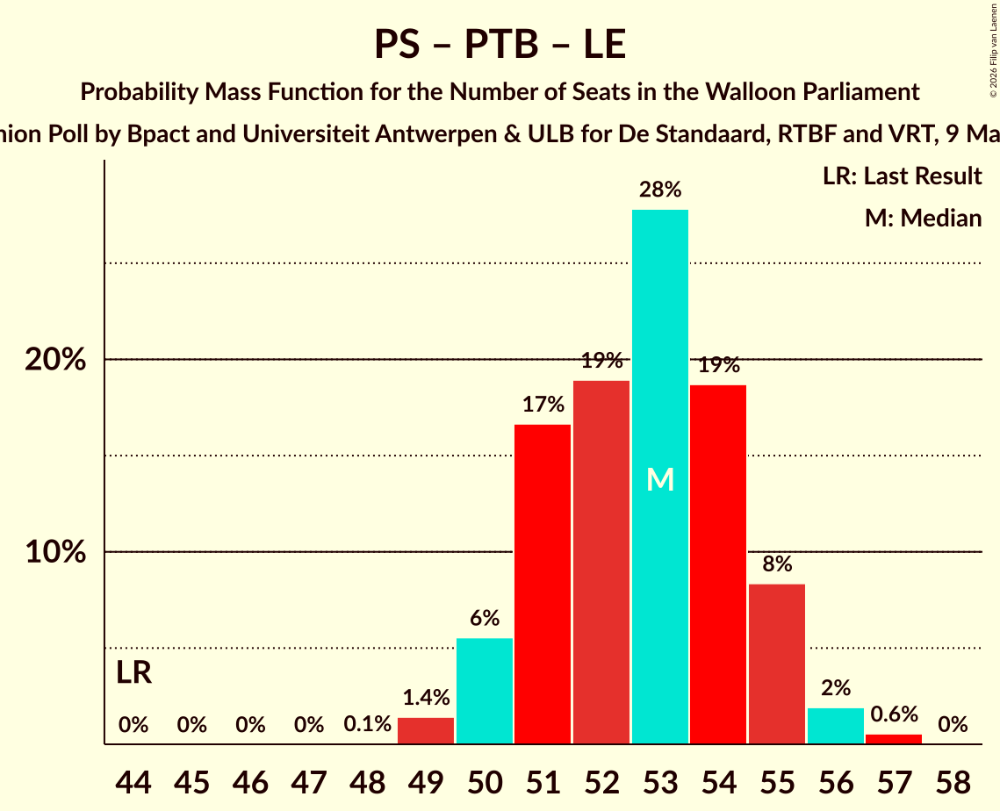

| Number of Seats | Probability | Accumulated | Special Marks |
|:---------------:|:-----------:|:-----------:|:-------------:|
| 44 | 0% | 100% | Last Result |
| 45 | 0% | 100% |  |
| 46 | 0% | 100% |  |
| 47 | 0% | 100% |  |
| 48 | 0.1% | 100% |  |
| 49 | 1.4% | 99.9% |  |
| 50 | 6% | 98.5% |  |
| 51 | 17% | 93% |  |
| 52 | 19% | 76% | Median |
| 53 | 28% | 57% |  |
| 54 | 19% | 30% |  |
| 55 | 8% | 11% |  |
| 56 | 2% | 2% |  |
| 57 | 0.6% | 0.6% |  |
| 58 | 0% | 0% |  |

### Parti Socialiste – Mouvement Réformateur – Ecolo

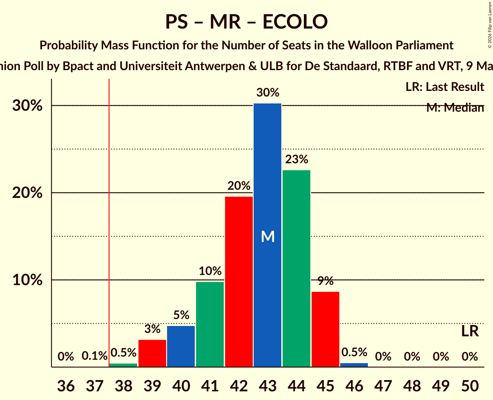

| Number of Seats | Probability | Accumulated | Special Marks |
|:---------------:|:-----------:|:-----------:|:-------------:|
| 37 | 0.1% | 100% |  |
| 38 | 0.5% | 99.9% | Majority |
| 39 | 3% | 99.4% |  |
| 40 | 5% | 96% |  |
| 41 | 10% | 92% |  |
| 42 | 20% | 82% | Median |
| 43 | 30% | 62% |  |
| 44 | 23% | 32% |  |
| 45 | 9% | 9% |  |
| 46 | 0.5% | 0.5% |  |
| 47 | 0% | 0% |  |
| 48 | 0% | 0% |  |
| 49 | 0% | 0% |  |
| 50 | 0% | 0% | Last Result |

### Parti Socialiste – Les Engagés – Ecolo

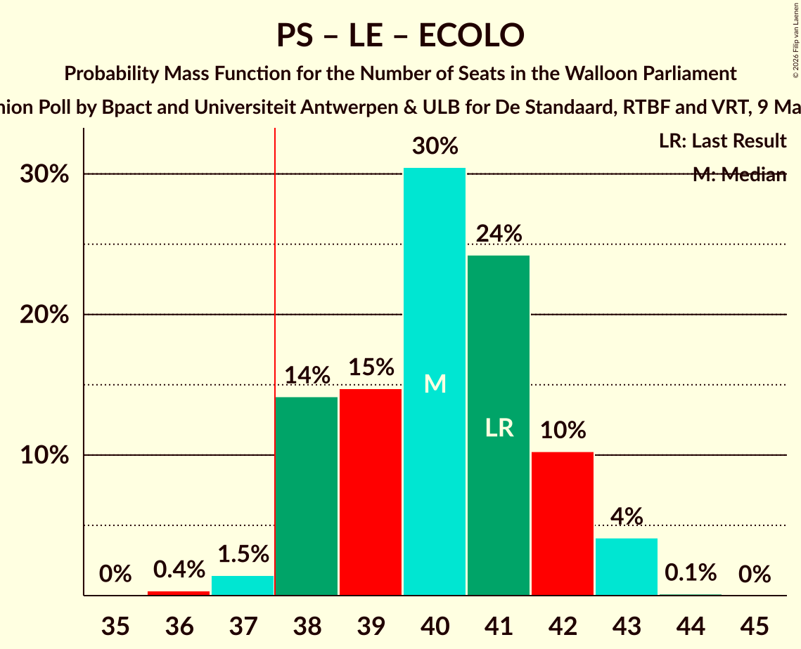

| Number of Seats | Probability | Accumulated | Special Marks |
|:---------------:|:-----------:|:-----------:|:-------------:|
| 36 | 0.4% | 100% |  |
| 37 | 1.5% | 99.6% |  |
| 38 | 14% | 98% | Majority |
| 39 | 15% | 84% | Median |
| 40 | 30% | 69% |  |
| 41 | 24% | 39% | Last Result |
| 42 | 10% | 15% |  |
| 43 | 4% | 4% |  |
| 44 | 0.1% | 0.1% |  |
| 45 | 0% | 0% |  |

### Parti Socialiste – Parti du Travail de Belgique – Ecolo

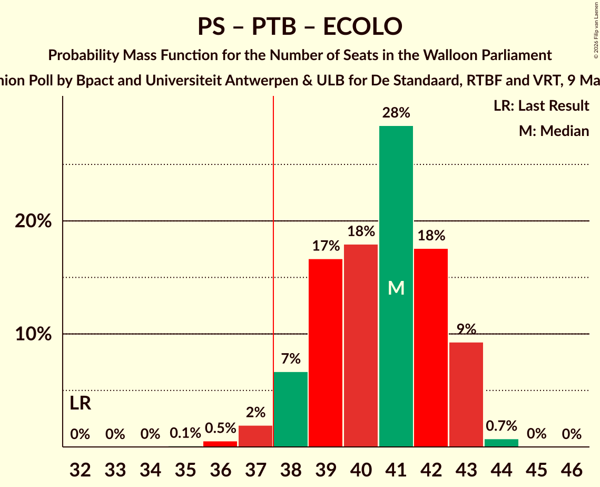

| Number of Seats | Probability | Accumulated | Special Marks |
|:---------------:|:-----------:|:-----------:|:-------------:|
| 32 | 0% | 100% | Last Result |
| 33 | 0% | 100% |  |
| 34 | 0% | 100% |  |
| 35 | 0.1% | 100% |  |
| 36 | 0.5% | 99.9% |  |
| 37 | 2% | 99.3% |  |
| 38 | 7% | 97% | Majority |
| 39 | 17% | 91% |  |
| 40 | 18% | 74% | Median |
| 41 | 28% | 56% |  |
| 42 | 18% | 28% |  |
| 43 | 9% | 10% |  |
| 44 | 0.7% | 0.8% |  |
| 45 | 0% | 0.1% |  |
| 46 | 0% | 0% |  |

### Parti Socialiste – Mouvement Réformateur

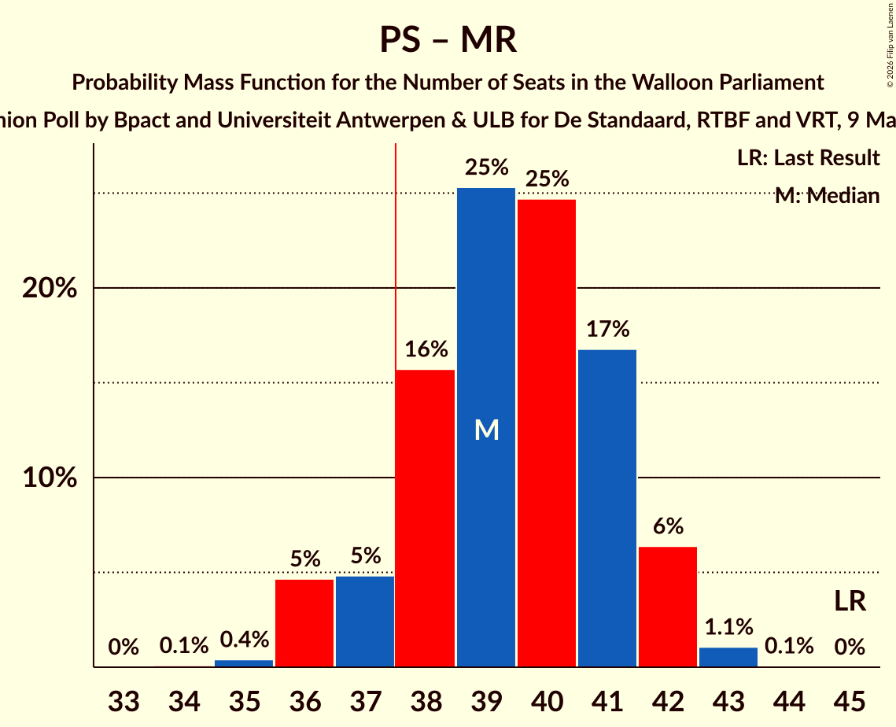

| Number of Seats | Probability | Accumulated | Special Marks |
|:---------------:|:-----------:|:-----------:|:-------------:|
| 34 | 0.1% | 100% |  |
| 35 | 0.4% | 99.9% |  |
| 36 | 5% | 99.5% |  |
| 37 | 5% | 95% |  |
| 38 | 16% | 90% | Majority |
| 39 | 25% | 74% | Median |
| 40 | 25% | 49% |  |
| 41 | 17% | 24% |  |
| 42 | 6% | 8% |  |
| 43 | 1.1% | 1.1% |  |
| 44 | 0.1% | 0.1% |  |
| 45 | 0% | 0% | Last Result |

### Mouvement Réformateur – Les Engagés – Ecolo

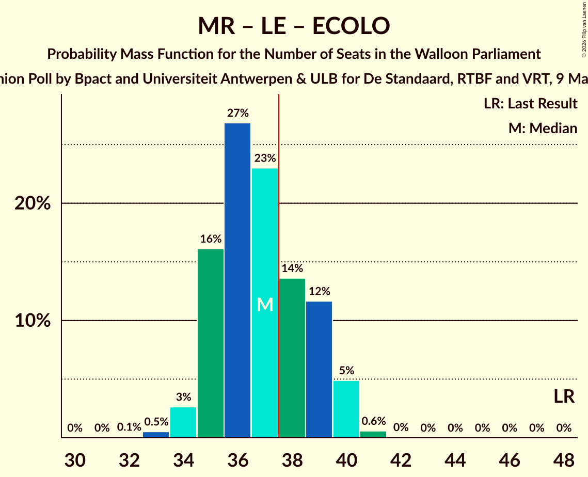

| Number of Seats | Probability | Accumulated | Special Marks |
|:---------------:|:-----------:|:-----------:|:-------------:|
| 32 | 0.1% | 100% |  |
| 33 | 0.5% | 99.9% |  |
| 34 | 3% | 99.4% |  |
| 35 | 16% | 97% |  |
| 36 | 27% | 81% | Median |
| 37 | 23% | 54% |  |
| 38 | 14% | 31% | Majority |
| 39 | 12% | 17% |  |
| 40 | 5% | 6% |  |
| 41 | 0.6% | 0.6% |  |
| 42 | 0% | 0% |  |
| 43 | 0% | 0% |  |
| 44 | 0% | 0% |  |
| 45 | 0% | 0% |  |
| 46 | 0% | 0% |  |
| 47 | 0% | 0% |  |
| 48 | 0% | 0% | Last Result |

### Parti Socialiste – Parti du Travail de Belgique

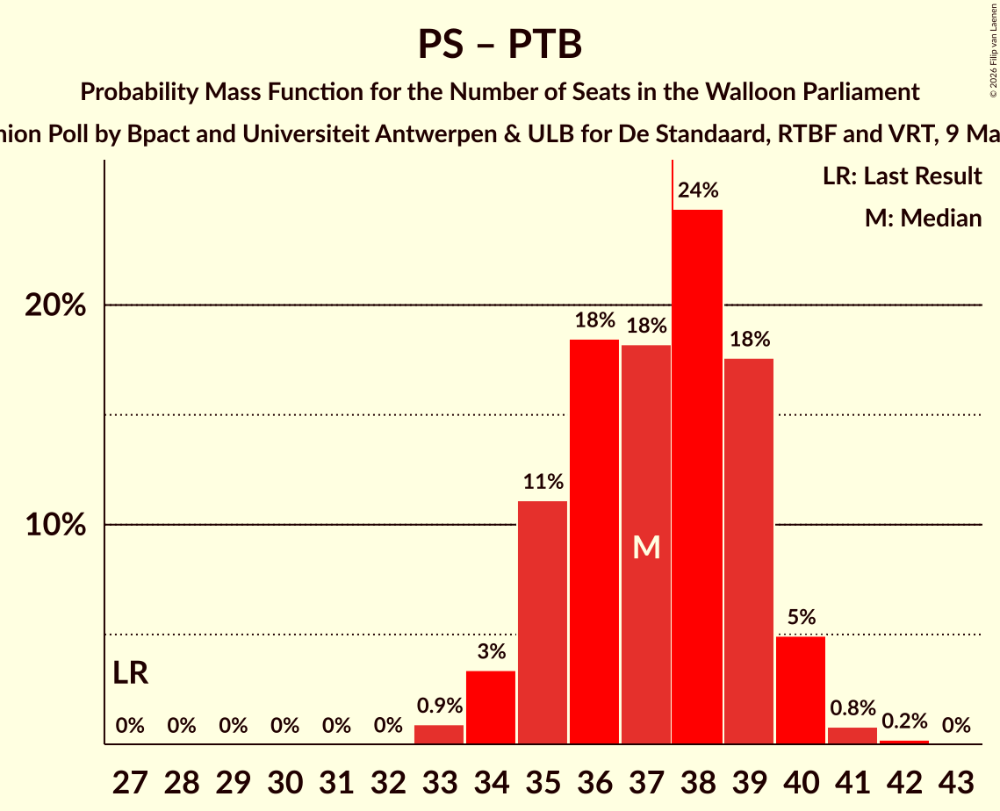

| Number of Seats | Probability | Accumulated | Special Marks |
|:---------------:|:-----------:|:-----------:|:-------------:|
| 27 | 0% | 100% | Last Result |
| 28 | 0% | 100% |  |
| 29 | 0% | 100% |  |
| 30 | 0% | 100% |  |
| 31 | 0% | 100% |  |
| 32 | 0% | 100% |  |
| 33 | 0.9% | 100% |  |
| 34 | 3% | 99.1% |  |
| 35 | 11% | 96% |  |
| 36 | 18% | 85% |  |
| 37 | 18% | 66% | Median |
| 38 | 24% | 48% | Majority |
| 39 | 18% | 24% |  |
| 40 | 5% | 6% |  |
| 41 | 0.8% | 1.0% |  |
| 42 | 0.2% | 0.2% |  |
| 43 | 0% | 0% |  |

### Parti Socialiste – Les Engagés

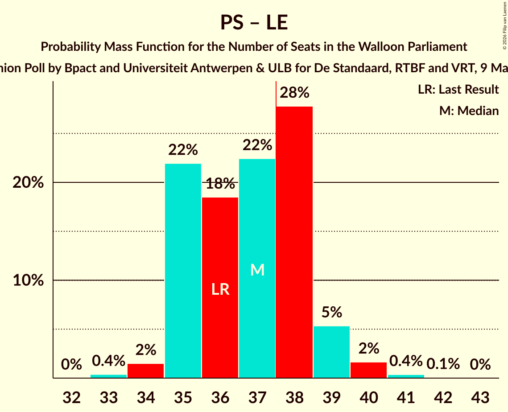

| Number of Seats | Probability | Accumulated | Special Marks |
|:---------------:|:-----------:|:-----------:|:-------------:|
| 33 | 0.4% | 100% |  |
| 34 | 2% | 99.6% |  |
| 35 | 22% | 98% |  |
| 36 | 18% | 76% | Last Result, Median |
| 37 | 22% | 58% |  |
| 38 | 28% | 35% | Majority |
| 39 | 5% | 7% |  |
| 40 | 2% | 2% |  |
| 41 | 0.4% | 0.4% |  |
| 42 | 0.1% | 0.1% |  |
| 43 | 0% | 0% |  |

### Mouvement Réformateur – Les Engagés

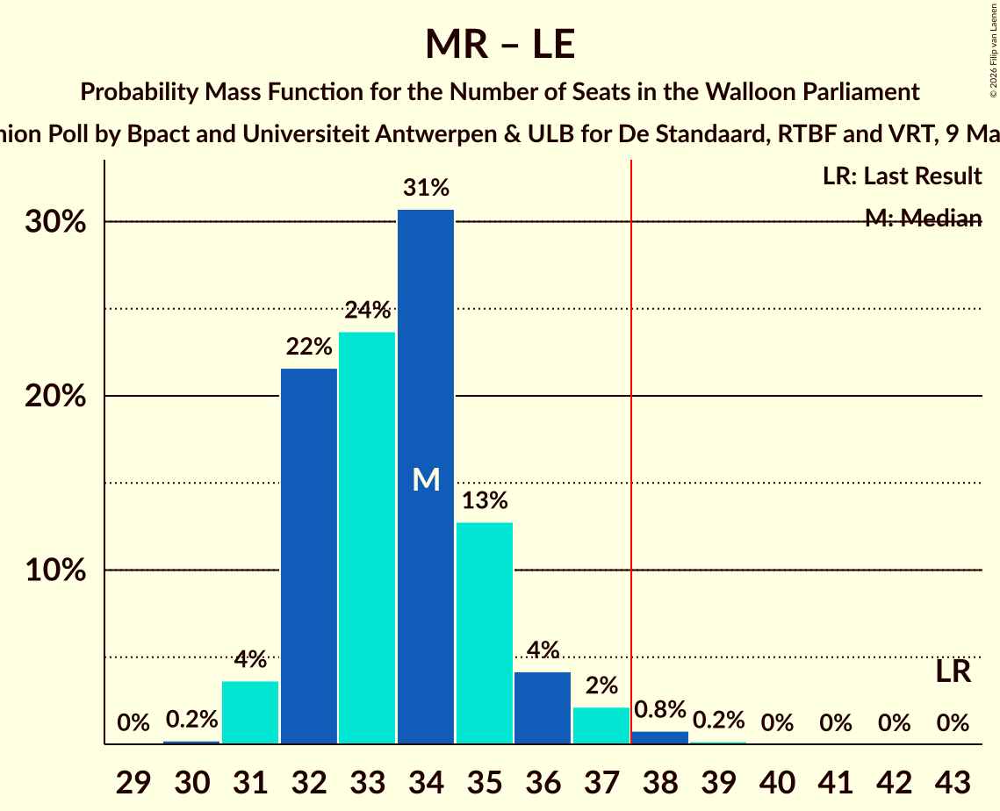

| Number of Seats | Probability | Accumulated | Special Marks |
|:---------------:|:-----------:|:-----------:|:-------------:|
| 30 | 0.2% | 100% |  |
| 31 | 4% | 99.8% |  |
| 32 | 22% | 96% |  |
| 33 | 24% | 75% | Median |
| 34 | 31% | 51% |  |
| 35 | 13% | 20% |  |
| 36 | 4% | 7% |  |
| 37 | 2% | 3% |  |
| 38 | 0.8% | 1.0% | Majority |
| 39 | 0.2% | 0.2% |  |
| 40 | 0% | 0% |  |
| 41 | 0% | 0% |  |
| 42 | 0% | 0% |  |
| 43 | 0% | 0% | Last Result |

### Parti Socialiste – Ecolo

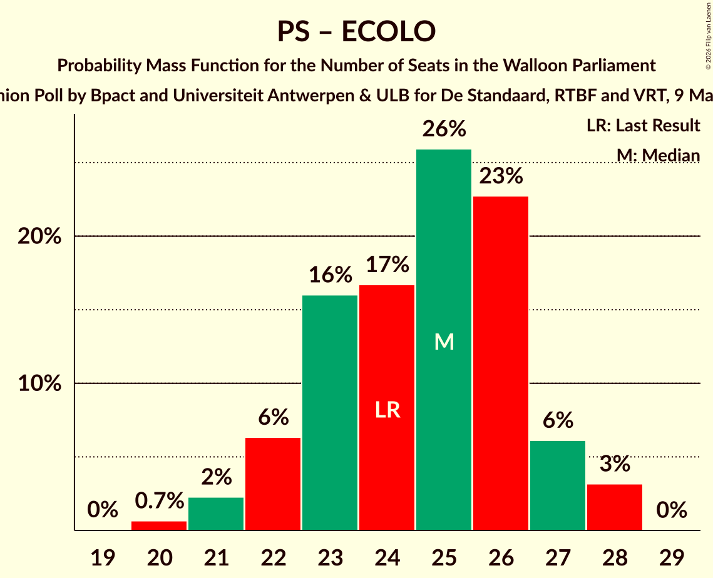

| Number of Seats | Probability | Accumulated | Special Marks |
|:---------------:|:-----------:|:-----------:|:-------------:|
| 19 | 0% | 100% |  |
| 20 | 0.7% | 99.9% |  |
| 21 | 2% | 99.3% |  |
| 22 | 6% | 97% |  |
| 23 | 16% | 91% |  |
| 24 | 17% | 75% | Last Result, Median |
| 25 | 26% | 58% |  |
| 26 | 23% | 32% |  |
| 27 | 6% | 9% |  |
| 28 | 3% | 3% |  |
| 29 | 0% | 0% |  |

### Mouvement Réformateur – Ecolo

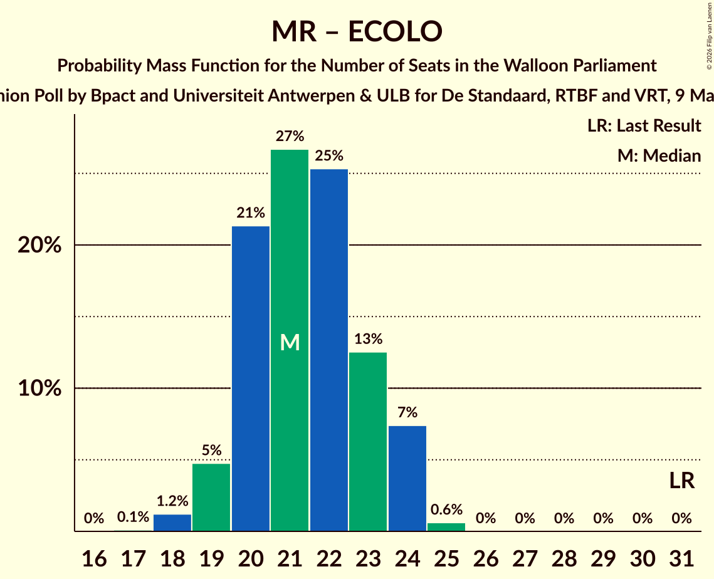

| Number of Seats | Probability | Accumulated | Special Marks |
|:---------------:|:-----------:|:-----------:|:-------------:|
| 17 | 0.1% | 100% |  |
| 18 | 1.2% | 99.9% |  |
| 19 | 5% | 98.7% |  |
| 20 | 21% | 94% |  |
| 21 | 27% | 73% | Median |
| 22 | 25% | 46% |  |
| 23 | 13% | 21% |  |
| 24 | 7% | 8% |  |
| 25 | 0.6% | 0.6% |  |
| 26 | 0% | 0% |  |
| 27 | 0% | 0% |  |
| 28 | 0% | 0% |  |
| 29 | 0% | 0% |  |
| 30 | 0% | 0% |  |
| 31 | 0% | 0% | Last Result |

### Parti du Travail de Belgique – Ecolo

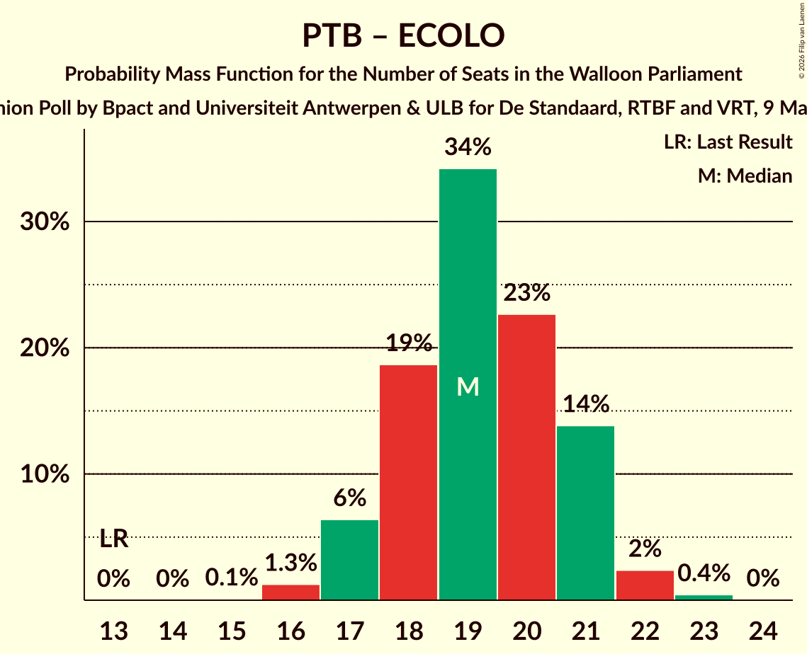

| Number of Seats | Probability | Accumulated | Special Marks |
|:---------------:|:-----------:|:-----------:|:-------------:|
| 13 | 0% | 100% | Last Result |
| 14 | 0% | 100% |  |
| 15 | 0.1% | 100% |  |
| 16 | 1.3% | 99.9% |  |
| 17 | 6% | 98.6% |  |
| 18 | 19% | 92% |  |
| 19 | 34% | 74% | Median |
| 20 | 23% | 39% |  |
| 21 | 14% | 17% |  |
| 22 | 2% | 3% |  |
| 23 | 0.4% | 0.5% |  |
| 24 | 0% | 0% |  |

## Technical Information

### Opinion Poll

+ **Polling firm:** Bpact and Universiteit Antwerpen & ULB
+ **Commissioner(s):** De Standaard, RTBF and VRT
+ **Fieldwork period:** 9 March–5 April 2026

### Calculations

+ **Sample size:** 1862
+ **Simulations done:** 2,097,152
+ **Error estimate:** 0.87%

