# Opinion Poll by Ipsos for Het Laatste Nieuws, Le Soir, RTL TVi and VTM, 1–9 June 2026

<a href="#voting-intentions">Voting Intentions</a> | <a href="#seats">Seats</a> | <a href="#coalitions">Coalitions</a> | <a href="#technical-information">Technical Information</a>

## Voting Intentions

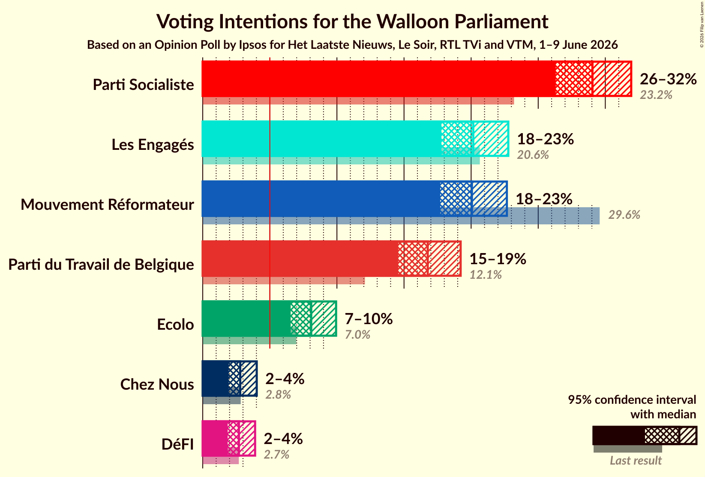

### Confidence Intervals

| Party | Last Result | Poll Result | 80% Confidence Interval | 90% Confidence Interval | 95% Confidence Interval | 99% Confidence Interval |
|:-----:|:-----------:|:-----------:|:-----------------------:|:-----------------------:|:-----------------------:|:-----------------------:|
| Parti Socialiste | 23.2% | 29.0% | 27.3–30.9% |26.7–31.5% |26.3–31.9% |25.5–32.9% |
| Les Engagés | 20.6% | 20.2% | 18.6–21.9% |18.2–22.3% |17.8–22.8% |17.1–23.6% |
| Mouvement Réformateur | 29.6% | 20.1% | 18.5–21.8% |18.1–22.2% |17.7–22.7% |17.0–23.5% |
| Parti du Travail de Belgique | 12.1% | 16.8% | 15.3–18.4% |14.9–18.8% |14.6–19.2% |13.9–20.0% |
| Ecolo | 7.0% | 8.1% | 7.1–9.3% |6.8–9.6% |6.6–9.9% |6.1–10.5% |
| Chez Nous | 2.8% | 2.8% | 2.2–3.6% |2.1–3.8% |1.9–4.0% |1.7–4.4% |
| DéFI | 2.7% | 2.7% | 2.1–3.5% |2.0–3.7% |1.9–3.9% |1.6–4.3% |

*Note:* The poll result column reflects the actual value used in the calculations. Published results may vary slightly, and in addition be rounded to fewer digits.

## Seats

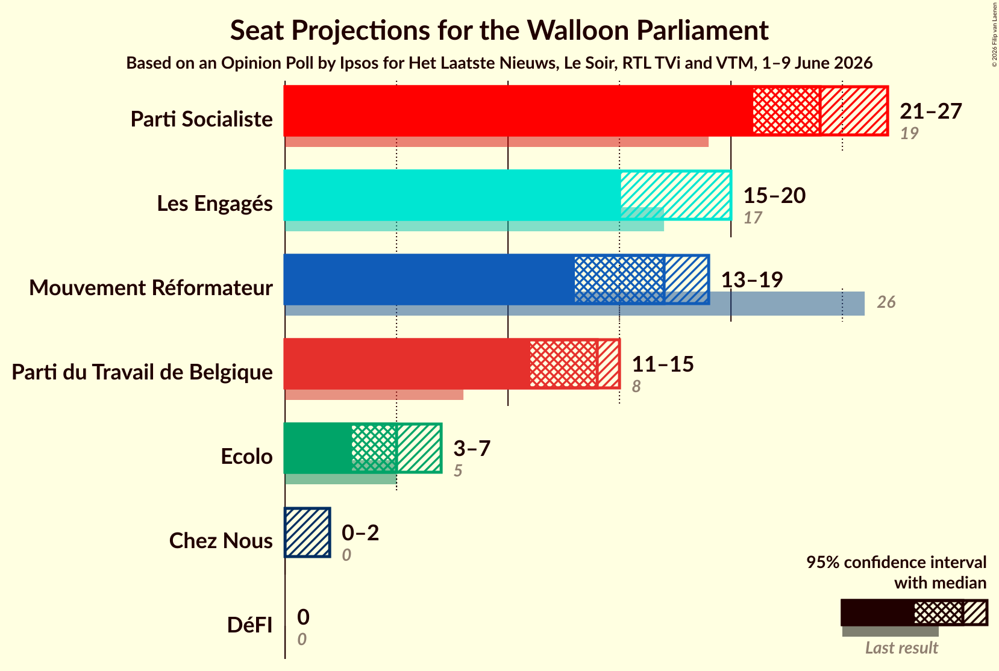

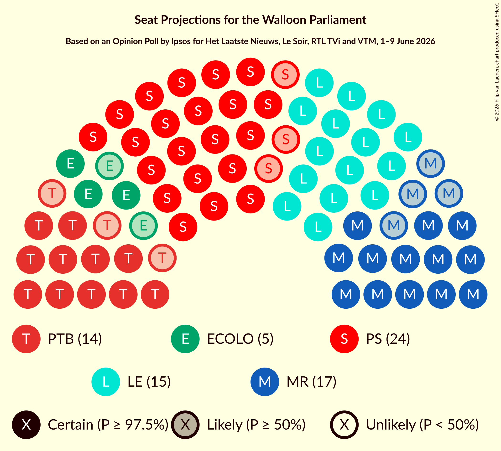

### Confidence Intervals

| Party | Last Result | Median | 80% Confidence Interval | 90% Confidence Interval | 95% Confidence Interval | 99% Confidence Interval |
|:-----:|:-----------:|:------:|:-----------------------:|:-----------------------:|:-----------------------:|:-----------------------:|
| <a href="#parti-socialiste">Parti Socialiste</a> | 19 | 24 | 23–26 |22–26 |21–27 |19–28 |
| <a href="#les-engagés">Les Engagés</a> | 17 | 15 | 15–18 |15–19 |15–20 |14–20 |
| <a href="#mouvement-réformateur">Mouvement Réformateur</a> | 26 | 17 | 14–18 |14–18 |13–19 |13–20 |
| <a href="#parti-du-travail-de-belgique">Parti du Travail de Belgique</a> | 8 | 14 | 12–14 |11–15 |11–15 |11–16 |
| <a href="#ecolo">Ecolo</a> | 5 | 5 | 4–6 |3–6 |3–7 |2–8 |
| <a href="#chez-nous">Chez Nous</a> | 0 | 0 | 0–2 |0–2 |0–2 |0–3 |
| <a href="#défi">DéFI</a> | 0 | 0 | 0 |0 |0 |0 |

### Parti Socialiste

*For a full overview of the results for this party, see the [Parti Socialiste](party-partisocialiste.html) page.*

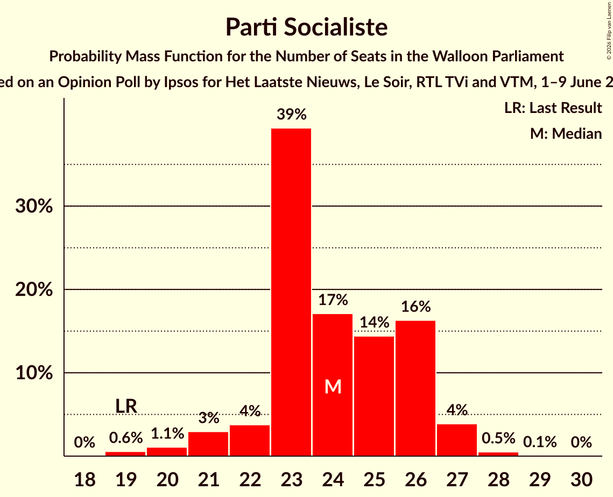

| Number of Seats | Probability | Accumulated | Special Marks |
|:---------------:|:-----------:|:-----------:|:-------------:|
| 19 | 0.6% | 100% | Last Result |
| 20 | 1.1% | 99.4% |  |
| 21 | 3% | 98% |  |
| 22 | 4% | 95% |  |
| 23 | 39% | 92% |  |
| 24 | 17% | 52% | Median |
| 25 | 14% | 35% |  |
| 26 | 16% | 21% |  |
| 27 | 4% | 4% |  |
| 28 | 0.5% | 0.6% |  |
| 29 | 0.1% | 0.1% |  |
| 30 | 0% | 0% |  |

### Les Engagés

*For a full overview of the results for this party, see the [Les Engagés](party-lesengagés.html) page.*

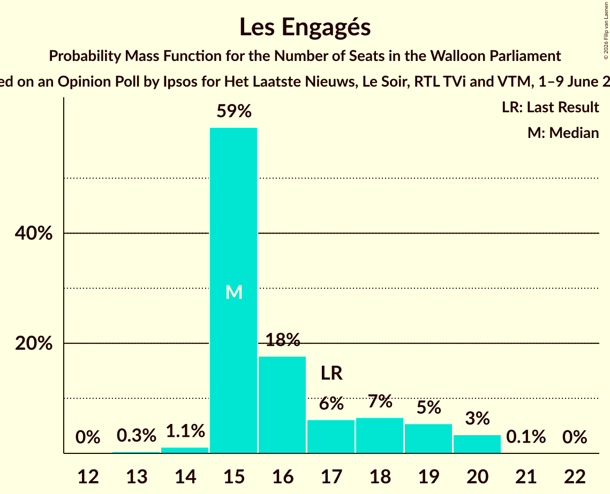

| Number of Seats | Probability | Accumulated | Special Marks |
|:---------------:|:-----------:|:-----------:|:-------------:|
| 13 | 0.3% | 100% |  |
| 14 | 1.1% | 99.7% |  |
| 15 | 59% | 98.5% | Median |
| 16 | 18% | 39% |  |
| 17 | 6% | 22% | Last Result |
| 18 | 7% | 15% |  |
| 19 | 5% | 9% |  |
| 20 | 3% | 4% |  |
| 21 | 0.1% | 0.1% |  |
| 22 | 0% | 0% |  |

### Mouvement Réformateur

*For a full overview of the results for this party, see the [Mouvement Réformateur](party-mouvementréformateur.html) page.*

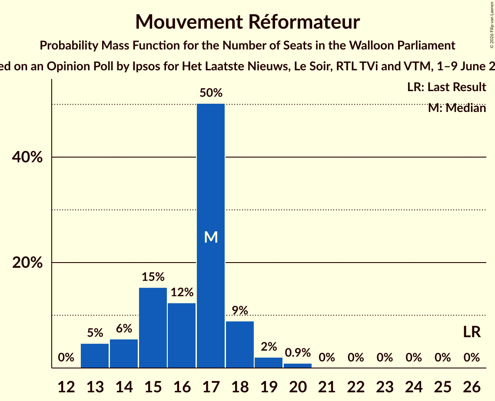

| Number of Seats | Probability | Accumulated | Special Marks |
|:---------------:|:-----------:|:-----------:|:-------------:|
| 13 | 5% | 100% |  |
| 14 | 6% | 95% |  |
| 15 | 15% | 90% |  |
| 16 | 12% | 74% |  |
| 17 | 50% | 62% | Median |
| 18 | 9% | 12% |  |
| 19 | 2% | 3% |  |
| 20 | 0.9% | 0.9% |  |
| 21 | 0% | 0% |  |
| 22 | 0% | 0% |  |
| 23 | 0% | 0% |  |
| 24 | 0% | 0% |  |
| 25 | 0% | 0% |  |
| 26 | 0% | 0% | Last Result |

### Parti du Travail de Belgique

*For a full overview of the results for this party, see the [Parti du Travail de Belgique](party-partidutravaildebelgique.html) page.*

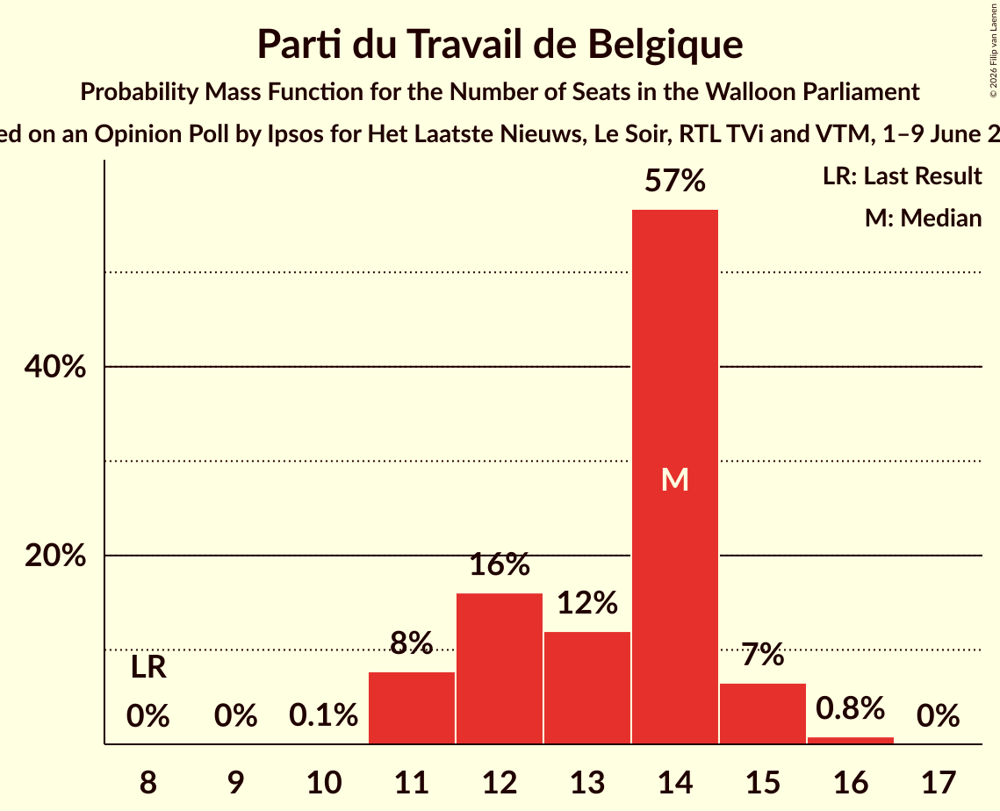

| Number of Seats | Probability | Accumulated | Special Marks |
|:---------------:|:-----------:|:-----------:|:-------------:|
| 8 | 0% | 100% | Last Result |
| 9 | 0% | 100% |  |
| 10 | 0.1% | 100% |  |
| 11 | 8% | 99.9% |  |
| 12 | 16% | 92% |  |
| 13 | 12% | 76% |  |
| 14 | 57% | 64% | Median |
| 15 | 7% | 7% |  |
| 16 | 0.8% | 0.8% |  |
| 17 | 0% | 0% |  |

### Ecolo

*For a full overview of the results for this party, see the [Ecolo](party-ecolo.html) page.*

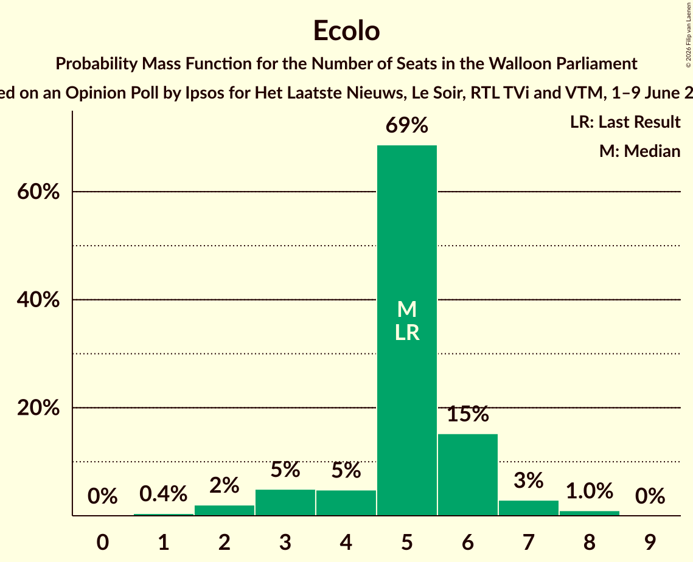

| Number of Seats | Probability | Accumulated | Special Marks |
|:---------------:|:-----------:|:-----------:|:-------------:|
| 1 | 0.4% | 100% |  |
| 2 | 2% | 99.6% |  |
| 3 | 5% | 98% |  |
| 4 | 5% | 93% |  |
| 5 | 69% | 88% | Last Result, Median |
| 6 | 15% | 19% |  |
| 7 | 3% | 4% |  |
| 8 | 1.0% | 1.0% |  |
| 9 | 0% | 0% |  |

### Chez Nous

*For a full overview of the results for this party, see the [Chez Nous](party-cheznous.html) page.*

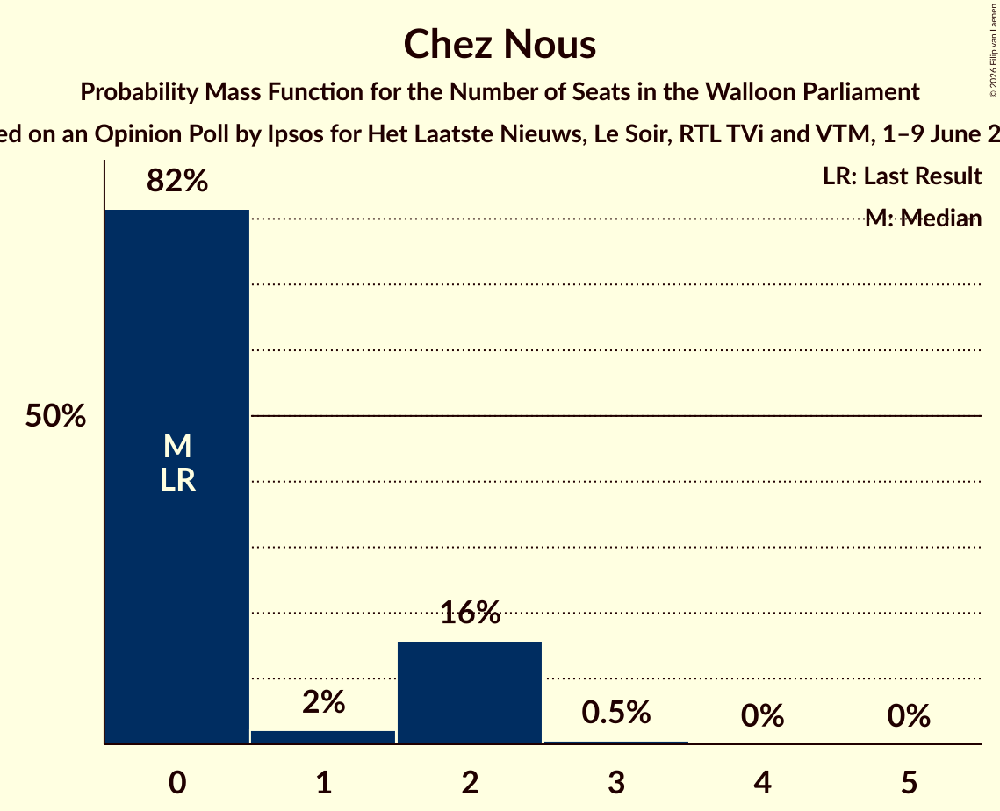

| Number of Seats | Probability | Accumulated | Special Marks |
|:---------------:|:-----------:|:-----------:|:-------------:|
| 0 | 82% | 100% | Last Result, Median |
| 1 | 2% | 18% |  |
| 2 | 16% | 16% |  |
| 3 | 0.5% | 0.6% |  |
| 4 | 0% | 0% |  |

### DéFI

*For a full overview of the results for this party, see the [DéFI](party-défi.html) page.*

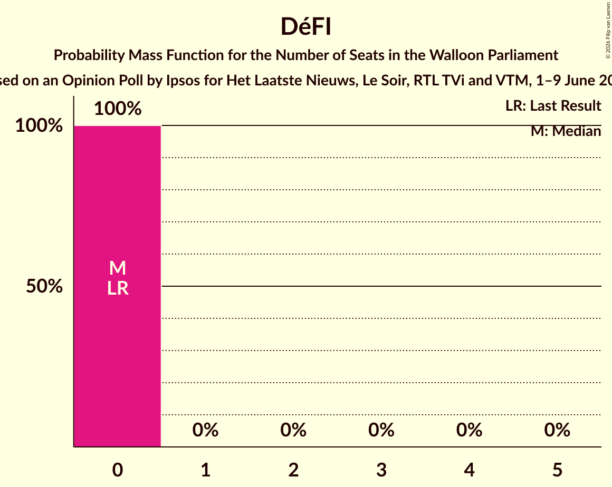

| Number of Seats | Probability | Accumulated | Special Marks |
|:---------------:|:-----------:|:-----------:|:-------------:|
| 0 | 100% | 100% | Last Result, Median |

## Coalitions

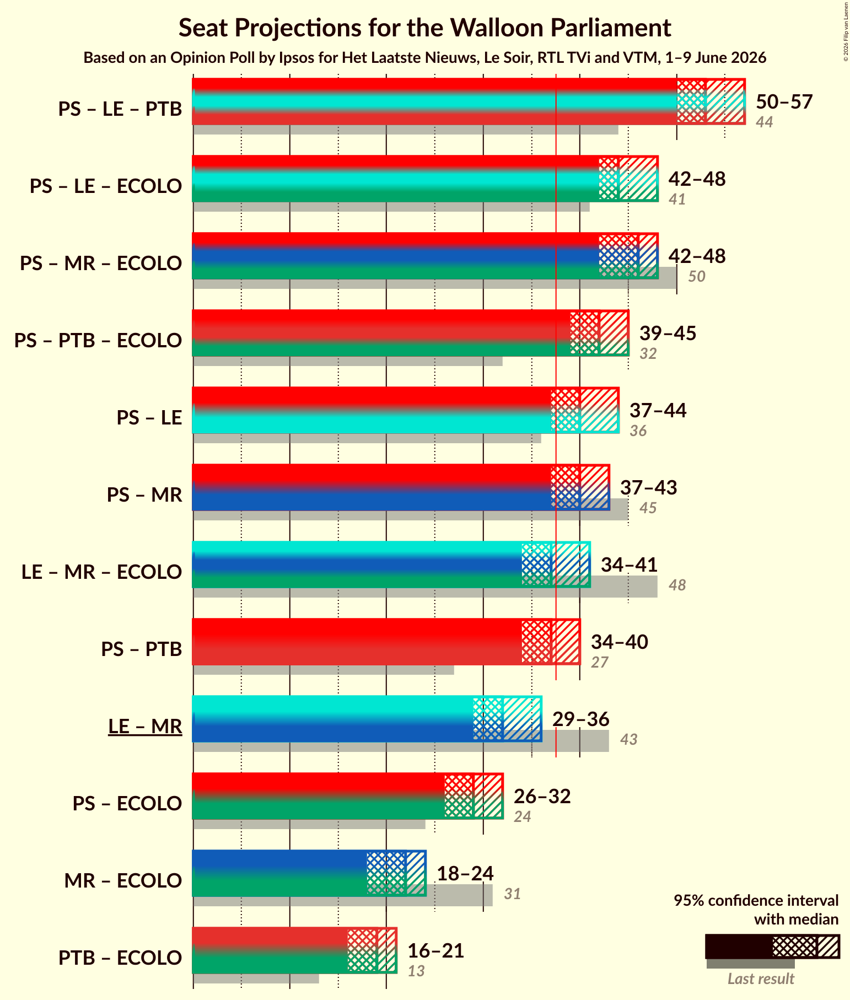

### Confidence Intervals

| Coalition | Last Result | Median | Majority? | 80% Confidence Interval | 90% Confidence Interval | 95% Confidence Interval | 99% Confidence Interval |
|:---------:|:-----------:|:------:|:---------:|:-----------------------:|:-----------------------:|:-----------------------:|:-----------------------:|
| Parti Socialiste – Les Engagés – Parti du Travail de Belgique | 44 | 53 | 100% | 51–55 | 51–56 | 50–57 | 49–58 |
| Parti Socialiste – Les Engagés – Ecolo | 41 | 44 | 100% | 43–47 | 43–48 | 42–48 | 41–50 |
| Parti Socialiste – Mouvement Réformateur – Ecolo | 50 | 46 | 100% | 43–47 | 42–48 | 42–48 | 40–49 |
| Parti Socialiste – Parti du Travail de Belgique – Ecolo | 32 | 42 | 99.8% | 40–45 | 39–45 | 39–45 | 38–47 |
| Parti Socialiste – Les Engagés | 36 | 40 | 97% | 38–42 | 38–43 | 37–44 | 36–45 |
| Parti Socialiste – Mouvement Réformateur | 45 | 40 | 95% | 38–42 | 37–43 | 37–43 | 35–44 |
| Les Engagés – Mouvement Réformateur – Ecolo | 48 | 37 | 46% | 35–39 | 35–40 | 34–41 | 33–42 |
| Parti Socialiste – Parti du Travail de Belgique | 27 | 37 | 45% | 35–40 | 34–40 | 34–40 | 33–41 |
| Les Engagés – Mouvement Réformateur | 43 | 32 | 0.1% | 30–34 | 30–35 | 29–36 | 28–37 |
| Parti Socialiste – Ecolo | 24 | 29 | 0% | 27–31 | 26–32 | 26–32 | 24–33 |
| Mouvement Réformateur – Ecolo | 31 | 22 | 0% | 19–23 | 19–23 | 18–24 | 17–25 |
| Parti du Travail de Belgique – Ecolo | 13 | 19 | 0% | 17–20 | 16–20 | 16–21 | 14–22 |

### Parti Socialiste – Les Engagés – Parti du Travail de Belgique

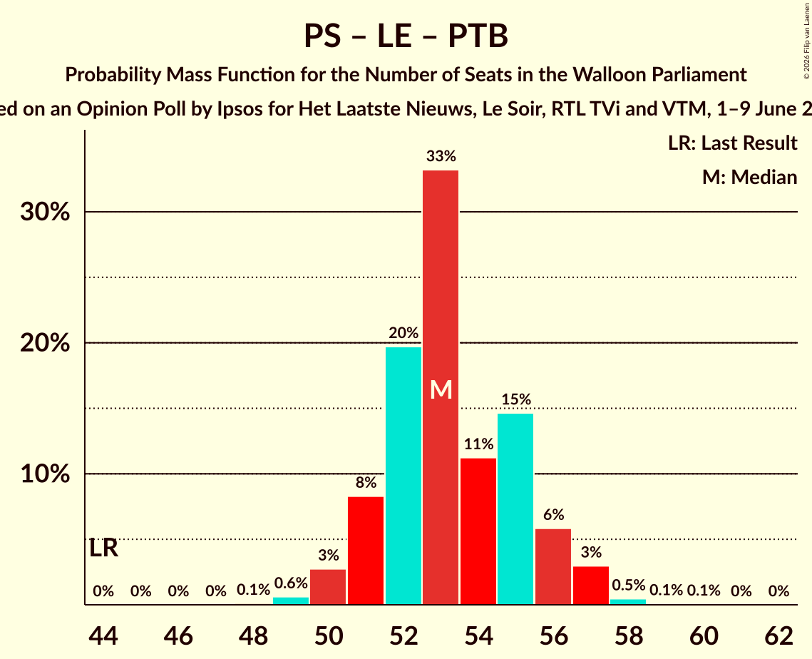

| Number of Seats | Probability | Accumulated | Special Marks |
|:---------------:|:-----------:|:-----------:|:-------------:|
| 44 | 0% | 100% | Last Result |
| 45 | 0% | 100% |  |
| 46 | 0% | 100% |  |
| 47 | 0% | 100% |  |
| 48 | 0.1% | 100% |  |
| 49 | 0.6% | 99.9% |  |
| 50 | 3% | 99.3% |  |
| 51 | 8% | 97% |  |
| 52 | 20% | 88% |  |
| 53 | 33% | 69% | Median |
| 54 | 11% | 35% |  |
| 55 | 15% | 24% |  |
| 56 | 6% | 9% |  |
| 57 | 3% | 4% |  |
| 58 | 0.5% | 0.6% |  |
| 59 | 0.1% | 0.2% |  |
| 60 | 0.1% | 0.1% |  |
| 61 | 0% | 0% |  |

### Parti Socialiste – Les Engagés – Ecolo

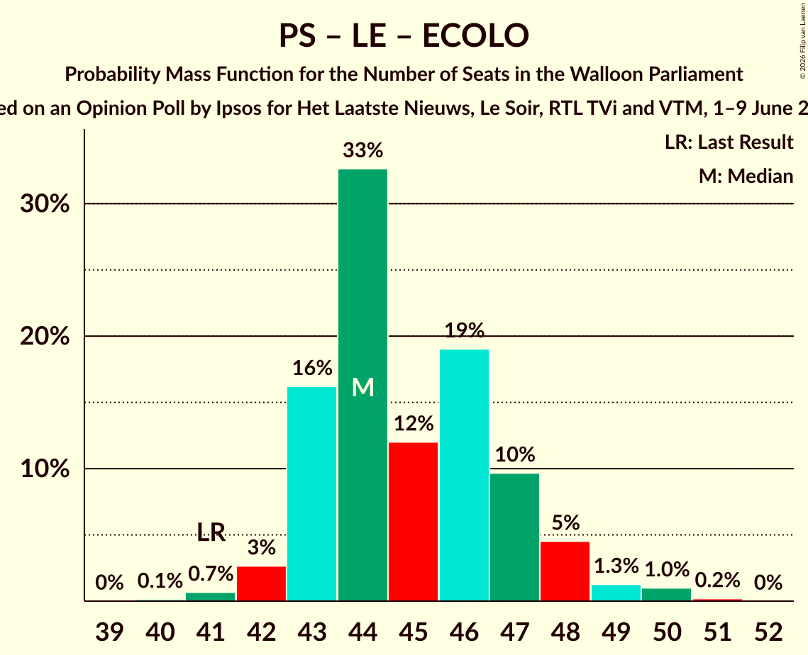

| Number of Seats | Probability | Accumulated | Special Marks |
|:---------------:|:-----------:|:-----------:|:-------------:|
| 40 | 0.1% | 100% |  |
| 41 | 0.7% | 99.9% | Last Result |
| 42 | 3% | 99.2% |  |
| 43 | 16% | 97% |  |
| 44 | 33% | 80% | Median |
| 45 | 12% | 48% |  |
| 46 | 19% | 36% |  |
| 47 | 10% | 17% |  |
| 48 | 5% | 7% |  |
| 49 | 1.3% | 2% |  |
| 50 | 1.0% | 1.2% |  |
| 51 | 0.2% | 0.2% |  |
| 52 | 0% | 0% |  |

### Parti Socialiste – Mouvement Réformateur – Ecolo

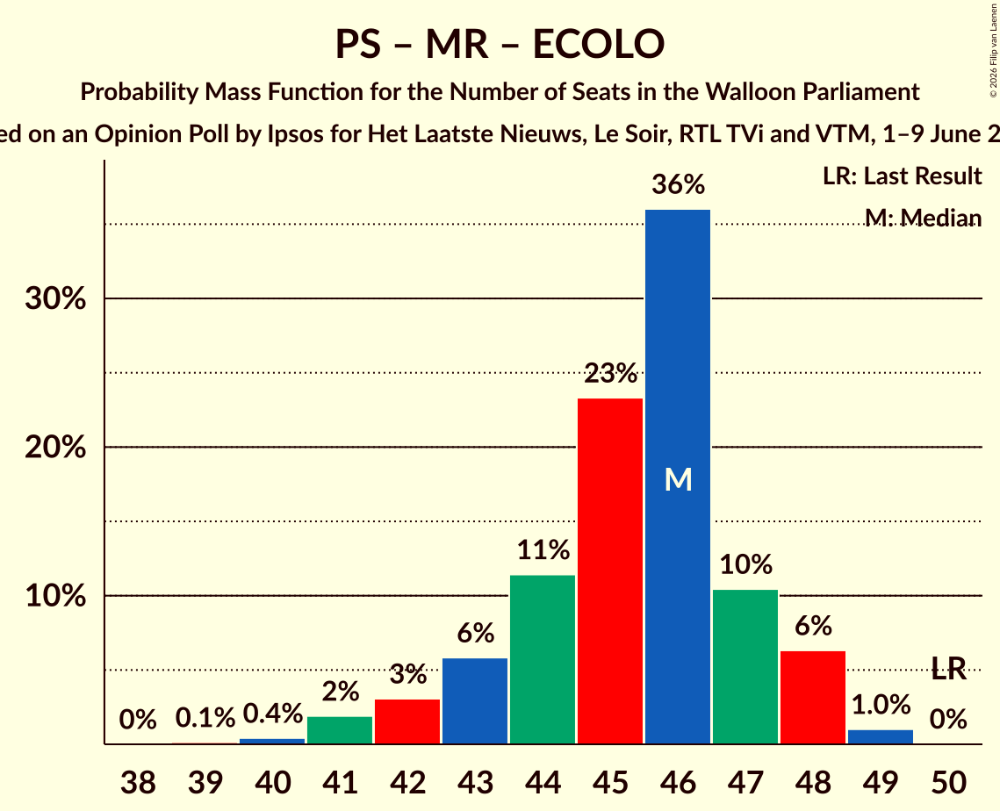

| Number of Seats | Probability | Accumulated | Special Marks |
|:---------------:|:-----------:|:-----------:|:-------------:|
| 39 | 0.1% | 100% |  |
| 40 | 0.4% | 99.9% |  |
| 41 | 2% | 99.4% |  |
| 42 | 3% | 98% |  |
| 43 | 6% | 94% |  |
| 44 | 11% | 89% |  |
| 45 | 23% | 77% |  |
| 46 | 36% | 54% | Median |
| 47 | 10% | 18% |  |
| 48 | 6% | 7% |  |
| 49 | 1.0% | 1.1% |  |
| 50 | 0% | 0% | Last Result |

### Parti Socialiste – Parti du Travail de Belgique – Ecolo

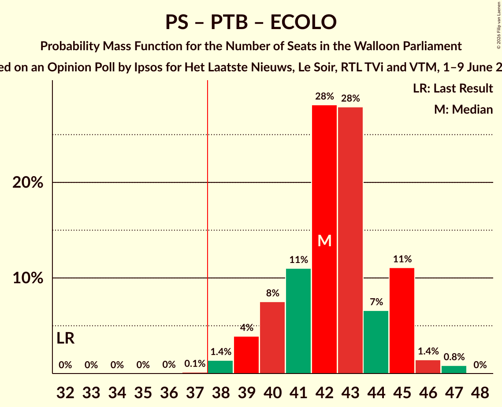

| Number of Seats | Probability | Accumulated | Special Marks |
|:---------------:|:-----------:|:-----------:|:-------------:|
| 32 | 0% | 100% | Last Result |
| 33 | 0% | 100% |  |
| 34 | 0% | 100% |  |
| 35 | 0% | 100% |  |
| 36 | 0% | 100% |  |
| 37 | 0.1% | 99.9% |  |
| 38 | 1.4% | 99.8% | Majority |
| 39 | 4% | 98% |  |
| 40 | 8% | 95% |  |
| 41 | 11% | 87% |  |
| 42 | 28% | 76% |  |
| 43 | 28% | 48% | Median |
| 44 | 7% | 20% |  |
| 45 | 11% | 13% |  |
| 46 | 1.4% | 2% |  |
| 47 | 0.8% | 0.8% |  |
| 48 | 0% | 0% |  |

### Parti Socialiste – Les Engagés

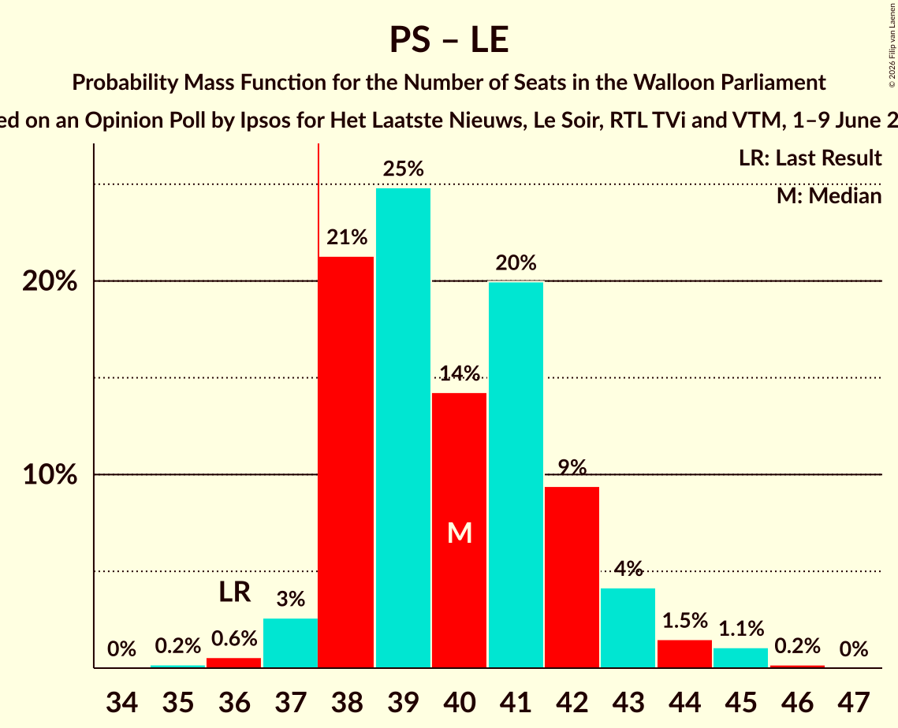

| Number of Seats | Probability | Accumulated | Special Marks |
|:---------------:|:-----------:|:-----------:|:-------------:|
| 35 | 0.2% | 100% |  |
| 36 | 0.6% | 99.8% | Last Result |
| 37 | 3% | 99.2% |  |
| 38 | 21% | 97% | Majority |
| 39 | 25% | 75% | Median |
| 40 | 14% | 51% |  |
| 41 | 20% | 36% |  |
| 42 | 9% | 16% |  |
| 43 | 4% | 7% |  |
| 44 | 1.5% | 3% |  |
| 45 | 1.1% | 1.3% |  |
| 46 | 0.2% | 0.2% |  |
| 47 | 0% | 0% |  |

### Parti Socialiste – Mouvement Réformateur

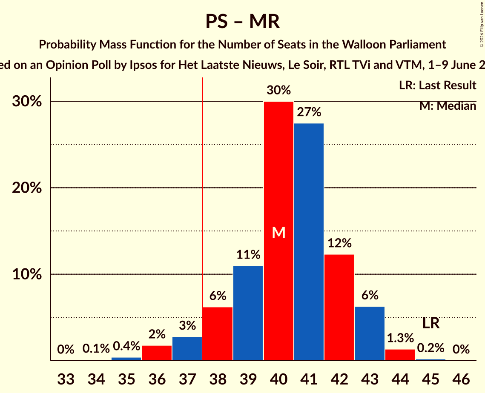

| Number of Seats | Probability | Accumulated | Special Marks |
|:---------------:|:-----------:|:-----------:|:-------------:|
| 34 | 0.1% | 100% |  |
| 35 | 0.4% | 99.9% |  |
| 36 | 2% | 99.4% |  |
| 37 | 3% | 98% |  |
| 38 | 6% | 95% | Majority |
| 39 | 11% | 89% |  |
| 40 | 30% | 78% |  |
| 41 | 27% | 48% | Median |
| 42 | 12% | 20% |  |
| 43 | 6% | 8% |  |
| 44 | 1.3% | 2% |  |
| 45 | 0.2% | 0.2% | Last Result |
| 46 | 0% | 0% |  |

### Les Engagés – Mouvement Réformateur – Ecolo

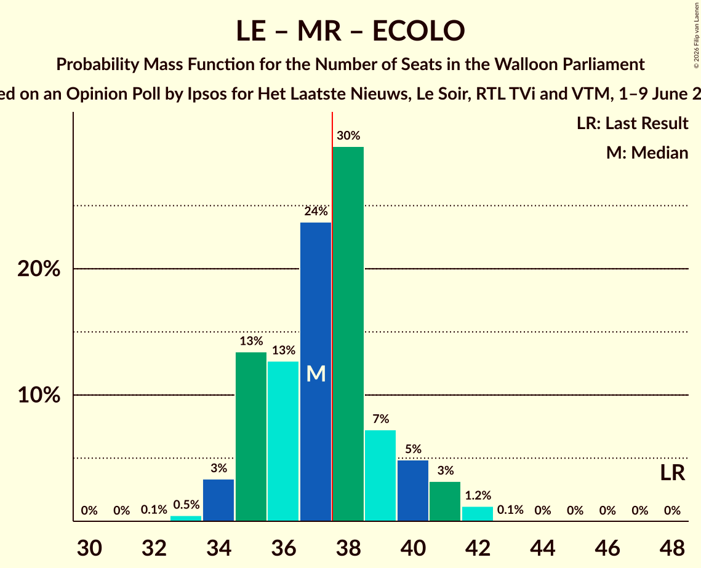

| Number of Seats | Probability | Accumulated | Special Marks |
|:---------------:|:-----------:|:-----------:|:-------------:|
| 32 | 0.1% | 100% |  |
| 33 | 0.5% | 99.9% |  |
| 34 | 3% | 99.5% |  |
| 35 | 13% | 96% |  |
| 36 | 13% | 83% |  |
| 37 | 24% | 70% | Median |
| 38 | 30% | 46% | Majority |
| 39 | 7% | 17% |  |
| 40 | 5% | 9% |  |
| 41 | 3% | 4% |  |
| 42 | 1.2% | 1.3% |  |
| 43 | 0.1% | 0.1% |  |
| 44 | 0% | 0% |  |
| 45 | 0% | 0% |  |
| 46 | 0% | 0% |  |
| 47 | 0% | 0% |  |
| 48 | 0% | 0% | Last Result |

### Parti Socialiste – Parti du Travail de Belgique

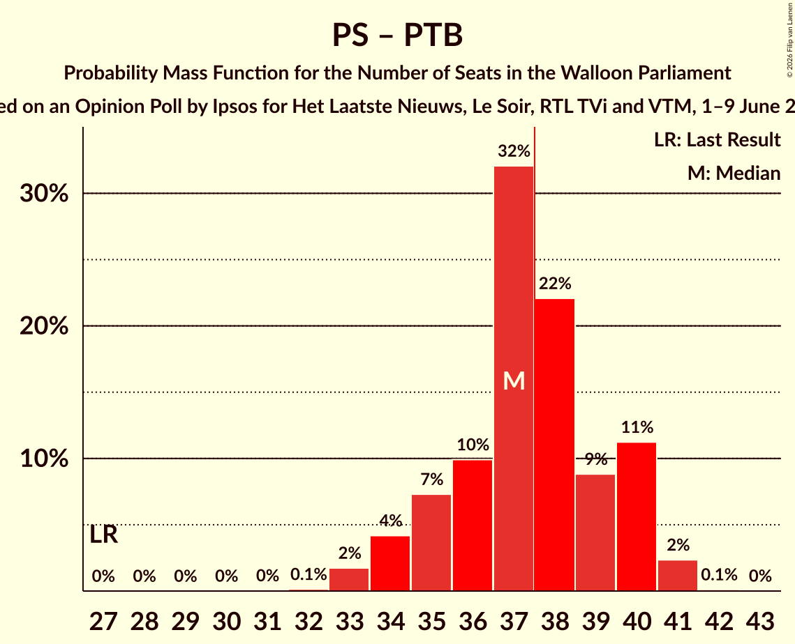

| Number of Seats | Probability | Accumulated | Special Marks |
|:---------------:|:-----------:|:-----------:|:-------------:|
| 27 | 0% | 100% | Last Result |
| 28 | 0% | 100% |  |
| 29 | 0% | 100% |  |
| 30 | 0% | 100% |  |
| 31 | 0% | 100% |  |
| 32 | 0.1% | 100% |  |
| 33 | 2% | 99.8% |  |
| 34 | 4% | 98% |  |
| 35 | 7% | 94% |  |
| 36 | 10% | 87% |  |
| 37 | 32% | 77% |  |
| 38 | 22% | 45% | Median, Majority |
| 39 | 9% | 23% |  |
| 40 | 11% | 14% |  |
| 41 | 2% | 2% |  |
| 42 | 0.1% | 0.1% |  |
| 43 | 0% | 0% |  |

### Les Engagés – Mouvement Réformateur

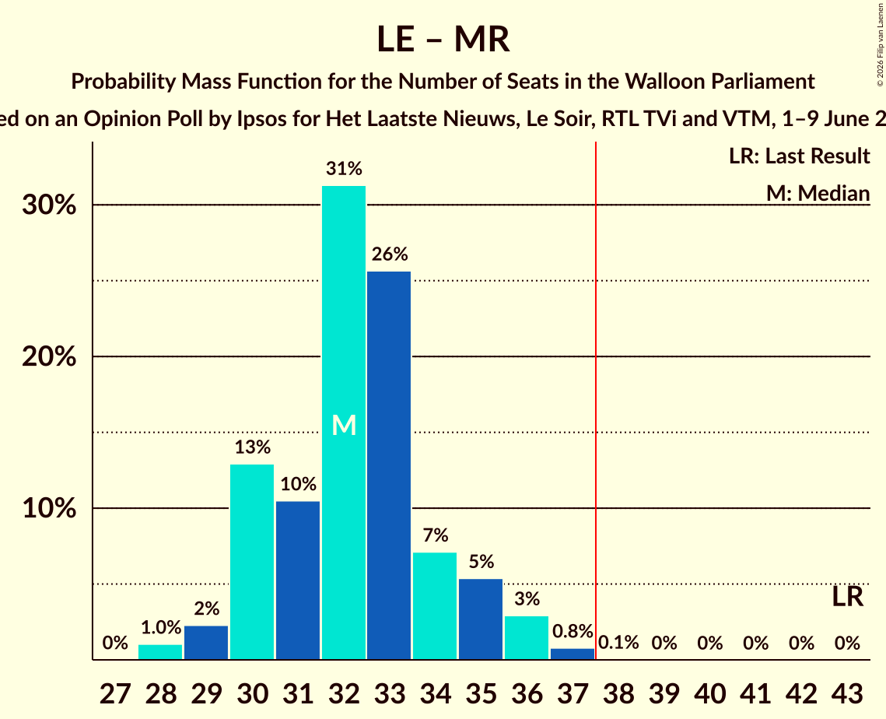

| Number of Seats | Probability | Accumulated | Special Marks |
|:---------------:|:-----------:|:-----------:|:-------------:|
| 28 | 1.0% | 100% |  |
| 29 | 2% | 98.9% |  |
| 30 | 13% | 97% |  |
| 31 | 10% | 84% |  |
| 32 | 31% | 73% | Median |
| 33 | 26% | 42% |  |
| 34 | 7% | 16% |  |
| 35 | 5% | 9% |  |
| 36 | 3% | 4% |  |
| 37 | 0.8% | 0.9% |  |
| 38 | 0.1% | 0.1% | Majority |
| 39 | 0% | 0% |  |
| 40 | 0% | 0% |  |
| 41 | 0% | 0% |  |
| 42 | 0% | 0% |  |
| 43 | 0% | 0% | Last Result |

### Parti Socialiste – Ecolo

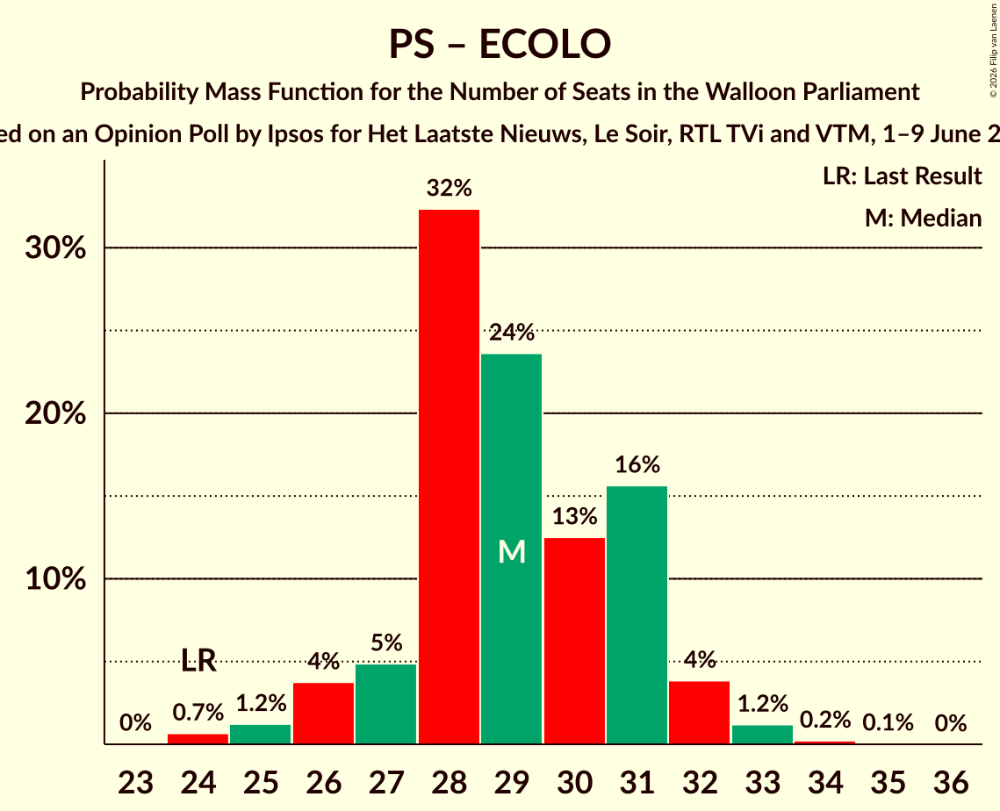

| Number of Seats | Probability | Accumulated | Special Marks |
|:---------------:|:-----------:|:-----------:|:-------------:|
| 24 | 0.7% | 100% | Last Result |
| 25 | 1.2% | 99.3% |  |
| 26 | 4% | 98% |  |
| 27 | 5% | 94% |  |
| 28 | 32% | 89% |  |
| 29 | 24% | 57% | Median |
| 30 | 13% | 33% |  |
| 31 | 16% | 21% |  |
| 32 | 4% | 5% |  |
| 33 | 1.2% | 1.5% |  |
| 34 | 0.2% | 0.3% |  |
| 35 | 0.1% | 0.1% |  |
| 36 | 0% | 0% |  |

### Mouvement Réformateur – Ecolo

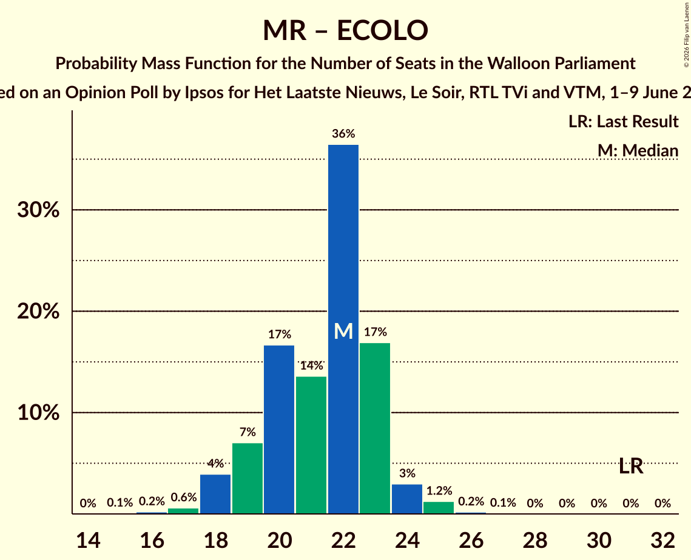

| Number of Seats | Probability | Accumulated | Special Marks |
|:---------------:|:-----------:|:-----------:|:-------------:|
| 15 | 0.1% | 100% |  |
| 16 | 0.2% | 99.9% |  |
| 17 | 0.6% | 99.7% |  |
| 18 | 4% | 99.1% |  |
| 19 | 7% | 95% |  |
| 20 | 17% | 88% |  |
| 21 | 14% | 71% |  |
| 22 | 36% | 58% | Median |
| 23 | 17% | 21% |  |
| 24 | 3% | 4% |  |
| 25 | 1.2% | 2% |  |
| 26 | 0.2% | 0.3% |  |
| 27 | 0.1% | 0.1% |  |
| 28 | 0% | 0% |  |
| 29 | 0% | 0% |  |
| 30 | 0% | 0% |  |
| 31 | 0% | 0% | Last Result |

### Parti du Travail de Belgique – Ecolo

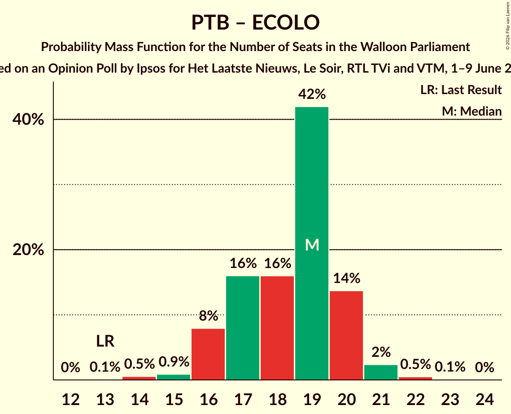

| Number of Seats | Probability | Accumulated | Special Marks |
|:---------------:|:-----------:|:-----------:|:-------------:|
| 13 | 0.1% | 100% | Last Result |
| 14 | 0.5% | 99.9% |  |
| 15 | 0.9% | 99.4% |  |
| 16 | 8% | 98.5% |  |
| 17 | 16% | 91% |  |
| 18 | 16% | 75% |  |
| 19 | 42% | 59% | Median |
| 20 | 14% | 17% |  |
| 21 | 2% | 3% |  |
| 22 | 0.5% | 0.6% |  |
| 23 | 0.1% | 0.1% |  |
| 24 | 0% | 0% |  |

## Technical Information

### Opinion Poll

+ **Polling firm:** Ipsos
+ **Commissioner(s):** Het Laatste Nieuws, Le Soir, RTL TVi and VTM
+ **Fieldwork period:** 1–9 June 2026

### Calculations

+ **Sample size:** 1002
+ **Simulations done:** 2,097,152
+ **Error estimate:** 1.25%

