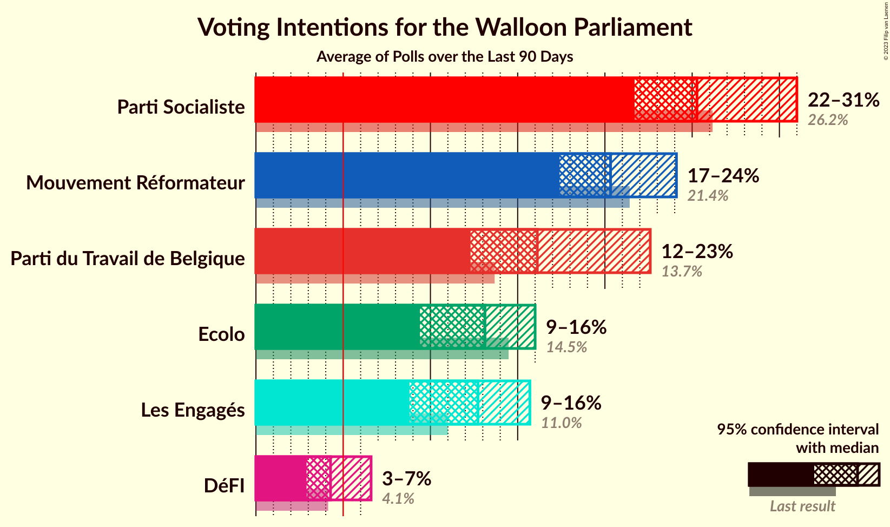
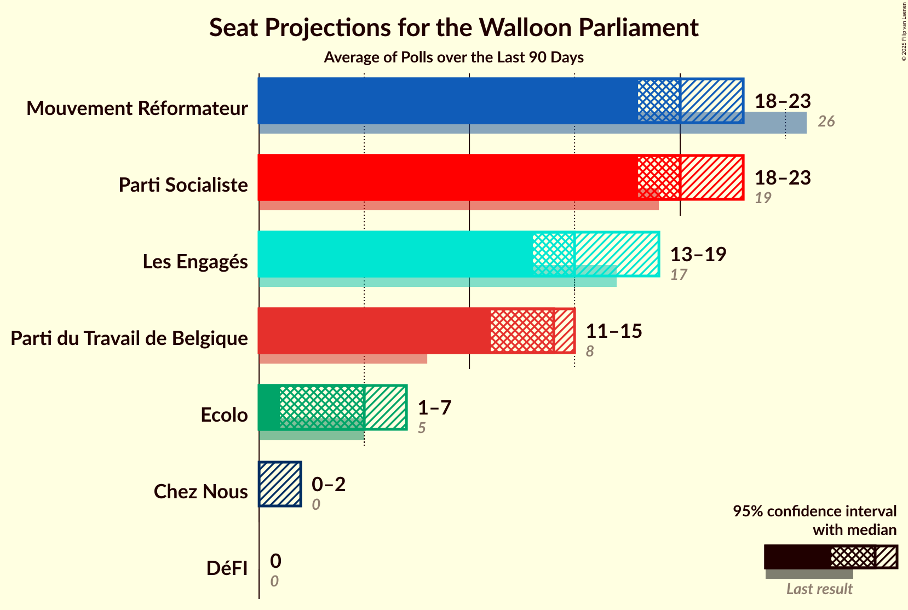

# Poll Average

<a href="#voting-intentions">Voting Intentions</a> | <a href="#seats">Seats</a> | <a href="#coalitions">Coalitions</a> | <a href="#technical-information">Technical Information</a>

## Summary

The table below lists the polls on which the average is based. They are the most recent polls (less than 90 days old) registered and analyzed so far.

| Period     | Pollster/Media   | PS | MR | CDH | ECOLO | PTB | PP | DÉFI | DROITE | DLB | RWF | WDA | PIRATE | FW |
|:----------:|:----------------:|:--:|:--:|:--:|:--:|:--:|:--:|:--:|:--:|:--:|:--:|:--:|:--:|:--:|
| 25 May 2014 | General Election | 30.9%   30 | 26.7%   25 | 15.2%   13 | 8.6%   4 | 5.8%   2 | 4.9%   1 | 2.5%   0 | 1.4%   0 | 0.8%   0 | 0.5%   0 | 0.4%   0 | 0.2%   0 | 0.1%   0 |
| N/A | Poll Average | 14–23%   12–21 | 19–26%   17–24 | 7–12%   5–10 | 10–15%   6–13 | 16–28%   13–24 | 3–6%   0–3 | 3–8%   0–5 | 1–3%   0 | N/A   N/A | N/A   N/A | N/A   N/A | N/A   N/A | N/A   N/A |
| [25 August–3 September 2017](2017-09-03-Ipsos.html) | Ipsos   RTL TVi–Le Soir–VTM–Het Laatste Nieuws | 18–23%   16–21 | 19–24%   17–23 | 7–11%   5–9 | 11–15%   8–13 | 15–20%   13–18 | 3–6%   0–3 | 5–8%   1–5 | 1–3%   0 | N/A   N/A | N/A   N/A | N/A   N/A | N/A   N/A | N/A   N/A |
| [23–27 June 2017](2017-06-27-Dedicated.html) | Dedicated   MR | 13–19%   11–16 | 20–27%   18–25 | 8–12%   5–10 | 9–14%   6–12 | 22–29%   19–24 | N/A   N/A | 3–6%   0–2 | N/A   N/A | N/A   N/A | N/A   N/A | N/A   N/A | N/A   N/A | N/A   N/A |
| 25 May 2014 | General Election | 30.9%   30 | 26.7%   25 | 15.2%   13 | 8.6%   4 | 5.8%   2 | 4.9%   1 | 2.5%   0 | 1.4%   0 | 0.8%   0 | 0.5%   0 | 0.4%   0 | 0.2%   0 | 0.1%   0 |

Only polls for which at least the sample size has been published are included in the table above.

**Legend:**
+ **Top half of each row:** Voting intentions (95% confidence interval)
+ **Bottom half of each row:** Seat projections for the Walloon Parliament (95% confidence interval)
+ **PS:** PS
+ **MR:** MR
+ **CDH:** cdH
+ **ECOLO:** Ecolo
+ **PTB:** PTB
+ **PP:** Parti Populaire
+ **DÉFI:** DéFI
+ **DROITE:** La Droite
+ **DLB:** Debout les Belges
+ **RWF:** R.W.F.
+ **WDA:** Wallonie d’Abord
+ **PIRATE:** PIRATE
+ **FW:** FW
+ **N/A (single party):** Party not included the published results
+ **N/A (entire row):** Calculation for this opinion poll not started yet

## Voting Intentions

### Confidence Intervals

| Party | Last Result | Median | 80% Confidence Interval | 90% Confidence Interval | 95% Confidence Interval | 99% Confidence Interval |
|:-----:|:-----------:|:------:|:-----------------------:|:-----------------------:|:-----------------------:|:-----------------------:|
| <a href="#ps">PS</a> | 30.9% | 18.6% | 14.9–21.9% |14.3–22.5% | 13.8–23.0% | 12.9–23.9% |
| <a href="#mr">MR</a> | 26.7% | 22.2% | 20.2–24.7% |19.6–25.5% | 19.2–26.1% | 18.4–27.3% |
| <a href="#cdh">cdH</a> | 15.2% | 9.3% | 7.9–10.9% |7.6–11.5% | 7.3–11.9% | 6.8–12.8% |
| <a href="#ecolo">Ecolo</a> | 8.6% | 12.2% | 10.4–13.8% |9.9–14.3% | 9.5–14.7% | 8.7–15.5% |
| <a href="#ptb">PTB</a> | 5.8% | 20.8% | 16.5–26.5% |16.0–27.3% | 15.6–27.9% | 14.8–29.2% |
| <a href="#parti-populaire">Parti Populaire</a> | 4.9% | 4.5% | 3.7–5.4% |3.5–5.7% | 3.3–6.0% | 3.0–6.5% |
| <a href="#défi">DéFI</a> | 2.5% | 5.2% | 3.3–7.0% |3.0–7.4% | 2.8–7.7% | 2.4–8.3% |
| <a href="#la-droite">La Droite</a> | 1.4% | 1.6% | 1.2–2.2% |1.0–2.4% | 1.0–2.6% | 0.8–2.9% |
| <a href="#debout-les-belges">Debout les Belges</a> | 0.8% | N/A | N/A |N/A | N/A | N/A |
| <a href="#r.w.f.">R.W.F.</a> | 0.5% | N/A | N/A |N/A | N/A | N/A |
| <a href="#wallonie-d’abord">Wallonie d’Abord</a> | 0.4% | N/A | N/A |N/A | N/A | N/A |
| <a href="#pirate">PIRATE</a> | 0.2% | N/A | N/A |N/A | N/A | N/A |
| <a href="#fw">FW</a> | 0.1% | N/A | N/A |N/A | N/A | N/A |

### PS

*For a full overview of the results for this party, see the [PS](party-ps.html) page.*

| Voting Intentions | Probability | Accumulated | Special Marks |
|:-----------------:|:-----------:|:-----------:|:-------------:|
| 11 | 0% | 100% |  |
| 12 | 0.2% | 100% |  |
| 13 | 2% | 99.7% |  |
| 14 | 5% | 98% |  |
| 15 | 11% | 93% |  |
| 16 | 13% | 82% |  |
| 17 | 11% | 69% |  |
| 18 | 7% | 58% |  |
| 19 | 9% | 51% | Median |
| 20 | 13% | 42% |  |
| 21 | 15% | 29% |  |
| 22 | 9% | 14% |  |
| 23 | 4% | 5% |  |
| 24 | 0.8% | 1.0% |  |
| 25 | 0.1% | 0.1% |  |
| 26 | 0% | 0% |  |
| 27 | 0% | 0% |  |
| 28 | 0% | 0% |  |
| 29 | 0% | 0% |  |
| 30 | 0% | 0% |  |
| 31 | 0% | 0% | Last Result |

### MR

*For a full overview of the results for this party, see the [MR](party-mr.html) page.*

| Voting Intentions | Probability | Accumulated | Special Marks |
|:-----------------:|:-----------:|:-----------:|:-------------:|
| 17 | 0.1% | 100% |  |
| 18 | 0.7% | 99.9% |  |
| 19 | 4% | 99.3% |  |
| 20 | 11% | 96% |  |
| 21 | 20% | 85% |  |
| 22 | 22% | 65% | Median |
| 23 | 18% | 43% |  |
| 24 | 13% | 24% |  |
| 25 | 7% | 12% |  |
| 26 | 3% | 5% |  |
| 27 | 1.1% | 1.5% | Last Result |
| 28 | 0.3% | 0.4% |  |
| 29 | 0.1% | 0.1% |  |
| 30 | 0% | 0% |  |

### cdH

*For a full overview of the results for this party, see the [cdH](party-cdh.html) page.*

| Voting Intentions | Probability | Accumulated | Special Marks |
|:-----------------:|:-----------:|:-----------:|:-------------:|
| 5 | 0% | 100% |  |
| 6 | 0.2% | 100% |  |
| 7 | 4% | 99.8% |  |
| 8 | 21% | 95% |  |
| 9 | 34% | 74% | Median |
| 10 | 25% | 40% |  |
| 11 | 11% | 16% |  |
| 12 | 4% | 4% |  |
| 13 | 0.8% | 0.9% |  |
| 14 | 0.1% | 0.1% |  |
| 15 | 0% | 0% | Last Result |

### Ecolo

*For a full overview of the results for this party, see the [Ecolo](party-ecolo.html) page.*

| Voting Intentions | Probability | Accumulated | Special Marks |
|:-----------------:|:-----------:|:-----------:|:-------------:|
| 7 | 0% | 100% |  |
| 8 | 0.3% | 100% |  |
| 9 | 3% | 99.7% | Last Result |
| 10 | 10% | 97% |  |
| 11 | 20% | 87% |  |
| 12 | 28% | 67% | Median |
| 13 | 24% | 39% |  |
| 14 | 11% | 15% |  |
| 15 | 3% | 3% |  |
| 16 | 0.4% | 0.4% |  |
| 17 | 0% | 0% |  |

### PTB

*For a full overview of the results for this party, see the [PTB](party-ptb.html) page.*

| Voting Intentions | Probability | Accumulated | Special Marks |
|:-----------------:|:-----------:|:-----------:|:-------------:|
| 6 | 0% | 100% | Last Result |
| 7 | 0% | 100% |  |
| 8 | 0% | 100% |  |
| 9 | 0% | 100% |  |
| 10 | 0% | 100% |  |
| 11 | 0% | 100% |  |
| 12 | 0% | 100% |  |
| 13 | 0% | 100% |  |
| 14 | 0.2% | 100% |  |
| 15 | 2% | 99.7% |  |
| 16 | 8% | 98% |  |
| 17 | 15% | 90% |  |
| 18 | 15% | 75% |  |
| 19 | 8% | 60% |  |
| 20 | 2% | 53% |  |
| 21 | 1.2% | 50% | Median |
| 22 | 3% | 49% |  |
| 23 | 6% | 46% |  |
| 24 | 10% | 40% |  |
| 25 | 11% | 30% |  |
| 26 | 9% | 19% |  |
| 27 | 6% | 10% |  |
| 28 | 3% | 4% |  |
| 29 | 0.9% | 1.2% |  |
| 30 | 0.2% | 0.3% |  |
| 31 | 0% | 0.1% |  |
| 32 | 0% | 0% |  |

### Parti Populaire

*For a full overview of the results for this party, see the [Parti Populaire](party-partipopulaire.html) page.*

| Voting Intentions | Probability | Accumulated | Special Marks |
|:-----------------:|:-----------:|:-----------:|:-------------:|
| 2 | 0% | 100% |  |
| 3 | 6% | 100% |  |
| 4 | 45% | 94% |  |
| 5 | 41% | 49% | Last Result, Median |
| 6 | 8% | 8% |  |
| 7 | 0.4% | 0.4% |  |
| 8 | 0% | 0% |  |

### DéFI

*For a full overview of the results for this party, see the [DéFI](party-dfi.html) page.*

| Voting Intentions | Probability | Accumulated | Special Marks |
|:-----------------:|:-----------:|:-----------:|:-------------:|
| 1 | 0% | 100% |  |
| 2 | 1.0% | 100% |  |
| 3 | 14% | 99.0% | Last Result |
| 4 | 24% | 85% |  |
| 5 | 17% | 61% | Median |
| 6 | 25% | 44% |  |
| 7 | 16% | 19% |  |
| 8 | 3% | 3% |  |
| 9 | 0.2% | 0.2% |  |
| 10 | 0% | 0% |  |

### La Droite

*For a full overview of the results for this party, see the [La Droite](party-ladroite.html) page.*

| Voting Intentions | Probability | Accumulated | Special Marks |
|:-----------------:|:-----------:|:-----------:|:-------------:|
| 0 | 0% | 100% |  |
| 1 | 43% | 100% | Last Result |
| 2 | 55% | 57% | Median |
| 3 | 3% | 3% |  |
| 4 | 0% | 0% |  |

## Seats

### Confidence Intervals

| Party | Last Result | Median | 80% Confidence Interval | 90% Confidence Interval | 95% Confidence Interval | 99% Confidence Interval |
|:-----:|:-----------:|:------:|:-----------------------:|:-----------------------:|:-----------------------:|:-----------------------:|
| <a href="#ps">PS</a> | 30 | 16 | 13–20 |12–21 | 12–21 | 10–21 |
| <a href="#mr">MR</a> | 25 | 20 | 19–23 |18–23 | 17–24 | 16–25 |
| <a href="#cdh">cdH</a> | 13 | 6 | 5–10 |5–10 | 5–10 | 5–11 |
| <a href="#ecolo">Ecolo</a> | 4 | 11 | 7–12 |6–13 | 6–13 | 6–13 |
| <a href="#ptb">PTB</a> | 2 | 18 | 14–22 |13–24 | 13–24 | 12–25 |
| <a href="#parti-populaire">Parti Populaire</a> | 1 | 0 | 0–2 |0–3 | 0–3 | 0–4 |
| <a href="#défi">DéFI</a> | 0 | 1 | 0–5 |0–5 | 0–5 | 0–5 |
| <a href="#la-droite">La Droite</a> | 0 | 0 | 0 |0 | 0 | 0 |
| <a href="#debout-les-belges">Debout les Belges</a> | 0 | N/A | N/A |N/A | N/A | N/A |
| <a href="#r.w.f.">R.W.F.</a> | 0 | N/A | N/A |N/A | N/A | N/A |
| <a href="#wallonie-d’abord">Wallonie d’Abord</a> | 0 | N/A | N/A |N/A | N/A | N/A |
| <a href="#pirate">PIRATE</a> | 0 | N/A | N/A |N/A | N/A | N/A |
| <a href="#fw">FW</a> | 0 | N/A | N/A |N/A | N/A | N/A |

### PS

*For a full overview of the results for this party, see the [PS](party-ps.html) page.*

| Number of Seats | Probability | Accumulated | Special Marks |
|:---------------:|:-----------:|:-----------:|:-------------:|
| 8 | 0.1% | 100% |  |
| 9 | 0.4% | 99.9% |  |
| 10 | 0.6% | 99.6% |  |
| 11 | 1.4% | 99.0% |  |
| 12 | 3% | 98% |  |
| 13 | 11% | 95% |  |
| 14 | 7% | 84% |  |
| 15 | 20% | 77% |  |
| 16 | 10% | 58% | Median |
| 17 | 10% | 48% |  |
| 18 | 14% | 38% |  |
| 19 | 12% | 25% |  |
| 20 | 6% | 13% |  |
| 21 | 7% | 7% |  |
| 22 | 0.2% | 0.3% |  |
| 23 | 0.1% | 0.1% |  |
| 24 | 0% | 0% |  |
| 25 | 0% | 0% |  |
| 26 | 0% | 0% |  |
| 27 | 0% | 0% |  |
| 28 | 0% | 0% |  |
| 29 | 0% | 0% |  |
| 30 | 0% | 0% | Last Result |

### MR

*For a full overview of the results for this party, see the [MR](party-mr.html) page.*

| Number of Seats | Probability | Accumulated | Special Marks |
|:---------------:|:-----------:|:-----------:|:-------------:|
| 15 | 0.4% | 100% |  |
| 16 | 0.9% | 99.6% |  |
| 17 | 2% | 98.7% |  |
| 18 | 5% | 97% |  |
| 19 | 20% | 91% |  |
| 20 | 29% | 72% | Median |
| 21 | 20% | 43% |  |
| 22 | 13% | 24% |  |
| 23 | 6% | 11% |  |
| 24 | 3% | 5% |  |
| 25 | 1.3% | 2% | Last Result |
| 26 | 0.3% | 0.3% |  |
| 27 | 0.1% | 0.1% |  |
| 28 | 0% | 0% |  |

### cdH

*For a full overview of the results for this party, see the [cdH](party-cdh.html) page.*

| Number of Seats | Probability | Accumulated | Special Marks |
|:---------------:|:-----------:|:-----------:|:-------------:|
| 4 | 0.2% | 100% |  |
| 5 | 23% | 99.7% |  |
| 6 | 37% | 77% | Median |
| 7 | 11% | 40% |  |
| 8 | 8% | 29% |  |
| 9 | 10% | 21% |  |
| 10 | 11% | 11% |  |
| 11 | 0.3% | 0.5% |  |
| 12 | 0.2% | 0.2% |  |
| 13 | 0% | 0% | Last Result |

### Ecolo

*For a full overview of the results for this party, see the [Ecolo](party-ecolo.html) page.*

| Number of Seats | Probability | Accumulated | Special Marks |
|:---------------:|:-----------:|:-----------:|:-------------:|
| 4 | 0% | 100% | Last Result |
| 5 | 0% | 100% |  |
| 6 | 6% | 100% |  |
| 7 | 6% | 94% |  |
| 8 | 5% | 88% |  |
| 9 | 12% | 83% |  |
| 10 | 16% | 71% |  |
| 11 | 37% | 54% | Median |
| 12 | 11% | 17% |  |
| 13 | 6% | 6% |  |
| 14 | 0.1% | 0.1% |  |
| 15 | 0% | 0% |  |

### PTB

*For a full overview of the results for this party, see the [PTB](party-ptb.html) page.*

| Number of Seats | Probability | Accumulated | Special Marks |
|:---------------:|:-----------:|:-----------:|:-------------:|
| 2 | 0% | 100% | Last Result |
| 3 | 0% | 100% |  |
| 4 | 0% | 100% |  |
| 5 | 0% | 100% |  |
| 6 | 0% | 100% |  |
| 7 | 0% | 100% |  |
| 8 | 0% | 100% |  |
| 9 | 0% | 100% |  |
| 10 | 0% | 100% |  |
| 11 | 0.3% | 100% |  |
| 12 | 0.7% | 99.7% |  |
| 13 | 5% | 99.0% |  |
| 14 | 9% | 94% |  |
| 15 | 10% | 84% |  |
| 16 | 18% | 75% |  |
| 17 | 6% | 57% |  |
| 18 | 2% | 51% | Median |
| 19 | 3% | 49% |  |
| 20 | 10% | 46% |  |
| 21 | 6% | 37% |  |
| 22 | 21% | 31% |  |
| 23 | 4% | 10% |  |
| 24 | 5% | 6% |  |
| 25 | 0.8% | 1.2% |  |
| 26 | 0.2% | 0.4% |  |
| 27 | 0.1% | 0.2% |  |
| 28 | 0% | 0% |  |

### Parti Populaire

*For a full overview of the results for this party, see the [Parti Populaire](party-partipopulaire.html) page.*

| Number of Seats | Probability | Accumulated | Special Marks |
|:---------------:|:-----------:|:-----------:|:-------------:|
| 0 | 55% | 100% | Median |
| 1 | 16% | 45% | Last Result |
| 2 | 23% | 29% |  |
| 3 | 5% | 5% |  |
| 4 | 0.4% | 0.5% |  |
| 5 | 0.1% | 0.1% |  |
| 6 | 0% | 0% |  |

### DéFI

*For a full overview of the results for this party, see the [DéFI](party-dfi.html) page.*

| Number of Seats | Probability | Accumulated | Special Marks |
|:---------------:|:-----------:|:-----------:|:-------------:|
| 0 | 37% | 100% | Last Result |
| 1 | 14% | 63% | Median |
| 2 | 20% | 49% |  |
| 3 | 2% | 29% |  |
| 4 | 4% | 27% |  |
| 5 | 22% | 22% |  |
| 6 | 0.3% | 0.4% |  |
| 7 | 0.1% | 0.1% |  |
| 8 | 0% | 0% |  |

### La Droite

*For a full overview of the results for this party, see the [La Droite](party-ladroite.html) page.*

| Number of Seats | Probability | Accumulated | Special Marks |
|:---------------:|:-----------:|:-----------:|:-------------:|
| 0 | 100% | 100% | Last Result, Median |

## Coalitions

### Confidence Intervals

| Coalition | Last Result | Median | Majority? | 80% Confidence Interval | 90% Confidence Interval | 95% Confidence Interval | 99% Confidence Interval |
|:---------:|:-----------:|:------:|:---------:|:-----------------------:|:-----------------------:|:-----------------------:|:-----------------------:|
| PS – MR – Ecolo | 59 | 47 | 100% | 42–51 | 41–52 | 41–53 | 40–54 |
| PS – Ecolo – PTB | 36 | 45 | 100% | 42–48 | 42–48 | 41–49 | 40–50 |
| PS – cdH – PTB | 45 | 42 | 94% | 38–45 | 37–47 | 37–47 | 36–49 |
| MR – cdH – Ecolo | 42 | 37 | 46% | 35–40 | 34–40 | 34–41 | 33–42 |
| PS – MR | 55 | 37 | 39% | 34–40 | 33–41 | 32–41 | 30–42 |
| PS – PTB | 32 | 35 | 8% | 32–37 | 31–38 | 31–39 | 30–40 |
| PS – cdH – Ecolo | 47 | 33 | 11% | 29–38 | 28–38 | 27–39 | 26–40 |
| MR – Ecolo | 29 | 31 | 0% | 28–33 | 27–33 | 26–34 | 25–35 |
| MR – cdH | 38 | 27 | 0% | 24–30 | 24–31 | 23–32 | 22–33 |
| PS – cdH | 43 | 23 | 0% | 20–26 | 19–27 | 18–27 | 17–29 |

### PS – MR – Ecolo

| Number of Seats | Probability | Accumulated | Special Marks |
|:---------------:|:-----------:|:-----------:|:-------------:|
| 38 | 0.1% | 100% | Majority |
| 39 | 0.3% | 99.9% |  |
| 40 | 1.1% | 99.5% |  |
| 41 | 3% | 98% |  |
| 42 | 5% | 95% |  |
| 43 | 6% | 90% |  |
| 44 | 7% | 83% |  |
| 45 | 9% | 76% |  |
| 46 | 10% | 67% |  |
| 47 | 13% | 57% | Median |
| 48 | 10% | 44% |  |
| 49 | 9% | 34% |  |
| 50 | 9% | 25% |  |
| 51 | 9% | 16% |  |
| 52 | 4% | 7% |  |
| 53 | 3% | 3% |  |
| 54 | 0.5% | 0.6% |  |
| 55 | 0.1% | 0.1% |  |
| 56 | 0% | 0% |  |
| 57 | 0% | 0% |  |
| 58 | 0% | 0% |  |
| 59 | 0% | 0% | Last Result |

### PS – Ecolo – PTB

| Number of Seats | Probability | Accumulated | Special Marks |
|:---------------:|:-----------:|:-----------:|:-------------:|
| 36 | 0% | 100% | Last Result |
| 37 | 0% | 100% |  |
| 38 | 0.1% | 100% | Majority |
| 39 | 0.4% | 99.9% |  |
| 40 | 1.1% | 99.5% |  |
| 41 | 3% | 98% |  |
| 42 | 8% | 96% |  |
| 43 | 12% | 87% |  |
| 44 | 18% | 75% |  |
| 45 | 18% | 57% | Median |
| 46 | 14% | 38% |  |
| 47 | 10% | 24% |  |
| 48 | 10% | 14% |  |
| 49 | 3% | 4% |  |
| 50 | 1.0% | 1.1% |  |
| 51 | 0.1% | 0.1% |  |
| 52 | 0% | 0% |  |

### PS – cdH – PTB

| Number of Seats | Probability | Accumulated | Special Marks |
|:---------------:|:-----------:|:-----------:|:-------------:|
| 35 | 0.4% | 100% |  |
| 36 | 1.4% | 99.5% |  |
| 37 | 4% | 98% |  |
| 38 | 7% | 94% | Majority |
| 39 | 9% | 87% |  |
| 40 | 13% | 77% | Median |
| 41 | 14% | 64% |  |
| 42 | 16% | 51% |  |
| 43 | 12% | 35% |  |
| 44 | 8% | 23% |  |
| 45 | 5% | 15% | Last Result |
| 46 | 4% | 9% |  |
| 47 | 3% | 5% |  |
| 48 | 1.2% | 2% |  |
| 49 | 0.5% | 0.5% |  |
| 50 | 0% | 0% |  |

### MR – cdH – Ecolo

| Number of Seats | Probability | Accumulated | Special Marks |
|:---------------:|:-----------:|:-----------:|:-------------:|
| 32 | 0.3% | 100% |  |
| 33 | 1.1% | 99.6% |  |
| 34 | 4% | 98.6% |  |
| 35 | 8% | 95% |  |
| 36 | 22% | 87% |  |
| 37 | 19% | 65% | Median |
| 38 | 22% | 46% | Majority |
| 39 | 12% | 24% |  |
| 40 | 7% | 12% |  |
| 41 | 3% | 5% |  |
| 42 | 1.4% | 2% | Last Result |
| 43 | 0.3% | 0.4% |  |
| 44 | 0.1% | 0.1% |  |
| 45 | 0% | 0% |  |

### PS – MR

| Number of Seats | Probability | Accumulated | Special Marks |
|:---------------:|:-----------:|:-----------:|:-------------:|
| 28 | 0% | 100% |  |
| 29 | 0.1% | 99.9% |  |
| 30 | 0.7% | 99.8% |  |
| 31 | 1.0% | 99.1% |  |
| 32 | 2% | 98% |  |
| 33 | 5% | 96% |  |
| 34 | 8% | 92% |  |
| 35 | 13% | 83% |  |
| 36 | 18% | 71% | Median |
| 37 | 13% | 52% |  |
| 38 | 12% | 39% | Majority |
| 39 | 10% | 28% |  |
| 40 | 10% | 17% |  |
| 41 | 5% | 7% |  |
| 42 | 2% | 2% |  |
| 43 | 0.3% | 0.3% |  |
| 44 | 0% | 0% |  |
| 45 | 0% | 0% |  |
| 46 | 0% | 0% |  |
| 47 | 0% | 0% |  |
| 48 | 0% | 0% |  |
| 49 | 0% | 0% |  |
| 50 | 0% | 0% |  |
| 51 | 0% | 0% |  |
| 52 | 0% | 0% |  |
| 53 | 0% | 0% |  |
| 54 | 0% | 0% |  |
| 55 | 0% | 0% | Last Result |

### PS – PTB

| Number of Seats | Probability | Accumulated | Special Marks |
|:---------------:|:-----------:|:-----------:|:-------------:|
| 28 | 0.1% | 100% |  |
| 29 | 0.4% | 99.9% |  |
| 30 | 1.5% | 99.6% |  |
| 31 | 5% | 98% |  |
| 32 | 9% | 93% | Last Result |
| 33 | 11% | 84% |  |
| 34 | 16% | 73% | Median |
| 35 | 18% | 57% |  |
| 36 | 15% | 39% |  |
| 37 | 16% | 24% |  |
| 38 | 5% | 8% | Majority |
| 39 | 2% | 3% |  |
| 40 | 0.6% | 0.9% |  |
| 41 | 0.2% | 0.3% |  |
| 42 | 0.1% | 0.1% |  |
| 43 | 0% | 0% |  |

### PS – cdH – Ecolo

| Number of Seats | Probability | Accumulated | Special Marks |
|:---------------:|:-----------:|:-----------:|:-------------:|
| 24 | 0% | 100% |  |
| 25 | 0.2% | 99.9% |  |
| 26 | 0.6% | 99.7% |  |
| 27 | 2% | 99.1% |  |
| 28 | 3% | 97% |  |
| 29 | 5% | 94% |  |
| 30 | 7% | 89% |  |
| 31 | 14% | 82% |  |
| 32 | 10% | 68% |  |
| 33 | 10% | 59% | Median |
| 34 | 9% | 48% |  |
| 35 | 13% | 39% |  |
| 36 | 9% | 27% |  |
| 37 | 6% | 17% |  |
| 38 | 8% | 11% | Majority |
| 39 | 2% | 3% |  |
| 40 | 0.6% | 0.8% |  |
| 41 | 0.1% | 0.2% |  |
| 42 | 0.1% | 0.1% |  |
| 43 | 0% | 0% |  |
| 44 | 0% | 0% |  |
| 45 | 0% | 0% |  |
| 46 | 0% | 0% |  |
| 47 | 0% | 0% | Last Result |

### MR – Ecolo

| Number of Seats | Probability | Accumulated | Special Marks |
|:---------------:|:-----------:|:-----------:|:-------------:|
| 24 | 0.1% | 100% |  |
| 25 | 0.5% | 99.9% |  |
| 26 | 2% | 99.4% |  |
| 27 | 4% | 97% |  |
| 28 | 7% | 93% |  |
| 29 | 11% | 86% | Last Result |
| 30 | 23% | 75% |  |
| 31 | 20% | 52% | Median |
| 32 | 18% | 32% |  |
| 33 | 10% | 14% |  |
| 34 | 3% | 5% |  |
| 35 | 1.1% | 2% |  |
| 36 | 0.4% | 0.5% |  |
| 37 | 0% | 0% |  |

### MR – cdH

| Number of Seats | Probability | Accumulated | Special Marks |
|:---------------:|:-----------:|:-----------:|:-------------:|
| 21 | 0.1% | 100% |  |
| 22 | 0.7% | 99.9% |  |
| 23 | 3% | 99.2% |  |
| 24 | 7% | 96% |  |
| 25 | 15% | 90% |  |
| 26 | 18% | 75% | Median |
| 27 | 15% | 57% |  |
| 28 | 13% | 42% |  |
| 29 | 11% | 29% |  |
| 30 | 9% | 18% |  |
| 31 | 5% | 10% |  |
| 32 | 3% | 4% |  |
| 33 | 0.9% | 1.3% |  |
| 34 | 0.3% | 0.4% |  |
| 35 | 0.1% | 0.1% |  |
| 36 | 0% | 0% |  |
| 37 | 0% | 0% |  |
| 38 | 0% | 0% | Last Result, Majority |

### PS – cdH

| Number of Seats | Probability | Accumulated | Special Marks |
|:---------------:|:-----------:|:-----------:|:-------------:|
| 15 | 0% | 100% |  |
| 16 | 0.1% | 99.9% |  |
| 17 | 0.4% | 99.8% |  |
| 18 | 2% | 99.4% |  |
| 19 | 4% | 97% |  |
| 20 | 11% | 93% |  |
| 21 | 8% | 83% |  |
| 22 | 12% | 74% | Median |
| 23 | 13% | 63% |  |
| 24 | 17% | 50% |  |
| 25 | 16% | 33% |  |
| 26 | 8% | 17% |  |
| 27 | 7% | 9% |  |
| 28 | 1.1% | 2% |  |
| 29 | 0.6% | 0.8% |  |
| 30 | 0.2% | 0.3% |  |
| 31 | 0.1% | 0.1% |  |
| 32 | 0% | 0% |  |
| 33 | 0% | 0% |  |
| 34 | 0% | 0% |  |
| 35 | 0% | 0% |  |
| 36 | 0% | 0% |  |
| 37 | 0% | 0% |  |
| 38 | 0% | 0% | Majority |
| 39 | 0% | 0% |  |
| 40 | 0% | 0% |  |
| 41 | 0% | 0% |  |
| 42 | 0% | 0% |  |
| 43 | 0% | 0% | Last Result |

## Technical Information

