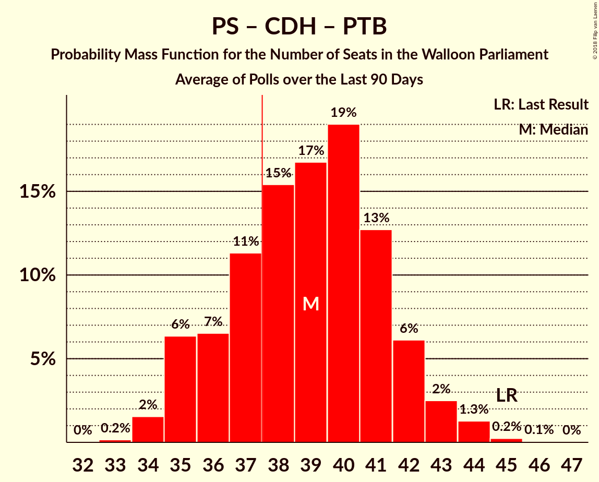
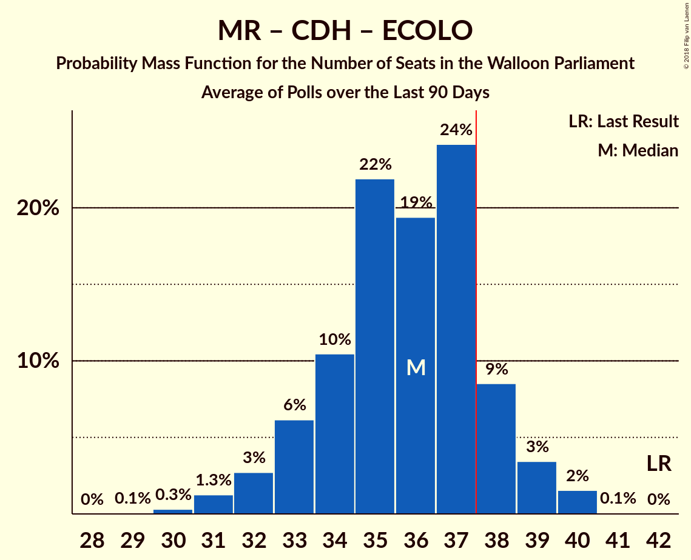

# Poll Average

<a href="#voting-intentions">Voting Intentions</a> | <a href="#seats">Seats</a> | <a href="#coalitions">Coalitions</a> | <a href="#technical-information">Technical Information</a>

## Summary

The table below lists the polls on which the average is based. They are the most recent polls (less than 90 days old) registered and analyzed so far.

| Period     | Polling firm/Commissioner(s) | PS | MR | CDH | ECOLO | PTB | PP | DÉFI | DROITE | DLB | RWF | WDA | PIRATE | FW |
|:----------:|:----------------------------:|:--:|:--:|:--:|:--:|:--:|:--:|:--:|:--:|:--:|:--:|:--:|:--:|:--:|
| 25 May 2014 | General Election | 30.9%   30 | 26.7%   25 | 15.2%   13 | 8.6%   4 | 5.8%   2 | 4.9%   1 | 2.5%   0 | 1.4%   0 | 0.8%   0 | 0.5%   0 | 0.4%   0 | 0.2%   0 | 0.1%   0 |
| N/A | Poll Average | 21–26%   18–24 | 18–23%   15–21 | 8–12%   6–10 | 9–13%   6–11 | 11–15%   8–13 | 5–8%   2–5 | 6–9%   2–7 | N/A   N/A | N/A   N/A | N/A   N/A | N/A   N/A | N/A   N/A | N/A   N/A |
| [20–27 September 2018](2018-09-27-Ipsos.html) | Ipsos   Het Laatste Nieuws, Le Soir, RTL TVi and VTM | 21–26%   18–24 | 18–23%   15–21 | 8–12%   6–10 | 9–13%   6–11 | 11–15%   8–13 | 5–8%   2–5 | 5–9%   2–7 | N/A   N/A | N/A   N/A | N/A   N/A | N/A   N/A | N/A   N/A | N/A   N/A |
| 25 May 2014 | General Election | 30.9%   30 | 26.7%   25 | 15.2%   13 | 8.6%   4 | 5.8%   2 | 4.9%   1 | 2.5%   0 | 1.4%   0 | 0.8%   0 | 0.5%   0 | 0.4%   0 | 0.2%   0 | 0.1%   0 |

Only polls for which at least the sample size has been published are included in the table above.

**Legend:**
+ **Top half of each row:** Voting intentions (95% confidence interval)
+ **Bottom half of each row:** Seat projections for the Walloon Parliament (95% confidence interval)
+ **PS:** PS
+ **MR:** MR
+ **CDH:** cdH
+ **ECOLO:** Ecolo
+ **PTB:** PTB
+ **PP:** Parti Populaire
+ **DÉFI:** DéFI
+ **DROITE:** La Droite
+ **DLB:** Debout les Belges
+ **RWF:** R.W.F.
+ **WDA:** Wallonie d’Abord
+ **PIRATE:** PIRATE
+ **FW:** FW
+ **N/A (single party):** Party not included the published results
+ **N/A (entire row):** Calculation for this opinion poll not started yet

## Voting Intentions

### Confidence Intervals

| Party | Last Result | Median | 80% Confidence Interval | 90% Confidence Interval | 95% Confidence Interval | 99% Confidence Interval |
|:-----:|:-----------:|:------:|:-----------------------:|:-----------------------:|:-----------------------:|:-----------------------:|
| <a href="#ps">PS</a> | 30.9% | 23.6% | 21.9–25.4% |21.5–25.9% | 21.1–26.3% | 20.3–27.2% |
| <a href="#mr">MR</a> | 26.7% | 20.6% | 19.0–22.3% |18.6–22.8% | 18.2–23.2% | 17.5–24.1% |
| <a href="#cdh">cdH</a> | 15.2% | 10.2% | 9.0–11.4% |8.6–11.8% | 8.4–12.1% | 7.9–12.8% |
| <a href="#ecolo">Ecolo</a> | 8.6% | 11.0% | 9.7–12.3% |9.4–12.6% | 9.1–13.0% | 8.6–13.7% |
| <a href="#ptb">PTB</a> | 5.8% | 13.1% | 11.8–14.6% |11.5–15.0% | 11.1–15.3% | 10.6–16.1% |
| <a href="#parti-populaire">Parti Populaire</a> | 4.9% | 6.8% | 5.8–7.8% |5.5–8.1% | 5.3–8.4% | 4.9–9.0% |
| <a href="#défi">DéFI</a> | 2.5% | 7.0% | 6.0–8.0% |5.7–8.4% | 5.5–8.6% | 5.1–9.2% |
| <a href="#la-droite">La Droite</a> | 1.4% | N/A | N/A |N/A | N/A | N/A |
| <a href="#debout-les-belges">Debout les Belges</a> | 0.8% | N/A | N/A |N/A | N/A | N/A |
| <a href="#r.w.f.">R.W.F.</a> | 0.5% | N/A | N/A |N/A | N/A | N/A |
| <a href="#wallonie-d’abord">Wallonie d’Abord</a> | 0.4% | N/A | N/A |N/A | N/A | N/A |
| <a href="#pirate">PIRATE</a> | 0.2% | N/A | N/A |N/A | N/A | N/A |
| <a href="#fw">FW</a> | 0.1% | N/A | N/A |N/A | N/A | N/A |

### PS

*For a full overview of the results for this party, see the [PS](party-ps.html) page.*

| Voting Intentions | Probability | Accumulated | Special Marks |
|:-----------------:|:-----------:|:-----------:|:-------------:|
| 17.5–18.5% | 0% | 100% |  |
| 18.5–19.5% | 0.1% | 100% |  |
| 19.5–20.5% | 0.8% | 99.9% |  |
| 20.5–21.5% | 5% | 99.1% |  |
| 21.5–22.5% | 15% | 94% |  |
| 22.5–23.5% | 27% | 79% |  |
| 23.5–24.5% | 28% | 53% | Median |
| 24.5–25.5% | 17% | 25% |  |
| 25.5–26.5% | 6% | 8% |  |
| 26.5–27.5% | 1.5% | 2% |  |
| 27.5–28.5% | 0.2% | 0.2% |  |
| 28.5–29.5% | 0% | 0% |  |
| 29.5–30.5% | 0% | 0% |  |
| 30.5–31.5% | 0% | 0% | Last Result |

### MR

*For a full overview of the results for this party, see the [MR](party-mr.html) page.*

| Voting Intentions | Probability | Accumulated | Special Marks |
|:-----------------:|:-----------:|:-----------:|:-------------:|
| 15.5–16.5% | 0% | 100% |  |
| 16.5–17.5% | 0.5% | 100% |  |
| 17.5–18.5% | 4% | 99.4% |  |
| 18.5–19.5% | 15% | 95% |  |
| 19.5–20.5% | 28% | 80% |  |
| 20.5–21.5% | 29% | 53% | Median |
| 21.5–22.5% | 17% | 24% |  |
| 22.5–23.5% | 6% | 7% |  |
| 23.5–24.5% | 1.2% | 1.4% |  |
| 24.5–25.5% | 0.2% | 0.2% |  |
| 25.5–26.5% | 0% | 0% |  |
| 26.5–27.5% | 0% | 0% | Last Result |

### cdH

*For a full overview of the results for this party, see the [cdH](party-cdh.html) page.*

| Voting Intentions | Probability | Accumulated | Special Marks |
|:-----------------:|:-----------:|:-----------:|:-------------:|
| 5.5–6.5% | 0% | 100% |  |
| 6.5–7.5% | 0.1% | 100% |  |
| 7.5–8.5% | 4% | 99.9% |  |
| 8.5–9.5% | 22% | 96% |  |
| 9.5–10.5% | 40% | 74% | Median |
| 10.5–11.5% | 26% | 34% |  |
| 11.5–12.5% | 7% | 8% |  |
| 12.5–13.5% | 0.9% | 0.9% |  |
| 13.5–14.5% | 0.1% | 0.1% |  |
| 14.5–15.5% | 0% | 0% | Last Result |

### Ecolo

*For a full overview of the results for this party, see the [Ecolo](party-ecolo.html) page.*

| Voting Intentions | Probability | Accumulated | Special Marks |
|:-----------------:|:-----------:|:-----------:|:-------------:|
| 6.5–7.5% | 0% | 100% |  |
| 7.5–8.5% | 0.4% | 100% |  |
| 8.5–9.5% | 7% | 99.6% | Last Result |
| 9.5–10.5% | 27% | 93% |  |
| 10.5–11.5% | 39% | 66% | Median |
| 11.5–12.5% | 21% | 27% |  |
| 12.5–13.5% | 5% | 6% |  |
| 13.5–14.5% | 0.6% | 0.7% |  |
| 14.5–15.5% | 0% | 0% |  |

### PTB

*For a full overview of the results for this party, see the [PTB](party-ptb.html) page.*

| Voting Intentions | Probability | Accumulated | Special Marks |
|:-----------------:|:-----------:|:-----------:|:-------------:|
| 5.5–6.5% | 0% | 100% | Last Result |
| 6.5–7.5% | 0% | 100% |  |
| 7.5–8.5% | 0% | 100% |  |
| 8.5–9.5% | 0% | 100% |  |
| 9.5–10.5% | 0.5% | 100% |  |
| 10.5–11.5% | 6% | 99.5% |  |
| 11.5–12.5% | 22% | 94% |  |
| 12.5–13.5% | 36% | 72% | Median |
| 13.5–14.5% | 25% | 35% |  |
| 14.5–15.5% | 8% | 10% |  |
| 15.5–16.5% | 1.5% | 2% |  |
| 16.5–17.5% | 0.1% | 0.1% |  |
| 17.5–18.5% | 0% | 0% |  |

### Parti Populaire

*For a full overview of the results for this party, see the [Parti Populaire](party-partipopulaire.html) page.*

| Voting Intentions | Probability | Accumulated | Special Marks |
|:-----------------:|:-----------:|:-----------:|:-------------:|
| 3.5–4.5% | 0.1% | 100% |  |
| 4.5–5.5% | 5% | 99.9% | Last Result |
| 5.5–6.5% | 35% | 95% |  |
| 6.5–7.5% | 43% | 60% | Median |
| 7.5–8.5% | 15% | 17% |  |
| 8.5–9.5% | 2% | 2% |  |
| 9.5–10.5% | 0.1% | 0.1% |  |
| 10.5–11.5% | 0% | 0% |  |

### DéFI

*For a full overview of the results for this party, see the [DéFI](party-défi.html) page.*

| Voting Intentions | Probability | Accumulated | Special Marks |
|:-----------------:|:-----------:|:-----------:|:-------------:|
| 2.5–3.5% | 0% | 100% | Last Result |
| 3.5–4.5% | 0% | 100% |  |
| 4.5–5.5% | 3% | 100% |  |
| 5.5–6.5% | 27% | 97% |  |
| 6.5–7.5% | 46% | 70% | Median |
| 7.5–8.5% | 21% | 24% |  |
| 8.5–9.5% | 3% | 3% |  |
| 9.5–10.5% | 0.2% | 0.2% |  |
| 10.5–11.5% | 0% | 0% |  |

## Seats

### Confidence Intervals

| Party | Last Result | Median | 80% Confidence Interval | 90% Confidence Interval | 95% Confidence Interval | 99% Confidence Interval |
|:-----:|:-----------:|:------:|:-----------------------:|:-----------------------:|:-----------------------:|:-----------------------:|
| <a href="#ps">PS</a> | 30 | 21 | 19–23 |18–24 | 18–24 | 17–26 |
| <a href="#mr">MR</a> | 25 | 19 | 17–21 |16–21 | 15–21 | 15–22 |
| <a href="#cdh">cdH</a> | 13 | 9 | 6–10 |6–10 | 6–10 | 5–11 |
| <a href="#ecolo">Ecolo</a> | 4 | 8 | 6–11 |6–11 | 6–11 | 6–12 |
| <a href="#ptb">PTB</a> | 2 | 10 | 9–12 |9–12 | 8–13 | 8–14 |
| <a href="#parti-populaire">Parti Populaire</a> | 1 | 4 | 2–5 |2–5 | 2–5 | 2–6 |
| <a href="#défi">DéFI</a> | 0 | 5 | 3–5 |2–6 | 2–7 | 1–7 |
| <a href="#la-droite">La Droite</a> | 0 | N/A | N/A |N/A | N/A | N/A |
| <a href="#debout-les-belges">Debout les Belges</a> | 0 | N/A | N/A |N/A | N/A | N/A |
| <a href="#r.w.f.">R.W.F.</a> | 0 | N/A | N/A |N/A | N/A | N/A |
| <a href="#wallonie-d’abord">Wallonie d’Abord</a> | 0 | N/A | N/A |N/A | N/A | N/A |
| <a href="#pirate">PIRATE</a> | 0 | N/A | N/A |N/A | N/A | N/A |
| <a href="#fw">FW</a> | 0 | N/A | N/A |N/A | N/A | N/A |

### PS

*For a full overview of the results for this party, see the [PS](party-ps.html) page.*

| Number of Seats | Probability | Accumulated | Special Marks |
|:---------------:|:-----------:|:-----------:|:-------------:|
| 17 | 1.2% | 100% |  |
| 18 | 4% | 98.8% |  |
| 19 | 12% | 95% |  |
| 20 | 17% | 83% |  |
| 21 | 35% | 66% | Median |
| 22 | 17% | 31% |  |
| 23 | 8% | 14% |  |
| 24 | 3% | 6% |  |
| 25 | 2% | 2% |  |
| 26 | 0.6% | 0.7% |  |
| 27 | 0.1% | 0.1% |  |
| 28 | 0% | 0% |  |
| 29 | 0% | 0% |  |
| 30 | 0% | 0% | Last Result |

### MR

*For a full overview of the results for this party, see the [MR](party-mr.html) page.*

| Number of Seats | Probability | Accumulated | Special Marks |
|:---------------:|:-----------:|:-----------:|:-------------:|
| 14 | 0.4% | 100% |  |
| 15 | 2% | 99.6% |  |
| 16 | 5% | 97% |  |
| 17 | 8% | 92% |  |
| 18 | 15% | 84% |  |
| 19 | 20% | 68% | Median |
| 20 | 39% | 49% |  |
| 21 | 9% | 10% |  |
| 22 | 1.1% | 2% |  |
| 23 | 0.4% | 0.5% |  |
| 24 | 0.1% | 0.1% |  |
| 25 | 0% | 0% | Last Result |

### cdH

*For a full overview of the results for this party, see the [cdH](party-cdh.html) page.*

| Number of Seats | Probability | Accumulated | Special Marks |
|:---------------:|:-----------:|:-----------:|:-------------:|
| 5 | 2% | 100% |  |
| 6 | 25% | 98% |  |
| 7 | 12% | 72% |  |
| 8 | 9% | 60% |  |
| 9 | 19% | 51% | Median |
| 10 | 31% | 33% |  |
| 11 | 2% | 2% |  |
| 12 | 0.1% | 0.1% |  |
| 13 | 0% | 0% | Last Result |

### Ecolo

*For a full overview of the results for this party, see the [Ecolo](party-ecolo.html) page.*

| Number of Seats | Probability | Accumulated | Special Marks |
|:---------------:|:-----------:|:-----------:|:-------------:|
| 4 | 0% | 100% | Last Result |
| 5 | 0% | 100% |  |
| 6 | 15% | 100% |  |
| 7 | 15% | 85% |  |
| 8 | 22% | 70% | Median |
| 9 | 13% | 48% |  |
| 10 | 15% | 35% |  |
| 11 | 19% | 20% |  |
| 12 | 1.0% | 1.0% |  |
| 13 | 0% | 0% |  |

### PTB

*For a full overview of the results for this party, see the [PTB](party-ptb.html) page.*

| Number of Seats | Probability | Accumulated | Special Marks |
|:---------------:|:-----------:|:-----------:|:-------------:|
| 2 | 0% | 100% | Last Result |
| 3 | 0% | 100% |  |
| 4 | 0% | 100% |  |
| 5 | 0% | 100% |  |
| 6 | 0% | 100% |  |
| 7 | 0.1% | 100% |  |
| 8 | 4% | 99.9% |  |
| 9 | 24% | 96% |  |
| 10 | 50% | 72% | Median |
| 11 | 11% | 21% |  |
| 12 | 6% | 10% |  |
| 13 | 3% | 4% |  |
| 14 | 1.1% | 1.1% |  |
| 15 | 0.1% | 0.1% |  |
| 16 | 0% | 0% |  |

### Parti Populaire

*For a full overview of the results for this party, see the [Parti Populaire](party-partipopulaire.html) page.*

| Number of Seats | Probability | Accumulated | Special Marks |
|:---------------:|:-----------:|:-----------:|:-------------:|
| 1 | 0.2% | 100% | Last Result |
| 2 | 17% | 99.8% |  |
| 3 | 30% | 82% |  |
| 4 | 17% | 53% | Median |
| 5 | 34% | 36% |  |
| 6 | 1.5% | 2% |  |
| 7 | 0.1% | 0.2% |  |
| 8 | 0% | 0% |  |

### DéFI

*For a full overview of the results for this party, see the [DéFI](party-défi.html) page.*

| Number of Seats | Probability | Accumulated | Special Marks |
|:---------------:|:-----------:|:-----------:|:-------------:|
| 0 | 0% | 100% | Last Result |
| 1 | 2% | 100% |  |
| 2 | 8% | 98% |  |
| 3 | 8% | 90% |  |
| 4 | 10% | 82% |  |
| 5 | 66% | 72% | Median |
| 6 | 3% | 6% |  |
| 7 | 2% | 3% |  |
| 8 | 0.4% | 0.4% |  |
| 9 | 0% | 0% |  |

## Coalitions

### Confidence Intervals

| Coalition | Last Result | Median | Majority? | 80% Confidence Interval | 90% Confidence Interval | 95% Confidence Interval | 99% Confidence Interval |
|:---------:|:-----------:|:------:|:---------:|:-----------------------:|:-----------------------:|:-----------------------:|:-----------------------:|
| PS – MR – Ecolo | 59 | 48 | 100% | 46–52 | 45–52 | 45–53 | 43–53 |
| PS – Ecolo – PTB | 36 | 39 | 83% | 37–42 | 36–43 | 36–44 | 35–45 |
| PS – MR | 55 | 40 | 90% | 37–42 | 36–43 | 35–44 | 35–45 |
| PS – cdH – PTB | 45 | 39 | 75% | 36–42 | 35–43 | 35–43 | 34–45 |
| PS – cdH – Ecolo | 47 | 38 | 51% | 35–40 | 35–41 | 34–42 | 33–43 |
| MR – cdH – Ecolo | 42 | 36 | 14% | 33–38 | 33–39 | 32–39 | 31–40 |
| PS – PTB | 32 | 31 | 0% | 29–33 | 28–34 | 28–35 | 27–36 |
| PS – Ecolo | 34 | 29 | 0% | 27–32 | 26–33 | 26–33 | 25–35 |
| PS – cdH | 43 | 29 | 0% | 26–32 | 25–32 | 25–33 | 24–34 |
| MR – Ecolo | 29 | 28 | 0% | 25–30 | 24–31 | 24–31 | 23–32 |
| MR – cdH | 38 | 27 | 0% | 25–30 | 24–30 | 23–31 | 22–31 |
| Ecolo – PTB | 6 | 19 | 0% | 16–21 | 16–21 | 16–22 | 15–23 |

### PS – MR – Ecolo

| Number of Seats | Probability | Accumulated | Special Marks |
|:---------------:|:-----------:|:-----------:|:-------------:|
| 42 | 0.1% | 100% |  |
| 43 | 0.4% | 99.9% |  |
| 44 | 2% | 99.5% |  |
| 45 | 3% | 98% |  |
| 46 | 9% | 95% |  |
| 47 | 20% | 86% |  |
| 48 | 17% | 66% | Median |
| 49 | 17% | 49% |  |
| 50 | 13% | 31% |  |
| 51 | 8% | 19% |  |
| 52 | 8% | 11% |  |
| 53 | 2% | 3% |  |
| 54 | 0.1% | 0.2% |  |
| 55 | 0.1% | 0.1% |  |
| 56 | 0% | 0% |  |
| 57 | 0% | 0% |  |
| 58 | 0% | 0% |  |
| 59 | 0% | 0% | Last Result |

### PS – Ecolo – PTB

| Number of Seats | Probability | Accumulated | Special Marks |
|:---------------:|:-----------:|:-----------:|:-------------:|
| 34 | 0.3% | 100% |  |
| 35 | 2% | 99.7% |  |
| 36 | 4% | 98% | Last Result |
| 37 | 11% | 94% |  |
| 38 | 16% | 83% | Majority |
| 39 | 18% | 67% | Median |
| 40 | 15% | 49% |  |
| 41 | 14% | 34% |  |
| 42 | 13% | 21% |  |
| 43 | 5% | 8% |  |
| 44 | 2% | 3% |  |
| 45 | 0.6% | 0.9% |  |
| 46 | 0.3% | 0.3% |  |
| 47 | 0.1% | 0.1% |  |
| 48 | 0% | 0% |  |

### PS – MR

| Number of Seats | Probability | Accumulated | Special Marks |
|:---------------:|:-----------:|:-----------:|:-------------:|
| 33 | 0.1% | 100% |  |
| 34 | 0.4% | 99.9% |  |
| 35 | 2% | 99.5% |  |
| 36 | 3% | 97% |  |
| 37 | 4% | 94% |  |
| 38 | 9% | 90% | Majority |
| 39 | 16% | 81% |  |
| 40 | 25% | 65% | Median |
| 41 | 23% | 40% |  |
| 42 | 10% | 17% |  |
| 43 | 5% | 8% |  |
| 44 | 2% | 3% |  |
| 45 | 0.6% | 0.9% |  |
| 46 | 0.2% | 0.3% |  |
| 47 | 0.1% | 0.1% |  |
| 48 | 0% | 0% |  |
| 49 | 0% | 0% |  |
| 50 | 0% | 0% |  |
| 51 | 0% | 0% |  |
| 52 | 0% | 0% |  |
| 53 | 0% | 0% |  |
| 54 | 0% | 0% |  |
| 55 | 0% | 0% | Last Result |

### PS – cdH – PTB

| Number of Seats | Probability | Accumulated | Special Marks |
|:---------------:|:-----------:|:-----------:|:-------------:|
| 33 | 0.1% | 100% |  |
| 34 | 1.4% | 99.9% |  |
| 35 | 5% | 98% |  |
| 36 | 7% | 94% |  |
| 37 | 11% | 87% |  |
| 38 | 13% | 75% | Majority |
| 39 | 15% | 62% |  |
| 40 | 19% | 48% | Median |
| 41 | 16% | 29% |  |
| 42 | 8% | 13% |  |
| 43 | 3% | 5% |  |
| 44 | 2% | 2% |  |
| 45 | 0.6% | 0.7% | Last Result |
| 46 | 0.1% | 0.1% |  |
| 47 | 0% | 0% |  |

### PS – cdH – Ecolo

| Number of Seats | Probability | Accumulated | Special Marks |
|:---------------:|:-----------:|:-----------:|:-------------:|
| 32 | 0.2% | 100% |  |
| 33 | 0.7% | 99.7% |  |
| 34 | 2% | 99.0% |  |
| 35 | 11% | 97% |  |
| 36 | 15% | 86% |  |
| 37 | 20% | 72% |  |
| 38 | 21% | 51% | Median, Majority |
| 39 | 13% | 31% |  |
| 40 | 9% | 18% |  |
| 41 | 5% | 10% |  |
| 42 | 2% | 4% |  |
| 43 | 1.4% | 2% |  |
| 44 | 0.2% | 0.3% |  |
| 45 | 0% | 0% |  |
| 46 | 0% | 0% |  |
| 47 | 0% | 0% | Last Result |

### MR – cdH – Ecolo

| Number of Seats | Probability | Accumulated | Special Marks |
|:---------------:|:-----------:|:-----------:|:-------------:|
| 29 | 0.1% | 100% |  |
| 30 | 0.3% | 99.9% |  |
| 31 | 1.3% | 99.6% |  |
| 32 | 3% | 98% |  |
| 33 | 6% | 96% |  |
| 34 | 10% | 89% |  |
| 35 | 22% | 79% |  |
| 36 | 19% | 57% | Median |
| 37 | 24% | 38% |  |
| 38 | 9% | 14% | Majority |
| 39 | 3% | 5% |  |
| 40 | 2% | 2% |  |
| 41 | 0.1% | 0.1% |  |
| 42 | 0% | 0% | Last Result |

### PS – PTB

| Number of Seats | Probability | Accumulated | Special Marks |
|:---------------:|:-----------:|:-----------:|:-------------:|
| 26 | 0.3% | 100% |  |
| 27 | 1.0% | 99.7% |  |
| 28 | 5% | 98.7% |  |
| 29 | 14% | 93% |  |
| 30 | 18% | 79% |  |
| 31 | 27% | 61% | Median |
| 32 | 15% | 34% | Last Result |
| 33 | 10% | 19% |  |
| 34 | 5% | 9% |  |
| 35 | 3% | 4% |  |
| 36 | 0.6% | 0.9% |  |
| 37 | 0.2% | 0.2% |  |
| 38 | 0% | 0% | Majority |

### PS – Ecolo

| Number of Seats | Probability | Accumulated | Special Marks |
|:---------------:|:-----------:|:-----------:|:-------------:|
| 24 | 0.3% | 100% |  |
| 25 | 2% | 99.7% |  |
| 26 | 4% | 98% |  |
| 27 | 12% | 94% |  |
| 28 | 14% | 82% |  |
| 29 | 19% | 68% | Median |
| 30 | 17% | 49% |  |
| 31 | 12% | 32% |  |
| 32 | 13% | 20% |  |
| 33 | 5% | 7% |  |
| 34 | 2% | 2% | Last Result |
| 35 | 0.5% | 0.6% |  |
| 36 | 0.1% | 0.2% |  |
| 37 | 0% | 0% |  |

### PS – cdH

| Number of Seats | Probability | Accumulated | Special Marks |
|:---------------:|:-----------:|:-----------:|:-------------:|
| 23 | 0.1% | 100% |  |
| 24 | 1.0% | 99.8% |  |
| 25 | 5% | 98.8% |  |
| 26 | 6% | 94% |  |
| 27 | 10% | 88% |  |
| 28 | 16% | 78% |  |
| 29 | 15% | 62% |  |
| 30 | 19% | 46% | Median |
| 31 | 15% | 27% |  |
| 32 | 8% | 12% |  |
| 33 | 3% | 4% |  |
| 34 | 0.9% | 1.3% |  |
| 35 | 0.3% | 0.3% |  |
| 36 | 0% | 0% |  |
| 37 | 0% | 0% |  |
| 38 | 0% | 0% | Majority |
| 39 | 0% | 0% |  |
| 40 | 0% | 0% |  |
| 41 | 0% | 0% |  |
| 42 | 0% | 0% |  |
| 43 | 0% | 0% | Last Result |

### MR – Ecolo

| Number of Seats | Probability | Accumulated | Special Marks |
|:---------------:|:-----------:|:-----------:|:-------------:|
| 21 | 0.1% | 100% |  |
| 22 | 0.2% | 99.9% |  |
| 23 | 1.2% | 99.7% |  |
| 24 | 5% | 98% |  |
| 25 | 8% | 94% |  |
| 26 | 14% | 85% |  |
| 27 | 20% | 71% | Median |
| 28 | 19% | 51% |  |
| 29 | 14% | 33% | Last Result |
| 30 | 9% | 18% |  |
| 31 | 7% | 9% |  |
| 32 | 1.5% | 2% |  |
| 33 | 0.2% | 0.2% |  |
| 34 | 0% | 0% |  |

### MR – cdH

| Number of Seats | Probability | Accumulated | Special Marks |
|:---------------:|:-----------:|:-----------:|:-------------:|
| 21 | 0.1% | 100% |  |
| 22 | 0.7% | 99.9% |  |
| 23 | 2% | 99.2% |  |
| 24 | 5% | 97% |  |
| 25 | 11% | 92% |  |
| 26 | 21% | 81% |  |
| 27 | 19% | 60% |  |
| 28 | 13% | 42% | Median |
| 29 | 14% | 28% |  |
| 30 | 10% | 14% |  |
| 31 | 3% | 4% |  |
| 32 | 0.3% | 0.4% |  |
| 33 | 0.1% | 0.1% |  |
| 34 | 0% | 0% |  |
| 35 | 0% | 0% |  |
| 36 | 0% | 0% |  |
| 37 | 0% | 0% |  |
| 38 | 0% | 0% | Last Result, Majority |

### Ecolo – PTB

| Number of Seats | Probability | Accumulated | Special Marks |
|:---------------:|:-----------:|:-----------:|:-------------:|
| 6 | 0% | 100% | Last Result |
| 7 | 0% | 100% |  |
| 8 | 0% | 100% |  |
| 9 | 0% | 100% |  |
| 10 | 0% | 100% |  |
| 11 | 0% | 100% |  |
| 12 | 0% | 100% |  |
| 13 | 0% | 100% |  |
| 14 | 0.4% | 100% |  |
| 15 | 2% | 99.6% |  |
| 16 | 13% | 98% |  |
| 17 | 17% | 84% |  |
| 18 | 15% | 67% | Median |
| 19 | 16% | 52% |  |
| 20 | 17% | 36% |  |
| 21 | 15% | 19% |  |
| 22 | 3% | 5% |  |
| 23 | 1.0% | 1.4% |  |
| 24 | 0.4% | 0.5% |  |
| 25 | 0.1% | 0.1% |  |
| 26 | 0% | 0% |  |

## Technical Information

+ **Number of polls included in this average:** 1
+ **Lowest number of simulations done in a poll included in this average:** 1,048,576
+ **Total number of simulations done in the polls included in this average:** 1,048,576
+ **Error estimate:** 1.78%
