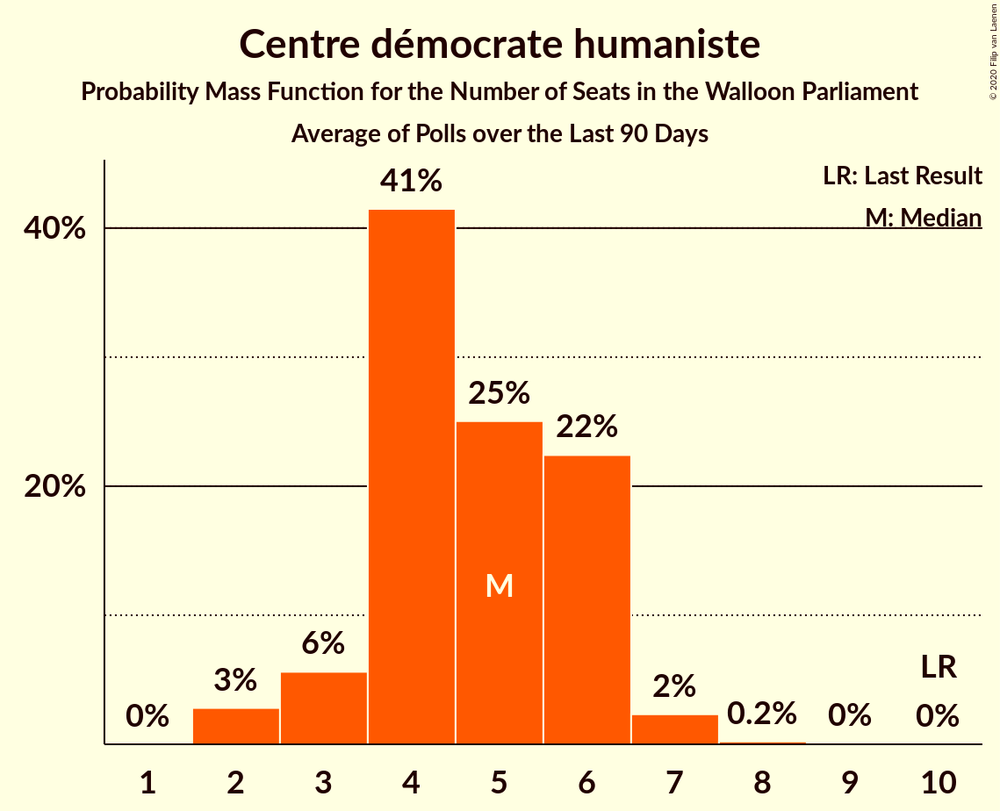
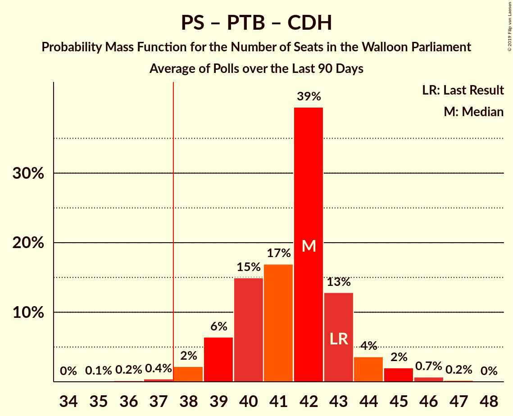
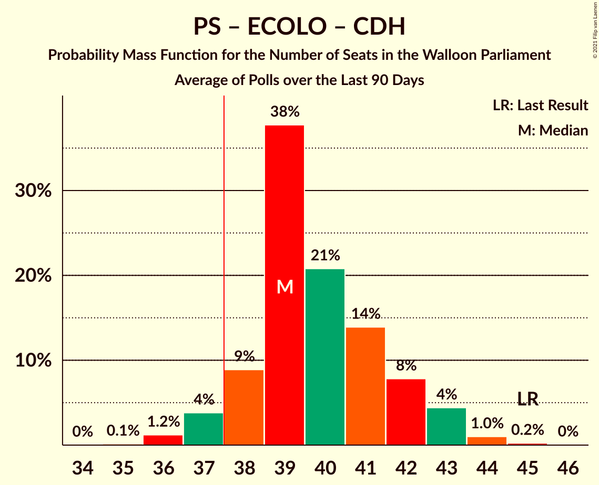
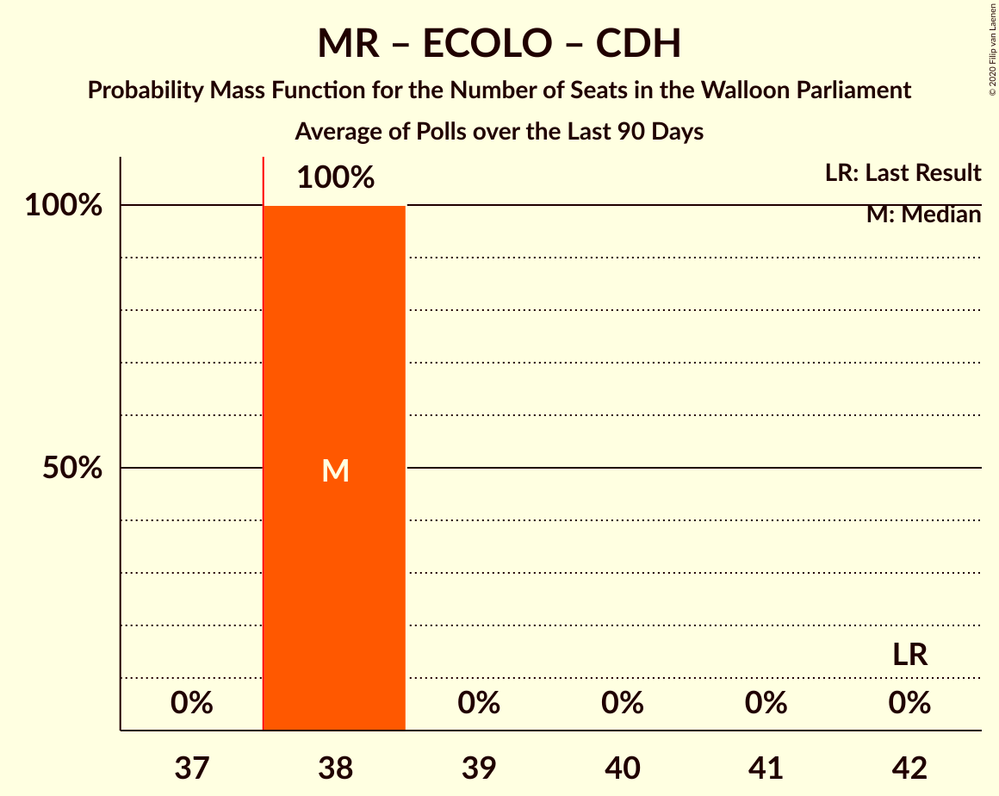
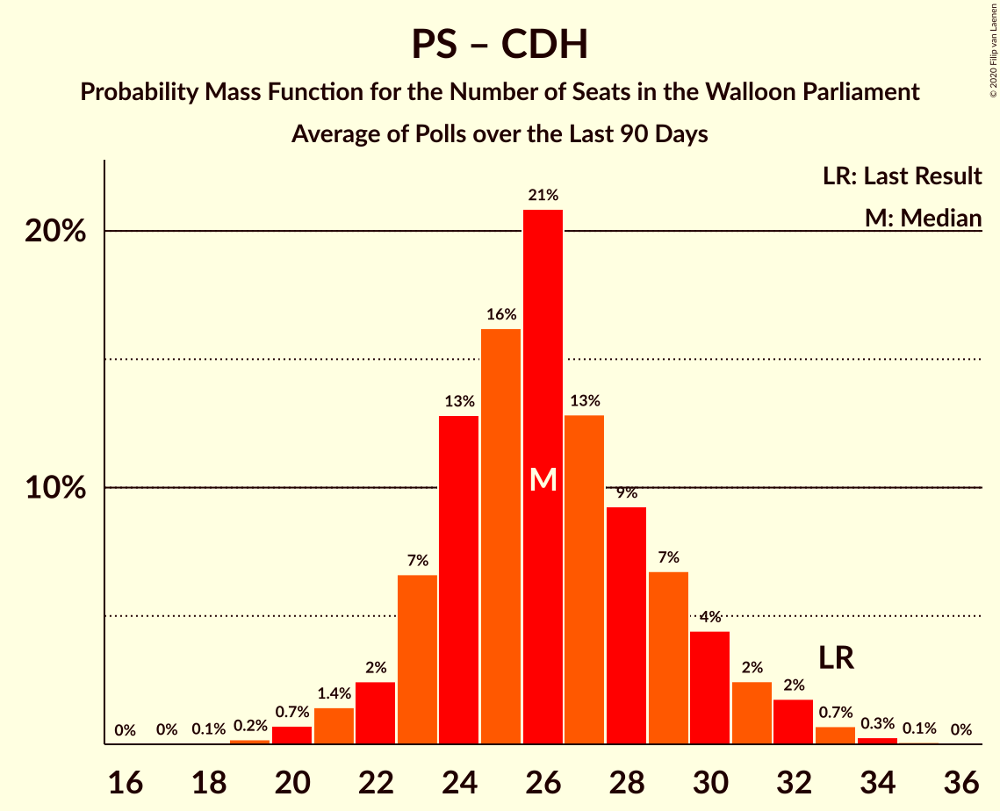
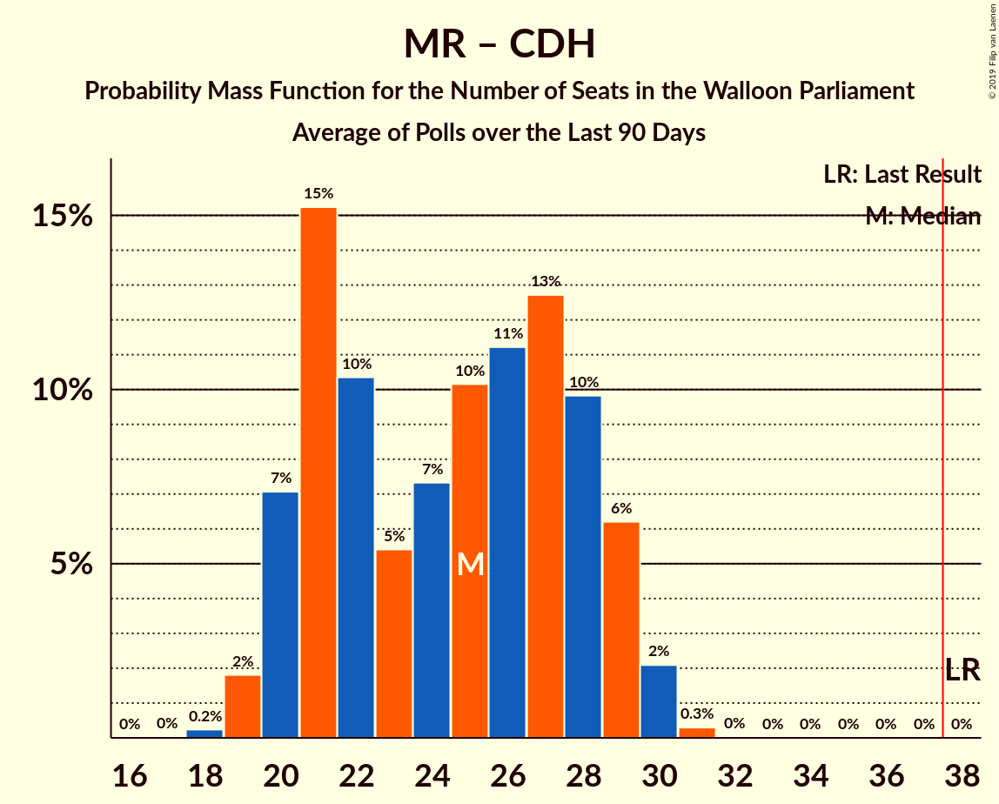

# Poll Average

<a href="#voting-intentions">Voting Intentions</a> | <a href="#seats">Seats</a> | <a href="#coalitions">Coalitions</a> | <a href="#technical-information">Technical Information</a>

## Summary

The table below lists the polls on which the average is based. They are the most recent polls (less than 90 days old) registered and analyzed so far.

| Period     | Polling firm/Commissioner(s) | PS | MR | ECOLO | PTB | CDH | DÉFI | PP | DROITE |
|:----------:|:----------------------------:|:--:|:--:|:--:|:--:|:--:|:--:|:--:|:--:|
| 26 May 2019 | General Election | 26.2%   23 | 21.4%   20 | 14.5%   12 | 13.7%   10 | 11.0%   10 | 4.1%   0 | 3.7%   0 | 0.2%   0 |
| N/A | Poll Average | 20–25%   17–22 | 18–23%   15–21 | 13–17%   11–15 | 17–22%   15–20 | 8–12%   5–10 | 3–5%   0 | N/A   N/A | N/A   N/A |
| [15–22 March 2022](2022-03-22-Ipsos.html) | Ipsos   Het Laatste Nieuws, Le Soir, RTL TVi and VTM | 20–25%   17–22 | 18–23%   15–21 | 13–17%   11–15 | 17–22%   15–20 | 8–11%   5–10 | 3–5%   0 | N/A   N/A | N/A   N/A |
| 26 May 2019 | General Election | 26.2%   23 | 21.4%   20 | 14.5%   12 | 13.7%   10 | 11.0%   10 | 4.1%   0 | 3.7%   0 | 0.2%   0 |

Only polls for which at least the sample size has been published are included in the table above.

**Legend:**
+ **Top half of each row:** Voting intentions (95% confidence interval)
+ **Bottom half of each row:** Seat projections for the Walloon Parliament (95% confidence interval)
+ **PS:** Parti Socialiste
+ **MR:** Mouvement Réformateur
+ **ECOLO:** Ecolo
+ **PTB:** Parti du Travail de Belgique
+ **CDH:** Centre démocrate humaniste
+ **DÉFI:** DéFI
+ **PP:** Parti Populaire
+ **DROITE:** La Droite
+ **N/A (single party):** Party not included the published results
+ **N/A (entire row):** Calculation for this opinion poll not started yet

## Voting Intentions

### Confidence Intervals

| Party | Last Result | Median | 80% Confidence Interval | 90% Confidence Interval | 95% Confidence Interval | 99% Confidence Interval |
|:-----:|:-----------:|:------:|:-----------------------:|:-----------------------:|:-----------------------:|:-----------------------:|
| <a href="#parti-socialiste">Parti Socialiste</a> | 26.2% | 22.4% | 20.8–24.2% |20.3–24.6% | 19.9–25.1% | 19.2–25.9% |
| <a href="#mouvement-réformateur">Mouvement Réformateur</a> | 21.4% | 20.2% | 18.6–21.8% |18.1–22.3% | 17.8–22.7% | 17.0–23.5% |
| <a href="#ecolo">Ecolo</a> | 14.5% | 15.1% | 13.7–16.6% |13.3–17.0% | 13.0–17.4% | 12.4–18.2% |
| <a href="#parti-du-travail-de-belgique">Parti du Travail de Belgique</a> | 13.7% | 19.8% | 18.2–21.4% |17.8–21.9% | 17.4–22.3% | 16.7–23.1% |
| <a href="#centre-démocrate-humaniste">Centre démocrate humaniste</a> | 11.0% | 9.6% | 8.4–10.8% |8.1–11.2% | 7.9–11.5% | 7.4–12.1% |
| <a href="#défi">DéFI</a> | 4.1% | 3.7% | 3.0–4.5% |2.8–4.8% | 2.7–5.0% | 2.4–5.5% |
| <a href="#parti-populaire">Parti Populaire</a> | 3.7% | N/A | N/A |N/A | N/A | N/A |
| <a href="#la-droite">La Droite</a> | 0.2% | N/A | N/A |N/A | N/A | N/A |

### Parti Socialiste

*For a full overview of the results for this party, see the [Parti Socialiste](party-partisocialiste.html) page.*

| Voting Intentions | Probability | Accumulated | Special Marks |
|:-----------------:|:-----------:|:-----------:|:-------------:|
| 16.5–17.5% | 0% | 100% |  |
| 17.5–18.5% | 0.1% | 100% |  |
| 18.5–19.5% | 1.1% | 99.9% |  |
| 19.5–20.5% | 6% | 98.8% |  |
| 20.5–21.5% | 18% | 93% |  |
| 21.5–22.5% | 29% | 75% | Median |
| 22.5–23.5% | 26% | 46% |  |
| 23.5–24.5% | 14% | 20% |  |
| 24.5–25.5% | 5% | 6% |  |
| 25.5–26.5% | 0.9% | 1.1% | Last Result |
| 26.5–27.5% | 0.1% | 0.1% |  |
| 27.5–28.5% | 0% | 0% |  |

### Mouvement Réformateur

*For a full overview of the results for this party, see the [Mouvement Réformateur](party-mouvementréformateur.html) page.*

| Voting Intentions | Probability | Accumulated | Special Marks |
|:-----------------:|:-----------:|:-----------:|:-------------:|
| 14.5–15.5% | 0% | 100% |  |
| 15.5–16.5% | 0.1% | 100% |  |
| 16.5–17.5% | 1.5% | 99.9% |  |
| 17.5–18.5% | 8% | 98% |  |
| 18.5–19.5% | 22% | 90% |  |
| 19.5–20.5% | 31% | 69% | Median |
| 20.5–21.5% | 24% | 38% | Last Result |
| 21.5–22.5% | 11% | 14% |  |
| 22.5–23.5% | 3% | 3% |  |
| 23.5–24.5% | 0.4% | 0.5% |  |
| 24.5–25.5% | 0% | 0% |  |
| 25.5–26.5% | 0% | 0% |  |

### Ecolo

*For a full overview of the results for this party, see the [Ecolo](party-ecolo.html) page.*

| Voting Intentions | Probability | Accumulated | Special Marks |
|:-----------------:|:-----------:|:-----------:|:-------------:|
| 10.5–11.5% | 0% | 100% |  |
| 11.5–12.5% | 0.8% | 100% |  |
| 12.5–13.5% | 7% | 99.2% |  |
| 13.5–14.5% | 23% | 92% | Last Result |
| 14.5–15.5% | 34% | 69% | Median |
| 15.5–16.5% | 24% | 35% |  |
| 16.5–17.5% | 9% | 11% |  |
| 17.5–18.5% | 2% | 2% |  |
| 18.5–19.5% | 0.2% | 0.2% |  |
| 19.5–20.5% | 0% | 0% |  |

### Parti du Travail de Belgique

*For a full overview of the results for this party, see the [Parti du Travail de Belgique](party-partidutravaildebelgique.html) page.*

| Voting Intentions | Probability | Accumulated | Special Marks |
|:-----------------:|:-----------:|:-----------:|:-------------:|
| 13.5–14.5% | 0% | 100% | Last Result |
| 14.5–15.5% | 0% | 100% |  |
| 15.5–16.5% | 0.3% | 100% |  |
| 16.5–17.5% | 3% | 99.6% |  |
| 17.5–18.5% | 13% | 97% |  |
| 18.5–19.5% | 27% | 84% |  |
| 19.5–20.5% | 30% | 57% | Median |
| 20.5–21.5% | 19% | 27% |  |
| 21.5–22.5% | 7% | 8% |  |
| 22.5–23.5% | 1.4% | 2% |  |
| 23.5–24.5% | 0.2% | 0.2% |  |
| 24.5–25.5% | 0% | 0% |  |

### Centre démocrate humaniste

*For a full overview of the results for this party, see the [Centre démocrate humaniste](party-centredémocratehumaniste.html) page.*

| Voting Intentions | Probability | Accumulated | Special Marks |
|:-----------------:|:-----------:|:-----------:|:-------------:|
| 5.5–6.5% | 0% | 100% |  |
| 6.5–7.5% | 0.9% | 100% |  |
| 7.5–8.5% | 12% | 99.1% |  |
| 8.5–9.5% | 37% | 87% |  |
| 9.5–10.5% | 35% | 50% | Median |
| 10.5–11.5% | 13% | 15% | Last Result |
| 11.5–12.5% | 2% | 2% |  |
| 12.5–13.5% | 0.1% | 0.2% |  |
| 13.5–14.5% | 0% | 0% |  |

### DéFI

*For a full overview of the results for this party, see the [DéFI](party-défi.html) page.*

| Voting Intentions | Probability | Accumulated | Special Marks |
|:-----------------:|:-----------:|:-----------:|:-------------:|
| 0.5–1.5% | 0% | 100% |  |
| 1.5–2.5% | 1.3% | 100% |  |
| 2.5–3.5% | 37% | 98.7% |  |
| 3.5–4.5% | 52% | 62% | Last Result, Median |
| 4.5–5.5% | 9% | 10% |  |
| 5.5–6.5% | 0.4% | 0.4% |  |
| 6.5–7.5% | 0% | 0% |  |

## Seats

### Confidence Intervals

| Party | Last Result | Median | 80% Confidence Interval | 90% Confidence Interval | 95% Confidence Interval | 99% Confidence Interval |
|:-----:|:-----------:|:------:|:-----------------------:|:-----------------------:|:-----------------------:|:-----------------------:|
| <a href="#parti-socialiste">Parti Socialiste</a> | 23 | 20 | 18–21 |17–21 | 17–22 | 17–23 |
| <a href="#mouvement-réformateur">Mouvement Réformateur</a> | 20 | 19 | 16–20 |15–20 | 15–21 | 14–21 |
| <a href="#ecolo">Ecolo</a> | 12 | 13 | 12–14 |12–14 | 11–15 | 10–15 |
| <a href="#parti-du-travail-de-belgique">Parti du Travail de Belgique</a> | 10 | 17 | 16–18 |16–19 | 15–20 | 14–21 |
| <a href="#centre-démocrate-humaniste">Centre démocrate humaniste</a> | 10 | 7 | 6–8 |6–9 | 5–10 | 4–11 |
| <a href="#défi">DéFI</a> | 0 | 0 | 0 |0 | 0 | 0–1 |
| <a href="#parti-populaire">Parti Populaire</a> | 0 | N/A | N/A |N/A | N/A | N/A |
| <a href="#la-droite">La Droite</a> | 0 | N/A | N/A |N/A | N/A | N/A |

### Parti Socialiste

*For a full overview of the results for this party, see the [Parti Socialiste](party-partisocialiste.html) page.*

| Number of Seats | Probability | Accumulated | Special Marks |
|:---------------:|:-----------:|:-----------:|:-------------:|
| 16 | 0.1% | 100% |  |
| 17 | 9% | 99.9% |  |
| 18 | 9% | 91% |  |
| 19 | 25% | 82% |  |
| 20 | 35% | 57% | Median |
| 21 | 17% | 21% |  |
| 22 | 3% | 4% |  |
| 23 | 0.5% | 0.7% | Last Result |
| 24 | 0.1% | 0.1% |  |
| 25 | 0% | 0% |  |

### Mouvement Réformateur

*For a full overview of the results for this party, see the [Mouvement Réformateur](party-mouvementréformateur.html) page.*

| Number of Seats | Probability | Accumulated | Special Marks |
|:---------------:|:-----------:|:-----------:|:-------------:|
| 14 | 1.3% | 100% |  |
| 15 | 4% | 98.7% |  |
| 16 | 5% | 94% |  |
| 17 | 10% | 89% |  |
| 18 | 16% | 79% |  |
| 19 | 51% | 63% | Median |
| 20 | 7% | 12% | Last Result |
| 21 | 5% | 5% |  |
| 22 | 0% | 0% |  |

### Ecolo

*For a full overview of the results for this party, see the [Ecolo](party-ecolo.html) page.*

| Number of Seats | Probability | Accumulated | Special Marks |
|:---------------:|:-----------:|:-----------:|:-------------:|
| 9 | 0% | 100% |  |
| 10 | 0.9% | 99.9% |  |
| 11 | 2% | 99.0% |  |
| 12 | 34% | 97% | Last Result |
| 13 | 45% | 63% | Median |
| 14 | 13% | 17% |  |
| 15 | 4% | 4% |  |
| 16 | 0.3% | 0.4% |  |
| 17 | 0.1% | 0.1% |  |
| 18 | 0% | 0% |  |

### Parti du Travail de Belgique

*For a full overview of the results for this party, see the [Parti du Travail de Belgique](party-partidutravaildebelgique.html) page.*

| Number of Seats | Probability | Accumulated | Special Marks |
|:---------------:|:-----------:|:-----------:|:-------------:|
| 10 | 0% | 100% | Last Result |
| 11 | 0% | 100% |  |
| 12 | 0% | 100% |  |
| 13 | 0% | 100% |  |
| 14 | 0.5% | 100% |  |
| 15 | 4% | 99.5% |  |
| 16 | 7% | 95% |  |
| 17 | 54% | 88% | Median |
| 18 | 25% | 34% |  |
| 19 | 5% | 9% |  |
| 20 | 4% | 4% |  |
| 21 | 0.7% | 0.8% |  |
| 22 | 0% | 0% |  |

### Centre démocrate humaniste

*For a full overview of the results for this party, see the [Centre démocrate humaniste](party-centredémocratehumaniste.html) page.*

| Number of Seats | Probability | Accumulated | Special Marks |
|:---------------:|:-----------:|:-----------:|:-------------:|
| 4 | 0.8% | 100% |  |
| 5 | 4% | 99.2% |  |
| 6 | 35% | 95% |  |
| 7 | 37% | 60% | Median |
| 8 | 15% | 23% |  |
| 9 | 5% | 8% |  |
| 10 | 3% | 3% | Last Result |
| 11 | 0.6% | 0.6% |  |
| 12 | 0% | 0% |  |

### DéFI

*For a full overview of the results for this party, see the [DéFI](party-défi.html) page.*

| Number of Seats | Probability | Accumulated | Special Marks |
|:---------------:|:-----------:|:-----------:|:-------------:|
| 0 | 98% | 100% | Last Result, Median |
| 1 | 1.2% | 2% |  |
| 2 | 0.1% | 0.4% |  |
| 3 | 0.2% | 0.3% |  |
| 4 | 0.1% | 0.1% |  |
| 5 | 0% | 0% |  |

### Parti Populaire

*For a full overview of the results for this party, see the [Parti Populaire](party-partipopulaire.html) page.*

### La Droite

*For a full overview of the results for this party, see the [La Droite](party-ladroite.html) page.*

## Coalitions

### Confidence Intervals

| Coalition | Last Result | Median | Majority? | 80% Confidence Interval | 90% Confidence Interval | 95% Confidence Interval | 99% Confidence Interval |
|:---------:|:-----------:|:------:|:---------:|:-----------------------:|:-----------------------:|:-----------------------:|:-----------------------:|
| Parti Socialiste – Mouvement Réformateur – Ecolo | 55 | 51 | 100% | 49–52 | 48–53 | 48–53 | 46–54 |
| Parti Socialiste – Ecolo – Parti du Travail de Belgique | 45 | 50 | 100% | 48–51 | 48–52 | 47–53 | 47–53 |
| Parti Socialiste – Parti du Travail de Belgique – Centre démocrate humaniste | 43 | 44 | 100% | 42–46 | 42–47 | 41–47 | 41–48 |
| Parti Socialiste – Ecolo – Centre démocrate humaniste | 45 | 39 | 90% | 37–41 | 37–42 | 36–43 | 35–44 |
| Mouvement Réformateur – Ecolo – Centre démocrate humaniste | 42 | 38 | 66% | 37–40 | 36–40 | 36–41 | 34–42 |
| Parti Socialiste – Mouvement Réformateur | 43 | 38 | 65% | 36–40 | 35–40 | 35–41 | 34–41 |
| Parti Socialiste – Parti du Travail de Belgique | 33 | 37 | 33% | 35–38 | 35–39 | 34–39 | 33–40 |
| Parti Socialiste – Ecolo | 35 | 32 | 0% | 31–34 | 30–35 | 30–35 | 29–36 |
| Mouvement Réformateur – Ecolo | 32 | 31 | 0% | 29–33 | 28–33 | 28–34 | 27–34 |
| Ecolo – Parti du Travail de Belgique | 22 | 30 | 0% | 29–32 | 28–32 | 28–33 | 27–34 |
| Parti Socialiste – Centre démocrate humaniste | 33 | 26 | 0% | 25–28 | 24–29 | 24–30 | 23–31 |
| Mouvement Réformateur – Centre démocrate humaniste | 30 | 25 | 0% | 24–27 | 23–27 | 22–28 | 22–28 |

### Parti Socialiste – Mouvement Réformateur – Ecolo

| Number of Seats | Probability | Accumulated | Special Marks |
|:---------------:|:-----------:|:-----------:|:-------------:|
| 45 | 0.1% | 100% |  |
| 46 | 0.6% | 99.8% |  |
| 47 | 1.4% | 99.3% |  |
| 48 | 5% | 98% |  |
| 49 | 11% | 93% |  |
| 50 | 22% | 82% |  |
| 51 | 26% | 60% |  |
| 52 | 24% | 33% | Median |
| 53 | 7% | 9% |  |
| 54 | 2% | 2% |  |
| 55 | 0.1% | 0.1% | Last Result |
| 56 | 0% | 0% |  |

### Parti Socialiste – Ecolo – Parti du Travail de Belgique

| Number of Seats | Probability | Accumulated | Special Marks |
|:---------------:|:-----------:|:-----------:|:-------------:|
| 45 | 0.1% | 100% | Last Result |
| 46 | 0.4% | 99.9% |  |
| 47 | 4% | 99.5% |  |
| 48 | 8% | 96% |  |
| 49 | 30% | 88% |  |
| 50 | 40% | 57% | Median |
| 51 | 11% | 17% |  |
| 52 | 4% | 7% |  |
| 53 | 2% | 3% |  |
| 54 | 0.4% | 0.4% |  |
| 55 | 0% | 0.1% |  |
| 56 | 0% | 0% |  |

### Parti Socialiste – Parti du Travail de Belgique – Centre démocrate humaniste

| Number of Seats | Probability | Accumulated | Special Marks |
|:---------------:|:-----------:|:-----------:|:-------------:|
| 40 | 0.4% | 100% |  |
| 41 | 2% | 99.5% |  |
| 42 | 17% | 97% |  |
| 43 | 29% | 80% | Last Result |
| 44 | 27% | 52% | Median |
| 45 | 12% | 25% |  |
| 46 | 8% | 13% |  |
| 47 | 4% | 6% |  |
| 48 | 1.3% | 2% |  |
| 49 | 0.4% | 0.4% |  |
| 50 | 0% | 0% |  |

### Parti Socialiste – Ecolo – Centre démocrate humaniste

| Number of Seats | Probability | Accumulated | Special Marks |
|:---------------:|:-----------:|:-----------:|:-------------:|
| 34 | 0.1% | 100% |  |
| 35 | 0.5% | 99.9% |  |
| 36 | 2% | 99.4% |  |
| 37 | 7% | 97% |  |
| 38 | 18% | 90% | Majority |
| 39 | 39% | 72% |  |
| 40 | 15% | 33% | Median |
| 41 | 10% | 19% |  |
| 42 | 5% | 9% |  |
| 43 | 3% | 4% |  |
| 44 | 1.0% | 1.1% |  |
| 45 | 0.1% | 0.1% | Last Result |
| 46 | 0% | 0% |  |

### Mouvement Réformateur – Ecolo – Centre démocrate humaniste

| Number of Seats | Probability | Accumulated | Special Marks |
|:---------------:|:-----------:|:-----------:|:-------------:|
| 33 | 0.1% | 100% |  |
| 34 | 0.5% | 99.9% |  |
| 35 | 2% | 99.4% |  |
| 36 | 5% | 98% |  |
| 37 | 27% | 93% |  |
| 38 | 29% | 66% | Majority |
| 39 | 23% | 37% | Median |
| 40 | 11% | 14% |  |
| 41 | 3% | 3% |  |
| 42 | 0.5% | 0.6% | Last Result |
| 43 | 0% | 0.1% |  |
| 44 | 0% | 0% |  |

### Parti Socialiste – Mouvement Réformateur

| Number of Seats | Probability | Accumulated | Special Marks |
|:---------------:|:-----------:|:-----------:|:-------------:|
| 32 | 0.1% | 100% |  |
| 33 | 0.3% | 99.9% |  |
| 34 | 2% | 99.5% |  |
| 35 | 5% | 98% |  |
| 36 | 10% | 93% |  |
| 37 | 17% | 83% |  |
| 38 | 27% | 65% | Majority |
| 39 | 24% | 39% | Median |
| 40 | 11% | 15% |  |
| 41 | 4% | 4% |  |
| 42 | 0.4% | 0.4% |  |
| 43 | 0% | 0% | Last Result |

### Parti Socialiste – Parti du Travail de Belgique

| Number of Seats | Probability | Accumulated | Special Marks |
|:---------------:|:-----------:|:-----------:|:-------------:|
| 32 | 0.1% | 100% |  |
| 33 | 0.5% | 99.9% | Last Result |
| 34 | 3% | 99.4% |  |
| 35 | 11% | 97% |  |
| 36 | 23% | 85% |  |
| 37 | 29% | 62% | Median |
| 38 | 27% | 33% | Majority |
| 39 | 4% | 7% |  |
| 40 | 2% | 2% |  |
| 41 | 0.4% | 0.5% |  |
| 42 | 0.1% | 0.1% |  |
| 43 | 0% | 0% |  |

### Parti Socialiste – Ecolo

| Number of Seats | Probability | Accumulated | Special Marks |
|:---------------:|:-----------:|:-----------:|:-------------:|
| 28 | 0.1% | 100% |  |
| 29 | 1.4% | 99.9% |  |
| 30 | 7% | 98.6% |  |
| 31 | 16% | 91% |  |
| 32 | 26% | 75% |  |
| 33 | 34% | 49% | Median |
| 34 | 9% | 15% |  |
| 35 | 5% | 6% | Last Result |
| 36 | 1.3% | 1.5% |  |
| 37 | 0.1% | 0.1% |  |
| 38 | 0% | 0% | Majority |

### Mouvement Réformateur – Ecolo

| Number of Seats | Probability | Accumulated | Special Marks |
|:---------------:|:-----------:|:-----------:|:-------------:|
| 26 | 0.4% | 100% |  |
| 27 | 1.4% | 99.6% |  |
| 28 | 4% | 98% |  |
| 29 | 8% | 94% |  |
| 30 | 12% | 86% |  |
| 31 | 27% | 74% |  |
| 32 | 28% | 48% | Last Result, Median |
| 33 | 17% | 19% |  |
| 34 | 2% | 3% |  |
| 35 | 0.4% | 0.4% |  |
| 36 | 0% | 0% |  |

### Ecolo – Parti du Travail de Belgique

| Number of Seats | Probability | Accumulated | Special Marks |
|:---------------:|:-----------:|:-----------:|:-------------:|
| 22 | 0% | 100% | Last Result |
| 23 | 0% | 100% |  |
| 24 | 0% | 100% |  |
| 25 | 0% | 100% |  |
| 26 | 0.2% | 100% |  |
| 27 | 1.2% | 99.8% |  |
| 28 | 5% | 98.5% |  |
| 29 | 17% | 93% |  |
| 30 | 51% | 77% | Median |
| 31 | 14% | 26% |  |
| 32 | 7% | 12% |  |
| 33 | 4% | 5% |  |
| 34 | 0.7% | 0.9% |  |
| 35 | 0.2% | 0.2% |  |
| 36 | 0% | 0% |  |

### Parti Socialiste – Centre démocrate humaniste

| Number of Seats | Probability | Accumulated | Special Marks |
|:---------------:|:-----------:|:-----------:|:-------------:|
| 22 | 0.2% | 100% |  |
| 23 | 2% | 99.7% |  |
| 24 | 6% | 98% |  |
| 25 | 12% | 91% |  |
| 26 | 39% | 79% |  |
| 27 | 19% | 40% | Median |
| 28 | 11% | 21% |  |
| 29 | 6% | 10% |  |
| 30 | 3% | 4% |  |
| 31 | 0.8% | 1.0% |  |
| 32 | 0.2% | 0.2% |  |
| 33 | 0% | 0% | Last Result |

### Mouvement Réformateur – Centre démocrate humaniste

| Number of Seats | Probability | Accumulated | Special Marks |
|:---------------:|:-----------:|:-----------:|:-------------:|
| 20 | 0.1% | 100% |  |
| 21 | 0.4% | 99.9% |  |
| 22 | 2% | 99.5% |  |
| 23 | 4% | 97% |  |
| 24 | 11% | 93% |  |
| 25 | 40% | 82% |  |
| 26 | 30% | 42% | Median |
| 27 | 8% | 12% |  |
| 28 | 4% | 4% |  |
| 29 | 0.4% | 0.4% |  |
| 30 | 0.1% | 0.1% | Last Result |
| 31 | 0% | 0% |  |

## Technical Information

+ **Number of polls included in this average:** 1
+ **Lowest number of simulations done in a poll included in this average:** 1,048,576
+ **Total number of simulations done in the polls included in this average:** 1,048,576
+ **Error estimate:** 1.19%
