# Poll Average

<a href="#voting-intentions">Voting Intentions</a> | <a href="#seats">Seats</a> | <a href="#coalitions">Coalitions</a> | <a href="#technical-information">Technical Information</a>

## Summary

The table below lists the polls on which the average is based. They are the most recent polls (less than 90 days old) registered and analyzed so far.

| Period     | Polling firm/Commissioner(s) | MR | PS | LE | PTB | ECOLO | CN | DÉFI | CC | RMC |
|:----------:|:----------------------------:|:--:|:--:|:--:|:--:|:--:|:--:|:--:|:--:|:--:|
| 9 June 2024 | General Election | 29.6%   26 | 23.2%   19 | 20.6%   17 | 12.1%   8 | 7.0%   5 | 2.8%   0 | 2.7%   0 | 1.6%   0 | 0.3%   0 |
| N/A | Poll Average | 18–23%   14–20 | 23–32%   19–26 | 17–22%   15–19 | 15–21%   11–17 | 6–10%   2–6 | 2–4%   0–2 | 2–4%   0 | N/A   N/A | N/A   N/A |
| [1–9 June 2026](2026-06-09-Ipsos.html) | Ipsos   Het Laatste Nieuws, Le Soir, RTL TVi and VTM | 18–23%   13–19 | 26–32%   21–27 | 18–23%   15–20 | 15–19%   11–15 | 7–10%   3–7 | 2–4%   0–2 | 2–4%   0 | N/A   N/A | N/A   N/A |
| [9 March–5 April 2026](2026-04-05-BpactandUniversiteitAntwerpenULB.html) | Bpact and Universiteit Antwerpen & ULB   De Standaard, RTBF and VRT | 19–23%   16–20 | 23–27%   19–23 | 17–20%   14–18 | 18–22%   14–18 | 5–8%   1–5 | 2–4%   0–2 | 2–4%   0 | N/A   N/A | N/A   N/A |
| 9 June 2024 | General Election | 29.6%   26 | 23.2%   19 | 20.6%   17 | 12.1%   8 | 7.0%   5 | 2.8%   0 | 2.7%   0 | 1.6%   0 | 0.3%   0 |

Only polls for which at least the sample size has been published are included in the table above.

**Legend:**
+ **Top half of each row:** Voting intentions (95% confidence interval)
+ **Bottom half of each row:** Seat projections for the Walloon Parliament (95% confidence interval)
+ **MR:** Mouvement Réformateur
+ **PS:** Parti Socialiste
+ **LE:** Les Engagés
+ **PTB:** Parti du Travail de Belgique
+ **ECOLO:** Ecolo
+ **CN:** Chez Nous
+ **DÉFI:** DéFI
+ **CC:** Collectif Citoyen
+ **RMC:** Reprise en Main Citoyenne
+ **N/A (single party):** Party not included the published results
+ **N/A (entire row):** Calculation for this opinion poll not started yet

## Voting Intentions

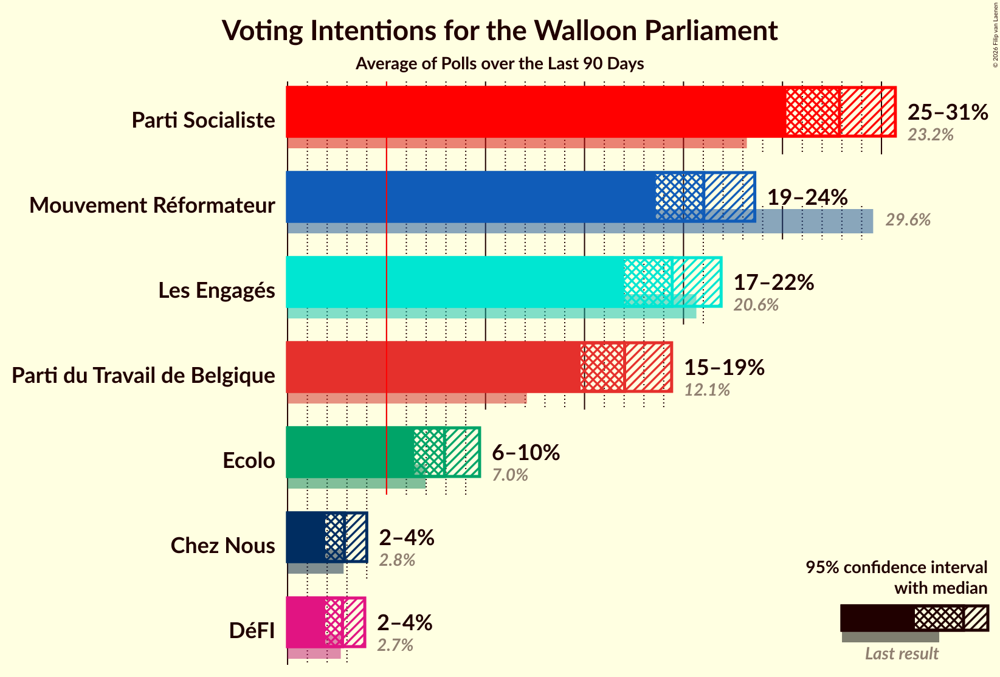

### Confidence Intervals

| Party | Last Result | Median | 80% Confidence Interval | 90% Confidence Interval | 95% Confidence Interval | 99% Confidence Interval |
|:-----:|:-----------:|:------:|:-----------------------:|:-----------------------:|:-----------------------:|:-----------------------:|
| <a href="#mouvement-réformateur">Mouvement Réformateur</a> | 29.6% | 20.6% | 19.0–22.0% |18.5–22.4% | 18.1–22.7% | 17.3–23.4% |
| <a href="#parti-socialiste">Parti Socialiste</a> | 23.2% | 26.6% | 24.0–30.3% |23.6–30.9% | 23.3–31.5% | 22.6–32.5% |
| <a href="#les-engagés">Les Engagés</a> | 20.6% | 19.3% | 17.8–21.3% |17.5–21.9% | 17.2–22.3% | 16.6–23.3% |
| <a href="#parti-du-travail-de-belgique">Parti du Travail de Belgique</a> | 12.1% | 18.4% | 15.8–20.5% |15.3–20.9% | 14.9–21.2% | 14.2–21.9% |
| <a href="#ecolo">Ecolo</a> | 7.0% | 7.2% | 6.1–8.9% |5.8–9.3% | 5.6–9.6% | 5.3–10.3% |
| <a href="#chez-nous">Chez Nous</a> | 2.8% | 3.1% | 2.4–3.7% |2.2–3.9% | 2.1–4.1% | 1.8–4.4% |
| <a href="#défi">DéFI</a> | 2.7% | 2.9% | 2.3–3.6% |2.1–3.8% | 2.0–3.9% | 1.7–4.3% |
| <a href="#collectif-citoyen">Collectif Citoyen</a> | 1.6% | N/A | N/A |N/A | N/A | N/A |
| <a href="#reprise-en-main-citoyenne">Reprise en Main Citoyenne</a> | 0.3% | N/A | N/A |N/A | N/A | N/A |

### Mouvement Réformateur

*For a full overview of the results for this party, see the [Mouvement Réformateur](party-mouvementréformateur.html) page.*

| Voting Intentions | Probability | Accumulated | Special Marks |
|:-----------------:|:-----------:|:-----------:|:-------------:|
| 14.5–15.5% | 0% | 100% |  |
| 15.5–16.5% | 0.1% | 100% |  |
| 16.5–17.5% | 0.8% | 99.9% |  |
| 17.5–18.5% | 5% | 99.1% |  |
| 18.5–19.5% | 15% | 94% |  |
| 19.5–20.5% | 29% | 80% |  |
| 20.5–21.5% | 32% | 51% | Median |
| 21.5–22.5% | 15% | 19% |  |
| 22.5–23.5% | 3% | 4% |  |
| 23.5–24.5% | 0.4% | 0.4% |  |
| 24.5–25.5% | 0% | 0% |  |
| 25.5–26.5% | 0% | 0% |  |
| 26.5–27.5% | 0% | 0% |  |
| 27.5–28.5% | 0% | 0% |  |
| 28.5–29.5% | 0% | 0% |  |
| 29.5–30.5% | 0% | 0% | Last Result |

### Parti Socialiste

*For a full overview of the results for this party, see the [Parti Socialiste](party-partisocialiste.html) page.*

| Voting Intentions | Probability | Accumulated | Special Marks |
|:-----------------:|:-----------:|:-----------:|:-------------:|
| 20.5–21.5% | 0% | 100% |  |
| 21.5–22.5% | 0.4% | 100% |  |
| 22.5–23.5% | 4% | 99.6% | Last Result |
| 23.5–24.5% | 14% | 96% |  |
| 24.5–25.5% | 19% | 81% |  |
| 25.5–26.5% | 12% | 62% |  |
| 26.5–27.5% | 8% | 51% | Median |
| 27.5–28.5% | 11% | 43% |  |
| 28.5–29.5% | 14% | 32% |  |
| 29.5–30.5% | 11% | 18% |  |
| 30.5–31.5% | 5% | 8% |  |
| 31.5–32.5% | 2% | 2% |  |
| 32.5–33.5% | 0.4% | 0.4% |  |
| 33.5–34.5% | 0.1% | 0.1% |  |
| 34.5–35.5% | 0% | 0% |  |

### Les Engagés

*For a full overview of the results for this party, see the [Les Engagés](party-lesengagés.html) page.*

| Voting Intentions | Probability | Accumulated | Special Marks |
|:-----------------:|:-----------:|:-----------:|:-------------:|
| 14.5–15.5% | 0% | 100% |  |
| 15.5–16.5% | 0.5% | 100% |  |
| 16.5–17.5% | 6% | 99.5% |  |
| 17.5–18.5% | 21% | 94% |  |
| 18.5–19.5% | 30% | 73% | Median |
| 19.5–20.5% | 22% | 43% |  |
| 20.5–21.5% | 13% | 21% | Last Result |
| 21.5–22.5% | 6% | 7% |  |
| 22.5–23.5% | 1.5% | 2% |  |
| 23.5–24.5% | 0.2% | 0.3% |  |
| 24.5–25.5% | 0% | 0% |  |

### Parti du Travail de Belgique

*For a full overview of the results for this party, see the [Parti du Travail de Belgique](party-partidutravaildebelgique.html) page.*

| Voting Intentions | Probability | Accumulated | Special Marks |
|:-----------------:|:-----------:|:-----------:|:-------------:|
| 11.5–12.5% | 0% | 100% | Last Result |
| 12.5–13.5% | 0.1% | 100% |  |
| 13.5–14.5% | 1.1% | 99.9% |  |
| 14.5–15.5% | 6% | 98.8% |  |
| 15.5–16.5% | 14% | 93% |  |
| 16.5–17.5% | 16% | 79% |  |
| 17.5–18.5% | 15% | 63% | Median |
| 18.5–19.5% | 20% | 48% |  |
| 19.5–20.5% | 19% | 28% |  |
| 20.5–21.5% | 8% | 9% |  |
| 21.5–22.5% | 1.1% | 1.2% |  |
| 22.5–23.5% | 0.1% | 0.1% |  |
| 23.5–24.5% | 0% | 0% |  |

### Ecolo

*For a full overview of the results for this party, see the [Ecolo](party-ecolo.html) page.*

| Voting Intentions | Probability | Accumulated | Special Marks |
|:-----------------:|:-----------:|:-----------:|:-------------:|
| 3.5–4.5% | 0% | 100% |  |
| 4.5–5.5% | 2% | 100% |  |
| 5.5–6.5% | 25% | 98% |  |
| 6.5–7.5% | 33% | 73% | Last Result, Median |
| 7.5–8.5% | 24% | 40% |  |
| 8.5–9.5% | 13% | 16% |  |
| 9.5–10.5% | 3% | 3% |  |
| 10.5–11.5% | 0.2% | 0.2% |  |
| 11.5–12.5% | 0% | 0% |  |

### Chez Nous

*For a full overview of the results for this party, see the [Chez Nous](party-cheznous.html) page.*

| Voting Intentions | Probability | Accumulated | Special Marks |
|:-----------------:|:-----------:|:-----------:|:-------------:|
| 0.5–1.5% | 0.1% | 100% |  |
| 1.5–2.5% | 15% | 99.9% |  |
| 2.5–3.5% | 67% | 85% | Last Result, Median |
| 3.5–4.5% | 17% | 18% |  |
| 4.5–5.5% | 0.3% | 0.3% |  |
| 5.5–6.5% | 0% | 0% |  |

### DéFI

*For a full overview of the results for this party, see the [DéFI](party-défi.html) page.*

| Voting Intentions | Probability | Accumulated | Special Marks |
|:-----------------:|:-----------:|:-----------:|:-------------:|
| 0.5–1.5% | 0.1% | 100% |  |
| 1.5–2.5% | 20% | 99.9% |  |
| 2.5–3.5% | 69% | 80% | Last Result, Median |
| 3.5–4.5% | 11% | 11% |  |
| 4.5–5.5% | 0.1% | 0.1% |  |
| 5.5–6.5% | 0% | 0% |  |

## Seats

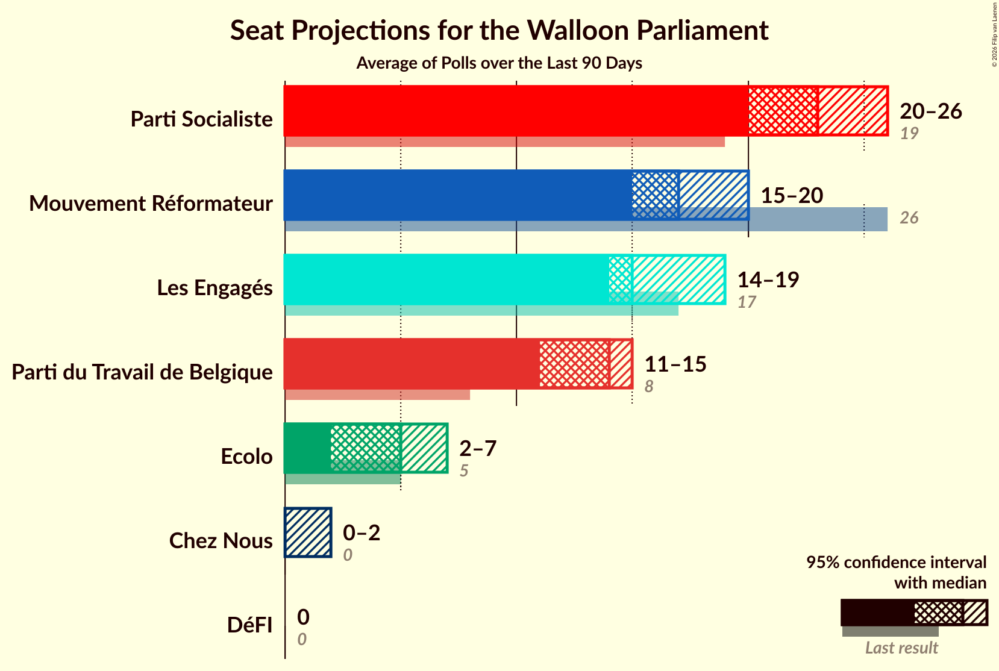

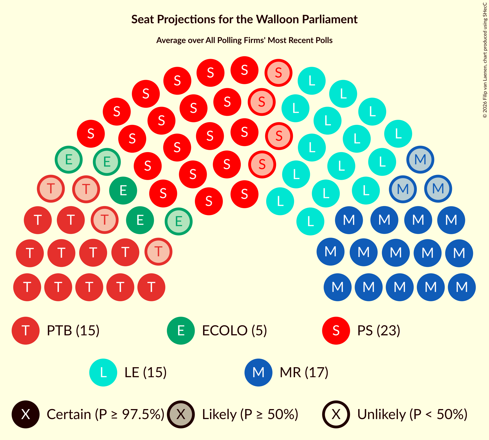

### Confidence Intervals

| Party | Last Result | Median | 80% Confidence Interval | 90% Confidence Interval | 95% Confidence Interval | 99% Confidence Interval |
|:-----:|:-----------:|:------:|:-----------------------:|:-----------------------:|:-----------------------:|:-----------------------:|
| <a href="#mouvement-réformateur">Mouvement Réformateur</a> | 26 | 17 | 15–19 |14–19 | 14–20 | 13–20 |
| <a href="#parti-socialiste">Parti Socialiste</a> | 19 | 23 | 20–26 |19–26 | 19–26 | 18–27 |
| <a href="#les-engagés">Les Engagés</a> | 17 | 15 | 15–18 |15–19 | 15–19 | 14–20 |
| <a href="#parti-du-travail-de-belgique">Parti du Travail de Belgique</a> | 8 | 15 | 12–17 |12–17 | 11–17 | 11–19 |
| <a href="#ecolo">Ecolo</a> | 5 | 5 | 2–5 |2–6 | 2–6 | 1–7 |
| <a href="#chez-nous">Chez Nous</a> | 0 | 0 | 0–2 |0–2 | 0–2 | 0–3 |
| <a href="#défi">DéFI</a> | 0 | 0 | 0 |0 | 0 | 0 |
| <a href="#collectif-citoyen">Collectif Citoyen</a> | 0 | N/A | N/A |N/A | N/A | N/A |
| <a href="#reprise-en-main-citoyenne">Reprise en Main Citoyenne</a> | 0 | N/A | N/A |N/A | N/A | N/A |

### Mouvement Réformateur

*For a full overview of the results for this party, see the [Mouvement Réformateur](party-mouvementréformateur.html) page.*

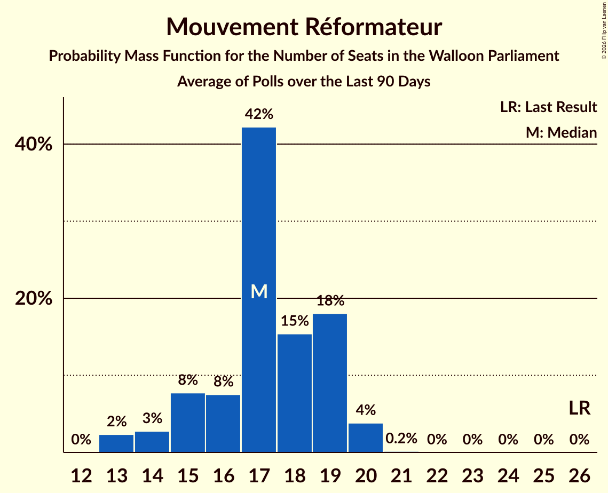

| Number of Seats | Probability | Accumulated | Special Marks |
|:---------------:|:-----------:|:-----------:|:-------------:|
| 13 | 2% | 100% |  |
| 14 | 3% | 98% |  |
| 15 | 8% | 95% |  |
| 16 | 8% | 87% |  |
| 17 | 42% | 80% | Median |
| 18 | 15% | 37% |  |
| 19 | 18% | 22% |  |
| 20 | 4% | 4% |  |
| 21 | 0.2% | 0.2% |  |
| 22 | 0% | 0% |  |
| 23 | 0% | 0% |  |
| 24 | 0% | 0% |  |
| 25 | 0% | 0% |  |
| 26 | 0% | 0% | Last Result |

### Parti Socialiste

*For a full overview of the results for this party, see the [Parti Socialiste](party-partisocialiste.html) page.*

| Number of Seats | Probability | Accumulated | Special Marks |
|:---------------:|:-----------:|:-----------:|:-------------:|
| 17 | 0.1% | 100% |  |
| 18 | 0.5% | 99.9% |  |
| 19 | 7% | 99.4% | Last Result |
| 20 | 10% | 93% |  |
| 21 | 10% | 82% |  |
| 22 | 11% | 72% |  |
| 23 | 35% | 61% | Median |
| 24 | 9% | 27% |  |
| 25 | 7% | 18% |  |
| 26 | 8% | 10% |  |
| 27 | 2% | 2% |  |
| 28 | 0.3% | 0.3% |  |
| 29 | 0% | 0% |  |

### Les Engagés

*For a full overview of the results for this party, see the [Les Engagés](party-lesengagés.html) page.*

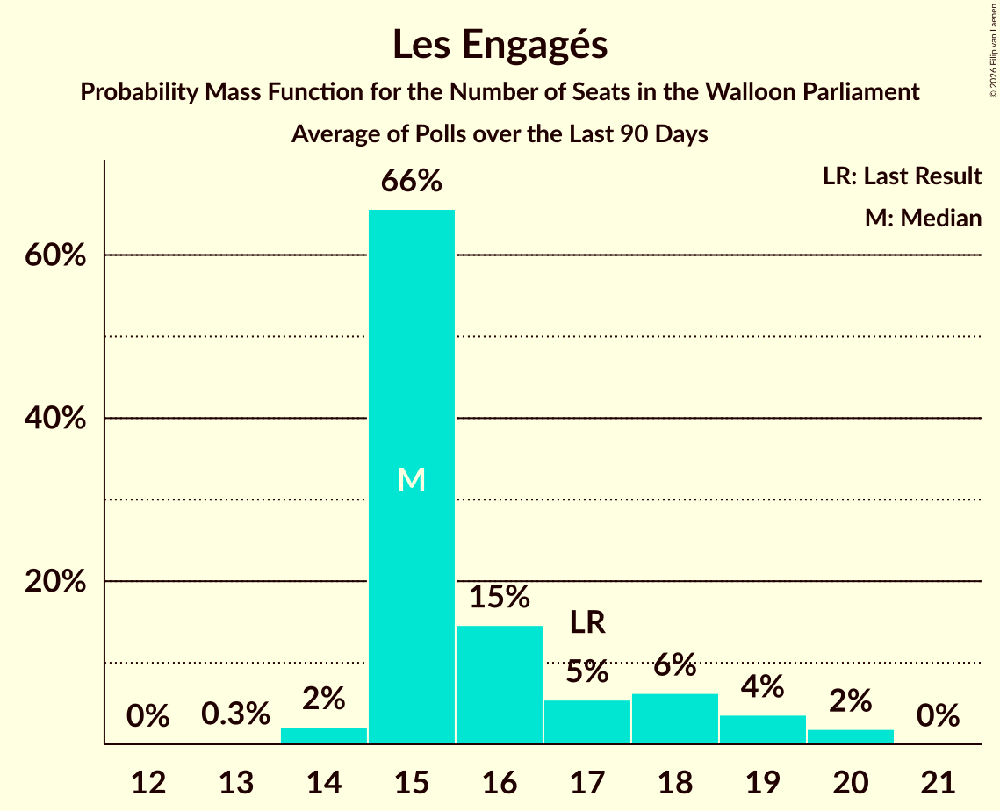

| Number of Seats | Probability | Accumulated | Special Marks |
|:---------------:|:-----------:|:-----------:|:-------------:|
| 13 | 0.3% | 100% |  |
| 14 | 2% | 99.7% |  |
| 15 | 66% | 98% | Median |
| 16 | 15% | 32% |  |
| 17 | 5% | 17% | Last Result |
| 18 | 6% | 12% |  |
| 19 | 4% | 6% |  |
| 20 | 2% | 2% |  |
| 21 | 0% | 0% |  |

### Parti du Travail de Belgique

*For a full overview of the results for this party, see the [Parti du Travail de Belgique](party-partidutravaildebelgique.html) page.*

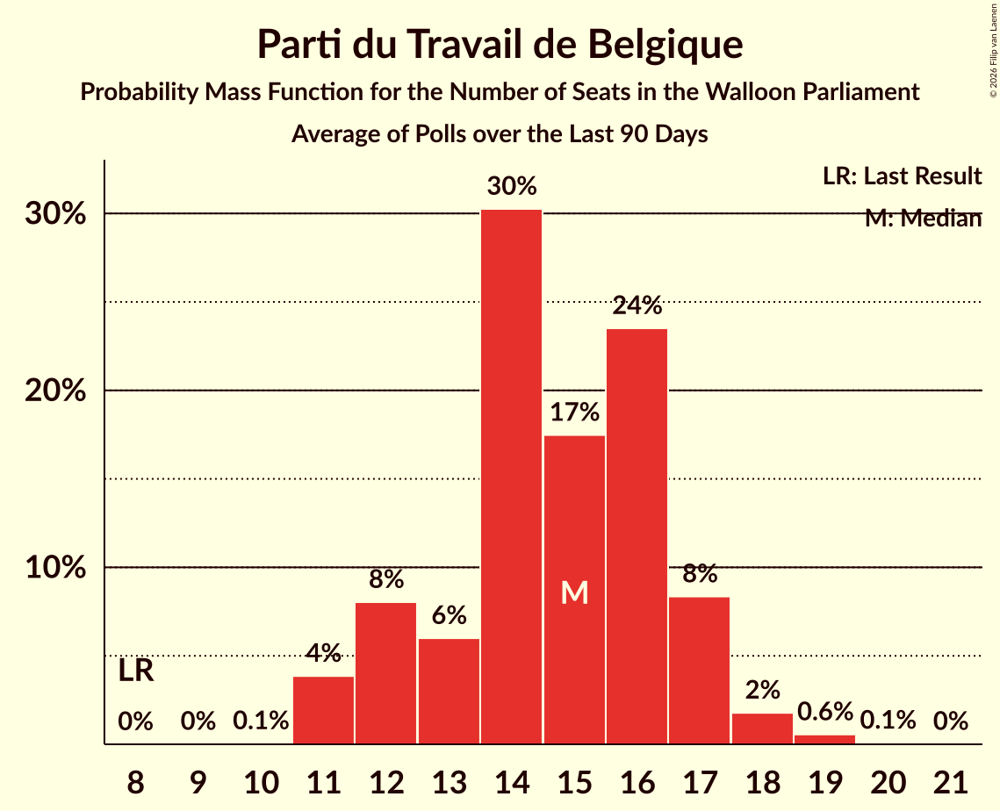

| Number of Seats | Probability | Accumulated | Special Marks |
|:---------------:|:-----------:|:-----------:|:-------------:|
| 8 | 0% | 100% | Last Result |
| 9 | 0% | 100% |  |
| 10 | 0.1% | 100% |  |
| 11 | 4% | 99.9% |  |
| 12 | 8% | 96% |  |
| 13 | 6% | 88% |  |
| 14 | 30% | 82% |  |
| 15 | 17% | 52% | Median |
| 16 | 24% | 34% |  |
| 17 | 8% | 11% |  |
| 18 | 2% | 2% |  |
| 19 | 0.6% | 0.7% |  |
| 20 | 0.1% | 0.1% |  |
| 21 | 0% | 0% |  |

### Ecolo

*For a full overview of the results for this party, see the [Ecolo](party-ecolo.html) page.*

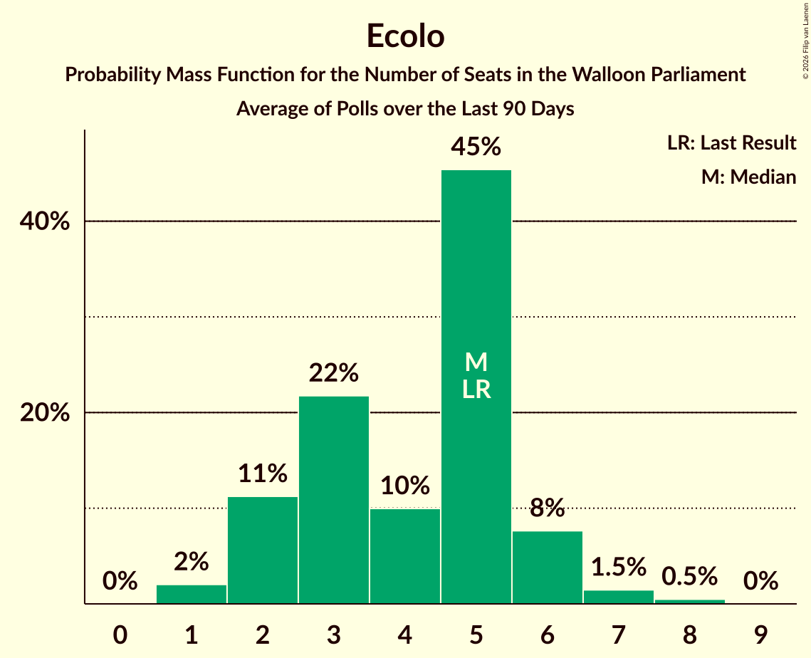

| Number of Seats | Probability | Accumulated | Special Marks |
|:---------------:|:-----------:|:-----------:|:-------------:|
| 1 | 2% | 100% |  |
| 2 | 11% | 98% |  |
| 3 | 22% | 87% |  |
| 4 | 10% | 65% |  |
| 5 | 45% | 55% | Last Result, Median |
| 6 | 8% | 10% |  |
| 7 | 1.5% | 2% |  |
| 8 | 0.5% | 0.5% |  |
| 9 | 0% | 0% |  |

### Chez Nous

*For a full overview of the results for this party, see the [Chez Nous](party-cheznous.html) page.*

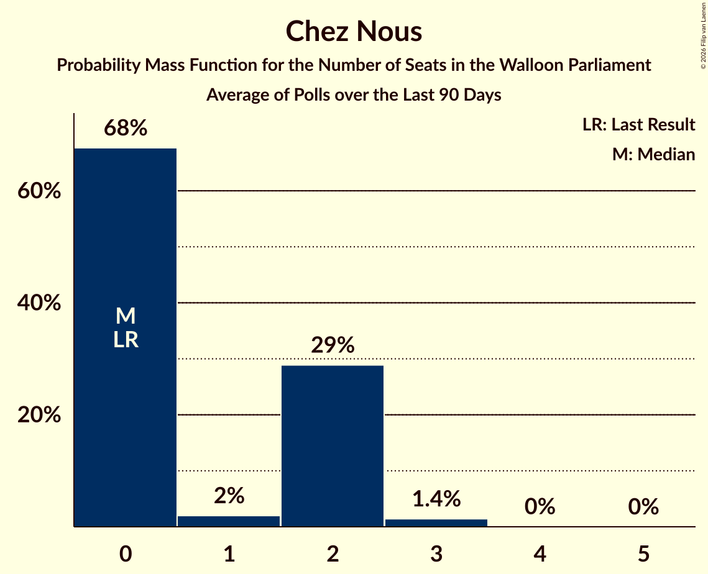

| Number of Seats | Probability | Accumulated | Special Marks |
|:---------------:|:-----------:|:-----------:|:-------------:|
| 0 | 68% | 100% | Last Result, Median |
| 1 | 2% | 32% |  |
| 2 | 28% | 30% |  |
| 3 | 1.3% | 1.4% |  |
| 4 | 0% | 0% |  |

### DéFI

*For a full overview of the results for this party, see the [DéFI](party-défi.html) page.*

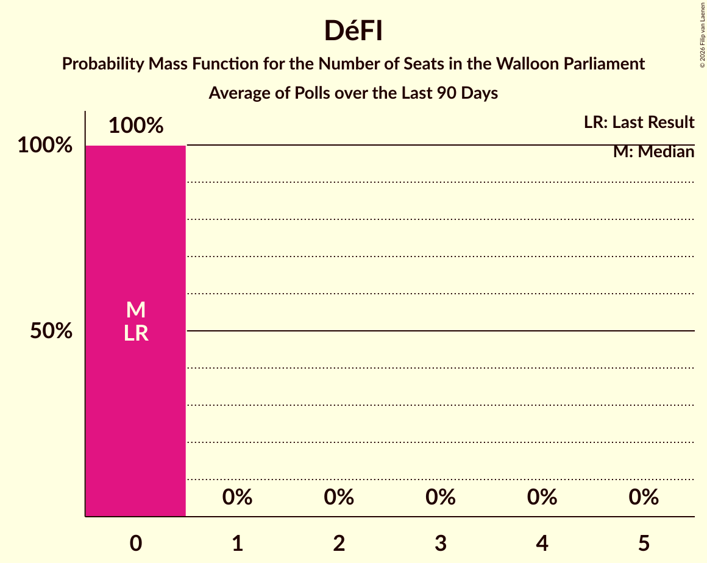

| Number of Seats | Probability | Accumulated | Special Marks |
|:---------------:|:-----------:|:-----------:|:-------------:|
| 0 | 100% | 100% | Last Result, Median |

### Collectif Citoyen

*For a full overview of the results for this party, see the [Collectif Citoyen](party-collectifcitoyen.html) page.*

### Reprise en Main Citoyenne

*For a full overview of the results for this party, see the [Reprise en Main Citoyenne](party-repriseenmaincitoyenne.html) page.*

## Coalitions

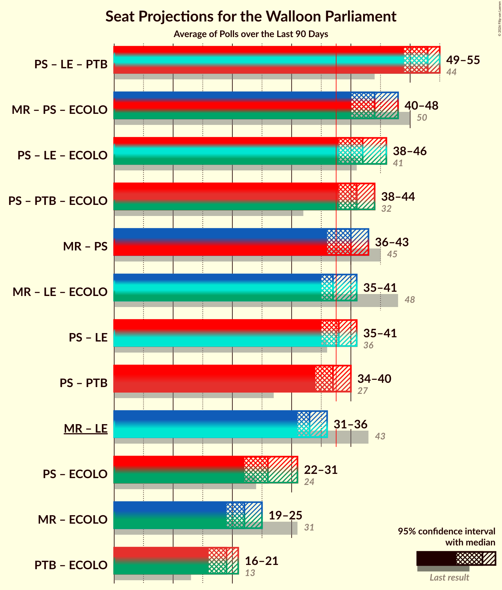

### Confidence Intervals

| Coalition | Last Result | Median | Majority? | 80% Confidence Interval | 90% Confidence Interval | 95% Confidence Interval | 99% Confidence Interval |
|:---------:|:-----------:|:------:|:---------:|:-----------------------:|:-----------------------:|:-----------------------:|:-----------------------:|
| Parti Socialiste – Les Engagés – Parti du Travail de Belgique | 44 | 53 | 100% | 51–55 | 50–56 | 50–56 | 49–57 |
| Mouvement Réformateur – Parti Socialiste – Ecolo | 50 | 44 | 100% | 41–46 | 41–47 | 40–48 | 39–49 |
| Parti Socialiste – Les Engagés – Ecolo | 41 | 43 | 99.1% | 39–46 | 38–47 | 38–48 | 37–50 |
| Parti Socialiste – Parti du Travail de Belgique – Ecolo | 32 | 42 | 98.6% | 39–44 | 38–45 | 38–45 | 37–46 |
| Mouvement Réformateur – Parti Socialiste | 45 | 40 | 92% | 38–42 | 37–42 | 36–43 | 35–44 |
| Parti Socialiste – Les Engagés | 36 | 38 | 66% | 35–41 | 35–42 | 35–43 | 34–45 |
| Mouvement Réformateur – Les Engagés – Ecolo | 48 | 37 | 39% | 35–39 | 35–40 | 34–41 | 33–42 |
| Parti Socialiste – Parti du Travail de Belgique | 27 | 37 | 46% | 35–39 | 34–40 | 34–40 | 33–41 |
| Mouvement Réformateur – Les Engagés | 43 | 33 | 0.5% | 31–35 | 30–36 | 30–36 | 28–38 |
| Parti Socialiste – Ecolo | 24 | 27 | 0% | 23–31 | 23–31 | 22–32 | 21–33 |
| Mouvement Réformateur – Ecolo | 31 | 22 | 0% | 20–23 | 19–24 | 18–24 | 17–25 |
| Parti du Travail de Belgique – Ecolo | 13 | 19 | 0% | 17–20 | 16–21 | 16–21 | 15–22 |

### Parti Socialiste – Les Engagés – Parti du Travail de Belgique

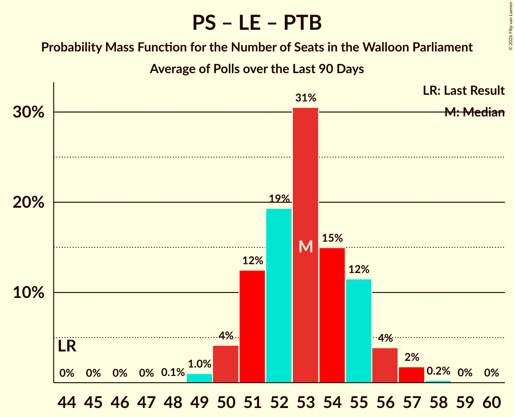

| Number of Seats | Probability | Accumulated | Special Marks |
|:---------------:|:-----------:|:-----------:|:-------------:|
| 44 | 0% | 100% | Last Result |
| 45 | 0% | 100% |  |
| 46 | 0% | 100% |  |
| 47 | 0% | 100% |  |
| 48 | 0.1% | 100% |  |
| 49 | 1.0% | 99.9% |  |
| 50 | 4% | 98.9% |  |
| 51 | 12% | 95% |  |
| 52 | 19% | 82% |  |
| 53 | 31% | 63% | Median |
| 54 | 15% | 32% |  |
| 55 | 12% | 17% |  |
| 56 | 4% | 6% |  |
| 57 | 2% | 2% |  |
| 58 | 0.2% | 0.3% |  |
| 59 | 0% | 0.1% |  |
| 60 | 0% | 0% |  |

### Mouvement Réformateur – Parti Socialiste – Ecolo

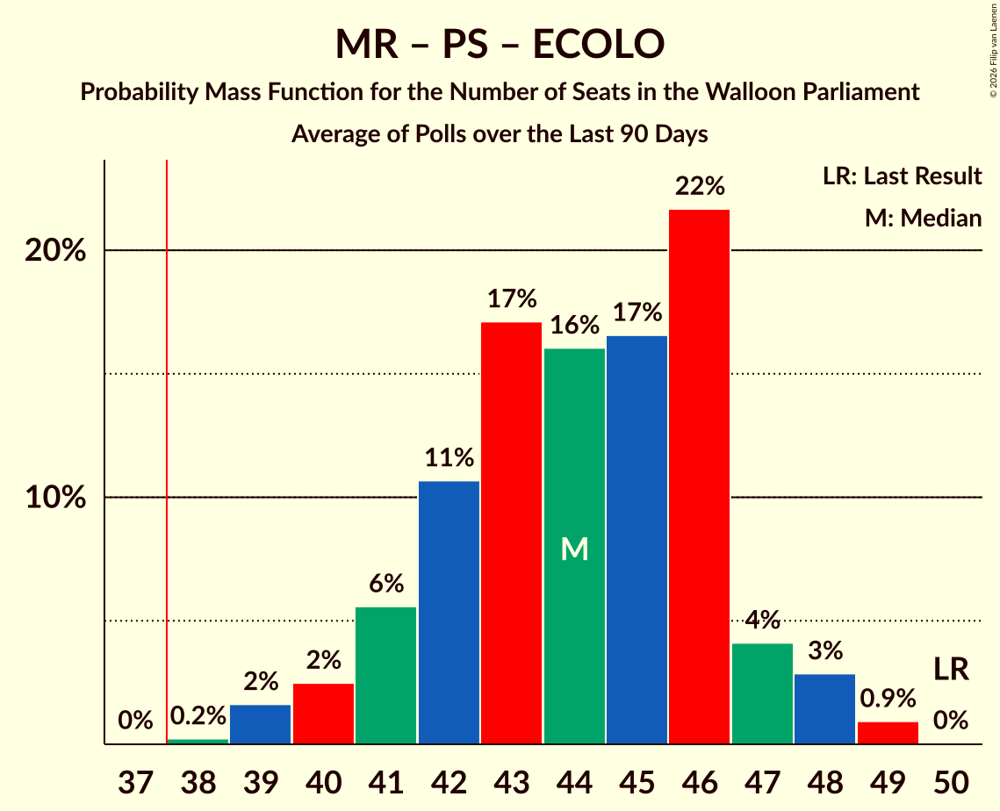

| Number of Seats | Probability | Accumulated | Special Marks |
|:---------------:|:-----------:|:-----------:|:-------------:|
| 38 | 0.2% | 100% | Majority |
| 39 | 2% | 99.7% |  |
| 40 | 3% | 98% |  |
| 41 | 6% | 95% |  |
| 42 | 11% | 90% |  |
| 43 | 18% | 78% |  |
| 44 | 17% | 60% |  |
| 45 | 16% | 43% | Median |
| 46 | 18% | 27% |  |
| 47 | 5% | 9% |  |
| 48 | 3% | 4% |  |
| 49 | 0.5% | 0.5% |  |
| 50 | 0% | 0% | Last Result |

### Parti Socialiste – Les Engagés – Ecolo

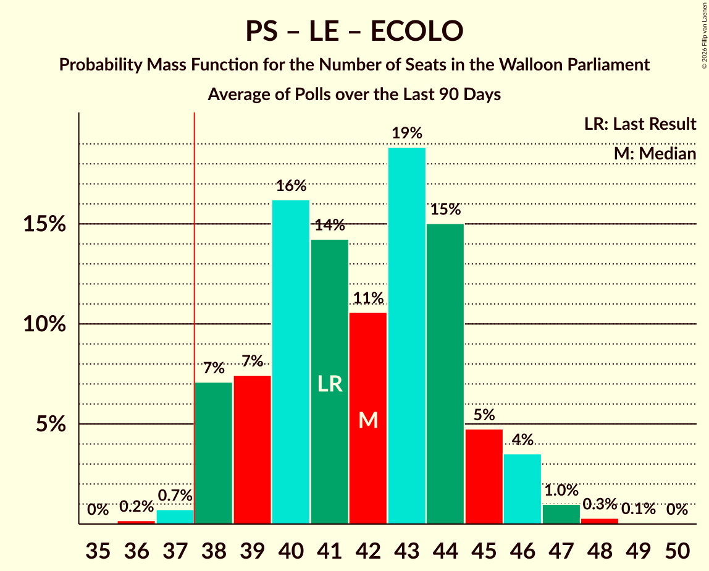

| Number of Seats | Probability | Accumulated | Special Marks |
|:---------------:|:-----------:|:-----------:|:-------------:|
| 36 | 0.2% | 100% |  |
| 37 | 0.7% | 99.8% |  |
| 38 | 7% | 99.1% | Majority |
| 39 | 7% | 92% |  |
| 40 | 15% | 85% |  |
| 41 | 12% | 69% | Last Result |
| 42 | 6% | 57% |  |
| 43 | 10% | 50% | Median |
| 44 | 16% | 40% |  |
| 45 | 6% | 24% |  |
| 46 | 10% | 18% |  |
| 47 | 5% | 8% |  |
| 48 | 2% | 3% |  |
| 49 | 0.6% | 1.2% |  |
| 50 | 0.5% | 0.6% |  |
| 51 | 0.1% | 0.1% |  |
| 52 | 0% | 0% |  |

### Parti Socialiste – Parti du Travail de Belgique – Ecolo

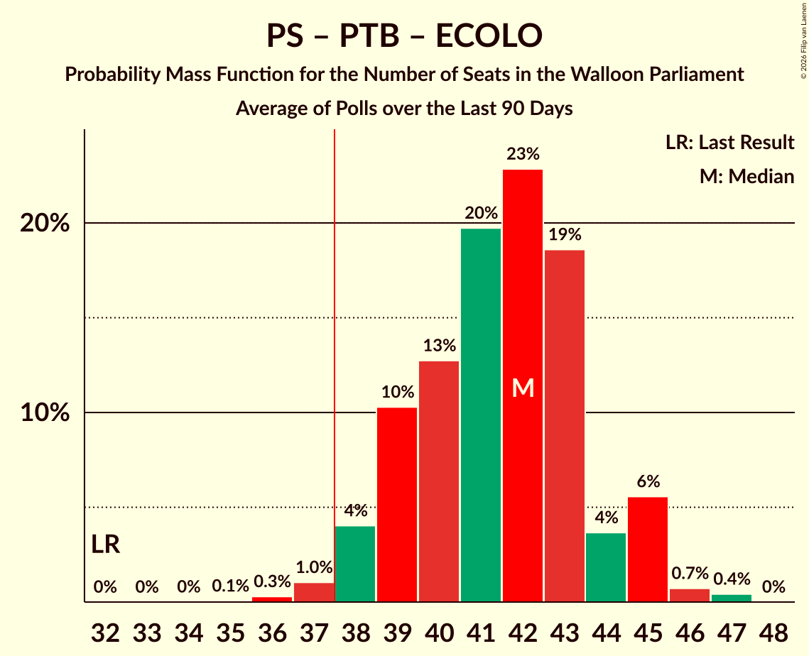

| Number of Seats | Probability | Accumulated | Special Marks |
|:---------------:|:-----------:|:-----------:|:-------------:|
| 32 | 0% | 100% | Last Result |
| 33 | 0% | 100% |  |
| 34 | 0% | 100% |  |
| 35 | 0.1% | 100% |  |
| 36 | 0.3% | 99.9% |  |
| 37 | 1.0% | 99.6% |  |
| 38 | 4% | 98.6% | Majority |
| 39 | 10% | 95% |  |
| 40 | 13% | 84% |  |
| 41 | 20% | 72% |  |
| 42 | 23% | 52% |  |
| 43 | 19% | 29% | Median |
| 44 | 4% | 10% |  |
| 45 | 6% | 7% |  |
| 46 | 0.7% | 1.1% |  |
| 47 | 0.4% | 0.4% |  |
| 48 | 0% | 0% |  |

### Mouvement Réformateur – Parti Socialiste

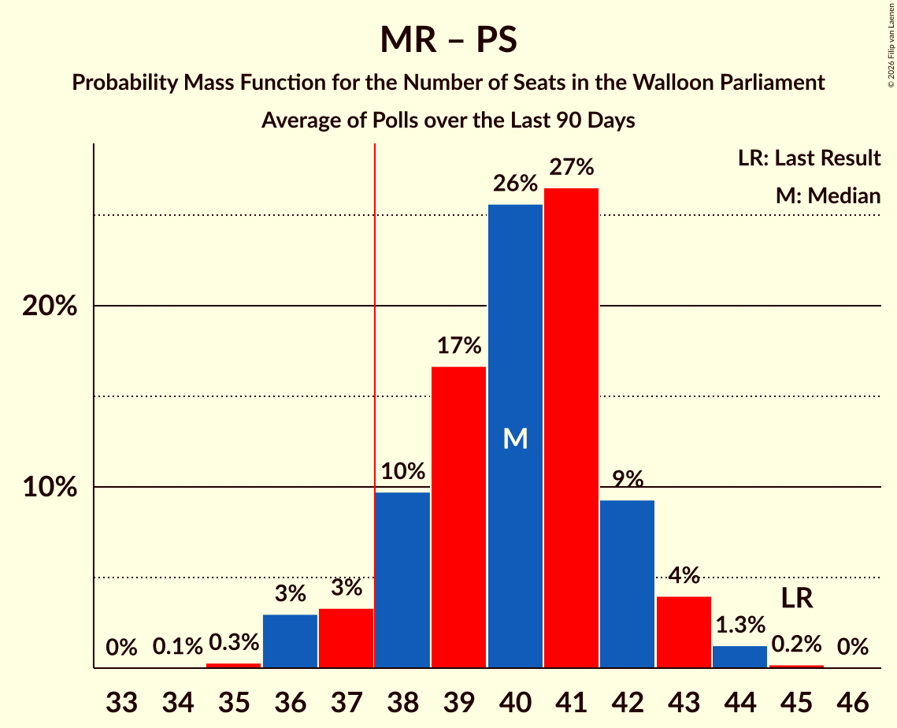

| Number of Seats | Probability | Accumulated | Special Marks |
|:---------------:|:-----------:|:-----------:|:-------------:|
| 34 | 0.1% | 100% |  |
| 35 | 0.4% | 99.9% |  |
| 36 | 3% | 99.5% |  |
| 37 | 4% | 96% |  |
| 38 | 11% | 92% | Majority |
| 39 | 18% | 81% |  |
| 40 | 27% | 63% | Median |
| 41 | 22% | 36% |  |
| 42 | 9% | 14% |  |
| 43 | 4% | 5% |  |
| 44 | 0.7% | 0.8% |  |
| 45 | 0.1% | 0.1% | Last Result |
| 46 | 0% | 0% |  |

### Parti Socialiste – Les Engagés

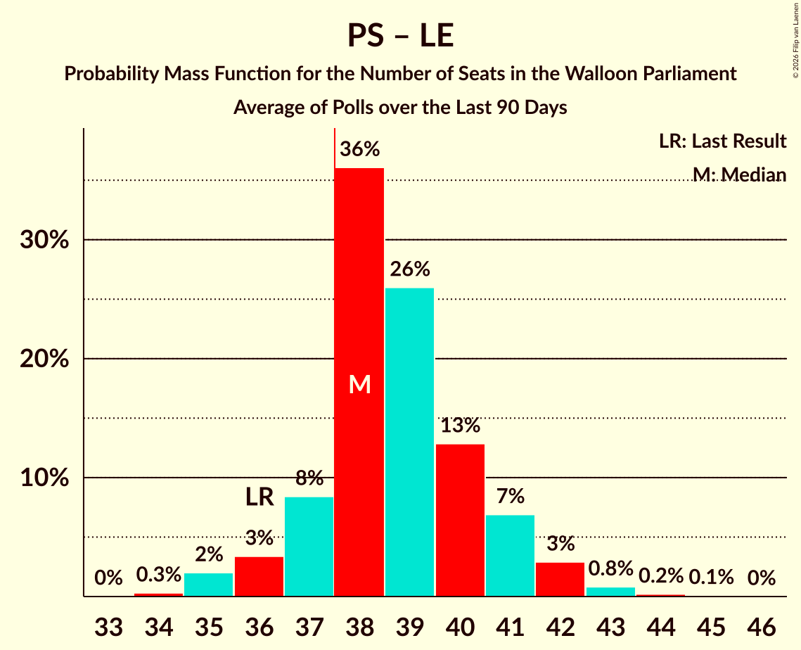

| Number of Seats | Probability | Accumulated | Special Marks |
|:---------------:|:-----------:|:-----------:|:-------------:|
| 33 | 0.2% | 100% |  |
| 34 | 0.8% | 99.8% |  |
| 35 | 11% | 99.0% |  |
| 36 | 10% | 88% | Last Result |
| 37 | 13% | 78% |  |
| 38 | 25% | 66% | Median, Majority |
| 39 | 15% | 41% |  |
| 40 | 8% | 26% |  |
| 41 | 10% | 18% |  |
| 42 | 5% | 8% |  |
| 43 | 2% | 3% |  |
| 44 | 0.7% | 1.4% |  |
| 45 | 0.5% | 0.6% |  |
| 46 | 0.1% | 0.1% |  |
| 47 | 0% | 0% |  |

### Mouvement Réformateur – Les Engagés – Ecolo

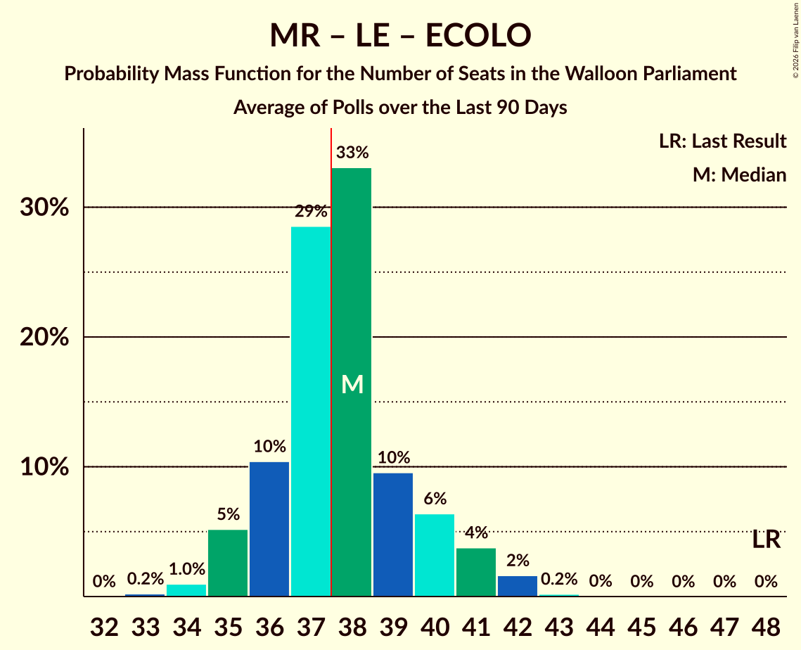

| Number of Seats | Probability | Accumulated | Special Marks |
|:---------------:|:-----------:|:-----------:|:-------------:|
| 32 | 0.1% | 100% |  |
| 33 | 0.5% | 99.9% |  |
| 34 | 3% | 99.4% |  |
| 35 | 15% | 96% |  |
| 36 | 20% | 82% |  |
| 37 | 23% | 62% | Median |
| 38 | 22% | 39% | Majority |
| 39 | 9% | 17% |  |
| 40 | 5% | 7% |  |
| 41 | 2% | 3% |  |
| 42 | 0.6% | 0.7% |  |
| 43 | 0% | 0% |  |
| 44 | 0% | 0% |  |
| 45 | 0% | 0% |  |
| 46 | 0% | 0% |  |
| 47 | 0% | 0% |  |
| 48 | 0% | 0% | Last Result |

### Parti Socialiste – Parti du Travail de Belgique

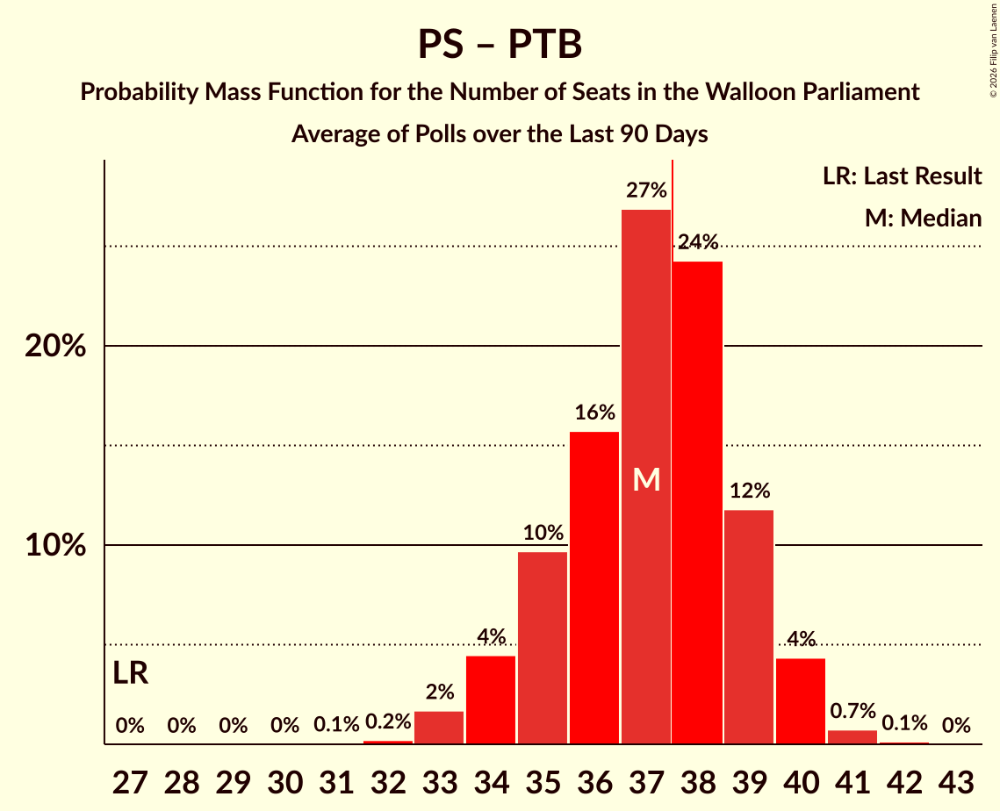

| Number of Seats | Probability | Accumulated | Special Marks |
|:---------------:|:-----------:|:-----------:|:-------------:|
| 27 | 0% | 100% | Last Result |
| 28 | 0% | 100% |  |
| 29 | 0% | 100% |  |
| 30 | 0% | 100% |  |
| 31 | 0% | 100% |  |
| 32 | 0.1% | 100% |  |
| 33 | 1.3% | 99.9% |  |
| 34 | 4% | 98.6% |  |
| 35 | 9% | 95% |  |
| 36 | 14% | 86% |  |
| 37 | 25% | 71% |  |
| 38 | 23% | 46% | Median, Majority |
| 39 | 13% | 23% |  |
| 40 | 8% | 10% |  |
| 41 | 2% | 2% |  |
| 42 | 0.2% | 0.2% |  |
| 43 | 0% | 0% |  |

### Mouvement Réformateur – Les Engagés

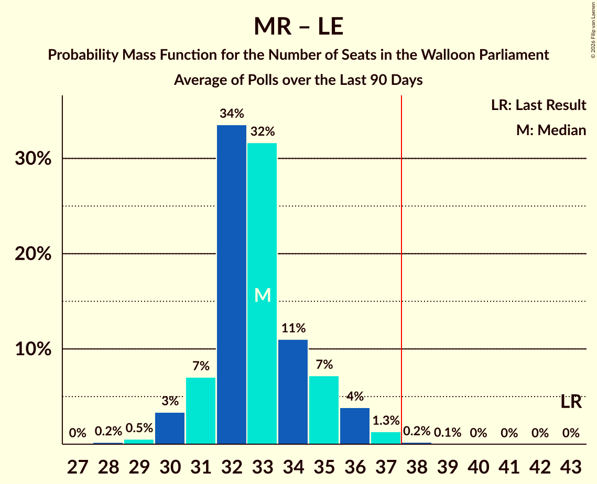

| Number of Seats | Probability | Accumulated | Special Marks |
|:---------------:|:-----------:|:-----------:|:-------------:|
| 28 | 0.5% | 100% |  |
| 29 | 1.2% | 99.5% |  |
| 30 | 7% | 98% |  |
| 31 | 7% | 92% |  |
| 32 | 26% | 85% | Median |
| 33 | 25% | 58% |  |
| 34 | 19% | 34% |  |
| 35 | 9% | 15% |  |
| 36 | 4% | 6% |  |
| 37 | 1.5% | 2% |  |
| 38 | 0.4% | 0.5% | Majority |
| 39 | 0.1% | 0.1% |  |
| 40 | 0% | 0% |  |
| 41 | 0% | 0% |  |
| 42 | 0% | 0% |  |
| 43 | 0% | 0% | Last Result |

### Parti Socialiste – Ecolo

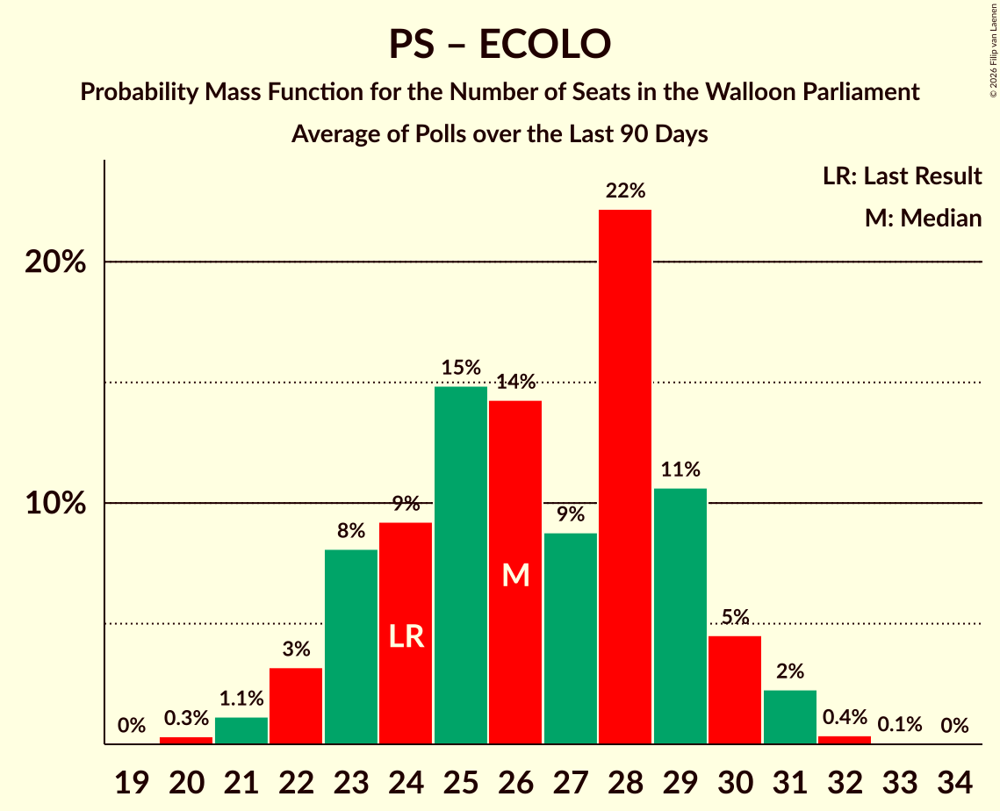

| Number of Seats | Probability | Accumulated | Special Marks |
|:---------------:|:-----------:|:-----------:|:-------------:|
| 20 | 0.3% | 100% |  |
| 21 | 1.1% | 99.6% |  |
| 22 | 3% | 98.5% |  |
| 23 | 8% | 95% |  |
| 24 | 9% | 87% | Last Result |
| 25 | 14% | 79% |  |
| 26 | 13% | 65% |  |
| 27 | 5% | 52% |  |
| 28 | 18% | 46% | Median |
| 29 | 12% | 29% |  |
| 30 | 6% | 17% |  |
| 31 | 8% | 10% |  |
| 32 | 2% | 3% |  |
| 33 | 0.6% | 0.7% |  |
| 34 | 0.1% | 0.1% |  |
| 35 | 0% | 0% |  |

### Mouvement Réformateur – Ecolo

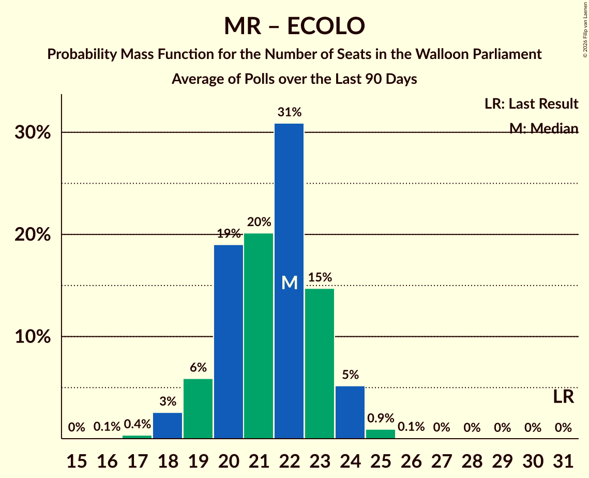

| Number of Seats | Probability | Accumulated | Special Marks |
|:---------------:|:-----------:|:-----------:|:-------------:|
| 16 | 0.1% | 100% |  |
| 17 | 0.4% | 99.8% |  |
| 18 | 3% | 99.5% |  |
| 19 | 6% | 97% |  |
| 20 | 19% | 91% |  |
| 21 | 20% | 72% |  |
| 22 | 31% | 52% | Median |
| 23 | 15% | 21% |  |
| 24 | 5% | 6% |  |
| 25 | 0.9% | 1.1% |  |
| 26 | 0.1% | 0.1% |  |
| 27 | 0% | 0% |  |
| 28 | 0% | 0% |  |
| 29 | 0% | 0% |  |
| 30 | 0% | 0% |  |
| 31 | 0% | 0% | Last Result |

### Parti du Travail de Belgique – Ecolo

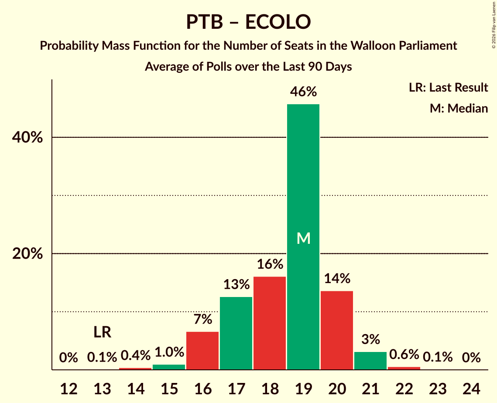

| Number of Seats | Probability | Accumulated | Special Marks |
|:---------------:|:-----------:|:-----------:|:-------------:|
| 13 | 0% | 100% | Last Result |
| 14 | 0.3% | 100% |  |
| 15 | 0.5% | 99.7% |  |
| 16 | 5% | 99.2% |  |
| 17 | 11% | 95% |  |
| 18 | 17% | 83% |  |
| 19 | 38% | 66% |  |
| 20 | 18% | 28% | Median |
| 21 | 8% | 10% |  |
| 22 | 1.4% | 2% |  |
| 23 | 0.3% | 0.3% |  |
| 24 | 0% | 0% |  |

## Technical Information

+ **Number of polls included in this average:** 2
+ **Lowest number of simulations done in a poll included in this average:** 2,097,152
+ **Total number of simulations done in the polls included in this average:** 4,194,304
+ **Error estimate:** 1.25%
