# Poll Average

<a href="#voting-intentions">Voting Intentions</a> | <a href="#seats">Seats</a> | <a href="#coalitions">Coalitions</a> | <a href="#technical-information">Technical Information</a>

## Summary

The table below lists the polls on which the average is based. They are the most recent polls (less than 90 days old) registered and analyzed so far.

| Period     | Polling firm/Commissioner(s) | MR | PS | LE | PTB | ECOLO | CN | DÉFI | CC | RMC |
|:----------:|:----------------------------:|:--:|:--:|:--:|:--:|:--:|:--:|:--:|:--:|:--:|
| 9 June 2024 | General Election | 29.6%   26 | 23.2%   19 | 20.6%   17 | 12.1%   8 | 7.0%   5 | 2.8%   0 | 2.7%   0 | 1.6%   0 | 0.3%   0 |
| N/A | Poll Average | 18–23%   14–18 | 26–32%   21–26 | 15–20%   13–15 | 17–21%   13–16 | 7–11%   5–7 | 2–4%   0–2 | 2–4%   0 | N/A   N/A | N/A   N/A |
| [8–15 September 2026](2026-09-15-Ipsos.html) | Ipsos   Het Laatste Nieuws, Le Soir, RTL TVi and VTM | 18–23%   14–18 | 26–32%   21–26 | 15–20%   13–15 | 17–21%   13–16 | 7–11%   5–7 | 2–4%   0–2 | 2–4%   0 | N/A   N/A | N/A   N/A |
| 9 June 2024 | General Election | 29.6%   26 | 23.2%   19 | 20.6%   17 | 12.1%   8 | 7.0%   5 | 2.8%   0 | 2.7%   0 | 1.6%   0 | 0.3%   0 |

Only polls for which at least the sample size has been published are included in the table above.

**Legend:**
+ **Top half of each row:** Voting intentions (95% confidence interval)
+ **Bottom half of each row:** Seat projections for the Walloon Parliament (95% confidence interval)
+ **MR:** Mouvement Réformateur
+ **PS:** Parti Socialiste
+ **LE:** Les Engagés
+ **PTB:** Parti du Travail de Belgique
+ **ECOLO:** Ecolo
+ **CN:** Chez Nous
+ **DÉFI:** DéFI
+ **CC:** Collectif Citoyen
+ **RMC:** Reprise en Main Citoyenne
+ **N/A (single party):** Party not included the published results
+ **N/A (entire row):** Calculation for this opinion poll not started yet

## Voting Intentions

### Confidence Intervals

| Party | Last Result | Median | 80% Confidence Interval | 90% Confidence Interval | 95% Confidence Interval | 99% Confidence Interval |
|:-----:|:-----------:|:------:|:-----------------------:|:-----------------------:|:-----------------------:|:-----------------------:|
| <a href="#mouvement-réformateur">Mouvement Réformateur</a> | 29.6% | 20.3% | 18.7–22.0% |18.3–22.4% | 17.9–22.9% | 17.2–23.7% |
| <a href="#parti-socialiste">Parti Socialiste</a> | 23.2% | 29.0% | 27.2–30.8% |26.6–31.4% | 26.2–31.8% | 25.4–32.7% |
| <a href="#les-engagés">Les Engagés</a> | 20.6% | 17.6% | 16.1–19.2% |15.7–19.6% | 15.3–20.1% | 14.7–20.8% |
| <a href="#parti-du-travail-de-belgique">Parti du Travail de Belgique</a> | 12.1% | 18.9% | 17.4–20.5% |16.9–21.0% | 16.6–21.4% | 15.9–22.2% |
| <a href="#ecolo">Ecolo</a> | 7.0% | 8.9% | 7.8–10.1% |7.5–10.5% | 7.3–10.8% | 6.8–11.4% |
| <a href="#chez-nous">Chez Nous</a> | 2.8% | 2.9% | 2.2–3.6% |2.1–3.8% | 1.9–4.0% | 1.7–4.4% |
| <a href="#défi">DéFI</a> | 2.7% | 2.8% | 2.1–3.5% |2.0–3.7% | 1.9–3.9% | 1.6–4.3% |
| <a href="#collectif-citoyen">Collectif Citoyen</a> | 1.6% | N/A | N/A |N/A | N/A | N/A |
| <a href="#reprise-en-main-citoyenne">Reprise en Main Citoyenne</a> | 0.3% | N/A | N/A |N/A | N/A | N/A |

### Mouvement Réformateur

*For a full overview of the results for this party, see the [Mouvement Réformateur](party-mouvementréformateur.html) page.*

| Voting Intentions | Probability | Accumulated | Special Marks |
|:-----------------:|:-----------:|:-----------:|:-------------:|
| 14.5–15.5% | 0% | 100% |  |
| 15.5–16.5% | 0.1% | 100% |  |
| 16.5–17.5% | 1.1% | 99.9% |  |
| 17.5–18.5% | 7% | 98.8% |  |
| 18.5–19.5% | 20% | 92% |  |
| 19.5–20.5% | 30% | 72% | Median |
| 20.5–21.5% | 26% | 42% |  |
| 21.5–22.5% | 12% | 17% |  |
| 22.5–23.5% | 3% | 4% |  |
| 23.5–24.5% | 0.6% | 0.7% |  |
| 24.5–25.5% | 0.1% | 0.1% |  |
| 25.5–26.5% | 0% | 0% |  |
| 26.5–27.5% | 0% | 0% |  |
| 27.5–28.5% | 0% | 0% |  |
| 28.5–29.5% | 0% | 0% |  |
| 29.5–30.5% | 0% | 0% | Last Result |

### Parti Socialiste

*For a full overview of the results for this party, see the [Parti Socialiste](party-partisocialiste.html) page.*

| Voting Intentions | Probability | Accumulated | Special Marks |
|:-----------------:|:-----------:|:-----------:|:-------------:|
| 22.5–23.5% | 0% | 100% | Last Result |
| 23.5–24.5% | 0.1% | 100% |  |
| 24.5–25.5% | 0.6% | 99.9% |  |
| 25.5–26.5% | 4% | 99.3% |  |
| 26.5–27.5% | 12% | 96% |  |
| 27.5–28.5% | 22% | 84% |  |
| 28.5–29.5% | 27% | 62% | Median |
| 29.5–30.5% | 20% | 34% |  |
| 30.5–31.5% | 10% | 14% |  |
| 31.5–32.5% | 3% | 4% |  |
| 32.5–33.5% | 0.6% | 0.7% |  |
| 33.5–34.5% | 0.1% | 0.1% |  |
| 34.5–35.5% | 0% | 0% |  |

### Les Engagés

*For a full overview of the results for this party, see the [Les Engagés](party-lesengagés.html) page.*

| Voting Intentions | Probability | Accumulated | Special Marks |
|:-----------------:|:-----------:|:-----------:|:-------------:|
| 12.5–13.5% | 0% | 100% |  |
| 13.5–14.5% | 0.4% | 100% |  |
| 14.5–15.5% | 3% | 99.6% |  |
| 15.5–16.5% | 15% | 96% |  |
| 16.5–17.5% | 29% | 81% |  |
| 17.5–18.5% | 30% | 52% | Median |
| 18.5–19.5% | 16% | 22% |  |
| 19.5–20.5% | 5% | 6% |  |
| 20.5–21.5% | 0.9% | 0.9% | Last Result |
| 21.5–22.5% | 0.1% | 0.1% |  |
| 22.5–23.5% | 0% | 0% |  |

### Parti du Travail de Belgique

*For a full overview of the results for this party, see the [Parti du Travail de Belgique](party-partidutravaildebelgique.html) page.*

| Voting Intentions | Probability | Accumulated | Special Marks |
|:-----------------:|:-----------:|:-----------:|:-------------:|
| 11.5–12.5% | 0% | 100% | Last Result |
| 12.5–13.5% | 0% | 100% |  |
| 13.5–14.5% | 0% | 100% |  |
| 14.5–15.5% | 0.2% | 100% |  |
| 15.5–16.5% | 2% | 99.8% |  |
| 16.5–17.5% | 11% | 98% |  |
| 17.5–18.5% | 26% | 87% |  |
| 18.5–19.5% | 31% | 61% | Median |
| 19.5–20.5% | 20% | 30% |  |
| 20.5–21.5% | 8% | 10% |  |
| 21.5–22.5% | 2% | 2% |  |
| 22.5–23.5% | 0.2% | 0.2% |  |
| 23.5–24.5% | 0% | 0% |  |

### Ecolo

*For a full overview of the results for this party, see the [Ecolo](party-ecolo.html) page.*

| Voting Intentions | Probability | Accumulated | Special Marks |
|:-----------------:|:-----------:|:-----------:|:-------------:|
| 4.5–5.5% | 0% | 100% |  |
| 5.5–6.5% | 0.2% | 100% |  |
| 6.5–7.5% | 5% | 99.8% | Last Result |
| 7.5–8.5% | 28% | 95% |  |
| 8.5–9.5% | 42% | 67% | Median |
| 9.5–10.5% | 21% | 25% |  |
| 10.5–11.5% | 4% | 4% |  |
| 11.5–12.5% | 0.3% | 0.4% |  |
| 12.5–13.5% | 0% | 0% |  |

### Chez Nous

*For a full overview of the results for this party, see the [Chez Nous](party-cheznous.html) page.*

| Voting Intentions | Probability | Accumulated | Special Marks |
|:-----------------:|:-----------:|:-----------:|:-------------:|
| 0.5–1.5% | 0.1% | 100% |  |
| 1.5–2.5% | 27% | 99.9% |  |
| 2.5–3.5% | 62% | 73% | Last Result, Median |
| 3.5–4.5% | 11% | 11% |  |
| 4.5–5.5% | 0.3% | 0.3% |  |
| 5.5–6.5% | 0% | 0% |  |

### DéFI

*For a full overview of the results for this party, see the [DéFI](party-défi.html) page.*

| Voting Intentions | Probability | Accumulated | Special Marks |
|:-----------------:|:-----------:|:-----------:|:-------------:|
| 0.0–0.5% | 0% | 100% |  |
| 0.5–1.5% | 0.3% | 100% |  |
| 1.5–2.5% | 33% | 99.7% |  |
| 2.5–3.5% | 58% | 66% | Last Result, Median |
| 3.5–4.5% | 8% | 8% |  |
| 4.5–5.5% | 0.2% | 0.2% |  |
| 5.5–6.5% | 0% | 0% |  |

## Seats

### Confidence Intervals

| Party | Last Result | Median | 80% Confidence Interval | 90% Confidence Interval | 95% Confidence Interval | 99% Confidence Interval |
|:-----:|:-----------:|:------:|:-----------------------:|:-----------------------:|:-----------------------:|:-----------------------:|
| <a href="#mouvement-réformateur">Mouvement Réformateur</a> | 26 | 17 | 15–17 |15–18 | 14–18 | 13–19 |
| <a href="#parti-socialiste">Parti Socialiste</a> | 19 | 23 | 23–26 |23–26 | 21–26 | 20–27 |
| <a href="#les-engagés">Les Engagés</a> | 17 | 14 | 13–15 |13–15 | 13–15 | 12–18 |
| <a href="#parti-du-travail-de-belgique">Parti du Travail de Belgique</a> | 8 | 15 | 14–16 |14–16 | 13–16 | 12–17 |
| <a href="#ecolo">Ecolo</a> | 5 | 5 | 5–6 |5–7 | 5–7 | 4–8 |
| <a href="#chez-nous">Chez Nous</a> | 0 | 0 | 0–1 |0–2 | 0–2 | 0–2 |
| <a href="#défi">DéFI</a> | 0 | 0 | 0 |0 | 0 | 0 |
| <a href="#collectif-citoyen">Collectif Citoyen</a> | 0 | N/A | N/A |N/A | N/A | N/A |
| <a href="#reprise-en-main-citoyenne">Reprise en Main Citoyenne</a> | 0 | N/A | N/A |N/A | N/A | N/A |

### Mouvement Réformateur

*For a full overview of the results for this party, see the [Mouvement Réformateur](party-mouvementréformateur.html) page.*

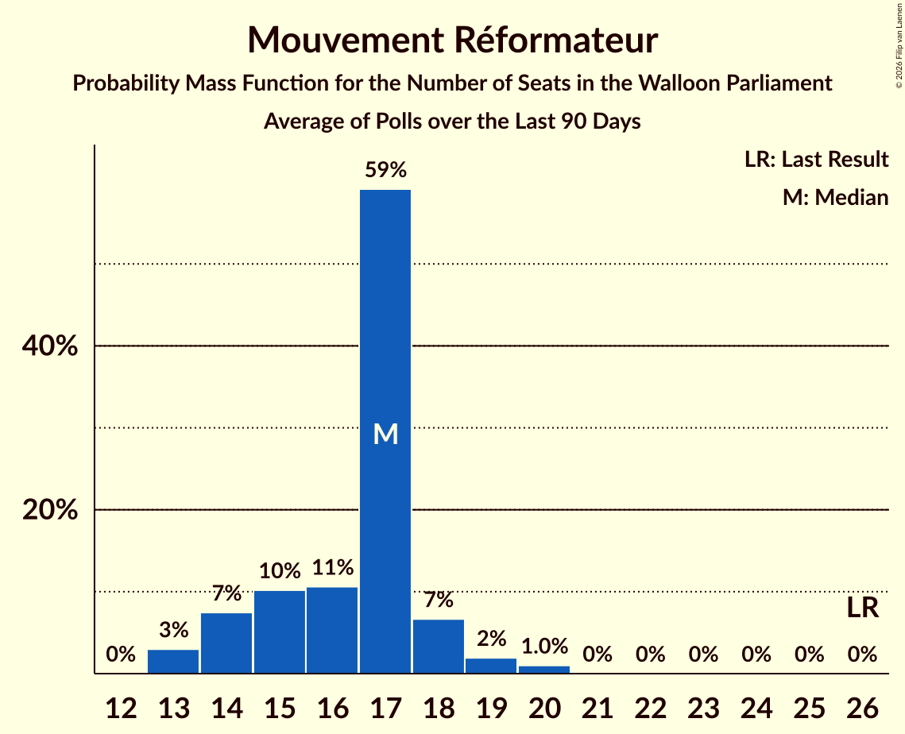

| Number of Seats | Probability | Accumulated | Special Marks |
|:---------------:|:-----------:|:-----------:|:-------------:|
| 12 | 0.1% | 100% |  |
| 13 | 2% | 99.9% |  |
| 14 | 2% | 98% |  |
| 15 | 8% | 96% |  |
| 16 | 8% | 88% |  |
| 17 | 75% | 80% | Median |
| 18 | 4% | 5% |  |
| 19 | 1.1% | 1.4% |  |
| 20 | 0.3% | 0.4% |  |
| 21 | 0% | 0% |  |
| 22 | 0% | 0% |  |
| 23 | 0% | 0% |  |
| 24 | 0% | 0% |  |
| 25 | 0% | 0% |  |
| 26 | 0% | 0% | Last Result |

### Parti Socialiste

*For a full overview of the results for this party, see the [Parti Socialiste](party-partisocialiste.html) page.*

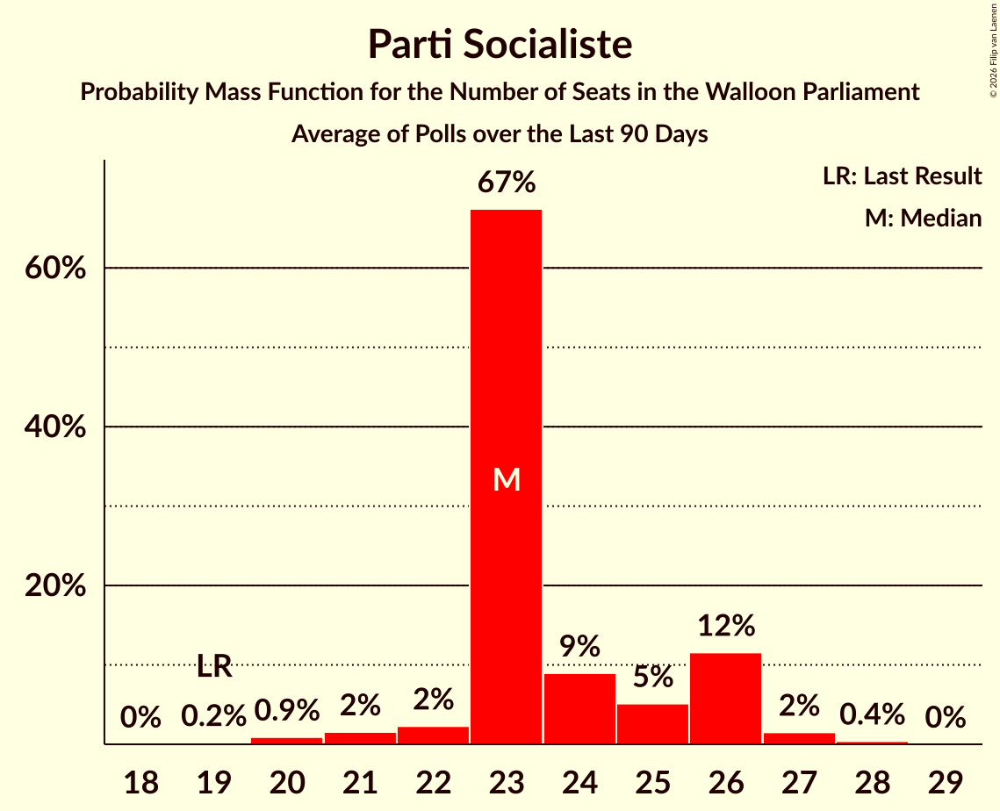

| Number of Seats | Probability | Accumulated | Special Marks |
|:---------------:|:-----------:|:-----------:|:-------------:|
| 19 | 0.2% | 100% | Last Result |
| 20 | 0.9% | 99.8% |  |
| 21 | 2% | 98.9% |  |
| 22 | 2% | 97% |  |
| 23 | 67% | 95% | Median |
| 24 | 9% | 28% |  |
| 25 | 5% | 19% |  |
| 26 | 12% | 13% |  |
| 27 | 2% | 2% |  |
| 28 | 0.4% | 0.4% |  |
| 29 | 0% | 0% |  |

### Les Engagés

*For a full overview of the results for this party, see the [Les Engagés](party-lesengagés.html) page.*

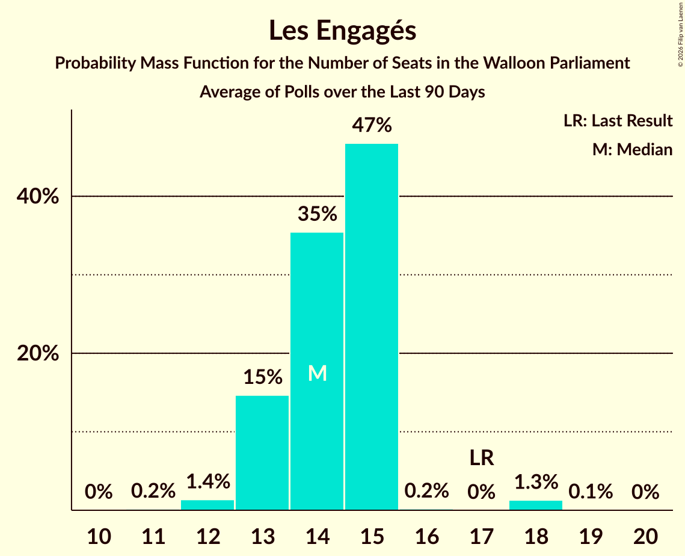

| Number of Seats | Probability | Accumulated | Special Marks |
|:---------------:|:-----------:|:-----------:|:-------------:|
| 11 | 0.2% | 100% |  |
| 12 | 1.4% | 99.8% |  |
| 13 | 15% | 98% |  |
| 14 | 35% | 84% | Median |
| 15 | 47% | 48% |  |
| 16 | 0.2% | 2% |  |
| 17 | 0% | 1.4% | Last Result |
| 18 | 1.3% | 1.4% |  |
| 19 | 0.1% | 0.1% |  |
| 20 | 0% | 0% |  |

### Parti du Travail de Belgique

*For a full overview of the results for this party, see the [Parti du Travail de Belgique](party-partidutravaildebelgique.html) page.*

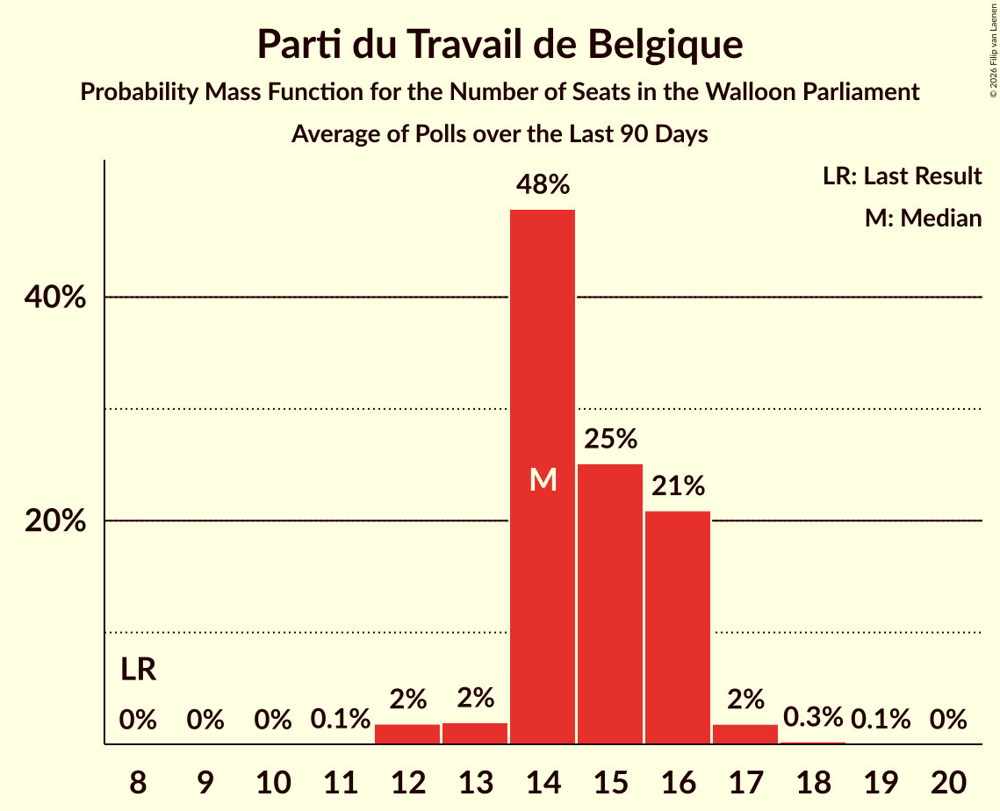

| Number of Seats | Probability | Accumulated | Special Marks |
|:---------------:|:-----------:|:-----------:|:-------------:|
| 8 | 0% | 100% | Last Result |
| 9 | 0% | 100% |  |
| 10 | 0% | 100% |  |
| 11 | 0% | 100% |  |
| 12 | 0.8% | 100% |  |
| 13 | 4% | 99.2% |  |
| 14 | 32% | 95% |  |
| 15 | 25% | 63% | Median |
| 16 | 37% | 38% |  |
| 17 | 0.3% | 0.7% |  |
| 18 | 0.2% | 0.4% |  |
| 19 | 0.2% | 0.3% |  |
| 20 | 0% | 0% |  |

### Ecolo

*For a full overview of the results for this party, see the [Ecolo](party-ecolo.html) page.*

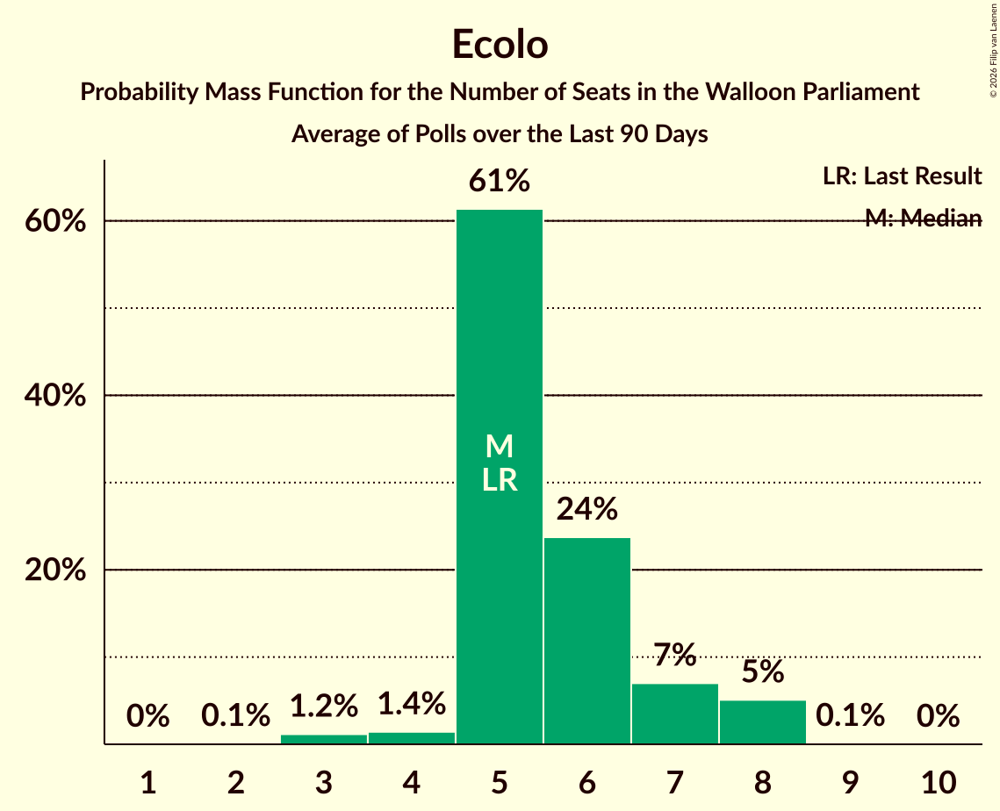

| Number of Seats | Probability | Accumulated | Special Marks |
|:---------------:|:-----------:|:-----------:|:-------------:|
| 2 | 0.1% | 100% |  |
| 3 | 0.2% | 99.9% |  |
| 4 | 1.0% | 99.7% |  |
| 5 | 77% | 98.7% | Last Result, Median |
| 6 | 15% | 21% |  |
| 7 | 4% | 6% |  |
| 8 | 2% | 2% |  |
| 9 | 0% | 0.1% |  |
| 10 | 0% | 0% |  |

### Chez Nous

*For a full overview of the results for this party, see the [Chez Nous](party-cheznous.html) page.*

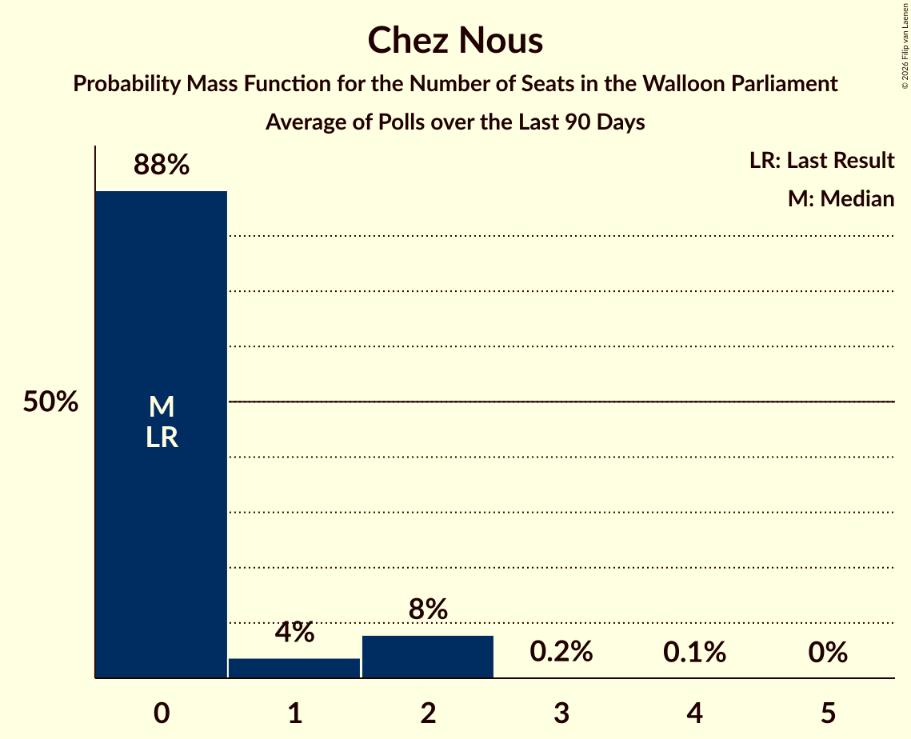

| Number of Seats | Probability | Accumulated | Special Marks |
|:---------------:|:-----------:|:-----------:|:-------------:|
| 0 | 88% | 100% | Last Result, Median |
| 1 | 4% | 12% |  |
| 2 | 8% | 8% |  |
| 3 | 0.2% | 0.2% |  |
| 4 | 0.1% | 0.1% |  |
| 5 | 0% | 0% |  |

### DéFI

*For a full overview of the results for this party, see the [DéFI](party-défi.html) page.*

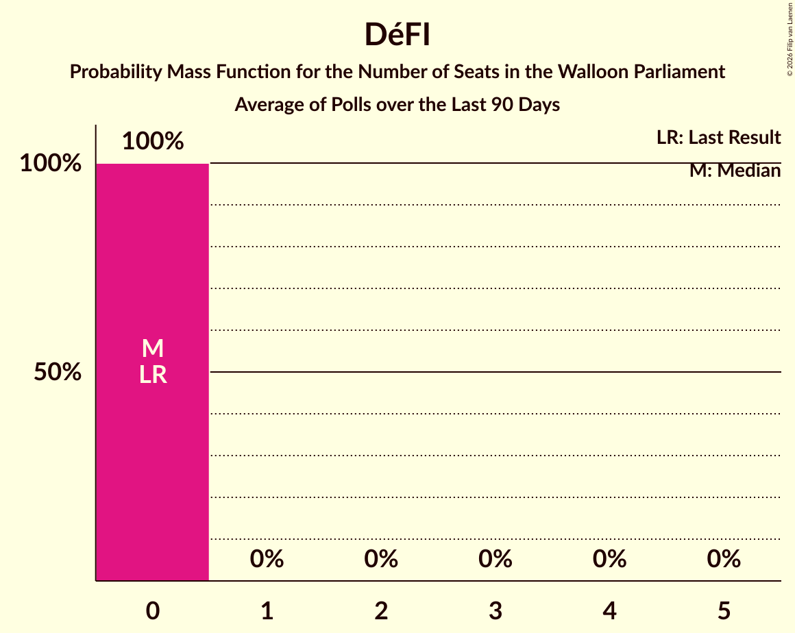

| Number of Seats | Probability | Accumulated | Special Marks |
|:---------------:|:-----------:|:-----------:|:-------------:|
| 0 | 100% | 100% | Last Result, Median |

### Collectif Citoyen

*For a full overview of the results for this party, see the [Collectif Citoyen](party-collectifcitoyen.html) page.*

### Reprise en Main Citoyenne

*For a full overview of the results for this party, see the [Reprise en Main Citoyenne](party-repriseenmaincitoyenne.html) page.*

## Coalitions

### Confidence Intervals

| Coalition | Last Result | Median | Majority? | 80% Confidence Interval | 90% Confidence Interval | 95% Confidence Interval | 99% Confidence Interval |
|:---------:|:-----------:|:------:|:---------:|:-----------------------:|:-----------------------:|:-----------------------:|:-----------------------:|
| Parti Socialiste – Les Engagés – Parti du Travail de Belgique | 44 | 53 | 100% | 52–54 | 51–55 | 51–55 | 49–56 |
| Mouvement Réformateur – Parti Socialiste – Ecolo | 50 | 45 | 100% | 45–47 | 44–48 | 43–48 | 43–48 |
| Parti Socialiste – Parti du Travail de Belgique – Ecolo | 32 | 44 | 100% | 43–46 | 42–46 | 42–47 | 41–48 |
| Parti Socialiste – Les Engagés – Ecolo | 41 | 43 | 100% | 42–45 | 42–46 | 41–46 | 40–48 |
| Mouvement Réformateur – Parti Socialiste | 45 | 40 | 97% | 39–42 | 38–42 | 37–43 | 37–43 |
| Parti Socialiste – Parti du Travail de Belgique | 27 | 38 | 80% | 37–40 | 37–41 | 36–42 | 35–42 |
| Parti Socialiste – Les Engagés | 36 | 38 | 61% | 37–39 | 36–41 | 35–41 | 34–41 |
| Mouvement Réformateur – Les Engagés – Ecolo | 48 | 36 | 17% | 35–38 | 34–38 | 33–38 | 33–39 |
| Mouvement Réformateur – Les Engagés | 43 | 31 | 0% | 29–32 | 28–33 | 28–33 | 27–34 |
| Parti Socialiste – Ecolo | 24 | 28 | 0% | 28–31 | 28–32 | 27–32 | 26–33 |
| Mouvement Réformateur – Ecolo | 31 | 22 | 0% | 20–23 | 20–23 | 20–24 | 19–26 |
| Parti du Travail de Belgique – Ecolo | 13 | 20 | 0% | 19–21 | 19–22 | 18–23 | 17–24 |

### Parti Socialiste – Les Engagés – Parti du Travail de Belgique

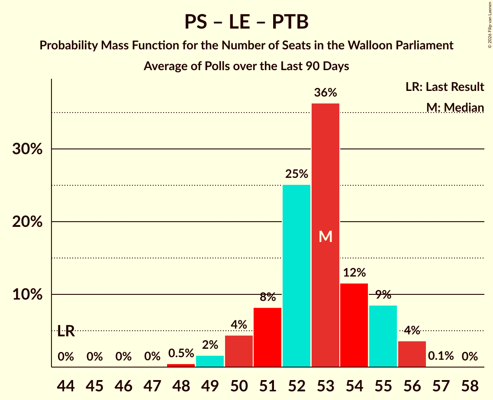

| Number of Seats | Probability | Accumulated | Special Marks |
|:---------------:|:-----------:|:-----------:|:-------------:|
| 44 | 0% | 100% | Last Result |
| 45 | 0% | 100% |  |
| 46 | 0% | 100% |  |
| 47 | 0% | 100% |  |
| 48 | 0.3% | 100% |  |
| 49 | 1.1% | 99.7% |  |
| 50 | 0.8% | 98.6% |  |
| 51 | 5% | 98% |  |
| 52 | 18% | 92% | Median |
| 53 | 62% | 74% |  |
| 54 | 4% | 12% |  |
| 55 | 7% | 8% |  |
| 56 | 1.2% | 1.3% |  |
| 57 | 0.1% | 0.1% |  |
| 58 | 0% | 0% |  |

### Mouvement Réformateur – Parti Socialiste – Ecolo

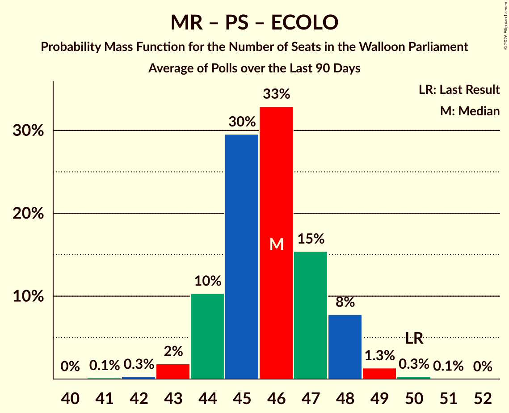

| Number of Seats | Probability | Accumulated | Special Marks |
|:---------------:|:-----------:|:-----------:|:-------------:|
| 42 | 0.2% | 100% |  |
| 43 | 2% | 99.8% |  |
| 44 | 5% | 97% |  |
| 45 | 54% | 93% | Median |
| 46 | 25% | 38% |  |
| 47 | 6% | 13% |  |
| 48 | 7% | 7% |  |
| 49 | 0.1% | 0.2% |  |
| 50 | 0.1% | 0.1% | Last Result |
| 51 | 0% | 0.1% |  |
| 52 | 0% | 0% |  |

### Parti Socialiste – Parti du Travail de Belgique – Ecolo

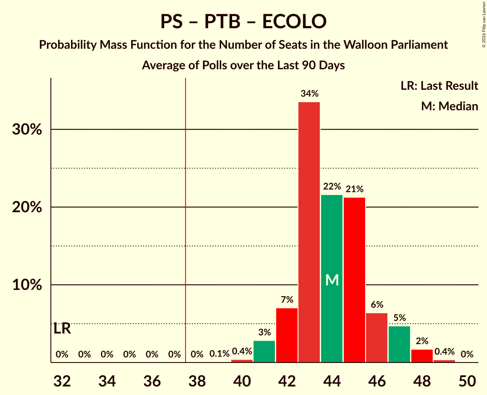

| Number of Seats | Probability | Accumulated | Special Marks |
|:---------------:|:-----------:|:-----------:|:-------------:|
| 32 | 0% | 100% | Last Result |
| 33 | 0% | 100% |  |
| 34 | 0% | 100% |  |
| 35 | 0% | 100% |  |
| 36 | 0% | 100% |  |
| 37 | 0% | 100% |  |
| 38 | 0% | 100% | Majority |
| 39 | 0.1% | 100% |  |
| 40 | 0.3% | 99.9% |  |
| 41 | 0.6% | 99.6% |  |
| 42 | 6% | 99.0% |  |
| 43 | 43% | 93% | Median |
| 44 | 32% | 50% |  |
| 45 | 7% | 18% |  |
| 46 | 7% | 11% |  |
| 47 | 4% | 5% |  |
| 48 | 0.4% | 0.7% |  |
| 49 | 0.2% | 0.2% |  |
| 50 | 0% | 0% |  |

### Parti Socialiste – Les Engagés – Ecolo

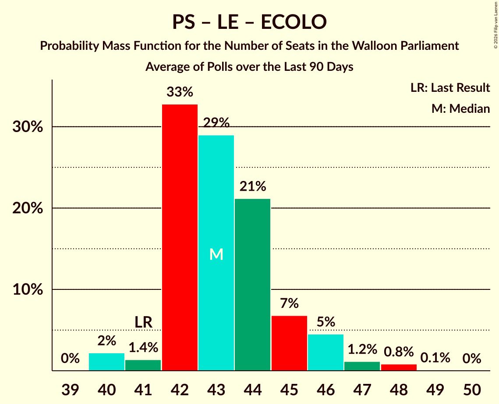

| Number of Seats | Probability | Accumulated | Special Marks |
|:---------------:|:-----------:|:-----------:|:-------------:|
| 39 | 0% | 100% |  |
| 40 | 2% | 99.9% |  |
| 41 | 1.4% | 98% | Last Result |
| 42 | 33% | 96% | Median |
| 43 | 29% | 64% |  |
| 44 | 21% | 35% |  |
| 45 | 7% | 13% |  |
| 46 | 5% | 7% |  |
| 47 | 1.2% | 2% |  |
| 48 | 0.8% | 0.9% |  |
| 49 | 0.1% | 0.1% |  |
| 50 | 0% | 0% |  |

### Mouvement Réformateur – Parti Socialiste

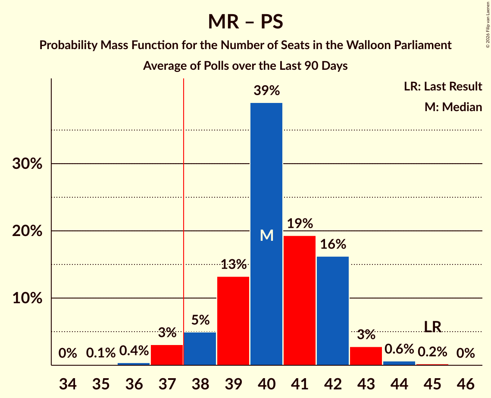

| Number of Seats | Probability | Accumulated | Special Marks |
|:---------------:|:-----------:|:-----------:|:-------------:|
| 35 | 0.1% | 100% |  |
| 36 | 0.2% | 99.9% |  |
| 37 | 3% | 99.7% |  |
| 38 | 4% | 97% | Majority |
| 39 | 3% | 93% |  |
| 40 | 63% | 90% | Median |
| 41 | 15% | 27% |  |
| 42 | 9% | 12% |  |
| 43 | 3% | 3% |  |
| 44 | 0.2% | 0.2% |  |
| 45 | 0.1% | 0.1% | Last Result |
| 46 | 0% | 0% |  |

### Parti Socialiste – Parti du Travail de Belgique

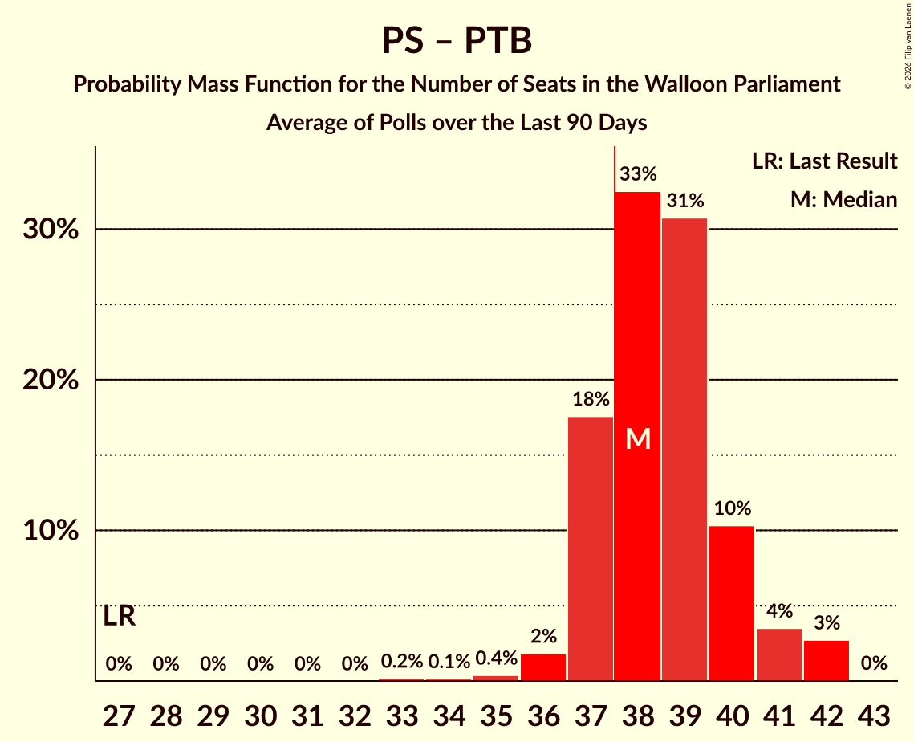

| Number of Seats | Probability | Accumulated | Special Marks |
|:---------------:|:-----------:|:-----------:|:-------------:|
| 27 | 0% | 100% | Last Result |
| 28 | 0% | 100% |  |
| 29 | 0% | 100% |  |
| 30 | 0% | 100% |  |
| 31 | 0% | 100% |  |
| 32 | 0% | 100% |  |
| 33 | 0.2% | 100% |  |
| 34 | 0.1% | 99.8% |  |
| 35 | 0.4% | 99.7% |  |
| 36 | 2% | 99.3% |  |
| 37 | 18% | 97% |  |
| 38 | 33% | 80% | Median, Majority |
| 39 | 31% | 47% |  |
| 40 | 10% | 17% |  |
| 41 | 4% | 6% |  |
| 42 | 3% | 3% |  |
| 43 | 0% | 0% |  |

### Parti Socialiste – Les Engagés

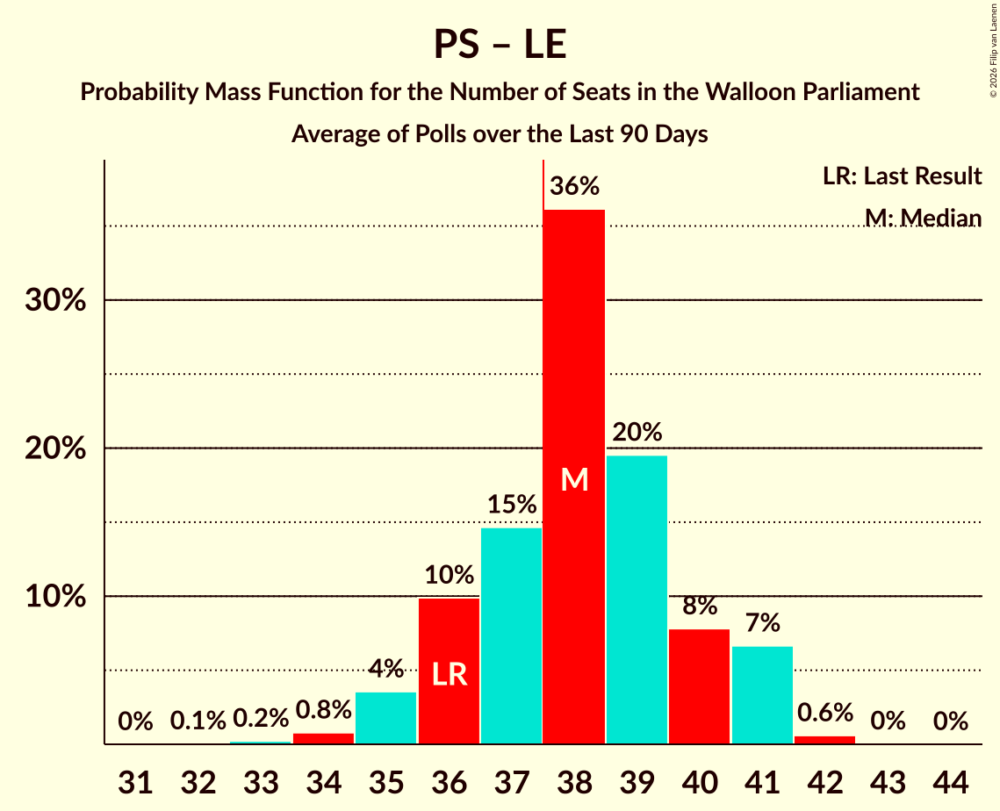

| Number of Seats | Probability | Accumulated | Special Marks |
|:---------------:|:-----------:|:-----------:|:-------------:|
| 33 | 0.2% | 100% |  |
| 34 | 0.3% | 99.7% |  |
| 35 | 3% | 99.5% |  |
| 36 | 3% | 96% | Last Result |
| 37 | 33% | 93% | Median |
| 38 | 37% | 61% | Majority |
| 39 | 16% | 24% |  |
| 40 | 3% | 8% |  |
| 41 | 5% | 6% |  |
| 42 | 0.3% | 0.3% |  |
| 43 | 0% | 0% |  |

### Mouvement Réformateur – Les Engagés – Ecolo

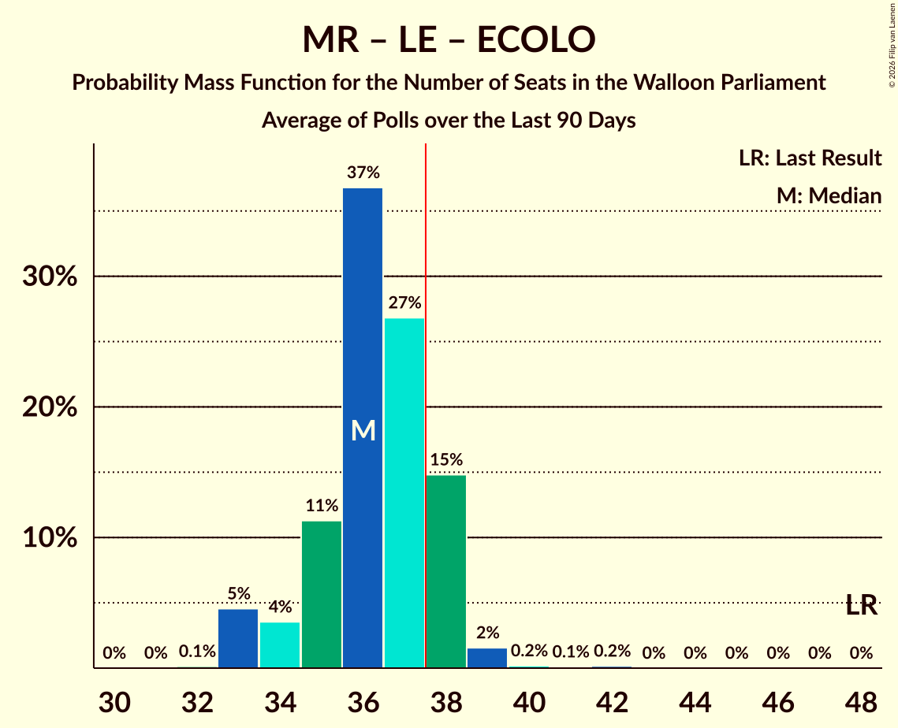

| Number of Seats | Probability | Accumulated | Special Marks |
|:---------------:|:-----------:|:-----------:|:-------------:|
| 32 | 0.1% | 100% |  |
| 33 | 5% | 99.8% |  |
| 34 | 4% | 95% |  |
| 35 | 11% | 92% |  |
| 36 | 37% | 80% | Median |
| 37 | 27% | 44% |  |
| 38 | 15% | 17% | Majority |
| 39 | 2% | 2% |  |
| 40 | 0.2% | 0.5% |  |
| 41 | 0.1% | 0.3% |  |
| 42 | 0.2% | 0.2% |  |
| 43 | 0% | 0% |  |
| 44 | 0% | 0% |  |
| 45 | 0% | 0% |  |
| 46 | 0% | 0% |  |
| 47 | 0% | 0% |  |
| 48 | 0% | 0% | Last Result |

### Mouvement Réformateur – Les Engagés

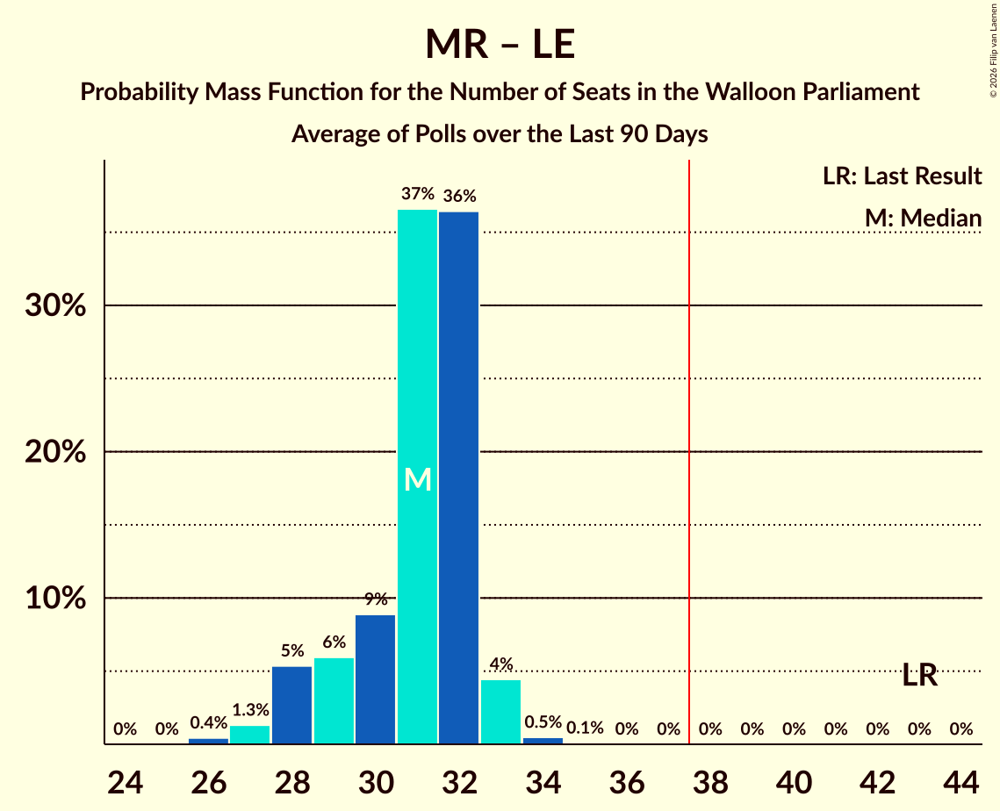

| Number of Seats | Probability | Accumulated | Special Marks |
|:---------------:|:-----------:|:-----------:|:-------------:|
| 26 | 0.4% | 100% |  |
| 27 | 1.3% | 99.6% |  |
| 28 | 5% | 98% |  |
| 29 | 6% | 93% |  |
| 30 | 9% | 87% |  |
| 31 | 37% | 78% | Median |
| 32 | 36% | 41% |  |
| 33 | 4% | 5% |  |
| 34 | 0.5% | 0.6% |  |
| 35 | 0.1% | 0.1% |  |
| 36 | 0% | 0% |  |
| 37 | 0% | 0% |  |
| 38 | 0% | 0% | Majority |
| 39 | 0% | 0% |  |
| 40 | 0% | 0% |  |
| 41 | 0% | 0% |  |
| 42 | 0% | 0% |  |
| 43 | 0% | 0% | Last Result |

### Parti Socialiste – Ecolo

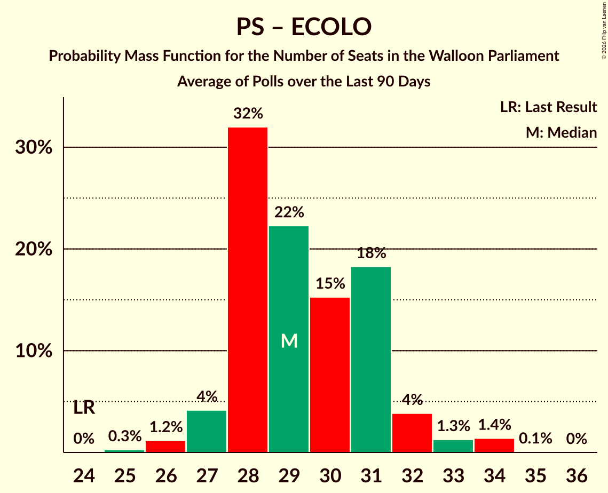

| Number of Seats | Probability | Accumulated | Special Marks |
|:---------------:|:-----------:|:-----------:|:-------------:|
| 24 | 0% | 100% | Last Result |
| 25 | 0.2% | 100% |  |
| 26 | 0.3% | 99.8% |  |
| 27 | 3% | 99.5% |  |
| 28 | 58% | 97% | Median |
| 29 | 17% | 39% |  |
| 30 | 7% | 22% |  |
| 31 | 7% | 15% |  |
| 32 | 6% | 8% |  |
| 33 | 1.2% | 2% |  |
| 34 | 0.3% | 0.4% |  |
| 35 | 0% | 0.1% |  |
| 36 | 0% | 0% |  |

### Mouvement Réformateur – Ecolo

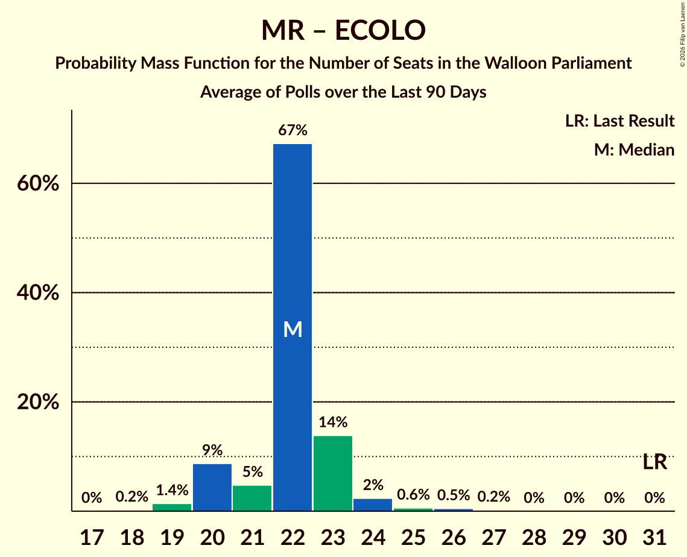

| Number of Seats | Probability | Accumulated | Special Marks |
|:---------------:|:-----------:|:-----------:|:-------------:|
| 18 | 0.2% | 100% |  |
| 19 | 1.4% | 99.8% |  |
| 20 | 9% | 98% |  |
| 21 | 5% | 90% |  |
| 22 | 67% | 85% | Median |
| 23 | 14% | 18% |  |
| 24 | 2% | 4% |  |
| 25 | 0.6% | 1.3% |  |
| 26 | 0.5% | 0.7% |  |
| 27 | 0.2% | 0.2% |  |
| 28 | 0% | 0% |  |
| 29 | 0% | 0% |  |
| 30 | 0% | 0% |  |
| 31 | 0% | 0% | Last Result |

### Parti du Travail de Belgique – Ecolo

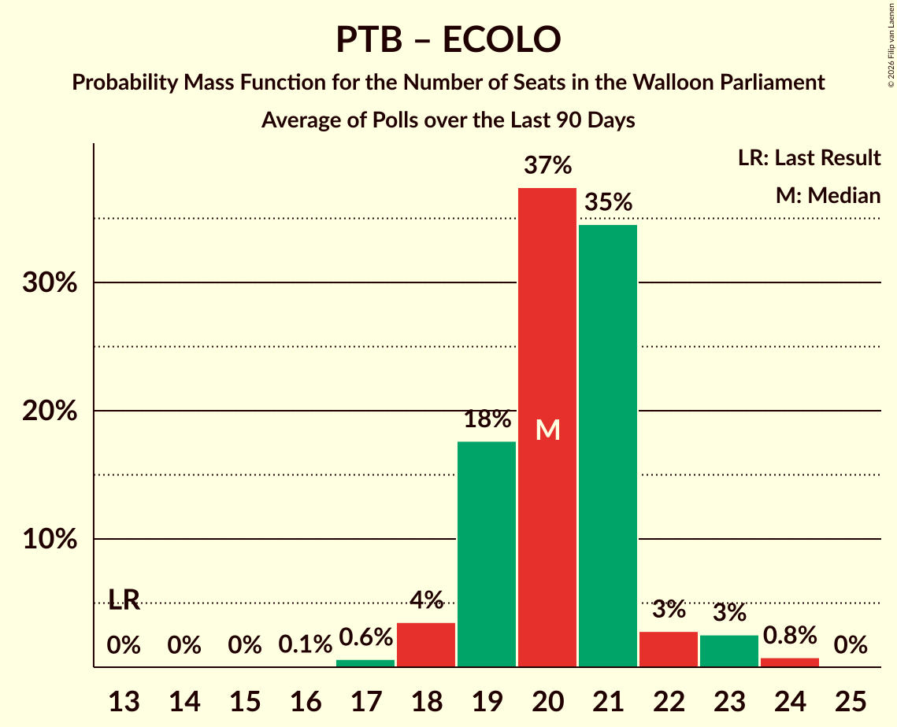

| Number of Seats | Probability | Accumulated | Special Marks |
|:---------------:|:-----------:|:-----------:|:-------------:|
| 13 | 0% | 100% | Last Result |
| 14 | 0% | 100% |  |
| 15 | 0% | 100% |  |
| 16 | 0.1% | 100% |  |
| 17 | 0.6% | 99.9% |  |
| 18 | 4% | 99.3% |  |
| 19 | 18% | 96% |  |
| 20 | 37% | 78% | Median |
| 21 | 35% | 41% |  |
| 22 | 3% | 6% |  |
| 23 | 3% | 3% |  |
| 24 | 0.8% | 0.8% |  |
| 25 | 0% | 0% |  |

## Technical Information

+ **Number of polls included in this average:** 1
+ **Lowest number of simulations done in a poll included in this average:** 131,072
+ **Total number of simulations done in the polls included in this average:** 131,072
+ **Error estimate:** 1.25%
