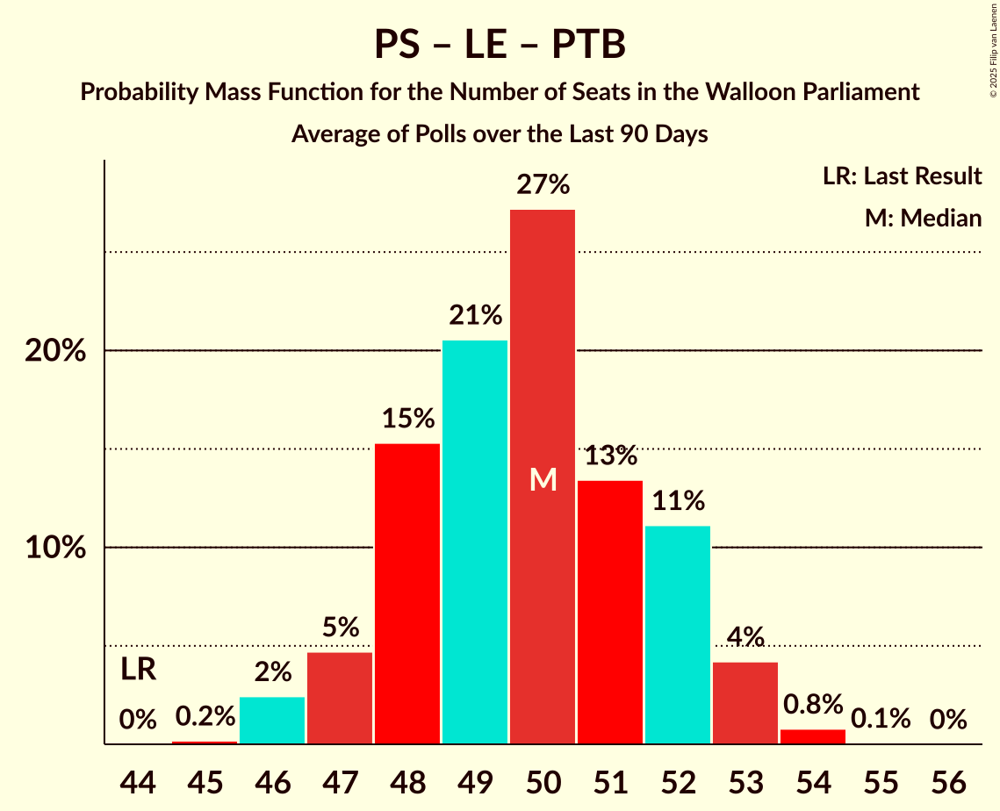
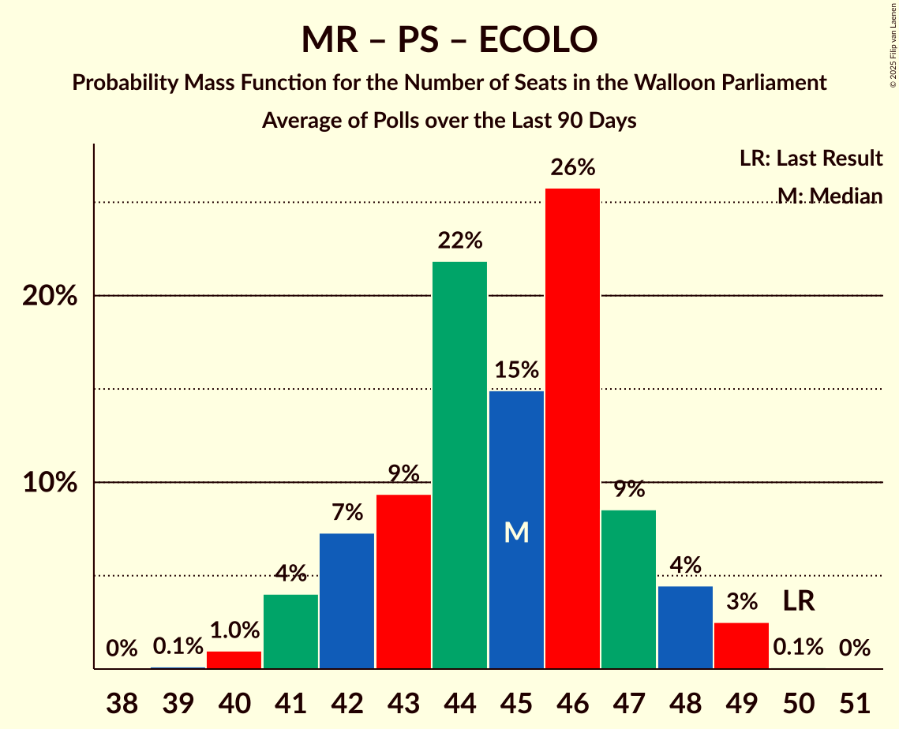

# Poll Average

<a href="#voting-intentions">Voting Intentions</a> | <a href="#seats">Seats</a> | <a href="#coalitions">Coalitions</a> | <a href="#technical-information">Technical Information</a>

## Summary

The table below lists the polls on which the average is based. They are the most recent polls (less than 90 days old) registered and analyzed so far.

| Period     | Polling firm/Commissioner(s) | MR | PS | LE | PTB | ECOLO | CN | DÉFI | CC | RMC |
|:----------:|:----------------------------:|:--:|:--:|:--:|:--:|:--:|:--:|:--:|:--:|:--:|
| 9 June 2024 | General Election | 29.6%   26 | 23.2%   19 | 20.6%   17 | 12.1%   8 | 7.0%   5 | 2.8%   0 | 2.7%   0 | 1.6%   0 | 0.3%   0 |
| N/A | Poll Average | 22–26%   18–22 | 23–28%   18–23 | 17–22%   14–19 | 15–19%   11–15 | 6–10%   1–7 | 2–4%   0–2 | 2–4%   0 | N/A   N/A | N/A   N/A |
| [27 May–3 June 2025](2025-06-03-Ipsos.html) | Ipsos   Het Laatste Nieuws, Le Soir, RTL TVi and VTM | 21–27%   17–22 | 23–28%   18–23 | 17–22%   14–19 | 15–19%   11–15 | 7–11%   4–8 | 2–4%   0–2 | 2–4%   0 | N/A   N/A | N/A   N/A |
| [3–24 March 2025](2025-03-24-BpactandUniversiteitAntwerpenULB.html) | Bpact and Universiteit Antwerpen & ULB   De Standaard, RTBF and VRT | 22–26%   19–22 | 22–26%   18–23 | 18–22%   15–19 | 15–18%   12–15 | 6–8%   1–5 | 2–4%   0–2 | 2–4%   0 | N/A   N/A | N/A   N/A |
| 9 June 2024 | General Election | 29.6%   26 | 23.2%   19 | 20.6%   17 | 12.1%   8 | 7.0%   5 | 2.8%   0 | 2.7%   0 | 1.6%   0 | 0.3%   0 |

Only polls for which at least the sample size has been published are included in the table above.

**Legend:**
+ **Top half of each row:** Voting intentions (95% confidence interval)
+ **Bottom half of each row:** Seat projections for the Walloon Parliament (95% confidence interval)
+ **MR:** Mouvement Réformateur
+ **PS:** Parti Socialiste
+ **LE:** Les Engagés
+ **PTB:** Parti du Travail de Belgique
+ **ECOLO:** Ecolo
+ **CN:** Chez Nous
+ **DÉFI:** DéFI
+ **CC:** Collectif Citoyen
+ **RMC:** Reprise en Main Citoyenne
+ **N/A (single party):** Party not included the published results
+ **N/A (entire row):** Calculation for this opinion poll not started yet

## Voting Intentions

### Confidence Intervals

| Party | Last Result | Median | 80% Confidence Interval | 90% Confidence Interval | 95% Confidence Interval | 99% Confidence Interval |
|:-----:|:-----------:|:------:|:-----------------------:|:-----------------------:|:-----------------------:|:-----------------------:|
| <a href="#mouvement-réformateur">Mouvement Réformateur</a> | 29.6% | 24.0% | 22.5–25.5% |22.1–26.0% | 21.7–26.4% | 21.0–27.3% |
| <a href="#parti-socialiste">Parti Socialiste</a> | 23.2% | 24.8% | 23.3–26.7% |22.9–27.3% | 22.6–27.8% | 22.0–28.8% |
| <a href="#les-engagés">Les Engagés</a> | 20.6% | 19.7% | 18.1–21.1% |17.7–21.5% | 17.2–21.8% | 16.5–22.5% |
| <a href="#parti-du-travail-de-belgique">Parti du Travail de Belgique</a> | 12.1% | 16.7% | 15.5–18.1% |15.1–18.5% | 14.8–18.9% | 14.2–19.7% |
| <a href="#ecolo">Ecolo</a> | 7.0% | 7.5% | 6.2–9.4% |6.0–9.8% | 5.8–10.2% | 5.4–10.9% |
| <a href="#chez-nous">Chez Nous</a> | 2.8% | 3.1% | 2.4–3.7% |2.2–3.9% | 2.1–4.0% | 1.8–4.4% |
| <a href="#défi">DéFI</a> | 2.7% | 2.9% | 2.3–3.5% |2.1–3.7% | 2.0–3.9% | 1.7–4.2% |
| <a href="#collectif-citoyen">Collectif Citoyen</a> | 1.6% | N/A | N/A |N/A | N/A | N/A |
| <a href="#reprise-en-main-citoyenne">Reprise en Main Citoyenne</a> | 0.3% | N/A | N/A |N/A | N/A | N/A |

### Mouvement Réformateur

*For a full overview of the results for this party, see the [Mouvement Réformateur](party-mouvementréformateur.html) page.*

| Voting Intentions | Probability | Accumulated | Special Marks |
|:-----------------:|:-----------:|:-----------:|:-------------:|
| 18.5–19.5% | 0% | 100% |  |
| 19.5–20.5% | 0.2% | 100% |  |
| 20.5–21.5% | 2% | 99.8% |  |
| 21.5–22.5% | 8% | 98% |  |
| 22.5–23.5% | 24% | 90% |  |
| 23.5–24.5% | 34% | 65% | Median |
| 24.5–25.5% | 22% | 31% |  |
| 25.5–26.5% | 7% | 9% |  |
| 26.5–27.5% | 2% | 2% |  |
| 27.5–28.5% | 0.3% | 0.3% |  |
| 28.5–29.5% | 0% | 0% |  |
| 29.5–30.5% | 0% | 0% | Last Result |

### Parti Socialiste

*For a full overview of the results for this party, see the [Parti Socialiste](party-partisocialiste.html) page.*

| Voting Intentions | Probability | Accumulated | Special Marks |
|:-----------------:|:-----------:|:-----------:|:-------------:|
| 19.5–20.5% | 0% | 100% |  |
| 20.5–21.5% | 0.1% | 100% |  |
| 21.5–22.5% | 2% | 99.9% |  |
| 22.5–23.5% | 12% | 98% | Last Result |
| 23.5–24.5% | 28% | 86% |  |
| 24.5–25.5% | 28% | 58% | Median |
| 25.5–26.5% | 18% | 30% |  |
| 26.5–27.5% | 8% | 12% |  |
| 27.5–28.5% | 3% | 4% |  |
| 28.5–29.5% | 0.7% | 0.8% |  |
| 29.5–30.5% | 0.1% | 0.1% |  |
| 30.5–31.5% | 0% | 0% |  |

### Les Engagés

*For a full overview of the results for this party, see the [Les Engagés](party-lesengagés.html) page.*

| Voting Intentions | Probability | Accumulated | Special Marks |
|:-----------------:|:-----------:|:-----------:|:-------------:|
| 14.5–15.5% | 0% | 100% |  |
| 15.5–16.5% | 0.6% | 100% |  |
| 16.5–17.5% | 4% | 99.4% |  |
| 17.5–18.5% | 12% | 96% |  |
| 18.5–19.5% | 28% | 83% |  |
| 19.5–20.5% | 33% | 55% | Median |
| 20.5–21.5% | 18% | 22% | Last Result |
| 21.5–22.5% | 4% | 4% |  |
| 22.5–23.5% | 0.4% | 0.4% |  |
| 23.5–24.5% | 0% | 0% |  |

### Parti du Travail de Belgique

*For a full overview of the results for this party, see the [Parti du Travail de Belgique](party-partidutravaildebelgique.html) page.*

| Voting Intentions | Probability | Accumulated | Special Marks |
|:-----------------:|:-----------:|:-----------:|:-------------:|
| 11.5–12.5% | 0% | 100% | Last Result |
| 12.5–13.5% | 0.1% | 100% |  |
| 13.5–14.5% | 1.2% | 99.9% |  |
| 14.5–15.5% | 9% | 98.7% |  |
| 15.5–16.5% | 31% | 89% |  |
| 16.5–17.5% | 36% | 58% | Median |
| 17.5–18.5% | 17% | 22% |  |
| 18.5–19.5% | 4% | 5% |  |
| 19.5–20.5% | 0.6% | 0.7% |  |
| 20.5–21.5% | 0.1% | 0.1% |  |
| 21.5–22.5% | 0% | 0% |  |

### Ecolo

*For a full overview of the results for this party, see the [Ecolo](party-ecolo.html) page.*

| Voting Intentions | Probability | Accumulated | Special Marks |
|:-----------------:|:-----------:|:-----------:|:-------------:|
| 3.5–4.5% | 0% | 100% |  |
| 4.5–5.5% | 0.8% | 100% |  |
| 5.5–6.5% | 20% | 99.2% |  |
| 6.5–7.5% | 30% | 79% | Last Result, Median |
| 7.5–8.5% | 21% | 48% |  |
| 8.5–9.5% | 19% | 27% |  |
| 9.5–10.5% | 7% | 8% |  |
| 10.5–11.5% | 1.1% | 1.1% |  |
| 11.5–12.5% | 0.1% | 0.1% |  |
| 12.5–13.5% | 0% | 0% |  |

### Chez Nous

*For a full overview of the results for this party, see the [Chez Nous](party-cheznous.html) page.*

| Voting Intentions | Probability | Accumulated | Special Marks |
|:-----------------:|:-----------:|:-----------:|:-------------:|
| 0.5–1.5% | 0.1% | 100% |  |
| 1.5–2.5% | 15% | 99.9% |  |
| 2.5–3.5% | 70% | 85% | Last Result, Median |
| 3.5–4.5% | 15% | 15% |  |
| 4.5–5.5% | 0.2% | 0.2% |  |
| 5.5–6.5% | 0% | 0% |  |

### DéFI

*For a full overview of the results for this party, see the [DéFI](party-défi.html) page.*

| Voting Intentions | Probability | Accumulated | Special Marks |
|:-----------------:|:-----------:|:-----------:|:-------------:|
| 0.5–1.5% | 0.1% | 100% |  |
| 1.5–2.5% | 21% | 99.9% |  |
| 2.5–3.5% | 70% | 79% | Last Result, Median |
| 3.5–4.5% | 9% | 9% |  |
| 4.5–5.5% | 0.1% | 0.1% |  |
| 5.5–6.5% | 0% | 0% |  |

## Seats

### Confidence Intervals

| Party | Last Result | Median | 80% Confidence Interval | 90% Confidence Interval | 95% Confidence Interval | 99% Confidence Interval |
|:-----:|:-----------:|:------:|:-----------------------:|:-----------------------:|:-----------------------:|:-----------------------:|
| <a href="#mouvement-réformateur">Mouvement Réformateur</a> | 26 | 20 | 19–21 |18–22 | 18–22 | 17–23 |
| <a href="#parti-socialiste">Parti Socialiste</a> | 19 | 20 | 19–23 |18–23 | 18–23 | 17–24 |
| <a href="#les-engagés">Les Engagés</a> | 17 | 15 | 15–18 |15–19 | 14–19 | 13–20 |
| <a href="#parti-du-travail-de-belgique">Parti du Travail de Belgique</a> | 8 | 14 | 12–14 |11–15 | 11–15 | 11–16 |
| <a href="#ecolo">Ecolo</a> | 5 | 5 | 2–7 |2–7 | 1–7 | 1–8 |
| <a href="#chez-nous">Chez Nous</a> | 0 | 0 | 0–2 |0–2 | 0–2 | 0–3 |
| <a href="#défi">DéFI</a> | 0 | 0 | 0 |0 | 0 | 0 |
| <a href="#collectif-citoyen">Collectif Citoyen</a> | 0 | N/A | N/A |N/A | N/A | N/A |
| <a href="#reprise-en-main-citoyenne">Reprise en Main Citoyenne</a> | 0 | N/A | N/A |N/A | N/A | N/A |

### Mouvement Réformateur

*For a full overview of the results for this party, see the [Mouvement Réformateur](party-mouvementréformateur.html) page.*

| Number of Seats | Probability | Accumulated | Special Marks |
|:---------------:|:-----------:|:-----------:|:-------------:|
| 17 | 2% | 100% |  |
| 18 | 5% | 98% |  |
| 19 | 14% | 93% |  |
| 20 | 47% | 79% | Median |
| 21 | 25% | 32% |  |
| 22 | 6% | 8% |  |
| 23 | 2% | 2% |  |
| 24 | 0.3% | 0.4% |  |
| 25 | 0% | 0% |  |
| 26 | 0% | 0% | Last Result |

### Parti Socialiste

*For a full overview of the results for this party, see the [Parti Socialiste](party-partisocialiste.html) page.*

| Number of Seats | Probability | Accumulated | Special Marks |
|:---------------:|:-----------:|:-----------:|:-------------:|
| 17 | 0.6% | 100% |  |
| 18 | 6% | 99.4% |  |
| 19 | 40% | 94% | Last Result |
| 20 | 19% | 54% | Median |
| 21 | 11% | 34% |  |
| 22 | 13% | 23% |  |
| 23 | 10% | 10% |  |
| 24 | 0.5% | 0.7% |  |
| 25 | 0.2% | 0.2% |  |
| 26 | 0% | 0% |  |

### Les Engagés

*For a full overview of the results for this party, see the [Les Engagés](party-lesengagés.html) page.*

| Number of Seats | Probability | Accumulated | Special Marks |
|:---------------:|:-----------:|:-----------:|:-------------:|
| 12 | 0.2% | 100% |  |
| 13 | 0.6% | 99.8% |  |
| 14 | 3% | 99.2% |  |
| 15 | 49% | 97% | Median |
| 16 | 14% | 48% |  |
| 17 | 19% | 34% | Last Result |
| 18 | 7% | 15% |  |
| 19 | 7% | 8% |  |
| 20 | 1.1% | 1.1% |  |
| 21 | 0% | 0% |  |

### Parti du Travail de Belgique

*For a full overview of the results for this party, see the [Parti du Travail de Belgique](party-partidutravaildebelgique.html) page.*

| Number of Seats | Probability | Accumulated | Special Marks |
|:---------------:|:-----------:|:-----------:|:-------------:|
| 8 | 0% | 100% | Last Result |
| 9 | 0% | 100% |  |
| 10 | 0% | 100% |  |
| 11 | 5% | 99.9% |  |
| 12 | 10% | 95% |  |
| 13 | 15% | 85% |  |
| 14 | 62% | 70% | Median |
| 15 | 7% | 8% |  |
| 16 | 0.7% | 0.7% |  |
| 17 | 0% | 0% |  |

### Ecolo

*For a full overview of the results for this party, see the [Ecolo](party-ecolo.html) page.*

| Number of Seats | Probability | Accumulated | Special Marks |
|:---------------:|:-----------:|:-----------:|:-------------:|
| 1 | 3% | 100% |  |
| 2 | 11% | 97% |  |
| 3 | 12% | 86% |  |
| 4 | 10% | 74% |  |
| 5 | 44% | 64% | Last Result, Median |
| 6 | 7% | 20% |  |
| 7 | 11% | 13% |  |
| 8 | 2% | 2% |  |
| 9 | 0% | 0% |  |

### Chez Nous

*For a full overview of the results for this party, see the [Chez Nous](party-cheznous.html) page.*

| Number of Seats | Probability | Accumulated | Special Marks |
|:---------------:|:-----------:|:-----------:|:-------------:|
| 0 | 71% | 100% | Last Result, Median |
| 1 | 1.1% | 29% |  |
| 2 | 27% | 28% |  |
| 3 | 0.9% | 0.9% |  |
| 4 | 0% | 0% |  |

### DéFI

*For a full overview of the results for this party, see the [DéFI](party-défi.html) page.*

| Number of Seats | Probability | Accumulated | Special Marks |
|:---------------:|:-----------:|:-----------:|:-------------:|
| 0 | 100% | 100% | Last Result, Median |

### Collectif Citoyen

*For a full overview of the results for this party, see the [Collectif Citoyen](party-collectifcitoyen.html) page.*

### Reprise en Main Citoyenne

*For a full overview of the results for this party, see the [Reprise en Main Citoyenne](party-repriseenmaincitoyenne.html) page.*

## Coalitions

### Confidence Intervals

| Coalition | Last Result | Median | Majority? | 80% Confidence Interval | 90% Confidence Interval | 95% Confidence Interval | 99% Confidence Interval |
|:---------:|:-----------:|:------:|:---------:|:-----------------------:|:-----------------------:|:-----------------------:|:-----------------------:|
| Parti Socialiste – Les Engagés – Parti du Travail de Belgique | 44 | 50 | 100% | 48–52 | 47–53 | 46–53 | 46–54 |
| Mouvement Réformateur – Parti Socialiste – Ecolo | 50 | 45 | 100% | 42–47 | 41–48 | 41–49 | 40–49 |
| Parti Socialiste – Les Engagés – Ecolo | 41 | 41 | 98% | 39–43 | 38–43 | 38–44 | 37–45 |
| Mouvement Réformateur – Parti Socialiste | 45 | 40 | 97% | 39–43 | 38–43 | 37–44 | 36–44 |
| Mouvement Réformateur – Les Engagés – Ecolo | 48 | 41 | 98% | 39–42 | 38–43 | 38–43 | 36–45 |
| Parti Socialiste – Parti du Travail de Belgique – Ecolo | 32 | 38 | 68% | 36–41 | 35–41 | 34–42 | 33–43 |
| Mouvement Réformateur – Les Engagés | 43 | 36 | 19% | 34–38 | 33–39 | 33–40 | 32–41 |
| Parti Socialiste – Les Engagés | 36 | 36 | 23% | 34–38 | 34–39 | 33–39 | 32–40 |
| Parti Socialiste – Parti du Travail de Belgique | 27 | 33 | 0.7% | 32–36 | 31–37 | 31–37 | 30–38 |
| Parti Socialiste – Ecolo | 24 | 25 | 0% | 22–27 | 21–28 | 21–29 | 20–29 |
| Mouvement Réformateur – Ecolo | 31 | 25 | 0% | 22–27 | 22–27 | 22–28 | 21–29 |
| Parti du Travail de Belgique – Ecolo | 13 | 18 | 0% | 16–20 | 15–21 | 15–21 | 14–22 |

### Parti Socialiste – Les Engagés – Parti du Travail de Belgique

| Number of Seats | Probability | Accumulated | Special Marks |
|:---------------:|:-----------:|:-----------:|:-------------:|
| 44 | 0% | 100% | Last Result |
| 45 | 0.2% | 100% |  |
| 46 | 2% | 99.8% |  |
| 47 | 5% | 97% |  |
| 48 | 15% | 93% |  |
| 49 | 21% | 77% | Median |
| 50 | 27% | 57% |  |
| 51 | 13% | 30% |  |
| 52 | 11% | 16% |  |
| 53 | 4% | 5% |  |
| 54 | 0.8% | 0.9% |  |
| 55 | 0.1% | 0.1% |  |
| 56 | 0% | 0% |  |

### Mouvement Réformateur – Parti Socialiste – Ecolo

| Number of Seats | Probability | Accumulated | Special Marks |
|:---------------:|:-----------:|:-----------:|:-------------:|
| 39 | 0.1% | 100% |  |
| 40 | 1.0% | 99.9% |  |
| 41 | 4% | 98.9% |  |
| 42 | 7% | 95% |  |
| 43 | 9% | 88% |  |
| 44 | 22% | 78% |  |
| 45 | 15% | 56% | Median |
| 46 | 26% | 41% |  |
| 47 | 9% | 16% |  |
| 48 | 4% | 7% |  |
| 49 | 3% | 3% |  |
| 50 | 0.1% | 0.1% | Last Result |
| 51 | 0% | 0% |  |

### Parti Socialiste – Les Engagés – Ecolo

| Number of Seats | Probability | Accumulated | Special Marks |
|:---------------:|:-----------:|:-----------:|:-------------:|
| 36 | 0.2% | 100% |  |
| 37 | 2% | 99.8% |  |
| 38 | 5% | 98% | Majority |
| 39 | 11% | 94% |  |
| 40 | 30% | 82% | Median |
| 41 | 25% | 53% | Last Result |
| 42 | 15% | 27% |  |
| 43 | 8% | 13% |  |
| 44 | 4% | 5% |  |
| 45 | 0.7% | 0.9% |  |
| 46 | 0.1% | 0.2% |  |
| 47 | 0% | 0% |  |

### Mouvement Réformateur – Parti Socialiste

| Number of Seats | Probability | Accumulated | Special Marks |
|:---------------:|:-----------:|:-----------:|:-------------:|
| 36 | 0.6% | 100% |  |
| 37 | 2% | 99.3% |  |
| 38 | 6% | 97% | Majority |
| 39 | 27% | 91% |  |
| 40 | 23% | 64% | Median |
| 41 | 21% | 42% |  |
| 42 | 10% | 21% |  |
| 43 | 7% | 10% |  |
| 44 | 2% | 3% |  |
| 45 | 0.4% | 0.4% | Last Result |
| 46 | 0% | 0% |  |

### Mouvement Réformateur – Les Engagés – Ecolo

| Number of Seats | Probability | Accumulated | Special Marks |
|:---------------:|:-----------:|:-----------:|:-------------:|
| 36 | 0.6% | 100% |  |
| 37 | 2% | 99.4% |  |
| 38 | 8% | 98% | Majority |
| 39 | 12% | 90% |  |
| 40 | 22% | 78% | Median |
| 41 | 21% | 57% |  |
| 42 | 28% | 35% |  |
| 43 | 5% | 8% |  |
| 44 | 2% | 2% |  |
| 45 | 0.6% | 0.7% |  |
| 46 | 0% | 0% |  |
| 47 | 0% | 0% |  |
| 48 | 0% | 0% | Last Result |

### Parti Socialiste – Parti du Travail de Belgique – Ecolo

| Number of Seats | Probability | Accumulated | Special Marks |
|:---------------:|:-----------:|:-----------:|:-------------:|
| 32 | 0.1% | 100% | Last Result |
| 33 | 0.5% | 99.9% |  |
| 34 | 2% | 99.5% |  |
| 35 | 6% | 97% |  |
| 36 | 10% | 91% |  |
| 37 | 13% | 81% |  |
| 38 | 21% | 68% | Majority |
| 39 | 19% | 48% | Median |
| 40 | 17% | 28% |  |
| 41 | 7% | 11% |  |
| 42 | 3% | 4% |  |
| 43 | 1.0% | 1.1% |  |
| 44 | 0.1% | 0.1% |  |
| 45 | 0% | 0% |  |

### Mouvement Réformateur – Les Engagés

| Number of Seats | Probability | Accumulated | Special Marks |
|:---------------:|:-----------:|:-----------:|:-------------:|
| 31 | 0.2% | 100% |  |
| 32 | 2% | 99.8% |  |
| 33 | 4% | 98% |  |
| 34 | 11% | 94% |  |
| 35 | 22% | 84% | Median |
| 36 | 20% | 62% |  |
| 37 | 22% | 42% |  |
| 38 | 10% | 19% | Majority |
| 39 | 5% | 9% |  |
| 40 | 4% | 5% |  |
| 41 | 0.9% | 0.9% |  |
| 42 | 0% | 0% |  |
| 43 | 0% | 0% | Last Result |

### Parti Socialiste – Les Engagés

| Number of Seats | Probability | Accumulated | Special Marks |
|:---------------:|:-----------:|:-----------:|:-------------:|
| 32 | 0.5% | 100% |  |
| 33 | 2% | 99.4% |  |
| 34 | 12% | 97% |  |
| 35 | 22% | 85% | Median |
| 36 | 22% | 63% | Last Result |
| 37 | 18% | 41% |  |
| 38 | 17% | 23% | Majority |
| 39 | 5% | 6% |  |
| 40 | 1.5% | 2% |  |
| 41 | 0.2% | 0.3% |  |
| 42 | 0% | 0% |  |

### Parti Socialiste – Parti du Travail de Belgique

| Number of Seats | Probability | Accumulated | Special Marks |
|:---------------:|:-----------:|:-----------:|:-------------:|
| 27 | 0% | 100% | Last Result |
| 28 | 0% | 100% |  |
| 29 | 0.1% | 100% |  |
| 30 | 1.2% | 99.9% |  |
| 31 | 5% | 98.7% |  |
| 32 | 10% | 94% |  |
| 33 | 35% | 84% |  |
| 34 | 21% | 49% | Median |
| 35 | 14% | 28% |  |
| 36 | 8% | 14% |  |
| 37 | 5% | 6% |  |
| 38 | 0.6% | 0.7% | Majority |
| 39 | 0.1% | 0.1% |  |
| 40 | 0% | 0% |  |

### Parti Socialiste – Ecolo

| Number of Seats | Probability | Accumulated | Special Marks |
|:---------------:|:-----------:|:-----------:|:-------------:|
| 19 | 0.1% | 100% |  |
| 20 | 2% | 99.9% |  |
| 21 | 6% | 98% |  |
| 22 | 7% | 92% |  |
| 23 | 12% | 85% |  |
| 24 | 21% | 74% | Last Result |
| 25 | 18% | 53% | Median |
| 26 | 13% | 35% |  |
| 27 | 12% | 21% |  |
| 28 | 6% | 9% |  |
| 29 | 3% | 3% |  |
| 30 | 0.4% | 0.5% |  |
| 31 | 0% | 0% |  |

### Mouvement Réformateur – Ecolo

| Number of Seats | Probability | Accumulated | Special Marks |
|:---------------:|:-----------:|:-----------:|:-------------:|
| 20 | 0.2% | 100% |  |
| 21 | 2% | 99.8% |  |
| 22 | 8% | 98% |  |
| 23 | 16% | 90% |  |
| 24 | 17% | 74% |  |
| 25 | 27% | 57% | Median |
| 26 | 15% | 30% |  |
| 27 | 11% | 15% |  |
| 28 | 3% | 3% |  |
| 29 | 0.8% | 0.9% |  |
| 30 | 0% | 0% |  |
| 31 | 0% | 0% | Last Result |

### Parti du Travail de Belgique – Ecolo

| Number of Seats | Probability | Accumulated | Special Marks |
|:---------------:|:-----------:|:-----------:|:-------------:|
| 13 | 0.2% | 100% | Last Result |
| 14 | 1.0% | 99.8% |  |
| 15 | 4% | 98.7% |  |
| 16 | 12% | 95% |  |
| 17 | 19% | 82% |  |
| 18 | 17% | 63% |  |
| 19 | 29% | 47% | Median |
| 20 | 8% | 18% |  |
| 21 | 8% | 9% |  |
| 22 | 1.0% | 1.2% |  |
| 23 | 0.2% | 0.2% |  |
| 24 | 0% | 0% |  |

## Technical Information

+ **Number of polls included in this average:** 2
+ **Lowest number of simulations done in a poll included in this average:** 2,097,152
+ **Total number of simulations done in the polls included in this average:** 4,194,304
+ **Error estimate:** 1.01%
