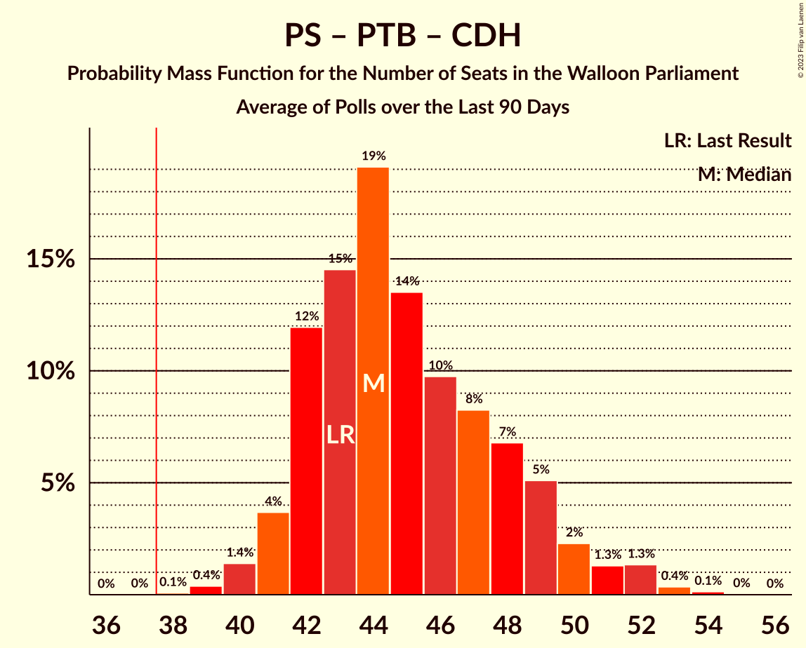

# Poll Average

<a href="#voting-intentions">Voting Intentions</a> | <a href="#seats">Seats</a> | <a href="#coalitions">Coalitions</a> | <a href="#technical-information">Technical Information</a>

## Summary

The table below lists the polls on which the average is based. They are the most recent polls (less than 90 days old) registered and analyzed so far.

| Period     | Polling firm/Commissioner(s) | PS | MR | ECOLO | PTB | CDH | DÉFI | PP | DROITE |
|:----------:|:----------------------------:|:--:|:--:|:--:|:--:|:--:|:--:|:--:|:--:|
| 26 May 2019 | General Election | 26.2%   23 | 21.4%   20 | 14.5%   12 | 13.7%   10 | 11.0%   10 | 4.1%   0 | 3.7%   0 | 0.2%   0 |
| N/A | Poll Average | 20–26%   17–22 | 18–23%   15–21 | 14–19%   12–17 | 17–22%   15–19 | 7–11%   4–8 | 3–5%   0–1 | N/A   N/A | N/A   N/A |
| [4–9 March 2021](2021-03-09-Ipsos.html) | Ipsos   Het Laatste Nieuws, Le Soir, RTL TVi and VTM | 20–26%   17–22 | 18–23%   15–21 | 14–19%   12–17 | 17–22%   15–19 | 7–11%   4–8 | 3–5%   0–1 | N/A   N/A | N/A   N/A |
| 26 May 2019 | General Election | 26.2%   23 | 21.4%   20 | 14.5%   12 | 13.7%   10 | 11.0%   10 | 4.1%   0 | 3.7%   0 | 0.2%   0 |

Only polls for which at least the sample size has been published are included in the table above.

**Legend:**
+ **Top half of each row:** Voting intentions (95% confidence interval)
+ **Bottom half of each row:** Seat projections for the Walloon Parliament (95% confidence interval)
+ **PS:** Parti Socialiste
+ **MR:** Mouvement Réformateur
+ **ECOLO:** Ecolo
+ **PTB:** Parti du Travail de Belgique
+ **CDH:** Centre démocrate humaniste
+ **DÉFI:** DéFI
+ **PP:** Parti Populaire
+ **DROITE:** La Droite
+ **N/A (single party):** Party not included the published results
+ **N/A (entire row):** Calculation for this opinion poll not started yet

## Voting Intentions

### Confidence Intervals

| Party | Last Result | Median | 80% Confidence Interval | 90% Confidence Interval | 95% Confidence Interval | 99% Confidence Interval |
|:-----:|:-----------:|:------:|:-----------------------:|:-----------------------:|:-----------------------:|:-----------------------:|
| <a href="#parti-socialiste">Parti Socialiste</a> | 26.2% | 22.8% | 21.1–24.6% |20.6–25.1% | 20.2–25.5% | 19.4–26.4% |
| <a href="#mouvement-réformateur">Mouvement Réformateur</a> | 21.4% | 20.2% | 18.6–21.9% |18.1–22.4% | 17.7–22.8% | 17.0–23.7% |
| <a href="#ecolo">Ecolo</a> | 14.5% | 16.4% | 14.9–18.0% |14.5–18.5% | 14.2–18.9% | 13.5–19.7% |
| <a href="#parti-du-travail-de-belgique">Parti du Travail de Belgique</a> | 13.7% | 19.0% | 17.5–20.7% |17.0–21.2% | 16.6–21.6% | 15.9–22.4% |
| <a href="#centre-démocrate-humaniste">Centre démocrate humaniste</a> | 11.0% | 8.7% | 7.6–9.9% |7.3–10.3% | 7.0–10.6% | 6.6–11.3% |
| <a href="#défi">DéFI</a> | 4.1% | 3.9% | 3.2–4.8% |3.0–5.0% | 2.8–5.3% | 2.5–5.8% |
| <a href="#parti-populaire">Parti Populaire</a> | 3.7% | N/A | N/A |N/A | N/A | N/A |
| <a href="#la-droite">La Droite</a> | 0.2% | N/A | N/A |N/A | N/A | N/A |

### Parti Socialiste

*For a full overview of the results for this party, see the [Parti Socialiste](party-partisocialiste.html) page.*

| Voting Intentions | Probability | Accumulated | Special Marks |
|:-----------------:|:-----------:|:-----------:|:-------------:|
| 17.5–18.5% | 0% | 100% |  |
| 18.5–19.5% | 0.6% | 100% |  |
| 19.5–20.5% | 4% | 99.3% |  |
| 20.5–21.5% | 13% | 96% |  |
| 21.5–22.5% | 25% | 82% |  |
| 22.5–23.5% | 28% | 57% | Median |
| 23.5–24.5% | 19% | 29% |  |
| 24.5–25.5% | 8% | 10% |  |
| 25.5–26.5% | 2% | 2% | Last Result |
| 26.5–27.5% | 0.3% | 0.4% |  |
| 27.5–28.5% | 0% | 0% |  |

### Mouvement Réformateur

*For a full overview of the results for this party, see the [Mouvement Réformateur](party-mouvementréformateur.html) page.*

| Voting Intentions | Probability | Accumulated | Special Marks |
|:-----------------:|:-----------:|:-----------:|:-------------:|
| 14.5–15.5% | 0% | 100% |  |
| 15.5–16.5% | 0.2% | 100% |  |
| 16.5–17.5% | 2% | 99.8% |  |
| 17.5–18.5% | 8% | 98% |  |
| 18.5–19.5% | 21% | 90% |  |
| 19.5–20.5% | 30% | 69% | Median |
| 20.5–21.5% | 24% | 39% | Last Result |
| 21.5–22.5% | 11% | 15% |  |
| 22.5–23.5% | 3% | 4% |  |
| 23.5–24.5% | 0.6% | 0.6% |  |
| 24.5–25.5% | 0.1% | 0.1% |  |
| 25.5–26.5% | 0% | 0% |  |

### Ecolo

*For a full overview of the results for this party, see the [Ecolo](party-ecolo.html) page.*

| Voting Intentions | Probability | Accumulated | Special Marks |
|:-----------------:|:-----------:|:-----------:|:-------------:|
| 11.5–12.5% | 0% | 100% |  |
| 12.5–13.5% | 0.5% | 100% |  |
| 13.5–14.5% | 5% | 99.4% | Last Result |
| 14.5–15.5% | 17% | 95% |  |
| 15.5–16.5% | 31% | 77% | Median |
| 16.5–17.5% | 28% | 46% |  |
| 17.5–18.5% | 14% | 18% |  |
| 18.5–19.5% | 4% | 4% |  |
| 19.5–20.5% | 0.6% | 0.6% |  |
| 20.5–21.5% | 0.1% | 0.1% |  |
| 21.5–22.5% | 0% | 0% |  |

### Parti du Travail de Belgique

*For a full overview of the results for this party, see the [Parti du Travail de Belgique](party-partidutravaildebelgique.html) page.*

| Voting Intentions | Probability | Accumulated | Special Marks |
|:-----------------:|:-----------:|:-----------:|:-------------:|
| 13.5–14.5% | 0% | 100% | Last Result |
| 14.5–15.5% | 0.2% | 100% |  |
| 15.5–16.5% | 2% | 99.8% |  |
| 16.5–17.5% | 9% | 98% |  |
| 17.5–18.5% | 23% | 89% |  |
| 18.5–19.5% | 31% | 65% | Median |
| 19.5–20.5% | 22% | 34% |  |
| 20.5–21.5% | 9% | 12% |  |
| 21.5–22.5% | 2% | 3% |  |
| 22.5–23.5% | 0.4% | 0.4% |  |
| 23.5–24.5% | 0% | 0% |  |

### Centre démocrate humaniste

*For a full overview of the results for this party, see the [Centre démocrate humaniste](party-centredémocratehumaniste.html) page.*

| Voting Intentions | Probability | Accumulated | Special Marks |
|:-----------------:|:-----------:|:-----------:|:-------------:|
| 4.5–5.5% | 0% | 100% |  |
| 5.5–6.5% | 0.5% | 100% |  |
| 6.5–7.5% | 8% | 99.5% |  |
| 7.5–8.5% | 34% | 91% |  |
| 8.5–9.5% | 39% | 57% | Median |
| 9.5–10.5% | 16% | 19% |  |
| 10.5–11.5% | 3% | 3% | Last Result |
| 11.5–12.5% | 0.2% | 0.2% |  |
| 12.5–13.5% | 0% | 0% |  |

### DéFI

*For a full overview of the results for this party, see the [DéFI](party-défi.html) page.*

| Voting Intentions | Probability | Accumulated | Special Marks |
|:-----------------:|:-----------:|:-----------:|:-------------:|
| 0.5–1.5% | 0% | 100% |  |
| 1.5–2.5% | 0.6% | 100% |  |
| 2.5–3.5% | 26% | 99.4% |  |
| 3.5–4.5% | 56% | 73% | Last Result, Median |
| 4.5–5.5% | 16% | 17% |  |
| 5.5–6.5% | 1.0% | 1.0% |  |
| 6.5–7.5% | 0% | 0% |  |

## Seats

### Confidence Intervals

| Party | Last Result | Median | 80% Confidence Interval | 90% Confidence Interval | 95% Confidence Interval | 99% Confidence Interval |
|:-----:|:-----------:|:------:|:-----------------------:|:-----------------------:|:-----------------------:|:-----------------------:|
| <a href="#parti-socialiste">Parti Socialiste</a> | 23 | 20 | 19–21 |17–22 | 17–22 | 17–23 |
| <a href="#mouvement-réformateur">Mouvement Réformateur</a> | 20 | 19 | 17–20 |15–20 | 15–21 | 14–21 |
| <a href="#ecolo">Ecolo</a> | 12 | 14 | 13–15 |12–16 | 12–17 | 12–18 |
| <a href="#parti-du-travail-de-belgique">Parti du Travail de Belgique</a> | 10 | 17 | 15–18 |15–18 | 15–19 | 15–20 |
| <a href="#centre-démocrate-humaniste">Centre démocrate humaniste</a> | 10 | 6 | 5–7 |4–8 | 4–8 | 4–9 |
| <a href="#défi">DéFI</a> | 0 | 0 | 0 |0 | 0–1 | 0–3 |
| <a href="#parti-populaire">Parti Populaire</a> | 0 | N/A | N/A |N/A | N/A | N/A |
| <a href="#la-droite">La Droite</a> | 0 | N/A | N/A |N/A | N/A | N/A |

### Parti Socialiste

*For a full overview of the results for this party, see the [Parti Socialiste](party-partisocialiste.html) page.*

| Number of Seats | Probability | Accumulated | Special Marks |
|:---------------:|:-----------:|:-----------:|:-------------:|
| 17 | 6% | 100% |  |
| 18 | 4% | 94% |  |
| 19 | 13% | 90% |  |
| 20 | 48% | 77% | Median |
| 21 | 22% | 29% |  |
| 22 | 5% | 7% |  |
| 23 | 1.4% | 2% | Last Result |
| 24 | 0.2% | 0.2% |  |
| 25 | 0% | 0% |  |

### Mouvement Réformateur

*For a full overview of the results for this party, see the [Mouvement Réformateur](party-mouvementréformateur.html) page.*

| Number of Seats | Probability | Accumulated | Special Marks |
|:---------------:|:-----------:|:-----------:|:-------------:|
| 14 | 0.6% | 100% |  |
| 15 | 4% | 99.4% |  |
| 16 | 3% | 95% |  |
| 17 | 9% | 92% |  |
| 18 | 22% | 83% |  |
| 19 | 48% | 61% | Median |
| 20 | 8% | 13% | Last Result |
| 21 | 4% | 4% |  |
| 22 | 0.2% | 0.2% |  |
| 23 | 0% | 0% |  |

### Ecolo

*For a full overview of the results for this party, see the [Ecolo](party-ecolo.html) page.*

| Number of Seats | Probability | Accumulated | Special Marks |
|:---------------:|:-----------:|:-----------:|:-------------:|
| 11 | 0.1% | 100% |  |
| 12 | 9% | 99.8% | Last Result |
| 13 | 41% | 91% |  |
| 14 | 28% | 50% | Median |
| 15 | 16% | 22% |  |
| 16 | 3% | 6% |  |
| 17 | 2% | 3% |  |
| 18 | 0.8% | 0.9% |  |
| 19 | 0% | 0% |  |

### Parti du Travail de Belgique

*For a full overview of the results for this party, see the [Parti du Travail de Belgique](party-partidutravaildebelgique.html) page.*

| Number of Seats | Probability | Accumulated | Special Marks |
|:---------------:|:-----------:|:-----------:|:-------------:|
| 10 | 0% | 100% | Last Result |
| 11 | 0% | 100% |  |
| 12 | 0% | 100% |  |
| 13 | 0% | 100% |  |
| 14 | 0.3% | 99.9% |  |
| 15 | 15% | 99.6% |  |
| 16 | 18% | 85% |  |
| 17 | 52% | 67% | Median |
| 18 | 11% | 15% |  |
| 19 | 3% | 4% |  |
| 20 | 1.5% | 2% |  |
| 21 | 0.1% | 0.1% |  |
| 22 | 0% | 0% |  |

### Centre démocrate humaniste

*For a full overview of the results for this party, see the [Centre démocrate humaniste](party-centredémocratehumaniste.html) page.*

| Number of Seats | Probability | Accumulated | Special Marks |
|:---------------:|:-----------:|:-----------:|:-------------:|
| 3 | 0.2% | 100% |  |
| 4 | 8% | 99.8% |  |
| 5 | 17% | 92% |  |
| 6 | 48% | 75% | Median |
| 7 | 21% | 27% |  |
| 8 | 5% | 6% |  |
| 9 | 0.8% | 1.3% |  |
| 10 | 0.4% | 0.5% | Last Result |
| 11 | 0% | 0% |  |

### DéFI

*For a full overview of the results for this party, see the [DéFI](party-défi.html) page.*

| Number of Seats | Probability | Accumulated | Special Marks |
|:---------------:|:-----------:|:-----------:|:-------------:|
| 0 | 97% | 100% | Last Result, Median |
| 1 | 2% | 3% |  |
| 2 | 0.3% | 1.1% |  |
| 3 | 0.4% | 0.8% |  |
| 4 | 0.4% | 0.4% |  |
| 5 | 0% | 0% |  |

### Parti Populaire

*For a full overview of the results for this party, see the [Parti Populaire](party-partipopulaire.html) page.*

### La Droite

*For a full overview of the results for this party, see the [La Droite](party-ladroite.html) page.*

## Coalitions

### Confidence Intervals

| Coalition | Last Result | Median | Majority? | 80% Confidence Interval | 90% Confidence Interval | 95% Confidence Interval | 99% Confidence Interval |
|:---------:|:-----------:|:------:|:---------:|:-----------------------:|:-----------------------:|:-----------------------:|:-----------------------:|
| Parti Socialiste – Mouvement Réformateur – Ecolo | 55 | 52 | 100% | 50–54 | 50–54 | 49–55 | 48–55 |
| Parti Socialiste – Ecolo – Parti du Travail de Belgique | 45 | 50 | 100% | 49–52 | 49–53 | 48–53 | 47–55 |
| Parti Socialiste – Parti du Travail de Belgique – Centre démocrate humaniste | 43 | 43 | 100% | 42–44 | 41–45 | 40–46 | 39–47 |
| Parti Socialiste – Ecolo – Centre démocrate humaniste | 45 | 39 | 95% | 38–42 | 38–43 | 37–43 | 36–44 |
| Mouvement Réformateur – Ecolo – Centre démocrate humaniste | 42 | 38 | 75% | 37–40 | 36–40 | 35–41 | 35–42 |
| Parti Socialiste – Mouvement Réformateur | 43 | 39 | 79% | 36–40 | 35–41 | 35–41 | 34–42 |
| Parti Socialiste – Parti du Travail de Belgique | 33 | 37 | 24% | 35–38 | 35–38 | 34–39 | 33–40 |
| Parti Socialiste – Ecolo | 35 | 34 | 1.0% | 32–36 | 31–36 | 31–37 | 30–38 |
| Mouvement Réformateur – Ecolo | 32 | 32 | 0% | 30–33 | 30–34 | 29–35 | 28–36 |
| Ecolo – Parti du Travail de Belgique | 22 | 30 | 0% | 29–32 | 28–33 | 28–34 | 27–35 |
| Parti Socialiste – Centre démocrate humaniste | 33 | 26 | 0% | 24–28 | 24–28 | 23–29 | 22–30 |
| Mouvement Réformateur – Centre démocrate humaniste | 30 | 25 | 0% | 23–26 | 22–26 | 22–27 | 20–28 |

### Parti Socialiste – Mouvement Réformateur – Ecolo

| Number of Seats | Probability | Accumulated | Special Marks |
|:---------------:|:-----------:|:-----------:|:-------------:|
| 47 | 0.2% | 100% |  |
| 48 | 0.8% | 99.8% |  |
| 49 | 2% | 99.0% |  |
| 50 | 10% | 97% |  |
| 51 | 17% | 88% |  |
| 52 | 26% | 71% |  |
| 53 | 27% | 44% | Median |
| 54 | 14% | 17% |  |
| 55 | 3% | 4% | Last Result |
| 56 | 0.3% | 0.3% |  |
| 57 | 0% | 0% |  |

### Parti Socialiste – Ecolo – Parti du Travail de Belgique

| Number of Seats | Probability | Accumulated | Special Marks |
|:---------------:|:-----------:|:-----------:|:-------------:|
| 45 | 0% | 100% | Last Result |
| 46 | 0.1% | 100% |  |
| 47 | 2% | 99.9% |  |
| 48 | 3% | 98% |  |
| 49 | 14% | 95% |  |
| 50 | 40% | 81% |  |
| 51 | 23% | 42% | Median |
| 52 | 11% | 18% |  |
| 53 | 5% | 7% |  |
| 54 | 2% | 2% |  |
| 55 | 0.5% | 0.6% |  |
| 56 | 0.1% | 0.1% |  |
| 57 | 0% | 0% |  |

### Parti Socialiste – Parti du Travail de Belgique – Centre démocrate humaniste

| Number of Seats | Probability | Accumulated | Special Marks |
|:---------------:|:-----------:|:-----------:|:-------------:|
| 38 | 0.1% | 100% | Majority |
| 39 | 1.1% | 99.9% |  |
| 40 | 3% | 98.8% |  |
| 41 | 5% | 96% |  |
| 42 | 39% | 90% |  |
| 43 | 27% | 51% | Last Result, Median |
| 44 | 16% | 25% |  |
| 45 | 6% | 9% |  |
| 46 | 2% | 3% |  |
| 47 | 0.8% | 1.0% |  |
| 48 | 0.2% | 0.2% |  |
| 49 | 0% | 0% |  |

### Parti Socialiste – Ecolo – Centre démocrate humaniste

| Number of Seats | Probability | Accumulated | Special Marks |
|:---------------:|:-----------:|:-----------:|:-------------:|
| 35 | 0.1% | 100% |  |
| 36 | 1.1% | 99.8% |  |
| 37 | 4% | 98.7% |  |
| 38 | 10% | 95% | Majority |
| 39 | 39% | 85% |  |
| 40 | 18% | 47% | Median |
| 41 | 15% | 28% |  |
| 42 | 8% | 13% |  |
| 43 | 4% | 5% |  |
| 44 | 1.0% | 1.3% |  |
| 45 | 0.3% | 0.3% | Last Result |
| 46 | 0% | 0% |  |

### Mouvement Réformateur – Ecolo – Centre démocrate humaniste

| Number of Seats | Probability | Accumulated | Special Marks |
|:---------------:|:-----------:|:-----------:|:-------------:|
| 33 | 0.1% | 100% |  |
| 34 | 0.3% | 99.9% |  |
| 35 | 2% | 99.6% |  |
| 36 | 3% | 97% |  |
| 37 | 20% | 95% |  |
| 38 | 37% | 75% | Majority |
| 39 | 25% | 38% | Median |
| 40 | 8% | 13% |  |
| 41 | 3% | 4% |  |
| 42 | 0.9% | 1.0% | Last Result |
| 43 | 0.1% | 0.1% |  |
| 44 | 0% | 0% |  |

### Parti Socialiste – Mouvement Réformateur

| Number of Seats | Probability | Accumulated | Special Marks |
|:---------------:|:-----------:|:-----------:|:-------------:|
| 33 | 0.1% | 100% |  |
| 34 | 0.7% | 99.8% |  |
| 35 | 5% | 99.2% |  |
| 36 | 5% | 94% |  |
| 37 | 10% | 89% |  |
| 38 | 24% | 79% | Majority |
| 39 | 33% | 54% | Median |
| 40 | 12% | 22% |  |
| 41 | 8% | 10% |  |
| 42 | 0.9% | 1.0% |  |
| 43 | 0.1% | 0.1% | Last Result |
| 44 | 0% | 0% |  |

### Parti Socialiste – Parti du Travail de Belgique

| Number of Seats | Probability | Accumulated | Special Marks |
|:---------------:|:-----------:|:-----------:|:-------------:|
| 32 | 0.1% | 100% |  |
| 33 | 1.0% | 99.9% | Last Result |
| 34 | 4% | 98.9% |  |
| 35 | 9% | 95% |  |
| 36 | 26% | 87% |  |
| 37 | 37% | 61% | Median |
| 38 | 20% | 24% | Majority |
| 39 | 2% | 4% |  |
| 40 | 2% | 2% |  |
| 41 | 0.2% | 0.3% |  |
| 42 | 0.1% | 0.1% |  |
| 43 | 0% | 0% |  |

### Parti Socialiste – Ecolo

| Number of Seats | Probability | Accumulated | Special Marks |
|:---------------:|:-----------:|:-----------:|:-------------:|
| 29 | 0.1% | 100% |  |
| 30 | 1.4% | 99.9% |  |
| 31 | 4% | 98% |  |
| 32 | 12% | 95% |  |
| 33 | 32% | 83% |  |
| 34 | 20% | 51% | Median |
| 35 | 19% | 30% | Last Result |
| 36 | 8% | 11% |  |
| 37 | 2% | 3% |  |
| 38 | 0.9% | 1.0% | Majority |
| 39 | 0.1% | 0.2% |  |
| 40 | 0% | 0% |  |

### Mouvement Réformateur – Ecolo

| Number of Seats | Probability | Accumulated | Special Marks |
|:---------------:|:-----------:|:-----------:|:-------------:|
| 27 | 0.2% | 100% |  |
| 28 | 0.9% | 99.7% |  |
| 29 | 2% | 98.9% |  |
| 30 | 7% | 97% |  |
| 31 | 15% | 90% |  |
| 32 | 28% | 75% | Last Result |
| 33 | 38% | 47% | Median |
| 34 | 5% | 9% |  |
| 35 | 3% | 4% |  |
| 36 | 1.0% | 1.0% |  |
| 37 | 0% | 0.1% |  |
| 38 | 0% | 0% | Majority |

### Ecolo – Parti du Travail de Belgique

| Number of Seats | Probability | Accumulated | Special Marks |
|:---------------:|:-----------:|:-----------:|:-------------:|
| 22 | 0% | 100% | Last Result |
| 23 | 0% | 100% |  |
| 24 | 0% | 100% |  |
| 25 | 0% | 100% |  |
| 26 | 0.1% | 100% |  |
| 27 | 0.6% | 99.9% |  |
| 28 | 6% | 99.3% |  |
| 29 | 12% | 94% |  |
| 30 | 42% | 82% |  |
| 31 | 21% | 40% | Median |
| 32 | 9% | 19% |  |
| 33 | 6% | 9% |  |
| 34 | 2% | 3% |  |
| 35 | 0.6% | 0.7% |  |
| 36 | 0.1% | 0.1% |  |
| 37 | 0% | 0% |  |

### Parti Socialiste – Centre démocrate humaniste

| Number of Seats | Probability | Accumulated | Special Marks |
|:---------------:|:-----------:|:-----------:|:-------------:|
| 21 | 0.1% | 100% |  |
| 22 | 0.7% | 99.9% |  |
| 23 | 3% | 99.2% |  |
| 24 | 8% | 96% |  |
| 25 | 21% | 89% |  |
| 26 | 35% | 67% | Median |
| 27 | 19% | 32% |  |
| 28 | 9% | 13% |  |
| 29 | 2% | 3% |  |
| 30 | 0.9% | 1.2% |  |
| 31 | 0.3% | 0.4% |  |
| 32 | 0% | 0% |  |
| 33 | 0% | 0% | Last Result |

### Mouvement Réformateur – Centre démocrate humaniste

| Number of Seats | Probability | Accumulated | Special Marks |
|:---------------:|:-----------:|:-----------:|:-------------:|
| 19 | 0.1% | 100% |  |
| 20 | 0.6% | 99.9% |  |
| 21 | 2% | 99.3% |  |
| 22 | 6% | 98% |  |
| 23 | 11% | 92% |  |
| 24 | 24% | 81% |  |
| 25 | 39% | 57% | Median |
| 26 | 14% | 18% |  |
| 27 | 2% | 4% |  |
| 28 | 1.4% | 1.5% |  |
| 29 | 0.1% | 0.1% |  |
| 30 | 0% | 0% | Last Result |

## Technical Information

+ **Number of polls included in this average:** 1
+ **Lowest number of simulations done in a poll included in this average:** 131,072
+ **Total number of simulations done in the polls included in this average:** 131,072
+ **Error estimate:** 1.01%
