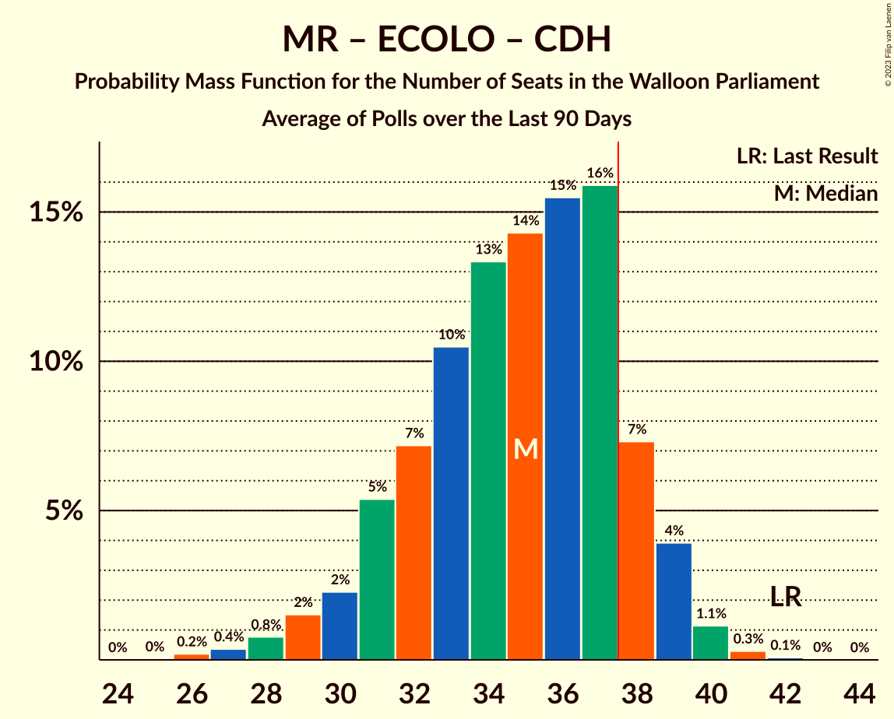

# Poll Average

<a href="#voting-intentions">Voting Intentions</a> | <a href="#seats">Seats</a> | <a href="#coalitions">Coalitions</a> | <a href="#technical-information">Technical Information</a>

## Summary

The table below lists the polls on which the average is based. They are the most recent polls (less than 90 days old) registered and analyzed so far.

| Period     | Polling firm/Commissioner(s) | PS | MR | ECOLO | PTB | CDH | DÉFI | PP | DROITE |
|:----------:|:----------------------------:|:--:|:--:|:--:|:--:|:--:|:--:|:--:|:--:|
| 26 May 2019 | General Election | 26.2%   23 | 21.4%   20 | 14.5%   12 | 13.7%   10 | 11.0%   10 | 4.1%   0 | 3.7%   0 | 0.2%   0 |
| N/A | Poll Average | 21–31%   18–29 | 18–28%   16–26 | 12–19%   9–17 | 12–21%   8–18 | 4–10%   0–7 | 3–7%   0–5 | 2–6%   0–4 | N/A   N/A |
| [28 August–1 September 2020](2020-09-01-Dedicated.html) | Dedicated   Soirmag | 22–32%   18–29 | 19–29%   17–26 | 12–20%   9–18 | 12–20%   8–17 | 4–10%   0–6 | 2–7%   0–5 | 2–6%   0–4 | N/A   N/A |
| [10–15 June 2020](2020-06-15-Ipsos.html) | Ipsos   Het Laatste Nieuws, Le Soir, RTL TVi and VTM | 21–26%   19–23 | 18–23%   16–21 | 13–17%   12–15 | 16–21%   15–19 | 7–10%   4–7 | 4–6%   0–4 | N/A   N/A | N/A   N/A |
| 26 May 2019 | General Election | 26.2%   23 | 21.4%   20 | 14.5%   12 | 13.7%   10 | 11.0%   10 | 4.1%   0 | 3.7%   0 | 0.2%   0 |

Only polls for which at least the sample size has been published are included in the table above.

**Legend:**
+ **Top half of each row:** Voting intentions (95% confidence interval)
+ **Bottom half of each row:** Seat projections for the Walloon Parliament (95% confidence interval)
+ **PS:** Parti Socialiste
+ **MR:** Mouvement Réformateur
+ **ECOLO:** Ecolo
+ **PTB:** Parti du Travail de Belgique
+ **CDH:** Centre démocrate humaniste
+ **DÉFI:** DéFI
+ **PP:** Parti Populaire
+ **DROITE:** La Droite
+ **N/A (single party):** Party not included the published results
+ **N/A (entire row):** Calculation for this opinion poll not started yet

## Voting Intentions

### Confidence Intervals

| Party | Last Result | Median | 80% Confidence Interval | 90% Confidence Interval | 95% Confidence Interval | 99% Confidence Interval |
|:-----:|:-----------:|:------:|:-----------------------:|:-----------------------:|:-----------------------:|:-----------------------:|
| <a href="#parti-socialiste">Parti Socialiste</a> | 26.2% | 24.7% | 22.4–28.8% |21.8–30.0% | 21.3–31.0% | 20.3–32.9% |
| <a href="#mouvement-réformateur">Mouvement Réformateur</a> | 21.4% | 21.7% | 19.3–26.2% |18.8–27.4% | 18.4–28.4% | 17.5–30.3% |
| <a href="#ecolo">Ecolo</a> | 14.5% | 15.3% | 13.4–17.6% |12.7–18.5% | 12.2–19.3% | 11.0–21.0% |
| <a href="#parti-du-travail-de-belgique">Parti du Travail de Belgique</a> | 13.7% | 17.6% | 13.8–19.9% |12.9–20.5% | 12.2–20.9% | 11.0–21.9% |
| <a href="#centre-démocrate-humaniste">Centre démocrate humaniste</a> | 11.0% | 7.5% | 5.1–9.1% |4.6–9.5% | 4.2–9.9% | 3.5–10.6% |
| <a href="#défi">DéFI</a> | 4.1% | 4.6% | 3.5–5.9% |3.1–6.4% | 2.8–6.9% | 2.2–8.0% |
| <a href="#parti-populaire">Parti Populaire</a> | 3.7% | 3.8% | 2.5–5.4% |2.2–6.0% | 2.0–6.4% | 1.5–7.5% |
| <a href="#la-droite">La Droite</a> | 0.2% | N/A | N/A |N/A | N/A | N/A |

### Parti Socialiste

*For a full overview of the results for this party, see the [Parti Socialiste](party-partisocialiste.html) page.*

| Voting Intentions | Probability | Accumulated | Special Marks |
|:-----------------:|:-----------:|:-----------:|:-------------:|
| 17.5–18.5% | 0% | 100% |  |
| 18.5–19.5% | 0.1% | 100% |  |
| 19.5–20.5% | 0.6% | 99.9% |  |
| 20.5–21.5% | 3% | 99.3% |  |
| 21.5–22.5% | 9% | 96% |  |
| 22.5–23.5% | 16% | 88% |  |
| 23.5–24.5% | 19% | 72% |  |
| 24.5–25.5% | 16% | 53% | Median |
| 25.5–26.5% | 11% | 37% | Last Result |
| 26.5–27.5% | 8% | 26% |  |
| 27.5–28.5% | 6% | 18% |  |
| 28.5–29.5% | 5% | 11% |  |
| 29.5–30.5% | 3% | 7% |  |
| 30.5–31.5% | 2% | 3% |  |
| 31.5–32.5% | 0.9% | 2% |  |
| 32.5–33.5% | 0.4% | 0.7% |  |
| 33.5–34.5% | 0.2% | 0.3% |  |
| 34.5–35.5% | 0.1% | 0.1% |  |
| 35.5–36.5% | 0% | 0% |  |

### Mouvement Réformateur

*For a full overview of the results for this party, see the [Mouvement Réformateur](party-mouvementréformateur.html) page.*

| Voting Intentions | Probability | Accumulated | Special Marks |
|:-----------------:|:-----------:|:-----------:|:-------------:|
| 15.5–16.5% | 0.1% | 100% |  |
| 16.5–17.5% | 0.5% | 99.9% |  |
| 17.5–18.5% | 3% | 99.5% |  |
| 18.5–19.5% | 9% | 97% |  |
| 19.5–20.5% | 16% | 87% |  |
| 20.5–21.5% | 18% | 71% | Last Result |
| 21.5–22.5% | 14% | 53% | Median |
| 22.5–23.5% | 10% | 39% |  |
| 23.5–24.5% | 8% | 30% |  |
| 24.5–25.5% | 7% | 21% |  |
| 25.5–26.5% | 6% | 14% |  |
| 26.5–27.5% | 4% | 8% |  |
| 27.5–28.5% | 2% | 5% |  |
| 28.5–29.5% | 1.3% | 2% |  |
| 29.5–30.5% | 0.6% | 1.0% |  |
| 30.5–31.5% | 0.3% | 0.4% |  |
| 31.5–32.5% | 0.1% | 0.1% |  |
| 32.5–33.5% | 0% | 0% |  |

### Ecolo

*For a full overview of the results for this party, see the [Ecolo](party-ecolo.html) page.*

| Voting Intentions | Probability | Accumulated | Special Marks |
|:-----------------:|:-----------:|:-----------:|:-------------:|
| 8.5–9.5% | 0% | 100% |  |
| 9.5–10.5% | 0.2% | 100% |  |
| 10.5–11.5% | 0.9% | 99.7% |  |
| 11.5–12.5% | 3% | 98.8% |  |
| 12.5–13.5% | 8% | 96% |  |
| 13.5–14.5% | 19% | 88% | Last Result |
| 14.5–15.5% | 26% | 69% | Median |
| 15.5–16.5% | 21% | 43% |  |
| 16.5–17.5% | 12% | 22% |  |
| 17.5–18.5% | 6% | 10% |  |
| 18.5–19.5% | 3% | 5% |  |
| 19.5–20.5% | 1.2% | 2% |  |
| 20.5–21.5% | 0.5% | 0.8% |  |
| 21.5–22.5% | 0.2% | 0.3% |  |
| 22.5–23.5% | 0.1% | 0.1% |  |
| 23.5–24.5% | 0% | 0% |  |

### Parti du Travail de Belgique

*For a full overview of the results for this party, see the [Parti du Travail de Belgique](party-partidutravaildebelgique.html) page.*

| Voting Intentions | Probability | Accumulated | Special Marks |
|:-----------------:|:-----------:|:-----------:|:-------------:|
| 8.5–9.5% | 0% | 100% |  |
| 9.5–10.5% | 0.2% | 100% |  |
| 10.5–11.5% | 0.9% | 99.7% |  |
| 11.5–12.5% | 2% | 98.8% |  |
| 12.5–13.5% | 5% | 96% |  |
| 13.5–14.5% | 8% | 91% | Last Result |
| 14.5–15.5% | 9% | 84% |  |
| 15.5–16.5% | 10% | 75% |  |
| 16.5–17.5% | 14% | 64% |  |
| 17.5–18.5% | 19% | 51% | Median |
| 18.5–19.5% | 18% | 32% |  |
| 19.5–20.5% | 10% | 14% |  |
| 20.5–21.5% | 4% | 4% |  |
| 21.5–22.5% | 0.8% | 0.9% |  |
| 22.5–23.5% | 0.1% | 0.2% |  |
| 23.5–24.5% | 0% | 0% |  |

### Centre démocrate humaniste

*For a full overview of the results for this party, see the [Centre démocrate humaniste](party-centredémocratehumaniste.html) page.*

| Voting Intentions | Probability | Accumulated | Special Marks |
|:-----------------:|:-----------:|:-----------:|:-------------:|
| 1.5–2.5% | 0% | 100% |  |
| 2.5–3.5% | 0.6% | 100% |  |
| 3.5–4.5% | 4% | 99.4% |  |
| 4.5–5.5% | 10% | 95% |  |
| 5.5–6.5% | 15% | 85% |  |
| 6.5–7.5% | 21% | 70% | Median |
| 7.5–8.5% | 28% | 49% |  |
| 8.5–9.5% | 16% | 21% |  |
| 9.5–10.5% | 4% | 4% |  |
| 10.5–11.5% | 0.5% | 0.6% | Last Result |
| 11.5–12.5% | 0.1% | 0.1% |  |
| 12.5–13.5% | 0% | 0% |  |

### DéFI

*For a full overview of the results for this party, see the [DéFI](party-défi.html) page.*

| Voting Intentions | Probability | Accumulated | Special Marks |
|:-----------------:|:-----------:|:-----------:|:-------------:|
| 0.5–1.5% | 0% | 100% |  |
| 1.5–2.5% | 1.4% | 100% |  |
| 2.5–3.5% | 10% | 98.5% |  |
| 3.5–4.5% | 34% | 88% | Last Result |
| 4.5–5.5% | 37% | 54% | Median |
| 5.5–6.5% | 13% | 17% |  |
| 6.5–7.5% | 3% | 4% |  |
| 7.5–8.5% | 0.7% | 0.9% |  |
| 8.5–9.5% | 0.2% | 0.2% |  |
| 9.5–10.5% | 0% | 0% |  |

### Parti Populaire

*For a full overview of the results for this party, see the [Parti Populaire](party-partipopulaire.html) page.*

| Voting Intentions | Probability | Accumulated | Special Marks |
|:-----------------:|:-----------:|:-----------:|:-------------:|
| 0.0–0.5% | 0% | 100% |  |
| 0.5–1.5% | 0.5% | 100% |  |
| 1.5–2.5% | 10% | 99.5% |  |
| 2.5–3.5% | 31% | 89% |  |
| 3.5–4.5% | 32% | 59% | Last Result, Median |
| 4.5–5.5% | 18% | 26% |  |
| 5.5–6.5% | 6% | 9% |  |
| 6.5–7.5% | 2% | 2% |  |
| 7.5–8.5% | 0.4% | 0.4% |  |
| 8.5–9.5% | 0.1% | 0.1% |  |
| 9.5–10.5% | 0% | 0% |  |

## Seats

### Confidence Intervals

| Party | Last Result | Median | 80% Confidence Interval | 90% Confidence Interval | 95% Confidence Interval | 99% Confidence Interval |
|:-----:|:-----------:|:------:|:-----------------------:|:-----------------------:|:-----------------------:|:-----------------------:|
| <a href="#parti-socialiste">Parti Socialiste</a> | 23 | 22 | 20–26 |19–28 | 18–29 | 17–30 |
| <a href="#mouvement-réformateur">Mouvement Réformateur</a> | 20 | 20 | 18–24 |17–25 | 16–26 | 15–28 |
| <a href="#ecolo">Ecolo</a> | 12 | 13 | 12–14 |11–15 | 9–17 | 8–19 |
| <a href="#parti-du-travail-de-belgique">Parti du Travail de Belgique</a> | 10 | 15 | 10–17 |10–18 | 8–18 | 8–20 |
| <a href="#centre-démocrate-humaniste">Centre démocrate humaniste</a> | 10 | 5 | 2–6 |0–7 | 0–7 | 0–8 |
| <a href="#défi">DéFI</a> | 0 | 0 | 0–4 |0–4 | 0–5 | 0–6 |
| <a href="#parti-populaire">Parti Populaire</a> | 0 | 0 | 0–2 |0–3 | 0–4 | 0–5 |
| <a href="#la-droite">La Droite</a> | 0 | N/A | N/A |N/A | N/A | N/A |

### Parti Socialiste

*For a full overview of the results for this party, see the [Parti Socialiste](party-partisocialiste.html) page.*

| Number of Seats | Probability | Accumulated | Special Marks |
|:---------------:|:-----------:|:-----------:|:-------------:|
| 17 | 1.2% | 100% |  |
| 18 | 1.4% | 98.8% |  |
| 19 | 4% | 97% |  |
| 20 | 19% | 93% |  |
| 21 | 23% | 74% |  |
| 22 | 16% | 51% | Median |
| 23 | 13% | 35% | Last Result |
| 24 | 7% | 22% |  |
| 25 | 3% | 15% |  |
| 26 | 4% | 12% |  |
| 27 | 2% | 8% |  |
| 28 | 3% | 6% |  |
| 29 | 2% | 3% |  |
| 30 | 0.9% | 1.2% |  |
| 31 | 0.2% | 0.3% |  |
| 32 | 0% | 0.1% |  |
| 33 | 0% | 0% |  |

### Mouvement Réformateur

*For a full overview of the results for this party, see the [Mouvement Réformateur](party-mouvementréformateur.html) page.*

| Number of Seats | Probability | Accumulated | Special Marks |
|:---------------:|:-----------:|:-----------:|:-------------:|
| 14 | 0.2% | 100% |  |
| 15 | 1.4% | 99.8% |  |
| 16 | 2% | 98% |  |
| 17 | 4% | 96% |  |
| 18 | 13% | 92% |  |
| 19 | 29% | 80% |  |
| 20 | 15% | 51% | Last Result, Median |
| 21 | 17% | 36% |  |
| 22 | 4% | 19% |  |
| 23 | 4% | 15% |  |
| 24 | 3% | 11% |  |
| 25 | 3% | 8% |  |
| 26 | 3% | 4% |  |
| 27 | 0.4% | 1.2% |  |
| 28 | 0.7% | 0.8% |  |
| 29 | 0.1% | 0.1% |  |
| 30 | 0% | 0% |  |

### Ecolo

*For a full overview of the results for this party, see the [Ecolo](party-ecolo.html) page.*

| Number of Seats | Probability | Accumulated | Special Marks |
|:---------------:|:-----------:|:-----------:|:-------------:|
| 6 | 0.1% | 100% |  |
| 7 | 0.1% | 99.9% |  |
| 8 | 0.6% | 99.8% |  |
| 9 | 2% | 99.2% |  |
| 10 | 2% | 97% |  |
| 11 | 3% | 95% |  |
| 12 | 31% | 92% | Last Result |
| 13 | 33% | 61% | Median |
| 14 | 19% | 28% |  |
| 15 | 4% | 9% |  |
| 16 | 1.1% | 4% |  |
| 17 | 1.4% | 3% |  |
| 18 | 0.7% | 2% |  |
| 19 | 1.0% | 1.2% |  |
| 20 | 0.1% | 0.2% |  |
| 21 | 0.1% | 0.1% |  |
| 22 | 0% | 0% |  |

### Parti du Travail de Belgique

*For a full overview of the results for this party, see the [Parti du Travail de Belgique](party-partidutravaildebelgique.html) page.*

| Number of Seats | Probability | Accumulated | Special Marks |
|:---------------:|:-----------:|:-----------:|:-------------:|
| 7 | 0.1% | 100% |  |
| 8 | 3% | 99.8% |  |
| 9 | 2% | 97% |  |
| 10 | 12% | 95% | Last Result |
| 11 | 4% | 83% |  |
| 12 | 4% | 79% |  |
| 13 | 3% | 76% |  |
| 14 | 4% | 73% |  |
| 15 | 23% | 68% | Median |
| 16 | 11% | 45% |  |
| 17 | 28% | 34% |  |
| 18 | 4% | 5% |  |
| 19 | 1.1% | 2% |  |
| 20 | 0.5% | 0.6% |  |
| 21 | 0.1% | 0.1% |  |
| 22 | 0% | 0% |  |

### Centre démocrate humaniste

*For a full overview of the results for this party, see the [Centre démocrate humaniste](party-centredémocratehumaniste.html) page.*

| Number of Seats | Probability | Accumulated | Special Marks |
|:---------------:|:-----------:|:-----------:|:-------------:|
| 0 | 6% | 100% |  |
| 1 | 2% | 94% |  |
| 2 | 15% | 92% |  |
| 3 | 5% | 77% |  |
| 4 | 21% | 71% |  |
| 5 | 19% | 51% | Median |
| 6 | 27% | 32% |  |
| 7 | 4% | 6% |  |
| 8 | 0.8% | 1.2% |  |
| 9 | 0.2% | 0.3% |  |
| 10 | 0.1% | 0.1% | Last Result |
| 11 | 0% | 0% |  |

### DéFI

*For a full overview of the results for this party, see the [DéFI](party-défi.html) page.*

| Number of Seats | Probability | Accumulated | Special Marks |
|:---------------:|:-----------:|:-----------:|:-------------:|
| 0 | 77% | 100% | Last Result, Median |
| 1 | 7% | 23% |  |
| 2 | 2% | 16% |  |
| 3 | 4% | 14% |  |
| 4 | 7% | 10% |  |
| 5 | 2% | 3% |  |
| 6 | 0.7% | 0.7% |  |
| 7 | 0% | 0% |  |

### Parti Populaire

*For a full overview of the results for this party, see the [Parti Populaire](party-partipopulaire.html) page.*

| Number of Seats | Probability | Accumulated | Special Marks |
|:---------------:|:-----------:|:-----------:|:-------------:|
| 0 | 69% | 100% | Last Result, Median |
| 1 | 14% | 31% |  |
| 2 | 12% | 17% |  |
| 3 | 1.2% | 5% |  |
| 4 | 3% | 4% |  |
| 5 | 0.5% | 0.6% |  |
| 6 | 0% | 0% |  |

### La Droite

*For a full overview of the results for this party, see the [La Droite](party-ladroite.html) page.*

## Coalitions

### Confidence Intervals

| Coalition | Last Result | Median | Majority? | 80% Confidence Interval | 90% Confidence Interval | 95% Confidence Interval | 99% Confidence Interval |
|:---------:|:-----------:|:------:|:---------:|:-----------------------:|:-----------------------:|:-----------------------:|:-----------------------:|
| Parti Socialiste – Mouvement Réformateur – Ecolo | 55 | 54 | 100% | 51–61 | 50–63 | 50–63 | 48–65 |
| Parti Socialiste – Ecolo – Parti du Travail de Belgique | 45 | 50 | 100% | 46–52 | 45–53 | 44–54 | 42–56 |
| Parti Socialiste – Mouvement Réformateur | 43 | 41 | 95% | 38–48 | 37–49 | 37–50 | 35–52 |
| Parti Socialiste – Ecolo – Centre démocrate humaniste | 45 | 39 | 80% | 37–42 | 35–44 | 34–45 | 32–46 |
| Parti Socialiste – Parti du Travail de Belgique – Centre démocrate humaniste | 43 | 42 | 86% | 36–44 | 35–44 | 34–45 | 32–47 |
| Mouvement Réformateur – Ecolo – Centre démocrate humaniste | 42 | 37 | 43% | 34–40 | 33–42 | 32–43 | 30–45 |
| Parti Socialiste – Ecolo | 35 | 35 | 18% | 32–39 | 32–41 | 31–42 | 29–44 |
| Parti Socialiste – Parti du Travail de Belgique | 33 | 37 | 43% | 33–39 | 32–40 | 31–41 | 29–44 |
| Mouvement Réformateur – Ecolo | 32 | 33 | 8% | 30–37 | 29–39 | 29–40 | 27–42 |
| Parti Socialiste – Centre démocrate humaniste | 33 | 26 | 0% | 24–29 | 23–31 | 22–32 | 20–33 |
| Ecolo – Parti du Travail de Belgique | 22 | 28 | 0% | 23–30 | 22–31 | 21–32 | 19–33 |
| Mouvement Réformateur – Centre démocrate humaniste | 30 | 24 | 0% | 22–27 | 21–29 | 20–30 | 18–32 |

### Parti Socialiste – Mouvement Réformateur – Ecolo

| Number of Seats | Probability | Accumulated | Special Marks |
|:---------------:|:-----------:|:-----------:|:-------------:|
| 47 | 0.1% | 100% |  |
| 48 | 0.6% | 99.9% |  |
| 49 | 2% | 99.2% |  |
| 50 | 4% | 98% |  |
| 51 | 6% | 94% |  |
| 52 | 13% | 88% |  |
| 53 | 15% | 75% |  |
| 54 | 15% | 60% |  |
| 55 | 6% | 45% | Last Result, Median |
| 56 | 8% | 39% |  |
| 57 | 5% | 31% |  |
| 58 | 5% | 26% |  |
| 59 | 5% | 22% |  |
| 60 | 5% | 16% |  |
| 61 | 3% | 12% |  |
| 62 | 3% | 8% |  |
| 63 | 4% | 6% |  |
| 64 | 1.1% | 2% |  |
| 65 | 0.6% | 1.0% |  |
| 66 | 0.2% | 0.4% |  |
| 67 | 0.1% | 0.1% |  |
| 68 | 0% | 0% |  |

### Parti Socialiste – Ecolo – Parti du Travail de Belgique

| Number of Seats | Probability | Accumulated | Special Marks |
|:---------------:|:-----------:|:-----------:|:-------------:|
| 39 | 0.1% | 100% |  |
| 40 | 0.1% | 99.9% |  |
| 41 | 0.3% | 99.8% |  |
| 42 | 0.5% | 99.5% |  |
| 43 | 1.4% | 99.0% |  |
| 44 | 2% | 98% |  |
| 45 | 3% | 96% | Last Result |
| 46 | 3% | 93% |  |
| 47 | 6% | 89% |  |
| 48 | 8% | 83% |  |
| 49 | 12% | 75% |  |
| 50 | 29% | 64% | Median |
| 51 | 15% | 35% |  |
| 52 | 10% | 20% |  |
| 53 | 6% | 10% |  |
| 54 | 2% | 4% |  |
| 55 | 0.9% | 2% |  |
| 56 | 0.5% | 1.0% |  |
| 57 | 0.3% | 0.5% |  |
| 58 | 0.1% | 0.2% |  |
| 59 | 0% | 0% |  |

### Parti Socialiste – Mouvement Réformateur

| Number of Seats | Probability | Accumulated | Special Marks |
|:---------------:|:-----------:|:-----------:|:-------------:|
| 34 | 0% | 100% |  |
| 35 | 0.6% | 99.9% |  |
| 36 | 1.1% | 99.3% |  |
| 37 | 3% | 98% |  |
| 38 | 7% | 95% | Majority |
| 39 | 11% | 88% |  |
| 40 | 13% | 76% |  |
| 41 | 17% | 64% |  |
| 42 | 8% | 47% | Median |
| 43 | 6% | 39% | Last Result |
| 44 | 6% | 32% |  |
| 45 | 5% | 26% |  |
| 46 | 5% | 21% |  |
| 47 | 4% | 16% |  |
| 48 | 3% | 12% |  |
| 49 | 4% | 8% |  |
| 50 | 3% | 5% |  |
| 51 | 1.3% | 2% |  |
| 52 | 0.5% | 0.9% |  |
| 53 | 0.2% | 0.4% |  |
| 54 | 0.1% | 0.2% |  |
| 55 | 0.1% | 0.1% |  |
| 56 | 0% | 0% |  |

### Parti Socialiste – Ecolo – Centre démocrate humaniste

| Number of Seats | Probability | Accumulated | Special Marks |
|:---------------:|:-----------:|:-----------:|:-------------:|
| 30 | 0.1% | 100% |  |
| 31 | 0.2% | 99.9% |  |
| 32 | 0.4% | 99.7% |  |
| 33 | 0.9% | 99.3% |  |
| 34 | 2% | 98% |  |
| 35 | 3% | 97% |  |
| 36 | 4% | 94% |  |
| 37 | 10% | 90% |  |
| 38 | 10% | 80% | Majority |
| 39 | 27% | 70% |  |
| 40 | 15% | 43% | Median |
| 41 | 12% | 28% |  |
| 42 | 6% | 16% |  |
| 43 | 4% | 10% |  |
| 44 | 2% | 5% |  |
| 45 | 2% | 3% | Last Result |
| 46 | 0.7% | 1.1% |  |
| 47 | 0.2% | 0.4% |  |
| 48 | 0.1% | 0.1% |  |
| 49 | 0% | 0.1% |  |
| 50 | 0% | 0% |  |

### Parti Socialiste – Parti du Travail de Belgique – Centre démocrate humaniste

| Number of Seats | Probability | Accumulated | Special Marks |
|:---------------:|:-----------:|:-----------:|:-------------:|
| 29 | 0% | 100% |  |
| 30 | 0.1% | 99.9% |  |
| 31 | 0.2% | 99.9% |  |
| 32 | 0.5% | 99.7% |  |
| 33 | 1.2% | 99.2% |  |
| 34 | 2% | 98% |  |
| 35 | 3% | 96% |  |
| 36 | 4% | 94% |  |
| 37 | 4% | 90% |  |
| 38 | 6% | 86% | Majority |
| 39 | 5% | 80% |  |
| 40 | 8% | 75% |  |
| 41 | 10% | 67% |  |
| 42 | 23% | 57% | Median |
| 43 | 17% | 34% | Last Result |
| 44 | 12% | 17% |  |
| 45 | 3% | 5% |  |
| 46 | 1.5% | 2% |  |
| 47 | 0.4% | 0.7% |  |
| 48 | 0.2% | 0.2% |  |
| 49 | 0.1% | 0.1% |  |
| 50 | 0% | 0% |  |

### Mouvement Réformateur – Ecolo – Centre démocrate humaniste

| Number of Seats | Probability | Accumulated | Special Marks |
|:---------------:|:-----------:|:-----------:|:-------------:|
| 28 | 0.1% | 100% |  |
| 29 | 0.1% | 99.9% |  |
| 30 | 0.5% | 99.8% |  |
| 31 | 0.8% | 99.3% |  |
| 32 | 1.3% | 98.6% |  |
| 33 | 3% | 97% |  |
| 34 | 5% | 94% |  |
| 35 | 9% | 90% |  |
| 36 | 14% | 81% |  |
| 37 | 24% | 67% |  |
| 38 | 18% | 43% | Median, Majority |
| 39 | 12% | 25% |  |
| 40 | 5% | 14% |  |
| 41 | 3% | 9% |  |
| 42 | 3% | 6% | Last Result |
| 43 | 1.3% | 4% |  |
| 44 | 2% | 2% |  |
| 45 | 0.4% | 0.7% |  |
| 46 | 0.2% | 0.3% |  |
| 47 | 0.1% | 0.1% |  |
| 48 | 0% | 0% |  |

### Parti Socialiste – Ecolo

| Number of Seats | Probability | Accumulated | Special Marks |
|:---------------:|:-----------:|:-----------:|:-------------:|
| 27 | 0% | 100% |  |
| 28 | 0.1% | 99.9% |  |
| 29 | 0.5% | 99.8% |  |
| 30 | 1.3% | 99.3% |  |
| 31 | 3% | 98% |  |
| 32 | 8% | 95% |  |
| 33 | 21% | 88% |  |
| 34 | 15% | 67% |  |
| 35 | 20% | 52% | Last Result, Median |
| 36 | 9% | 33% |  |
| 37 | 5% | 24% |  |
| 38 | 4% | 18% | Majority |
| 39 | 4% | 14% |  |
| 40 | 3% | 10% |  |
| 41 | 3% | 6% |  |
| 42 | 1.5% | 4% |  |
| 43 | 2% | 2% |  |
| 44 | 0.3% | 0.5% |  |
| 45 | 0.1% | 0.2% |  |
| 46 | 0% | 0.1% |  |
| 47 | 0% | 0% |  |

### Parti Socialiste – Parti du Travail de Belgique

| Number of Seats | Probability | Accumulated | Special Marks |
|:---------------:|:-----------:|:-----------:|:-------------:|
| 27 | 0.1% | 100% |  |
| 28 | 0.2% | 99.9% |  |
| 29 | 0.5% | 99.6% |  |
| 30 | 1.1% | 99.1% |  |
| 31 | 3% | 98% |  |
| 32 | 2% | 95% |  |
| 33 | 4% | 93% | Last Result |
| 34 | 5% | 89% |  |
| 35 | 7% | 84% |  |
| 36 | 15% | 77% |  |
| 37 | 19% | 62% | Median |
| 38 | 24% | 43% | Majority |
| 39 | 10% | 19% |  |
| 40 | 4% | 9% |  |
| 41 | 2% | 4% |  |
| 42 | 1.2% | 2% |  |
| 43 | 0.4% | 0.9% |  |
| 44 | 0.3% | 0.5% |  |
| 45 | 0.2% | 0.2% |  |
| 46 | 0% | 0% |  |

### Mouvement Réformateur – Ecolo

| Number of Seats | Probability | Accumulated | Special Marks |
|:---------------:|:-----------:|:-----------:|:-------------:|
| 26 | 0.2% | 100% |  |
| 27 | 0.5% | 99.8% |  |
| 28 | 1.5% | 99.3% |  |
| 29 | 4% | 98% |  |
| 30 | 7% | 94% |  |
| 31 | 14% | 87% |  |
| 32 | 19% | 73% | Last Result |
| 33 | 22% | 53% | Median |
| 34 | 8% | 31% |  |
| 35 | 6% | 23% |  |
| 36 | 5% | 17% |  |
| 37 | 4% | 12% |  |
| 38 | 3% | 8% | Majority |
| 39 | 3% | 6% |  |
| 40 | 2% | 3% |  |
| 41 | 0.7% | 1.2% |  |
| 42 | 0.4% | 0.5% |  |
| 43 | 0.1% | 0.2% |  |
| 44 | 0.1% | 0.1% |  |
| 45 | 0% | 0% |  |

### Parti Socialiste – Centre démocrate humaniste

| Number of Seats | Probability | Accumulated | Special Marks |
|:---------------:|:-----------:|:-----------:|:-------------:|
| 18 | 0.1% | 100% |  |
| 19 | 0.2% | 99.9% |  |
| 20 | 0.7% | 99.7% |  |
| 21 | 1.4% | 99.0% |  |
| 22 | 2% | 98% |  |
| 23 | 4% | 96% |  |
| 24 | 7% | 91% |  |
| 25 | 15% | 84% |  |
| 26 | 22% | 69% |  |
| 27 | 21% | 47% | Median |
| 28 | 11% | 26% |  |
| 29 | 6% | 15% |  |
| 30 | 4% | 9% |  |
| 31 | 2% | 5% |  |
| 32 | 2% | 3% |  |
| 33 | 0.7% | 1.1% | Last Result |
| 34 | 0.3% | 0.4% |  |
| 35 | 0.1% | 0.1% |  |
| 36 | 0% | 0% |  |

### Ecolo – Parti du Travail de Belgique

| Number of Seats | Probability | Accumulated | Special Marks |
|:---------------:|:-----------:|:-----------:|:-------------:|
| 17 | 0.1% | 100% |  |
| 18 | 0.2% | 99.9% |  |
| 19 | 0.3% | 99.7% |  |
| 20 | 1.1% | 99.4% |  |
| 21 | 2% | 98% |  |
| 22 | 5% | 96% | Last Result |
| 23 | 6% | 91% |  |
| 24 | 5% | 86% |  |
| 25 | 6% | 81% |  |
| 26 | 4% | 75% |  |
| 27 | 9% | 71% |  |
| 28 | 14% | 62% | Median |
| 29 | 20% | 48% |  |
| 30 | 18% | 28% |  |
| 31 | 6% | 9% |  |
| 32 | 3% | 4% |  |
| 33 | 0.8% | 1.2% |  |
| 34 | 0.3% | 0.4% |  |
| 35 | 0.1% | 0.1% |  |
| 36 | 0% | 0% |  |

### Mouvement Réformateur – Centre démocrate humaniste

| Number of Seats | Probability | Accumulated | Special Marks |
|:---------------:|:-----------:|:-----------:|:-------------:|
| 16 | 0.1% | 100% |  |
| 17 | 0.2% | 99.9% |  |
| 18 | 0.8% | 99.7% |  |
| 19 | 1.0% | 98.9% |  |
| 20 | 2% | 98% |  |
| 21 | 5% | 96% |  |
| 22 | 10% | 91% |  |
| 23 | 16% | 82% |  |
| 24 | 17% | 66% |  |
| 25 | 25% | 49% | Median |
| 26 | 10% | 24% |  |
| 27 | 5% | 14% |  |
| 28 | 3% | 9% |  |
| 29 | 2% | 5% |  |
| 30 | 2% | 4% | Last Result |
| 31 | 0.7% | 1.3% |  |
| 32 | 0.5% | 0.6% |  |
| 33 | 0.1% | 0.2% |  |
| 34 | 0% | 0.1% |  |
| 35 | 0% | 0% |  |

## Technical Information

+ **Number of polls included in this average:** 2
+ **Lowest number of simulations done in a poll included in this average:** 1,048,576
+ **Total number of simulations done in the polls included in this average:** 2,097,152
+ **Error estimate:** 2.13%
