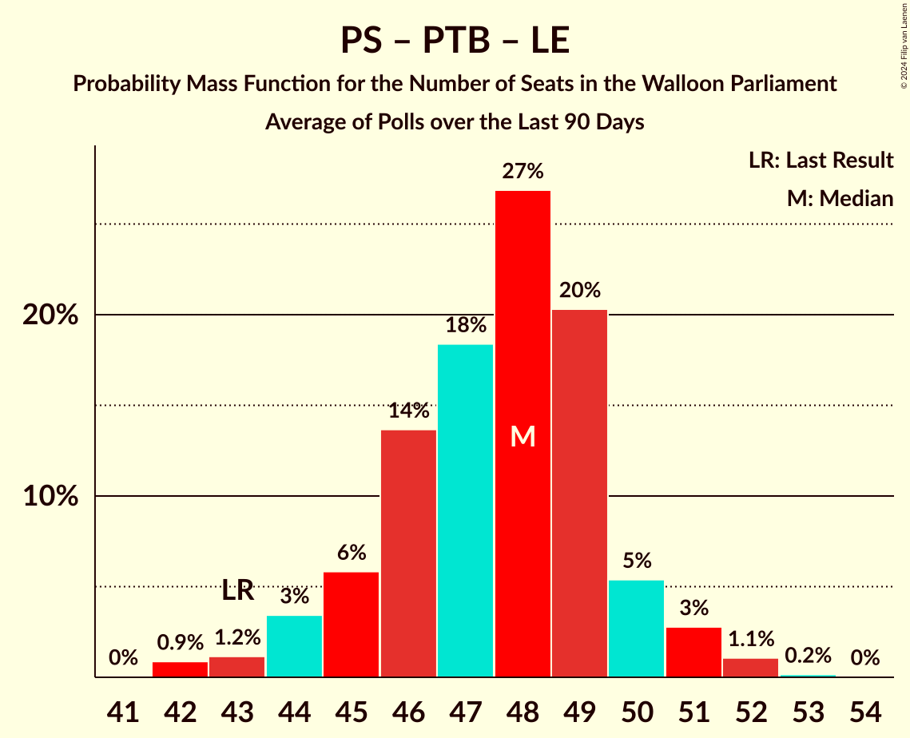

# Poll Average

<a href="#voting-intentions">Voting Intentions</a> | <a href="#seats">Seats</a> | <a href="#coalitions">Coalitions</a> | <a href="#technical-information">Technical Information</a>

## Summary

The table below lists the polls on which the average is based. They are the most recent polls (less than 90 days old) registered and analyzed so far.

| Period     | Polling firm/Commissioner(s) | PS | MR | ECOLO | PTB | LE | DÉFI | PP | DROITE |
|:----------:|:----------------------------:|:--:|:--:|:--:|:--:|:--:|:--:|:--:|:--:|
| 26 May 2019 | General Election | 26.2%   23 | 21.4%   20 | 14.5%   12 | 13.7%   10 | 11.0%   10 | 4.1%   0 | 3.7%   0 | 0.2%   0 |
| N/A | Poll Average | 22–27%   19–23 | 18–22%   14–21 | 12–16%   9–14 | 12–20%   10–17 | 11–16%   9–14 | 3–5%   0–1 | N/A   N/A | N/A   N/A |
| [22 January–8 February 2024](2024-02-08-Kantar.html) | Kantar   Knack and Le Vif | 22–27%   18–23 | 18–23%   14–20 | 12–16%   9–13 | 16–21%   14–17 | 11–15%   8–13 | 3–6%   0 | N/A   N/A | N/A   N/A |
| [4–11 December 2023](2023-12-11-Ipsos.html) | Ipsos   Het Laatste Nieuws, Le Soir, RTL TVi and VTM | 21–27%   19–23 | 18–23%   15–21 | 12–16%   10–14 | 12–16%   9–14 | 12–16%   10–14 | 3–5%   0–1 | N/A   N/A | N/A   N/A |
| 26 May 2019 | General Election | 26.2%   23 | 21.4%   20 | 14.5%   12 | 13.7%   10 | 11.0%   10 | 4.1%   0 | 3.7%   0 | 0.2%   0 |

Only polls for which at least the sample size has been published are included in the table above.

**Legend:**
+ **Top half of each row:** Voting intentions (95% confidence interval)
+ **Bottom half of each row:** Seat projections for the Walloon Parliament (95% confidence interval)
+ **PS:** Parti Socialiste
+ **MR:** Mouvement Réformateur
+ **ECOLO:** Ecolo
+ **PTB:** Parti du Travail de Belgique
+ **LE:** Les Engagés
+ **DÉFI:** DéFI
+ **PP:** Parti Populaire
+ **DROITE:** La Droite
+ **N/A (single party):** Party not included the published results
+ **N/A (entire row):** Calculation for this opinion poll not started yet

## Voting Intentions

### Confidence Intervals

| Party | Last Result | Median | 80% Confidence Interval | 90% Confidence Interval | 95% Confidence Interval | 99% Confidence Interval |
|:-----:|:-----------:|:------:|:-----------------------:|:-----------------------:|:-----------------------:|:-----------------------:|
| <a href="#parti-socialiste">Parti Socialiste</a> | 26.2% | 24.1% | 22.4–25.9% |21.9–26.4% | 21.5–26.9% | 20.7–27.8% |
| <a href="#mouvement-réformateur">Mouvement Réformateur</a> | 21.4% | 20.0% | 18.4–21.7% |18.0–22.1% | 17.6–22.5% | 16.9–23.4% |
| <a href="#ecolo">Ecolo</a> | 14.5% | 13.9% | 12.6–15.4% |12.2–15.8% | 11.9–16.2% | 11.3–16.9% |
| <a href="#parti-du-travail-de-belgique">Parti du Travail de Belgique</a> | 13.7% | 16.2% | 13.1–19.5% |12.7–20.1% | 12.3–20.5% | 11.6–21.4% |
| <a href="#les-engagés">Les Engagés</a> | 11.0% | 13.5% | 12.1–15.0% |11.7–15.4% | 11.4–15.8% | 10.8–16.6% |
| <a href="#défi">DéFI</a> | 4.1% | 4.0% | 3.3–4.9% |3.1–5.2% | 2.9–5.4% | 2.6–5.9% |
| <a href="#parti-populaire">Parti Populaire</a> | 3.7% | N/A | N/A |N/A | N/A | N/A |
| <a href="#la-droite">La Droite</a> | 0.2% | N/A | N/A |N/A | N/A | N/A |

### Parti Socialiste

*For a full overview of the results for this party, see the [Parti Socialiste](party-partisocialiste.html) page.*

| Voting Intentions | Probability | Accumulated | Special Marks |
|:-----------------:|:-----------:|:-----------:|:-------------:|
| 18.5–19.5% | 0% | 100% |  |
| 19.5–20.5% | 0.3% | 100% |  |
| 20.5–21.5% | 2% | 99.7% |  |
| 21.5–22.5% | 9% | 97% |  |
| 22.5–23.5% | 21% | 88% |  |
| 23.5–24.5% | 29% | 67% | Median |
| 24.5–25.5% | 23% | 38% |  |
| 25.5–26.5% | 11% | 15% | Last Result |
| 26.5–27.5% | 3% | 4% |  |
| 27.5–28.5% | 0.7% | 0.7% |  |
| 28.5–29.5% | 0.1% | 0.1% |  |
| 29.5–30.5% | 0% | 0% |  |

### Mouvement Réformateur

*For a full overview of the results for this party, see the [Mouvement Réformateur](party-mouvementréformateur.html) page.*

| Voting Intentions | Probability | Accumulated | Special Marks |
|:-----------------:|:-----------:|:-----------:|:-------------:|
| 14.5–15.5% | 0% | 100% |  |
| 15.5–16.5% | 0.2% | 100% |  |
| 16.5–17.5% | 2% | 99.8% |  |
| 17.5–18.5% | 10% | 98% |  |
| 18.5–19.5% | 24% | 88% |  |
| 19.5–20.5% | 30% | 64% | Median |
| 20.5–21.5% | 22% | 33% | Last Result |
| 21.5–22.5% | 9% | 11% |  |
| 22.5–23.5% | 2% | 2% |  |
| 23.5–24.5% | 0.3% | 0.3% |  |
| 24.5–25.5% | 0% | 0% |  |

### Ecolo

*For a full overview of the results for this party, see the [Ecolo](party-ecolo.html) page.*

| Voting Intentions | Probability | Accumulated | Special Marks |
|:-----------------:|:-----------:|:-----------:|:-------------:|
| 9.5–10.5% | 0% | 100% |  |
| 10.5–11.5% | 1.1% | 100% |  |
| 11.5–12.5% | 9% | 98.8% |  |
| 12.5–13.5% | 27% | 90% |  |
| 13.5–14.5% | 35% | 63% | Last Result, Median |
| 14.5–15.5% | 21% | 28% |  |
| 15.5–16.5% | 6% | 8% |  |
| 16.5–17.5% | 1.0% | 1.1% |  |
| 17.5–18.5% | 0.1% | 0.1% |  |
| 18.5–19.5% | 0% | 0% |  |

### Parti du Travail de Belgique

*For a full overview of the results for this party, see the [Parti du Travail de Belgique](party-partidutravaildebelgique.html) page.*

| Voting Intentions | Probability | Accumulated | Special Marks |
|:-----------------:|:-----------:|:-----------:|:-------------:|
| 9.5–10.5% | 0% | 100% |  |
| 10.5–11.5% | 0.4% | 100% |  |
| 11.5–12.5% | 4% | 99.6% |  |
| 12.5–13.5% | 12% | 96% |  |
| 13.5–14.5% | 18% | 84% | Last Result |
| 14.5–15.5% | 12% | 66% |  |
| 15.5–16.5% | 6% | 54% | Median |
| 16.5–17.5% | 9% | 48% |  |
| 17.5–18.5% | 15% | 39% |  |
| 18.5–19.5% | 14% | 24% |  |
| 19.5–20.5% | 7% | 10% |  |
| 20.5–21.5% | 2% | 2% |  |
| 21.5–22.5% | 0.3% | 0.4% |  |
| 22.5–23.5% | 0% | 0% |  |

### Les Engagés

*For a full overview of the results for this party, see the [Les Engagés](party-lesengagés.html) page.*

| Voting Intentions | Probability | Accumulated | Special Marks |
|:-----------------:|:-----------:|:-----------:|:-------------:|
| 8.5–9.5% | 0% | 100% |  |
| 9.5–10.5% | 0.2% | 100% |  |
| 10.5–11.5% | 3% | 99.8% | Last Result |
| 11.5–12.5% | 15% | 97% |  |
| 12.5–13.5% | 32% | 81% |  |
| 13.5–14.5% | 31% | 49% | Median |
| 14.5–15.5% | 14% | 18% |  |
| 15.5–16.5% | 4% | 4% |  |
| 16.5–17.5% | 0.5% | 0.5% |  |
| 17.5–18.5% | 0% | 0% |  |

### DéFI

*For a full overview of the results for this party, see the [DéFI](party-défi.html) page.*

| Voting Intentions | Probability | Accumulated | Special Marks |
|:-----------------:|:-----------:|:-----------:|:-------------:|
| 0.5–1.5% | 0% | 100% |  |
| 1.5–2.5% | 0.3% | 100% |  |
| 2.5–3.5% | 20% | 99.7% |  |
| 3.5–4.5% | 58% | 80% | Last Result, Median |
| 4.5–5.5% | 20% | 22% |  |
| 5.5–6.5% | 2% | 2% |  |
| 6.5–7.5% | 0% | 0% |  |

## Seats

### Confidence Intervals

| Party | Last Result | Median | 80% Confidence Interval | 90% Confidence Interval | 95% Confidence Interval | 99% Confidence Interval |
|:-----:|:-----------:|:------:|:-----------------------:|:-----------------------:|:-----------------------:|:-----------------------:|
| <a href="#parti-socialiste">Parti Socialiste</a> | 23 | 21 | 19–23 |19–23 | 19–23 | 17–24 |
| <a href="#mouvement-réformateur">Mouvement Réformateur</a> | 20 | 18 | 15–20 |14–21 | 14–21 | 14–21 |
| <a href="#ecolo">Ecolo</a> | 12 | 12 | 10–13 |10–13 | 9–14 | 7–14 |
| <a href="#parti-du-travail-de-belgique">Parti du Travail de Belgique</a> | 10 | 14 | 10–17 |10–17 | 10–17 | 8–18 |
| <a href="#les-engagés">Les Engagés</a> | 10 | 11 | 10–13 |10–13 | 9–14 | 7–15 |
| <a href="#défi">DéFI</a> | 0 | 0 | 0 |0 | 0–1 | 0–3 |
| <a href="#parti-populaire">Parti Populaire</a> | 0 | N/A | N/A |N/A | N/A | N/A |
| <a href="#la-droite">La Droite</a> | 0 | N/A | N/A |N/A | N/A | N/A |

### Parti Socialiste

*For a full overview of the results for this party, see the [Parti Socialiste](party-partisocialiste.html) page.*

| Number of Seats | Probability | Accumulated | Special Marks |
|:---------------:|:-----------:|:-----------:|:-------------:|
| 17 | 0.6% | 100% |  |
| 18 | 1.4% | 99.4% |  |
| 19 | 15% | 98% |  |
| 20 | 15% | 83% |  |
| 21 | 31% | 68% | Median |
| 22 | 25% | 37% |  |
| 23 | 11% | 12% | Last Result |
| 24 | 1.0% | 1.2% |  |
| 25 | 0.1% | 0.2% |  |
| 26 | 0.1% | 0.1% |  |
| 27 | 0% | 0% |  |

### Mouvement Réformateur

*For a full overview of the results for this party, see the [Mouvement Réformateur](party-mouvementréformateur.html) page.*

| Number of Seats | Probability | Accumulated | Special Marks |
|:---------------:|:-----------:|:-----------:|:-------------:|
| 14 | 6% | 100% |  |
| 15 | 9% | 94% |  |
| 16 | 12% | 85% |  |
| 17 | 22% | 73% |  |
| 18 | 21% | 51% | Median |
| 19 | 17% | 31% |  |
| 20 | 8% | 13% | Last Result |
| 21 | 5% | 5% |  |
| 22 | 0% | 0% |  |

### Ecolo

*For a full overview of the results for this party, see the [Ecolo](party-ecolo.html) page.*

| Number of Seats | Probability | Accumulated | Special Marks |
|:---------------:|:-----------:|:-----------:|:-------------:|
| 7 | 0.5% | 100% |  |
| 8 | 0.8% | 99.5% |  |
| 9 | 3% | 98.7% |  |
| 10 | 10% | 96% |  |
| 11 | 12% | 86% |  |
| 12 | 48% | 74% | Last Result, Median |
| 13 | 21% | 26% |  |
| 14 | 4% | 5% |  |
| 15 | 0.4% | 0.4% |  |
| 16 | 0% | 0% |  |

### Parti du Travail de Belgique

*For a full overview of the results for this party, see the [Parti du Travail de Belgique](party-partidutravaildebelgique.html) page.*

| Number of Seats | Probability | Accumulated | Special Marks |
|:---------------:|:-----------:|:-----------:|:-------------:|
| 8 | 0.9% | 100% |  |
| 9 | 1.4% | 99.1% |  |
| 10 | 26% | 98% | Last Result |
| 11 | 7% | 72% |  |
| 12 | 4% | 64% |  |
| 13 | 4% | 60% |  |
| 14 | 19% | 57% | Median |
| 15 | 11% | 37% |  |
| 16 | 9% | 26% |  |
| 17 | 16% | 17% |  |
| 18 | 0.9% | 1.1% |  |
| 19 | 0.1% | 0.2% |  |
| 20 | 0.1% | 0.1% |  |
| 21 | 0% | 0% |  |

### Les Engagés

*For a full overview of the results for this party, see the [Les Engagés](party-lesengagés.html) page.*

| Number of Seats | Probability | Accumulated | Special Marks |
|:---------------:|:-----------:|:-----------:|:-------------:|
| 7 | 0.5% | 100% |  |
| 8 | 1.3% | 99.5% |  |
| 9 | 2% | 98% |  |
| 10 | 8% | 96% | Last Result |
| 11 | 62% | 87% | Median |
| 12 | 10% | 25% |  |
| 13 | 12% | 16% |  |
| 14 | 3% | 4% |  |
| 15 | 0.6% | 0.6% |  |
| 16 | 0% | 0% |  |

### DéFI

*For a full overview of the results for this party, see the [DéFI](party-défi.html) page.*

| Number of Seats | Probability | Accumulated | Special Marks |
|:---------------:|:-----------:|:-----------:|:-------------:|
| 0 | 97% | 100% | Last Result, Median |
| 1 | 1.2% | 3% |  |
| 2 | 0.5% | 2% |  |
| 3 | 0.7% | 1.1% |  |
| 4 | 0.4% | 0.4% |  |
| 5 | 0% | 0% |  |

### Parti Populaire

*For a full overview of the results for this party, see the [Parti Populaire](party-partipopulaire.html) page.*

### La Droite

*For a full overview of the results for this party, see the [La Droite](party-ladroite.html) page.*

## Coalitions

### Confidence Intervals

| Coalition | Last Result | Median | Majority? | 80% Confidence Interval | 90% Confidence Interval | 95% Confidence Interval | 99% Confidence Interval |
|:---------:|:-----------:|:------:|:---------:|:-----------------------:|:-----------------------:|:-----------------------:|:-----------------------:|
| Parti Socialiste – Mouvement Réformateur – Ecolo | 55 | 50 | 100% | 47–54 | 47–54 | 46–54 | 45–55 |
| Parti Socialiste – Ecolo – Parti du Travail de Belgique | 45 | 46 | 100% | 43–49 | 42–50 | 42–50 | 41–51 |
| Parti Socialiste – Parti du Travail de Belgique – Les Engagés | 43 | 46 | 100% | 42–48 | 42–49 | 42–49 | 41–50 |
| Parti Socialiste – Ecolo – Les Engagés | 45 | 44 | 99.9% | 41–46 | 41–47 | 40–48 | 39–49 |
| Mouvement Réformateur – Ecolo – Les Engagés | 42 | 40 | 88% | 37–44 | 37–45 | 36–46 | 36–46 |
| Parti Socialiste – Mouvement Réformateur | 43 | 38 | 64% | 36–41 | 35–42 | 35–42 | 34–43 |
| Parti Socialiste – Parti du Travail de Belgique | 33 | 34 | 12% | 31–38 | 30–38 | 29–38 | 29–39 |
| Parti Socialiste – Ecolo | 35 | 33 | 0.2% | 31–35 | 30–35 | 29–35 | 28–37 |
| Parti Socialiste – Les Engagés | 33 | 32 | 0.2% | 30–34 | 30–35 | 29–35 | 28–37 |
| Mouvement Réformateur – Ecolo | 32 | 29 | 0% | 26–32 | 26–33 | 26–33 | 25–34 |
| Mouvement Réformateur – Les Engagés | 30 | 29 | 0% | 26–32 | 25–32 | 25–33 | 24–34 |
| Ecolo – Parti du Travail de Belgique | 22 | 25 | 0% | 22–28 | 22–29 | 21–29 | 20–30 |

### Parti Socialiste – Mouvement Réformateur – Ecolo

| Number of Seats | Probability | Accumulated | Special Marks |
|:---------------:|:-----------:|:-----------:|:-------------:|
| 44 | 0.1% | 100% |  |
| 45 | 0.7% | 99.9% |  |
| 46 | 2% | 99.2% |  |
| 47 | 10% | 97% |  |
| 48 | 13% | 87% |  |
| 49 | 12% | 74% |  |
| 50 | 18% | 62% |  |
| 51 | 10% | 44% | Median |
| 52 | 11% | 34% |  |
| 53 | 7% | 23% |  |
| 54 | 14% | 15% |  |
| 55 | 1.0% | 2% | Last Result |
| 56 | 0.5% | 0.5% |  |
| 57 | 0% | 0% |  |

### Parti Socialiste – Ecolo – Parti du Travail de Belgique

| Number of Seats | Probability | Accumulated | Special Marks |
|:---------------:|:-----------:|:-----------:|:-------------:|
| 40 | 0.1% | 100% |  |
| 41 | 0.9% | 99.8% |  |
| 42 | 4% | 99.0% |  |
| 43 | 8% | 95% |  |
| 44 | 9% | 87% |  |
| 45 | 16% | 78% | Last Result |
| 46 | 18% | 62% |  |
| 47 | 16% | 44% | Median |
| 48 | 11% | 27% |  |
| 49 | 8% | 17% |  |
| 50 | 8% | 9% |  |
| 51 | 0.6% | 0.8% |  |
| 52 | 0.1% | 0.1% |  |
| 53 | 0% | 0% |  |

### Parti Socialiste – Parti du Travail de Belgique – Les Engagés

| Number of Seats | Probability | Accumulated | Special Marks |
|:---------------:|:-----------:|:-----------:|:-------------:|
| 40 | 0.2% | 100% |  |
| 41 | 1.2% | 99.8% |  |
| 42 | 9% | 98.6% |  |
| 43 | 8% | 89% | Last Result |
| 44 | 13% | 81% |  |
| 45 | 15% | 68% |  |
| 46 | 19% | 53% | Median |
| 47 | 13% | 34% |  |
| 48 | 11% | 21% |  |
| 49 | 8% | 10% |  |
| 50 | 1.5% | 2% |  |
| 51 | 0.3% | 0.3% |  |
| 52 | 0% | 0% |  |

### Parti Socialiste – Ecolo – Les Engagés

| Number of Seats | Probability | Accumulated | Special Marks |
|:---------------:|:-----------:|:-----------:|:-------------:|
| 37 | 0.1% | 100% |  |
| 38 | 0.3% | 99.9% | Majority |
| 39 | 1.3% | 99.6% |  |
| 40 | 2% | 98% |  |
| 41 | 7% | 96% |  |
| 42 | 8% | 89% |  |
| 43 | 16% | 81% |  |
| 44 | 24% | 65% | Median |
| 45 | 12% | 40% | Last Result |
| 46 | 19% | 28% |  |
| 47 | 6% | 10% |  |
| 48 | 2% | 3% |  |
| 49 | 0.7% | 1.1% |  |
| 50 | 0.3% | 0.4% |  |
| 51 | 0.1% | 0.1% |  |
| 52 | 0% | 0% |  |

### Mouvement Réformateur – Ecolo – Les Engagés

| Number of Seats | Probability | Accumulated | Special Marks |
|:---------------:|:-----------:|:-----------:|:-------------:|
| 34 | 0.1% | 100% |  |
| 35 | 0.3% | 99.9% |  |
| 36 | 2% | 99.6% |  |
| 37 | 10% | 97% |  |
| 38 | 11% | 88% | Majority |
| 39 | 14% | 77% |  |
| 40 | 13% | 63% |  |
| 41 | 10% | 50% | Median |
| 42 | 14% | 40% | Last Result |
| 43 | 11% | 26% |  |
| 44 | 9% | 14% |  |
| 45 | 3% | 5% |  |
| 46 | 3% | 3% |  |
| 47 | 0.1% | 0.1% |  |
| 48 | 0% | 0% |  |

### Parti Socialiste – Mouvement Réformateur

| Number of Seats | Probability | Accumulated | Special Marks |
|:---------------:|:-----------:|:-----------:|:-------------:|
| 33 | 0.4% | 100% |  |
| 34 | 2% | 99.6% |  |
| 35 | 5% | 98% |  |
| 36 | 15% | 93% |  |
| 37 | 15% | 79% |  |
| 38 | 14% | 64% | Majority |
| 39 | 14% | 49% | Median |
| 40 | 13% | 35% |  |
| 41 | 12% | 22% |  |
| 42 | 8% | 10% |  |
| 43 | 2% | 2% | Last Result |
| 44 | 0.2% | 0.2% |  |
| 45 | 0% | 0% |  |

### Parti Socialiste – Parti du Travail de Belgique

| Number of Seats | Probability | Accumulated | Special Marks |
|:---------------:|:-----------:|:-----------:|:-------------:|
| 28 | 0.1% | 100% |  |
| 29 | 3% | 99.8% |  |
| 30 | 3% | 97% |  |
| 31 | 10% | 94% |  |
| 32 | 12% | 85% |  |
| 33 | 14% | 73% | Last Result |
| 34 | 10% | 59% |  |
| 35 | 13% | 50% | Median |
| 36 | 14% | 36% |  |
| 37 | 11% | 23% |  |
| 38 | 9% | 12% | Majority |
| 39 | 2% | 2% |  |
| 40 | 0.2% | 0.3% |  |
| 41 | 0% | 0% |  |

### Parti Socialiste – Ecolo

| Number of Seats | Probability | Accumulated | Special Marks |
|:---------------:|:-----------:|:-----------:|:-------------:|
| 27 | 0.1% | 100% |  |
| 28 | 0.9% | 99.8% |  |
| 29 | 2% | 98.9% |  |
| 30 | 6% | 97% |  |
| 31 | 11% | 91% |  |
| 32 | 21% | 80% |  |
| 33 | 25% | 60% | Median |
| 34 | 14% | 34% |  |
| 35 | 18% | 20% | Last Result |
| 36 | 2% | 2% |  |
| 37 | 0.6% | 0.7% |  |
| 38 | 0.1% | 0.2% | Majority |
| 39 | 0% | 0% |  |

### Parti Socialiste – Les Engagés

| Number of Seats | Probability | Accumulated | Special Marks |
|:---------------:|:-----------:|:-----------:|:-------------:|
| 26 | 0.1% | 100% |  |
| 27 | 0.3% | 99.9% |  |
| 28 | 1.5% | 99.5% |  |
| 29 | 3% | 98% |  |
| 30 | 9% | 95% |  |
| 31 | 14% | 86% |  |
| 32 | 33% | 72% | Median |
| 33 | 16% | 39% | Last Result |
| 34 | 14% | 23% |  |
| 35 | 7% | 9% |  |
| 36 | 1.4% | 2% |  |
| 37 | 0.4% | 0.6% |  |
| 38 | 0.2% | 0.2% | Majority |
| 39 | 0.1% | 0.1% |  |
| 40 | 0% | 0% |  |

### Mouvement Réformateur – Ecolo

| Number of Seats | Probability | Accumulated | Special Marks |
|:---------------:|:-----------:|:-----------:|:-------------:|
| 23 | 0.1% | 100% |  |
| 24 | 0.3% | 99.9% |  |
| 25 | 2% | 99.6% |  |
| 26 | 8% | 98% |  |
| 27 | 11% | 90% |  |
| 28 | 13% | 79% |  |
| 29 | 20% | 65% |  |
| 30 | 15% | 46% | Median |
| 31 | 13% | 30% |  |
| 32 | 8% | 18% | Last Result |
| 33 | 9% | 10% |  |
| 34 | 1.1% | 1.2% |  |
| 35 | 0.1% | 0.1% |  |
| 36 | 0% | 0% |  |

### Mouvement Réformateur – Les Engagés

| Number of Seats | Probability | Accumulated | Special Marks |
|:---------------:|:-----------:|:-----------:|:-------------:|
| 23 | 0.2% | 100% |  |
| 24 | 0.7% | 99.8% |  |
| 25 | 8% | 99.1% |  |
| 26 | 8% | 91% |  |
| 27 | 11% | 83% |  |
| 28 | 16% | 72% |  |
| 29 | 19% | 56% | Median |
| 30 | 16% | 37% | Last Result |
| 31 | 9% | 21% |  |
| 32 | 7% | 12% |  |
| 33 | 4% | 5% |  |
| 34 | 0.8% | 0.9% |  |
| 35 | 0.1% | 0.1% |  |
| 36 | 0% | 0% |  |

### Ecolo – Parti du Travail de Belgique

| Number of Seats | Probability | Accumulated | Special Marks |
|:---------------:|:-----------:|:-----------:|:-------------:|
| 19 | 0.2% | 100% |  |
| 20 | 1.3% | 99.8% |  |
| 21 | 3% | 98% |  |
| 22 | 14% | 96% | Last Result |
| 23 | 14% | 82% |  |
| 24 | 10% | 68% |  |
| 25 | 10% | 58% |  |
| 26 | 13% | 48% | Median |
| 27 | 14% | 35% |  |
| 28 | 11% | 21% |  |
| 29 | 8% | 10% |  |
| 30 | 2% | 2% |  |
| 31 | 0.1% | 0.1% |  |
| 32 | 0% | 0% |  |

## Technical Information

+ **Number of polls included in this average:** 2
+ **Lowest number of simulations done in a poll included in this average:** 1,048,576
+ **Total number of simulations done in the polls included in this average:** 2,097,152
+ **Error estimate:** 0.81%
