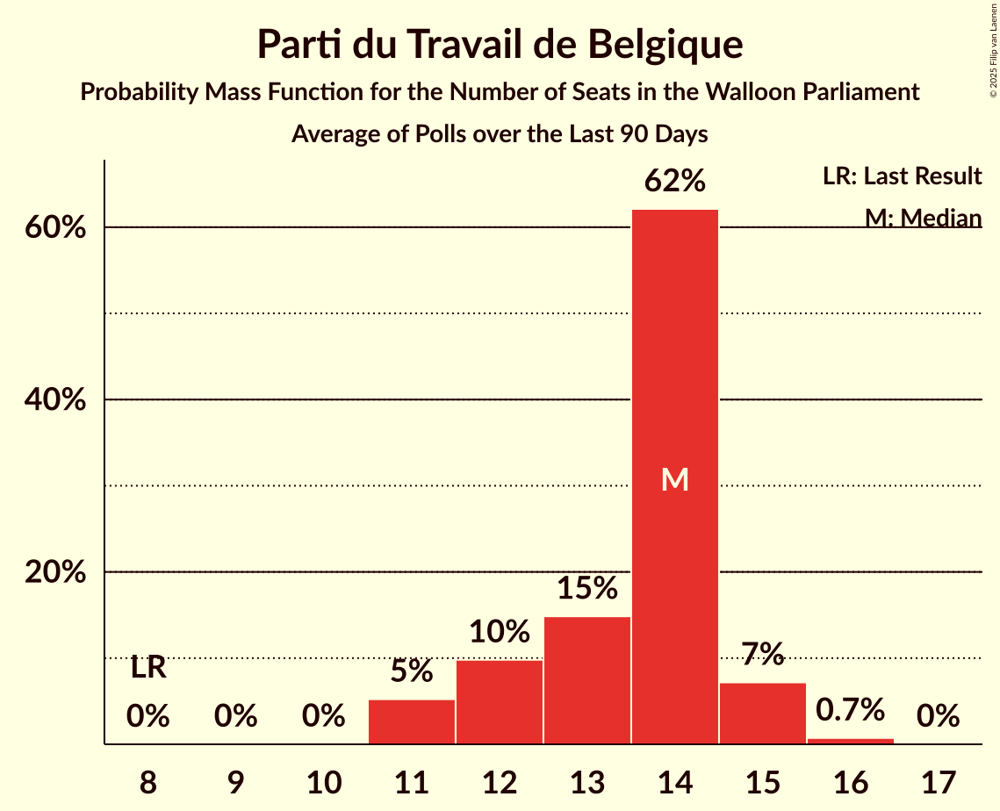

# Poll Average

<a href="#voting-intentions">Voting Intentions</a> | <a href="#seats">Seats</a> | <a href="#coalitions">Coalitions</a> | <a href="#technical-information">Technical Information</a>

## Summary

The table below lists the polls on which the average is based. They are the most recent polls (less than 90 days old) registered and analyzed so far.

| Period     | Polling firm/Commissioner(s) | PS | MR | ECOLO | PTB | LE | DÉFI | PP | DROITE |
|:----------:|:----------------------------:|:--:|:--:|:--:|:--:|:--:|:--:|:--:|:--:|
| 26 May 2019 | General Election | 26.2%   23 | 21.4%   20 | 14.5%   12 | 13.7%   10 | 11.0%   10 | 4.1%   0 | 3.7%   0 | 0.2%   0 |
| N/A | Poll Average | 20–31%   17–28 | 17–24%   14–21 | 9–17%   6–14 | 16–23%   14–20 | 9–16%   6–13 | 2–7%   0–4 | N/A   N/A | N/A   N/A |
| [10 September–9 October 2023](2023-10-09-Kantar.html) | Kantar   La Libre Belgique and RTBf | 23–32%   19–28 | 17–25%   14–21 | 9–15%   6–12 | 16–23%   12–20 | 8–14%   5–11 | 3–7%   0–4 | N/A   N/A | N/A   N/A |
| [18–25 September 2023](2023-09-25-Ipsos.html) | Ipsos   Het Laatste Nieuws, Le Soir, RTL TVi and VTM | 19–24%   17–21 | 17–22%   14–19 | 13–17%   10–14 | 17–22%   14–19 | 12–16%   9–13 | 2–4%   0 | N/A   N/A | N/A   N/A |
| 26 May 2019 | General Election | 26.2%   23 | 21.4%   20 | 14.5%   12 | 13.7%   10 | 11.0%   10 | 4.1%   0 | 3.7%   0 | 0.2%   0 |

Only polls for which at least the sample size has been published are included in the table above.

**Legend:**
+ **Top half of each row:** Voting intentions (95% confidence interval)
+ **Bottom half of each row:** Seat projections for the Walloon Parliament (95% confidence interval)
+ **PS:** Parti Socialiste
+ **MR:** Mouvement Réformateur
+ **ECOLO:** Ecolo
+ **PTB:** Parti du Travail de Belgique
+ **LE:** Les Engagés
+ **DÉFI:** DéFI
+ **PP:** Parti Populaire
+ **DROITE:** La Droite
+ **N/A (single party):** Party not included the published results
+ **N/A (entire row):** Calculation for this opinion poll not started yet

## Voting Intentions

### Confidence Intervals

| Party | Last Result | Median | 80% Confidence Interval | 90% Confidence Interval | 95% Confidence Interval | 99% Confidence Interval |
|:-----:|:-----------:|:------:|:-----------------------:|:-----------------------:|:-----------------------:|:-----------------------:|
| <a href="#parti-socialiste">Parti Socialiste</a> | 26.2% | 24.0% | 20.8–29.2% |20.2–30.2% | 19.7–31.0% | 18.9–32.5% |
| <a href="#mouvement-réformateur">Mouvement Réformateur</a> | 21.4% | 20.1% | 18.2–22.5% |17.7–23.3% | 17.2–24.0% | 16.3–25.5% |
| <a href="#ecolo">Ecolo</a> | 14.5% | 13.7% | 10.6–15.9% |9.9–16.5% | 9.4–16.9% | 8.5–17.7% |
| <a href="#parti-du-travail-de-belgique">Parti du Travail de Belgique</a> | 13.7% | 19.7% | 17.6–21.7% |16.9–22.3% | 16.3–22.8% | 15.2–24.1% |
| <a href="#les-engagés">Les Engagés</a> | 11.0% | 12.7% | 9.9–14.8% |9.3–15.3% | 8.8–15.7% | 7.9–16.5% |
| <a href="#défi">DéFI</a> | 4.1% | 3.5% | 2.3–5.6% |2.2–6.1% | 2.0–6.6% | 1.7–7.5% |
| <a href="#parti-populaire">Parti Populaire</a> | 3.7% | N/A | N/A |N/A | N/A | N/A |
| <a href="#la-droite">La Droite</a> | 0.2% | N/A | N/A |N/A | N/A | N/A |

### Parti Socialiste

*For a full overview of the results for this party, see the [Parti Socialiste](party-partisocialiste.html) page.*

| Voting Intentions | Probability | Accumulated | Special Marks |
|:-----------------:|:-----------:|:-----------:|:-------------:|
| 16.5–17.5% | 0% | 100% |  |
| 17.5–18.5% | 0.2% | 100% |  |
| 18.5–19.5% | 2% | 99.8% |  |
| 19.5–20.5% | 6% | 98% |  |
| 20.5–21.5% | 13% | 92% |  |
| 21.5–22.5% | 15% | 79% |  |
| 22.5–23.5% | 11% | 64% |  |
| 23.5–24.5% | 7% | 53% | Median |
| 24.5–25.5% | 6% | 47% |  |
| 25.5–26.5% | 8% | 40% | Last Result |
| 26.5–27.5% | 9% | 32% |  |
| 27.5–28.5% | 9% | 23% |  |
| 28.5–29.5% | 7% | 15% |  |
| 29.5–30.5% | 4% | 8% |  |
| 30.5–31.5% | 2% | 4% |  |
| 31.5–32.5% | 0.9% | 1.4% |  |
| 32.5–33.5% | 0.3% | 0.5% |  |
| 33.5–34.5% | 0.1% | 0.1% |  |
| 34.5–35.5% | 0% | 0% |  |

### Mouvement Réformateur

*For a full overview of the results for this party, see the [Mouvement Réformateur](party-mouvementréformateur.html) page.*

| Voting Intentions | Probability | Accumulated | Special Marks |
|:-----------------:|:-----------:|:-----------:|:-------------:|
| 13.5–14.5% | 0% | 100% |  |
| 14.5–15.5% | 0.1% | 100% |  |
| 15.5–16.5% | 0.7% | 99.9% |  |
| 16.5–17.5% | 3% | 99.2% |  |
| 17.5–18.5% | 11% | 96% |  |
| 18.5–19.5% | 21% | 85% |  |
| 19.5–20.5% | 24% | 64% | Median |
| 20.5–21.5% | 19% | 40% | Last Result |
| 21.5–22.5% | 11% | 21% |  |
| 22.5–23.5% | 6% | 10% |  |
| 23.5–24.5% | 3% | 4% |  |
| 24.5–25.5% | 1.0% | 1.5% |  |
| 25.5–26.5% | 0.3% | 0.5% |  |
| 26.5–27.5% | 0.1% | 0.1% |  |
| 27.5–28.5% | 0% | 0% |  |

### Ecolo

*For a full overview of the results for this party, see the [Ecolo](party-ecolo.html) page.*

| Voting Intentions | Probability | Accumulated | Special Marks |
|:-----------------:|:-----------:|:-----------:|:-------------:|
| 6.5–7.5% | 0% | 100% |  |
| 7.5–8.5% | 0.5% | 100% |  |
| 8.5–9.5% | 2% | 99.5% |  |
| 9.5–10.5% | 7% | 97% |  |
| 10.5–11.5% | 12% | 90% |  |
| 11.5–12.5% | 13% | 78% |  |
| 12.5–13.5% | 13% | 65% |  |
| 13.5–14.5% | 18% | 52% | Last Result, Median |
| 14.5–15.5% | 19% | 34% |  |
| 15.5–16.5% | 11% | 16% |  |
| 16.5–17.5% | 4% | 4% |  |
| 17.5–18.5% | 0.6% | 0.7% |  |
| 18.5–19.5% | 0.1% | 0.1% |  |
| 19.5–20.5% | 0% | 0% |  |

### Parti du Travail de Belgique

*For a full overview of the results for this party, see the [Parti du Travail de Belgique](party-partidutravaildebelgique.html) page.*

| Voting Intentions | Probability | Accumulated | Special Marks |
|:-----------------:|:-----------:|:-----------:|:-------------:|
| 12.5–13.5% | 0% | 100% |  |
| 13.5–14.5% | 0.1% | 100% | Last Result |
| 14.5–15.5% | 0.7% | 99.8% |  |
| 15.5–16.5% | 2% | 99.2% |  |
| 16.5–17.5% | 6% | 97% |  |
| 17.5–18.5% | 14% | 90% |  |
| 18.5–19.5% | 24% | 76% |  |
| 19.5–20.5% | 25% | 52% | Median |
| 20.5–21.5% | 17% | 28% |  |
| 21.5–22.5% | 8% | 11% |  |
| 22.5–23.5% | 3% | 3% |  |
| 23.5–24.5% | 0.7% | 1.0% |  |
| 24.5–25.5% | 0.2% | 0.2% |  |
| 25.5–26.5% | 0% | 0.1% |  |
| 26.5–27.5% | 0% | 0% |  |

### Les Engagés

*For a full overview of the results for this party, see the [Les Engagés](party-lesengagés.html) page.*

| Voting Intentions | Probability | Accumulated | Special Marks |
|:-----------------:|:-----------:|:-----------:|:-------------:|
| 5.5–6.5% | 0% | 100% |  |
| 6.5–7.5% | 0.2% | 100% |  |
| 7.5–8.5% | 1.4% | 99.8% |  |
| 8.5–9.5% | 5% | 98% |  |
| 9.5–10.5% | 11% | 93% |  |
| 10.5–11.5% | 14% | 83% | Last Result |
| 11.5–12.5% | 15% | 69% |  |
| 12.5–13.5% | 20% | 54% | Median |
| 13.5–14.5% | 20% | 34% |  |
| 14.5–15.5% | 10% | 14% |  |
| 15.5–16.5% | 3% | 3% |  |
| 16.5–17.5% | 0.4% | 0.5% |  |
| 17.5–18.5% | 0% | 0% |  |

### DéFI

*For a full overview of the results for this party, see the [DéFI](party-défi.html) page.*

| Voting Intentions | Probability | Accumulated | Special Marks |
|:-----------------:|:-----------:|:-----------:|:-------------:|
| 0.5–1.5% | 0.1% | 100% |  |
| 1.5–2.5% | 17% | 99.9% |  |
| 2.5–3.5% | 34% | 83% | Median |
| 3.5–4.5% | 20% | 49% | Last Result |
| 4.5–5.5% | 17% | 28% |  |
| 5.5–6.5% | 8% | 11% |  |
| 6.5–7.5% | 2% | 3% |  |
| 7.5–8.5% | 0.4% | 0.4% |  |
| 8.5–9.5% | 0% | 0% |  |
| 9.5–10.5% | 0% | 0% |  |

## Seats

### Confidence Intervals

| Party | Last Result | Median | 80% Confidence Interval | 90% Confidence Interval | 95% Confidence Interval | 99% Confidence Interval |
|:-----:|:-----------:|:------:|:-----------------------:|:-----------------------:|:-----------------------:|:-----------------------:|
| <a href="#parti-socialiste">Parti Socialiste</a> | 23 | 20 | 17–25 |17–26 | 17–28 | 16–29 |
| <a href="#mouvement-réformateur">Mouvement Réformateur</a> | 20 | 17 | 14–20 |14–20 | 14–21 | 14–22 |
| <a href="#ecolo">Ecolo</a> | 12 | 12 | 7–13 |6–13 | 6–14 | 6–14 |
| <a href="#parti-du-travail-de-belgique">Parti du Travail de Belgique</a> | 10 | 17 | 15–18 |14–19 | 14–20 | 11–20 |
| <a href="#les-engagés">Les Engagés</a> | 10 | 11 | 7–12 |6–13 | 6–13 | 4–14 |
| <a href="#défi">DéFI</a> | 0 | 0 | 0–1 |0–4 | 0–4 | 0–5 |
| <a href="#parti-populaire">Parti Populaire</a> | 0 | N/A | N/A |N/A | N/A | N/A |
| <a href="#la-droite">La Droite</a> | 0 | N/A | N/A |N/A | N/A | N/A |

### Parti Socialiste

*For a full overview of the results for this party, see the [Parti Socialiste](party-partisocialiste.html) page.*

| Number of Seats | Probability | Accumulated | Special Marks |
|:---------------:|:-----------:|:-----------:|:-------------:|
| 15 | 0.1% | 100% |  |
| 16 | 0.5% | 99.9% |  |
| 17 | 18% | 99.4% |  |
| 18 | 9% | 82% |  |
| 19 | 13% | 72% |  |
| 20 | 12% | 60% | Median |
| 21 | 8% | 48% |  |
| 22 | 12% | 40% |  |
| 23 | 12% | 27% | Last Result |
| 24 | 5% | 16% |  |
| 25 | 3% | 10% |  |
| 26 | 3% | 7% |  |
| 27 | 2% | 5% |  |
| 28 | 2% | 3% |  |
| 29 | 0.4% | 0.6% |  |
| 30 | 0.2% | 0.2% |  |
| 31 | 0% | 0% |  |

### Mouvement Réformateur

*For a full overview of the results for this party, see the [Mouvement Réformateur](party-mouvementréformateur.html) page.*

| Number of Seats | Probability | Accumulated | Special Marks |
|:---------------:|:-----------:|:-----------:|:-------------:|
| 12 | 0.1% | 100% |  |
| 13 | 0.2% | 99.9% |  |
| 14 | 14% | 99.6% |  |
| 15 | 11% | 85% |  |
| 16 | 15% | 75% |  |
| 17 | 23% | 60% | Median |
| 18 | 12% | 37% |  |
| 19 | 15% | 25% |  |
| 20 | 6% | 10% | Last Result |
| 21 | 3% | 4% |  |
| 22 | 0.3% | 0.5% |  |
| 23 | 0.1% | 0.2% |  |
| 24 | 0% | 0.1% |  |
| 25 | 0% | 0% |  |

### Ecolo

*For a full overview of the results for this party, see the [Ecolo](party-ecolo.html) page.*

| Number of Seats | Probability | Accumulated | Special Marks |
|:---------------:|:-----------:|:-----------:|:-------------:|
| 5 | 0.1% | 100% |  |
| 6 | 5% | 99.9% |  |
| 7 | 10% | 95% |  |
| 8 | 8% | 85% |  |
| 9 | 7% | 76% |  |
| 10 | 11% | 70% |  |
| 11 | 6% | 59% |  |
| 12 | 30% | 53% | Last Result, Median |
| 13 | 19% | 23% |  |
| 14 | 4% | 4% |  |
| 15 | 0.1% | 0.1% |  |
| 16 | 0% | 0% |  |

### Parti du Travail de Belgique

*For a full overview of the results for this party, see the [Parti du Travail de Belgique](party-partidutravaildebelgique.html) page.*

| Number of Seats | Probability | Accumulated | Special Marks |
|:---------------:|:-----------:|:-----------:|:-------------:|
| 10 | 0.4% | 100% | Last Result |
| 11 | 0.4% | 99.6% |  |
| 12 | 0.7% | 99.2% |  |
| 13 | 0.9% | 98.6% |  |
| 14 | 6% | 98% |  |
| 15 | 17% | 92% |  |
| 16 | 13% | 74% |  |
| 17 | 44% | 61% | Median |
| 18 | 12% | 18% |  |
| 19 | 3% | 6% |  |
| 20 | 3% | 3% |  |
| 21 | 0.4% | 0.4% |  |
| 22 | 0% | 0% |  |

### Les Engagés

*For a full overview of the results for this party, see the [Les Engagés](party-lesengagés.html) page.*

| Number of Seats | Probability | Accumulated | Special Marks |
|:---------------:|:-----------:|:-----------:|:-------------:|
| 4 | 0.5% | 100% |  |
| 5 | 0.9% | 99.5% |  |
| 6 | 6% | 98.6% |  |
| 7 | 12% | 93% |  |
| 8 | 7% | 81% |  |
| 9 | 9% | 74% |  |
| 10 | 11% | 65% | Last Result |
| 11 | 38% | 53% | Median |
| 12 | 10% | 15% |  |
| 13 | 5% | 6% |  |
| 14 | 0.5% | 0.5% |  |
| 15 | 0% | 0% |  |

### DéFI

*For a full overview of the results for this party, see the [DéFI](party-défi.html) page.*

| Number of Seats | Probability | Accumulated | Special Marks |
|:---------------:|:-----------:|:-----------:|:-------------:|
| 0 | 87% | 100% | Last Result, Median |
| 1 | 4% | 13% |  |
| 2 | 2% | 9% |  |
| 3 | 2% | 8% |  |
| 4 | 4% | 5% |  |
| 5 | 0.8% | 1.0% |  |
| 6 | 0.2% | 0.2% |  |
| 7 | 0% | 0% |  |

### Parti Populaire

*For a full overview of the results for this party, see the [Parti Populaire](party-partipopulaire.html) page.*

### La Droite

*For a full overview of the results for this party, see the [La Droite](party-ladroite.html) page.*

## Coalitions

### Confidence Intervals

| Coalition | Last Result | Median | Majority? | 80% Confidence Interval | 90% Confidence Interval | 95% Confidence Interval | 99% Confidence Interval |
|:---------:|:-----------:|:------:|:---------:|:-----------------------:|:-----------------------:|:-----------------------:|:-----------------------:|
| Parti Socialiste – Mouvement Réformateur – Ecolo | 55 | 48 | 100% | 45–52 | 45–53 | 44–54 | 43–55 |
| Parti Socialiste – Ecolo – Parti du Travail de Belgique | 45 | 48 | 100% | 45–50 | 45–51 | 44–52 | 42–54 |
| Parti Socialiste – Parti du Travail de Belgique – Les Engagés | 43 | 47 | 100% | 44–49 | 44–51 | 43–52 | 42–54 |
| Parti Socialiste – Ecolo – Les Engagés | 45 | 41 | 94% | 38–44 | 37–44 | 36–45 | 35–46 |
| Parti Socialiste – Mouvement Réformateur | 43 | 37 | 45% | 33–43 | 33–44 | 32–45 | 31–47 |
| Parti Socialiste – Parti du Travail de Belgique | 33 | 37 | 43% | 34–41 | 33–42 | 33–44 | 32–45 |
| Mouvement Réformateur – Ecolo – Les Engagés | 42 | 38 | 53% | 33–41 | 32–41 | 31–42 | 29–43 |
| Parti Socialiste – Ecolo | 35 | 31 | 1.1% | 29–34 | 28–35 | 28–36 | 26–38 |
| Parti Socialiste – Les Engagés | 33 | 30 | 0.7% | 28–34 | 27–35 | 27–36 | 26–38 |
| Mouvement Réformateur – Ecolo | 32 | 28 | 0% | 25–30 | 23–31 | 22–31 | 21–33 |
| Ecolo – Parti du Travail de Belgique | 22 | 28 | 0% | 23–30 | 22–31 | 21–31 | 20–33 |
| Mouvement Réformateur – Les Engagés | 30 | 27 | 0% | 24–29 | 23–30 | 22–30 | 20–32 |

### Parti Socialiste – Mouvement Réformateur – Ecolo

| Number of Seats | Probability | Accumulated | Special Marks |
|:---------------:|:-----------:|:-----------:|:-------------:|
| 42 | 0.1% | 100% |  |
| 43 | 0.6% | 99.9% |  |
| 44 | 2% | 99.3% |  |
| 45 | 8% | 97% |  |
| 46 | 13% | 89% |  |
| 47 | 21% | 76% |  |
| 48 | 15% | 56% |  |
| 49 | 12% | 41% | Median |
| 50 | 10% | 29% |  |
| 51 | 7% | 19% |  |
| 52 | 5% | 12% |  |
| 53 | 4% | 7% |  |
| 54 | 2% | 3% |  |
| 55 | 0.5% | 0.9% | Last Result |
| 56 | 0.2% | 0.4% |  |
| 57 | 0.1% | 0.2% |  |
| 58 | 0% | 0% |  |

### Parti Socialiste – Ecolo – Parti du Travail de Belgique

| Number of Seats | Probability | Accumulated | Special Marks |
|:---------------:|:-----------:|:-----------:|:-------------:|
| 40 | 0% | 100% |  |
| 41 | 0.1% | 99.9% |  |
| 42 | 0.4% | 99.8% |  |
| 43 | 1.2% | 99.5% |  |
| 44 | 2% | 98% |  |
| 45 | 8% | 96% | Last Result |
| 46 | 11% | 88% |  |
| 47 | 27% | 77% |  |
| 48 | 15% | 51% |  |
| 49 | 14% | 35% | Median |
| 50 | 13% | 21% |  |
| 51 | 4% | 8% |  |
| 52 | 2% | 4% |  |
| 53 | 0.9% | 2% |  |
| 54 | 0.6% | 0.9% |  |
| 55 | 0.3% | 0.3% |  |
| 56 | 0% | 0.1% |  |
| 57 | 0% | 0% |  |

### Parti Socialiste – Parti du Travail de Belgique – Les Engagés

| Number of Seats | Probability | Accumulated | Special Marks |
|:---------------:|:-----------:|:-----------:|:-------------:|
| 40 | 0% | 100% |  |
| 41 | 0.2% | 99.9% |  |
| 42 | 1.0% | 99.7% |  |
| 43 | 3% | 98.7% | Last Result |
| 44 | 6% | 96% |  |
| 45 | 13% | 90% |  |
| 46 | 19% | 77% |  |
| 47 | 19% | 58% |  |
| 48 | 15% | 39% | Median |
| 49 | 14% | 24% |  |
| 50 | 4% | 10% |  |
| 51 | 3% | 6% |  |
| 52 | 2% | 4% |  |
| 53 | 0.9% | 2% |  |
| 54 | 0.5% | 0.6% |  |
| 55 | 0.1% | 0.1% |  |
| 56 | 0% | 0% |  |

### Parti Socialiste – Ecolo – Les Engagés

| Number of Seats | Probability | Accumulated | Special Marks |
|:---------------:|:-----------:|:-----------:|:-------------:|
| 33 | 0.1% | 100% |  |
| 34 | 0.3% | 99.9% |  |
| 35 | 0.7% | 99.6% |  |
| 36 | 2% | 98.9% |  |
| 37 | 3% | 97% |  |
| 38 | 5% | 94% | Majority |
| 39 | 12% | 89% |  |
| 40 | 12% | 77% |  |
| 41 | 22% | 66% |  |
| 42 | 16% | 44% |  |
| 43 | 12% | 28% | Median |
| 44 | 12% | 16% |  |
| 45 | 3% | 4% | Last Result |
| 46 | 1.2% | 1.5% |  |
| 47 | 0.2% | 0.3% |  |
| 48 | 0.1% | 0.1% |  |
| 49 | 0% | 0.1% |  |
| 50 | 0% | 0% |  |

### Parti Socialiste – Mouvement Réformateur

| Number of Seats | Probability | Accumulated | Special Marks |
|:---------------:|:-----------:|:-----------:|:-------------:|
| 31 | 1.0% | 100% |  |
| 32 | 3% | 98.9% |  |
| 33 | 8% | 96% |  |
| 34 | 15% | 88% |  |
| 35 | 11% | 73% |  |
| 36 | 10% | 62% |  |
| 37 | 7% | 52% | Median |
| 38 | 5% | 45% | Majority |
| 39 | 5% | 40% |  |
| 40 | 6% | 36% |  |
| 41 | 9% | 29% |  |
| 42 | 8% | 20% |  |
| 43 | 6% | 12% | Last Result |
| 44 | 3% | 6% |  |
| 45 | 1.4% | 3% |  |
| 46 | 1.0% | 2% |  |
| 47 | 0.5% | 0.8% |  |
| 48 | 0.2% | 0.3% |  |
| 49 | 0.1% | 0.1% |  |
| 50 | 0% | 0% |  |

### Parti Socialiste – Parti du Travail de Belgique

| Number of Seats | Probability | Accumulated | Special Marks |
|:---------------:|:-----------:|:-----------:|:-------------:|
| 31 | 0.3% | 100% |  |
| 32 | 1.1% | 99.7% |  |
| 33 | 4% | 98.6% | Last Result |
| 34 | 12% | 95% |  |
| 35 | 16% | 82% |  |
| 36 | 12% | 67% |  |
| 37 | 11% | 55% | Median |
| 38 | 14% | 43% | Majority |
| 39 | 9% | 29% |  |
| 40 | 7% | 20% |  |
| 41 | 4% | 13% |  |
| 42 | 3% | 8% |  |
| 43 | 2% | 5% |  |
| 44 | 1.5% | 3% |  |
| 45 | 0.9% | 1.0% |  |
| 46 | 0.1% | 0.2% |  |
| 47 | 0% | 0% |  |

### Mouvement Réformateur – Ecolo – Les Engagés

| Number of Seats | Probability | Accumulated | Special Marks |
|:---------------:|:-----------:|:-----------:|:-------------:|
| 27 | 0.1% | 100% |  |
| 28 | 0.2% | 99.9% |  |
| 29 | 0.5% | 99.7% |  |
| 30 | 1.1% | 99.3% |  |
| 31 | 2% | 98% |  |
| 32 | 3% | 96% |  |
| 33 | 5% | 93% |  |
| 34 | 6% | 87% |  |
| 35 | 7% | 81% |  |
| 36 | 9% | 74% |  |
| 37 | 12% | 65% |  |
| 38 | 10% | 53% | Majority |
| 39 | 11% | 43% |  |
| 40 | 16% | 33% | Median |
| 41 | 12% | 17% |  |
| 42 | 4% | 5% | Last Result |
| 43 | 1.0% | 1.3% |  |
| 44 | 0.3% | 0.3% |  |
| 45 | 0% | 0% |  |

### Parti Socialiste – Ecolo

| Number of Seats | Probability | Accumulated | Special Marks |
|:---------------:|:-----------:|:-----------:|:-------------:|
| 25 | 0.2% | 100% |  |
| 26 | 0.5% | 99.8% |  |
| 27 | 1.1% | 99.4% |  |
| 28 | 4% | 98% |  |
| 29 | 11% | 94% |  |
| 30 | 22% | 83% |  |
| 31 | 18% | 60% |  |
| 32 | 16% | 43% | Median |
| 33 | 12% | 26% |  |
| 34 | 6% | 14% |  |
| 35 | 4% | 8% | Last Result |
| 36 | 2% | 4% |  |
| 37 | 0.9% | 2% |  |
| 38 | 0.7% | 1.1% | Majority |
| 39 | 0.3% | 0.5% |  |
| 40 | 0.1% | 0.1% |  |
| 41 | 0% | 0% |  |

### Parti Socialiste – Les Engagés

| Number of Seats | Probability | Accumulated | Special Marks |
|:---------------:|:-----------:|:-----------:|:-------------:|
| 24 | 0.1% | 100% |  |
| 25 | 0.3% | 99.9% |  |
| 26 | 1.3% | 99.6% |  |
| 27 | 4% | 98% |  |
| 28 | 14% | 95% |  |
| 29 | 15% | 81% |  |
| 30 | 17% | 65% |  |
| 31 | 19% | 48% | Median |
| 32 | 13% | 29% |  |
| 33 | 6% | 16% | Last Result |
| 34 | 5% | 11% |  |
| 35 | 2% | 5% |  |
| 36 | 1.5% | 3% |  |
| 37 | 0.7% | 1.5% |  |
| 38 | 0.4% | 0.7% | Majority |
| 39 | 0.3% | 0.3% |  |
| 40 | 0% | 0% |  |

### Mouvement Réformateur – Ecolo

| Number of Seats | Probability | Accumulated | Special Marks |
|:---------------:|:-----------:|:-----------:|:-------------:|
| 20 | 0.2% | 100% |  |
| 21 | 0.7% | 99.7% |  |
| 22 | 2% | 99.0% |  |
| 23 | 3% | 97% |  |
| 24 | 4% | 94% |  |
| 25 | 5% | 90% |  |
| 26 | 14% | 85% |  |
| 27 | 16% | 71% |  |
| 28 | 18% | 56% |  |
| 29 | 19% | 38% | Median |
| 30 | 12% | 19% |  |
| 31 | 5% | 7% |  |
| 32 | 2% | 2% | Last Result |
| 33 | 0.6% | 0.6% |  |
| 34 | 0.1% | 0.1% |  |
| 35 | 0% | 0% |  |

### Ecolo – Parti du Travail de Belgique

| Number of Seats | Probability | Accumulated | Special Marks |
|:---------------:|:-----------:|:-----------:|:-------------:|
| 17 | 0.1% | 100% |  |
| 18 | 0.1% | 99.9% |  |
| 19 | 0.2% | 99.8% |  |
| 20 | 0.4% | 99.6% |  |
| 21 | 2% | 99.2% |  |
| 22 | 5% | 97% | Last Result |
| 23 | 7% | 92% |  |
| 24 | 8% | 85% |  |
| 25 | 7% | 78% |  |
| 26 | 6% | 70% |  |
| 27 | 11% | 64% |  |
| 28 | 11% | 53% |  |
| 29 | 15% | 41% | Median |
| 30 | 20% | 26% |  |
| 31 | 4% | 5% |  |
| 32 | 1.1% | 2% |  |
| 33 | 0.5% | 0.6% |  |
| 34 | 0% | 0% |  |

### Mouvement Réformateur – Les Engagés

| Number of Seats | Probability | Accumulated | Special Marks |
|:---------------:|:-----------:|:-----------:|:-------------:|
| 19 | 0.1% | 100% |  |
| 20 | 0.4% | 99.9% |  |
| 21 | 1.1% | 99.5% |  |
| 22 | 2% | 98% |  |
| 23 | 3% | 97% |  |
| 24 | 5% | 93% |  |
| 25 | 14% | 88% |  |
| 26 | 15% | 74% |  |
| 27 | 15% | 59% |  |
| 28 | 26% | 44% | Median |
| 29 | 10% | 18% |  |
| 30 | 6% | 8% | Last Result |
| 31 | 2% | 2% |  |
| 32 | 0.6% | 0.8% |  |
| 33 | 0.1% | 0.1% |  |
| 34 | 0% | 0% |  |

## Technical Information

+ **Number of polls included in this average:** 2
+ **Lowest number of simulations done in a poll included in this average:** 1,048,576
+ **Total number of simulations done in the polls included in this average:** 2,097,152
+ **Error estimate:** 0.90%
