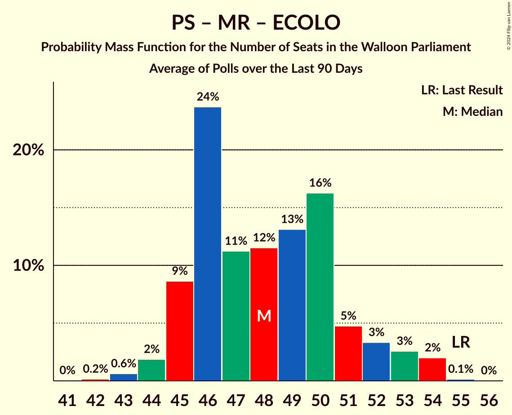

# Poll Average

<a href="#voting-intentions">Voting Intentions</a> | <a href="#seats">Seats</a> | <a href="#coalitions">Coalitions</a> | <a href="#technical-information">Technical Information</a>

## Summary

The table below lists the polls on which the average is based. They are the most recent polls (less than 90 days old) registered and analyzed so far.

| Period     | Polling firm/Commissioner(s) | PS | MR | ECOLO | PTB | CDH | DÉFI | PP | DROITE |
|:----------:|:----------------------------:|:--:|:--:|:--:|:--:|:--:|:--:|:--:|:--:|
| 26 May 2019 | General Election | 26.2%   23 | 21.4%   20 | 14.5%   12 | 13.7%   10 | 11.0%   10 | 4.1%   0 | 3.7%   0 | 0.2%   0 |
| N/A | Poll Average | 21–26%   19–23 | 18–23%   15–21 | 11–15%   9–13 | 16–20%   14–18 | 8–11%   5–9 | 4–7%   0–5 | N/A   N/A | N/A   N/A |
| [21–29 November 2022](2022-11-29-Ipsos.html) | Ipsos   Het Laatste Nieuws, Le Soir, RTL TVi and VTM | 21–26%   19–23 | 18–23%   15–21 | 11–15%   9–13 | 16–20%   14–18 | 7–11%   5–9 | 4–7%   0–5 | N/A   N/A | N/A   N/A |
| 26 May 2019 | General Election | 26.2%   23 | 21.4%   20 | 14.5%   12 | 13.7%   10 | 11.0%   10 | 4.1%   0 | 3.7%   0 | 0.2%   0 |

Only polls for which at least the sample size has been published are included in the table above.

**Legend:**
+ **Top half of each row:** Voting intentions (95% confidence interval)
+ **Bottom half of each row:** Seat projections for the Walloon Parliament (95% confidence interval)
+ **PS:** Parti Socialiste
+ **MR:** Mouvement Réformateur
+ **ECOLO:** Ecolo
+ **PTB:** Parti du Travail de Belgique
+ **CDH:** Centre démocrate humaniste
+ **DÉFI:** DéFI
+ **PP:** Parti Populaire
+ **DROITE:** La Droite
+ **N/A (single party):** Party not included the published results
+ **N/A (entire row):** Calculation for this opinion poll not started yet

## Voting Intentions

### Confidence Intervals

| Party | Last Result | Median | 80% Confidence Interval | 90% Confidence Interval | 95% Confidence Interval | 99% Confidence Interval |
|:-----:|:-----------:|:------:|:-----------------------:|:-----------------------:|:-----------------------:|:-----------------------:|
| <a href="#parti-socialiste">Parti Socialiste</a> | 26.2% | 23.7% | 22.0–25.4% |21.5–25.9% | 21.1–26.4% | 20.4–27.3% |
| <a href="#mouvement-réformateur">Mouvement Réformateur</a> | 21.4% | 20.4% | 18.8–22.1% |18.4–22.5% | 18.0–23.0% | 17.3–23.8% |
| <a href="#ecolo">Ecolo</a> | 14.5% | 13.1% | 11.8–14.5% |11.4–14.9% | 11.1–15.3% | 10.5–16.0% |
| <a href="#parti-du-travail-de-belgique">Parti du Travail de Belgique</a> | 13.7% | 17.9% | 16.4–19.5% |16.0–20.0% | 15.6–20.4% | 14.9–21.2% |
| <a href="#centre-démocrate-humaniste">Centre démocrate humaniste</a> | 11.0% | 9.1% | 8.0–10.3% |7.7–10.7% | 7.5–11.0% | 7.0–11.7% |
| <a href="#défi">DéFI</a> | 4.1% | 5.3% | 4.5–6.3% |4.3–6.6% | 4.1–6.9% | 3.7–7.4% |
| <a href="#parti-populaire">Parti Populaire</a> | 3.7% | N/A | N/A |N/A | N/A | N/A |
| <a href="#la-droite">La Droite</a> | 0.2% | N/A | N/A |N/A | N/A | N/A |

### Parti Socialiste

*For a full overview of the results for this party, see the [Parti Socialiste](party-partisocialiste.html) page.*

| Voting Intentions | Probability | Accumulated | Special Marks |
|:-----------------:|:-----------:|:-----------:|:-------------:|
| 18.5–19.5% | 0.1% | 100% |  |
| 19.5–20.5% | 0.7% | 99.9% |  |
| 20.5–21.5% | 4% | 99.2% |  |
| 21.5–22.5% | 15% | 95% |  |
| 22.5–23.5% | 26% | 80% |  |
| 23.5–24.5% | 28% | 54% | Median |
| 24.5–25.5% | 17% | 26% |  |
| 25.5–26.5% | 7% | 9% | Last Result |
| 26.5–27.5% | 2% | 2% |  |
| 27.5–28.5% | 0.2% | 0.3% |  |
| 28.5–29.5% | 0% | 0% |  |

### Mouvement Réformateur

*For a full overview of the results for this party, see the [Mouvement Réformateur](party-mouvementréformateur.html) page.*

| Voting Intentions | Probability | Accumulated | Special Marks |
|:-----------------:|:-----------:|:-----------:|:-------------:|
| 14.5–15.5% | 0% | 100% |  |
| 15.5–16.5% | 0.1% | 100% |  |
| 16.5–17.5% | 0.9% | 99.9% |  |
| 17.5–18.5% | 6% | 99.0% |  |
| 18.5–19.5% | 18% | 93% |  |
| 19.5–20.5% | 29% | 75% | Median |
| 20.5–21.5% | 27% | 45% | Last Result |
| 21.5–22.5% | 14% | 19% |  |
| 22.5–23.5% | 4% | 5% |  |
| 23.5–24.5% | 0.8% | 0.8% |  |
| 24.5–25.5% | 0.1% | 0.1% |  |
| 25.5–26.5% | 0% | 0% |  |

### Ecolo

*For a full overview of the results for this party, see the [Ecolo](party-ecolo.html) page.*

| Voting Intentions | Probability | Accumulated | Special Marks |
|:-----------------:|:-----------:|:-----------:|:-------------:|
| 8.5–9.5% | 0% | 100% |  |
| 9.5–10.5% | 0.5% | 100% |  |
| 10.5–11.5% | 6% | 99.5% |  |
| 11.5–12.5% | 23% | 94% |  |
| 12.5–13.5% | 36% | 71% | Median |
| 13.5–14.5% | 25% | 35% | Last Result |
| 14.5–15.5% | 8% | 10% |  |
| 15.5–16.5% | 1.4% | 2% |  |
| 16.5–17.5% | 0.1% | 0.1% |  |
| 17.5–18.5% | 0% | 0% |  |

### Parti du Travail de Belgique

*For a full overview of the results for this party, see the [Parti du Travail de Belgique](party-partidutravaildebelgique.html) page.*

| Voting Intentions | Probability | Accumulated | Special Marks |
|:-----------------:|:-----------:|:-----------:|:-------------:|
| 12.5–13.5% | 0% | 100% |  |
| 13.5–14.5% | 0.2% | 100% | Last Result |
| 14.5–15.5% | 2% | 99.8% |  |
| 15.5–16.5% | 11% | 98% |  |
| 16.5–17.5% | 25% | 87% |  |
| 17.5–18.5% | 32% | 62% | Median |
| 18.5–19.5% | 21% | 30% |  |
| 19.5–20.5% | 7% | 9% |  |
| 20.5–21.5% | 2% | 2% |  |
| 21.5–22.5% | 0.2% | 0.2% |  |
| 22.5–23.5% | 0% | 0% |  |

### Centre démocrate humaniste

*For a full overview of the results for this party, see the [Centre démocrate humaniste](party-centredémocratehumaniste.html) page.*

| Voting Intentions | Probability | Accumulated | Special Marks |
|:-----------------:|:-----------:|:-----------:|:-------------:|
| 4.5–5.5% | 0% | 100% |  |
| 5.5–6.5% | 0.1% | 100% |  |
| 6.5–7.5% | 3% | 99.9% |  |
| 7.5–8.5% | 22% | 97% |  |
| 8.5–9.5% | 42% | 74% | Median |
| 9.5–10.5% | 26% | 32% |  |
| 10.5–11.5% | 6% | 7% | Last Result |
| 11.5–12.5% | 0.6% | 0.7% |  |
| 12.5–13.5% | 0% | 0% |  |

### DéFI

*For a full overview of the results for this party, see the [DéFI](party-défi.html) page.*

| Voting Intentions | Probability | Accumulated | Special Marks |
|:-----------------:|:-----------:|:-----------:|:-------------:|
| 1.5–2.5% | 0% | 100% |  |
| 2.5–3.5% | 0.2% | 100% |  |
| 3.5–4.5% | 12% | 99.8% | Last Result |
| 4.5–5.5% | 49% | 88% | Median |
| 5.5–6.5% | 34% | 39% |  |
| 6.5–7.5% | 5% | 6% |  |
| 7.5–8.5% | 0.3% | 0.3% |  |
| 8.5–9.5% | 0% | 0% |  |

## Seats

### Confidence Intervals

| Party | Last Result | Median | 80% Confidence Interval | 90% Confidence Interval | 95% Confidence Interval | 99% Confidence Interval |
|:-----:|:-----------:|:------:|:-----------------------:|:-----------------------:|:-----------------------:|:-----------------------:|
| <a href="#parti-socialiste">Parti Socialiste</a> | 23 | 21 | 19–22 |19–23 | 19–23 | 17–24 |
| <a href="#mouvement-réformateur">Mouvement Réformateur</a> | 20 | 19 | 17–20 |16–21 | 15–21 | 15–21 |
| <a href="#ecolo">Ecolo</a> | 12 | 12 | 9–13 |9–13 | 9–13 | 8–14 |
| <a href="#parti-du-travail-de-belgique">Parti du Travail de Belgique</a> | 10 | 16 | 15–17 |15–17 | 14–18 | 12–19 |
| <a href="#centre-démocrate-humaniste">Centre démocrate humaniste</a> | 10 | 6 | 6–7 |5–8 | 5–9 | 4–10 |
| <a href="#défi">DéFI</a> | 0 | 1 | 0–4 |0–4 | 0–5 | 0–5 |
| <a href="#parti-populaire">Parti Populaire</a> | 0 | N/A | N/A |N/A | N/A | N/A |
| <a href="#la-droite">La Droite</a> | 0 | N/A | N/A |N/A | N/A | N/A |

### Parti Socialiste

*For a full overview of the results for this party, see the [Parti Socialiste](party-partisocialiste.html) page.*

| Number of Seats | Probability | Accumulated | Special Marks |
|:---------------:|:-----------:|:-----------:|:-------------:|
| 17 | 0.7% | 100% |  |
| 18 | 2% | 99.3% |  |
| 19 | 11% | 98% |  |
| 20 | 21% | 86% |  |
| 21 | 34% | 66% | Median |
| 22 | 22% | 31% |  |
| 23 | 9% | 10% | Last Result |
| 24 | 0.8% | 1.0% |  |
| 25 | 0.2% | 0.2% |  |
| 26 | 0% | 0.1% |  |
| 27 | 0% | 0% |  |

### Mouvement Réformateur

*For a full overview of the results for this party, see the [Mouvement Réformateur](party-mouvementréformateur.html) page.*

| Number of Seats | Probability | Accumulated | Special Marks |
|:---------------:|:-----------:|:-----------:|:-------------:|
| 14 | 0.4% | 100% |  |
| 15 | 2% | 99.6% |  |
| 16 | 4% | 97% |  |
| 17 | 12% | 93% |  |
| 18 | 30% | 82% |  |
| 19 | 25% | 51% | Median |
| 20 | 17% | 26% | Last Result |
| 21 | 9% | 10% |  |
| 22 | 0.2% | 0.2% |  |
| 23 | 0% | 0.1% |  |
| 24 | 0% | 0% |  |

### Ecolo

*For a full overview of the results for this party, see the [Ecolo](party-ecolo.html) page.*

| Number of Seats | Probability | Accumulated | Special Marks |
|:---------------:|:-----------:|:-----------:|:-------------:|
| 7 | 0.2% | 100% |  |
| 8 | 2% | 99.8% |  |
| 9 | 8% | 98% |  |
| 10 | 16% | 90% |  |
| 11 | 17% | 74% |  |
| 12 | 46% | 57% | Last Result, Median |
| 13 | 10% | 11% |  |
| 14 | 1.1% | 1.1% |  |
| 15 | 0% | 0% |  |

### Parti du Travail de Belgique

*For a full overview of the results for this party, see the [Parti du Travail de Belgique](party-partidutravaildebelgique.html) page.*

| Number of Seats | Probability | Accumulated | Special Marks |
|:---------------:|:-----------:|:-----------:|:-------------:|
| 10 | 0.1% | 100% | Last Result |
| 11 | 0.2% | 99.9% |  |
| 12 | 0.3% | 99.7% |  |
| 13 | 0.4% | 99.4% |  |
| 14 | 2% | 99.0% |  |
| 15 | 33% | 97% |  |
| 16 | 23% | 63% | Median |
| 17 | 37% | 41% |  |
| 18 | 3% | 4% |  |
| 19 | 0.6% | 0.9% |  |
| 20 | 0.3% | 0.3% |  |
| 21 | 0% | 0% |  |

### Centre démocrate humaniste

*For a full overview of the results for this party, see the [Centre démocrate humaniste](party-centredémocratehumaniste.html) page.*

| Number of Seats | Probability | Accumulated | Special Marks |
|:---------------:|:-----------:|:-----------:|:-------------:|
| 4 | 2% | 100% |  |
| 5 | 6% | 98% |  |
| 6 | 51% | 91% | Median |
| 7 | 32% | 40% |  |
| 8 | 5% | 8% |  |
| 9 | 2% | 4% |  |
| 10 | 1.1% | 2% | Last Result |
| 11 | 0.4% | 0.4% |  |
| 12 | 0% | 0% |  |

### DéFI

*For a full overview of the results for this party, see the [DéFI](party-défi.html) page.*

| Number of Seats | Probability | Accumulated | Special Marks |
|:---------------:|:-----------:|:-----------:|:-------------:|
| 0 | 44% | 100% | Last Result |
| 1 | 11% | 56% | Median |
| 2 | 6% | 45% |  |
| 3 | 13% | 39% |  |
| 4 | 22% | 26% |  |
| 5 | 4% | 5% |  |
| 6 | 0.3% | 0.3% |  |
| 7 | 0% | 0% |  |

### Parti Populaire

*For a full overview of the results for this party, see the [Parti Populaire](party-partipopulaire.html) page.*

### La Droite

*For a full overview of the results for this party, see the [La Droite](party-ladroite.html) page.*

## Coalitions

### Confidence Intervals

| Coalition | Last Result | Median | Majority? | 80% Confidence Interval | 90% Confidence Interval | 95% Confidence Interval | 99% Confidence Interval |
|:---------:|:-----------:|:------:|:---------:|:-----------------------:|:-----------------------:|:-----------------------:|:-----------------------:|
| Parti Socialiste – Mouvement Réformateur – Ecolo | 55 | 51 | 100% | 48–53 | 48–54 | 47–54 | 46–55 |
| Parti Socialiste – Ecolo – Parti du Travail de Belgique | 45 | 48 | 100% | 46–50 | 45–50 | 44–51 | 43–52 |
| Parti Socialiste – Parti du Travail de Belgique – Centre démocrate humaniste | 43 | 43 | 100% | 42–45 | 41–46 | 40–47 | 39–48 |
| Parti Socialiste – Mouvement Réformateur | 43 | 40 | 85% | 37–42 | 37–42 | 36–43 | 35–43 |
| Parti Socialiste – Ecolo – Centre démocrate humaniste | 45 | 39 | 77% | 36–41 | 36–41 | 35–42 | 34–44 |
| Mouvement Réformateur – Ecolo – Centre démocrate humaniste | 42 | 36 | 23% | 34–39 | 33–39 | 33–40 | 32–41 |
| Parti Socialiste – Parti du Travail de Belgique | 33 | 37 | 40% | 35–39 | 34–39 | 34–39 | 33–41 |
| Parti Socialiste – Ecolo | 35 | 32 | 0% | 30–34 | 29–35 | 29–35 | 28–36 |
| Mouvement Réformateur – Ecolo | 32 | 30 | 0% | 28–32 | 27–33 | 27–33 | 25–34 |
| Parti Socialiste – Centre démocrate humaniste | 33 | 27 | 0% | 26–29 | 25–30 | 25–31 | 23–32 |
| Ecolo – Parti du Travail de Belgique | 22 | 27 | 0% | 25–29 | 24–30 | 24–30 | 23–31 |
| Mouvement Réformateur – Centre démocrate humaniste | 30 | 25 | 0% | 23–27 | 22–28 | 22–28 | 21–29 |

### Parti Socialiste – Mouvement Réformateur – Ecolo

| Number of Seats | Probability | Accumulated | Special Marks |
|:---------------:|:-----------:|:-----------:|:-------------:|
| 44 | 0.1% | 100% |  |
| 45 | 0.2% | 99.9% |  |
| 46 | 0.6% | 99.7% |  |
| 47 | 3% | 99.1% |  |
| 48 | 9% | 96% |  |
| 49 | 12% | 87% |  |
| 50 | 19% | 76% |  |
| 51 | 21% | 57% |  |
| 52 | 15% | 36% | Median |
| 53 | 12% | 21% |  |
| 54 | 8% | 9% |  |
| 55 | 0.6% | 0.8% | Last Result |
| 56 | 0.1% | 0.2% |  |
| 57 | 0% | 0% |  |

### Parti Socialiste – Ecolo – Parti du Travail de Belgique

| Number of Seats | Probability | Accumulated | Special Marks |
|:---------------:|:-----------:|:-----------:|:-------------:|
| 42 | 0.1% | 100% |  |
| 43 | 0.6% | 99.9% |  |
| 44 | 2% | 99.2% |  |
| 45 | 3% | 97% | Last Result |
| 46 | 8% | 94% |  |
| 47 | 18% | 86% |  |
| 48 | 22% | 69% |  |
| 49 | 19% | 46% | Median |
| 50 | 24% | 28% |  |
| 51 | 3% | 4% |  |
| 52 | 1.0% | 1.3% |  |
| 53 | 0.2% | 0.2% |  |
| 54 | 0% | 0% |  |

### Parti Socialiste – Parti du Travail de Belgique – Centre démocrate humaniste

| Number of Seats | Probability | Accumulated | Special Marks |
|:---------------:|:-----------:|:-----------:|:-------------:|
| 38 | 0.2% | 100% | Majority |
| 39 | 0.7% | 99.8% |  |
| 40 | 3% | 99.1% |  |
| 41 | 6% | 97% |  |
| 42 | 20% | 90% |  |
| 43 | 22% | 70% | Last Result, Median |
| 44 | 24% | 47% |  |
| 45 | 14% | 23% |  |
| 46 | 6% | 9% |  |
| 47 | 2% | 3% |  |
| 48 | 0.7% | 0.9% |  |
| 49 | 0.2% | 0.2% |  |
| 50 | 0% | 0% |  |

### Parti Socialiste – Mouvement Réformateur

| Number of Seats | Probability | Accumulated | Special Marks |
|:---------------:|:-----------:|:-----------:|:-------------:|
| 33 | 0% | 100% |  |
| 34 | 0.2% | 99.9% |  |
| 35 | 0.9% | 99.7% |  |
| 36 | 3% | 98.9% |  |
| 37 | 10% | 96% |  |
| 38 | 15% | 85% | Majority |
| 39 | 18% | 70% |  |
| 40 | 17% | 52% | Median |
| 41 | 23% | 34% |  |
| 42 | 8% | 11% |  |
| 43 | 3% | 3% | Last Result |
| 44 | 0.3% | 0.3% |  |
| 45 | 0.1% | 0.1% |  |
| 46 | 0% | 0% |  |

### Parti Socialiste – Ecolo – Centre démocrate humaniste

| Number of Seats | Probability | Accumulated | Special Marks |
|:---------------:|:-----------:|:-----------:|:-------------:|
| 33 | 0.2% | 100% |  |
| 34 | 0.6% | 99.8% |  |
| 35 | 3% | 99.3% |  |
| 36 | 7% | 96% |  |
| 37 | 12% | 89% |  |
| 38 | 18% | 77% | Majority |
| 39 | 34% | 59% | Median |
| 40 | 13% | 26% |  |
| 41 | 9% | 13% |  |
| 42 | 2% | 4% |  |
| 43 | 1.3% | 2% |  |
| 44 | 0.5% | 0.6% |  |
| 45 | 0.1% | 0.1% | Last Result |
| 46 | 0% | 0% |  |

### Mouvement Réformateur – Ecolo – Centre démocrate humaniste

| Number of Seats | Probability | Accumulated | Special Marks |
|:---------------:|:-----------:|:-----------:|:-------------:|
| 31 | 0.1% | 100% |  |
| 32 | 0.7% | 99.9% |  |
| 33 | 5% | 99.1% |  |
| 34 | 9% | 95% |  |
| 35 | 16% | 85% |  |
| 36 | 21% | 69% |  |
| 37 | 26% | 48% | Median |
| 38 | 13% | 23% | Majority |
| 39 | 7% | 10% |  |
| 40 | 2% | 3% |  |
| 41 | 0.5% | 0.7% |  |
| 42 | 0.1% | 0.2% | Last Result |
| 43 | 0% | 0% |  |

### Parti Socialiste – Parti du Travail de Belgique

| Number of Seats | Probability | Accumulated | Special Marks |
|:---------------:|:-----------:|:-----------:|:-------------:|
| 31 | 0.1% | 100% |  |
| 32 | 0.2% | 99.9% |  |
| 33 | 0.9% | 99.6% | Last Result |
| 34 | 4% | 98.7% |  |
| 35 | 9% | 95% |  |
| 36 | 22% | 86% |  |
| 37 | 24% | 64% | Median |
| 38 | 30% | 40% | Majority |
| 39 | 8% | 10% |  |
| 40 | 1.4% | 2% |  |
| 41 | 0.5% | 0.6% |  |
| 42 | 0.1% | 0.1% |  |
| 43 | 0% | 0% |  |

### Parti Socialiste – Ecolo

| Number of Seats | Probability | Accumulated | Special Marks |
|:---------------:|:-----------:|:-----------:|:-------------:|
| 26 | 0.1% | 100% |  |
| 27 | 0.2% | 99.9% |  |
| 28 | 1.1% | 99.7% |  |
| 29 | 5% | 98.6% |  |
| 30 | 9% | 94% |  |
| 31 | 16% | 85% |  |
| 32 | 20% | 69% |  |
| 33 | 29% | 48% | Median |
| 34 | 11% | 19% |  |
| 35 | 7% | 8% | Last Result |
| 36 | 0.7% | 0.8% |  |
| 37 | 0.1% | 0.2% |  |
| 38 | 0% | 0% | Majority |

### Mouvement Réformateur – Ecolo

| Number of Seats | Probability | Accumulated | Special Marks |
|:---------------:|:-----------:|:-----------:|:-------------:|
| 24 | 0.2% | 100% |  |
| 25 | 0.4% | 99.8% |  |
| 26 | 1.4% | 99.4% |  |
| 27 | 5% | 98% |  |
| 28 | 14% | 93% |  |
| 29 | 19% | 78% |  |
| 30 | 24% | 60% |  |
| 31 | 18% | 36% | Median |
| 32 | 12% | 18% | Last Result |
| 33 | 6% | 6% |  |
| 34 | 0.6% | 0.6% |  |
| 35 | 0% | 0% |  |

### Parti Socialiste – Centre démocrate humaniste

| Number of Seats | Probability | Accumulated | Special Marks |
|:---------------:|:-----------:|:-----------:|:-------------:|
| 22 | 0.1% | 100% |  |
| 23 | 0.5% | 99.9% |  |
| 24 | 2% | 99.5% |  |
| 25 | 5% | 98% |  |
| 26 | 19% | 92% |  |
| 27 | 32% | 73% | Median |
| 28 | 20% | 41% |  |
| 29 | 13% | 21% |  |
| 30 | 5% | 8% |  |
| 31 | 2% | 3% |  |
| 32 | 0.9% | 1.1% |  |
| 33 | 0.2% | 0.2% | Last Result |
| 34 | 0% | 0% |  |

### Ecolo – Parti du Travail de Belgique

| Number of Seats | Probability | Accumulated | Special Marks |
|:---------------:|:-----------:|:-----------:|:-------------:|
| 21 | 0% | 100% |  |
| 22 | 0.2% | 99.9% | Last Result |
| 23 | 1.1% | 99.7% |  |
| 24 | 4% | 98.7% |  |
| 25 | 6% | 95% |  |
| 26 | 12% | 88% |  |
| 27 | 28% | 76% |  |
| 28 | 26% | 48% | Median |
| 29 | 16% | 22% |  |
| 30 | 5% | 6% |  |
| 31 | 0.4% | 0.5% |  |
| 32 | 0.1% | 0.1% |  |
| 33 | 0% | 0% |  |

### Mouvement Réformateur – Centre démocrate humaniste

| Number of Seats | Probability | Accumulated | Special Marks |
|:---------------:|:-----------:|:-----------:|:-------------:|
| 20 | 0.1% | 100% |  |
| 21 | 2% | 99.8% |  |
| 22 | 4% | 98% |  |
| 23 | 8% | 95% |  |
| 24 | 24% | 87% |  |
| 25 | 28% | 63% | Median |
| 26 | 17% | 35% |  |
| 27 | 12% | 18% |  |
| 28 | 5% | 6% |  |
| 29 | 1.0% | 1.3% |  |
| 30 | 0.3% | 0.3% | Last Result |
| 31 | 0.1% | 0.1% |  |
| 32 | 0% | 0% |  |

## Technical Information

+ **Number of polls included in this average:** 1
+ **Lowest number of simulations done in a poll included in this average:** 1,048,576
+ **Total number of simulations done in the polls included in this average:** 1,048,576
+ **Error estimate:** 0.66%
