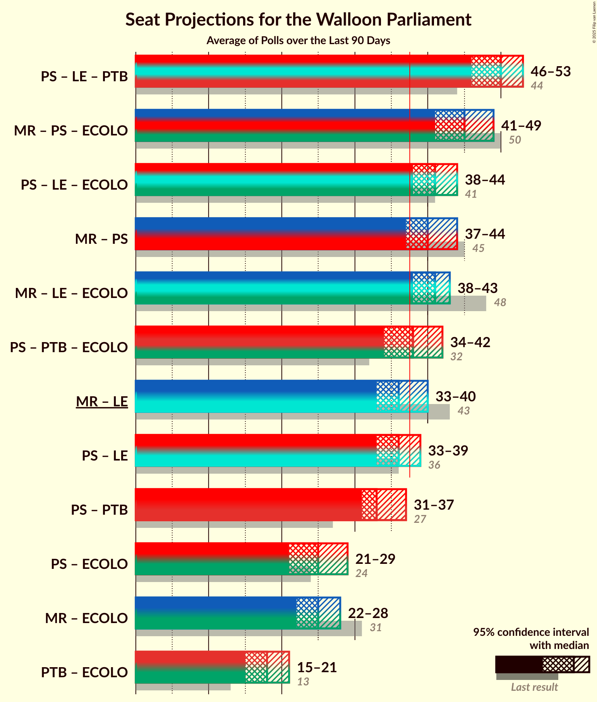

# Poll Average

<a href="#voting-intentions">Voting Intentions</a> | <a href="#seats">Seats</a> | <a href="#coalitions">Coalitions</a> | <a href="#technical-information">Technical Information</a>

## Summary

The table below lists the polls on which the average is based. They are the most recent polls (less than 90 days old) registered and analyzed so far.

| Period     | Polling firm/Commissioner(s) | PS | MR | CDH | ECOLO | PTB | PP | DÉFI | DROITE | DLB | RWF | WDA | PIRATE | FW |
|:----------:|:----------------------------:|:--:|:--:|:--:|:--:|:--:|:--:|:--:|:--:|:--:|:--:|:--:|:--:|:--:|
| 25 May 2014 | General Election | 30.9%   30 | 26.7%   25 | 15.2%   13 | 8.6%   4 | 5.8%   2 | 4.9%   1 | 2.5%   0 | 1.4%   0 | 0.8%   0 | 0.5%   0 | 0.4%   0 | 0.2%   0 | 0.1%   0 |
| N/A | Poll Average | 19–24%   16–21 | 19–24%   17–22 | 7–11%   5–9 | 11–20%   9–16 | 13–20%   11–17 | 0–6%   0–3 | 5–8%   1–5 | 1–3%   0 | N/A   N/A | N/A   N/A | N/A   N/A | N/A   N/A | N/A   N/A |
| [11 September–5 October 2017](2017-10-05-TNS.html) | TNS   De Standaard–VRT–RTBf–La Libre Belgique | 19–24%   16–21 | 19–24%   18–22 | 7–11%   6–9 | 16–21%   13–16 | 13–17%   11–14 | 0–1%   0 | 5–7%   1–2 | N/A   N/A | N/A   N/A | N/A   N/A | N/A   N/A | N/A   N/A | N/A   N/A |
| [25 August–3 September 2017](2017-09-03-Ipsos.html) | Ipsos   RTL TVi–Le Soir–VTM–Het Laatste Nieuws | 18–23%   16–21 | 19–24%   17–23 | 7–11%   5–9 | 11–15%   8–13 | 15–20%   13–17 | 3–6%   0–3 | 5–8%   1–5 | 1–3%   0 | N/A   N/A | N/A   N/A | N/A   N/A | N/A   N/A | N/A   N/A |
| 25 May 2014 | General Election | 30.9%   30 | 26.7%   25 | 15.2%   13 | 8.6%   4 | 5.8%   2 | 4.9%   1 | 2.5%   0 | 1.4%   0 | 0.8%   0 | 0.5%   0 | 0.4%   0 | 0.2%   0 | 0.1%   0 |

Only polls for which at least the sample size has been published are included in the table above.

**Legend:**
+ **Top half of each row:** Voting intentions (95% confidence interval)
+ **Bottom half of each row:** Seat projections for the Walloon Parliament (95% confidence interval)
+ **PS:** PS
+ **MR:** MR
+ **CDH:** cdH
+ **ECOLO:** Ecolo
+ **PTB:** PTB
+ **PP:** Parti Populaire
+ **DÉFI:** DéFI
+ **DROITE:** La Droite
+ **DLB:** Debout les Belges
+ **RWF:** R.W.F.
+ **WDA:** Wallonie d’Abord
+ **PIRATE:** PIRATE
+ **FW:** FW
+ **N/A (single party):** Party not included the published results
+ **N/A (entire row):** Calculation for this opinion poll not started yet

## Voting Intentions

### Confidence Intervals

| Party | Last Result | Median | 80% Confidence Interval | 90% Confidence Interval | 95% Confidence Interval | 99% Confidence Interval |
|:-----:|:-----------:|:------:|:-----------------------:|:-----------------------:|:-----------------------:|:-----------------------:|
| <a href="#ps">PS</a> | 30.9% | 21.1% | 19.5–22.9% |19.0–23.4% | 18.6–23.8% | 17.8–24.6% |
| <a href="#mr">MR</a> | 26.7% | 21.4% | 19.8–23.1% |19.3–23.6% | 19.0–24.0% | 18.2–24.8% |
| <a href="#cdh">cdH</a> | 15.2% | 8.8% | 7.7–10.0% |7.4–10.3% | 7.2–10.6% | 6.7–11.3% |
| <a href="#ecolo">Ecolo</a> | 8.6% | 15.7% | 11.9–19.5% |11.4–20.1% | 11.1–20.5% | 10.4–21.4% |
| <a href="#ptb">PTB</a> | 5.8% | 16.1% | 13.9–18.6% |13.5–19.2% | 13.1–19.6% | 12.4–20.5% |
| <a href="#parti-populaire">Parti Populaire</a> | 4.9% | 2.4% | 0.6–5.1% |0.5–5.4% | 0.4–5.7% | 0.3–6.3% |
| <a href="#défi">DéFI</a> | 2.5% | 6.1% | 5.1–7.1% |4.9–7.5% | 4.7–7.8% | 4.3–8.3% |
| <a href="#la-droite">La Droite</a> | 1.4% | 1.6% | 1.2–2.2% |1.0–2.4% | 1.0–2.6% | 0.8–2.9% |
| <a href="#debout-les-belges">Debout les Belges</a> | 0.8% | N/A | N/A |N/A | N/A | N/A |
| <a href="#r.w.f.">R.W.F.</a> | 0.5% | N/A | N/A |N/A | N/A | N/A |
| <a href="#wallonie-d’abord">Wallonie d’Abord</a> | 0.4% | N/A | N/A |N/A | N/A | N/A |
| <a href="#pirate">PIRATE</a> | 0.2% | N/A | N/A |N/A | N/A | N/A |
| <a href="#fw">FW</a> | 0.1% | N/A | N/A |N/A | N/A | N/A |

### PS

*For a full overview of the results for this party, see the [PS](party-ps.html) page.*

| Voting Intentions | Probability | Accumulated | Special Marks |
|:-----------------:|:-----------:|:-----------:|:-------------:|
| 15.5–16.5% | 0% | 100% |  |
| 16.5–17.5% | 0.3% | 100% |  |
| 17.5–18.5% | 2% | 99.7% |  |
| 18.5–19.5% | 9% | 98% |  |
| 19.5–20.5% | 21% | 89% |  |
| 20.5–21.5% | 29% | 67% | Median |
| 21.5–22.5% | 23% | 38% |  |
| 22.5–23.5% | 11% | 15% |  |
| 23.5–24.5% | 3% | 4% |  |
| 24.5–25.5% | 0.5% | 0.6% |  |
| 25.5–26.5% | 0.1% | 0.1% |  |
| 26.5–27.5% | 0% | 0% |  |
| 27.5–28.5% | 0% | 0% |  |
| 28.5–29.5% | 0% | 0% |  |
| 29.5–30.5% | 0% | 0% |  |
| 30.5–31.5% | 0% | 0% | Last Result |

### MR

*For a full overview of the results for this party, see the [MR](party-mr.html) page.*

| Voting Intentions | Probability | Accumulated | Special Marks |
|:-----------------:|:-----------:|:-----------:|:-------------:|
| 15.5–16.5% | 0% | 100% |  |
| 16.5–17.5% | 0.1% | 100% |  |
| 17.5–18.5% | 1.0% | 99.9% |  |
| 18.5–19.5% | 6% | 98.9% |  |
| 19.5–20.5% | 18% | 93% |  |
| 20.5–21.5% | 30% | 75% | Median |
| 21.5–22.5% | 27% | 45% |  |
| 22.5–23.5% | 14% | 19% |  |
| 23.5–24.5% | 4% | 5% |  |
| 24.5–25.5% | 0.8% | 0.9% |  |
| 25.5–26.5% | 0.1% | 0.1% |  |
| 26.5–27.5% | 0% | 0% | Last Result |

### cdH

*For a full overview of the results for this party, see the [cdH](party-cdh.html) page.*

| Voting Intentions | Probability | Accumulated | Special Marks |
|:-----------------:|:-----------:|:-----------:|:-------------:|
| 4.5–5.5% | 0% | 100% |  |
| 5.5–6.5% | 0.3% | 100% |  |
| 6.5–7.5% | 7% | 99.7% |  |
| 7.5–8.5% | 32% | 93% |  |
| 8.5–9.5% | 41% | 61% | Median |
| 9.5–10.5% | 17% | 20% |  |
| 10.5–11.5% | 3% | 3% |  |
| 11.5–12.5% | 0.2% | 0.2% |  |
| 12.5–13.5% | 0% | 0% |  |
| 13.5–14.5% | 0% | 0% |  |
| 14.5–15.5% | 0% | 0% | Last Result |

### Ecolo

*For a full overview of the results for this party, see the [Ecolo](party-ecolo.html) page.*

| Voting Intentions | Probability | Accumulated | Special Marks |
|:-----------------:|:-----------:|:-----------:|:-------------:|
| 8.5–9.5% | 0% | 100% | Last Result |
| 9.5–10.5% | 0.7% | 100% |  |
| 10.5–11.5% | 5% | 99.3% |  |
| 11.5–12.5% | 15% | 94% |  |
| 12.5–13.5% | 17% | 79% |  |
| 13.5–14.5% | 9% | 62% |  |
| 14.5–15.5% | 3% | 53% |  |
| 15.5–16.5% | 2% | 50% | Median |
| 16.5–17.5% | 8% | 48% |  |
| 17.5–18.5% | 15% | 40% |  |
| 18.5–19.5% | 15% | 25% |  |
| 19.5–20.5% | 7% | 10% |  |
| 20.5–21.5% | 2% | 2% |  |
| 21.5–22.5% | 0.3% | 0.4% |  |
| 22.5–23.5% | 0% | 0% |  |

### PTB

*For a full overview of the results for this party, see the [PTB](party-ptb.html) page.*

| Voting Intentions | Probability | Accumulated | Special Marks |
|:-----------------:|:-----------:|:-----------:|:-------------:|
| 5.5–6.5% | 0% | 100% | Last Result |
| 6.5–7.5% | 0% | 100% |  |
| 7.5–8.5% | 0% | 100% |  |
| 8.5–9.5% | 0% | 100% |  |
| 9.5–10.5% | 0% | 100% |  |
| 10.5–11.5% | 0% | 100% |  |
| 11.5–12.5% | 0.7% | 100% |  |
| 12.5–13.5% | 5% | 99.3% |  |
| 13.5–14.5% | 15% | 94% |  |
| 14.5–15.5% | 19% | 80% |  |
| 15.5–16.5% | 18% | 60% | Median |
| 16.5–17.5% | 17% | 43% |  |
| 17.5–18.5% | 15% | 25% |  |
| 18.5–19.5% | 8% | 11% |  |
| 19.5–20.5% | 2% | 3% |  |
| 20.5–21.5% | 0.4% | 0.5% |  |
| 21.5–22.5% | 0% | 0% |  |
| 22.5–23.5% | 0% | 0% |  |

### Parti Populaire

*For a full overview of the results for this party, see the [Parti Populaire](party-partipopulaire.html) page.*

| Voting Intentions | Probability | Accumulated | Special Marks |
|:-----------------:|:-----------:|:-----------:|:-------------:|
| 0.0–0.5% | 7% | 100% |  |
| 0.5–1.5% | 42% | 93% |  |
| 1.5–2.5% | 0.7% | 51% | Median |
| 2.5–3.5% | 3% | 50% |  |
| 3.5–4.5% | 23% | 47% |  |
| 4.5–5.5% | 21% | 25% | Last Result |
| 5.5–6.5% | 4% | 4% |  |
| 6.5–7.5% | 0.2% | 0.2% |  |
| 7.5–8.5% | 0% | 0% |  |

### DéFI

*For a full overview of the results for this party, see the [DéFI](party-dfi.html) page.*

| Voting Intentions | Probability | Accumulated | Special Marks |
|:-----------------:|:-----------:|:-----------:|:-------------:|
| 2.5–3.5% | 0% | 100% | Last Result |
| 3.5–4.5% | 2% | 100% |  |
| 4.5–5.5% | 24% | 98% |  |
| 5.5–6.5% | 48% | 75% | Median |
| 6.5–7.5% | 23% | 27% |  |
| 7.5–8.5% | 4% | 4% |  |
| 8.5–9.5% | 0.2% | 0.3% |  |
| 9.5–10.5% | 0% | 0% |  |

### La Droite

*For a full overview of the results for this party, see the [La Droite](party-ladroite.html) page.*

| Voting Intentions | Probability | Accumulated | Special Marks |
|:-----------------:|:-----------:|:-----------:|:-------------:|
| 0.0–0.5% | 0% | 100% |  |
| 0.5–1.5% | 43% | 100% | Last Result |
| 1.5–2.5% | 55% | 57% | Median |
| 2.5–3.5% | 3% | 3% |  |
| 3.5–4.5% | 0% | 0% |  |

## Seats

### Confidence Intervals

| Party | Last Result | Median | 80% Confidence Interval | 90% Confidence Interval | 95% Confidence Interval | 99% Confidence Interval |
|:-----:|:-----------:|:------:|:-----------------------:|:-----------------------:|:-----------------------:|:-----------------------:|
| <a href="#ps">PS</a> | 30 | 19 | 17–21 |16–21 | 16–21 | 16–21 |
| <a href="#mr">MR</a> | 25 | 21 | 18–22 |18–22 | 17–22 | 16–23 |
| <a href="#cdh">cdH</a> | 13 | 6 | 5–7 |5–8 | 5–9 | 5–10 |
| <a href="#ecolo">Ecolo</a> | 4 | 13 | 10–16 |10–16 | 9–16 | 8–16 |
| <a href="#ptb">PTB</a> | 2 | 13 | 11–16 |11–17 | 11–17 | 11–18 |
| <a href="#parti-populaire">Parti Populaire</a> | 1 | 0 | 0–2 |0–2 | 0–3 | 0–3 |
| <a href="#défi">DéFI</a> | 0 | 2 | 1–5 |1–5 | 1–5 | 1–5 |
| <a href="#la-droite">La Droite</a> | 0 | 0 | 0 |0 | 0 | 0 |
| <a href="#debout-les-belges">Debout les Belges</a> | 0 | N/A | N/A |N/A | N/A | N/A |
| <a href="#r.w.f.">R.W.F.</a> | 0 | N/A | N/A |N/A | N/A | N/A |
| <a href="#wallonie-d’abord">Wallonie d’Abord</a> | 0 | N/A | N/A |N/A | N/A | N/A |
| <a href="#pirate">PIRATE</a> | 0 | N/A | N/A |N/A | N/A | N/A |
| <a href="#fw">FW</a> | 0 | N/A | N/A |N/A | N/A | N/A |

### PS

*For a full overview of the results for this party, see the [PS](party-ps.html) page.*

| Number of Seats | Probability | Accumulated | Special Marks |
|:---------------:|:-----------:|:-----------:|:-------------:|
| 15 | 0.5% | 100% |  |
| 16 | 5% | 99.5% |  |
| 17 | 14% | 94% |  |
| 18 | 11% | 80% |  |
| 19 | 50% | 69% | Median |
| 20 | 4% | 19% |  |
| 21 | 14% | 15% |  |
| 22 | 0.1% | 0.3% |  |
| 23 | 0.1% | 0.2% |  |
| 24 | 0% | 0% |  |
| 25 | 0% | 0% |  |
| 26 | 0% | 0% |  |
| 27 | 0% | 0% |  |
| 28 | 0% | 0% |  |
| 29 | 0% | 0% |  |
| 30 | 0% | 0% | Last Result |

### MR

*For a full overview of the results for this party, see the [MR](party-mr.html) page.*

| Number of Seats | Probability | Accumulated | Special Marks |
|:---------------:|:-----------:|:-----------:|:-------------:|
| 15 | 0.1% | 100% |  |
| 16 | 0.9% | 99.9% |  |
| 17 | 2% | 99.0% |  |
| 18 | 8% | 97% |  |
| 19 | 13% | 90% |  |
| 20 | 24% | 77% |  |
| 21 | 6% | 52% | Median |
| 22 | 45% | 47% |  |
| 23 | 1.2% | 1.4% |  |
| 24 | 0.1% | 0.1% |  |
| 25 | 0% | 0% | Last Result |

### cdH

*For a full overview of the results for this party, see the [cdH](party-cdh.html) page.*

| Number of Seats | Probability | Accumulated | Special Marks |
|:---------------:|:-----------:|:-----------:|:-------------:|
| 4 | 0.3% | 100% |  |
| 5 | 15% | 99.7% |  |
| 6 | 72% | 85% | Median |
| 7 | 4% | 13% |  |
| 8 | 4% | 9% |  |
| 9 | 3% | 5% |  |
| 10 | 2% | 2% |  |
| 11 | 0% | 0% |  |
| 12 | 0% | 0% |  |
| 13 | 0% | 0% | Last Result |

### Ecolo

*For a full overview of the results for this party, see the [Ecolo](party-ecolo.html) page.*

| Number of Seats | Probability | Accumulated | Special Marks |
|:---------------:|:-----------:|:-----------:|:-------------:|
| 4 | 0% | 100% | Last Result |
| 5 | 0% | 100% |  |
| 6 | 0% | 100% |  |
| 7 | 0.3% | 100% |  |
| 8 | 0.9% | 99.7% |  |
| 9 | 3% | 98.7% |  |
| 10 | 10% | 95% |  |
| 11 | 19% | 85% |  |
| 12 | 10% | 66% |  |
| 13 | 7% | 56% | Median |
| 14 | 0.6% | 49% |  |
| 15 | 37% | 48% |  |
| 16 | 11% | 11% |  |
| 17 | 0.1% | 0.3% |  |
| 18 | 0% | 0.2% |  |
| 19 | 0% | 0.2% |  |
| 20 | 0.2% | 0.2% |  |
| 21 | 0% | 0% |  |

### PTB

*For a full overview of the results for this party, see the [PTB](party-ptb.html) page.*

| Number of Seats | Probability | Accumulated | Special Marks |
|:---------------:|:-----------:|:-----------:|:-------------:|
| 2 | 0% | 100% | Last Result |
| 3 | 0% | 100% |  |
| 4 | 0% | 100% |  |
| 5 | 0% | 100% |  |
| 6 | 0% | 100% |  |
| 7 | 0% | 100% |  |
| 8 | 0% | 100% |  |
| 9 | 0.1% | 100% |  |
| 10 | 0.3% | 99.9% |  |
| 11 | 46% | 99.6% |  |
| 12 | 2% | 54% |  |
| 13 | 3% | 52% | Median |
| 14 | 11% | 48% |  |
| 15 | 15% | 38% |  |
| 16 | 17% | 22% |  |
| 17 | 4% | 5% |  |
| 18 | 0.6% | 0.8% |  |
| 19 | 0.2% | 0.2% |  |
| 20 | 0% | 0.1% |  |
| 21 | 0% | 0% |  |

### Parti Populaire

*For a full overview of the results for this party, see the [Parti Populaire](party-partipopulaire.html) page.*

| Number of Seats | Probability | Accumulated | Special Marks |
|:---------------:|:-----------:|:-----------:|:-------------:|
| 0 | 75% | 100% | Median |
| 1 | 6% | 25% | Last Result |
| 2 | 16% | 19% |  |
| 3 | 3% | 3% |  |
| 4 | 0.2% | 0.3% |  |
| 5 | 0.1% | 0.1% |  |
| 6 | 0% | 0% |  |

### DéFI

*For a full overview of the results for this party, see the [DéFI](party-dfi.html) page.*

| Number of Seats | Probability | Accumulated | Special Marks |
|:---------------:|:-----------:|:-----------:|:-------------:|
| 0 | 0.3% | 100% | Last Result |
| 1 | 15% | 99.7% |  |
| 2 | 52% | 85% | Median |
| 3 | 3% | 33% |  |
| 4 | 7% | 30% |  |
| 5 | 23% | 23% |  |
| 6 | 0.2% | 0.3% |  |
| 7 | 0.1% | 0.1% |  |
| 8 | 0% | 0% |  |

### La Droite

*For a full overview of the results for this party, see the [La Droite](party-ladroite.html) page.*

| Number of Seats | Probability | Accumulated | Special Marks |
|:---------------:|:-----------:|:-----------:|:-------------:|
| 0 | 100% | 100% | Last Result, Median |

## Coalitions

### Confidence Intervals

| Coalition | Last Result | Median | Majority? | 80% Confidence Interval | 90% Confidence Interval | 95% Confidence Interval | 99% Confidence Interval |
|:---------:|:-----------:|:------:|:---------:|:-----------------------:|:-----------------------:|:-----------------------:|:-----------------------:|
| PS – MR – Ecolo | 59 | 53 | 100% | 47–56 | 47–57 | 46–57 | 45–57 |
| PS – Ecolo – PTB | 36 | 45 | 100% | 43–48 | 42–48 | 42–48 | 40–49 |
| PS – cdH – PTB | 45 | 38 | 54% | 36–41 | 36–42 | 36–43 | 35–44 |
| MR – cdH – Ecolo | 42 | 41 | 68% | 35–43 | 35–43 | 35–43 | 33–44 |
| PS – cdH – Ecolo | 47 | 39 | 58% | 34–41 | 33–43 | 32–43 | 32–43 |
| PS – MR | 55 | 41 | 75% | 36–41 | 36–41 | 35–41 | 34–42 |
| PS – PTB | 32 | 32 | 1.2% | 30–35 | 30–36 | 30–37 | 29–38 |
| MR – Ecolo | 29 | 34 | 2% | 30–37 | 29–37 | 28–37 | 27–38 |
| PS – Ecolo | 34 | 33 | 0.2% | 28–34 | 27–37 | 26–37 | 25–37 |
| Ecolo – PTB | 6 | 26 | 0% | 25–28 | 25–29 | 24–30 | 22–30 |
| MR – cdH | 38 | 28 | 0% | 24–28 | 24–28 | 23–29 | 22–30 |
| PS – cdH | 43 | 25 | 0% | 23–27 | 22–27 | 22–28 | 21–30 |

### PS – MR – Ecolo

| Number of Seats | Probability | Accumulated | Special Marks |
|:---------------:|:-----------:|:-----------:|:-------------:|
| 43 | 0% | 100% |  |
| 44 | 0.1% | 99.9% |  |
| 45 | 0.7% | 99.8% |  |
| 46 | 3% | 99.1% |  |
| 47 | 10% | 96% |  |
| 48 | 10% | 87% |  |
| 49 | 7% | 76% |  |
| 50 | 5% | 69% |  |
| 51 | 7% | 64% |  |
| 52 | 3% | 56% |  |
| 53 | 4% | 53% | Median |
| 54 | 3% | 49% |  |
| 55 | 0.4% | 46% |  |
| 56 | 37% | 46% |  |
| 57 | 8% | 8% |  |
| 58 | 0.2% | 0.2% |  |
| 59 | 0% | 0% | Last Result |

### PS – Ecolo – PTB

| Number of Seats | Probability | Accumulated | Special Marks |
|:---------------:|:-----------:|:-----------:|:-------------:|
| 36 | 0% | 100% | Last Result |
| 37 | 0% | 100% |  |
| 38 | 0% | 100% | Majority |
| 39 | 0.2% | 100% |  |
| 40 | 0.4% | 99.8% |  |
| 41 | 2% | 99.4% |  |
| 42 | 8% | 98% |  |
| 43 | 6% | 90% |  |
| 44 | 8% | 84% |  |
| 45 | 49% | 75% | Median |
| 46 | 8% | 27% |  |
| 47 | 5% | 18% |  |
| 48 | 11% | 13% |  |
| 49 | 2% | 2% |  |
| 50 | 0.5% | 0.5% |  |
| 51 | 0% | 0% |  |

### PS – cdH – PTB

| Number of Seats | Probability | Accumulated | Special Marks |
|:---------------:|:-----------:|:-----------:|:-------------:|
| 34 | 0.1% | 100% |  |
| 35 | 1.2% | 99.9% |  |
| 36 | 41% | 98.7% |  |
| 37 | 3% | 58% |  |
| 38 | 18% | 54% | Median, Majority |
| 39 | 8% | 36% |  |
| 40 | 9% | 29% |  |
| 41 | 10% | 19% |  |
| 42 | 5% | 9% |  |
| 43 | 2% | 3% |  |
| 44 | 1.3% | 2% |  |
| 45 | 0.2% | 0.4% | Last Result |
| 46 | 0.1% | 0.2% |  |
| 47 | 0.1% | 0.1% |  |
| 48 | 0% | 0% |  |

### MR – cdH – Ecolo

| Number of Seats | Probability | Accumulated | Special Marks |
|:---------------:|:-----------:|:-----------:|:-------------:|
| 32 | 0.2% | 100% |  |
| 33 | 0.5% | 99.8% |  |
| 34 | 2% | 99.3% |  |
| 35 | 8% | 98% |  |
| 36 | 13% | 90% |  |
| 37 | 9% | 76% |  |
| 38 | 9% | 68% | Majority |
| 39 | 6% | 59% |  |
| 40 | 2% | 53% | Median |
| 41 | 2% | 51% |  |
| 42 | 9% | 49% | Last Result |
| 43 | 37% | 40% |  |
| 44 | 2% | 2% |  |
| 45 | 0% | 0% |  |

### PS – cdH – Ecolo

| Number of Seats | Probability | Accumulated | Special Marks |
|:---------------:|:-----------:|:-----------:|:-------------:|
| 30 | 0.1% | 100% |  |
| 31 | 0.2% | 99.9% |  |
| 32 | 3% | 99.7% |  |
| 33 | 3% | 97% |  |
| 34 | 7% | 94% |  |
| 35 | 16% | 87% |  |
| 36 | 8% | 71% |  |
| 37 | 5% | 63% |  |
| 38 | 8% | 58% | Median, Majority |
| 39 | 2% | 51% |  |
| 40 | 38% | 48% |  |
| 41 | 0.8% | 11% |  |
| 42 | 0.2% | 10% |  |
| 43 | 9% | 10% |  |
| 44 | 0% | 0.2% |  |
| 45 | 0.2% | 0.2% |  |
| 46 | 0% | 0% |  |
| 47 | 0% | 0% | Last Result |

### PS – MR

| Number of Seats | Probability | Accumulated | Special Marks |
|:---------------:|:-----------:|:-----------:|:-------------:|
| 33 | 0.1% | 100% |  |
| 34 | 0.5% | 99.9% |  |
| 35 | 2% | 99.4% |  |
| 36 | 9% | 97% |  |
| 37 | 13% | 88% |  |
| 38 | 9% | 75% | Majority |
| 39 | 8% | 66% |  |
| 40 | 5% | 59% | Median |
| 41 | 52% | 54% |  |
| 42 | 1.2% | 2% |  |
| 43 | 0.3% | 0.3% |  |
| 44 | 0.1% | 0.1% |  |
| 45 | 0% | 0% |  |
| 46 | 0% | 0% |  |
| 47 | 0% | 0% |  |
| 48 | 0% | 0% |  |
| 49 | 0% | 0% |  |
| 50 | 0% | 0% |  |
| 51 | 0% | 0% |  |
| 52 | 0% | 0% |  |
| 53 | 0% | 0% |  |
| 54 | 0% | 0% |  |
| 55 | 0% | 0% | Last Result |

### PS – PTB

| Number of Seats | Probability | Accumulated | Special Marks |
|:---------------:|:-----------:|:-----------:|:-------------:|
| 27 | 0.1% | 100% |  |
| 28 | 0% | 99.9% |  |
| 29 | 0.8% | 99.9% |  |
| 30 | 41% | 99.0% |  |
| 31 | 6% | 58% |  |
| 32 | 19% | 52% | Last Result, Median |
| 33 | 8% | 34% |  |
| 34 | 8% | 25% |  |
| 35 | 10% | 17% |  |
| 36 | 5% | 8% |  |
| 37 | 2% | 3% |  |
| 38 | 1.1% | 1.2% | Majority |
| 39 | 0% | 0% |  |

### MR – Ecolo

| Number of Seats | Probability | Accumulated | Special Marks |
|:---------------:|:-----------:|:-----------:|:-------------:|
| 25 | 0.1% | 100% |  |
| 26 | 0.2% | 99.9% |  |
| 27 | 0.9% | 99.7% |  |
| 28 | 2% | 98.8% |  |
| 29 | 7% | 97% | Last Result |
| 30 | 15% | 90% |  |
| 31 | 10% | 75% |  |
| 32 | 9% | 65% |  |
| 33 | 5% | 56% |  |
| 34 | 2% | 51% | Median |
| 35 | 0.7% | 49% |  |
| 36 | 9% | 48% |  |
| 37 | 37% | 40% |  |
| 38 | 2% | 2% | Majority |
| 39 | 0.1% | 0.1% |  |
| 40 | 0% | 0% |  |

### PS – Ecolo

| Number of Seats | Probability | Accumulated | Special Marks |
|:---------------:|:-----------:|:-----------:|:-------------:|
| 24 | 0.1% | 100% |  |
| 25 | 0.4% | 99.9% |  |
| 26 | 2% | 99.5% |  |
| 27 | 5% | 97% |  |
| 28 | 9% | 92% |  |
| 29 | 11% | 82% |  |
| 30 | 8% | 72% |  |
| 31 | 6% | 64% |  |
| 32 | 7% | 58% | Median |
| 33 | 4% | 51% |  |
| 34 | 38% | 47% | Last Result |
| 35 | 0% | 9% |  |
| 36 | 0.3% | 9% |  |
| 37 | 8% | 8% |  |
| 38 | 0% | 0.2% | Majority |
| 39 | 0.2% | 0.2% |  |
| 40 | 0% | 0% |  |

### Ecolo – PTB

| Number of Seats | Probability | Accumulated | Special Marks |
|:---------------:|:-----------:|:-----------:|:-------------:|
| 6 | 0% | 100% | Last Result |
| 7 | 0% | 100% |  |
| 8 | 0% | 100% |  |
| 9 | 0% | 100% |  |
| 10 | 0% | 100% |  |
| 11 | 0% | 100% |  |
| 12 | 0% | 100% |  |
| 13 | 0% | 100% |  |
| 14 | 0% | 100% |  |
| 15 | 0% | 100% |  |
| 16 | 0% | 100% |  |
| 17 | 0% | 100% |  |
| 18 | 0% | 100% |  |
| 19 | 0% | 100% |  |
| 20 | 0% | 100% |  |
| 21 | 0.2% | 100% |  |
| 22 | 0.6% | 99.8% |  |
| 23 | 1.2% | 99.2% |  |
| 24 | 3% | 98% |  |
| 25 | 10% | 95% |  |
| 26 | 54% | 85% | Median |
| 27 | 20% | 32% |  |
| 28 | 6% | 11% |  |
| 29 | 2% | 5% |  |
| 30 | 3% | 3% |  |
| 31 | 0.1% | 0.2% |  |
| 32 | 0% | 0.1% |  |
| 33 | 0% | 0% |  |

### MR – cdH

| Number of Seats | Probability | Accumulated | Special Marks |
|:---------------:|:-----------:|:-----------:|:-------------:|
| 21 | 0.2% | 100% |  |
| 22 | 0.7% | 99.8% |  |
| 23 | 3% | 99.1% |  |
| 24 | 6% | 96% |  |
| 25 | 12% | 90% |  |
| 26 | 19% | 78% |  |
| 27 | 7% | 58% | Median |
| 28 | 49% | 52% |  |
| 29 | 2% | 3% |  |
| 30 | 0.5% | 0.6% |  |
| 31 | 0.2% | 0.2% |  |
| 32 | 0% | 0% |  |
| 33 | 0% | 0% |  |
| 34 | 0% | 0% |  |
| 35 | 0% | 0% |  |
| 36 | 0% | 0% |  |
| 37 | 0% | 0% |  |
| 38 | 0% | 0% | Last Result, Majority |

### PS – cdH

| Number of Seats | Probability | Accumulated | Special Marks |
|:---------------:|:-----------:|:-----------:|:-------------:|
| 20 | 0.1% | 100% |  |
| 21 | 0.5% | 99.9% |  |
| 22 | 8% | 99.4% |  |
| 23 | 8% | 92% |  |
| 24 | 13% | 84% |  |
| 25 | 49% | 71% | Median |
| 26 | 7% | 22% |  |
| 27 | 12% | 15% |  |
| 28 | 1.1% | 3% |  |
| 29 | 0.5% | 2% |  |
| 30 | 1.2% | 1.4% |  |
| 31 | 0.2% | 0.2% |  |
| 32 | 0% | 0% |  |
| 33 | 0% | 0% |  |
| 34 | 0% | 0% |  |
| 35 | 0% | 0% |  |
| 36 | 0% | 0% |  |
| 37 | 0% | 0% |  |
| 38 | 0% | 0% | Majority |
| 39 | 0% | 0% |  |
| 40 | 0% | 0% |  |
| 41 | 0% | 0% |  |
| 42 | 0% | 0% |  |
| 43 | 0% | 0% | Last Result |

## Technical Information

