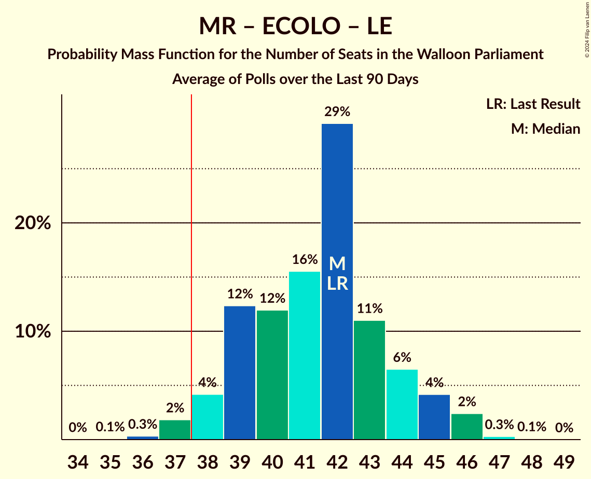

# Poll Average

<a href="#voting-intentions">Voting Intentions</a> | <a href="#seats">Seats</a> | <a href="#coalitions">Coalitions</a> | <a href="#technical-information">Technical Information</a>

## Summary

The table below lists the polls on which the average is based. They are the most recent polls (less than 90 days old) registered and analyzed so far.

| Period     | Polling firm/Commissioner(s) | PS | MR | ECOLO | PTB | LE | DÉFI | PP | DROITE |
|:----------:|:----------------------------:|:--:|:--:|:--:|:--:|:--:|:--:|:--:|:--:|
| 26 May 2019 | General Election | 26.2%   23 | 21.4%   20 | 14.5%   12 | 13.7%   10 | 11.0%   10 | 4.1%   0 | 3.7%   0 | 0.2%   0 |
| N/A | Poll Average | 21–28%   18–23 | 19–25%   16–23 | 7–14%   5–12 | 13–18%   10–16 | 12–20%   11–18 | 3–6%   0–3 | N/A   N/A | N/A   N/A |
| [28–31 May 2024](2024-05-31-Cluster17.html) | Cluster17   RTL TVi | 21–27%   19–23 | 20–26%   18–23 | 6–10%   4–7 | 14–18%   10–16 | 16–20%   13–18 | 3–5%   0–1 | N/A   N/A | N/A   N/A |
| [14–20 May 2024](2024-05-20-Ipsos.html) | Ipsos   Het Laatste Nieuws, Le Soir, RTL TVi and VTM | 20–25%   17–23 | 20–25%   18–23 | 7–11%   5–8 | 12–17%   10–14 | 16–21%   14–19 | 3–6%   0–3 | N/A   N/A | N/A   N/A |
| [8–18 April 2024](2024-04-18-Kantar.html) | Kantar   La Libre Belgique and RTBf | 23–28%   19–24 | 18–23%   15–21 | 11–15%   7–13 | 14–18%   10–16 | 12–16%   10–14 | 3–6%   0–2 | N/A   N/A | N/A   N/A |
| 26 May 2019 | General Election | 26.2%   23 | 21.4%   20 | 14.5%   12 | 13.7%   10 | 11.0%   10 | 4.1%   0 | 3.7%   0 | 0.2%   0 |

Only polls for which at least the sample size has been published are included in the table above.

**Legend:**
+ **Top half of each row:** Voting intentions (95% confidence interval)
+ **Bottom half of each row:** Seat projections for the Walloon Parliament (95% confidence interval)
+ **PS:** Parti Socialiste
+ **MR:** Mouvement Réformateur
+ **ECOLO:** Ecolo
+ **PTB:** Parti du Travail de Belgique
+ **LE:** Les Engagés
+ **DÉFI:** DéFI
+ **PP:** Parti Populaire
+ **DROITE:** La Droite
+ **N/A (single party):** Party not included the published results
+ **N/A (entire row):** Calculation for this opinion poll not started yet

## Voting Intentions

### Confidence Intervals

| Party | Last Result | Median | 80% Confidence Interval | 90% Confidence Interval | 95% Confidence Interval | 99% Confidence Interval |
|:-----:|:-----------:|:------:|:-----------------------:|:-----------------------:|:-----------------------:|:-----------------------:|
| <a href="#parti-socialiste">Parti Socialiste</a> | 26.2% | 24.0% | 21.7–26.3% |21.2–27.0% | 20.7–27.5% | 19.8–28.5% |
| <a href="#mouvement-réformateur">Mouvement Réformateur</a> | 21.4% | 22.2% | 20.1–24.3% |19.5–24.8% | 19.0–25.3% | 18.2–26.2% |
| <a href="#ecolo">Ecolo</a> | 14.5% | 9.1% | 7.5–13.4% |7.1–13.9% | 6.8–14.4% | 6.3–15.2% |
| <a href="#parti-du-travail-de-belgique">Parti du Travail de Belgique</a> | 13.7% | 15.6% | 13.8–17.3% |13.4–17.8% | 13.0–18.2% | 12.2–19.0% |
| <a href="#les-engagés">Les Engagés</a> | 11.0% | 17.2% | 13.4–19.3% |12.9–19.8% | 12.5–20.3% | 11.7–21.1% |
| <a href="#défi">DéFI</a> | 4.1% | 4.2% | 3.4–5.1% |3.2–5.4% | 3.1–5.6% | 2.8–6.1% |
| <a href="#parti-populaire">Parti Populaire</a> | 3.7% | N/A | N/A |N/A | N/A | N/A |
| <a href="#la-droite">La Droite</a> | 0.2% | N/A | N/A |N/A | N/A | N/A |

### Parti Socialiste

*For a full overview of the results for this party, see the [Parti Socialiste](party-partisocialiste.html) page.*

| Voting Intentions | Probability | Accumulated | Special Marks |
|:-----------------:|:-----------:|:-----------:|:-------------:|
| 17.5–18.5% | 0% | 100% |  |
| 18.5–19.5% | 0.3% | 100% |  |
| 19.5–20.5% | 2% | 99.7% |  |
| 20.5–21.5% | 6% | 98% |  |
| 21.5–22.5% | 13% | 92% |  |
| 22.5–23.5% | 19% | 79% |  |
| 23.5–24.5% | 21% | 59% | Median |
| 24.5–25.5% | 18% | 38% |  |
| 25.5–26.5% | 12% | 20% | Last Result |
| 26.5–27.5% | 6% | 8% |  |
| 27.5–28.5% | 2% | 2% |  |
| 28.5–29.5% | 0.4% | 0.5% |  |
| 29.5–30.5% | 0.1% | 0.1% |  |
| 30.5–31.5% | 0% | 0% |  |

### Mouvement Réformateur

*For a full overview of the results for this party, see the [Mouvement Réformateur](party-mouvementréformateur.html) page.*

| Voting Intentions | Probability | Accumulated | Special Marks |
|:-----------------:|:-----------:|:-----------:|:-------------:|
| 15.5–16.5% | 0% | 100% |  |
| 16.5–17.5% | 0.1% | 100% |  |
| 17.5–18.5% | 1.0% | 99.9% |  |
| 18.5–19.5% | 4% | 98.9% |  |
| 19.5–20.5% | 11% | 95% |  |
| 20.5–21.5% | 18% | 84% | Last Result |
| 21.5–22.5% | 23% | 65% | Median |
| 22.5–23.5% | 21% | 42% |  |
| 23.5–24.5% | 14% | 21% |  |
| 24.5–25.5% | 5% | 7% |  |
| 25.5–26.5% | 1.4% | 2% |  |
| 26.5–27.5% | 0.2% | 0.2% |  |
| 27.5–28.5% | 0% | 0% |  |

### Ecolo

*For a full overview of the results for this party, see the [Ecolo](party-ecolo.html) page.*

| Voting Intentions | Probability | Accumulated | Special Marks |
|:-----------------:|:-----------:|:-----------:|:-------------:|
| 4.5–5.5% | 0% | 100% |  |
| 5.5–6.5% | 1.1% | 100% |  |
| 6.5–7.5% | 10% | 98.9% |  |
| 7.5–8.5% | 25% | 89% |  |
| 8.5–9.5% | 22% | 64% | Median |
| 9.5–10.5% | 8% | 42% |  |
| 10.5–11.5% | 5% | 34% |  |
| 11.5–12.5% | 10% | 30% |  |
| 12.5–13.5% | 12% | 20% |  |
| 13.5–14.5% | 6% | 8% | Last Result |
| 14.5–15.5% | 2% | 2% |  |
| 15.5–16.5% | 0.2% | 0.2% |  |
| 16.5–17.5% | 0% | 0% |  |

### Parti du Travail de Belgique

*For a full overview of the results for this party, see the [Parti du Travail de Belgique](party-partidutravaildebelgique.html) page.*

| Voting Intentions | Probability | Accumulated | Special Marks |
|:-----------------:|:-----------:|:-----------:|:-------------:|
| 10.5–11.5% | 0.1% | 100% |  |
| 11.5–12.5% | 1.0% | 99.9% |  |
| 12.5–13.5% | 6% | 98.9% |  |
| 13.5–14.5% | 16% | 93% | Last Result |
| 14.5–15.5% | 26% | 77% |  |
| 15.5–16.5% | 27% | 51% | Median |
| 16.5–17.5% | 17% | 24% |  |
| 17.5–18.5% | 6% | 7% |  |
| 18.5–19.5% | 1.2% | 1.3% |  |
| 19.5–20.5% | 0.1% | 0.1% |  |
| 20.5–21.5% | 0% | 0% |  |

### Les Engagés

*For a full overview of the results for this party, see the [Les Engagés](party-lesengagés.html) page.*

| Voting Intentions | Probability | Accumulated | Special Marks |
|:-----------------:|:-----------:|:-----------:|:-------------:|
| 9.5–10.5% | 0% | 100% |  |
| 10.5–11.5% | 0.3% | 100% | Last Result |
| 11.5–12.5% | 3% | 99.7% |  |
| 12.5–13.5% | 9% | 97% |  |
| 13.5–14.5% | 12% | 89% |  |
| 14.5–15.5% | 8% | 77% |  |
| 15.5–16.5% | 8% | 68% |  |
| 16.5–17.5% | 16% | 60% | Median |
| 17.5–18.5% | 21% | 44% |  |
| 18.5–19.5% | 15% | 23% |  |
| 19.5–20.5% | 6% | 7% |  |
| 20.5–21.5% | 1.4% | 2% |  |
| 21.5–22.5% | 0.2% | 0.2% |  |
| 22.5–23.5% | 0% | 0% |  |

### DéFI

*For a full overview of the results for this party, see the [DéFI](party-défi.html) page.*

| Voting Intentions | Probability | Accumulated | Special Marks |
|:-----------------:|:-----------:|:-----------:|:-------------:|
| 0.5–1.5% | 0% | 100% |  |
| 1.5–2.5% | 0.1% | 100% |  |
| 2.5–3.5% | 14% | 99.9% |  |
| 3.5–4.5% | 56% | 86% | Last Result, Median |
| 4.5–5.5% | 28% | 31% |  |
| 5.5–6.5% | 3% | 3% |  |
| 6.5–7.5% | 0.1% | 0.1% |  |
| 7.5–8.5% | 0% | 0% |  |

## Seats

### Confidence Intervals

| Party | Last Result | Median | 80% Confidence Interval | 90% Confidence Interval | 95% Confidence Interval | 99% Confidence Interval |
|:-----:|:-----------:|:------:|:-----------------------:|:-----------------------:|:-----------------------:|:-----------------------:|
| <a href="#parti-socialiste">Parti Socialiste</a> | 23 | 21 | 19–23 |19–23 | 18–23 | 17–24 |
| <a href="#mouvement-réformateur">Mouvement Réformateur</a> | 20 | 20 | 18–21 |17–22 | 16–23 | 14–24 |
| <a href="#ecolo">Ecolo</a> | 12 | 6 | 6–11 |5–12 | 5–12 | 2–13 |
| <a href="#parti-du-travail-de-belgique">Parti du Travail de Belgique</a> | 10 | 13 | 10–14 |10–15 | 10–16 | 9–17 |
| <a href="#les-engagés">Les Engagés</a> | 10 | 15 | 11–16 |11–18 | 11–18 | 10–19 |
| <a href="#défi">DéFI</a> | 0 | 0 | 0 |0–1 | 0–3 | 0–4 |
| <a href="#parti-populaire">Parti Populaire</a> | 0 | N/A | N/A |N/A | N/A | N/A |
| <a href="#la-droite">La Droite</a> | 0 | N/A | N/A |N/A | N/A | N/A |

### Parti Socialiste

*For a full overview of the results for this party, see the [Parti Socialiste](party-partisocialiste.html) page.*

| Number of Seats | Probability | Accumulated | Special Marks |
|:---------------:|:-----------:|:-----------:|:-------------:|
| 17 | 1.3% | 100% |  |
| 18 | 2% | 98.7% |  |
| 19 | 28% | 97% |  |
| 20 | 11% | 69% |  |
| 21 | 22% | 58% | Median |
| 22 | 24% | 36% |  |
| 23 | 10% | 12% | Last Result |
| 24 | 0.9% | 1.3% |  |
| 25 | 0.2% | 0.4% |  |
| 26 | 0.1% | 0.2% |  |
| 27 | 0% | 0.1% |  |
| 28 | 0% | 0% |  |

### Mouvement Réformateur

*For a full overview of the results for this party, see the [Mouvement Réformateur](party-mouvementréformateur.html) page.*

| Number of Seats | Probability | Accumulated | Special Marks |
|:---------------:|:-----------:|:-----------:|:-------------:|
| 14 | 0.5% | 100% |  |
| 15 | 1.1% | 99.5% |  |
| 16 | 2% | 98% |  |
| 17 | 6% | 96% |  |
| 18 | 13% | 90% |  |
| 19 | 12% | 78% |  |
| 20 | 21% | 66% | Last Result, Median |
| 21 | 37% | 45% |  |
| 22 | 5% | 8% |  |
| 23 | 2% | 3% |  |
| 24 | 0.5% | 1.0% |  |
| 25 | 0.4% | 0.4% |  |
| 26 | 0% | 0% |  |

### Ecolo

*For a full overview of the results for this party, see the [Ecolo](party-ecolo.html) page.*

| Number of Seats | Probability | Accumulated | Special Marks |
|:---------------:|:-----------:|:-----------:|:-------------:|
| 1 | 0.1% | 100% |  |
| 2 | 0.5% | 99.9% |  |
| 3 | 0.3% | 99.5% |  |
| 4 | 2% | 99.2% |  |
| 5 | 7% | 98% |  |
| 6 | 47% | 91% | Median |
| 7 | 11% | 44% |  |
| 8 | 2% | 33% |  |
| 9 | 7% | 31% |  |
| 10 | 9% | 24% |  |
| 11 | 5% | 15% |  |
| 12 | 9% | 10% | Last Result |
| 13 | 0.9% | 0.9% |  |
| 14 | 0% | 0% |  |

### Parti du Travail de Belgique

*For a full overview of the results for this party, see the [Parti du Travail de Belgique](party-partidutravaildebelgique.html) page.*

| Number of Seats | Probability | Accumulated | Special Marks |
|:---------------:|:-----------:|:-----------:|:-------------:|
| 8 | 0.2% | 100% |  |
| 9 | 0.7% | 99.8% |  |
| 10 | 14% | 99.1% | Last Result |
| 11 | 17% | 85% |  |
| 12 | 10% | 68% |  |
| 13 | 11% | 59% | Median |
| 14 | 40% | 48% |  |
| 15 | 6% | 8% |  |
| 16 | 2% | 3% |  |
| 17 | 1.0% | 1.0% |  |
| 18 | 0% | 0% |  |

### Les Engagés

*For a full overview of the results for this party, see the [Les Engagés](party-lesengagés.html) page.*

| Number of Seats | Probability | Accumulated | Special Marks |
|:---------------:|:-----------:|:-----------:|:-------------:|
| 8 | 0.1% | 100% |  |
| 9 | 0.2% | 99.9% |  |
| 10 | 2% | 99.7% | Last Result |
| 11 | 23% | 98% |  |
| 12 | 4% | 75% |  |
| 13 | 5% | 71% |  |
| 14 | 5% | 66% |  |
| 15 | 37% | 62% | Median |
| 16 | 15% | 24% |  |
| 17 | 4% | 10% |  |
| 18 | 4% | 5% |  |
| 19 | 1.4% | 2% |  |
| 20 | 0.1% | 0.1% |  |
| 21 | 0% | 0% |  |

### DéFI

*For a full overview of the results for this party, see the [DéFI](party-défi.html) page.*

| Number of Seats | Probability | Accumulated | Special Marks |
|:---------------:|:-----------:|:-----------:|:-------------:|
| 0 | 93% | 100% | Last Result, Median |
| 1 | 3% | 7% |  |
| 2 | 0.9% | 3% |  |
| 3 | 2% | 3% |  |
| 4 | 0.7% | 0.7% |  |
| 5 | 0.1% | 0.1% |  |
| 6 | 0% | 0% |  |

### Parti Populaire

*For a full overview of the results for this party, see the [Parti Populaire](party-partipopulaire.html) page.*

### La Droite

*For a full overview of the results for this party, see the [La Droite](party-ladroite.html) page.*

## Coalitions

### Confidence Intervals

| Coalition | Last Result | Median | Majority? | 80% Confidence Interval | 90% Confidence Interval | 95% Confidence Interval | 99% Confidence Interval |
|:---------:|:-----------:|:------:|:---------:|:-----------------------:|:-----------------------:|:-----------------------:|:-----------------------:|
| Parti Socialiste – Mouvement Réformateur – Ecolo | 55 | 48 | 100% | 45–51 | 45–52 | 44–53 | 43–54 |
| Parti Socialiste – Parti du Travail de Belgique – Les Engagés | 43 | 48 | 100% | 45–49 | 44–50 | 44–51 | 42–52 |
| Parti Socialiste – Ecolo – Parti du Travail de Belgique | 45 | 39 | 87% | 37–46 | 36–47 | 35–47 | 35–49 |
| Parti Socialiste – Ecolo – Les Engagés | 45 | 42 | 99.7% | 40–45 | 40–46 | 39–46 | 38–47 |
| Mouvement Réformateur – Ecolo – Les Engagés | 42 | 42 | 98% | 39–44 | 38–45 | 38–46 | 37–46 |
| Parti Socialiste – Mouvement Réformateur | 43 | 40 | 96% | 39–43 | 38–43 | 37–44 | 36–44 |
| Mouvement Réformateur – Les Engagés | 30 | 35 | 11% | 29–38 | 28–39 | 27–39 | 26–40 |
| Parti Socialiste – Les Engagés | 33 | 35 | 9% | 32–37 | 32–38 | 31–38 | 30–39 |
| Parti Socialiste – Parti du Travail de Belgique | 33 | 33 | 2% | 31–36 | 30–37 | 29–37 | 28–38 |
| Parti Socialiste – Ecolo | 35 | 28 | 0% | 25–33 | 25–34 | 24–35 | 23–35 |
| Mouvement Réformateur – Ecolo | 32 | 27 | 0% | 25–29 | 25–30 | 24–31 | 23–33 |
| Ecolo – Parti du Travail de Belgique | 22 | 20 | 0% | 17–24 | 16–25 | 16–26 | 15–27 |

### Parti Socialiste – Mouvement Réformateur – Ecolo

| Number of Seats | Probability | Accumulated | Special Marks |
|:---------------:|:-----------:|:-----------:|:-------------:|
| 42 | 0.2% | 100% |  |
| 43 | 0.6% | 99.8% |  |
| 44 | 2% | 99.2% |  |
| 45 | 9% | 97% |  |
| 46 | 24% | 89% |  |
| 47 | 11% | 65% | Median |
| 48 | 12% | 54% |  |
| 49 | 13% | 42% |  |
| 50 | 16% | 29% |  |
| 51 | 5% | 13% |  |
| 52 | 3% | 8% |  |
| 53 | 3% | 5% |  |
| 54 | 2% | 2% |  |
| 55 | 0.1% | 0.2% | Last Result |
| 56 | 0% | 0% |  |

### Parti Socialiste – Parti du Travail de Belgique – Les Engagés

| Number of Seats | Probability | Accumulated | Special Marks |
|:---------------:|:-----------:|:-----------:|:-------------:|
| 42 | 0.9% | 100% |  |
| 43 | 1.2% | 99.1% | Last Result |
| 44 | 3% | 98% |  |
| 45 | 6% | 95% |  |
| 46 | 14% | 89% |  |
| 47 | 18% | 75% |  |
| 48 | 27% | 57% |  |
| 49 | 20% | 30% | Median |
| 50 | 5% | 9% |  |
| 51 | 3% | 4% |  |
| 52 | 1.1% | 1.3% |  |
| 53 | 0.2% | 0.2% |  |
| 54 | 0% | 0% |  |

### Parti Socialiste – Ecolo – Parti du Travail de Belgique

| Number of Seats | Probability | Accumulated | Special Marks |
|:---------------:|:-----------:|:-----------:|:-------------:|
| 33 | 0.1% | 100% |  |
| 34 | 0.3% | 99.9% |  |
| 35 | 3% | 99.6% |  |
| 36 | 4% | 97% |  |
| 37 | 5% | 92% |  |
| 38 | 9% | 87% | Majority |
| 39 | 29% | 78% |  |
| 40 | 9% | 49% | Median |
| 41 | 4% | 40% |  |
| 42 | 4% | 36% |  |
| 43 | 4% | 32% |  |
| 44 | 4% | 28% |  |
| 45 | 8% | 24% | Last Result |
| 46 | 10% | 16% |  |
| 47 | 4% | 7% |  |
| 48 | 1.5% | 2% |  |
| 49 | 0.6% | 1.0% |  |
| 50 | 0.3% | 0.3% |  |
| 51 | 0% | 0% |  |

### Parti Socialiste – Ecolo – Les Engagés

| Number of Seats | Probability | Accumulated | Special Marks |
|:---------------:|:-----------:|:-----------:|:-------------:|
| 37 | 0.2% | 100% |  |
| 38 | 0.9% | 99.7% | Majority |
| 39 | 3% | 98.8% |  |
| 40 | 17% | 96% |  |
| 41 | 13% | 79% |  |
| 42 | 16% | 66% | Median |
| 43 | 25% | 49% |  |
| 44 | 13% | 24% |  |
| 45 | 6% | 11% | Last Result |
| 46 | 4% | 5% |  |
| 47 | 0.9% | 1.2% |  |
| 48 | 0.2% | 0.3% |  |
| 49 | 0.1% | 0.1% |  |
| 50 | 0% | 0% |  |

### Mouvement Réformateur – Ecolo – Les Engagés

| Number of Seats | Probability | Accumulated | Special Marks |
|:---------------:|:-----------:|:-----------:|:-------------:|
| 35 | 0.1% | 100% |  |
| 36 | 0.3% | 99.9% |  |
| 37 | 2% | 99.5% |  |
| 38 | 4% | 98% | Majority |
| 39 | 12% | 94% |  |
| 40 | 12% | 81% |  |
| 41 | 16% | 69% | Median |
| 42 | 29% | 54% | Last Result |
| 43 | 11% | 24% |  |
| 44 | 6% | 13% |  |
| 45 | 4% | 7% |  |
| 46 | 2% | 3% |  |
| 47 | 0.3% | 0.4% |  |
| 48 | 0.1% | 0.1% |  |
| 49 | 0% | 0% |  |

### Parti Socialiste – Mouvement Réformateur

| Number of Seats | Probability | Accumulated | Special Marks |
|:---------------:|:-----------:|:-----------:|:-------------:|
| 35 | 0.1% | 100% |  |
| 36 | 1.0% | 99.8% |  |
| 37 | 3% | 98.9% |  |
| 38 | 6% | 96% | Majority |
| 39 | 13% | 90% |  |
| 40 | 30% | 77% |  |
| 41 | 18% | 47% | Median |
| 42 | 15% | 29% |  |
| 43 | 11% | 14% | Last Result |
| 44 | 3% | 4% |  |
| 45 | 0.4% | 0.5% |  |
| 46 | 0.1% | 0.1% |  |
| 47 | 0% | 0% |  |

### Mouvement Réformateur – Les Engagés

| Number of Seats | Probability | Accumulated | Special Marks |
|:---------------:|:-----------:|:-----------:|:-------------:|
| 25 | 0.4% | 100% |  |
| 26 | 0.7% | 99.6% |  |
| 27 | 2% | 98.9% |  |
| 28 | 4% | 97% |  |
| 29 | 10% | 93% |  |
| 30 | 7% | 83% | Last Result |
| 31 | 4% | 76% |  |
| 32 | 4% | 71% |  |
| 33 | 4% | 68% |  |
| 34 | 5% | 64% |  |
| 35 | 9% | 59% | Median |
| 36 | 30% | 50% |  |
| 37 | 9% | 19% |  |
| 38 | 5% | 11% | Majority |
| 39 | 4% | 6% |  |
| 40 | 2% | 2% |  |
| 41 | 0.2% | 0.2% |  |
| 42 | 0% | 0% |  |

### Parti Socialiste – Les Engagés

| Number of Seats | Probability | Accumulated | Special Marks |
|:---------------:|:-----------:|:-----------:|:-------------:|
| 29 | 0.1% | 100% |  |
| 30 | 0.6% | 99.9% |  |
| 31 | 2% | 99.2% |  |
| 32 | 10% | 97% |  |
| 33 | 12% | 88% | Last Result |
| 34 | 21% | 76% |  |
| 35 | 16% | 55% |  |
| 36 | 17% | 39% | Median |
| 37 | 13% | 22% |  |
| 38 | 7% | 9% | Majority |
| 39 | 1.4% | 2% |  |
| 40 | 0.3% | 0.4% |  |
| 41 | 0.1% | 0.1% |  |
| 42 | 0% | 0% |  |

### Parti Socialiste – Parti du Travail de Belgique

| Number of Seats | Probability | Accumulated | Special Marks |
|:---------------:|:-----------:|:-----------:|:-------------:|
| 27 | 0.2% | 100% |  |
| 28 | 0.5% | 99.8% |  |
| 29 | 3% | 99.4% |  |
| 30 | 5% | 96% |  |
| 31 | 7% | 91% |  |
| 32 | 11% | 84% |  |
| 33 | 28% | 73% | Last Result |
| 34 | 15% | 45% | Median |
| 35 | 12% | 30% |  |
| 36 | 12% | 18% |  |
| 37 | 4% | 6% |  |
| 38 | 2% | 2% | Majority |
| 39 | 0.2% | 0.3% |  |
| 40 | 0% | 0.1% |  |
| 41 | 0% | 0% |  |

### Parti Socialiste – Ecolo

| Number of Seats | Probability | Accumulated | Special Marks |
|:---------------:|:-----------:|:-----------:|:-------------:|
| 22 | 0.1% | 100% |  |
| 23 | 1.0% | 99.8% |  |
| 24 | 3% | 98.8% |  |
| 25 | 25% | 96% |  |
| 26 | 10% | 71% |  |
| 27 | 11% | 61% | Median |
| 28 | 15% | 50% |  |
| 29 | 3% | 35% |  |
| 30 | 3% | 32% |  |
| 31 | 5% | 29% |  |
| 32 | 10% | 23% |  |
| 33 | 7% | 13% |  |
| 34 | 3% | 6% |  |
| 35 | 3% | 3% | Last Result |
| 36 | 0.2% | 0.3% |  |
| 37 | 0.1% | 0.1% |  |
| 38 | 0% | 0% | Majority |

### Mouvement Réformateur – Ecolo

| Number of Seats | Probability | Accumulated | Special Marks |
|:---------------:|:-----------:|:-----------:|:-------------:|
| 22 | 0.2% | 100% |  |
| 23 | 1.2% | 99.7% |  |
| 24 | 3% | 98.5% |  |
| 25 | 6% | 95% |  |
| 26 | 22% | 90% | Median |
| 27 | 28% | 68% |  |
| 28 | 18% | 40% |  |
| 29 | 12% | 22% |  |
| 30 | 5% | 10% |  |
| 31 | 3% | 5% |  |
| 32 | 1.0% | 2% | Last Result |
| 33 | 0.8% | 0.8% |  |
| 34 | 0% | 0% |  |

### Ecolo – Parti du Travail de Belgique

| Number of Seats | Probability | Accumulated | Special Marks |
|:---------------:|:-----------:|:-----------:|:-------------:|
| 14 | 0.1% | 100% |  |
| 15 | 1.2% | 99.8% |  |
| 16 | 8% | 98.6% |  |
| 17 | 12% | 91% |  |
| 18 | 12% | 79% |  |
| 19 | 9% | 67% | Median |
| 20 | 21% | 58% |  |
| 21 | 7% | 37% |  |
| 22 | 6% | 31% | Last Result |
| 23 | 8% | 24% |  |
| 24 | 7% | 16% |  |
| 25 | 5% | 10% |  |
| 26 | 3% | 5% |  |
| 27 | 1.3% | 2% |  |
| 28 | 0.3% | 0.4% |  |
| 29 | 0% | 0% |  |

## Technical Information

+ **Number of polls included in this average:** 3
+ **Lowest number of simulations done in a poll included in this average:** 2,097,152
+ **Total number of simulations done in the polls included in this average:** 6,291,456
+ **Error estimate:** 0.82%
