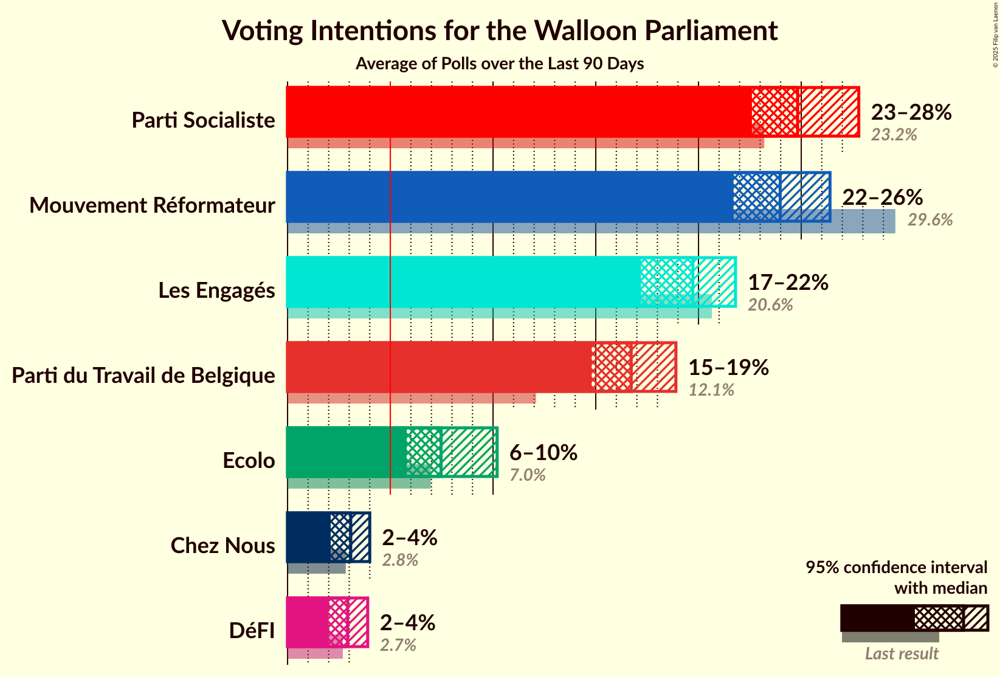

# Poll Average

<a href="#voting-intentions">Voting Intentions</a> | <a href="#seats">Seats</a> | <a href="#coalitions">Coalitions</a> | <a href="#technical-information">Technical Information</a>

## Summary

The table below lists the polls on which the average is based. They are the most recent polls (less than 90 days old) registered and analyzed so far.

| Period     | Polling firm/Commissioner(s) | PS | MR | ECOLO | PTB | CDH | DÉFI | PP | DROITE |
|:----------:|:----------------------------:|:--:|:--:|:--:|:--:|:--:|:--:|:--:|:--:|
| 26 May 2019 | General Election | 26.2%   23 | 21.4%   20 | 14.5%   12 | 13.7%   10 | 11.0%   10 | 4.1%   0 | 3.7%   0 | 0.2%   0 |
| N/A | Poll Average | 22–28%   19–23 | 20–25%   18–21 | 13–18%   12–14 | 16–21%   15–17 | 6–10%   3–7 | 3–6%   0–1 | N/A   N/A | N/A   N/A |
| [1–8 December 2021](2021-12-08-Ipsos.html) | Ipsos   Het Laatste Nieuws, Le Soir, RTL TVi and VTM | 22–28%   19–23 | 20–25%   18–21 | 13–18%   12–14 | 16–21%   15–17 | 6–10%   3–7 | 3–6%   0–1 | N/A   N/A | N/A   N/A |
| 26 May 2019 | General Election | 26.2%   23 | 21.4%   20 | 14.5%   12 | 13.7%   10 | 11.0%   10 | 4.1%   0 | 3.7%   0 | 0.2%   0 |

Only polls for which at least the sample size has been published are included in the table above.

**Legend:**
+ **Top half of each row:** Voting intentions (95% confidence interval)
+ **Bottom half of each row:** Seat projections for the Walloon Parliament (95% confidence interval)
+ **PS:** Parti Socialiste
+ **MR:** Mouvement Réformateur
+ **ECOLO:** Ecolo
+ **PTB:** Parti du Travail de Belgique
+ **CDH:** Centre démocrate humaniste
+ **DÉFI:** DéFI
+ **PP:** Parti Populaire
+ **DROITE:** La Droite
+ **N/A (single party):** Party not included the published results
+ **N/A (entire row):** Calculation for this opinion poll not started yet

## Voting Intentions

### Confidence Intervals

| Party | Last Result | Median | 80% Confidence Interval | 90% Confidence Interval | 95% Confidence Interval | 99% Confidence Interval |
|:-----:|:-----------:|:------:|:-----------------------:|:-----------------------:|:-----------------------:|:-----------------------:|
| <a href="#parti-socialiste">Parti Socialiste</a> | 26.2% | 24.9% | 23.1–26.7% |22.7–27.2% | 22.2–27.7% | 21.4–28.6% |
| <a href="#mouvement-réformateur">Mouvement Réformateur</a> | 21.4% | 22.3% | 20.6–24.1% |20.2–24.6% | 19.8–25.0% | 19.0–25.9% |
| <a href="#ecolo">Ecolo</a> | 14.5% | 15.6% | 14.1–17.1% |13.7–17.5% | 13.4–17.9% | 12.7–18.7% |
| <a href="#parti-du-travail-de-belgique">Parti du Travail de Belgique</a> | 13.7% | 18.3% | 16.7–19.9% |16.3–20.4% | 15.9–20.8% | 15.2–21.6% |
| <a href="#centre-démocrate-humaniste">Centre démocrate humaniste</a> | 11.0% | 8.1% | 7.0–9.2% |6.7–9.6% | 6.5–9.9% | 6.0–10.5% |
| <a href="#défi">DéFI</a> | 4.1% | 4.2% | 3.5–5.1% |3.2–5.4% | 3.1–5.6% | 2.8–6.1% |
| <a href="#parti-populaire">Parti Populaire</a> | 3.7% | N/A | N/A |N/A | N/A | N/A |
| <a href="#la-droite">La Droite</a> | 0.2% | N/A | N/A |N/A | N/A | N/A |

### Parti Socialiste

*For a full overview of the results for this party, see the [Parti Socialiste](party-partisocialiste.html) page.*

| Voting Intentions | Probability | Accumulated | Special Marks |
|:-----------------:|:-----------:|:-----------:|:-------------:|
| 19.5–20.5% | 0.1% | 100% |  |
| 20.5–21.5% | 0.6% | 99.9% |  |
| 21.5–22.5% | 4% | 99.4% |  |
| 22.5–23.5% | 12% | 96% |  |
| 23.5–24.5% | 24% | 84% |  |
| 24.5–25.5% | 28% | 60% | Median |
| 25.5–26.5% | 20% | 32% | Last Result |
| 26.5–27.5% | 9% | 12% |  |
| 27.5–28.5% | 3% | 3% |  |
| 28.5–29.5% | 0.5% | 0.6% |  |
| 29.5–30.5% | 0.1% | 0.1% |  |
| 30.5–31.5% | 0% | 0% |  |

### Mouvement Réformateur

*For a full overview of the results for this party, see the [Mouvement Réformateur](party-mouvementréformateur.html) page.*

| Voting Intentions | Probability | Accumulated | Special Marks |
|:-----------------:|:-----------:|:-----------:|:-------------:|
| 16.5–17.5% | 0% | 100% |  |
| 17.5–18.5% | 0.2% | 100% |  |
| 18.5–19.5% | 2% | 99.8% |  |
| 19.5–20.5% | 7% | 98% |  |
| 20.5–21.5% | 19% | 91% | Last Result |
| 21.5–22.5% | 29% | 71% | Median |
| 22.5–23.5% | 25% | 43% |  |
| 23.5–24.5% | 13% | 18% |  |
| 24.5–25.5% | 4% | 5% |  |
| 25.5–26.5% | 0.8% | 1.0% |  |
| 26.5–27.5% | 0.1% | 0.1% |  |
| 27.5–28.5% | 0% | 0% |  |

### Ecolo

*For a full overview of the results for this party, see the [Ecolo](party-ecolo.html) page.*

| Voting Intentions | Probability | Accumulated | Special Marks |
|:-----------------:|:-----------:|:-----------:|:-------------:|
| 10.5–11.5% | 0% | 100% |  |
| 11.5–12.5% | 0.3% | 100% |  |
| 12.5–13.5% | 3% | 99.7% |  |
| 13.5–14.5% | 15% | 96% | Last Result |
| 14.5–15.5% | 31% | 81% |  |
| 15.5–16.5% | 30% | 50% | Median |
| 16.5–17.5% | 15% | 20% |  |
| 17.5–18.5% | 4% | 5% |  |
| 18.5–19.5% | 0.7% | 0.7% |  |
| 19.5–20.5% | 0.1% | 0.1% |  |
| 20.5–21.5% | 0% | 0% |  |

### Parti du Travail de Belgique

*For a full overview of the results for this party, see the [Parti du Travail de Belgique](party-partidutravaildebelgique.html) page.*

| Voting Intentions | Probability | Accumulated | Special Marks |
|:-----------------:|:-----------:|:-----------:|:-------------:|
| 12.5–13.5% | 0% | 100% |  |
| 13.5–14.5% | 0.1% | 100% | Last Result |
| 14.5–15.5% | 1.1% | 99.9% |  |
| 15.5–16.5% | 7% | 98.8% |  |
| 16.5–17.5% | 20% | 92% |  |
| 17.5–18.5% | 31% | 72% | Median |
| 18.5–19.5% | 25% | 41% |  |
| 19.5–20.5% | 12% | 15% |  |
| 20.5–21.5% | 3% | 4% |  |
| 21.5–22.5% | 0.5% | 0.6% |  |
| 22.5–23.5% | 0% | 0.1% |  |
| 23.5–24.5% | 0% | 0% |  |

### Centre démocrate humaniste

*For a full overview of the results for this party, see the [Centre démocrate humaniste](party-centredémocratehumaniste.html) page.*

| Voting Intentions | Probability | Accumulated | Special Marks |
|:-----------------:|:-----------:|:-----------:|:-------------:|
| 4.5–5.5% | 0.1% | 100% |  |
| 5.5–6.5% | 3% | 99.9% |  |
| 6.5–7.5% | 24% | 97% |  |
| 7.5–8.5% | 43% | 73% | Median |
| 8.5–9.5% | 24% | 30% |  |
| 9.5–10.5% | 5% | 5% |  |
| 10.5–11.5% | 0.4% | 0.5% | Last Result |
| 11.5–12.5% | 0% | 0% |  |

### DéFI

*For a full overview of the results for this party, see the [DéFI](party-défi.html) page.*

| Voting Intentions | Probability | Accumulated | Special Marks |
|:-----------------:|:-----------:|:-----------:|:-------------:|
| 0.5–1.5% | 0% | 100% |  |
| 1.5–2.5% | 0.1% | 100% |  |
| 2.5–3.5% | 13% | 99.9% |  |
| 3.5–4.5% | 56% | 86% | Last Result, Median |
| 4.5–5.5% | 28% | 31% |  |
| 5.5–6.5% | 3% | 3% |  |
| 6.5–7.5% | 0.1% | 0.1% |  |
| 7.5–8.5% | 0% | 0% |  |

## Seats

### Confidence Intervals

| Party | Last Result | Median | 80% Confidence Interval | 90% Confidence Interval | 95% Confidence Interval | 99% Confidence Interval |
|:-----:|:-----------:|:------:|:-----------------------:|:-----------------------:|:-----------------------:|:-----------------------:|
| <a href="#parti-socialiste">Parti Socialiste</a> | 23 | 21 | 20–23 |20–23 | 19–23 | 18–24 |
| <a href="#mouvement-réformateur">Mouvement Réformateur</a> | 20 | 20 | 19–21 |18–21 | 18–21 | 17–22 |
| <a href="#ecolo">Ecolo</a> | 12 | 13 | 12–14 |12–14 | 12–14 | 11–15 |
| <a href="#parti-du-travail-de-belgique">Parti du Travail de Belgique</a> | 10 | 16 | 15–17 |15–17 | 15–17 | 13–18 |
| <a href="#centre-démocrate-humaniste">Centre démocrate humaniste</a> | 10 | 5 | 4–6 |4–6 | 3–7 | 2–7 |
| <a href="#défi">DéFI</a> | 0 | 0 | 0 |0 | 0–1 | 0–4 |
| <a href="#parti-populaire">Parti Populaire</a> | 0 | N/A | N/A |N/A | N/A | N/A |
| <a href="#la-droite">La Droite</a> | 0 | N/A | N/A |N/A | N/A | N/A |

### Parti Socialiste

*For a full overview of the results for this party, see the [Parti Socialiste](party-partisocialiste.html) page.*

| Number of Seats | Probability | Accumulated | Special Marks |
|:---------------:|:-----------:|:-----------:|:-------------:|
| 17 | 0.2% | 100% |  |
| 18 | 0.5% | 99.8% |  |
| 19 | 2% | 99.3% |  |
| 20 | 22% | 97% |  |
| 21 | 31% | 75% | Median |
| 22 | 29% | 44% |  |
| 23 | 13% | 14% | Last Result |
| 24 | 1.1% | 2% |  |
| 25 | 0.3% | 0.5% |  |
| 26 | 0.1% | 0.1% |  |
| 27 | 0% | 0% |  |

### Mouvement Réformateur

*For a full overview of the results for this party, see the [Mouvement Réformateur](party-mouvementréformateur.html) page.*

| Number of Seats | Probability | Accumulated | Special Marks |
|:---------------:|:-----------:|:-----------:|:-------------:|
| 15 | 0.1% | 100% |  |
| 16 | 0.3% | 99.9% |  |
| 17 | 0.9% | 99.6% |  |
| 18 | 4% | 98.7% |  |
| 19 | 39% | 94% |  |
| 20 | 25% | 55% | Last Result, Median |
| 21 | 28% | 30% |  |
| 22 | 1.2% | 2% |  |
| 23 | 0.2% | 0.3% |  |
| 24 | 0.1% | 0.1% |  |
| 25 | 0% | 0% |  |

### Ecolo

*For a full overview of the results for this party, see the [Ecolo](party-ecolo.html) page.*

| Number of Seats | Probability | Accumulated | Special Marks |
|:---------------:|:-----------:|:-----------:|:-------------:|
| 9 | 0.1% | 100% |  |
| 10 | 0.3% | 99.9% |  |
| 11 | 2% | 99.7% |  |
| 12 | 37% | 98% | Last Result |
| 13 | 38% | 61% | Median |
| 14 | 21% | 23% |  |
| 15 | 2% | 2% |  |
| 16 | 0.2% | 0.3% |  |
| 17 | 0.1% | 0.1% |  |
| 18 | 0% | 0% |  |

### Parti du Travail de Belgique

*For a full overview of the results for this party, see the [Parti du Travail de Belgique](party-partidutravaildebelgique.html) page.*

| Number of Seats | Probability | Accumulated | Special Marks |
|:---------------:|:-----------:|:-----------:|:-------------:|
| 10 | 0% | 100% | Last Result |
| 11 | 0.1% | 100% |  |
| 12 | 0.3% | 99.9% |  |
| 13 | 0.7% | 99.5% |  |
| 14 | 1.3% | 98.8% |  |
| 15 | 45% | 98% |  |
| 16 | 18% | 52% | Median |
| 17 | 32% | 34% |  |
| 18 | 2% | 2% |  |
| 19 | 0.3% | 0.4% |  |
| 20 | 0.1% | 0.1% |  |
| 21 | 0% | 0% |  |

### Centre démocrate humaniste

*For a full overview of the results for this party, see the [Centre démocrate humaniste](party-centredémocratehumaniste.html) page.*

| Number of Seats | Probability | Accumulated | Special Marks |
|:---------------:|:-----------:|:-----------:|:-------------:|
| 2 | 0.8% | 100% |  |
| 3 | 2% | 99.2% |  |
| 4 | 28% | 97% |  |
| 5 | 26% | 69% | Median |
| 6 | 41% | 44% |  |
| 7 | 2% | 3% |  |
| 8 | 0.3% | 0.4% |  |
| 9 | 0% | 0.1% |  |
| 10 | 0% | 0% | Last Result |

### DéFI

*For a full overview of the results for this party, see the [DéFI](party-défi.html) page.*

| Number of Seats | Probability | Accumulated | Special Marks |
|:---------------:|:-----------:|:-----------:|:-------------:|
| 0 | 97% | 100% | Last Result, Median |
| 1 | 1.3% | 3% |  |
| 2 | 0.6% | 2% |  |
| 3 | 1.0% | 2% |  |
| 4 | 0.5% | 0.5% |  |
| 5 | 0% | 0% |  |

### Parti Populaire

*For a full overview of the results for this party, see the [Parti Populaire](party-partipopulaire.html) page.*

### La Droite

*For a full overview of the results for this party, see the [La Droite](party-ladroite.html) page.*

## Coalitions

### Confidence Intervals

| Coalition | Last Result | Median | Majority? | 80% Confidence Interval | 90% Confidence Interval | 95% Confidence Interval | 99% Confidence Interval |
|:---------:|:-----------:|:------:|:---------:|:-----------------------:|:-----------------------:|:-----------------------:|:-----------------------:|
| Parti Socialiste – Mouvement Réformateur – Ecolo | 55 | 54 | 100% | 52–56 | 52–56 | 52–56 | 50–57 |
| Parti Socialiste – Ecolo – Parti du Travail de Belgique | 45 | 50 | 100% | 48–52 | 48–52 | 48–52 | 47–53 |
| Parti Socialiste – Parti du Travail de Belgique – Centre démocrate humaniste | 43 | 42 | 99.9% | 41–44 | 40–44 | 40–44 | 39–45 |
| Parti Socialiste – Mouvement Réformateur | 43 | 41 | 99.4% | 39–43 | 39–43 | 39–44 | 37–44 |
| Parti Socialiste – Ecolo – Centre démocrate humaniste | 45 | 39 | 91% | 38–41 | 37–41 | 37–42 | 36–43 |
| Mouvement Réformateur – Ecolo – Centre démocrate humaniste | 42 | 38 | 58% | 36–39 | 36–40 | 35–40 | 34–41 |
| Parti Socialiste – Parti du Travail de Belgique | 33 | 37 | 40% | 36–39 | 35–39 | 35–40 | 34–40 |
| Parti Socialiste – Ecolo | 35 | 34 | 0.8% | 33–36 | 32–36 | 32–37 | 31–38 |
| Mouvement Réformateur – Ecolo | 32 | 33 | 0% | 31–34 | 31–35 | 31–35 | 29–35 |
| Ecolo – Parti du Travail de Belgique | 22 | 29 | 0% | 27–30 | 27–30 | 27–31 | 25–32 |
| Parti Socialiste – Centre démocrate humaniste | 33 | 26 | 0% | 25–28 | 24–29 | 24–29 | 23–30 |
| Mouvement Réformateur – Centre démocrate humaniste | 30 | 25 | 0% | 23–27 | 23–27 | 22–27 | 22–28 |

### Parti Socialiste – Mouvement Réformateur – Ecolo

| Number of Seats | Probability | Accumulated | Special Marks |
|:---------------:|:-----------:|:-----------:|:-------------:|
| 49 | 0.1% | 100% |  |
| 50 | 0.5% | 99.8% |  |
| 51 | 2% | 99.3% |  |
| 52 | 10% | 98% |  |
| 53 | 20% | 87% |  |
| 54 | 36% | 67% | Median |
| 55 | 19% | 31% | Last Result |
| 56 | 10% | 12% |  |
| 57 | 0.9% | 1.2% |  |
| 58 | 0.3% | 0.3% |  |
| 59 | 0.1% | 0.1% |  |
| 60 | 0% | 0% |  |

### Parti Socialiste – Ecolo – Parti du Travail de Belgique

| Number of Seats | Probability | Accumulated | Special Marks |
|:---------------:|:-----------:|:-----------:|:-------------:|
| 45 | 0.1% | 100% | Last Result |
| 46 | 0.2% | 99.9% |  |
| 47 | 1.3% | 99.6% |  |
| 48 | 11% | 98% |  |
| 49 | 15% | 88% |  |
| 50 | 46% | 73% | Median |
| 51 | 13% | 26% |  |
| 52 | 11% | 13% |  |
| 53 | 2% | 2% |  |
| 54 | 0.3% | 0.3% |  |
| 55 | 0.1% | 0.1% |  |
| 56 | 0% | 0% |  |

### Parti Socialiste – Parti du Travail de Belgique – Centre démocrate humaniste

| Number of Seats | Probability | Accumulated | Special Marks |
|:---------------:|:-----------:|:-----------:|:-------------:|
| 37 | 0.1% | 100% |  |
| 38 | 0.2% | 99.9% | Majority |
| 39 | 0.5% | 99.8% |  |
| 40 | 5% | 99.2% |  |
| 41 | 15% | 94% |  |
| 42 | 41% | 79% | Median |
| 43 | 21% | 38% | Last Result |
| 44 | 16% | 17% |  |
| 45 | 0.9% | 1.3% |  |
| 46 | 0.3% | 0.5% |  |
| 47 | 0.1% | 0.1% |  |
| 48 | 0% | 0% |  |

### Parti Socialiste – Mouvement Réformateur

| Number of Seats | Probability | Accumulated | Special Marks |
|:---------------:|:-----------:|:-----------:|:-------------:|
| 36 | 0.1% | 100% |  |
| 37 | 0.5% | 99.9% |  |
| 38 | 2% | 99.4% | Majority |
| 39 | 9% | 98% |  |
| 40 | 15% | 89% |  |
| 41 | 40% | 74% | Median |
| 42 | 19% | 33% |  |
| 43 | 12% | 15% | Last Result |
| 44 | 2% | 3% |  |
| 45 | 0.3% | 0.4% |  |
| 46 | 0.1% | 0.1% |  |
| 47 | 0% | 0% |  |

### Parti Socialiste – Ecolo – Centre démocrate humaniste

| Number of Seats | Probability | Accumulated | Special Marks |
|:---------------:|:-----------:|:-----------:|:-------------:|
| 35 | 0.1% | 100% |  |
| 36 | 0.7% | 99.8% |  |
| 37 | 8% | 99.1% |  |
| 38 | 12% | 91% | Majority |
| 39 | 41% | 79% | Median |
| 40 | 19% | 38% |  |
| 41 | 16% | 19% |  |
| 42 | 2% | 3% |  |
| 43 | 0.6% | 0.8% |  |
| 44 | 0.2% | 0.2% |  |
| 45 | 0.1% | 0.1% | Last Result |
| 46 | 0% | 0% |  |

### Mouvement Réformateur – Ecolo – Centre démocrate humaniste

| Number of Seats | Probability | Accumulated | Special Marks |
|:---------------:|:-----------:|:-----------:|:-------------:|
| 33 | 0.1% | 100% |  |
| 34 | 0.6% | 99.9% |  |
| 35 | 3% | 99.2% |  |
| 36 | 9% | 96% |  |
| 37 | 28% | 86% |  |
| 38 | 30% | 58% | Median, Majority |
| 39 | 21% | 28% |  |
| 40 | 6% | 7% |  |
| 41 | 0.8% | 1.1% |  |
| 42 | 0.2% | 0.3% | Last Result |
| 43 | 0% | 0.1% |  |
| 44 | 0% | 0% |  |

### Parti Socialiste – Parti du Travail de Belgique

| Number of Seats | Probability | Accumulated | Special Marks |
|:---------------:|:-----------:|:-----------:|:-------------:|
| 32 | 0.1% | 100% |  |
| 33 | 0.3% | 99.9% | Last Result |
| 34 | 1.0% | 99.6% |  |
| 35 | 7% | 98.6% |  |
| 36 | 22% | 92% |  |
| 37 | 30% | 70% | Median |
| 38 | 28% | 40% | Majority |
| 39 | 9% | 12% |  |
| 40 | 3% | 3% |  |
| 41 | 0.3% | 0.4% |  |
| 42 | 0% | 0.1% |  |
| 43 | 0% | 0% |  |

### Parti Socialiste – Ecolo

| Number of Seats | Probability | Accumulated | Special Marks |
|:---------------:|:-----------:|:-----------:|:-------------:|
| 30 | 0.3% | 100% |  |
| 31 | 1.0% | 99.7% |  |
| 32 | 6% | 98.7% |  |
| 33 | 27% | 93% |  |
| 34 | 22% | 66% | Median |
| 35 | 34% | 44% | Last Result |
| 36 | 7% | 10% |  |
| 37 | 3% | 3% |  |
| 38 | 0.6% | 0.8% | Majority |
| 39 | 0.1% | 0.1% |  |
| 40 | 0% | 0% |  |

### Mouvement Réformateur – Ecolo

| Number of Seats | Probability | Accumulated | Special Marks |
|:---------------:|:-----------:|:-----------:|:-------------:|
| 28 | 0.2% | 100% |  |
| 29 | 0.5% | 99.8% |  |
| 30 | 2% | 99.3% |  |
| 31 | 16% | 98% |  |
| 32 | 22% | 81% | Last Result |
| 33 | 40% | 60% | Median |
| 34 | 14% | 20% |  |
| 35 | 5% | 5% |  |
| 36 | 0.3% | 0.5% |  |
| 37 | 0.1% | 0.1% |  |
| 38 | 0% | 0% | Majority |

### Ecolo – Parti du Travail de Belgique

| Number of Seats | Probability | Accumulated | Special Marks |
|:---------------:|:-----------:|:-----------:|:-------------:|
| 22 | 0% | 100% | Last Result |
| 23 | 0% | 100% |  |
| 24 | 0.2% | 99.9% |  |
| 25 | 0.4% | 99.8% |  |
| 26 | 1.3% | 99.4% |  |
| 27 | 14% | 98% |  |
| 28 | 29% | 84% |  |
| 29 | 29% | 55% | Median |
| 30 | 21% | 26% |  |
| 31 | 4% | 5% |  |
| 32 | 0.9% | 1.0% |  |
| 33 | 0.1% | 0.2% |  |
| 34 | 0% | 0% |  |

### Parti Socialiste – Centre démocrate humaniste

| Number of Seats | Probability | Accumulated | Special Marks |
|:---------------:|:-----------:|:-----------:|:-------------:|
| 22 | 0.1% | 100% |  |
| 23 | 0.6% | 99.8% |  |
| 24 | 4% | 99.2% |  |
| 25 | 17% | 95% |  |
| 26 | 28% | 77% | Median |
| 27 | 33% | 49% |  |
| 28 | 12% | 17% |  |
| 29 | 4% | 5% |  |
| 30 | 0.6% | 0.9% |  |
| 31 | 0.2% | 0.3% |  |
| 32 | 0% | 0.1% |  |
| 33 | 0% | 0% | Last Result |

### Mouvement Réformateur – Centre démocrate humaniste

| Number of Seats | Probability | Accumulated | Special Marks |
|:---------------:|:-----------:|:-----------:|:-------------:|
| 20 | 0.1% | 100% |  |
| 21 | 0.4% | 99.9% |  |
| 22 | 2% | 99.5% |  |
| 23 | 12% | 97% |  |
| 24 | 14% | 85% |  |
| 25 | 46% | 72% | Median |
| 26 | 15% | 26% |  |
| 27 | 10% | 11% |  |
| 28 | 1.0% | 1.2% |  |
| 29 | 0.1% | 0.2% |  |
| 30 | 0% | 0% | Last Result |

## Technical Information

+ **Number of polls included in this average:** 1
+ **Lowest number of simulations done in a poll included in this average:** 1,048,576
+ **Total number of simulations done in the polls included in this average:** 1,048,576
+ **Error estimate:** 0.98%
