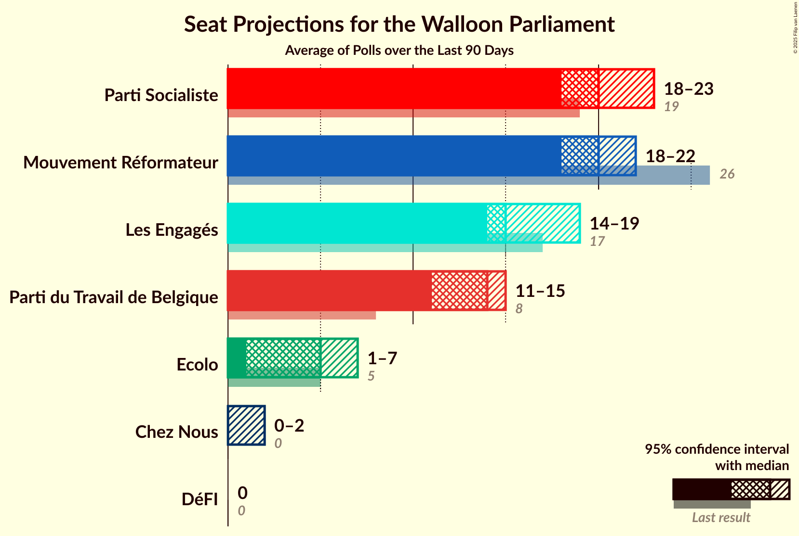

# Poll Average

<a href="#voting-intentions">Voting Intentions</a> | <a href="#seats">Seats</a> | <a href="#coalitions">Coalitions</a> | <a href="#technical-information">Technical Information</a>

The table below lists the polls on which the average is based. They are the most recent polls (less than 90 days old) registered and analyzed so far.

| Period     | Pollster/Media   | PS | MR | CDH | ECOLO | PTB | PP | DÉFI |
|:----------:|:----------------:|:--:|:--:|:--:|:--:|:--:|:--:|:--:|
| 25 May 2014 | General Election | 30.9%   30 | 26.7%   25 | 15.2%   13 | 8.6%   4 | 5.8%   2 | 4.9%   1 | 2.5%   0 |
| N/A | Poll Average | 11–16 | 18–25 | 5–10 | 6–12 | 18–24 | N/A | 0–2 |
| [23–27 June 2017](2017-06-27-Dedicated.html) | Dedicated   MR | 13–19%   11–16 | 20–27%   18–25 | 8–12%   5–10 | 9–14%   6–12 | 22–29%   18–24 | N/A   N/A | 3–6%   0–2 |
| 25 May 2014 | General Election | 30.9%   30 | 26.7%   25 | 15.2%   13 | 8.6%   4 | 5.8%   2 | 4.9%   1 | 2.5%   0 |

Only polls for which at least the sample size has been published are included in the table above.

**Legend:**
+ **Top half of each row:** Voting intentions (95% confidence interval)
+ **Bottom half of each row:** Seat projections for the Walloon Parliament (95% confidence interval)
+ **PS:** PS
+ **MR:** MR
+ **CDH:** cdH
+ **ECOLO:** Ecolo
+ **PTB:** PTB
+ **PP:** Parti Populaire
+ **DÉFI:** DéFI
+ **N/A (single party):** Party not included the published results
+ **N/A (entire row):** Calculation for this opinion poll not started yet

## Voting Intentions

## Seats

### Confidence Intervals

| Party | Last Result | Median | 80% Confidence Interval | 90% Confidence Interval | 95% Confidence Interval | 99% Confidence Interval |
|:-----:|:-----------:|:------:|:-----------------------:|:-----------------------:|:-----------------------:|:-----------------------:|
| <a href="#ps">PS</a> | 30 | 15 | 12–16 |11–16 | 11–16 | 9–18 |
| <a href="#mr">MR</a> | 25 | 21 | 20–23 |19–24 | 18–25 | 16–26 |
| <a href="#cdh">cdH</a> | 13 | 7 | 5–10 |5–10 | 5–10 | 5–12 |
| <a href="#ecolo">Ecolo</a> | 4 | 9 | 6–11 |6–11 | 6–12 | 6–13 |
| <a href="#ptb">PTB</a> | 2 | 22 | 20–24 |19–24 | 18–24 | 17–27 |
| <a href="#parti-populaire">Parti Populaire</a> | 1 | N/A | N/A |N/A | N/A | N/A |
| <a href="#défi">DéFI</a> | 0 | 0 | 0–1 |0–1 | 0–2 | 0–3 |

### PS

| Number of Seats | Probability | Accumulated |
|:---------------:|:-----------:|:-----------:|
| 8 | 0.1% | 100% |
| 9 | 0.6% | 99.9% |
| 10 | 0.6% | 99.3% |
| 11 | 4% | 98.7% |
| 12 | 9% | 94% |
| 13 | 21% | 85% |
| 14 | 3% | 65% |
| 15 | 44% | 62% |
| 16 | 16% | 18% |
| 17 | 0.7% | 2% |
| 18 | 0.7% | 0.9% |
| 19 | 0.2% | 0.2% |
| 20 | 0% | 0% |

### MR

| Number of Seats | Probability | Accumulated |
|:---------------:|:-----------:|:-----------:|
| 15 | 0.3% | 100% |
| 16 | 0.6% | 99.7% |
| 17 | 0.7% | 99.1% |
| 18 | 2% | 98% |
| 19 | 6% | 97% |
| 20 | 32% | 90% |
| 21 | 25% | 58% |
| 22 | 12% | 33% |
| 23 | 11% | 21% |
| 24 | 6% | 9% |
| 25 | 2% | 3% |
| 26 | 0.4% | 0.6% |
| 27 | 0.2% | 0.2% |
| 28 | 0% | 0% |

### cdH

| Number of Seats | Probability | Accumulated |
|:---------------:|:-----------:|:-----------:|
| 4 | 0% | 100% |
| 5 | 19% | 99.9% |
| 6 | 19% | 81% |
| 7 | 14% | 63% |
| 8 | 10% | 49% |
| 9 | 15% | 39% |
| 10 | 23% | 24% |
| 11 | 0.4% | 1.1% |
| 12 | 0.6% | 0.6% |
| 13 | 0% | 0% |

### Ecolo

| Number of Seats | Probability | Accumulated |
|:---------------:|:-----------:|:-----------:|
| 6 | 14% | 100% |
| 7 | 9% | 86% |
| 8 | 9% | 77% |
| 9 | 19% | 68% |
| 10 | 19% | 49% |
| 11 | 28% | 30% |
| 12 | 0.9% | 3% |
| 13 | 2% | 2% |
| 14 | 0% | 0% |

### PTB

| Number of Seats | Probability | Accumulated |
|:---------------:|:-----------:|:-----------:|
| 17 | 1.1% | 100% |
| 18 | 2% | 98.9% |
| 19 | 4% | 97% |
| 20 | 25% | 93% |
| 21 | 12% | 68% |
| 22 | 35% | 56% |
| 23 | 10% | 22% |
| 24 | 9% | 11% |
| 25 | 1.0% | 2% |
| 26 | 0.4% | 0.9% |
| 27 | 0.5% | 0.5% |
| 28 | 0.1% | 0.1% |
| 29 | 0% | 0% |

### DéFI

| Number of Seats | Probability | Accumulated |
|:---------------:|:-----------:|:-----------:|
| 0 | 70% | 100% |
| 1 | 25% | 30% |
| 2 | 4% | 5% |
| 3 | 0.3% | 0.8% |
| 4 | 0.3% | 0.5% |
| 5 | 0.2% | 0.2% |
| 6 | 0% | 0% |

## Coalitions

### Confidence Intervals

| Coalition | Last Result | Median | 80% Confidence Interval | 90% Confidence Interval | 95% Confidence Interval | 99% Confidence Interval |
|:---------:|:-----------:|:------:|:-----------------------:|:-----------------------:|:-----------------------:|:-----------------------:|
| PS – Ecolo – PTB | 36 | 45 | 42–48 | 41–49 | 41–49 | 39–50 |
| PS – MR – Ecolo | 59 | 45 | 41–47 | 41–48 | 40–48 | 39–49 |
| PS – cdH – PTB | 45 | 43 | 41–47 | 40–47 | 39–48 | 38–49 |
| MR – cdH – Ecolo | 42 | 38 | 35–40 | 35–41 | 35–42 | 33–43 |
| PS – PTB | 32 | 36 | 33–38 | 32–39 | 32–39 | 30–41 |
| PS – MR | 55 | 35 | 33–38 | 32–39 | 31–39 | 30–41 |
| PS – cdH – Ecolo | 47 | 31 | 28–33 | 27–34 | 27–35 | 26–36 |
| MR – Ecolo | 29 | 30 | 27–33 | 26–33 | 26–34 | 25–35 |
| MR – cdH | 38 | 29 | 26–31 | 25–32 | 25–33 | 24–34 |
| PS – cdH | 43 | 22 | 19–25 | 18–25 | 18–26 | 17–27 |

### PS – Ecolo – PTB

| Number of Seats | Probability | Accumulated |
|:---------------:|:-----------:|:-----------:|
| 38 | 0.2% | 100% |
| 39 | 0.4% | 99.8% |
| 40 | 2% | 99.4% |
| 41 | 5% | 98% |
| 42 | 6% | 93% |
| 43 | 15% | 87% |
| 44 | 19% | 72% |
| 45 | 14% | 53% |
| 46 | 13% | 39% |
| 47 | 11% | 26% |
| 48 | 9% | 15% |
| 49 | 4% | 6% |
| 50 | 2% | 2% |
| 51 | 0.1% | 0.2% |
| 52 | 0% | 0% |

### PS – MR – Ecolo

| Number of Seats | Probability | Accumulated |
|:---------------:|:-----------:|:-----------:|
| 38 | 0.1% | 100% |
| 39 | 0.9% | 99.8% |
| 40 | 3% | 98.9% |
| 41 | 7% | 96% |
| 42 | 11% | 89% |
| 43 | 10% | 78% |
| 44 | 15% | 68% |
| 45 | 18% | 53% |
| 46 | 15% | 35% |
| 47 | 12% | 20% |
| 48 | 6% | 8% |
| 49 | 2% | 2% |
| 50 | 0.3% | 0.4% |
| 51 | 0.1% | 0.1% |
| 52 | 0% | 0% |

### PS – cdH – PTB

| Number of Seats | Probability | Accumulated |
|:---------------:|:-----------:|:-----------:|
| 36 | 0% | 100% |
| 37 | 0.3% | 99.9% |
| 38 | 1.1% | 99.7% |
| 39 | 2% | 98.6% |
| 40 | 5% | 96% |
| 41 | 12% | 92% |
| 42 | 21% | 79% |
| 43 | 15% | 58% |
| 44 | 13% | 43% |
| 45 | 12% | 30% |
| 46 | 6% | 18% |
| 47 | 8% | 12% |
| 48 | 2% | 3% |
| 49 | 1.1% | 1.2% |
| 50 | 0.1% | 0.1% |
| 51 | 0% | 0% |

### MR – cdH – Ecolo

| Number of Seats | Probability | Accumulated |
|:---------------:|:-----------:|:-----------:|
| 32 | 0.4% | 100% |
| 33 | 0.4% | 99.6% |
| 34 | 2% | 99.2% |
| 35 | 9% | 98% |
| 36 | 13% | 88% |
| 37 | 16% | 75% |
| 38 | 26% | 59% |
| 39 | 16% | 33% |
| 40 | 10% | 17% |
| 41 | 5% | 8% |
| 42 | 3% | 3% |
| 43 | 0.4% | 0.6% |
| 44 | 0.1% | 0.2% |
| 45 | 0% | 0.1% |
| 46 | 0% | 0% |

### PS – PTB

| Number of Seats | Probability | Accumulated |
|:---------------:|:-----------:|:-----------:|
| 29 | 0.2% | 100% |
| 30 | 0.3% | 99.8% |
| 31 | 2% | 99.4% |
| 32 | 4% | 98% |
| 33 | 7% | 94% |
| 34 | 8% | 87% |
| 35 | 25% | 79% |
| 36 | 17% | 54% |
| 37 | 19% | 37% |
| 38 | 13% | 19% |
| 39 | 4% | 6% |
| 40 | 1.4% | 2% |
| 41 | 0.3% | 0.5% |
| 42 | 0.2% | 0.2% |
| 43 | 0.1% | 0.1% |
| 44 | 0% | 0% |

### PS – MR

| Number of Seats | Probability | Accumulated |
|:---------------:|:-----------:|:-----------:|
| 28 | 0.1% | 100% |
| 29 | 0.3% | 99.9% |
| 30 | 2% | 99.6% |
| 31 | 2% | 98% |
| 32 | 4% | 96% |
| 33 | 10% | 92% |
| 34 | 10% | 81% |
| 35 | 23% | 72% |
| 36 | 25% | 49% |
| 37 | 10% | 24% |
| 38 | 8% | 14% |
| 39 | 3% | 5% |
| 40 | 2% | 2% |
| 41 | 0.4% | 0.6% |
| 42 | 0.2% | 0.2% |
| 43 | 0% | 0% |

### PS – cdH – Ecolo

| Number of Seats | Probability | Accumulated |
|:---------------:|:-----------:|:-----------:|
| 24 | 0.1% | 100% |
| 25 | 0.3% | 99.9% |
| 26 | 1.4% | 99.6% |
| 27 | 4% | 98% |
| 28 | 5% | 94% |
| 29 | 9% | 89% |
| 30 | 17% | 80% |
| 31 | 27% | 63% |
| 32 | 12% | 36% |
| 33 | 16% | 24% |
| 34 | 6% | 8% |
| 35 | 1.5% | 3% |
| 36 | 0.9% | 1.2% |
| 37 | 0.2% | 0.3% |
| 38 | 0.1% | 0.1% |
| 39 | 0% | 0% |

### MR – Ecolo

| Number of Seats | Probability | Accumulated |
|:---------------:|:-----------:|:-----------:|
| 24 | 0.1% | 100% |
| 25 | 0.8% | 99.8% |
| 26 | 5% | 99.0% |
| 27 | 7% | 94% |
| 28 | 8% | 87% |
| 29 | 12% | 79% |
| 30 | 19% | 67% |
| 31 | 18% | 49% |
| 32 | 18% | 31% |
| 33 | 9% | 13% |
| 34 | 2% | 4% |
| 35 | 2% | 2% |
| 36 | 0.2% | 0.3% |
| 37 | 0.1% | 0.1% |
| 38 | 0% | 0% |

### MR – cdH

| Number of Seats | Probability | Accumulated |
|:---------------:|:-----------:|:-----------:|
| 23 | 0.2% | 100% |
| 24 | 1.3% | 99.7% |
| 25 | 7% | 98% |
| 26 | 8% | 91% |
| 27 | 17% | 83% |
| 28 | 13% | 67% |
| 29 | 17% | 54% |
| 30 | 16% | 37% |
| 31 | 11% | 21% |
| 32 | 6% | 10% |
| 33 | 2% | 3% |
| 34 | 0.9% | 1.0% |
| 35 | 0.2% | 0.2% |
| 36 | 0% | 0% |

### PS – cdH

| Number of Seats | Probability | Accumulated |
|:---------------:|:-----------:|:-----------:|
| 15 | 0.1% | 100% |
| 16 | 0.2% | 99.9% |
| 17 | 1.3% | 99.7% |
| 18 | 4% | 98% |
| 19 | 7% | 95% |
| 20 | 16% | 88% |
| 21 | 21% | 72% |
| 22 | 15% | 50% |
| 23 | 11% | 35% |
| 24 | 8% | 24% |
| 25 | 12% | 16% |
| 26 | 3% | 3% |
| 27 | 0.5% | 0.6% |
| 28 | 0.1% | 0.1% |
| 29 | 0% | 0% |

## Technical Information

