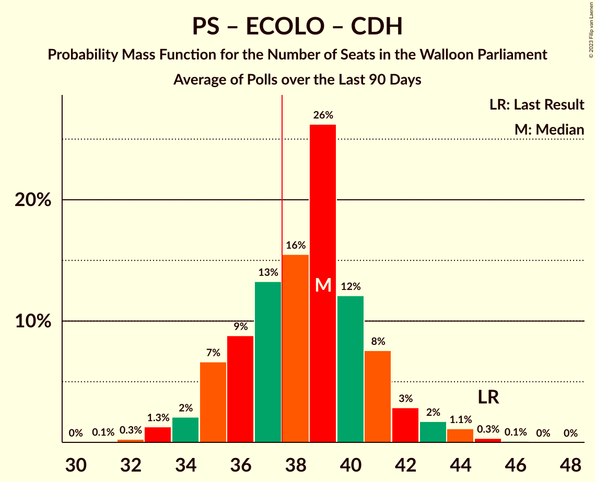

# Poll Average

<a href="#voting-intentions">Voting Intentions</a> | <a href="#seats">Seats</a> | <a href="#coalitions">Coalitions</a> | <a href="#technical-information">Technical Information</a>

## Summary

The table below lists the polls on which the average is based. They are the most recent polls (less than 90 days old) registered and analyzed so far.

| Period     | Polling firm/Commissioner(s) | PS | MR | ECOLO | PTB | CDH | DÉFI | PP | DROITE |
|:----------:|:----------------------------:|:--:|:--:|:--:|:--:|:--:|:--:|:--:|:--:|
| 26 May 2019 | General Election | 26.2%   23 | 21.4%   20 | 14.5%   12 | 13.7%   10 | 11.0%   10 | 4.1%   0 | 3.7%   0 | 0.2%   0 |
| N/A | Poll Average | 21–26%   19–23 | 18–23%   16–21 | 13–18%   12–15 | 16–21%   15–19 | 7–10%   4–7 | 4–6%   0–4 | N/A   N/A | N/A   N/A |
| [10–15 June 2020](2020-06-15-Ipsos.html) | Ipsos   Het Laatste Nieuws, Le Soir, RTL TVi and VTM | 21–26%   19–23 | 18–23%   16–21 | 13–17%   12–15 | 16–21%   15–19 | 7–10%   4–7 | 4–6%   0–4 | N/A   N/A | N/A   N/A |
| 26 May 2019 | General Election | 26.2%   23 | 21.4%   20 | 14.5%   12 | 13.7%   10 | 11.0%   10 | 4.1%   0 | 3.7%   0 | 0.2%   0 |

Only polls for which at least the sample size has been published are included in the table above.

**Legend:**
+ **Top half of each row:** Voting intentions (95% confidence interval)
+ **Bottom half of each row:** Seat projections for the Walloon Parliament (95% confidence interval)
+ **PS:** Parti Socialiste
+ **MR:** Mouvement Réformateur
+ **ECOLO:** Ecolo
+ **PTB:** Parti du Travail de Belgique
+ **CDH:** Centre démocrate humaniste
+ **DÉFI:** DéFI
+ **PP:** Parti Populaire
+ **DROITE:** La Droite
+ **N/A (single party):** Party not included the published results
+ **N/A (entire row):** Calculation for this opinion poll not started yet

## Voting Intentions

### Confidence Intervals

| Party | Last Result | Median | 80% Confidence Interval | 90% Confidence Interval | 95% Confidence Interval | 99% Confidence Interval |
|:-----:|:-----------:|:------:|:-----------------------:|:-----------------------:|:-----------------------:|:-----------------------:|
| <a href="#parti-socialiste">Parti Socialiste</a> | 26.2% | 23.8% | 22.1–25.5% |21.6–26.0% | 21.2–26.5% | 20.4–27.4% |
| <a href="#mouvement-réformateur">Mouvement Réformateur</a> | 21.4% | 20.5% | 18.9–22.2% |18.5–22.7% | 18.1–23.1% | 17.4–24.0% |
| <a href="#ecolo">Ecolo</a> | 14.5% | 15.2% | 13.7–16.7% |13.3–17.1% | 13.0–17.5% | 12.4–18.3% |
| <a href="#parti-du-travail-de-belgique">Parti du Travail de Belgique</a> | 13.7% | 18.7% | 17.2–20.3% |16.7–20.8% | 16.4–21.2% | 15.6–22.0% |
| <a href="#centre-démocrate-humaniste">Centre démocrate humaniste</a> | 11.0% | 8.2% | 7.1–9.3% |6.8–9.7% | 6.6–10.0% | 6.1–10.6% |
| <a href="#défi">DéFI</a> | 4.1% | 4.7% | 3.9–5.6% |3.7–5.9% | 3.5–6.2% | 3.2–6.7% |
| <a href="#parti-populaire">Parti Populaire</a> | 3.7% | N/A | N/A |N/A | N/A | N/A |
| <a href="#la-droite">La Droite</a> | 0.2% | N/A | N/A |N/A | N/A | N/A |

### Parti Socialiste

*For a full overview of the results for this party, see the [Parti Socialiste](party-partisocialiste.html) page.*

| Voting Intentions | Probability | Accumulated | Special Marks |
|:-----------------:|:-----------:|:-----------:|:-------------:|
| 18.5–19.5% | 0.1% | 100% |  |
| 19.5–20.5% | 0.6% | 99.9% |  |
| 20.5–21.5% | 4% | 99.3% |  |
| 21.5–22.5% | 14% | 95% |  |
| 22.5–23.5% | 25% | 82% |  |
| 23.5–24.5% | 28% | 56% | Median |
| 24.5–25.5% | 18% | 28% |  |
| 25.5–26.5% | 8% | 10% | Last Result |
| 26.5–27.5% | 2% | 2% |  |
| 27.5–28.5% | 0.3% | 0.3% |  |
| 28.5–29.5% | 0% | 0% |  |

### Mouvement Réformateur

*For a full overview of the results for this party, see the [Mouvement Réformateur](party-mouvementréformateur.html) page.*

| Voting Intentions | Probability | Accumulated | Special Marks |
|:-----------------:|:-----------:|:-----------:|:-------------:|
| 15.5–16.5% | 0.1% | 100% |  |
| 16.5–17.5% | 0.7% | 99.9% |  |
| 17.5–18.5% | 5% | 99.2% |  |
| 18.5–19.5% | 16% | 94% |  |
| 19.5–20.5% | 28% | 78% |  |
| 20.5–21.5% | 28% | 49% | Last Result, Median |
| 21.5–22.5% | 15% | 22% |  |
| 22.5–23.5% | 5% | 6% |  |
| 23.5–24.5% | 1.0% | 1.1% |  |
| 24.5–25.5% | 0.1% | 0.1% |  |
| 25.5–26.5% | 0% | 0% |  |

### Ecolo

*For a full overview of the results for this party, see the [Ecolo](party-ecolo.html) page.*

| Voting Intentions | Probability | Accumulated | Special Marks |
|:-----------------:|:-----------:|:-----------:|:-------------:|
| 10.5–11.5% | 0% | 100% |  |
| 11.5–12.5% | 0.8% | 100% |  |
| 12.5–13.5% | 7% | 99.2% |  |
| 13.5–14.5% | 22% | 93% | Last Result |
| 14.5–15.5% | 34% | 70% | Median |
| 15.5–16.5% | 25% | 37% |  |
| 16.5–17.5% | 9% | 12% |  |
| 17.5–18.5% | 2% | 2% |  |
| 18.5–19.5% | 0.2% | 0.2% |  |
| 19.5–20.5% | 0% | 0% |  |

### Parti du Travail de Belgique

*For a full overview of the results for this party, see the [Parti du Travail de Belgique](party-partidutravaildebelgique.html) page.*

| Voting Intentions | Probability | Accumulated | Special Marks |
|:-----------------:|:-----------:|:-----------:|:-------------:|
| 13.5–14.5% | 0% | 100% | Last Result |
| 14.5–15.5% | 0.4% | 100% |  |
| 15.5–16.5% | 3% | 99.6% |  |
| 16.5–17.5% | 13% | 96% |  |
| 17.5–18.5% | 28% | 83% |  |
| 18.5–19.5% | 30% | 55% | Median |
| 19.5–20.5% | 18% | 25% |  |
| 20.5–21.5% | 6% | 7% |  |
| 21.5–22.5% | 1.2% | 1.3% |  |
| 22.5–23.5% | 0.1% | 0.2% |  |
| 23.5–24.5% | 0% | 0% |  |

### Centre démocrate humaniste

*For a full overview of the results for this party, see the [Centre démocrate humaniste](party-centredémocratehumaniste.html) page.*

| Voting Intentions | Probability | Accumulated | Special Marks |
|:-----------------:|:-----------:|:-----------:|:-------------:|
| 4.5–5.5% | 0% | 100% |  |
| 5.5–6.5% | 2% | 100% |  |
| 6.5–7.5% | 21% | 98% |  |
| 7.5–8.5% | 44% | 77% | Median |
| 8.5–9.5% | 27% | 33% |  |
| 9.5–10.5% | 6% | 6% |  |
| 10.5–11.5% | 0.6% | 0.6% | Last Result |
| 11.5–12.5% | 0% | 0% |  |

### DéFI

*For a full overview of the results for this party, see the [DéFI](party-défi.html) page.*

| Voting Intentions | Probability | Accumulated | Special Marks |
|:-----------------:|:-----------:|:-----------:|:-------------:|
| 1.5–2.5% | 0% | 100% |  |
| 2.5–3.5% | 3% | 100% |  |
| 3.5–4.5% | 37% | 97% | Last Result |
| 4.5–5.5% | 48% | 60% | Median |
| 5.5–6.5% | 12% | 12% |  |
| 6.5–7.5% | 0.7% | 0.7% |  |
| 7.5–8.5% | 0% | 0% |  |

## Seats

### Confidence Intervals

| Party | Last Result | Median | 80% Confidence Interval | 90% Confidence Interval | 95% Confidence Interval | 99% Confidence Interval |
|:-----:|:-----------:|:------:|:-----------------------:|:-----------------------:|:-----------------------:|:-----------------------:|
| <a href="#parti-socialiste">Parti Socialiste</a> | 23 | 21 | 20–22 |19–23 | 19–23 | 17–24 |
| <a href="#mouvement-réformateur">Mouvement Réformateur</a> | 20 | 19 | 17–20 |16–21 | 16–21 | 15–21 |
| <a href="#ecolo">Ecolo</a> | 12 | 13 | 12–14 |12–14 | 12–15 | 10–15 |
| <a href="#parti-du-travail-de-belgique">Parti du Travail de Belgique</a> | 10 | 17 | 15–17 |15–18 | 15–19 | 15–20 |
| <a href="#centre-démocrate-humaniste">Centre démocrate humaniste</a> | 10 | 6 | 4–6 |4–7 | 4–7 | 3–8 |
| <a href="#défi">DéFI</a> | 0 | 0 | 0–3 |0–4 | 0–4 | 0–4 |
| <a href="#parti-populaire">Parti Populaire</a> | 0 | N/A | N/A |N/A | N/A | N/A |
| <a href="#la-droite">La Droite</a> | 0 | N/A | N/A |N/A | N/A | N/A |

### Parti Socialiste

*For a full overview of the results for this party, see the [Parti Socialiste](party-partisocialiste.html) page.*

| Number of Seats | Probability | Accumulated | Special Marks |
|:---------------:|:-----------:|:-----------:|:-------------:|
| 17 | 1.1% | 100% |  |
| 18 | 1.3% | 98.9% |  |
| 19 | 6% | 98% |  |
| 20 | 32% | 92% |  |
| 21 | 31% | 60% | Median |
| 22 | 22% | 29% |  |
| 23 | 6% | 7% | Last Result |
| 24 | 1.0% | 1.2% |  |
| 25 | 0.1% | 0.2% |  |
| 26 | 0% | 0.1% |  |
| 27 | 0% | 0% |  |

### Mouvement Réformateur

*For a full overview of the results for this party, see the [Mouvement Réformateur](party-mouvementréformateur.html) page.*

| Number of Seats | Probability | Accumulated | Special Marks |
|:---------------:|:-----------:|:-----------:|:-------------:|
| 14 | 0.1% | 100% |  |
| 15 | 2% | 99.9% |  |
| 16 | 3% | 98% |  |
| 17 | 6% | 95% |  |
| 18 | 19% | 88% |  |
| 19 | 46% | 70% | Median |
| 20 | 15% | 24% | Last Result |
| 21 | 9% | 9% |  |
| 22 | 0.1% | 0.1% |  |
| 23 | 0% | 0% |  |

### Ecolo

*For a full overview of the results for this party, see the [Ecolo](party-ecolo.html) page.*

| Number of Seats | Probability | Accumulated | Special Marks |
|:---------------:|:-----------:|:-----------:|:-------------:|
| 9 | 0.1% | 100% |  |
| 10 | 0.5% | 99.9% |  |
| 11 | 1.4% | 99.4% |  |
| 12 | 37% | 98% | Last Result |
| 13 | 39% | 61% | Median |
| 14 | 17% | 22% |  |
| 15 | 4% | 5% |  |
| 16 | 0.3% | 0.5% |  |
| 17 | 0.2% | 0.2% |  |
| 18 | 0% | 0% |  |

### Parti du Travail de Belgique

*For a full overview of the results for this party, see the [Parti du Travail de Belgique](party-partidutravaildebelgique.html) page.*

| Number of Seats | Probability | Accumulated | Special Marks |
|:---------------:|:-----------:|:-----------:|:-------------:|
| 10 | 0% | 100% | Last Result |
| 11 | 0% | 100% |  |
| 12 | 0% | 100% |  |
| 13 | 0.1% | 99.9% |  |
| 14 | 0.3% | 99.8% |  |
| 15 | 23% | 99.5% |  |
| 16 | 17% | 77% |  |
| 17 | 51% | 60% | Median |
| 18 | 7% | 9% |  |
| 19 | 2% | 3% |  |
| 20 | 0.7% | 0.8% |  |
| 21 | 0.1% | 0.1% |  |
| 22 | 0% | 0% |  |

### Centre démocrate humaniste

*For a full overview of the results for this party, see the [Centre démocrate humaniste](party-centredémocratehumaniste.html) page.*

| Number of Seats | Probability | Accumulated | Special Marks |
|:---------------:|:-----------:|:-----------:|:-------------:|
| 2 | 0.3% | 100% |  |
| 3 | 0.9% | 99.7% |  |
| 4 | 18% | 98.8% |  |
| 5 | 26% | 81% |  |
| 6 | 46% | 55% | Median |
| 7 | 8% | 9% |  |
| 8 | 1.0% | 1.3% |  |
| 9 | 0.2% | 0.3% |  |
| 10 | 0.1% | 0.1% | Last Result |
| 11 | 0% | 0% |  |

### DéFI

*For a full overview of the results for this party, see the [DéFI](party-défi.html) page.*

| Number of Seats | Probability | Accumulated | Special Marks |
|:---------------:|:-----------:|:-----------:|:-------------:|
| 0 | 77% | 100% | Last Result, Median |
| 1 | 11% | 23% |  |
| 2 | 1.3% | 12% |  |
| 3 | 5% | 11% |  |
| 4 | 6% | 6% |  |
| 5 | 0.4% | 0.4% |  |
| 6 | 0% | 0% |  |

### Parti Populaire

*For a full overview of the results for this party, see the [Parti Populaire](party-partipopulaire.html) page.*

### La Droite

*For a full overview of the results for this party, see the [La Droite](party-ladroite.html) page.*

## Coalitions

### Confidence Intervals

| Coalition | Last Result | Median | Majority? | 80% Confidence Interval | 90% Confidence Interval | 95% Confidence Interval | 99% Confidence Interval |
|:---------:|:-----------:|:------:|:---------:|:-----------------------:|:-----------------------:|:-----------------------:|:-----------------------:|
| Parti Socialiste – Mouvement Réformateur – Ecolo | 55 | 53 | 100% | 50–54 | 50–55 | 49–55 | 48–56 |
| Parti Socialiste – Ecolo – Parti du Travail de Belgique | 45 | 50 | 100% | 49–52 | 48–52 | 47–53 | 46–54 |
| Parti Socialiste – Parti du Travail de Belgique – Centre démocrate humaniste | 43 | 43 | 100% | 41–44 | 41–45 | 40–46 | 39–47 |
| Parti Socialiste – Ecolo – Centre démocrate humaniste | 45 | 39 | 88% | 37–41 | 37–41 | 36–42 | 35–43 |
| Parti Socialiste – Mouvement Réformateur | 43 | 40 | 91% | 38–41 | 37–42 | 36–42 | 35–43 |
| Parti Socialiste – Parti du Travail de Belgique | 33 | 37 | 47% | 36–39 | 35–39 | 35–40 | 34–41 |
| Mouvement Réformateur – Ecolo – Centre démocrate humaniste | 42 | 37 | 41% | 35–39 | 34–39 | 34–40 | 33–41 |
| Parti Socialiste – Ecolo | 35 | 34 | 0.6% | 32–35 | 32–36 | 31–36 | 30–38 |
| Mouvement Réformateur – Ecolo | 32 | 32 | 0% | 30–33 | 29–34 | 29–34 | 27–35 |
| Ecolo – Parti du Travail de Belgique | 22 | 29 | 0% | 28–31 | 27–32 | 27–32 | 26–33 |
| Parti Socialiste – Centre démocrate humaniste | 33 | 26 | 0% | 25–28 | 24–28 | 24–29 | 23–30 |
| Mouvement Réformateur – Centre démocrate humaniste | 30 | 25 | 0% | 22–26 | 22–26 | 21–27 | 20–28 |

### Parti Socialiste – Mouvement Réformateur – Ecolo

| Number of Seats | Probability | Accumulated | Special Marks |
|:---------------:|:-----------:|:-----------:|:-------------:|
| 47 | 0.2% | 100% |  |
| 48 | 1.1% | 99.8% |  |
| 49 | 3% | 98.7% |  |
| 50 | 7% | 96% |  |
| 51 | 11% | 89% |  |
| 52 | 23% | 78% |  |
| 53 | 26% | 55% | Median |
| 54 | 22% | 29% |  |
| 55 | 5% | 7% | Last Result |
| 56 | 2% | 2% |  |
| 57 | 0.1% | 0.1% |  |
| 58 | 0% | 0% |  |

### Parti Socialiste – Ecolo – Parti du Travail de Belgique

| Number of Seats | Probability | Accumulated | Special Marks |
|:---------------:|:-----------:|:-----------:|:-------------:|
| 45 | 0.1% | 100% | Last Result |
| 46 | 0.4% | 99.9% |  |
| 47 | 2% | 99.4% |  |
| 48 | 7% | 97% |  |
| 49 | 14% | 90% |  |
| 50 | 44% | 77% |  |
| 51 | 16% | 33% | Median |
| 52 | 13% | 17% |  |
| 53 | 4% | 5% |  |
| 54 | 0.7% | 1.0% |  |
| 55 | 0.2% | 0.3% |  |
| 56 | 0.1% | 0.1% |  |
| 57 | 0% | 0% |  |

### Parti Socialiste – Parti du Travail de Belgique – Centre démocrate humaniste

| Number of Seats | Probability | Accumulated | Special Marks |
|:---------------:|:-----------:|:-----------:|:-------------:|
| 38 | 0.1% | 100% | Majority |
| 39 | 1.0% | 99.8% |  |
| 40 | 3% | 98.8% |  |
| 41 | 7% | 96% |  |
| 42 | 32% | 89% |  |
| 43 | 29% | 57% | Last Result |
| 44 | 22% | 28% | Median |
| 45 | 4% | 7% |  |
| 46 | 2% | 3% |  |
| 47 | 0.5% | 0.7% |  |
| 48 | 0.2% | 0.2% |  |
| 49 | 0% | 0% |  |

### Parti Socialiste – Ecolo – Centre démocrate humaniste

| Number of Seats | Probability | Accumulated | Special Marks |
|:---------------:|:-----------:|:-----------:|:-------------:|
| 34 | 0.1% | 100% |  |
| 35 | 0.5% | 99.9% |  |
| 36 | 2% | 99.4% |  |
| 37 | 9% | 97% |  |
| 38 | 13% | 88% | Majority |
| 39 | 44% | 75% |  |
| 40 | 14% | 31% | Median |
| 41 | 13% | 18% |  |
| 42 | 3% | 4% |  |
| 43 | 1.1% | 1.5% |  |
| 44 | 0.3% | 0.4% |  |
| 45 | 0.1% | 0.1% | Last Result |
| 46 | 0% | 0% |  |

### Parti Socialiste – Mouvement Réformateur

| Number of Seats | Probability | Accumulated | Special Marks |
|:---------------:|:-----------:|:-----------:|:-------------:|
| 34 | 0.1% | 100% |  |
| 35 | 1.1% | 99.9% |  |
| 36 | 2% | 98.8% |  |
| 37 | 6% | 97% |  |
| 38 | 13% | 91% | Majority |
| 39 | 20% | 78% |  |
| 40 | 23% | 58% | Median |
| 41 | 27% | 35% |  |
| 42 | 6% | 8% |  |
| 43 | 2% | 2% | Last Result |
| 44 | 0.2% | 0.2% |  |
| 45 | 0% | 0% |  |

### Parti Socialiste – Parti du Travail de Belgique

| Number of Seats | Probability | Accumulated | Special Marks |
|:---------------:|:-----------:|:-----------:|:-------------:|
| 32 | 0% | 100% |  |
| 33 | 0.4% | 99.9% | Last Result |
| 34 | 2% | 99.6% |  |
| 35 | 4% | 98% |  |
| 36 | 19% | 93% |  |
| 37 | 28% | 75% |  |
| 38 | 30% | 47% | Median, Majority |
| 39 | 12% | 16% |  |
| 40 | 3% | 4% |  |
| 41 | 0.8% | 1.0% |  |
| 42 | 0.1% | 0.2% |  |
| 43 | 0% | 0.1% |  |
| 44 | 0% | 0% |  |

### Mouvement Réformateur – Ecolo – Centre démocrate humaniste

| Number of Seats | Probability | Accumulated | Special Marks |
|:---------------:|:-----------:|:-----------:|:-------------:|
| 31 | 0% | 100% |  |
| 32 | 0.3% | 99.9% |  |
| 33 | 1.2% | 99.7% |  |
| 34 | 4% | 98% |  |
| 35 | 8% | 95% |  |
| 36 | 17% | 87% |  |
| 37 | 29% | 70% |  |
| 38 | 25% | 41% | Median, Majority |
| 39 | 14% | 17% |  |
| 40 | 2% | 3% |  |
| 41 | 0.6% | 0.7% |  |
| 42 | 0.1% | 0.1% | Last Result |
| 43 | 0% | 0% |  |

### Parti Socialiste – Ecolo

| Number of Seats | Probability | Accumulated | Special Marks |
|:---------------:|:-----------:|:-----------:|:-------------:|
| 29 | 0.2% | 100% |  |
| 30 | 1.2% | 99.8% |  |
| 31 | 3% | 98.6% |  |
| 32 | 11% | 96% |  |
| 33 | 34% | 85% |  |
| 34 | 21% | 51% | Median |
| 35 | 23% | 30% | Last Result |
| 36 | 5% | 7% |  |
| 37 | 2% | 2% |  |
| 38 | 0.5% | 0.6% | Majority |
| 39 | 0.1% | 0.1% |  |
| 40 | 0% | 0% |  |

### Mouvement Réformateur – Ecolo

| Number of Seats | Probability | Accumulated | Special Marks |
|:---------------:|:-----------:|:-----------:|:-------------:|
| 26 | 0.1% | 100% |  |
| 27 | 0.5% | 99.9% |  |
| 28 | 2% | 99.4% |  |
| 29 | 5% | 98% |  |
| 30 | 11% | 93% |  |
| 31 | 23% | 82% |  |
| 32 | 29% | 59% | Last Result, Median |
| 33 | 25% | 30% |  |
| 34 | 4% | 5% |  |
| 35 | 1.3% | 1.3% |  |
| 36 | 0.1% | 0.1% |  |
| 37 | 0% | 0% |  |

### Ecolo – Parti du Travail de Belgique

| Number of Seats | Probability | Accumulated | Special Marks |
|:---------------:|:-----------:|:-----------:|:-------------:|
| 22 | 0% | 100% | Last Result |
| 23 | 0% | 100% |  |
| 24 | 0.1% | 100% |  |
| 25 | 0.1% | 99.9% |  |
| 26 | 0.4% | 99.8% |  |
| 27 | 5% | 99.4% |  |
| 28 | 19% | 94% |  |
| 29 | 30% | 75% |  |
| 30 | 31% | 45% | Median |
| 31 | 9% | 14% |  |
| 32 | 4% | 5% |  |
| 33 | 1.0% | 1.3% |  |
| 34 | 0.3% | 0.4% |  |
| 35 | 0.1% | 0.1% |  |
| 36 | 0% | 0% |  |

### Parti Socialiste – Centre démocrate humaniste

| Number of Seats | Probability | Accumulated | Special Marks |
|:---------------:|:-----------:|:-----------:|:-------------:|
| 21 | 0.1% | 100% |  |
| 22 | 0.3% | 99.9% |  |
| 23 | 1.5% | 99.6% |  |
| 24 | 5% | 98% |  |
| 25 | 18% | 93% |  |
| 26 | 31% | 75% |  |
| 27 | 28% | 43% | Median |
| 28 | 11% | 15% |  |
| 29 | 3% | 5% |  |
| 30 | 1.0% | 1.3% |  |
| 31 | 0.3% | 0.3% |  |
| 32 | 0.1% | 0.1% |  |
| 33 | 0% | 0% | Last Result |

### Mouvement Réformateur – Centre démocrate humaniste

| Number of Seats | Probability | Accumulated | Special Marks |
|:---------------:|:-----------:|:-----------:|:-------------:|
| 19 | 0.2% | 100% |  |
| 20 | 0.7% | 99.8% |  |
| 21 | 3% | 99.0% |  |
| 22 | 8% | 96% |  |
| 23 | 16% | 88% |  |
| 24 | 20% | 72% |  |
| 25 | 37% | 52% | Median |
| 26 | 10% | 15% |  |
| 27 | 4% | 4% |  |
| 28 | 0.7% | 0.7% |  |
| 29 | 0% | 0% |  |
| 30 | 0% | 0% | Last Result |

## Technical Information

+ **Number of polls included in this average:** 1
+ **Lowest number of simulations done in a poll included in this average:** 1,048,576
+ **Total number of simulations done in the polls included in this average:** 1,048,576
+ **Error estimate:** 0.49%
