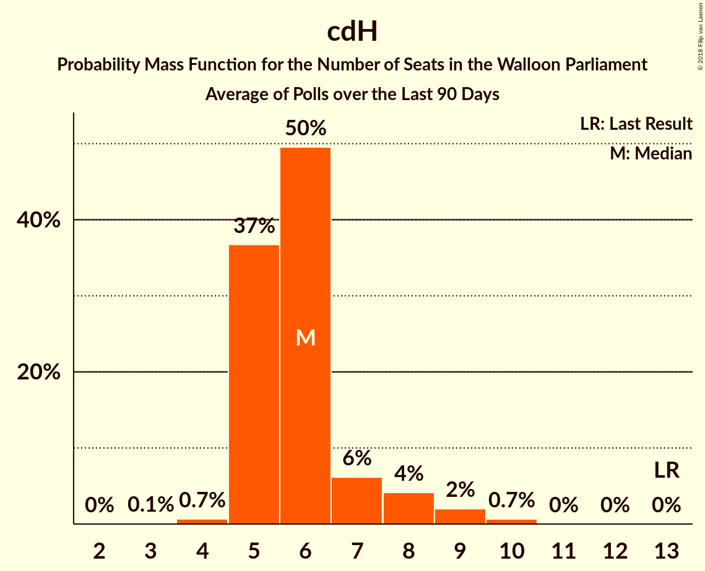

# cdH

<a href="#voting-intentions">Voting Intentions</a> | <a href="#seats">Seats</a>

## Voting Intentions

Last result: **15.2%** (General Election of 25 May 2014)

### Confidence Intervals

| Period     | Polling firm/Commissioner(s) | Median | 80% Confidence Interval | 90% Confidence Interval | 95% Confidence Interval | 99% Confidence Interval |
|:----------:|:----------------:|:-----------:|:-----------------------:|:-----------------------:|:-----------------------:|:-----------------------:|
| N/A | [Poll Average](average.html) | 7.3% | 6.3–8.4% | 6.0–8.7% | 5.8–9.0% | 5.3–9.6% |
| [27 February–6 March 2018](2018-03-06-Ipsos.html) | Ipsos   Het Laatste Nieuws–Le Soir–RTL Tvi–VTM | 7.2% | 6.3–8.4% | 6.0–8.7% | 5.8–9.0% | 5.3–9.6% |
| [27 November–4 December 2017](2017-12-04-Ipsos.html) | Ipsos   Het Laatste Nieuws–Le Soir–RTL Tvi–VTM | 8.3% | 7.3–9.5% | 7.0–9.9% | 6.8–10.2% | 6.3–10.8% |
| [11 September–5 October 2017](2017-10-05-TNS.html) | TNS   De Standaard–VRT–RTBf–La Libre Belgique | 8.7% | 7.7–9.9% | 7.4–10.3% | 7.2–10.6% | 6.7–11.2% |
| [25 August–3 September 2017](2017-09-03-Ipsos.html) | Ipsos   RTL TVi–Le Soir–VTM–Het Laatste Nieuws | 8.8% | 7.7–10.0% | 7.4–10.4% | 7.1–10.7% | 6.6–11.4% |
| [23–27 June 2017](2017-06-27-Dedicated.html) | Dedicated   MR | 9.8% | 8.4–11.4% | 8.0–11.9% | 7.7–12.3% | 7.1–13.2% |
| [16–20 March 2017](2017-03-20-Dedicated.html) | Dedicated   RTBf–La Libre Belgique | 11.9% | 10.5–13.7% | 10.0–14.2% | 9.7–14.6% | 9.0–15.5% |
| [16–17 February 2017](2017-02-17-IVox.html) | iVox   Sudpresse | 10.1% | 9.0–11.4% | 8.6–11.8% | 8.4–12.1% | 7.8–12.8% |
| [10–17 January 2017](2017-01-17-Ipsos.html) | Ipsos   RTL TVi–Le Soir–VTM–Het Laatste Nieuws | 11.2% | 10.0–12.7% | 9.7–13.0% | 9.4–13.4% | 8.8–14.1% |
| [28–24 November 2016](2016-11-28-Dedicated.html) | Dedicated   RTBf–La Libre Belgique | 10.0% | 8.7–11.7% | 8.3–12.1% | 7.9–12.6% | 7.3–13.4% |
| [19–25 September 2016](2016-09-25-Ipsos.html) | Ipsos   RTL TVi–Le Soir–VTM–Het Laatste Nieuws | 9.8% | 8.6–11.1% | 8.3–11.5% | 8.1–11.8% | 7.5–12.5% |
| [2–6 September 2016](2016-09-06-Dedicated.html) | Dedicated   RTBf–La Libre Belgique | 11.7% | 10.3–13.5% | 9.9–13.9% | 9.5–14.4% | 8.9–15.2% |
| [6–12 May 2016](2016-05-12-Ipsos.html) | Ipsos   RTL TVi–Le Soir–VTM–Het Laatste Nieuws | 12.0% | 10.7–13.4% | 10.4–13.8% | 10.1–14.1% | 9.5–14.8% |
| [31 March–4 April 2016](2016-04-04-Dedicated.html) | Dedicated   La Libre Belgique–RTBf | 12.8% | 11.5–14.3% | 11.2–14.7% | 10.9–15.1% | 10.3–15.8% |
| [15–20 January 2016](2016-01-20-Ipsos.html) | Ipsos   RTL TVi–Le Soir–VTM–Het Laatste Nieuws | 11.1% | 10.0–12.5% | 9.6–12.9% | 9.3–13.2% | 8.8–13.9% |
| [3–7 December 2015](2015-12-07-Dedicated.html) | Dedicated   La Libre Belgique–RTBf | 13.5% | 12.1–15.1% | 11.8–15.5% | 11.4–15.9% | 10.8–16.7% |
| [28 September–4 October 2015](2015-10-04-Ipsos.html) | Ipsos   Het Laatste Nieuws–Le Soir–RTL Tvi–VTM | 13.3% | 12.0–14.7% | 11.6–15.2% | 11.3–15.5% | 10.7–16.2% |
| [9–14 September 2015](2015-09-14-Dedicated.html) | Dedicated   La Libre Belgique–RTBf | 13.5% | 11.9–15.4% | 11.5–15.9% | 11.1–16.4% | 10.4–17.3% |
| [12–18 May 2015](2015-05-18-Dedicated.html) | Dedicated   La Libre Belgique–RTBf | 12.8% | 11.3–14.6% | 10.9–15.1% | 10.5–15.5% | 9.8–16.4% |
| [20–24 April 2015](2015-04-24-Ipsos.html) | Ipsos   Het Laatste Nieuws–Le Soir–RTL Tvi–VTM | 13.1% | 11.8–14.6% | 11.4–15.1% | 11.1–15.4% | 10.5–16.2% |
| [5–9 March 2015](2015-03-09-Dedicated.html) | Dedicated   La Libre Belgique–RTBf | 14.3% | 12.7–16.2% | 12.3–16.7% | 11.9–17.1% | 11.1–18.1% |
| [23–28 January 2015](2015-01-28-Ipsos.html) | Ipsos   Het Laatste Nieuws–Le Soir–RTL Tvi–VTM | 13.9% | 12.6–15.4% | 12.3–15.8% | 11.9–16.2% | 11.3–16.9% |
| [5–11 January 2015](2015-01-11-Ipsos.html) | Ipsos   Het Laatste Nieuws–Le Soir–RTL Tvi–VTM | 12.6% | 11.4–14.0% | 11.1–14.4% | 10.8–14.8% | 10.2–15.5% |
| [27 November–1 December 2014](2014-12-01-Dedicated.html) | Dedicated   La Libre Belgique–RTBf | 13.4% | 11.9–15.3% | 11.4–15.8% | 11.0–16.3% | 10.3–17.2% |
| [5–9 September 2014](2014-09-09-Dedicated.html) | Dedicated   RTBf–La Libre Belgique | 12.7% | 11.2–14.5% | 10.8–15.0% | 10.4–15.5% | 9.7–16.3% |

### Probability Mass Function

The following table shows the probability mass function per percentage block of voting intentions for the [poll average](average.html) for cdH.

| Voting Intentions | Probability | Accumulated | Special Marks |
|:-----------------:|:-----------:|:-----------:|:-------------:|
| 3.5–4.5% | 0% | 100% |  |
| 4.5–5.5% | 1.1% | 100% |  |
| 5.5–6.5% | 17% | 98.8% |  |
| 6.5–7.5% | 44% | 82% | Median |
| 7.5–8.5% | 30% | 38% |  |
| 8.5–9.5% | 7% | 7% |  |
| 9.5–10.5% | 0.6% | 0.6% |  |
| 10.5–11.5% | 0% | 0% |  |
| 11.5–12.5% | 0% | 0% |  |
| 12.5–13.5% | 0% | 0% |  |
| 13.5–14.5% | 0% | 0% |  |
| 14.5–15.5% | 0% | 0% | Last Result |

## Seats

Last result: **13** seats (General Election of 25 May 2014)

### Confidence Intervals

| Period     | Polling firm/Commissioner(s) | Median | 80% Confidence Interval | 90% Confidence Interval | 95% Confidence Interval | 99% Confidence Interval |
|:----------:|:----------------:|:------:|:-----------------------:|:-----------------------:|:-----------------------:|:-----------------------:|
| N/A | [Poll Average](average.html) | 5 | 4–6 | 3–6 | 2–6 | 2–6 |
| [27 February–6 March 2018](2018-03-06-Ipsos.html) | Ipsos   Het Laatste Nieuws–Le Soir–RTL Tvi–VTM | 5 | 4–6 | 3–6 | 2–6 | 2–6 |
| [27 November–4 December 2017](2017-12-04-Ipsos.html) | Ipsos   Het Laatste Nieuws–Le Soir–RTL Tvi–VTM | 6 | 5–7 | 5–8 | 5–9 | 4–10 |
| [11 September–5 October 2017](2017-10-05-TNS.html) | TNS   De Standaard–VRT–RTBf–La Libre Belgique | 6 | 5–7 | 5–8 | 5–9 | 5–10 |
| [25 August–3 September 2017](2017-09-03-Ipsos.html) | Ipsos   RTL TVi–Le Soir–VTM–Het Laatste Nieuws | 6 | 5–8 | 5–9 | 5–9 | 4–10 |
| [23–27 June 2017](2017-06-27-Dedicated.html) | Dedicated   MR | 7 | 5–10 | 5–10 | 5–10 | 5–11 |
| [16–20 March 2017](2017-03-20-Dedicated.html) | Dedicated   RTBf–La Libre Belgique | 10 | 9–12 | 8–12 | 7–12 | 6–13 |
| [16–17 February 2017](2017-02-17-IVox.html) | iVox   Sudpresse | 7 | 6–10 | 5–10 | 5–10 | 5–10 |
| [10–17 January 2017](2017-01-17-Ipsos.html) | Ipsos   RTL TVi–Le Soir–VTM–Het Laatste Nieuws | 10 | 9–11 | 7–12 | 6–12 | 6–12 |
| [28–24 November 2016](2016-11-28-Dedicated.html) | Dedicated   RTBf–La Libre Belgique | 6 | 5–10 | 5–11 | 5–11 | 5–12 |
| [19–25 September 2016](2016-09-25-Ipsos.html) | Ipsos   RTL TVi–Le Soir–VTM–Het Laatste Nieuws | 9 | 6–10 | 5–10 | 5–10 | 5–11 |
| [2–6 September 2016](2016-09-06-Dedicated.html) | Dedicated   RTBf–La Libre Belgique | 10 | 9–12 | 7–12 | 6–13 | 6–13 |
| [6–12 May 2016](2016-05-12-Ipsos.html) | Ipsos   RTL TVi–Le Soir–VTM–Het Laatste Nieuws | 10 | 10–12 | 9–12 | 9–13 | 7–13 |
| [31 March–4 April 2016](2016-04-04-Dedicated.html) | Dedicated   La Libre Belgique–RTBf | 11 | 9–12 | 9–13 | 9–13 | 8–13 |
| [15–20 January 2016](2016-01-20-Ipsos.html) | Ipsos   RTL TVi–Le Soir–VTM–Het Laatste Nieuws | 10 | 9–12 | 8–12 | 7–12 | 6–13 |
| [3–7 December 2015](2015-12-07-Dedicated.html) | Dedicated   La Libre Belgique–RTBf | 12 | 10–13 | 10–13 | 10–13 | 9–14 |
| [28 September–4 October 2015](2015-10-04-Ipsos.html) | Ipsos   Het Laatste Nieuws–Le Soir–RTL Tvi–VTM | 12 | 11–13 | 11–14 | 10–14 | 10–15 |
| [9–14 September 2015](2015-09-14-Dedicated.html) | Dedicated   La Libre Belgique–RTBf | 12 | 10–13 | 9–13 | 9–14 | 8–15 |
| [12–18 May 2015](2015-05-18-Dedicated.html) | Dedicated   La Libre Belgique–RTBf | 11 | 9–12 | 9–12 | 8–13 | 6–14 |
| [20–24 April 2015](2015-04-24-Ipsos.html) | Ipsos   Het Laatste Nieuws–Le Soir–RTL Tvi–VTM | 12 | 10–12 | 10–13 | 10–13 | 9–15 |
| [5–9 March 2015](2015-03-09-Dedicated.html) | Dedicated   La Libre Belgique–RTBf | 12 | 11–14 | 11–15 | 10–15 | 9–15 |
| [23–28 January 2015](2015-01-28-Ipsos.html) | Ipsos   Het Laatste Nieuws–Le Soir–RTL Tvi–VTM | 12 | 11–13 | 11–14 | 11–15 | 10–15 |
| [5–11 January 2015](2015-01-11-Ipsos.html) | Ipsos   Het Laatste Nieuws–Le Soir–RTL Tvi–VTM | 11 | 10–12 | 9–12 | 9–12 | 8–14 |
| [27 November–1 December 2014](2014-12-01-Dedicated.html) | Dedicated   La Libre Belgique–RTBf | 12 | 10–13 | 9–14 | 9–14 | 8–15 |
| [5–9 September 2014](2014-09-09-Dedicated.html) | Dedicated   RTBf–La Libre Belgique | 11 | 8–12 | 8–12 | 7–12 | 6–13 |

### Probability Mass Function

The following table shows the probability mass function per seat for the [poll average](average.html) for cdH.

| Number of Seats | Probability | Accumulated | Special Marks |
|:---------------:|:-----------:|:-----------:|:-------------:|
| 1 | 0.1% | 100% |  |
| 2 | 3% | 99.9% |  |
| 3 | 5% | 97% |  |
| 4 | 17% | 92% |  |
| 5 | 61% | 75% | Median |
| 6 | 13% | 14% |  |
| 7 | 0.1% | 0.2% |  |
| 8 | 0% | 0.1% |  |
| 9 | 0% | 0% |  |
| 10 | 0% | 0% |  |
| 11 | 0% | 0% |  |
| 12 | 0% | 0% |  |
| 13 | 0% | 0% | Last Result |

