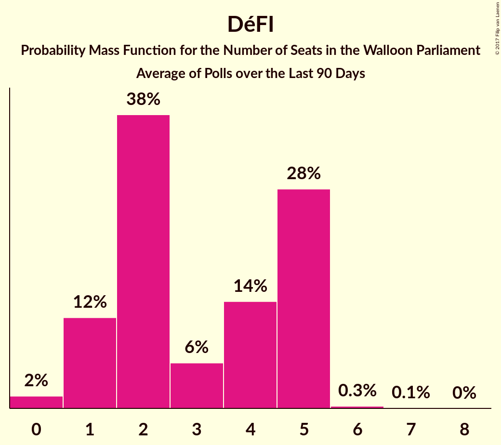

# DéFI

<a href="#voting-intentions">Voting Intentions</a> | <a href="#seats">Seats</a>

## Voting Intentions

Last result: **2.5%** (General Election of 25 May 2014)

### Confidence Intervals

| Period     | Polling firm/Commissioner(s) | Median | 80% Confidence Interval | 90% Confidence Interval | 95% Confidence Interval | 99% Confidence Interval |
|:----------:|:----------------:|:-----------:|:-----------------------:|:-----------------------:|:-----------------------:|:-----------------------:|
| N/A | [Poll Average](average.html) | 6.1% | 5.1–7.1% | 4.9–7.5% | 4.7–7.8% | 4.3–8.3% |
| [11 September–5 October 2017](2017-10-05-TNS.html) | TNS   De Standaard–VRT–RTBf–La Libre Belgique | 5.8% | 4.9–6.8% | 4.7–7.1% | 4.5–7.3% | 4.1–7.8% |
| [25 August–3 September 2017](2017-09-03-Ipsos.html) | Ipsos   RTL TVi–Le Soir–VTM–Het Laatste Nieuws | 6.2% | 5.3–7.4% | 5.1–7.7% | 4.9–8.0% | 4.5–8.5% |
| [23–27 June 2017](2017-06-27-Dedicated.html) | Dedicated   MR | 3.8% | 3.0–5.0% | 2.8–5.3% | 2.6–5.7% | 2.2–6.3% |
| [16–20 March 2017](2017-03-20-Dedicated.html) | Dedicated   RTBf–La Libre Belgique | 2.4% | 1.8–3.3% | 1.6–3.6% | 1.4–3.8% | 1.2–4.3% |
| [16–17 February 2017](2017-02-17-IVox.html) | iVox   Sudpresse | 4.5% | 3.7–5.5% | 3.6–5.7% | 3.4–6.0% | 3.0–6.5% |
| [10–17 January 2017](2017-01-17-Ipsos.html) | Ipsos   RTL TVi–Le Soir–VTM–Het Laatste Nieuws | 2.8% | 2.2–3.6% | 2.1–3.9% | 1.9–4.1% | 1.7–4.5% |
| [28–24 November 2016](2016-11-28-Dedicated.html) | Dedicated   RTBf–La Libre Belgique | 2.6% | 1.9–3.6% | 1.8–3.8% | 1.6–4.1% | 1.4–4.6% |
| [19–25 September 2016](2016-09-25-Ipsos.html) | Ipsos   RTL TVi–Le Soir–VTM–Het Laatste Nieuws | 2.4% | 1.9–3.2% | 1.8–3.4% | 1.6–3.6% | 1.4–4.0% |
| [2–6 September 2016](2016-09-06-Dedicated.html) | Dedicated   RTBf–La Libre Belgique | 2.9% | 2.3–3.9% | 2.1–4.2% | 1.9–4.5% | 1.6–5.0% |
| [6–12 May 2016](2016-05-12-Ipsos.html) | Ipsos   RTL TVi–Le Soir–VTM–Het Laatste Nieuws | 3.3% | 2.7–4.1% | 2.5–4.4% | 2.3–4.6% | 2.1–5.0% |
| [15–20 January 2016](2016-01-20-Ipsos.html) | Ipsos   RTL TVi–Le Soir–VTM–Het Laatste Nieuws | 3.4% | 2.8–4.2% | 2.6–4.5% | 2.4–4.7% | 2.2–5.1% |
| [5–9 September 2014](2014-09-09-Dedicated.html) | Dedicated   RTBf–La Libre Belgique | 1.8% | 1.3–2.6% | 1.1–2.9% | 1.0–3.1% | 0.8–3.5% |

### Probability Mass Function

The following table shows the probability mass function per percentage block of voting intentions for the [poll average](average.html) for DéFI.

| Voting Intentions | Probability | Accumulated | Special Marks |
|:-----------------:|:-----------:|:-----------:|:-------------:|
| 2.5–3.5% | 0% | 100% | Last Result |
| 3.5–4.5% | 2% | 100% |  |
| 4.5–5.5% | 24% | 98% |  |
| 5.5–6.5% | 48% | 75% | Median |
| 6.5–7.5% | 23% | 27% |  |
| 7.5–8.5% | 4% | 4% |  |
| 8.5–9.5% | 0.2% | 0.3% |  |
| 9.5–10.5% | 0% | 0% |  |

## Seats

Last result: **0** seats (General Election of 25 May 2014)

### Confidence Intervals

| Period     | Polling firm/Commissioner(s) | Median | 80% Confidence Interval | 90% Confidence Interval | 95% Confidence Interval | 99% Confidence Interval |
|:----------:|:----------------:|:------:|:-----------------------:|:-----------------------:|:-----------------------:|:-----------------------:|
| N/A | [Poll Average](average.html) | 2 | 1–5 | 1–5 | 1–5 | 1–5 |
| [11 September–5 October 2017](2017-10-05-TNS.html) | TNS   De Standaard–VRT–RTBf–La Libre Belgique | 2 | 1–2 | 1–2 | 1–2 | 1–4 |
| [25 August–3 September 2017](2017-09-03-Ipsos.html) | Ipsos   RTL TVi–Le Soir–VTM–Het Laatste Nieuws | 4 | 2–5 | 1–5 | 1–5 | 0–6 |
| [23–27 June 2017](2017-06-27-Dedicated.html) | Dedicated   MR | 0 | 0–1 | 0–1 | 0–2 | 0–3 |
| [16–20 March 2017](2017-03-20-Dedicated.html) | Dedicated   RTBf–La Libre Belgique | 0 | 0 | 0 | 0 | 0 |
| [16–17 February 2017](2017-02-17-IVox.html) | iVox   Sudpresse | 1 | 0–1 | 0–2 | 0–2 | 0–4 |
| [10–17 January 2017](2017-01-17-Ipsos.html) | Ipsos   RTL TVi–Le Soir–VTM–Het Laatste Nieuws | 0 | 0 | 0 | 0 | 0–1 |
| [28–24 November 2016](2016-11-28-Dedicated.html) | Dedicated   RTBf–La Libre Belgique | 0 | 0 | 0 | 0 | 0–1 |
| [19–25 September 2016](2016-09-25-Ipsos.html) | Ipsos   RTL TVi–Le Soir–VTM–Het Laatste Nieuws | 0 | 0 | 0 | 0 | 0 |
| [2–6 September 2016](2016-09-06-Dedicated.html) | Dedicated   RTBf–La Libre Belgique | 0 | 0 | 0 | 0–1 | 0–1 |
| [6–12 May 2016](2016-05-12-Ipsos.html) | Ipsos   RTL TVi–Le Soir–VTM–Het Laatste Nieuws | 0 | 0–1 | 0–1 | 0–1 | 0–1 |
| [15–20 January 2016](2016-01-20-Ipsos.html) | Ipsos   RTL TVi–Le Soir–VTM–Het Laatste Nieuws | 0 | 0 | 0–1 | 0–1 | 0–1 |
| [5–9 September 2014](2014-09-09-Dedicated.html) | Dedicated   RTBf–La Libre Belgique | 0 | 0 | 0 | 0 | 0 |

### Probability Mass Function

The following table shows the probability mass function per seat for the [poll average](average.html) for DéFI.

| Number of Seats | Probability | Accumulated | Special Marks |
|:---------------:|:-----------:|:-----------:|:-------------:|
| 0 | 0.3% | 100% | Last Result |
| 1 | 15% | 99.7% |  |
| 2 | 52% | 85% | Median |
| 3 | 3% | 33% |  |
| 4 | 7% | 30% |  |
| 5 | 23% | 23% |  |
| 6 | 0.2% | 0.3% |  |
| 7 | 0.1% | 0.1% |  |
| 8 | 0% | 0% |  |

