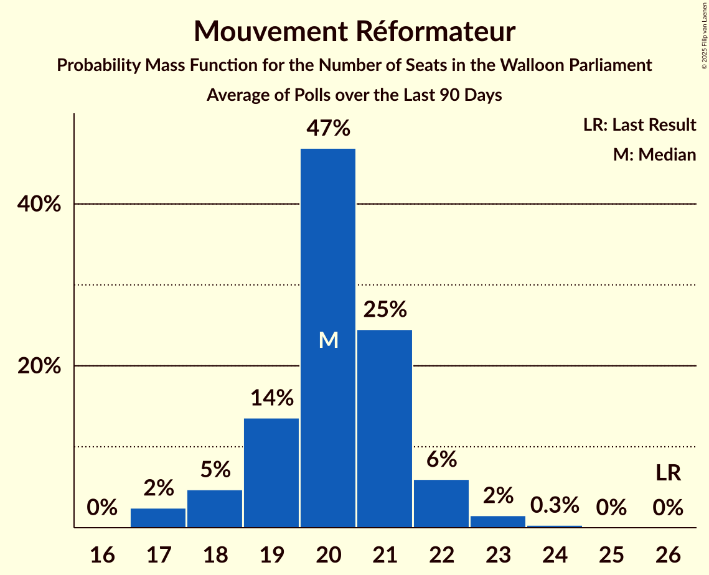

# Mouvement Réformateur

<a href="#voting-intentions">Voting Intentions</a> | <a href="#seats">Seats</a>

## Voting Intentions

Last result: **29.6%** (General Election of 9 June 2024)

### Confidence Intervals

| Period     | Polling firm/Commissioner(s) | Median | 80% Confidence Interval | 90% Confidence Interval | 95% Confidence Interval | 99% Confidence Interval |
|:----------:|:----------------:|:-----------:|:-----------------------:|:-----------------------:|:-----------------------:|:-----------------------:|
| N/A | [Poll Average](average.html) | 21.4% | 19.7–23.1% | 19.3–23.6% | 18.9–24.0% | 18.2–24.8% |
| [1–9 December 2025](2025-12-09-Ipsos.html) | Ipsos   Het Laatste Nieuws, Le Soir, RTL TVi and VTM | 21.3% | 19.7–23.1% | 19.3–23.6% | 18.9–24.0% | 18.2–24.8% |
| [16–23 September 2025](2025-09-23-Ipsos.html) | Ipsos   Het Laatste Nieuws, Le Soir, RTL TVi and VTM | 23.9% | 22.2–25.7% | 21.8–26.2% | 21.4–26.6% | 20.6–27.5% |
| [27 May–3 June 2025](2025-06-03-Ipsos.html) | Ipsos   Het Laatste Nieuws, Le Soir, RTL TVi and VTM | 24.0% | 22.3–25.8% | 21.9–26.3% | 21.4–26.7% | 20.7–27.6% |
| [3–24 March 2025](2025-03-24-BpactandUniversiteitAntwerpenULB.html) | Bpact and Universiteit Antwerpen & ULB   De Standaard, RTBF and VRT | 23.9% | 22.7–25.2% | 22.4–25.6% | 22.1–25.9% | 21.6–26.5% |
| [4–11 March 2025](2025-03-11-Ipsos.html) | Ipsos   Het Laatste Nieuws, Le Soir, RTL TVi and VTM | 24.8% | 23.1–26.6% | 22.6–27.1% | 22.2–27.6% | 21.4–28.5% |
| [18–21 November 2024](2024-11-21-Ipsos.html) | Ipsos   Het Laatste Nieuws, Le Soir, RTL TVi and VTM | 27.4% | 25.6–29.3% | 25.1–29.8% | 24.7–30.3% | 23.9–31.2% |
| [11–17 September 2024](2024-09-17-Ipsos.html) | Ipsos   Het Laatste Nieuws, Le Soir, RTL TVi and VTM | 26.6% | 24.9–28.5% | 24.4–29.0% | 23.9–29.4% | 23.1–30.3% |

### Probability Mass Function

The following table shows the probability mass function per percentage block of voting intentions for the [poll average](average.html) for Mouvement Réformateur.

| Voting Intentions | Probability | Accumulated | Special Marks |
|:-----------------:|:-----------:|:-----------:|:-------------:|
| 15.5–16.5% | 0% | 100% |  |
| 16.5–17.5% | 0.1% | 100% |  |
| 17.5–18.5% | 1.1% | 99.9% |  |
| 18.5–19.5% | 6% | 98.8% |  |
| 19.5–20.5% | 18% | 92% |  |
| 20.5–21.5% | 30% | 74% | Median |
| 21.5–22.5% | 26% | 45% |  |
| 22.5–23.5% | 13% | 18% |  |
| 23.5–24.5% | 4% | 5% |  |
| 24.5–25.5% | 0.8% | 0.9% |  |
| 25.5–26.5% | 0.1% | 0.1% |  |
| 26.5–27.5% | 0% | 0% |  |
| 27.5–28.5% | 0% | 0% |  |
| 28.5–29.5% | 0% | 0% |  |
| 29.5–30.5% | 0% | 0% | Last Result |

## Seats

Last result: **26** seats (General Election of 9 June 2024)

### Confidence Intervals

| Period     | Polling firm/Commissioner(s) | Median | 80% Confidence Interval | 90% Confidence Interval | 95% Confidence Interval | 99% Confidence Interval |
|:----------:|:----------------:|:------:|:-----------------------:|:-----------------------:|:-----------------------:|:-----------------------:|
| N/A | [Poll Average](average.html) | 17 | 16–19 | 15–20 | 15–20 | 14–20 |
| [1–9 December 2025](2025-12-09-Ipsos.html) | Ipsos   Het Laatste Nieuws, Le Soir, RTL TVi and VTM | 17 | 16–19 | 15–20 | 15–20 | 14–20 |
| [16–23 September 2025](2025-09-23-Ipsos.html) | Ipsos   Het Laatste Nieuws, Le Soir, RTL TVi and VTM | 20 | 18–21 | 17–22 | 17–22 | 17–23 |
| [27 May–3 June 2025](2025-06-03-Ipsos.html) | Ipsos   Het Laatste Nieuws, Le Soir, RTL TVi and VTM | 20 | 18–21 | 18–22 | 17–22 | 17–23 |
| [3–24 March 2025](2025-03-24-BpactandUniversiteitAntwerpenULB.html) | Bpact and Universiteit Antwerpen & ULB   De Standaard, RTBF and VRT | 20 | 19–21 | 19–22 | 19–22 | 18–24 |
| [4–11 March 2025](2025-03-11-Ipsos.html) | Ipsos   Het Laatste Nieuws, Le Soir, RTL TVi and VTM | 20 | 19–22 | 18–23 | 18–23 | 17–24 |
| [18–21 November 2024](2024-11-21-Ipsos.html) | Ipsos   Het Laatste Nieuws, Le Soir, RTL TVi and VTM | 23 | 21–25 | 21–26 | 20–27 | 20–27 |
| [11–17 September 2024](2024-09-17-Ipsos.html) | Ipsos   Het Laatste Nieuws, Le Soir, RTL TVi and VTM | 22 | 21–24 | 21–25 | 20–25 | 20–27 |

### Probability Mass Function

The following table shows the probability mass function per seat for the [poll average](average.html) for Mouvement Réformateur.

| Number of Seats | Probability | Accumulated | Special Marks |
|:---------------:|:-----------:|:-----------:|:-------------:|
| 13 | 0.1% | 100% |  |
| 14 | 1.1% | 99.9% |  |
| 15 | 4% | 98.8% |  |
| 16 | 7% | 95% |  |
| 17 | 47% | 88% | Median |
| 18 | 21% | 41% |  |
| 19 | 12% | 20% |  |
| 20 | 7% | 8% |  |
| 21 | 0.2% | 0.3% |  |
| 22 | 0% | 0% |  |
| 23 | 0% | 0% |  |
| 24 | 0% | 0% |  |
| 25 | 0% | 0% |  |
| 26 | 0% | 0% | Last Result |

