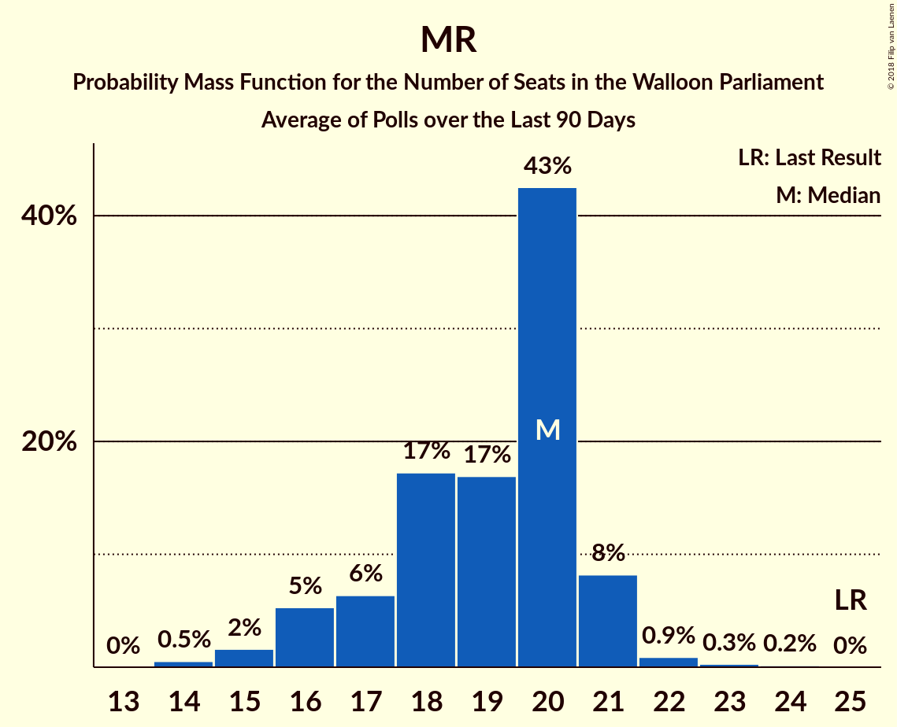

# MR

<a href="#voting-intentions">Voting Intentions</a> | <a href="#seats">Seats</a>

## Voting Intentions

Last result: **26.7%** (General Election of 25 May 2014)

### Confidence Intervals

| Period     | Polling firm/Commissioner(s) | Median | 80% Confidence Interval | 90% Confidence Interval | 95% Confidence Interval | 99% Confidence Interval |
|:----------:|:----------------:|:-----------:|:-----------------------:|:-----------------------:|:-----------------------:|:-----------------------:|
| N/A | [Poll Average](average.html) | 19.4% | 17.9–21.1% | 17.4–21.6% | 17.1–22.0% | 16.3–22.8% |
| [25 March–14 April 2019](2019-04-14-TNS.html) | TNS   De Standaard, La Libre Belgique, RTBf and VRT | 18.3% | N/A | N/A | N/A | N/A |
| [5–11 February 2019](2019-02-11-Ipsos.html) | Ipsos   Het Laatste Nieuws, Le Soir, RTL TVi and VTM | 19.4% | 17.9–21.1% | 17.4–21.6% | 17.1–22.0% | 16.3–22.8% |
| [19 November–8 December 2018](2018-12-08-TNS.html) | TNS   De Standaard, La Libre Belgique, RTBf and VRT | 19.9% | 18.3–21.6% | 17.9–22.0% | 17.5–22.5% | 16.8–23.3% |
| [27 November–3 December 2018](2018-12-03-Ipsos.html) | Ipsos   Het Laatste Nieuws, Le Soir, RTL TVi and VTM | 20.7% | 19.2–22.5% | 18.7–22.9% | 18.3–23.4% | 17.6–24.2% |
| [20–27 September 2018](2018-09-27-Ipsos.html) | Ipsos   Het Laatste Nieuws, Le Soir, RTL TVi and VTM | 20.6% | 19.0–22.3% | 18.6–22.8% | 18.2–23.2% | 17.5–24.1% |
| [29 May–6 June 2018](2018-06-06-Ipsos.html) | Ipsos   Het Laatste Nieuws, Le Soir, RTL TVi and VTM | 20.0% | 18.4–21.7% | 18.0–22.2% | 17.6–22.6% | 16.9–23.4% |
| [26 February–17 March 2018](2018-03-17-TNS.html) | TNS   De Standaard–VRT–RTBf–La Libre Belgique | 24.1% | 22.5–25.9% | 22.0–26.4% | 21.6–26.9% | 20.8–27.7% |
| [27 February–6 March 2018](2018-03-06-Ipsos.html) | Ipsos   Het Laatste Nieuws–Le Soir–RTL Tvi–VTM | 21.2% | 19.6–22.9% | 19.1–23.4% | 18.7–23.8% | 18.0–24.7% |
| [27 November–4 December 2017](2017-12-04-Ipsos.html) | Ipsos   Het Laatste Nieuws–Le Soir–RTL Tvi–VTM | 22.1% | 20.5–23.9% | 20.0–24.4% | 19.6–24.8% | 18.9–25.7% |
| [11 September–5 October 2017](2017-10-05-TNS.html) | TNS   De Standaard–VRT–RTBf–La Libre Belgique | 21.4% | 19.8–23.0% | 19.4–23.5% | 19.0–23.9% | 18.3–24.8% |
| [25 August–3 September 2017](2017-09-03-Ipsos.html) | Ipsos   RTL TVi–Le Soir–VTM–Het Laatste Nieuws | 21.4% | 19.7–23.1% | 19.3–23.6% | 18.9–24.1% | 18.1–24.9% |
| [23–27 June 2017](2017-06-27-Dedicated.html) | Dedicated   MR | 23.2% | 21.1–25.5% | 20.5–26.1% | 20.1–26.7% | 19.1–27.8% |
| [16–20 March 2017](2017-03-20-Dedicated.html) | Dedicated   RTBf–La Libre Belgique | 22.4% | 20.4–24.5% | 19.9–25.1% | 19.4–25.7% | 18.5–26.7% |
| [16–17 February 2017](2017-02-17-IVox.html) | iVox   Sudpresse | 20.7% | 19.1–22.4% | 18.7–22.9% | 18.3–23.3% | 17.5–24.1% |
| [10–17 January 2017](2017-01-17-Ipsos.html) | Ipsos   RTL TVi–Le Soir–VTM–Het Laatste Nieuws | 19.4% | 17.8–21.1% | 17.3–21.6% | 17.0–22.0% | 16.2–22.8% |
| [28–24 November 2016](2016-11-28-Dedicated.html) | Dedicated   RTBf–La Libre Belgique | 22.8% | 20.8–25.0% | 20.2–25.6% | 19.7–26.1% | 18.8–27.2% |
| [19–25 September 2016](2016-09-25-Ipsos.html) | Ipsos   RTL TVi–Le Soir–VTM–Het Laatste Nieuws | 22.3% | 20.6–24.1% | 20.2–24.6% | 19.8–25.0% | 19.0–25.9% |
| [2–6 September 2016](2016-09-06-Dedicated.html) | Dedicated   RTBf–La Libre Belgique | 22.4% | 20.5–24.6% | 19.9–25.2% | 19.5–25.7% | 18.5–26.8% |
| [6–12 May 2016](2016-05-12-Ipsos.html) | Ipsos   RTL TVi–Le Soir–VTM–Het Laatste Nieuws | 20.1% | 18.6–21.8% | 18.1–22.3% | 17.8–22.7% | 17.0–23.6% |
| [31 March–4 April 2016](2016-04-04-Dedicated.html) | Dedicated   La Libre Belgique–RTBf | 23.9% | 22.2–25.7% | 21.7–26.2% | 21.3–26.7% | 20.5–27.6% |
| [15–20 January 2016](2016-01-20-Ipsos.html) | Ipsos   RTL TVi–Le Soir–VTM–Het Laatste Nieuws | 23.1% | 21.5–24.9% | 21.0–25.4% | 20.6–25.8% | 19.9–26.6% |
| [3–7 December 2015](2015-12-07-Dedicated.html) | Dedicated   La Libre Belgique–RTBf | 24.7% | 23.0–26.6% | 22.5–27.2% | 22.0–27.6% | 21.2–28.6% |
| [28 September–4 October 2015](2015-10-04-Ipsos.html) | Ipsos   Het Laatste Nieuws–Le Soir–RTL Tvi–VTM | 23.3% | 21.7–25.1% | 21.2–25.6% | 20.8–26.0% | 20.0–26.9% |
| [9–14 September 2015](2015-09-14-Dedicated.html) | Dedicated   La Libre Belgique–RTBf | 24.3% | 22.2–26.5% | 21.6–27.2% | 21.1–27.7% | 20.1–28.8% |
| [12–18 May 2015](2015-05-18-Dedicated.html) | Dedicated   La Libre Belgique–RTBf | 25.4% | 23.4–27.7% | 22.8–28.3% | 22.3–28.9% | 21.4–29.9% |
| [20–24 April 2015](2015-04-24-Ipsos.html) | Ipsos   Het Laatste Nieuws–Le Soir–RTL Tvi–VTM | 26.1% | 24.3–27.9% | 23.8–28.5% | 23.4–28.9% | 22.5–29.9% |
| [5–9 March 2015](2015-03-09-Dedicated.html) | Dedicated   La Libre Belgique–RTBf | 25.2% | 23.2–27.5% | 22.6–28.1% | 22.1–28.6% | 21.1–29.7% |
| [23–28 January 2015](2015-01-28-Ipsos.html) | Ipsos   Het Laatste Nieuws–Le Soir–RTL Tvi–VTM | 26.0% | 24.3–27.8% | 23.8–28.3% | 23.4–28.8% | 22.6–29.6% |
| [5–11 January 2015](2015-01-11-Ipsos.html) | Ipsos   Het Laatste Nieuws–Le Soir–RTL Tvi–VTM | 25.3% | 23.6–27.0% | 23.1–27.5% | 22.7–28.0% | 21.9–28.9% |
| [27 November–1 December 2014](2014-12-01-Dedicated.html) | Dedicated   La Libre Belgique–RTBf | 24.0% | 21.9–26.2% | 21.4–26.8% | 20.9–27.4% | 19.9–28.5% |
| [5–9 September 2014](2014-09-09-Dedicated.html) | Dedicated   RTBf–La Libre Belgique | 26.6% | 24.5–28.9% | 23.9–29.5% | 23.4–30.1% | 22.5–31.2% |

### Probability Mass Function

The following table shows the probability mass function per percentage block of voting intentions for the [poll average](average.html) for MR.

| Voting Intentions | Probability | Accumulated | Special Marks |
|:-----------------:|:-----------:|:-----------:|:-------------:|
| 14.5–15.5% | 0% | 100% |  |
| 15.5–16.5% | 0.8% | 99.9% |  |
| 16.5–17.5% | 5% | 99.2% |  |
| 17.5–18.5% | 18% | 94% |  |
| 18.5–19.5% | 30% | 76% | Median |
| 19.5–20.5% | 27% | 46% |  |
| 20.5–21.5% | 14% | 19% |  |
| 21.5–22.5% | 4% | 5% |  |
| 22.5–23.5% | 0.7% | 0.8% |  |
| 23.5–24.5% | 0.1% | 0.1% |  |
| 24.5–25.5% | 0% | 0% |  |
| 25.5–26.5% | 0% | 0% |  |
| 26.5–27.5% | 0% | 0% | Last Result |

## Seats

Last result: **25** seats (General Election of 25 May 2014)

### Confidence Intervals

| Period     | Polling firm/Commissioner(s) | Median | 80% Confidence Interval | 90% Confidence Interval | 95% Confidence Interval | 99% Confidence Interval |
|:----------:|:----------------:|:------:|:-----------------------:|:-----------------------:|:-----------------------:|:-----------------------:|
| N/A | [Poll Average](average.html) | 18 | 15–20 | 15–20 | 15–21 | 14–22 |
| [25 March–14 April 2019](2019-04-14-TNS.html) | TNS   De Standaard, La Libre Belgique, RTBf and VRT |  |  |  |  |  |
| [5–11 February 2019](2019-02-11-Ipsos.html) | Ipsos   Het Laatste Nieuws, Le Soir, RTL TVi and VTM | 18 | 15–20 | 15–20 | 15–21 | 14–22 |
| [19 November–8 December 2018](2018-12-08-TNS.html) | TNS   De Standaard, La Libre Belgique, RTBf and VRT | 16 | 15–20 | 15–20 | 14–20 | 14–20 |
| [27 November–3 December 2018](2018-12-03-Ipsos.html) | Ipsos   Het Laatste Nieuws, Le Soir, RTL TVi and VTM | 18 | 17–20 | 16–21 | 15–21 | 15–22 |
| [20–27 September 2018](2018-09-27-Ipsos.html) | Ipsos   Het Laatste Nieuws, Le Soir, RTL TVi and VTM | 20 | 17–20 | 16–21 | 15–21 | 14–22 |
| [29 May–6 June 2018](2018-06-06-Ipsos.html) | Ipsos   Het Laatste Nieuws, Le Soir, RTL TVi and VTM | 19 | 16–20 | 16–20 | 15–21 | 14–22 |
| [26 February–17 March 2018](2018-03-17-TNS.html) | TNS   De Standaard–VRT–RTBf–La Libre Belgique | 22 | 19–23 | 19–24 | 18–25 | 18–25 |
| [27 February–6 March 2018](2018-03-06-Ipsos.html) | Ipsos   Het Laatste Nieuws–Le Soir–RTL Tvi–VTM | 19 | 17–21 | 17–21 | 17–22 | 16–22 |
| [27 November–4 December 2017](2017-12-04-Ipsos.html) | Ipsos   Het Laatste Nieuws–Le Soir–RTL Tvi–VTM | 20 | 19–23 | 19–23 | 18–23 | 17–24 |
| [11 September–5 October 2017](2017-10-05-TNS.html) | TNS   De Standaard–VRT–RTBf–La Libre Belgique | 19 | 18–21 | 18–22 | 17–22 | 15–23 |
| [25 August–3 September 2017](2017-09-03-Ipsos.html) | Ipsos   RTL TVi–Le Soir–VTM–Het Laatste Nieuws | 20 | 18–22 | 17–22 | 17–23 | 16–23 |
| [23–27 June 2017](2017-06-27-Dedicated.html) | Dedicated   MR | 21 | 19–23 | 19–24 | 18–25 | 16–26 |
| [16–20 March 2017](2017-03-20-Dedicated.html) | Dedicated   RTBf–La Libre Belgique | 20 | 18–22 | 18–22 | 17–22 | 16–25 |
| [16–17 February 2017](2017-02-17-IVox.html) | iVox   Sudpresse | 19 | 16–20 | 15–20 | 15–21 | 15–22 |
| [10–17 January 2017](2017-01-17-Ipsos.html) | Ipsos   RTL TVi–Le Soir–VTM–Het Laatste Nieuws | 18 | 15–20 | 15–20 | 15–21 | 14–22 |
| [28–24 November 2016](2016-11-28-Dedicated.html) | Dedicated   RTBf–La Libre Belgique | 21 | 20–24 | 19–26 | 17–26 | 16–27 |
| [19–25 September 2016](2016-09-25-Ipsos.html) | Ipsos   RTL TVi–Le Soir–VTM–Het Laatste Nieuws | 20 | 20–23 | 19–23 | 18–24 | 17–25 |
| [2–6 September 2016](2016-09-06-Dedicated.html) | Dedicated   RTBf–La Libre Belgique | 22 | 18–23 | 18–23 | 18–24 | 16–25 |
| [6–12 May 2016](2016-05-12-Ipsos.html) | Ipsos   RTL TVi–Le Soir–VTM–Het Laatste Nieuws | 20 | 17–21 | 16–21 | 16–22 | 15–23 |
| [31 March–4 April 2016](2016-04-04-Dedicated.html) | Dedicated   La Libre Belgique–RTBf | 22 | 20–24 | 20–25 | 19–25 | 18–26 |
| [15–20 January 2016](2016-01-20-Ipsos.html) | Ipsos   RTL TVi–Le Soir–VTM–Het Laatste Nieuws | 22 | 21–24 | 21–25 | 20–26 | 19–26 |
| [3–7 December 2015](2015-12-07-Dedicated.html) | Dedicated   La Libre Belgique–RTBf | 23 | 21–25 | 20–25 | 20–26 | 19–26 |
| [28 September–4 October 2015](2015-10-04-Ipsos.html) | Ipsos   Het Laatste Nieuws–Le Soir–RTL Tvi–VTM | 23 | 21–25 | 21–25 | 20–26 | 19–26 |
| [9–14 September 2015](2015-09-14-Dedicated.html) | Dedicated   La Libre Belgique–RTBf | 22 | 20–24 | 19–25 | 19–25 | 18–26 |
| [12–18 May 2015](2015-05-18-Dedicated.html) | Dedicated   La Libre Belgique–RTBf | 23 | 21–25 | 21–26 | 20–26 | 19–27 |
| [20–24 April 2015](2015-04-24-Ipsos.html) | Ipsos   Het Laatste Nieuws–Le Soir–RTL Tvi–VTM | 25 | 23–26 | 22–27 | 22–27 | 21–28 |
| [5–9 March 2015](2015-03-09-Dedicated.html) | Dedicated   La Libre Belgique–RTBf | 23 | 21–25 | 21–26 | 20–27 | 20–28 |
| [23–28 January 2015](2015-01-28-Ipsos.html) | Ipsos   Het Laatste Nieuws–Le Soir–RTL Tvi–VTM | 24 | 23–26 | 22–27 | 22–27 | 21–28 |
| [5–11 January 2015](2015-01-11-Ipsos.html) | Ipsos   Het Laatste Nieuws–Le Soir–RTL Tvi–VTM | 24 | 22–25 | 22–25 | 21–26 | 20–27 |
| [27 November–1 December 2014](2014-12-01-Dedicated.html) | Dedicated   La Libre Belgique–RTBf | 22 | 20–24 | 20–25 | 19–25 | 18–27 |
| [5–9 September 2014](2014-09-09-Dedicated.html) | Dedicated   RTBf–La Libre Belgique | 24 | 20–25 | 20–26 | 20–26 | 18–27 |

### Probability Mass Function

The following table shows the probability mass function per seat for the [poll average](average.html) for MR.

| Number of Seats | Probability | Accumulated | Special Marks |
|:---------------:|:-----------:|:-----------:|:-------------:|
| 13 | 0.1% | 100% |  |
| 14 | 0.7% | 99.9% |  |
| 15 | 12% | 99.2% |  |
| 16 | 13% | 88% |  |
| 17 | 21% | 75% |  |
| 18 | 23% | 54% | Median |
| 19 | 13% | 31% |  |
| 20 | 14% | 18% |  |
| 21 | 4% | 4% |  |
| 22 | 0.6% | 0.6% |  |
| 23 | 0% | 0% |  |
| 24 | 0% | 0% |  |
| 25 | 0% | 0% | Last Result |

