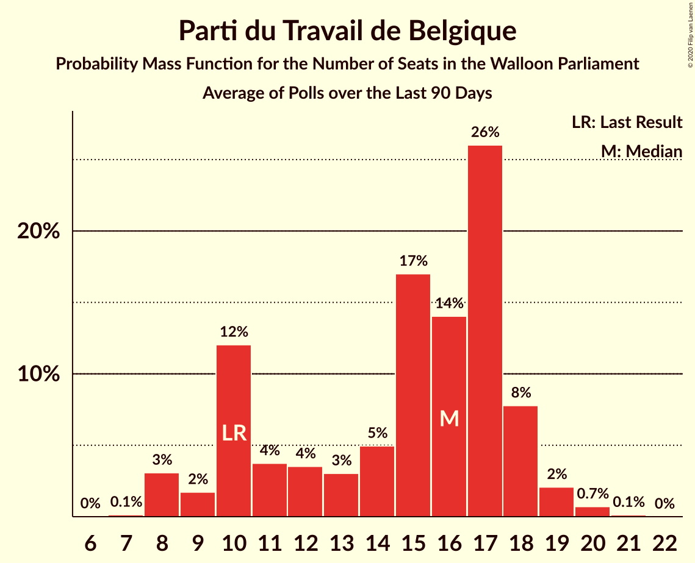

# Parti du Travail de Belgique

<a href="#voting-intentions">Voting Intentions</a> | <a href="#seats">Seats</a>

## Voting Intentions

Last result: **13.7%** (General Election of 26 May 2019)

### Confidence Intervals

| Period     | Polling firm/Commissioner(s) | Median | 80% Confidence Interval | 90% Confidence Interval | 95% Confidence Interval | 99% Confidence Interval |
|:----------:|:----------------:|:-----------:|:-----------------------:|:-----------------------:|:-----------------------:|:-----------------------:|
| N/A | [Poll Average](average.html) | 18.8% | 17.2–20.4% | 16.7–20.9% | 16.3–21.3% | 15.6–22.2% |
| [7–14 September 2021](2021-09-14-Ipsos.html) | Ipsos   Het Laatste Nieuws, Le Soir, RTL TVi and VTM | 18.7% | 17.1–20.4% | 16.7–20.9% | 16.3–21.4% | 15.6–22.2% |
| [25 May–1 June 2021](2021-06-01-Ipsos.html) | Ipsos   Het Laatste Nieuws, Le Soir, RTL TVi and VTM | 19.1% | 17.5–20.7% | 17.1–21.2% | 16.7–21.6% | 16.0–22.5% |
| [4–9 March 2021](2021-03-09-Ipsos.html) | Ipsos   Het Laatste Nieuws, Le Soir, RTL TVi and VTM | 19.0% | 17.5–20.7% | 17.0–21.2% | 16.6–21.6% | 15.9–22.5% |
| [2–8 December 2020](2020-12-08-Ipsos.html) | Ipsos   Het Laatste Nieuws, Le Soir, RTL TVi and VTM | 17.2% | 15.7–18.8% | 15.3–19.3% | 15.0–19.7% | 14.3–20.5% |
| [2–8 October 2020](2020-10-08-Ipsos.html) | Ipsos   Het Laatste Nieuws, Le Soir, RTL TVi and VTM | 18.9% | 17.4–20.5% | 16.9–21.0% | 16.6–21.4% | 15.9–22.3% |
| [28 August–1 September 2020](2020-09-01-Dedicated.html) | Dedicated   Soirmag | 15.4% | 12.9–18.4% | 12.2–19.3% | 11.6–20.1% | 10.5–21.6% |
| [10–15 June 2020](2020-06-15-Ipsos.html) | Ipsos   Het Laatste Nieuws, Le Soir, RTL TVi and VTM | 18.7% | 17.1–20.3% | 16.7–20.8% | 16.4–21.2% | 15.6–22.0% |
| [4–9 March 2020](2020-03-09-Ipsos.html) | Ipsos   Het Laatste Nieuws, Le Soir, RTL TVi and VTM | 18.6% | 17.1–20.3% | 16.6–20.7% | 16.3–21.2% | 15.6–22.0% |
| [29 November–6 December 2019](2019-12-06-Ipsos.html) | Ipsos   Het Laatste Nieuws, Le Soir, RTL TVi and VTM | 16.5% | 15.0–18.1% | 14.6–18.5% | 14.3–18.9% | 13.6–19.7% |
| [2–10 September 2019](2019-09-10-Ipsos.html) | Ipsos   Het Laatste Nieuws, Le Soir, RTL TVi and VTM | 15.5% | 14.1–17.1% | 13.7–17.5% | 13.4–17.9% | 12.8–18.7% |

### Probability Mass Function

The following table shows the probability mass function per percentage block of voting intentions for the [poll average](average.html) for Parti du Travail de Belgique.

| Voting Intentions | Probability | Accumulated | Special Marks |
|:-----------------:|:-----------:|:-----------:|:-------------:|
| 13.5–14.5% | 0% | 100% | Last Result |
| 14.5–15.5% | 0.4% | 100% |  |
| 15.5–16.5% | 3% | 99.6% |  |
| 16.5–17.5% | 13% | 96% |  |
| 17.5–18.5% | 27% | 83% |  |
| 18.5–19.5% | 30% | 56% | Median |
| 19.5–20.5% | 18% | 27% |  |
| 20.5–21.5% | 7% | 9% |  |
| 21.5–22.5% | 2% | 2% |  |
| 22.5–23.5% | 0.2% | 0.2% |  |
| 23.5–24.5% | 0% | 0% |  |

## Seats

Last result: **10** seats (General Election of 26 May 2019)

### Confidence Intervals

| Period     | Polling firm/Commissioner(s) | Median | 80% Confidence Interval | 90% Confidence Interval | 95% Confidence Interval | 99% Confidence Interval |
|:----------:|:----------------:|:------:|:-----------------------:|:-----------------------:|:-----------------------:|:-----------------------:|
| N/A | [Poll Average](average.html) | 17 | 15–18 | 15–18 | 14–19 | 13–20 |
| [7–14 September 2021](2021-09-14-Ipsos.html) | Ipsos   Het Laatste Nieuws, Le Soir, RTL TVi and VTM | 17 | 15–18 | 15–18 | 14–19 | 13–20 |
| [25 May–1 June 2021](2021-06-01-Ipsos.html) | Ipsos   Het Laatste Nieuws, Le Soir, RTL TVi and VTM | 17 | 15–17 | 15–18 | 14–18 | 14–20 |
| [4–9 March 2021](2021-03-09-Ipsos.html) | Ipsos   Het Laatste Nieuws, Le Soir, RTL TVi and VTM | 17 | 15–18 | 15–18 | 15–19 | 15–20 |
| [2–8 December 2020](2020-12-08-Ipsos.html) | Ipsos   Het Laatste Nieuws, Le Soir, RTL TVi and VTM | 15 | 14–17 | 13–17 | 12–17 | 10–18 |
| [2–8 October 2020](2020-10-08-Ipsos.html) | Ipsos   Het Laatste Nieuws, Le Soir, RTL TVi and VTM | 17 | 15–18 | 15–19 | 15–19 | 14–20 |
| [28 August–1 September 2020](2020-09-01-Dedicated.html) | Dedicated   Soirmag | 13 | 10–16 | 8–17 | 8–17 | 8–19 |
| [10–15 June 2020](2020-06-15-Ipsos.html) | Ipsos   Het Laatste Nieuws, Le Soir, RTL TVi and VTM | 17 | 15–17 | 15–18 | 15–19 | 15–20 |
| [4–9 March 2020](2020-03-09-Ipsos.html) | Ipsos   Het Laatste Nieuws, Le Soir, RTL TVi and VTM | 16 | 15–17 | 15–18 | 15–18 | 14–20 |
| [29 November–6 December 2019](2019-12-06-Ipsos.html) | Ipsos   Het Laatste Nieuws, Le Soir, RTL TVi and VTM | 15 | 13–16 | 11–17 | 10–17 | 10–17 |
| [2–10 September 2019](2019-09-10-Ipsos.html) | Ipsos   Het Laatste Nieuws, Le Soir, RTL TVi and VTM | 15 | 10–15 | 10–16 | 10–16 | 10–17 |

### Probability Mass Function

The following table shows the probability mass function per seat for the [poll average](average.html) for Parti du Travail de Belgique.

| Number of Seats | Probability | Accumulated | Special Marks |
|:---------------:|:-----------:|:-----------:|:-------------:|
| 10 | 0.1% | 100% | Last Result |
| 11 | 0.1% | 99.9% |  |
| 12 | 0.1% | 99.9% |  |
| 13 | 0.3% | 99.7% |  |
| 14 | 4% | 99.5% |  |
| 15 | 18% | 95% |  |
| 16 | 24% | 77% |  |
| 17 | 42% | 54% | Median |
| 18 | 9% | 12% |  |
| 19 | 2% | 3% |  |
| 20 | 0.5% | 0.6% |  |
| 21 | 0.1% | 0.1% |  |
| 22 | 0% | 0% |  |

