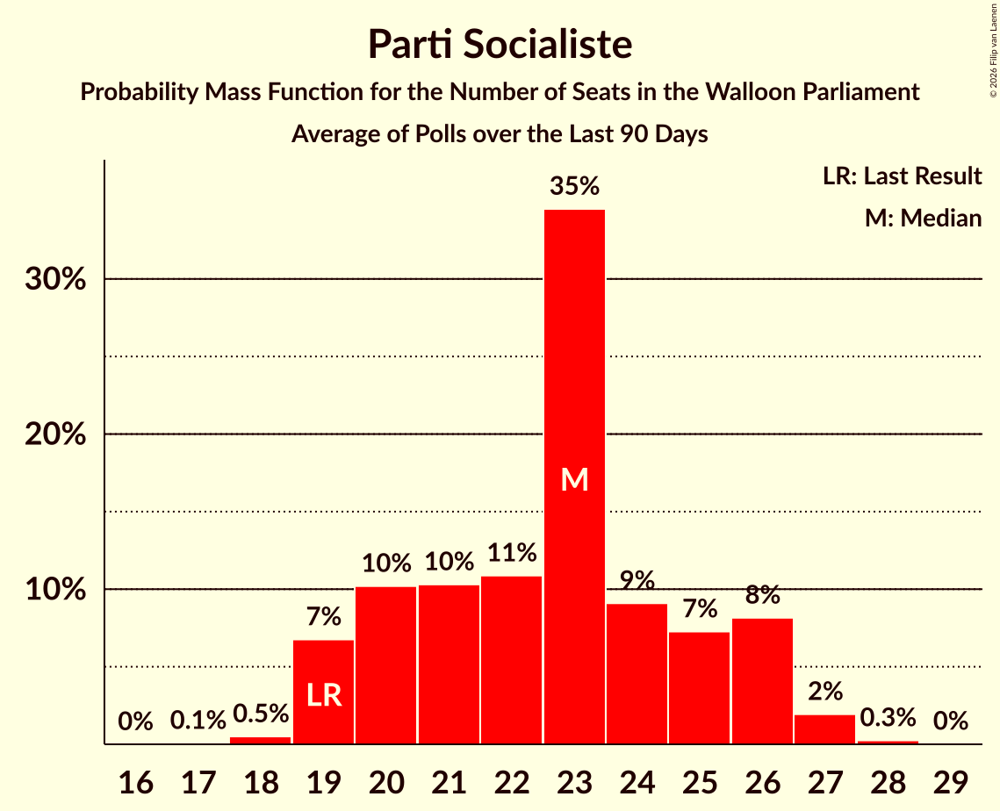

# Parti Socialiste

<a href="#voting-intentions">Voting Intentions</a> | <a href="#seats">Seats</a>

## Voting Intentions

Last result: **23.2%** (General Election of 9 June 2024)

### Confidence Intervals

| Period     | Polling firm/Commissioner(s) | Median | 80% Confidence Interval | 90% Confidence Interval | 95% Confidence Interval | 99% Confidence Interval |
|:----------:|:----------------:|:-----------:|:-----------------------:|:-----------------------:|:-----------------------:|:-----------------------:|
| N/A | [Poll Average](average.html) | 26.6% | 24.0–30.3% | 23.6–30.9% | 23.3–31.5% | 22.6–32.5% |
| [1–9 June 2026](2026-06-09-Ipsos.html) | Ipsos   Het Laatste Nieuws, Le Soir, RTL TVi and VTM | 29.0% | 27.3–30.9% | 26.7–31.5% | 26.3–31.9% | 25.5–32.9% |
| [9 March–5 April 2026](2026-04-05-BpactandUniversiteitAntwerpenULB.html) | Bpact and Universiteit Antwerpen & ULB   De Standaard, RTBF and VRT | 24.9% | 23.6–26.2% | 23.3–26.6% | 23.0–26.9% | 22.4–27.5% |
| [2–9 March 2026](2026-03-09-Ipsos.html) | Ipsos   Het Laatste Nieuws, Le Soir, RTL TVi and VTM | 27.9% | 26.1–29.8% | 25.6–30.3% | 25.2–30.7% | 24.4–31.6% |
| [1–9 December 2025](2025-12-09-Ipsos.html) | Ipsos   Het Laatste Nieuws, Le Soir, RTL TVi and VTM | 29.0% | 27.2–30.9% | 26.7–31.4% | 26.3–31.9% | 25.4–32.8% |
| [16–23 September 2025](2025-09-23-Ipsos.html) | Ipsos   Het Laatste Nieuws, Le Soir, RTL TVi and VTM | 26.2% | 24.5–28.0% | 24.0–28.6% | 23.6–29.0% | 22.8–29.9% |
| [27 May–3 June 2025](2025-06-03-Ipsos.html) | Ipsos   Het Laatste Nieuws, Le Soir, RTL TVi and VTM | 25.5% | 23.8–27.3% | 23.3–27.8% | 22.9–28.3% | 22.1–29.2% |
| [3–24 March 2025](2025-03-24-BpactandUniversiteitAntwerpenULB.html) | Bpact and Universiteit Antwerpen & ULB   De Standaard, RTBF and VRT | 24.3% | 23.1–25.6% | 22.7–25.9% | 22.5–26.2% | 21.9–26.9% |
| [4–11 March 2025](2025-03-11-Ipsos.html) | Ipsos   Het Laatste Nieuws, Le Soir, RTL TVi and VTM | 25.8% | 24.1–27.6% | 23.6–28.2% | 23.2–28.6% | 22.4–29.5% |
| [18–21 November 2024](2024-11-21-Ipsos.html) | Ipsos   Het Laatste Nieuws, Le Soir, RTL TVi and VTM | 24.6% | 22.9–26.4% | 22.4–26.9% | 22.0–27.4% | 21.2–28.3% |
| [11–17 September 2024](2024-09-17-Ipsos.html) | Ipsos   Het Laatste Nieuws, Le Soir, RTL TVi and VTM | 21.7% | 20.1–23.4% | 19.6–23.9% | 19.3–24.4% | 18.5–25.2% |

### Probability Mass Function

The following table shows the probability mass function per percentage block of voting intentions for the [poll average](average.html) for Parti Socialiste.

| Voting Intentions | Probability | Accumulated | Special Marks |
|:-----------------:|:-----------:|:-----------:|:-------------:|
| 20.5–21.5% | 0% | 100% |  |
| 21.5–22.5% | 0.4% | 100% |  |
| 22.5–23.5% | 4% | 99.6% | Last Result |
| 23.5–24.5% | 14% | 96% |  |
| 24.5–25.5% | 19% | 81% |  |
| 25.5–26.5% | 12% | 62% |  |
| 26.5–27.5% | 8% | 51% | Median |
| 27.5–28.5% | 11% | 43% |  |
| 28.5–29.5% | 14% | 32% |  |
| 29.5–30.5% | 11% | 18% |  |
| 30.5–31.5% | 5% | 8% |  |
| 31.5–32.5% | 2% | 2% |  |
| 32.5–33.5% | 0.4% | 0.4% |  |
| 33.5–34.5% | 0.1% | 0.1% |  |
| 34.5–35.5% | 0% | 0% |  |

## Seats

Last result: **19** seats (General Election of 9 June 2024)

### Confidence Intervals

| Period     | Polling firm/Commissioner(s) | Median | 80% Confidence Interval | 90% Confidence Interval | 95% Confidence Interval | 99% Confidence Interval |
|:----------:|:----------------:|:------:|:-----------------------:|:-----------------------:|:-----------------------:|:-----------------------:|
| N/A | [Poll Average](average.html) | 23 | 20–26 | 19–26 | 19–26 | 18–27 |
| [1–9 June 2026](2026-06-09-Ipsos.html) | Ipsos   Het Laatste Nieuws, Le Soir, RTL TVi and VTM | 24 | 23–26 | 22–26 | 21–27 | 19–28 |
| [9 March–5 April 2026](2026-04-05-BpactandUniversiteitAntwerpenULB.html) | Bpact and Universiteit Antwerpen & ULB   De Standaard, RTBF and VRT | 21 | 19–23 | 19–23 | 19–23 | 18–24 |
| [2–9 March 2026](2026-03-09-Ipsos.html) | Ipsos   Het Laatste Nieuws, Le Soir, RTL TVi and VTM | 23 | 22–25 | 20–26 | 20–26 | 19–27 |
| [1–9 December 2025](2025-12-09-Ipsos.html) | Ipsos   Het Laatste Nieuws, Le Soir, RTL TVi and VTM | 24 | 23–26 | 22–26 | 21–27 | 20–27 |
| [16–23 September 2025](2025-09-23-Ipsos.html) | Ipsos   Het Laatste Nieuws, Le Soir, RTL TVi and VTM | 21 | 19–23 | 19–23 | 18–24 | 18–25 |
| [27 May–3 June 2025](2025-06-03-Ipsos.html) | Ipsos   Het Laatste Nieuws, Le Soir, RTL TVi and VTM | 20 | 19–23 | 18–23 | 18–23 | 17–24 |
| [3–24 March 2025](2025-03-24-BpactandUniversiteitAntwerpenULB.html) | Bpact and Universiteit Antwerpen & ULB   De Standaard, RTBF and VRT | 19 | 19–22 | 18–23 | 18–23 | 18–23 |
| [4–11 March 2025](2025-03-11-Ipsos.html) | Ipsos   Het Laatste Nieuws, Le Soir, RTL TVi and VTM | 21 | 19–23 | 19–23 | 18–23 | 17–25 |
| [18–21 November 2024](2024-11-21-Ipsos.html) | Ipsos   Het Laatste Nieuws, Le Soir, RTL TVi and VTM | 19 | 18–22 | 18–23 | 18–23 | 17–24 |
| [11–17 September 2024](2024-09-17-Ipsos.html) | Ipsos   Het Laatste Nieuws, Le Soir, RTL TVi and VTM | 18 | 17–19 | 16–19 | 16–19 | 16–21 |

### Probability Mass Function

The following table shows the probability mass function per seat for the [poll average](average.html) for Parti Socialiste.

| Number of Seats | Probability | Accumulated | Special Marks |
|:---------------:|:-----------:|:-----------:|:-------------:|
| 17 | 0.1% | 100% |  |
| 18 | 0.5% | 99.9% |  |
| 19 | 7% | 99.4% | Last Result |
| 20 | 10% | 93% |  |
| 21 | 10% | 82% |  |
| 22 | 11% | 72% |  |
| 23 | 35% | 61% | Median |
| 24 | 9% | 27% |  |
| 25 | 7% | 18% |  |
| 26 | 8% | 10% |  |
| 27 | 2% | 2% |  |
| 28 | 0.3% | 0.3% |  |
| 29 | 0% | 0% |  |

