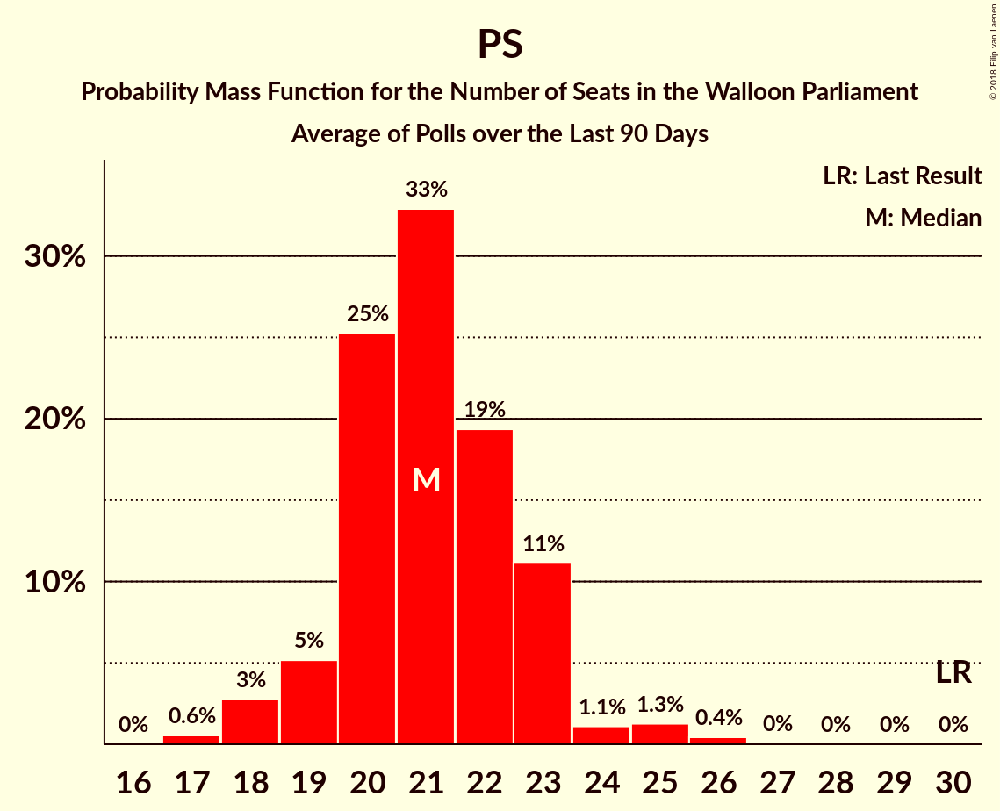

# PS

<a href="#voting-intentions">Voting Intentions</a> | <a href="#seats">Seats</a>

## Voting Intentions

Last result: **30.9%** (General Election of 25 May 2014)

### Confidence Intervals

| Period     | Polling firm/Commissioner(s) | Median | 80% Confidence Interval | 90% Confidence Interval | 95% Confidence Interval | 99% Confidence Interval |
|:----------:|:----------------:|:-----------:|:-----------------------:|:-----------------------:|:-----------------------:|:-----------------------:|
| N/A | [Poll Average](average.html) | 21.1% | 19.5–22.9% | 19.0–23.4% | 18.6–23.8% | 17.8–24.6% |
| [11 September–5 October 2017](2017-10-05-TNS.html) | TNS   De Standaard–VRT–RTBf–La Libre Belgique | 21.5% | 19.9–23.1% | 19.5–23.6% | 19.1–24.0% | 18.4–24.8% |
| [25 August–3 September 2017](2017-09-03-Ipsos.html) | Ipsos   RTL TVi–Le Soir–VTM–Het Laatste Nieuws | 20.7% | 19.1–22.5% | 18.7–23.0% | 18.3–23.4% | 17.5–24.3% |
| [23–27 June 2017](2017-06-27-Dedicated.html) | Dedicated   MR | 16.0% | 14.3–18.0% | 13.7–18.6% | 13.3–19.1% | 12.5–20.1% |
| [16–20 March 2017](2017-03-20-Dedicated.html) | Dedicated   RTBf–La Libre Belgique | 21.4% | 19.4–23.5% | 18.9–24.1% | 18.4–24.6% | 17.5–25.7% |
| [16–17 February 2017](2017-02-17-IVox.html) | iVox   Sudpresse | 21.3% | 19.7–23.0% | 19.2–23.5% | 18.9–23.9% | 18.1–24.8% |
| [10–17 January 2017](2017-01-17-Ipsos.html) | Ipsos   RTL TVi–Le Soir–VTM–Het Laatste Nieuws | 23.6% | 21.9–25.5% | 21.4–26.0% | 21.0–26.4% | 20.3–27.3% |
| [28–24 November 2016](2016-11-28-Dedicated.html) | Dedicated   RTBf–La Libre Belgique | 24.1% | 22.1–26.4% | 21.5–27.0% | 21.0–27.5% | 20.1–28.6% |
| [19–25 September 2016](2016-09-25-Ipsos.html) | Ipsos   RTL TVi–Le Soir–VTM–Het Laatste Nieuws | 24.7% | 23.0–26.6% | 22.5–27.1% | 22.1–27.5% | 21.3–28.4% |
| [2–6 September 2016](2016-09-06-Dedicated.html) | Dedicated   RTBf–La Libre Belgique | 25.1% | 23.0–27.3% | 22.5–27.9% | 22.0–28.5% | 21.0–29.6% |
| [6–12 May 2016](2016-05-12-Ipsos.html) | Ipsos   RTL TVi–Le Soir–VTM–Het Laatste Nieuws | 25.8% | 24.1–27.7% | 23.6–28.2% | 23.2–28.6% | 22.4–29.5% |
| [15–20 January 2016](2016-01-20-Ipsos.html) | Ipsos   RTL TVi–Le Soir–VTM–Het Laatste Nieuws | 26.7% | 25.0–28.5% | 24.5–29.0% | 24.1–29.5% | 23.3–30.4% |
| [5–9 September 2014](2014-09-09-Dedicated.html) | Dedicated   RTBf–La Libre Belgique | 31.1% | 28.9–33.4% | 28.2–34.1% | 27.7–34.7% | 26.6–35.8% |

### Probability Mass Function

The following table shows the probability mass function per percentage block of voting intentions for the [poll average](average.html) for PS.

| Voting Intentions | Probability | Accumulated | Special Marks |
|:-----------------:|:-----------:|:-----------:|:-------------:|
| 15.5–16.5% | 0% | 100% |  |
| 16.5–17.5% | 0.3% | 100% |  |
| 17.5–18.5% | 2% | 99.7% |  |
| 18.5–19.5% | 9% | 98% |  |
| 19.5–20.5% | 21% | 89% |  |
| 20.5–21.5% | 29% | 67% | Median |
| 21.5–22.5% | 23% | 38% |  |
| 22.5–23.5% | 11% | 15% |  |
| 23.5–24.5% | 3% | 4% |  |
| 24.5–25.5% | 0.5% | 0.6% |  |
| 25.5–26.5% | 0.1% | 0.1% |  |
| 26.5–27.5% | 0% | 0% |  |
| 27.5–28.5% | 0% | 0% |  |
| 28.5–29.5% | 0% | 0% |  |
| 29.5–30.5% | 0% | 0% |  |
| 30.5–31.5% | 0% | 0% | Last Result |

## Seats

Last result: **30** seats (General Election of 25 May 2014)

### Confidence Intervals

| Period     | Polling firm/Commissioner(s) | Median | 80% Confidence Interval | 90% Confidence Interval | 95% Confidence Interval | 99% Confidence Interval |
|:----------:|:----------------:|:------:|:-----------------------:|:-----------------------:|:-----------------------:|:-----------------------:|
| N/A | [Poll Average](average.html) | 19 | 17–21 | 16–21 | 16–21 | 16–21 |
| [11 September–5 October 2017](2017-10-05-TNS.html) | TNS   De Standaard–VRT–RTBf–La Libre Belgique | 19 | 19–21 | 18–21 | 16–21 | 16–21 |
| [25 August–3 September 2017](2017-09-03-Ipsos.html) | Ipsos   RTL TVi–Le Soir–VTM–Het Laatste Nieuws | 18 | 17–21 | 16–21 | 16–21 | 15–21 |
| [23–27 June 2017](2017-06-27-Dedicated.html) | Dedicated   MR | 15 | 12–16 | 12–16 | 11–16 | 9–18 |
| [16–20 March 2017](2017-03-20-Dedicated.html) | Dedicated   RTBf–La Libre Belgique | 19 | 18–20 | 17–21 | 16–21 | 16–23 |
| [16–17 February 2017](2017-02-17-IVox.html) | iVox   Sudpresse | 18 | 17–20 | 16–21 | 16–21 | 15–21 |
| [10–17 January 2017](2017-01-17-Ipsos.html) | Ipsos   RTL TVi–Le Soir–VTM–Het Laatste Nieuws | 21 | 20–24 | 19–24 | 18–25 | 18–26 |
| [28–24 November 2016](2016-11-28-Dedicated.html) | Dedicated   RTBf–La Libre Belgique | 21 | 19–23 | 19–24 | 19–25 | 17–27 |
| [19–25 September 2016](2016-09-25-Ipsos.html) | Ipsos   RTL TVi–Le Soir–VTM–Het Laatste Nieuws | 23 | 21–25 | 20–26 | 19–27 | 19–27 |
| [2–6 September 2016](2016-09-06-Dedicated.html) | Dedicated   RTBf–La Libre Belgique | 22 | 21–25 | 21–27 | 21–27 | 19–27 |
| [6–12 May 2016](2016-05-12-Ipsos.html) | Ipsos   RTL TVi–Le Soir–VTM–Het Laatste Nieuws | 24 | 22–26 | 21–27 | 21–28 | 21–29 |
| [15–20 January 2016](2016-01-20-Ipsos.html) | Ipsos   RTL TVi–Le Soir–VTM–Het Laatste Nieuws | 26 | 24–28 | 23–29 | 23–29 | 22–30 |
| [5–9 September 2014](2014-09-09-Dedicated.html) | Dedicated   RTBf–La Libre Belgique | 28 | 25–31 | 24–31 | 23–31 | 23–34 |

### Probability Mass Function

The following table shows the probability mass function per seat for the [poll average](average.html) for PS.

| Number of Seats | Probability | Accumulated | Special Marks |
|:---------------:|:-----------:|:-----------:|:-------------:|
| 15 | 0.5% | 100% |  |
| 16 | 5% | 99.5% |  |
| 17 | 14% | 94% |  |
| 18 | 11% | 80% |  |
| 19 | 50% | 69% | Median |
| 20 | 4% | 19% |  |
| 21 | 14% | 15% |  |
| 22 | 0.1% | 0.3% |  |
| 23 | 0.1% | 0.2% |  |
| 24 | 0% | 0% |  |
| 25 | 0% | 0% |  |
| 26 | 0% | 0% |  |
| 27 | 0% | 0% |  |
| 28 | 0% | 0% |  |
| 29 | 0% | 0% |  |
| 30 | 0% | 0% | Last Result |

