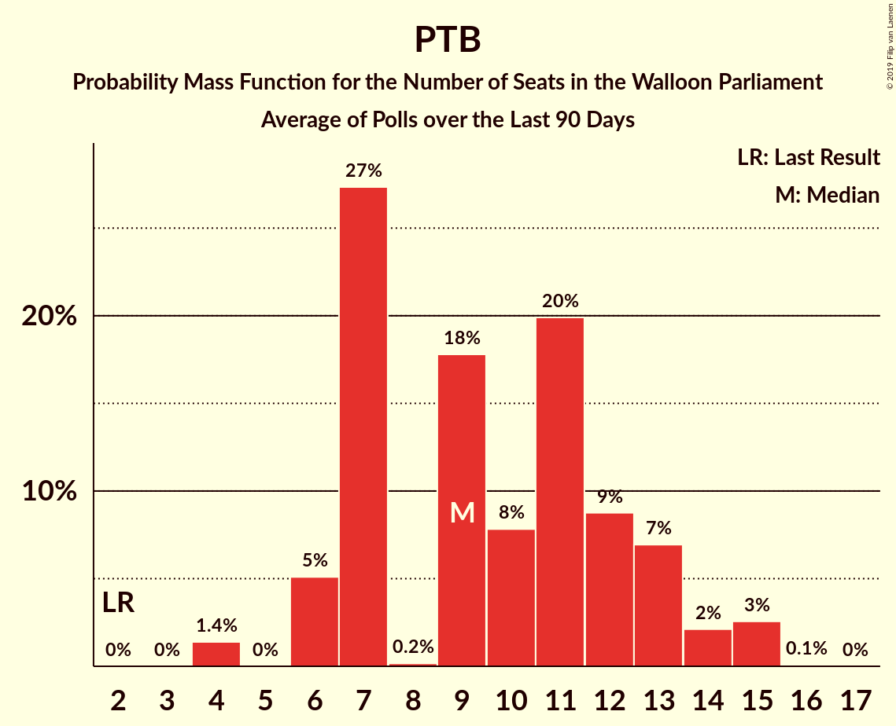

# PTB

<a href="#voting-intentions">Voting Intentions</a> | <a href="#seats">Seats</a>

## Voting Intentions

Last result: **5.8%** (General Election of 25 May 2014)

### Confidence Intervals

| Period     | Polling firm/Commissioner(s) | Median | 80% Confidence Interval | 90% Confidence Interval | 95% Confidence Interval | 99% Confidence Interval |
|:----------:|:----------------:|:-----------:|:-----------------------:|:-----------------------:|:-----------------------:|:-----------------------:|
| N/A | [Poll Average](average.html) | 16.8% | 13.9–20.0% | 13.5–20.6% | 13.1–21.1% | 12.4–22.0% |
| [27 November–4 December 2017](2017-12-04-Ipsos.html) | Ipsos   Het Laatste Nieuws–Le Soir–RTL Tvi–VTM | 18.9% | 17.4–20.6% | 17.0–21.1% | 16.6–21.5% | 15.9–22.3% |
| [11 September–5 October 2017](2017-10-05-TNS.html) | TNS   De Standaard–VRT–RTBf–La Libre Belgique | 14.8% | 13.5–16.2% | 13.1–16.7% | 12.8–17.0% | 12.2–17.8% |
| [25 August–3 September 2017](2017-09-03-Ipsos.html) | Ipsos   RTL TVi–Le Soir–VTM–Het Laatste Nieuws | 17.5% | 16.0–19.2% | 15.6–19.6% | 15.2–20.0% | 14.5–20.9% |
| [23–27 June 2017](2017-06-27-Dedicated.html) | Dedicated   MR | 25.0% | 22.8–27.3% | 22.2–27.9% | 21.7–28.5% | 20.7–29.6% |
| [16–20 March 2017](2017-03-20-Dedicated.html) | Dedicated   RTBf–La Libre Belgique | 20.0% | 18.2–22.1% | 17.6–22.7% | 17.2–23.2% | 16.3–24.2% |
| [16–17 February 2017](2017-02-17-IVox.html) | iVox   Sudpresse | 17.4% | 15.9–19.0% | 15.5–19.5% | 15.2–19.9% | 14.5–20.7% |
| [10–17 January 2017](2017-01-17-Ipsos.html) | Ipsos   RTL TVi–Le Soir–VTM–Het Laatste Nieuws | 16.3% | 14.9–18.0% | 14.5–18.4% | 14.1–18.8% | 13.5–19.6% |
| [28–24 November 2016](2016-11-28-Dedicated.html) | Dedicated   RTBf–La Libre Belgique | 16.8% | 15.1–18.8% | 14.6–19.4% | 14.2–19.9% | 13.4–20.9% |
| [19–25 September 2016](2016-09-25-Ipsos.html) | Ipsos   RTL TVi–Le Soir–VTM–Het Laatste Nieuws | 16.3% | 14.8–17.9% | 14.4–18.3% | 14.1–18.7% | 13.4–19.5% |
| [2–6 September 2016](2016-09-06-Dedicated.html) | Dedicated   RTBf–La Libre Belgique | 13.9% | 12.3–15.8% | 11.9–16.3% | 11.5–16.7% | 10.8–17.6% |
| [6–12 May 2016](2016-05-12-Ipsos.html) | Ipsos   RTL TVi–Le Soir–VTM–Het Laatste Nieuws | 13.5% | 12.2–14.9% | 11.8–15.3% | 11.5–15.7% | 10.9–16.4% |
| [31 March–4 April 2016](2016-04-04-Dedicated.html) | Dedicated   La Libre Belgique–RTBf | 10.4% | 9.3–11.8% | 8.9–12.2% | 8.7–12.5% | 8.1–13.2% |
| [15–20 January 2016](2016-01-20-Ipsos.html) | Ipsos   RTL TVi–Le Soir–VTM–Het Laatste Nieuws | 8.8% | 7.8–10.0% | 7.5–10.4% | 7.2–10.7% | 6.8–11.3% |
| [3–7 December 2015](2015-12-07-Dedicated.html) | Dedicated   La Libre Belgique–RTBf | 10.3% | 9.1–11.7% | 8.8–12.1% | 8.5–12.5% | 8.0–13.2% |
| [28 September–4 October 2015](2015-10-04-Ipsos.html) | Ipsos   Het Laatste Nieuws–Le Soir–RTL Tvi–VTM | 8.5% | 7.4–9.7% | 7.1–10.0% | 6.9–10.3% | 6.4–10.9% |
| [9–14 September 2015](2015-09-14-Dedicated.html) | Dedicated   La Libre Belgique–RTBf | 9.6% | 8.3–11.3% | 7.9–11.8% | 7.6–12.2% | 7.0–13.0% |
| [12–18 May 2015](2015-05-18-Dedicated.html) | Dedicated   La Libre Belgique–RTBf | 9.0% | 7.7–10.5% | 7.3–11.0% | 7.0–11.4% | 6.5–12.1% |
| [20–24 April 2015](2015-04-24-Ipsos.html) | Ipsos   Het Laatste Nieuws–Le Soir–RTL Tvi–VTM | 8.5% | 7.4–9.8% | 7.1–10.1% | 6.9–10.5% | 6.4–11.1% |
| [5–9 March 2015](2015-03-09-Dedicated.html) | Dedicated   La Libre Belgique–RTBf | 8.3% | 7.0–9.8% | 6.7–10.2% | 6.4–10.6% | 5.9–11.4% |
| [23–28 January 2015](2015-01-28-Ipsos.html) | Ipsos   Het Laatste Nieuws–Le Soir–RTL Tvi–VTM | 7.3% | 6.4–8.4% | 6.1–8.8% | 5.9–9.0% | 5.4–9.6% |
| [5–11 January 2015](2015-01-11-Ipsos.html) | Ipsos   Het Laatste Nieuws–Le Soir–RTL Tvi–VTM | 7.7% | 6.7–8.9% | 6.5–9.2% | 6.2–9.5% | 5.8–10.0% |
| [27 November–1 December 2014](2014-12-01-Dedicated.html) | Dedicated   La Libre Belgique–RTBf | 7.6% | 6.4–9.1% | 6.1–9.6% | 5.8–9.9% | 5.3–10.7% |
| [5–9 September 2014](2014-09-09-Dedicated.html) | Dedicated   RTBf–La Libre Belgique | 8.1% | 6.9–9.6% | 6.6–10.1% | 6.3–10.5% | 5.8–11.2% |

### Probability Mass Function

The following table shows the probability mass function per percentage block of voting intentions for the [poll average](average.html) for PTB.

| Voting Intentions | Probability | Accumulated | Special Marks |
|:-----------------:|:-----------:|:-----------:|:-------------:|
| 5.5–6.5% | 0% | 100% | Last Result |
| 6.5–7.5% | 0% | 100% |  |
| 7.5–8.5% | 0% | 100% |  |
| 8.5–9.5% | 0% | 100% |  |
| 9.5–10.5% | 0% | 100% |  |
| 10.5–11.5% | 0% | 100% |  |
| 11.5–12.5% | 0.7% | 100% |  |
| 12.5–13.5% | 5% | 99.3% |  |
| 13.5–14.5% | 14% | 94% |  |
| 14.5–15.5% | 17% | 80% |  |
| 15.5–16.5% | 11% | 63% |  |
| 16.5–17.5% | 8% | 52% | Median |
| 17.5–18.5% | 13% | 44% |  |
| 18.5–19.5% | 16% | 32% |  |
| 19.5–20.5% | 11% | 16% |  |
| 20.5–21.5% | 4% | 5% |  |
| 21.5–22.5% | 0.9% | 1.1% |  |
| 22.5–23.5% | 0.1% | 0.1% |  |
| 23.5–24.5% | 0% | 0% |  |

## Seats

Last result: **2** seats (General Election of 25 May 2014)

### Confidence Intervals

| Period     | Polling firm/Commissioner(s) | Median | 80% Confidence Interval | 90% Confidence Interval | 95% Confidence Interval | 99% Confidence Interval |
|:----------:|:----------------:|:------:|:-----------------------:|:-----------------------:|:-----------------------:|:-----------------------:|
| N/A | [Poll Average](average.html) | 14 | 11–18 | 10–18 | 10–19 | 9–20 |
| [27 November–4 December 2017](2017-12-04-Ipsos.html) | Ipsos   Het Laatste Nieuws–Le Soir–RTL Tvi–VTM | 17 | 15–18 | 15–19 | 14–20 | 13–20 |
| [11 September–5 October 2017](2017-10-05-TNS.html) | TNS   De Standaard–VRT–RTBf–La Libre Belgique | 12 | 10–13 | 10–14 | 10–14 | 9–15 |
| [25 August–3 September 2017](2017-09-03-Ipsos.html) | Ipsos   RTL TVi–Le Soir–VTM–Het Laatste Nieuws | 15 | 13–17 | 13–17 | 13–18 | 11–18 |
| [23–27 June 2017](2017-06-27-Dedicated.html) | Dedicated   MR | 22 | 20–24 | 19–24 | 19–24 | 17–26 |
| [16–20 March 2017](2017-03-20-Dedicated.html) | Dedicated   RTBf–La Libre Belgique | 18 | 16–19 | 16–20 | 15–20 | 14–21 |
| [16–17 February 2017](2017-02-17-IVox.html) | iVox   Sudpresse | 15 | 13–16 | 12–17 | 12–17 | 11–17 |
| [10–17 January 2017](2017-01-17-Ipsos.html) | Ipsos   RTL TVi–Le Soir–VTM–Het Laatste Nieuws | 15 | 12–16 | 12–16 | 11–16 | 10–17 |
| [28–24 November 2016](2016-11-28-Dedicated.html) | Dedicated   RTBf–La Libre Belgique | 15 | 12–17 | 12–17 | 10–17 | 10–18 |
| [19–25 September 2016](2016-09-25-Ipsos.html) | Ipsos   RTL TVi–Le Soir–VTM–Het Laatste Nieuws | 14 | 12–16 | 12–16 | 11–16 | 10–17 |
| [2–6 September 2016](2016-09-06-Dedicated.html) | Dedicated   RTBf–La Libre Belgique | 12 | 10–13 | 9–13 | 9–14 | 9–15 |
| [6–12 May 2016](2016-05-12-Ipsos.html) | Ipsos   RTL TVi–Le Soir–VTM–Het Laatste Nieuws | 11 | 10–13 | 9–13 | 9–14 | 8–15 |
| [31 March–4 April 2016](2016-04-04-Dedicated.html) | Dedicated   La Libre Belgique–RTBf | 8 | 7–9 | 7–9 | 7–9 | 6–10 |
| [15–20 January 2016](2016-01-20-Ipsos.html) | Ipsos   RTL TVi–Le Soir–VTM–Het Laatste Nieuws | 7 | 6–8 | 6–8 | 6–9 | 5–9 |
| [3–7 December 2015](2015-12-07-Dedicated.html) | Dedicated   La Libre Belgique–RTBf | 8 | 7–9 | 7–9 | 7–9 | 6–10 |
| [28 September–4 October 2015](2015-10-04-Ipsos.html) | Ipsos   Het Laatste Nieuws–Le Soir–RTL Tvi–VTM | 7 | 6–8 | 6–8 | 5–8 | 4–9 |
| [9–14 September 2015](2015-09-14-Dedicated.html) | Dedicated   La Libre Belgique–RTBf | 8 | 6–9 | 6–9 | 6–9 | 4–10 |
| [12–18 May 2015](2015-05-18-Dedicated.html) | Dedicated   La Libre Belgique–RTBf | 7 | 6–8 | 5–8 | 4–9 | 4–9 |
| [20–24 April 2015](2015-04-24-Ipsos.html) | Ipsos   Het Laatste Nieuws–Le Soir–RTL Tvi–VTM | 7 | 6–8 | 5–8 | 4–8 | 4–9 |
| [5–9 March 2015](2015-03-09-Dedicated.html) | Dedicated   La Libre Belgique–RTBf | 7 | 5–8 | 4–8 | 4–8 | 4–9 |
| [23–28 January 2015](2015-01-28-Ipsos.html) | Ipsos   Het Laatste Nieuws–Le Soir–RTL Tvi–VTM | 6 | 4–7 | 4–7 | 4–7 | 4–8 |
| [5–11 January 2015](2015-01-11-Ipsos.html) | Ipsos   Het Laatste Nieuws–Le Soir–RTL Tvi–VTM | 6 | 4–7 | 4–7 | 4–8 | 4–8 |
| [27 November–1 December 2014](2014-12-01-Dedicated.html) | Dedicated   La Libre Belgique–RTBf | 6 | 4–7 | 4–7 | 4–8 | 3–8 |
| [5–9 September 2014](2014-09-09-Dedicated.html) | Dedicated   RTBf–La Libre Belgique | 6 | 4–7 | 4–8 | 4–8 | 3–8 |

### Probability Mass Function

The following table shows the probability mass function per seat for the [poll average](average.html) for PTB.

| Number of Seats | Probability | Accumulated | Special Marks |
|:---------------:|:-----------:|:-----------:|:-------------:|
| 2 | 0% | 100% | Last Result |
| 3 | 0% | 100% |  |
| 4 | 0% | 100% |  |
| 5 | 0% | 100% |  |
| 6 | 0% | 100% |  |
| 7 | 0% | 100% |  |
| 8 | 0% | 100% |  |
| 9 | 0.8% | 100% |  |
| 10 | 6% | 99.2% |  |
| 11 | 17% | 93% |  |
| 12 | 9% | 76% |  |
| 13 | 13% | 67% |  |
| 14 | 4% | 54% | Median |
| 15 | 6% | 50% |  |
| 16 | 17% | 44% |  |
| 17 | 17% | 28% |  |
| 18 | 7% | 11% |  |
| 19 | 2% | 4% |  |
| 20 | 1.3% | 2% |  |
| 21 | 0.2% | 0.2% |  |
| 22 | 0% | 0% |  |

